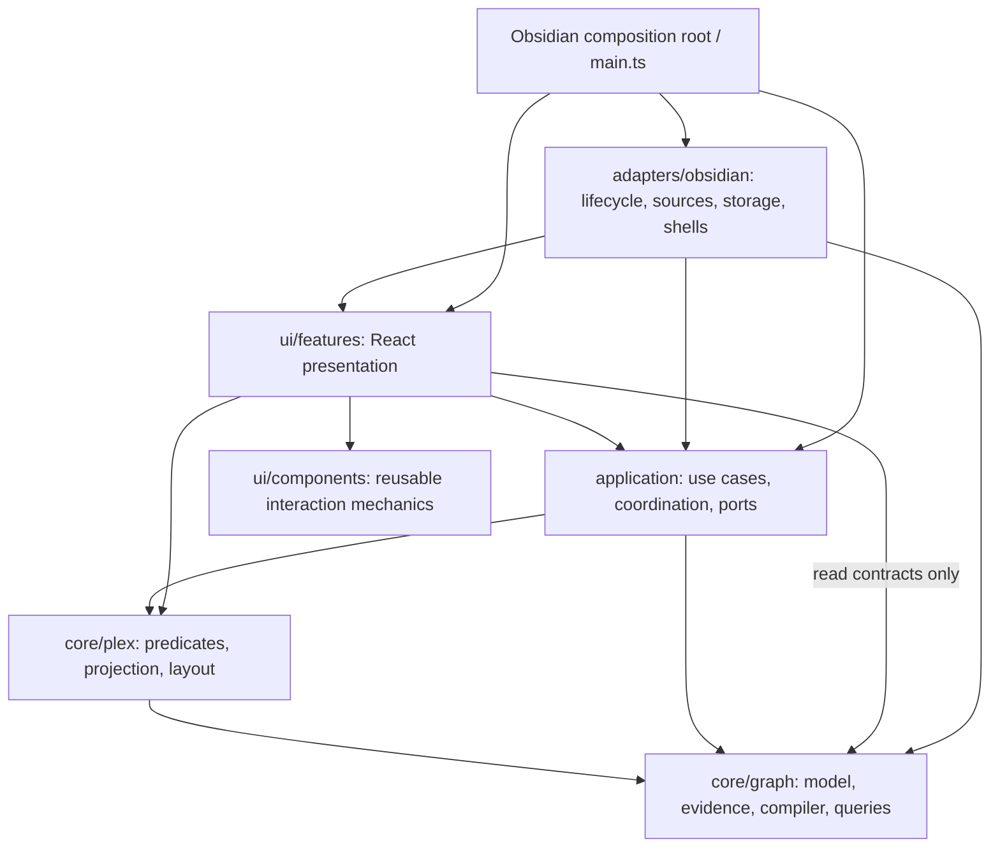
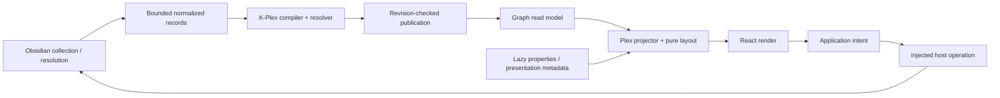

# K-Plex refactor plan and checkpoint ledger

Design reviewed against `main` at `3ac122e` on 2026-09-24. C00 baseline work began on `kplex-refactor` at `9b8e8c0` on 2026-09-25; see the ledger and `docs/REFACTOR_BASELINE.md` for current evidence.

## 1. Objective and scope

Create an architecture that supports continued agent-assisted enhancement with a small, explicit regression surface, and separates K-Plex's knowledge-graph and Plex behavior from Obsidian so a future PKM integration is feasible.

This is a behavior-preserving refactor. It is not a new graph engine, UI redesign, second-host integration, package split, or persistence migration. Keep Obsidian as the only production host. A small in-memory host is a test, not another application.

This file is the execution order, checkpoint ledger, decision log, and handoff record. `AGENTS.md` remains the repository's agent instruction source; `docs/ARCHITECTURE.md` will describe implemented architecture. Neither a proposed directory nor a planned interface counts as completed architecture.

Before each checkpoint, inspect the current source, callers, tests, and working tree. Paths below are verified starting points, not permission to ignore later repository changes. Preserve unrelated user work. Implement one checkpoint, or one explicitly recorded subcheckpoint, per agent session. Do not implement the whole document in one run.

### Changes from the draft

- Establish architecture rules and regression characterization **before** UI extraction, rather than waiting until after a complete component migration.
- Retain a small UI-first pass, but make collection/form abstractions conditional on real duplication; portability must not wait for a design-system project.
- Distinguish import direction from runtime data flow. Application code calls interfaces it owns; it never imports their Obsidian implementations.
- Strengthen existing `FuzzySearchInput`, evidence/resolver, parser, and `PlexScene` seams instead of recreating them.
- Define identity, source normalization, graph publication, invalidation, lifetime, and mutation behavior explicitly. Removing imports is necessary but insufficient.
- Prove host independence incrementally, starting with contracts and predicates. The final proof must not use the current Obsidian test stub or `window` shim.
- Replace broad work packages with checkpoints that name source seams, verifications, manual risks, and completion evidence.

## 2. Repository findings and baseline evidence

| Area | Observed implementation | Consequence for this plan |
| --- | --- | --- |
| Build | npm; Node `>=22.22.2 <23`; TypeScript checking plus esbuild; Obsidian types `1.13.0` | Keep the real build. Do not copy the Excalidraw plugin's Rollup workflow into K-Plex. |
| Test lane | `npm test` runs `scripts/run-indexing-tests.mjs` and `tests/indexing.test.mjs` | Existing tests are valuable but are not a portable-core proof or browser interaction suite. |
| Test mechanics | Source-text assertions plus selected TypeScript modules transpiled into a temporary directory; Obsidian/UI stubs and `globalThis.window = globalThis` | Code moves can fail source assertions without changing behavior; host globals can be concealed by the harness. Migrate protections deliberately. |
| Data model | `src/types.ts`: `GraphPage.file: TFile \| null`, path identity, mutable neighbor maps, transient section fields | Introduce new host-free read contracts and boundary mapping before replacing the legacy model. |
| Indexing | `GraphBuilder.ts` (~1,680 lines), `GraphIndex.ts` (~2,127), `main.ts` (~3,701) | Collection, compilation, persistence, presentation, and lifecycle already have partial seams; extract one responsibility at a time. |
| Semantic foundation | `RelationEvidence.ts`, `RelationResolver.ts`, `GraphState.ts`, `fieldParser.ts` | Reuse these implementations. Resolver/parser cooperative paths still use `window.setTimeout`; direct-import checks alone miss that coupling. |
| Lenses | `GraphPredicateEngine` takes `App`; `GraphLens.ts` takes `GraphIndex` | A lazy property provider and narrow evidence/read interfaces are early portability wins. |
| Layout | `src/ui/layout.ts` already exports `PlexScene`; `PlexGraph.tsx` is ~2,608 lines | Evolve the scene contract and extract derivation; do not invent a parallel scene engine. |
| Shared UI | `FuzzySearchInput.tsx` already owns selection/keyboard/portal mechanics, but imports `ObsidianIcon`; `LongPressTooltip.ts` owns delegated gestures | Reuse these. A button wrapper must not install a second long-press system. |
| Host UI/settings | `settings.ts` combines schema, defaults, migration, declarative settings and manager modals | Separate contracts from shells; do not replace native declarative settings with a new React settings framework. |
| Compatibility duplicate | Both `NewRelatedNoteModal.ts` and `.tsx` exist; esbuild deliberately prefers `.ts` | Preserve synchronization and extension resolution until an explicit retirement decision. |
| Automation | No architecture script in `package.json`; inspected workflows do not provide the required PR test/build/architecture lane | Add that lane early, on the actual working/default branch. Existing CodeQL targets `master`, while this checkout is on `main`. |

Review validation on Node **22.22.2**:

- `npm test`: passed, including the reported indexing 1–33/P1–P17, section 34–50, cache/predicate/incremental 51–59, creation/imagery 60–66, additive ontology 67–68, and placeholder/materialization groups.
- `npm run build`: passed against installed dependencies; `dist/main.js`, `dist/manifest.json`, and `dist/styles.css` produced.
- Initial shell selected Node 18; both commands were rerun using the installed Node 22.22.2 runtime. Future agents must check `node --version` before interpreting results.
- No Obsidian desktop, pop-out, physical-mobile, CodeScanner, or large-vault performance run was performed in this design review. These remain implementation gates where relevant.
- Working tree initially contained this draft as an untracked file. No source changes were made for the design review. Generated build output is not a source fix.

### Known documentation conflicts to resolve in C00

`AGENTS.md` has an older deletion paragraph saying deletion must not navigate, followed by a later **Deletion navigation invariant** requiring immediate history navigation; `tests/indexing.test.mjs` asserts the latter. Preserve immediate history navigation while retaining inbound-evidence/ghost semantics. Correct the stale paragraph with evidence in C00, not by silently changing runtime behavior.

The expanded-view text also mentions a fixed sibling `0.85` multiplier while the layout contract and `siblingScale()` use the configured 30%–85% multiplier. Characterize and document the existing configured behavior. Treat disagreements about intended product behavior as explicit decisions, not opportunities to redesign during extraction.

Some indexing documentation lags test coverage and current UI labels. Update only the parts needed to make the refactor contract unambiguous; avoid unrelated documentation churn.

## 3. Architecture decisions

### 3.1 Import dependencies

**Every arrow below means “may import.”** Runtime callbacks through an interface do not reverse these arrows.



Core may use small host-free utilities. Application and feature UI may use shared contract types. Components may use React, ReactDOM portals, and standard DOM types; they may not import domain policy, plugin classes, or Obsidian helpers. Graph does not import Plex, React, application, host, DOM, Node built-ins, or browser storage.

Place capability interfaces at the **lowest layer that needs them**: a cooperative-work contract used by the compiler belongs in core; a navigation port used by an application use case belongs in application. Never make core import application merely because all interfaces were placed in an application folder.

Suggested homes, created only when an actual extraction lands:

```text
src/core/graph/         identities, evidence, resolver, compilation, read contracts
src/core/plex/          predicates, scene projection, pure layout calculations
src/core/contracts/    only small shared host-free contracts actually needed
src/application/       use cases, coordination, application ports and revisions
src/adapters/obsidian/ source collection, mutations, storage, lifecycle, UI shells
src/ui/components/     domain-independent React mechanics
src/ui/features/       portable feature content consuming application/Plex contracts
src/main.ts            Obsidian plugin entry and composition root
```

Existing paths may remain compatibility facades while consumers migrate. Do not add barrel exports that conceal outward dependencies. Do not create a monorepo, npm packages, generic service locator, or universal `PKMAdapter`.

### 3.2 Runtime flow



The second diagram shows flow, not imports. React rendering must not perform semantic classification, arbitrary vault reads, or graph mutation. Host adapters provide source facts and execute effects; K-Plex owns precedence, reconciliation and ontology meaning.

### 3.3 Contracts that must be decided before extraction

| Contract | Decision and required proof |
| --- | --- |
| Identity | Introduce a named opaque `NodeId` concept. Initially preserve exact existing ID strings, including Obsidian paths and synthetic IDs. Core treats them as exact identifiers; it must not lowercase them, split `/`, infer a file extension, or parse `folder:` to discover kind. Adapt existing case-insensitive/path lookup in Obsidian compatibility code. Do not migrate persisted IDs during this refactor. Test IDs such as `entity:alpha`, unrelated labels, and case-distinct opaque IDs. |
| Kind vs availability | Represent document/attachment/container/tag/URL and resolved/unresolved state explicitly; a missing `TFile` is no longer the discriminator. Preserve all existing behaviors and synthetic-node conventions at the adapter boundary. Do not invent a schema for every future block-oriented PKM. |
| Host lookup | Adapter-owned lookup maps IDs to current `TFile`/host objects. Revalidate after rename/delete and before a write. Never store `unknown hostObject`, `App`, plugin, `WorkspaceLeaf`, or DOM objects in a core DTO. |
| Provenance | Keep declaring entity, declaration target, source kind, field, raw value, location and inverse perspective. Do not discard overridden evidence or merge duplicate declarations just because the visible edge looks identical. Source kinds may retain current names such as `obsidian-link`; a descriptive string is not a runtime dependency. Host location metadata may carry plain path/line/range data; only the adapter interprets it for navigation/editing. |
| Source records | Normalize host facts, reference-resolution results and semantic inputs, not final classified edges. Preserve source tiers, multiplicity, unresolved text, source-relative resolution, and revision information. Do not flatten frontmatter and body into one indistinguishable property map. |
| Properties | Lens lookup remains lazy and synchronous for today's cached Obsidian metadata. Supply only requested property values for materialized candidates. No arbitrary frontmatter dump in graph records, snapshots or IndexedDB. A future asynchronous host can preload a bounded presentation snapshot outside evaluation; do not introduce that infrastructure now. |
| Optional file semantics | Current `file.*`/`file.inFolder()` expressions remain compatible using an optional file metadata facet. Core never derives this from `NodeId`. Absent metadata follows characterized missing-value behavior; do not invent folders in hosts without them or change the saved lens syntax. |
| Settings | Separate semantic, presentation, and host/runtime views with narrowly named contracts. Keep persisted keys/defaults/migration unchanged, including legacy spellings. Do not import `settings.ts` into new core just for a type, expose the entire settings object through a port, or sanitize away unknown persisted keys. |
| State ownership | Builder owns private mutable work. The graph repository owns publication and committed per-file patches. Consumers get readonly views with stable revision boundaries, not mutable repository access. Avoid deep-copying the entire graph to obtain apparent immutability. Do not promise runtime immutability that a TypeScript `readonly` alone does not enforce. |
| Revisions/invalidation | Keep source revisions, committed graph revisions, presentation/settings revisions and view-local state distinct. Semantic changes update graph/search/affected caches at the same commit boundary. Sorting, lenses, visibility, title settings, pan/zoom and history do not rebuild semantics. A title change may refresh search terms independently. |
| Scheduling | Inject cancellation, time and cooperative-yield operations where needed. Preserve current slice budgets/read limits initially. No bare `window` or `Platform` in portable code; scheduler/runtime policy comes from the host. Cancellation remains distinguishable from failure and “needs rebuild.” |
| Lifetime | Plugin composition owns shared services; each view owns subscriptions, scene state, React root and interaction cleanup. Define disposal and late-result suppression on each extracted service. Hidden-but-mounted views do not count as visible indexing demand. Owner-document UI resources and shared storage are separate concerns. |
| Persistence | Existing settings/history/bookmarks/lenses are durable user data. Parsed-body and semantic graph stores are derived caches. Preserve formats, versions, storage names and atomic active-generation publication. Schema changes, if unavoidable, need a separate migration checkpoint with preservation/recovery tests. |
| Mutations | Application coordinates semantic intent, optimistic updates and reconciliation; Obsidian adapter owns YAML/file writes, native creation policy and trash. Keep provenance eligibility rules in one place. Report cancel/failure distinctly; failed writes must not leave false optimistic relationships. Do not claim a transaction across multiple native file writes. |

### 3.4 UI boundary and host-policy compatibility

- Keep Obsidian `Modal`, native menus, declarative settings, workspace leaves, editor integration, Sidecar, previews and icon acquisition in host shells. These need not become portable widgets.
- Continue using Lucide through Obsidian `getIcon()`. Reusable controls accept an icon slot or a small injected rendering capability; they do not import `ObsidianIcon` transitively. No second icon library.
- Reuse delegated long-press tooltip ownership. One gesture has one owner; consuming a long press must suppress its subsequent click. Do not emulate a native button's normal keyboard behavior unnecessarily.
- Use a small `--kplex-*` token layer for migrated reusable components only. Obsidian shell CSS maps it to existing theme variables. Preserve community themes, contrast, focus, disabled states, and existing feature classes during migration.
- Tokens and scoped styles must also reach body portals in the owning document, not only descendants of `.excalibrain-app`. Verify modal stacking and pop-outs explicitly.
- Portable React renders its own elements. Keep imperative Obsidian DOM-helper use in the host layer; importing helpers, relying on patched DOM prototypes, or wrapping them under another name does not make code portable. Keep scanner-compatible styling and scheduling.
- Do not migrate every native settings manager to React just to share a list. Share headless mechanics only when two actual consumers benefit.

### 3.5 View modes: projection policy and layout strategy

Keep an explicit distinction within `core/plex` between **what a view includes** and **where it places it**:

- **Projection policy** selects the bounded neighborhood, expansion depth and sibling inclusion, preserving semantic roles and evidence. Condensed/expanded presentation and sibling visibility are explicit options; they must not become duplicated graph-query implementations.
- **Layout strategy** consumes that projection and determines positions, zones, connector routing and the mapping of semantic roles to physical gates. The current structured Plex is the first strategy. A future rotated layout can reuse the same projection; a mindmap may combine a different bounded projection policy with a different layout strategy.
- **Scene/rendering contract** carries semantic identities/roles separately from physical positions and gate sides. Interaction code uses the strategy's explicit role-to-gate mapping, including the reverse mapping for drag/drop intent, instead of assuming that “top means parent.” Rotation changes presentation, not relationship meaning.

Keep mode/options in presentation state scoped to the owning view; include them in projection/layout cache keys. Switching modes must not rebuild or mutate the semantic graph. Preserve current persisted settings and defaults through boundary mapping during the refactor.

Introduce only the seam and the current behavior in C19/C20. Do not build a mode registry, plugin framework, mindmap or rotated product feature now. Future strategies should reuse the graph, predicates, provenance and application intents while supplying their own presentation policy and geometry.

## 4. Verification contract

### 4.1 Required lanes

Current commands are `npm test` and `npm run build`. C02 will add the **proposed** commands `npm run check:architecture` and `npm run verify`; C08 will add `npm run check:core`. Do not claim these commands exist before their checkpoint lands.

After introduction, `verify` runs architecture checks, portable-core type checking, all non-host test suites, and the real production build. Keep `npm test` as the aggregate non-host behavioral regression entry point as suites are added. These commands must work without an installed/running Obsidian application. CI must run the same aggregate lane; a standalone test file that no script invokes is not a guardrail. Add a separate `verify:obsidian` lane in C02 for real-host checks as described in section 4.6.

The existing harness transpiles selected files without full cross-module type checking. It must remain supplemented by the real repository build against installed Obsidian declarations. A second host-free lane must compile/import actual portable modules without stubbing their dependencies.

### 4.2 Architecture checks

Use the installed TypeScript parser/module resolver or another small maintainable dependency-graph implementation; a grep for `from "obsidian"` is only a diagnostic.

The checker must cover static imports, exports/re-exports, type-only imports and `import()` types, literal dynamic imports/require, aliases (`@/*`), and transitive reachability. Reject unresolved or nonliteral loading escape hatches in portable areas unless explicitly accounted for. Track forbidden globals/API families as well as imports: core cannot use `window`, `document`, `localStorage`, IndexedDB, Obsidian DOM extensions, Node filesystem APIs, or a plugin recovered through a global.

Start with migrated roots only, but check their entire reachable graph. A core module importing a legacy helper that imports Obsidian is a violation. Exception records name the exact edge, reason, owning checkpoint and removal condition; no directory-wide permanent exemption and no automatic baseline regeneration. New code must not increase the legacy coupling allowance.

Give the checker tests that deliberately violate rules, including a type-only leak and a transitive leak, and one permitted host-to-core import. Fail on newly introduced cycles between migrated layers. Use a dedicated core TypeScript config with ES libraries, no DOM libraries and no ambient Node/Obsidian types; do not rely on compiler configuration alone to prevent explicit forbidden imports.

### 4.3 Behavioral comparison, not snapshot blessing

Before moving a covered behavior, map its current assertions to the invariant they protect. Keep source-string checks until equivalent behavioral coverage exists. A mechanical path update is acceptable for a structural check; deleting assertions, keeping dead strings to appease them, or rewriting expectations to match a regression is not.

Capture normalized baseline results **before** altering the implementation. Compare:

- node identity/kind/resolution and structural membership;
- resolved roles, defined/inferred status, directions, hidden state and ontology definitions;
- evidence declarations and active/overridden decisions, original declaring direction and locations;
- neighborhoods, gate totals, search ordering and relevant presentation outputs;
- full-build versus incremental results after edit/rename/delete/materialize sequences;
- persisted decode/encode meaning and warm-restore behavior.

Sort unordered maps/sets for comparison and remove only documented nondeterministic fields. Never erase provenance, direction, duplicate declarations or ordering that is user-visible to make a comparison pass. Keep goldens stable until a separately approved product change. Where a temporary old/new comparison is useful, run it in tests; do not retain two complete graphs or compilers in production.

### 4.4 Risk-based verification matrix

Use the lane codes below in checkpoint records. All implementation checkpoints still run the aggregate tests/build and active architecture checks.

| Lane | Automated checks | Manual or measured evidence |
| --- | --- | --- |
| G — semantics | Compatibility fixture; explicit/frontmatter vs body; all roles/inverses; hidden/previous/next; folder/tag/URL/date/attachment/ghost; evidence decisions | Connection details and representative node navigation in Obsidian when adapter behavior changes. |
| I — incremental/lifecycle | Full vs incremental equivalence; semantic no-op; cancel mid-file/batch; stale revision; dirty backlog; optimistic edit during build; subscriber sees only committed state | Startup burst, hidden tab, reveal, close last view, reopen, unload during work; large vault and physical iOS for pipeline changes. |
| P — persistence | Settings compatibility; cold/warm restore; corrupt/stale/partial snapshot; generation activation; blocked storage fallback; late connection disposal; interrupted parse reuse | Reload existing vault/profile; cold interrupted/resumed iOS indexing. Use test storage, never clear user data for convenience. |
| U — interaction | Button activation/disabled; keyboard/focus/selection/Escape; outside pointer; focus restoration; busy/error; cleanup with a DOM-capable test harness | Main window and pop-out; light/dark/community theme; modal/body portal; physical touch/long press when touched. Desktop emulation cannot sign off touch. |
| X — Plex/layout | Deterministic scene output; keep-layout/reflow; gate shown/total vs hasAny; style-only lens; sections/folding/provenance; no graph mutation/rebuild | Zone symmetry, lateral bottom alignment, scroll packing, expanded children, sibling scale, camera preservation. |
| M — mutation/navigation | Success/cancel/failure/stale target; provenance-safe writes; optimistic rollback; deletion history; owning-view routing | Real temporary-vault YAML edits/trash, linked/unlinked/pinned tabs, Sidecar ownership and source-line navigation; platform-specific host behavior as touched. |
| H — host independence | Type/import checks plus clean-process tests with no Obsidian/DOM/window shim, host-free records and fake scheduler/provider | Demonstrates core reuse only; does not claim a working Logseq/Tana integration or host-independent native UI. |
| O — Obsidian automation | Capability preflight; deploy exact local build to a test vault; CLI-driven application/UI/performance scenarios exercising relevant G/I/P/U/X/M checks | Capture assertions, diagnostics, screenshots and measurements; record unsupported pop-out/device scenarios separately. Required when the affected host checks have a configured capable environment. |

For DOM behavior tests, select a minimal harness in C03 and record the choice. Do not bolt React UI tests onto the indexing suite's fake `window`. A DOM emulator can validate interaction contracts; actual Obsidian and physical touch remain separate evidence.

### 4.5 Performance evidence

C00 records a repeatable procedure using a representative large vault or non-private synthetic equivalent (20,000+ files / 100,000+ graph/search entries). Record device/OS/Obsidian version, dataset size, cold/warm cache state, duration, body reads, full/patch counts, maximum synchronous slice where measurable, and peak-memory observations. Keep vault contents out of committed artifacts.

For hot-path changes compare before/after on the same environment. Require zero new full rebuilds for presentation-only actions, no full evidence scan for a per-file patch, no arbitrary property copies, and no extra whole-vault body reads on a fresh warm restore. Preserve bounded reads, time slicing and iOS prewarm behavior. Agree numeric timing/memory tolerances from actual baseline measurements in C00; do not invent universal millisecond budgets or use flaky CI timing as the sole gate. If measurements are unavailable, record performance validation as pending.

### 4.6 Environment-aware host automation for coding agents

Codex, Claude Code and other implementing agents should run applicable real-host tests themselves whenever a configured Obsidian environment is available. Keep this workflow in repository scripts and contributor/agent instructions, independent of the agent product. Automate repeatable application, UI and performance checks; do not equate a successful reload or a screenshot with a passed scenario.

**Verified CLI basis (2026-09-25):** The official CLI controls the desktop application, which must run and may be launched by a command. Detect the installed version and commands using `obsidian version` and `obsidian help`; installation of Obsidian alone does not establish CLI readiness. Explicit `vault=<name-or-id>` comes before the command. Available developer commands include `plugin:reload`, `dev:dom`, `dev:css`, `dev:screenshot`, `dev:errors`, `dev:console`, `eval` and `dev:cdp`. Recheck local help instead of assuming a fixed capability set. [Official CLI reference](https://help.obsidian.md/cli).

**Separate the runners:** Keep shared fixtures, scenario expectations and result records independent of the host. Put CLI invocation, deployment and UI-driving details in test infrastructure such as `scripts/testing/obsidian/` and `tests/host/obsidian/`, outside shipped `src/` and the core dependency graph. Future hosts can implement their own driver and applicability list; do not build a universal automation framework now. No Obsidian CLI dependency belongs in portable tests, production runtime, or generic application contracts.

**Local build and test loop:**

1. Preflight the CLI, desktop connection, required commands and explicitly configured test-vault identity/path/config directory. Use bounded timeouts. Record versions and capabilities; distinguish missing setup from a command/assertion failure. Never fall back to the currently active personal vault. Establish a dedicated fixture vault, following [Obsidian's development-vault guidance](https://docs.obsidian.md/Plugins/Getting%20started/Build%20a%20plugin), and keep machine-specific paths out of committed configuration.
2. Run `verify`, then stage this checkout's `dist/main.js`, `dist/manifest.json` and `dist/styles.css` into that vault's plugin directory for `k-plex`. `kplex-test` is a disposable playground: overwrite prior plugin bundles without backing them up. Validate destination and artifact hashes; keep plugin data/settings for warm-restore cases unless a scenario explicitly resets them. Disable the test plugin while replacing artifacts, then enable/reload through the CLI. Restart the test application when required by manifest changes. `plugin:install` installs a community plugin; it does not deploy an unpublished local build. Do not test a downloaded release instead of the changed code.
3. Drive the relevant fixture scenarios through registered commands and real UI input. Discover command IDs rather than invent them. Use DOM/CSS assertions and screenshots for rendering; use CLI-supported CDP/input automation where available for keyboard/pointer/focus flows. Direct `eval` invocation of application methods is useful for state checks but does not prove UI event wiring. Wait for observable readiness and expected state with deadlines, not arbitrary long sleeps.
4. Assert outcomes and capture errors/console output per scenario. For performance, use section 4.5's datasets, repetitions and cold/warm conditions; distinguish CLI round-trip time, indexing completion and visible rendering. Any temporary measurement hooks stay development/test-only and are removed or disabled in production. Verify pop-out target/window coverage explicitly; if the driver cannot reach it, leave that scenario pending.
5. Emit a machine-readable report plus failure evidence: source revision and dirty-tree/build identity, artifact hashes, runtime/OS/host versions, capabilities, fixture/settings/viewport, scenario IDs, assertions, timings and screenshot/log paths. A process exit code alone is not success. Clean up only resources owned by the test run; preserve artifacts needed to diagnose failures. Run cold-state cleanup only in the designated disposable fixture storage.

**Availability and acceptance rules:**

- Normal CI and machines without Obsidian run `verify` and portable/DOM-emulated scenarios. Record required Obsidian scenarios as **unavailable/pending**, with the reason and rerun command/artifact identity. Continue independent work; do not silently count a skip as host validation.
- An explicitly requested `verify:obsidian` run, or a dedicated host CI job, is strict: missing prerequisites, timeouts and failed assertions return nonzero. A separate preflight can report unavailable without failing the portable lane. Once a capable target is configured, agents run relevant host scenarios rather than routinely handing them back as manual tasks.
- For a future non-Obsidian implementation, mark Obsidian-specific scenarios **not applicable** with the target/reason and run that host's relevant integration checks. Absence of Obsidian on a machine does not make checks for the Obsidian product inapplicable.
- Automated evidence may satisfy a previously manual desktop gate when it tests the same behavior. Screenshots without assertions/review, desktop mobile emulation and synthetic clicks do not establish physical touch or platform-specific lifecycle correctness. Keep unautomated device/accessibility/platform checks explicit; do not promise universal full automation.
- A later equipped environment reruns pending scenarios against the exact build under acceptance. Source changes invalidate affected earlier results. Final acceptance of the Obsidian refactor still requires its applicable host gates; portable progress does not depend on installing Obsidian everywhere.

## 5. Agent execution and tracking protocol

1. Read this ledger and applicable `AGENTS.md`; inspect branch/status and checkpoint prerequisites.
2. State the selected checkpoint, exact behavior seam, current consumers, invariants, expected touched files and verification lanes. If a checkpoint contains several risky extractions, create lettered subrows before editing and execute only the first.
3. Characterize any missing behavior before moving it. Make the smallest extraction and migrate one representative consumer; retain an explicit facade if necessary.
4. Run required checks, including applicable CLI-driven host scenarios when a configured capable environment is available (section 4.6), inspect the full diff, and search for remaining callers, obsolete imports, accidental schema changes and diagnostics. Do not suppress failures to finish a checkpoint.
5. Update the ledger, append an action record and update architecture/component docs only for implemented contracts. Record exact verification evidence and the next small step.
6. Stop at the checkpoint boundary. Local build deployment to the configured disposable test vault is part of verification; do not commit, publish or deploy to a personal/production vault unless separately requested. Do not ask again for permission for routine authorized edits/checks.

If a product-policy conflict cannot be resolved from current instructions and tests, record it and ask one focused question; continue independent work. If manual validation is unavailable, mark **Review** rather than **Done**. Do not fabricate a smoke test or block independent work just because a device is unavailable. Dependent high-risk expansion waits for its prerequisite acceptance evidence.

Status values: **Pending**, **Active**, **Review** (code checks pass; named validation outstanding), **Done**, **Blocked** (specific dependency/decision), **Deferred** (explicit scope reason). A deferred optional UI checkpoint does not block core work. Reverted checkpoints return to Pending with an action-log entry.

Completion requires: stated behavior preserved, production consumer migrated (unless explicitly a test/contract checkpoint), required lanes passed, no unapproved persisted changes, cleanup owner identified, and log updated. A facade or “legacy” module must have a finite consumer list and named retirement checkpoint.

Rollback is normally a reviewable reversal of that checkpoint's code and tests, preserving unrelated work. Because persisted formats remain unchanged, restoring the previous implementation should read the same data. Never use destructive Git reset or delete caches/user data as a substitute for a rollback design. Test-harness/checker checkpoints may be rolled back independently; semantic comparison failures block later semantic work.

### Progress ledger

IDs C00–C26 replace the draft's numbering. All implementation statuses start Pending; the review evidence above is a seed for C00, not completion of its manual baseline.

| ID | Deliverable | Prerequisites | Lanes | Status / evidence |
| --- | --- | --- | --- | --- |
| C00 | Baseline, conflicts, invariant inventory | — | G/I/P/U/X/M | Review — Node 22 test/build, inventory and exact-build CLI render smoke pass; geometry/interaction and large-vault performance pending (see baseline doc) |
| C01 | Behavior characterization and test seams | C00 | G/I/X | Done — canonical graph/evidence/scene fixture, pair comparison, stub guard and source-check map; Node 22 test/build pass |
| C02 | Dependency rules, checker, PR verification and optional-host runner | C01 | H/O | Pending |
| C03 | Token/icon seam and one action primitive | C02 | U | Pending |
| C04 | Floating-layer mechanics from existing consumers | C03 | U | Pending |
| C05 | Host-free shared suggester | C04 | U | Pending |
| C06 | Shared collection mechanics, if justified | C05 | U | Pending; optional |
| C07 | Form/dialog content, if justified | C05 | U/M | Pending; optional |
| C08 | Host-free graph/settings contracts and identity seam | C02 | G/H | Pending |
| C09 | Narrow graph read interfaces | C08 | G/X/H | Pending |
| C10 | Lazy property provider and portable predicates | C09 | G/X/H | Pending |
| C11 | Normalized source contract and test records | C08 | G/H | Pending |
| C12 | Obsidian source collection boundary | C11 | G/I/P | Pending |
| C13 | Host-free full compiler/resolver/parser path | C12 | G/I/H | Pending |
| C14 | Incremental compiler and commit contract | C13 | G/I/H | Pending |
| C15 | Index demand/revision coordinator | C14 | I/P | Pending |
| C16 | Snapshot/cache orchestration behind storage ports | C15 | P/I/H | Pending |
| C17 | Search extraction | C09, C14 | G/I/H | Pending |
| C18 | Presentation metadata/settings ownership | C10, C17 | X/I/H | Pending |
| C19 | Plex projector using existing scene pipeline | C18 | G/X/H | Pending |
| C20 | Pure layout and transient-section projection | C19 | X/I/U/H | Pending |
| C21 | View-scoped navigation intents | C09 | M/U | Pending |
| C22 | Relationship mutation intent and host writer | C14, C21 | G/M/I | Pending |
| C23 | Creation/materialization/deletion intents | C22 | G/M/I/P | Pending |
| C24 | Explicit Obsidian shells and composition cleanup | C05, C16, C20, C23 | U/M/P | Pending |
| C25 | Complete enforcement and retire migration facades | C24 | all | Pending |
| C26 | End-to-end in-memory proof and final acceptance | C25 | H + all relevant | Pending |

Recommended order is table order, with C06/C07 deferred unless demonstrably useful. C21 can occur earlier if it unlocks a specific portable UI consumer. Do not postpone all boundary tests to C26.

### Required subdivisions for larger checkpoints

These parent checkpoints are **not single-session implementation tasks**. Execute the listed slices in order; add a ledger subrow and action record for each as it starts. Parent status becomes Done only after all required slices pass. Each slice retains the parent's verification lanes and must build with the remaining legacy paths.

| Parent | Prescribed independently reviewable slices |
| --- | --- |
| C02 | C02a: architecture rules/checker and portable CI lane; C02b: host capability preflight, local-build staging and minimal CLI smoke/report runner. Extend scenarios with the checkpoints that need them; do not wait for a complete UI test framework. |
| C12 | C12a: file/container/tag source facts; C12b: resolved/unresolved link and ontology occurrences; C12c: remaining Date/URL/body source facts and complete collector wiring. Inventory exact source ownership first so overlapping source kinds are not emitted twice. |
| C14 | C14a: characterize patch outcomes, observer visibility and cancellation boundaries; C14b: move staging/commit behavior intact behind the compiler contract and migrate the production patch path. |
| C16 | C16a: serialization codecs separated from host binding; C16b: snapshot generation orchestration/storage port; C16c: body-cache/parser service ownership. Keep the active-generation transaction inside its storage implementation. |
| C18 | C18a: labels and sort inputs; C18b: style/visibility and invalidation; C18c: lazy imagery and host title-script boundary. |
| C19 | C19a: ordinary center projection; C19b: filter/lens/count and keep-layout/reflow paths; C19c: expanded-neighbor paths. |
| C20 | C20a: pure numeric layout; C20b: section acquisition/projection separation. |
| C22 | C22a: additive relationship intent; C22b: relink; C22c: provenance-safe unlink. |
| C23 | C23a: creation and folder-child flow; C23b: ghost materialization; C23c: deletion/history/cleanup. |
| C24 | C24a: remaining modal/menu/settings/editor host shells; C24b: view/workspace/Sidecar integration ownership; C24c: composition and lifecycle cleanup. Split either shell family further if it spans distinct lifetimes. |

Do not mechanically extract code into a new service whose constructor still takes the plugin. That only relocates coupling. When a slice cannot stay buildable without a broader rewrite, add a temporary narrow facade and record its callers/removal checkpoint instead.

## 6. Checkpoint playbook

### C00 — Establish baseline and freeze observable behavior

**Inspect:** `AGENTS.md`, package/build/test scripts, `docs/INDEXING_ARCHITECTURE.md`, compatibility fixture README, `types.ts`, and the major files in section 2.

**Change:** Record baseline revision/runtime, test/build results, known failures, performance procedure and representative UI captures. Create a compact invariant-to-test/manual-check table in `docs/REFACTOR_BASELINE.md`. Resolve the documented deletion/sibling instruction inconsistencies against current behavior; record remaining decisions. Inventory duplicated UI mechanics and direct/transitive host dependencies without attempting cleanup.

**Verify/exit:** Real Node 22 build/test passed or pre-existing failures explicitly recorded; baseline includes all seven node categories, existing settings restore, Sidecar ownership, gate semantics, sections, filters and touch behavior. List unavailable device checks explicitly. No runtime changes.

**Main risk/manual:** Freezing an accidental or contradictory expectation. Compare observed behavior to tests and current product rules before declaring a golden baseline.

### C01 — Make regression protections survive code movement

**Inspect:** `tests/indexing.test.mjs`, its explicit transpile list, stubs and source-text assertions.

**Change:** Add reusable canonical graph/evidence comparison helpers and baseline fixtures. Separate test harness plumbing from behavioral assertions where necessary; preserve aggregate coverage and invocation. For the first planned extractions, replace brittle source placement checks with tests that exercise the protected behavior. Document remaining source checks and their intended invariant. Do not rewrite all tests at once.

**Verify/exit:** Intentionally break one fixture expectation to prove the lane fails, then restore it; full/patch output comparison retains suppressed evidence and direction. Test helpers compile newly extracted imports instead of silently stubbing the implementation under test. Existing suites still run.

**Main risk/manual:** Green tests after losing an assertion. Review assertion mapping; no host smoke needed for test-only changes.

### C02 — Add the architecture contract and executable guardrails

**Change:** Create `docs/ARCHITECTURE.md` with the import diagram, layer ownership, current migration status and feature-placement guide. Add the scoped dependency checker and its negative tests from section 4.2. Introduce `check:architecture` and aggregate `verify`, and a PR CI job on the actual default branch using supported Node 22, installed lockfile dependencies, tests and build. Add `check:core` to the aggregate only when C08 creates it.

C02b adds section 4.6's environment-aware `verify:obsidian` runner and documents one-time test-vault/CLI setup in contributor guidance. Start with exact-build deployment, opening K-Plex, a real rendered-state assertion and error capture. Test preflight/report/failure handling without Obsidian; execute the real smoke test when available and keep that evidence pending otherwise. A host-unavailable C02b review must not block independent portable checkpoints; only checks requiring its actual host evidence wait. Add UI/performance scenarios as their behavior is extracted.

Update `AGENTS.md` with rules for new/migrated areas, not claims that legacy code has already moved. Record exact grandfathered roots/edges and removal checkpoints. Rules include transitive/type-only coupling, no plugin escape hatches, single semantics owner, and no weakening tests to accommodate moves.

**Verify/exit:** A deliberate direct, transitive and type-only leak fails locally; permitted adapter-to-core imports pass. CI configuration invokes the same lane; report remote CI as unverified until it actually runs. No false claim that empty folders prove independence.

### C03 — Extract one action primitive and establish styling/icon seams

**Inspect:** `App.tsx`, `ThoughtNode.tsx`, `ObsidianIcon.tsx`, `LongPressTooltip.ts`, `styles.css`; select two genuinely equivalent buttons.

**Change:** Add a minimal reusable button with native button semantics, accessible name, disabled state and icon slot. Map only its required K-Plex tokens in host CSS. Reuse the delegated tooltip scope; document which layer owns it. Migrate two controls with equivalent interaction contracts. Introduce a focused DOM behavior lane and `docs/UI_COMPONENTS.md` describing only implemented primitives.

**Verify/exit (U):** Mouse/keyboard action fires once; disabled action never fires; long press consumes click; no duplicate `title` tooltip; icon/theme/focus unchanged. Check main/pop-out and real mobile long press. Shared primitive and its reachable imports are host-free.

**Do not:** Convert every button, change toolbar layout, introduce another icon source, or create a general design system.

### C04 — Extract floating-layer mechanics from working code

**Inspect:** `FuzzySearchInput.tsx`, `PlexFilter.tsx`, `RelationPopover.tsx` and their distinct focus/modal behavior.

**Change:** Extract owner-document portal, anchor positioning, dismissal and cleanup into a small hook/component. Start with one existing consumer; record a second consumer migration as C04b if interaction policy differs. Share mechanics, not modal focus policy. Pass portal/theme context explicitly rather than hard-code `.excalibrain-app` into a supposedly generic layer.

**Verify/exit (U):** Outside pointer and Escape close the intended layer only; focus returns correctly; resize/scroll reposition; nested portal interaction does not count as outside; body portal receives tokens and appears above modal/Sidecar. Unmount/window close removes listeners/observers/scheduled work. Main/pop-out and physical mobile if pointer handling changes.

### C05 — Make the existing suggester host-free

**Inspect:** Existing `FuzzySearchInput`, `SearchBox`, and canonical `NewRelatedNoteModal.ts` call sites.

**Change:** Move/evolve `FuzzySearchInput`, use the proven floating layer and icon injection. Keep ranking/filtering/results in callers. Use compatibility exports while needed. Preserve search vs relationship-picker differences: open-on-focus, closed-until-typing, retained selection and Ctrl/Cmd+Enter defaults. Keep canonical `.ts` and compatibility `.tsx` synchronized.

**Verify/exit (U):** Up/Down, Enter, Escape, selection scroll, focus, clearing/reopening, empty results, disabled state, composition/IME input and outside click. Result ordering unchanged. Relationship Link remains a separate commit action; Placeholder never becomes default create. No host import anywhere in the shared component's dependency graph.

### C06 — Consolidate collection mechanics only when justified

**Inspect:** Searchable style/ontology managers in `settings.ts` and existing React feature lists. Identify two consumers with the same behavior; list their differences first.

**Change:** Extract the smallest shared list/search/count/empty/show-more mechanics, or mark Deferred with the reason duplication does not justify it. Native declarative settings remain native. Domain filtering, sort, validation and mutations stay with callers.

**Verify/exit (U):** Counts, ordering, selection and pagination unchanged; no horizontal/nested scrolling regression on small screens. No whole-collection rendering introduced. Document actual reuse, not a hypothetical component catalog.

### C07 — Separate small dialog content when it helps

**Inspect:** Small rename/note-type/creation dialogs before complex relationship composition.

**Change:** Extract one shared field/action-row/busy/error primitive only if supported by repeated behavior. Keep `Modal` lifecycle, shortcuts and mounting in the Obsidian shell. Give async work an explicit owner and avoid acting on a disposed dialog. Defer if converting native UI would cost more than it saves.

**Verify/exit (U/M):** Validation, focus/Enter/Escape, double-submit prevention, cancel during async work and write failure; reopen has no stale state. Existing modal UX and native settings conventions preserved.

### C08 — Establish host-free types without migrating persisted identity

**Inspect:** `types.ts`, `GraphState.ts`, `RelationEvidence.ts`, `IndexSnapshot.ts`, schema/default sections of `settings.ts`, consumers of `page.file` and path parsing.

**Change:** Introduce identity/kind/resolution/read DTOs and minimal semantic settings types per section 3.3. Map legacy pages at a narrow boundary; avoid cloning every page/map per render. Separate needed settings contracts from the host settings implementation. Add `check:core` with restricted libraries/types and clean-process type/runtime tests. Keep the production legacy storage/model until migrated consumers prove the mapping.

**Verify/exit (G/H):** Every existing node kind and unresolved/URL/folder/tag mapping represented; no `TFile`, plugin, DOM or host settings import in new contracts. Pathless/case-distinct opaque-ID fixtures pass. Existing IDs, settings serialization and restore behavior unchanged. Mapper overhead is bounded and measured if used on a hot path.

### C09 — Narrow read interfaces and migrate one real consumer

**Inspect:** Read usage in `layout.ts`, `GraphLens.ts`, `PlexGraph.tsx` and search.

**Change:** Extract small lookup/neighborhood/evidence/search contracts based on actual consumers, starting with one. The current `GraphIndex` facade implements them and maps legacy objects to C08 views. Separate semantic relationships from presentation-filtered neighborhood queries; do not rename today's filtered query into a misleading “raw graph” API. Hide mutable maps and plugin access.

**Verify/exit (G/X/H):** One production path compiles against the interface, reads no `TFile` and preserves output; fake read-model tests use plain IDs/data. Search for concrete-index reach-through in that migrated path. Record remaining consumers rather than pretending the facade is gone.

### C10 — Extract lazy properties and portable predicate/lens evaluation

**Inspect:** `GraphPredicateEngine`, `GraphLens.ts`, `GraphLensSimple.ts`, `SimplePlexFilter.ts`, dependency-driven refresh callers.

**Change:** Replace `App` with a narrow cached-property/file-facet provider and replace `GraphIndex` evidence reach-through with C09 contracts. Keep AST/parser/evaluator semantics and persisted expressions intact. Separate metadata refresh notifications from graph rebuild requests.

**Verify/exit (G/X/H):** Clean-process tests for missing/null/list/scalar/negative operators, exact vs case-normalized comparisons, file facets, `this`, include union/exclude subtraction/style precedence and evidence suppression. Provider-call assertions prove only requested fields on candidate nodes are read. Arbitrary property changes refresh lenses without semantic changes; style-only lenses do not alter visibility/count mode. This is the first substantive host-free runtime proof.

### C11 — Specify normalized source input and fixture producer

**Inspect:** Each evidence source path in `GraphBuilder`, parser outputs, Date registry/Daily Notes resolution, file/tag trees, resolved/unresolved links and node-image exclusions.

**Change:** Define records only for existing behavior. Include source identity/revision/kind, semantic metadata, typed source occurrences, resolved targets or unresolved references, and provenance. Distinguish absent, deleted and unresolved entities. Host link resolution stays source-relative and adapter-owned; role classification/precedence stays K-Plex-owned. Host-specific Date formatting yields normalized targets with original property provenance. Do not collect arbitrary frontmatter or decoded imagery.

Specify iteration in bounded batches/streams and explicit snapshot/batch revision validity; do not materialize a second full-vault DTO array. Establish referential completeness for links to later records and a revision-checked publication condition. Produce test records from the compatibility fixture and a small opaque-ID fixture.

**Verify/exit (G/H):** Every existing evidence kind has a recorded mapping; overridden/duplicate sources survive. Test ambiguous names, subpaths, case/path resolution, missing targets and date targets. No host objects or host runtime required by the records themselves.

### C12 — Separate Obsidian collection from semantic compilation

**Change:** Extract one source family first, preferably file/container/tag facts with no body parsing. Follow with lettered checkpoints for link/ontology collection and Date/URL/body source facts. Keep one authoritative compiler consuming both migrated and temporarily legacy collection paths; no parallel relationship classifier.

Keep Vault/MetadataCache reads, link destination resolution, Moment/property registry access, parser-cache access and source revision checks in explicit host/runtime services. Shared Markdown parsing grammar can stay portable. Metadata may change across awaits; reject/requeue stale records rather than publish a mixed source revision as fresh.

**Verify/exit (G/I/P):** Baseline graph/evidence equality after each source-family move, unchanged cache hits/body read counts, and no doubled full input retained. Explicit property/body collisions, image-only links, Date links and unresolved targets retain semantics. All source families cross the new boundary before C12 is Done.

### C13 — Make the full graph compiler host-independent

**Inspect:** `GraphBuilder`, `RelationResolver`, `RelationEvidence`, `fieldParser`, including indirect `window` scheduling and platform policy.

**Change:** Extract compilation over C11 records with injected cooperative work/cancellation policy. Move working algorithms intact; preserve evidence compactness, reference binding, precedence and time-budget checks. Host code chooses platform budgets and parser worker strategy. Keep worker and cooperative parser grammar shared.

**Verify/exit (G/I/H):** Compile the compatibility and opaque-ID fixtures in a clean process with no Obsidian module or `window` shim. Full results match C01. Test cancellation after awaited input/yield, stale generations, malformed long physical lines with real URLs, grammar parity and scaling. Production Obsidian path uses this compiler. A no-import lint pass alone is insufficient.

### C14 — Separate incremental work from publication

**Change:** Extract current per-file patch/staging behavior onto the same normalized input/compiler contracts. Keep full and incremental semantics shared. Explicit outcomes distinguish committed progress, pending/cancelled work and genuine rebuild requirement. Preserve path-indexed declaration lookup through the identity boundary rather than scanning all evidence.

Publish graph changes, fingerprints, search changes and affected-cache invalidation coherently at the existing per-file commit boundary. Do not hold observers across awaits over partially mutated published data. Define stale revision/rename/delete interactions and preserve pending work when demand disappears.

**Verify/exit (G/I/H):** For edit/rename/delete/materialize sequences, incremental equals a clean rebuild; cancel at successive boundaries, resume, and compare again. No semantic event for prose/unrelated-property edits. Subscribers never see inconsistent state. Cancel is not an automatic full rebuild. Verify optimistic creation during an in-flight build and no O(all-evidence) small-edit regression. Physical iOS and large-vault smoke required.

### C15 — Extract demand and revision coordination from `main.ts`

**Inspect:** Initial restore/build tasks, metadata stabilization, dirty paths/revision, `performRebuild`, visibility listeners and debounce/catch-up scheduling.

**Change:** Extract one application coordinator receiving demand, source changes and explicit refresh intents. Obsidian continues owning event registration and leaf visibility detection. Keep startup ordering, once-per-session exception, revision acknowledgment and at-most-one catch-up behavior. Inject timers/policy and disposable subscriptions; retain forwarding plugin methods for unchanged consumers.

**Verify/exit (I/P):** Fake-scheduler tests for event bursts, hidden mounted tabs, zero demand, open/reveal/close, stale completion and unload. Never clear dirty work without publication; no automatic rebuild/persist/subscription work while hidden. Obsidian startup, pop-out visibility, reload and iOS cold cancellation must match baseline.

### C16 — Extract persistence/cache orchestration, preserving bytes and ownership

**Inspect:** `GraphIndex` restore/persist/hydration paths, `IndexSnapshot.ts`, `IndexedDbCache.ts`, `MetadataParser.ts`.

**Change:** First separate serialization codecs from host binding; then extract orchestration against narrow generation-store/body-cache interfaces as lettered checkpoints. Keep IndexedDB and Obsidian persistence implementations outside core. Retain main plugin storage ownership, cache versioning, active-generation transaction, parser-version keys, bounded hydration, retry deadline and late-connection cleanup. Do not introduce a new database or per-pop-out storage.

**Verify/exit (P/I/H):** Existing stored fixtures restore; cold/warm/stale/corrupt/partial writes and blocked storage behave as before; interrupted writes never activate an incomplete generation. Real browser/Obsidian IndexedDB tests supplement fakes. Settings/history/pins/lenses survive reload. No cache schema/version change slipped into extraction; if required, stop that substep and document a separate migration proposal. Physical iOS prewarm/resume validated.

### C17 — Extract search behind the existing facade

**Inspect:** `makeSearchEntry`, `patchSearchIndex`, `search`, candidate-prefix reuse and display-name dependencies.

**Change:** Move search indexing/ranking into a service over IDs and explicit text terms. Adapter supplies path terms when available; presentation title refresh can update terms without semantic rebuild. Preserve exact > prefix > substring > ordered-subsequence ranking, alias/path matches, limits and tie ordering.

**Verify/exit (G/I/H):** Golden ranking for short/extended/deleted queries, title/alias changes, rename/delete/ghost transitions; no stale entries or repeated title calculation inside sort comparators. Large query path benchmark and semantic-event counters unchanged. `GraphIndex` delegates to one implementation.

### C18 — Separate presentation metadata and settings invalidation

**Inspect:** `titleFor`, `sortNeighbours`, `isVisiblePage`, `relationView`, imagery lookup, `style.ts`, and setting-change dispatch.

**Change:** Extract one capability at a time: labels/sort, style/visibility, then lazy imagery. Keep current title scripts behind the existing host compatibility boundary; do not generalize script execution into the core or remove it as an incidental feature change. Images remain lazy presentation resources. Distinguish the existing semantic exclusion of image-only link occurrences from rendering image data.

**Verify/exit (X/I/H):** Label fallback/name-field order, style inheritance, sort order, sibling settings, lazy image resolution and script caching unchanged. Presentation changes invalidate appropriate view/search caches without semantic rebuilds; folder/tag topology stays present while hidden. No image data or arbitrary properties in graph snapshots. Record any currently semantic settings that cannot safely be reclassified without separate behavior work.

### C19 — Extract a Plex projector by evolving existing scene code

**Inspect:** `GraphIndex` neighborhood/gate views, `PlexGraph.tsx` filtering/expansion/derivation, `layout.ts`'s existing `PlexScene`.

**Change:** Establish an explicit projection input: graph revision/read model, center ID, presentation settings, compiled lenses, bounded property snapshot/provider and view-local expansion/filter state. Return ordered candidates, semantic roles, presentation counts and provenance references independently of physical orientation. Make the projection policy and layout-strategy boundary from section 3.5 explicit; retain existing positioned `PlexScene` as the rendering output rather than creating a parallel scene engine.

Migrate one ordinary center path first. Add lettered checkpoints for filtered/reflow and expanded paths; do not rewrite every branch in one diff. Cache by explicit graph/presentation/property revisions, not stale global settings or whole-graph serialization.

**Verify/exit (G/X/H):** Scene comparisons preserve center, roles, ordering, sibling rules, node limits, gate `hasAny` vs visible/shown counts, cross-link provenance and keep-layout/reflow. Include/exclude/style lenses use the existing evaluator and never deepen traversal or scan the vault. React consumes the projector output for the migrated paths without reclassification.

### C20 — Extract pure layout and section projection in separate substeps

**Change:** C20a narrows `layout.ts` inputs to projection, styles/labels and explicit numeric measurements; keep coordinates/scroll geometry identical. DOM measurements, ResizeObserver, camera, pointer/animation state and owner-window work stay in UI. C20b separates `SectionExpansion.ts` content acquisition from section parsing/projection; reuse evidence/resolver semantics and keep section IDs distinct from persistent node IDs.

C20a also makes the current role-to-zone/gate mapping explicit. Add a small test-only alternate mapping to prove that changing orientation preserves semantic roles, provenance and drag/drop intent, without implementing a new user-facing mode. Characterize condensed/expanded and siblings on/off combinations through the same projection/layout boundary.

**Verify/exit (X/I/U/H):** Baseline coordinates/zone bounds, bottom-aligned fitting lateral strips, overflow/repack, sibling/descendant scale, density and max columns unchanged. Nested folds project hidden relationships with original explainability; no transient section nodes enter snapshots. Fold/unfold preserves camera and stale reads cannot overwrite a different center. Main/pop-out resize and physical touch/scroll verified where affected.

### C21 — Replace navigation reach-through with view-scoped intents

**Inspect:** `App.tsx`, `PlexGraph.tsx`, explanation dialogs, `ContentPane.tsx`, `ExcaliBrainView.tsx` and Sidecar methods in `main.ts`.

**Change:** Pass a narrow per-view navigation capability with IDs and optional provenance location. Its Obsidian implementation closes over the owning leaf; no leaf/App/plugin in portable signatures and no mutable “current view” singleton. Keep Sidecar as a native owned leaf, with preview/editor rendering and workspace recovery in host integration.

**Verify/exit (M/U):** Two concurrent views route independently; source-line navigation uses the initiating view's Sidecar, suppresses unintended center follow, and preserves unrelated/pinned tabs. Linked/unlinked modes, ambiguous startup restoration, pop-out close and stale target outcomes match baseline. No global leaf fallback introduced for convenience.

### C22 — Separate relationship edit intent from native persistence

**Inspect:** Relink/unlink/additional-ontology paths, provenance checks, source-field choice and optimistic graph updates in `main.ts`.

**Change:** First extract one use case (add relationship), then relink/unlink in lettered steps. Application logic validates semantic intent and edit eligibility from evidence; adapter resolves current files and performs narrowly specified native property edits. Keep frontmatter/body precedence and sole-editable-source checks centralized; UI reports intent only.

**Verify/exit (G/M/I):** Write failure/cancel/stale source and rapid repeated actions; optimistic rollback and authoritative reconciliation; chosen target removed from old property while other values survive; destination properties appended in existing order; body/inline links never rewritten. Multiple evidence sources fall back to Connection details. Test real temporary-vault writes as well as fake writers. Preserve folder/tag editing restrictions.

### C23 — Separate creation, materialization and deletion one workflow at a time

**Change:** C23a extracts creation/folder-child creation; C23b ghost materialization and ID remapping; C23c deletion/history and property cleanup. Keep filename/new-note-folder resolution, Markdown/Excalidraw availability, trash and native editor behavior in Obsidian. Do not create dependencies on Excalidraw/Dataview as required runtimes.

**Verify/exit (G/M/I/P):** Creation appears optimistically then reconciles; pathless placeholder stays pathless until materialization; parent-derived locations and folder-child destination honored; inbound declarations survive deletion/dematerialization; history navigates immediately according to C00's resolved contract; body references remain user-owned; failures do not leave false links. Test cancellation/late completion during view close and concurrent index work. Persisted preferences and shared default create action unchanged.

### C24 — Isolate remaining host shells and composition

**Change:** Move remaining host UI shells, settings rendering/persistence, editor suggester, native menus/icons/previews, view mounting, window integration and Sidecar ownership behind explicit adapter modules, one family per subcheckpoint. Extract plugin-global services rather than moving all of `main.ts` into a renamed giant host class. Plugin remains the Obsidian lifecycle/composition entry; instances own explicit cleanup. Reusable UI and feature content receive only the capabilities they consume.

**Verify/exit (U/M/P):** Lifecycle reload/unload, all portal documents, two views, pop-out teardown and native settings work. No detached roots/listeners/timers or stale async updates. No portable feature imports `main.ts`, `settings.ts` host UI, Obsidian or host helpers transitively. Host shells are a named set, not a blanket exemption for all UI.

### C25 — Close the migration and enforce the entire intended boundary

**Change:** Expand checks to all migrated production entrypoints, delete compatibility facades with no callers, and remove old branches, temporary dual-run code and diagnostic flags. Resolve every grandfathered edge with either retirement or an explicitly host-owned destination. Update `AGENTS.md`, architecture/component docs and contributor commands to the implemented state.

Retire duplicate `.tsx` modal only when the documented full-repository distribution requirement is satisfied; otherwise retain it as a specific host compatibility exception with a follow-up owner, not an untracked alternate implementation. Do not leave duplicate semantics behind it.

**Verify/exit:** All negative architecture tests still fail as intended; new modules cannot bypass checks by living outside a migrated directory. Every production module has a layer classification or explicit host/legacy exception. Search for plugin/App/global recovery and core path assumptions; inspect public DTOs. Full test/build/CI lane and applicable scanner pass. No source-string checks lost without replacement.

### C26 — Prove portability and accept the refactor

**Change:** Extend the earlier host-free tests into a clean-process end-to-end in-memory scenario: bounded source input → graph compile → incremental change → graph query → lens → projected/positioned Plex → application intent handled by a fake capability. Use non-path opaque IDs, missing optional file metadata and unresolved entities. Provide fake scheduler/property/storage services only where required; import actual production core/application code.

**Verify/exit (H plus release matrix):** No `obsidian` stub, DOM/window shim, plugin, installed host runtime, or filesystem-shaped IDs needed for the portable path. Graph, evidence, filtered counts, layout and operation results match explicit expectations. Run cold/warm Obsidian startup, existing settings, mutation/Sidecar flows, multiple views/pop-out, and large-vault/physical-mobile cases touched by the migration. Record actual pass/fail/pending per environment.

This proves an adaptable K-Plex core, not feature parity with any other PKM. Host-specific Markdown/YAML/file/Sidecar capabilities remain optional integration work for a future host. Final acceptance requires no unexplained semantic/performance regressions and no mandatory checks merely marked pending.

## 7. Stopping points and scope control

- **Guardrails installed:** C00–C02. Later agent sessions have a baseline, import rules and one verification command.
- **Safer UI enhancement:** C03–C05. Shared interactions are proven; C06/C07 need not block resuming feature work.
- **First portable vertical slice:** C08–C10. Graph read contracts and real predicate/lens behavior run without Obsidian.
- **Portable semantic engine:** C11–C14. Production graph compilation and incremental semantics consume host-free source input.
- **Portable graph-to-Plex path:** C15–C20, followed by C21–C26 for application/shell separation and final proof.

If the feature freeze is short, stop at a completed milestone rather than attempting half of several high-risk extractions. New feature work must respect the guards already installed and must not enlarge the grandfathered legacy surface. Any product change gets its own behavior decision and tests, separate from structural extraction.

Do not use file length alone as the success metric. Measure fewer concrete/host dependencies, a smaller mutation/publication surface, fewer duplicated interaction owners, executable behavioral contracts, and a passing portable path. Some mature algorithm modules may remain large with a coherent responsibility.

## 8. Durable guidance for future feature agents

Add this compact workflow to `AGENTS.md` as C02 and subsequent boundaries land; link to architecture/component docs for details rather than duplicating this plan:

1. Identify whether the change belongs to graph semantics, Plex presentation, application intent, shared UI mechanics or host integration.
2. Find the existing owner/primitive and its contract tests. Do not implement a second classifier, predicate evaluator, parser grammar, tooltip gesture owner or index scheduler.
3. Add the narrowest capability needed; never pass the plugin, App, complete settings object or opaque host object as a shortcut.
4. Keep IDs distinct from host paths, and persisted compatibility distinct from internal DTO shape.
5. State invalidation and lifetime effects. Presentation-only work must not rebuild semantics; async results must respect revision/demand/disposal.
6. Add behavior coverage for changed contracts, run `verify`, and report required host/device checks accurately.
7. Update public internal-contract docs and this ledger when the architecture changes. Do not mark a planned component or unexecuted test as implemented.

Future architecture documentation should include a small “where a feature belongs” table. Example: a new relationship source extends normalized collection plus compiler tests; a new lens operator extends the one AST/evaluator; a new toolbar action reuses controls plus an application intent; a new host action adds an adapter capability. README remains end-user documentation; build/refactor instructions belong in contributor/design docs.

## 9. Action log and handoff template

Append an entry for every completed, reverted or blocked checkpoint. Update the ledger in the same change. Use links to files/tests/log artifacts or exact command output summaries; do not commit private vault dumps.

```text
Date / checkpoint / status:
Starting revision and working-tree caveats:
Behavior seam and consumer(s) migrated:
Files/contracts changed:
Invariants preserved and characterization tests:
Commands + Node version + actual results:
Host target/capabilities and artifact/report identity:
Automated host/manual/device/performance checks actually run:
Unavailable or not-applicable scenarios, reasons and rerun command:
Outstanding checks and why:
Persisted formats/keys changed: none | separate approved migration reference
Remaining legacy callers / facade owner / retirement checkpoint:
Decision or deviation and evidence:
Rollback scope:
Next checkpoint / exact first step:
```

### 2026-09-24 — Design review (documentation only)

- Reviewed draft against `main` / `3ac122e`, repository instructions, concrete types/index/lens/UI/build/test seams and indexing architecture documentation.
- Revised import direction, ownership contracts, checkpoint ordering, verification lanes and completion/tracking rules. Added explicit treatment of identity, provenance, source consistency, lazy properties, per-file publication, native UI, test-harness limitations and instruction conflicts.
- Validation: Node 22.22.2 `npm test` and `npm run build` passed; three installable artifacts generated. No source implementation, remote CI, CodeScanner, host UI/device validation or performance benchmark performed.
- Next: C00. Reconfirm current revision/status, collect missing manual/performance baseline, resolve the two documented instruction conflicts, and record the invariant-to-test map before implementing extraction.

### 2026-09-25 — View-mode design clarification

- Added separate projection-policy and layout-strategy responsibilities, with semantic roles independent of physical gates. Updated C19/C20 to establish and verify this seam for future mindmap/rotated views while preserving current condensed/expanded and sibling behavior. Documentation only; no additional product modes are in refactor scope.

### 2026-09-25 — Environment-aware host testing

- Added an optional-environment, strict-when-invoked Obsidian CLI verification lane, local artifact deployment, scenario evidence and performance capture. Separated host drivers from portable tests and distinguished unavailable checks from genuinely inapplicable host scenarios. C02 establishes the runner; later checkpoints extend coverage. Agent instructions support both Codex and Claude Code without requiring Obsidian on every machine.
- Checked the official CLI and plugin-development documentation. This update changes the plan only; no CLI installation, vault deployment or application/UI/performance tests were performed.

### 2026-09-25 — C00 baseline started (Review)

- Starting revision: `kplex-refactor` / `9b8e8c0`, clean working tree. Completed repository inventory and invariant-to-evidence mapping in `docs/REFACTOR_BASELINE.md`. Corrected the deletion-command versus external-deletion and configured sibling-scale conflicts in `AGENTS.md`; no runtime or persisted data changed.
- Node 22.22.2 `npm test` and `npm run build` passed. The named `kplex-test` vault and installed plugin were found, but the installed bundle differs from this checkout. An approved desktop launch succeeded, then the bundled Obsidian CLI reported that **Command line interface** is disabled in Obsidian settings; no host or performance validation was claimed.
- Pending before C00 Done: stage this exact build into the dedicated vault, collect desktop UI/Sidecar/section/filter evidence, and measure the large-vault cold/warm baseline or record the environment-specific test run that will supply it. Physical touch/iOS remains a separate relevant gate. C01 can characterize tests independently while host setup is resolved.

### 2026-09-25 — C00 CLI smoke update (Review)

- User enabled Obsidian CLI. Verified CLI version/connection against the explicit `kplex-test` vault, Obsidian 1.14.2, enabled `k-plex`, registered commands and no captured JavaScript errors. Disabled the test plugin, backed up its older bundle, staged the exact locally built `main.js` and re-enabled it; `main.js` SHA-256 matches the build, while manifest/styles were already identical. Plugin data was preserved.
- Ran `k-plex:excalibrain-start` through the CLI and asserted one rendered `.excalibrain-app` with K-Plex zones and the `Welcome` center via DOM text. The CLI screenshot captured the other Welcome Markdown window, so it does not establish geometry or pop-out behavior. Console capture also remains unverified without debugger attachment.
- C00 remains Review pending representative interactions and large-vault cold/warm measurements. C02b should make exact-build deployment and target-window assertions repeatable; C01 can proceed with portable test characterization.

### 2026-09-25 — Test-vault deployment preference

- Maintainer confirmed `kplex-test` is a disposable playground. Future test deployments may replace prior plugin bundles without a backup. Keep artifact identity checks and scenario-specific settings/data preservation or reset explicit.

### 2026-09-25 — C01 behavior characterization (Done)

- Starting revision: `kplex-refactor` / `14f071c` (C00 committed; clean tree). Test-only checkpoint; no production consumer, persisted format or plugin artifact changed.
- Added `tests/support/canonicalGraph.mjs` and the initial-state fixture `tests/fixtures/excalibrain-indexing/graph-baseline.json`. The fixture records 42 pages, 96 original declarations, 74 pair explanations with 96 decisions (including one inactive/suppressed decision), three representative neighborhoods, 24 scene nodes, 50 scene edges and five search queries. Normalization drops generated evidence IDs and mtimes but retains direction, provenance, duplicates and resolver decisions. The later tag-tree patch now compares canonical relation/evidence/explanation pairs against a clean rebuild.
- Removed four modal files from the behavioral harness's compile list because that harness had immediately overwritten their compiled JavaScript with Obsidian host stubs. Runtime stub creation now fails on any compiled-file collision. `docs/REFACTOR_TEST_SEAMS.md` maps remaining source-text checks to their intended invariants and replacement checkpoints. C02/C08 must still establish a truly host-free import lane.
- Node 22.22.2 `npm test` and `npm run build` passed. Deliberately changed a baseline fixture expectation, confirmed `npm test` failed with an assertion, restored the fixture and reran successfully. `git diff --check` passed. No Obsidian host smoke is applicable to this test-only change; C00's UI/performance evidence remains pending, and physical touch remains a separate gate.
- A whole-graph comparison late in the long mutation test is not a valid clean-build oracle because that scenario includes optimistic/synthetic runtime state. C14 must add an isolated equal-input full-versus-incremental sequence. Highest-probability regression from this checkpoint is a golden fixture being accepted without semantic review; inspect changed evidence/scene fields before updating it.
- Rollback scope: test helper, golden fixture, harness edits and this C01 documentation. Next: C02a, starting with an import/dependency inventory and a checker that detects direct, transitive and type-only host leaks; C02b then adds environment-aware exact-build Obsidian CLI verification.
