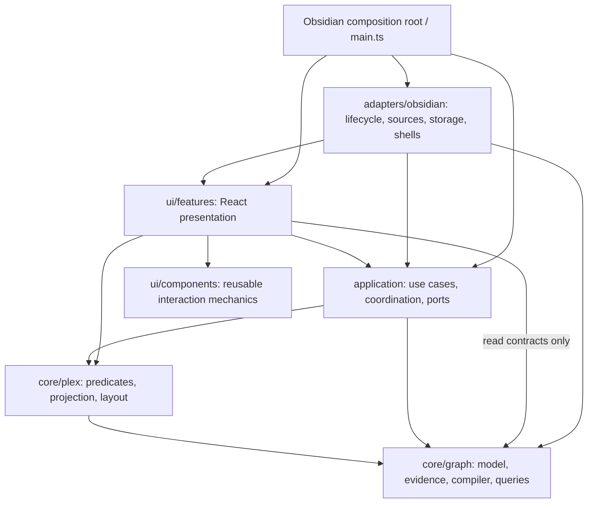
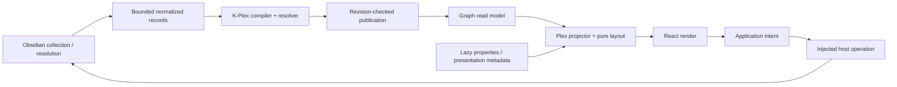

# K-Plex refactor plan and checkpoint ledger

Design reviewed against `main` at `3ac122e` on 2026-09-24. C00 baseline work began on `kplex-refactor` at `9b8e8c0` on 2026-09-25; see the ledger and `docs/REFACTOR_BASELINE.md` for current evidence.

## 1. Objective and scope

Create an architecture that supports continued agent-assisted enhancement with a small, explicit regression surface, separates K-Plex's knowledge-graph and Plex behavior from Obsidian so a future PKM integration is feasible, and makes all plugin-owned user-facing copy ready for future translation and the host's device, operating system and available interactions.

This is a behavior-preserving refactor. It is not a new graph engine, UI redesign, second-host integration, package split, or persistence migration. Keep Obsidian as the only production host. A small in-memory host is a test, not another application.

This file is the execution order, checkpoint ledger, decision log, and handoff record. `AGENTS.md` remains the repository's agent instruction source; `docs/ARCHITECTURE.md` will describe implemented architecture. Neither a proposed directory nor a planned interface counts as completed architecture.

Before each checkpoint, inspect the current source, callers, tests, and working tree. Paths below are verified starting points, not permission to ignore later repository changes. Preserve unrelated user work. Implement one checkpoint, or one explicitly recorded subcheckpoint, per agent session. Do not implement the whole document in one run.

### Changes from the draft

- Establish architecture rules and regression characterization **before** UI extraction, rather than waiting until after a complete component migration.
- Retain a small UI-first pass, but make collection/form abstractions conditional on real duplication; portability must not wait for a design-system project.
- Distinguish import direction from runtime data flow. Application code calls interfaces it owns; it never imports their Obsidian implementations.
- Strengthen existing `FuzzySearchInput`, evidence/resolver, parser, and `PlexScene` seams instead of recreating them.
- Define identity, source normalization, graph publication, invalidation, lifetime, and mutation behavior explicitly. Removing imports is necessary but insufficient.
- Prove host independence incrementally, starting with contracts and predicates. The final proof must not use the current Obsidian test stub or `window` shim.
- Replace broad work packages with checkpoints that name source seams, verifications, manual risks, and completion evidence.

## 2. Repository findings and baseline evidence

| Area | Observed implementation | Consequence for this plan |
| --- | --- | --- |
| Build | npm; Node `>=22.22.2 <23`; TypeScript checking plus esbuild; Obsidian types `1.13.0` | Keep the real build. Do not copy the Excalidraw plugin's Rollup workflow into K-Plex. |
| Test lane | `npm test` runs `scripts/run-indexing-tests.mjs` and `tests/indexing.test.mjs` | Existing tests are valuable but are not a portable-core proof or browser interaction suite. |
| Test mechanics | Source-text assertions plus selected TypeScript modules transpiled into a temporary directory; Obsidian/UI stubs and `globalThis.window = globalThis` | Code moves can fail source assertions without changing behavior; host globals can be concealed by the harness. Migrate protections deliberately. |
| Data model | `src/types.ts`: `GraphPage.file: TFile \| null`, path identity, mutable neighbor maps, transient section fields | Introduce new host-free read contracts and boundary mapping before replacing the legacy model. |
| Indexing | `GraphBuilder.ts` (~1,680 lines), `GraphIndex.ts` (~2,127), `main.ts` (~3,701) | Collection, compilation, persistence, presentation, and lifecycle already have partial seams; extract one responsibility at a time. |
| Semantic foundation | `RelationEvidence.ts`, `RelationResolver.ts`, `GraphState.ts`, `fieldParser.ts` | Reuse these implementations. Resolver/parser cooperative paths still use `window.setTimeout`; direct-import checks alone miss that coupling. |
| Lenses | `GraphPredicateEngine` takes `App`; `GraphLens.ts` takes `GraphIndex` | A lazy property provider and narrow evidence/read interfaces are early portability wins. |
| Layout | `src/ui/layout.ts` already exports `PlexScene`; `PlexGraph.tsx` is ~2,608 lines | Evolve the scene contract and extract derivation; do not invent a parallel scene engine. |
| Shared UI | `FuzzySearchInput.tsx` already owns selection/keyboard/portal mechanics, but imports `ObsidianIcon`; `LongPressTooltip.ts` owns delegated gestures | Reuse these. A button wrapper must not install a second long-press system. |
| Host UI/settings | `settings.ts` combines schema, defaults, migration, declarative settings and manager modals | Separate contracts from shells; do not replace native declarative settings with a new React settings framework. |
| Compatibility duplicate | Both `NewRelatedNoteModal.ts` and `.tsx` exist; esbuild deliberately prefers `.ts` | Preserve synchronization and extension resolution until an explicit retirement decision. |
| Automation | No architecture script in `package.json`; inspected workflows do not provide the required PR test/build/architecture lane | Add that lane early, on the actual working/default branch. Existing CodeQL targets `master`, while this checkout is on `main`. |

Review validation on Node **22.22.2**:

- `npm test`: passed, including the reported indexing 1–33/P1–P17, section 34–50, cache/predicate/incremental 51–59, creation/imagery 60–66, additive ontology 67–68, and placeholder/materialization groups.
- `npm run build`: passed against installed dependencies; `dist/main.js`, `dist/manifest.json`, and `dist/styles.css` produced.
- Initial shell selected Node 18; both commands were rerun using the installed Node 22.22.2 runtime. Future agents must check `node --version` before interpreting results.
- No Obsidian desktop, pop-out, physical-mobile, CodeScanner, or large-vault performance run was performed in this design review. These remain implementation gates where relevant.
- Working tree initially contained this draft as an untracked file. No source changes were made for the design review. Generated build output is not a source fix.

### Known documentation conflicts to resolve in C00

`AGENTS.md` has an older deletion paragraph saying deletion must not navigate, followed by a later **Deletion navigation invariant** requiring immediate history navigation; `tests/indexing.test.mjs` asserts the latter. Preserve immediate history navigation while retaining inbound-evidence/ghost semantics. Correct the stale paragraph with evidence in C00, not by silently changing runtime behavior.

The expanded-view text also mentions a fixed sibling `0.85` multiplier while the layout contract and `siblingScale()` use the configured 30%–85% multiplier. Characterize and document the existing configured behavior. Treat disagreements about intended product behavior as explicit decisions, not opportunities to redesign during extraction.

Some indexing documentation lags test coverage and current UI labels. Update only the parts needed to make the refactor contract unambiguous; avoid unrelated documentation churn.

## 3. Architecture decisions

### 3.1 Import dependencies

**Every arrow below means “may import.”** Runtime callbacks through an interface do not reverse these arrows.



Core may use small host-free utilities. Application and feature UI may use shared contract types. Components may use React, ReactDOM portals, and standard DOM types; they may not import domain policy, plugin classes, or Obsidian helpers. Graph does not import Plex, React, application, host, DOM, Node built-ins, or browser storage.

Place capability interfaces at the **lowest layer that needs them**: a cooperative-work contract used by the compiler belongs in core; a navigation port used by an application use case belongs in application. Never make core import application merely because all interfaces were placed in an application folder.

Suggested homes, created only when an actual extraction lands:

```text
src/core/graph/         identities, evidence, resolver, compilation, read contracts
src/core/plex/          predicates, scene projection, pure layout calculations
src/core/contracts/    only small shared host-free contracts actually needed
src/application/       use cases, coordination, application ports and revisions
src/adapters/obsidian/ source collection, mutations, storage, lifecycle, UI shells
src/ui/components/     domain-independent React mechanics
src/ui/features/       portable feature content consuming application/Plex contracts
src/main.ts            Obsidian plugin entry and composition root
```

Existing paths may remain compatibility facades while consumers migrate. Do not add barrel exports that conceal outward dependencies. Do not create a monorepo, npm packages, generic service locator, or universal `PKMAdapter`.

### 3.2 Runtime flow



The second diagram shows flow, not imports. React rendering must not perform semantic classification, arbitrary vault reads, or graph mutation. Host adapters provide source facts and execute effects; K-Plex owns precedence, reconciliation and ontology meaning.

### 3.3 Contracts that must be decided before extraction

| Contract | Decision and required proof |
| --- | --- |
| Identity | Introduce a named opaque `NodeId` concept. Initially preserve exact existing ID strings, including Obsidian paths and synthetic IDs. Core treats them as exact identifiers; it must not lowercase them, split `/`, infer a file extension, or parse `folder:` to discover kind. Adapt existing case-insensitive/path lookup in Obsidian compatibility code. Do not migrate persisted IDs during this refactor. Test IDs such as `entity:alpha`, unrelated labels, and case-distinct opaque IDs. |
| Kind vs availability | Represent document/attachment/container/tag/URL and resolved/unresolved state explicitly; a missing `TFile` is no longer the discriminator. Preserve all existing behaviors and synthetic-node conventions at the adapter boundary. Do not invent a schema for every future block-oriented PKM. |
| Host lookup | Adapter-owned lookup maps IDs to current `TFile`/host objects. Revalidate after rename/delete and before a write. Never store `unknown hostObject`, `App`, plugin, `WorkspaceLeaf`, or DOM objects in a core DTO. |
| Provenance | Keep declaring entity, declaration target, source kind, field, raw value, location and inverse perspective. Do not discard overridden evidence or merge duplicate declarations just because the visible edge looks identical. Source kinds may retain current names such as `obsidian-link`; a descriptive string is not a runtime dependency. Host location metadata may carry plain path/line/range data; only the adapter interprets it for navigation/editing. |
| Source records | Normalize host facts, reference-resolution results and semantic inputs, not final classified edges. Preserve source tiers, multiplicity, unresolved text, source-relative resolution, and revision information. Do not flatten frontmatter and body into one indistinguishable property map. |
| Shared URL references | Preserve one URL node identity per current URL key and every distinct note-to-URL declaration, including declaring note and location. URL nodes and their children already exist; preserve those relationships. A URL may have multiple note parents plus its origin-hierarchy parent; never encode a single owner in normalized records, compiler state, incremental cleanup or graph read contracts. Confirm this topology with a two-note fixture when moving the URL source family. Showing all referring notes when centering a shared URL is [feature request #26](https://github.com/zsviczian/kplex/issues/26), not a behavior change to implement during this refactor; diagnose visibility, node limits and projection before modifying indexing. |
| Properties | Lens lookup remains lazy and synchronous for today's cached Obsidian metadata. Supply only requested property values for materialized candidates. No arbitrary frontmatter dump in graph records, snapshots or IndexedDB. A future asynchronous host can preload a bounded presentation snapshot outside evaluation; do not introduce that infrastructure now. |
| Optional file semantics | Current `file.*`/`file.inFolder()` expressions remain compatible using an optional file metadata facet. Core never derives this from `NodeId`. Absent metadata follows characterized missing-value behavior; do not invent folders in hosts without them or change the saved lens syntax. |
| Settings | Separate semantic, presentation, and host/runtime views with narrowly named contracts. Keep persisted keys/defaults/migration unchanged, including legacy spellings. Do not import `settings.ts` into new core just for a type, expose the entire settings object through a port, or sanitize away unknown persisted keys. |
| State ownership | Builder owns private mutable work. The graph repository owns publication and committed per-file patches. Consumers get readonly views with stable revision boundaries, not mutable repository access. Avoid deep-copying the entire graph to obtain apparent immutability. Do not promise runtime immutability that a TypeScript `readonly` alone does not enforce. |
| Revisions/invalidation | Keep source revisions, committed graph revisions, presentation/settings revisions and view-local state distinct. Semantic changes update graph/search/affected caches at the same commit boundary. Sorting, lenses, visibility, title settings, pan/zoom and history do not rebuild semantics. A title change may refresh search terms independently. |
| Scheduling | Inject cancellation, time and cooperative-yield operations where needed. Preserve current slice budgets/read limits initially. No bare `window` or `Platform` in portable code; scheduler/runtime policy comes from the host. Cancellation remains distinguishable from failure and “needs rebuild.” |
| Lifetime | Plugin composition owns shared services; each view owns subscriptions, scene state, React root and interaction cleanup. Define disposal and late-result suppression on each extracted service. Hidden-but-mounted views do not count as visible indexing demand. Owner-document UI resources and shared storage are separate concerns. |
| Persistence | Existing settings/history/bookmarks/lenses are durable user data. Parsed-body and semantic graph stores are derived caches. Preserve formats, versions, storage names and atomic active-generation publication. Schema changes, if unavoidable, need a separate migration checkpoint with preservation/recovery tests. |
| Mutations | Application coordinates semantic intent, optimistic updates and reconciliation; Obsidian adapter owns YAML/file writes, native creation policy and trash. Keep provenance eligibility rules in one place. Report cancel/failure distinctly; failed writes must not leave false optimistic relationships. Do not claim a transaction across multiple native file writes. |

### 3.4 UI boundary and host-policy compatibility

- Keep Obsidian `Modal`, native menus, declarative settings, workspace leaves, editor integration, Sidecar, previews and icon acquisition in host shells. These need not become portable widgets.
- Continue using Lucide through Obsidian `getIcon()`. Reusable controls accept an icon slot or a small injected rendering capability; they do not import `ObsidianIcon` transitively. No second icon library.
- Reuse delegated long-press tooltip ownership. One gesture has one owner; consuming a long press must suppress its subsequent click. Do not emulate a native button's normal keyboard behavior unnecessarily.
- Use a small `--kplex-*` token layer for migrated reusable components only. Obsidian shell CSS maps it to existing theme variables. Preserve community themes, contrast, focus, disabled states, and existing feature classes during migration.
- Tokens and scoped styles must also reach body portals in the owning document, not only descendants of `.excalibrain-app`. Verify modal stacking and pop-outs explicitly.
- Portable React renders its own elements. Keep imperative Obsidian DOM-helper use in the host layer; importing helpers, relying on patched DOM prototypes, or wrapping them under another name does not make code portable. Keep scanner-compatible styling and scheduling.
- Do not migrate every native settings manager to React just to share a list. Share headless mechanics only when two actual consumers benefit.

### 3.5 View modes: projection policy and layout strategy

Keep an explicit distinction within `core/plex` between **what a view includes** and **where it places it**:

- **Projection policy** selects the bounded neighborhood, expansion depth and sibling inclusion, preserving semantic roles and evidence. Condensed/expanded presentation and sibling visibility are explicit options; they must not become duplicated graph-query implementations.
- **Layout strategy** consumes that projection and determines positions, zones, connector routing and the mapping of semantic roles to physical gates. The current structured Plex is the first strategy. A future rotated layout can reuse the same projection; a mindmap may combine a different bounded projection policy with a different layout strategy.
- **Scene/rendering contract** carries semantic identities/roles separately from physical positions and gate sides. Interaction code uses the strategy's explicit role-to-gate mapping, including the reverse mapping for drag/drop intent, instead of assuming that “top means parent.” Rotation changes presentation, not relationship meaning.

Keep mode/options in presentation state scoped to the owning view; include them in projection/layout cache keys. Switching modes must not rebuild or mutate the semantic graph. Preserve current persisted settings and defaults through boundary mapping during the refactor.

Introduce only the seam and the current behavior in C19/C20. Do not build a mode registry, plugin framework, mindmap or rotated product feature now. Future strategies should reuse the graph, predicates, provenance and application intents while supplying their own presentation policy and geometry.

### 3.6 Localization contract

Every **plugin-owned user-facing string** must be retrieved from a language file: button captions, menus, command names, settings, field labels, placeholders, tooltips, accessible/ARIA labels, dialogs, help/onboarding content, status text, notifications and errors shown to users. A string remains in scope when rendered through an Obsidian native API rather than React. Dynamic values from the vault (note titles, filenames, aliases, user-authored text), stable IDs/field names/protocol tokens, and developer-only diagnostics are data rather than translatable copy. **Console logs and console error messages remain English** for maintainer diagnosis; a user-visible error notice must use a localized message even if its diagnostic log is English. Do not build sentences by concatenating translated fragments or translate persisted identifiers.

L00 introduces one English source catalog in `src/lang/` and a typed lookup/formatting API with named parameters, plural support and an English fallback. The Obsidian adapter supplies the host language using Obsidian's language API; portable UI receives a translation capability and never reads `localStorage`, `window.app` or Obsidian directly for language. A future host supplies its own language preference through the same narrow port. Do not create non-English translations in this refactor. Keep English keys stable and text/context clear enough for later translators.

After L00, **every new or changed user-facing string must use the catalog**. Each UI/host checkpoint moves the strings it touches without altering their meaning or current English wording merely to satisfy a source-text assertion. L01 completes the remaining legacy copy inventory by surface and makes the rule executable: fail on missing keys, malformed parameters/plurals and newly hard-coded user-facing strings, with reviewed exclusions only for non-copy data. Record English-only fallback behavior honestly; future translations and translated documentation are a separate project. Do not mark the localization contract complete because a catalog file exists while users still encounter hard-coded plugin copy.

### 3.7 Host environment and shortcut presentation

Keep **device class**, **operating system/key convention**, **input capabilities** and **host feature availability** separate. Obsidian currently distinguishes desktop, tablet and phone (the existing persisted device key calls phone `mobile`); retain that mapping and behavior during extraction. A tablet may have a keyboard and mouse, and a desktop may use touch. Do not infer keyboard availability, hover support, pop-out support or a particular host API merely from screen width or `Platform.isMobile`. Preserve the current Obsidian-specific phone/tablet/desktop routing and layout profiles; audit their classifier and documentation before changing detection. A future PKM host provides its own environment information through the same narrow contract, without importing Obsidian into portable presentation or core.

The Obsidian composition/adapter boundary owns platform detection and capability decisions. Portable feature UI receives only the environment facts or semantic capabilities it consumes; pure graph semantics and layout algorithms must not inspect host/device globals. Capability-gate commands and UI affordances at the owning host/application boundary, with an accessible alternative where a gesture or key command is unavailable. Never show an instruction for an unavailable action. Refresh view-scoped presentation when relevant capabilities or input mode change; do not persist an inferred environment snapshot as user settings. Pop-out/window-local DOM and focus behavior still follow the owning window.

Represent keyboard gestures once as **logical shortcut specs** shared by registration/handling and display where feasible; otherwise test that the displayed hint matches the actual registered action. For host-owned or user-configurable shortcuts, obtain the effective binding when available; if it cannot be resolved, do not advertise a fixed key sequence. Localized UI copy composes with a host/environment-aware shortcut formatter. It renders the actual modifier names or symbols for the active convention (for example, Command/Option on macOS and Control/Alt on Windows), including platform-appropriate separators and key names. Never embed `Ctrl/Cmd`, `Mod`, `Option`, or a platform-specific literal in a translatable sentence or tooltip as a substitute for this formatting. A translated sentence receives a complete formatted shortcut as a named parameter, not concatenated fragments. Omit keyboard hints where the shortcut is unavailable or inapplicable; on touch-only surfaces describe the available touch action. A tablet or phone with an attached keyboard may show the applicable keyboard hint. Do not change shortcut semantics merely to improve the label.

## 4. Verification contract

### 4.1 Required lanes

Current commands are `npm test`, `npm run build`, `npm run check:architecture`, `npm run check:core`, `npm run lint:obsidian` and `npm run verify`. The separate `npm run verify:obsidian` lane requires an explicitly configured test vault and running Obsidian CLI. `check:core` was introduced by C08 and intentionally excludes DOM/Node ambient types.

`verify` currently runs architecture checks, portable-core type/runtime checks, Obsidian ESLint, all non-host test suites, and the real production build. Keep `npm test` as the aggregate non-host behavioral regression entry point as suites are added. These commands must work without an installed/running Obsidian application. CI must run the same aggregate lane; a standalone test file that no script invokes is not a guardrail. Keep `verify:obsidian` separate for real-host checks as described in section 4.6.

The existing harness transpiles selected files without full cross-module type checking. It must remain supplemented by the real repository build against installed Obsidian declarations. A second host-free lane must compile/import actual portable modules without stubbing their dependencies.

### 4.2 Architecture checks

Use the installed TypeScript parser/module resolver or another small maintainable dependency-graph implementation; a grep for `from "obsidian"` is only a diagnostic.

The checker must cover static imports, exports/re-exports, type-only imports and `import()` types, literal dynamic imports/require, aliases (`@/*`), and transitive reachability. Reject unresolved or nonliteral loading escape hatches in portable areas unless explicitly accounted for. Track forbidden globals/API families as well as imports: core cannot use `window`, `document`, `localStorage`, IndexedDB, Obsidian DOM extensions, Node filesystem APIs, or a plugin recovered through a global.

Start with migrated roots only, but check their entire reachable graph. A core module importing a legacy helper that imports Obsidian is a violation. Exception records name the exact edge, reason, owning checkpoint and removal condition; no directory-wide permanent exemption and no automatic baseline regeneration. New code must not increase the legacy coupling allowance.

Give the checker tests that deliberately violate rules, including a type-only leak and a transitive leak, and one permitted host-to-core import. Fail on newly introduced cycles between migrated layers. Use a dedicated core TypeScript config with ES libraries, no DOM libraries and no ambient Node/Obsidian types; do not rely on compiler configuration alone to prevent explicit forbidden imports.

### 4.3 Behavioral comparison, not snapshot blessing

Before moving a covered behavior, map its current assertions to the invariant they protect. Keep source-string checks until equivalent behavioral coverage exists. A mechanical path update is acceptable for a structural check; deleting assertions, keeping dead strings to appease them, or rewriting expectations to match a regression is not.

Capture normalized baseline results **before** altering the implementation. Compare:

- node identity/kind/resolution and structural membership;
- resolved roles, defined/inferred status, directions, hidden state and ontology definitions;
- evidence declarations and active/overridden decisions, original declaring direction and locations;
- neighborhoods, gate totals, search ordering and relevant presentation outputs;
- full-build versus incremental results after edit/rename/delete/materialize sequences;
- persisted decode/encode meaning and warm-restore behavior.

Sort unordered maps/sets for comparison and remove only documented nondeterministic fields. Never erase provenance, direction, duplicate declarations or ordering that is user-visible to make a comparison pass. Keep goldens stable until a separately approved product change. Where a temporary old/new comparison is useful, run it in tests; do not retain two complete graphs or compilers in production.

### 4.4 Risk-based verification matrix

Use the lane codes below in checkpoint records. All implementation checkpoints still run the aggregate tests/build and active architecture checks.

| Lane | Automated checks | Manual or measured evidence |
| --- | --- | --- |
| G — semantics | Compatibility fixture; explicit/frontmatter vs body; all roles/inverses; hidden/previous/next; folder/tag/URL/date/attachment/ghost; evidence decisions | Connection details and representative node navigation in Obsidian when adapter behavior changes. |
| I — incremental/lifecycle | Full vs incremental equivalence; semantic no-op; cancel mid-file/batch; stale revision; dirty backlog; optimistic edit during build; subscriber sees only committed state | Startup burst, hidden tab, reveal, close last view, reopen, unload during work; large vault and physical iOS for pipeline changes. |
| P — persistence | Settings compatibility; cold/warm restore; corrupt/stale/partial snapshot; generation activation; blocked storage fallback; late connection disposal; interrupted parse reuse | Reload existing vault/profile; cold interrupted/resumed iOS indexing. Use test storage, never clear user data for convenience. |
| U — interaction | Button activation/disabled; keyboard/focus/selection/Escape; outside pointer; focus restoration; busy/error; cleanup with a DOM-capable test harness | Main window and pop-out; light/dark/community theme; modal/body portal; physical touch/long press when touched. Desktop emulation cannot sign off touch. |
| X — Plex/layout | Deterministic scene output; keep-layout/reflow; gate shown/total vs hasAny; style-only lens; sections/folding/provenance; no graph mutation/rebuild | Zone symmetry, lateral bottom alignment, scroll packing, expanded children, sibling scale, camera preservation. |
| M — mutation/navigation | Success/cancel/failure/stale target; provenance-safe writes; optimistic rollback; deletion history; owning-view routing | Real temporary-vault YAML edits/trash, linked/unlinked/pinned tabs, Sidecar ownership and source-line navigation; platform-specific host behavior as touched. |
| H — host independence | Type/import checks plus clean-process tests with no Obsidian/DOM/window shim, host-free records and fake scheduler/provider | Demonstrates core reuse only; does not claim a working Logseq/Tana integration or host-independent native UI. |
| O — Obsidian automation | Capability preflight; deploy exact local build to a test vault; CLI-driven application/UI/performance scenarios exercising relevant G/I/P/U/X/M checks | Capture assertions, diagnostics, screenshots and measurements; record unsupported pop-out/device scenarios separately. Required when the affected host checks have a configured capable environment. |
| L — localization readiness | Typed English catalog; key/parameter/plural validation; source-copy inventory and negative hard-coded-string fixture | Check English fallback and representative labels/notices/help/ARIA text in a real Obsidian view. Non-English translation quality is out of scope. |
| E — environment adaptation | Host-free environment/shortcut tests across desktop, tablet and phone; macOS, Windows, iOS/iPadOS, Android and fallback key conventions; keyboard, pointer and touch combinations; unavailable-feature assertions | Check matching hints and actions on available Obsidian targets. Physical phone/tablet touch and attached-keyboard behavior require device evidence; desktop emulation is only a layout aid. |

For DOM behavior tests, select a minimal harness in C03 and record the choice. Do not bolt React UI tests onto the indexing suite's fake `window`. A DOM emulator can validate interaction contracts; actual Obsidian and physical touch remain separate evidence.

### 4.5 Performance evidence

C00 records a repeatable procedure using a representative large vault or non-private synthetic equivalent (20,000+ files / 100,000+ graph/search entries). Record device/OS/Obsidian version, dataset size, cold/warm cache state, duration, body reads, full/patch counts, maximum synchronous slice where measurable, and peak-memory observations. Keep vault contents out of committed artifacts.

Generate the reproducible synthetic input with `npm run fixture:large -- --out /absolute/path/to/a/new-folder --files 20000`; check it later with `npm run fixture:large -- --verify /absolute/path/to/that-folder`. The v2 generator copies the 13 Markdown notes in `tests/fixtures/excalibrain-indexing/Vault` and adds 20,000 deterministic, sharded notes with 100,000 explicit ontology declarations plus 2,000 inline declarations. About 10% of all Markdown files (2,001 of 20,013 by default) are exactly 950,000 bytes, containing very long paragraphs, large fenced code blocks and dense real links; ordinary notes create shared note hubs and URL targets. The default corpus is about 1.9 GB of Markdown. It refuses to overwrite an existing folder and writes a content-hash/count manifest. Keep generated vault data out of Git and use the **same verified folder and settings** for before/after measurements. Manifest link/declaration counts describe source input, not a measured K-Plex graph/search index; query the completed runtime index separately before claiming the 100,000-entry runtime target.

For hot-path changes compare before/after on the same environment. Require zero new full rebuilds for presentation-only actions, no full evidence scan for a per-file patch, no arbitrary property copies, and no extra whole-vault body reads on a fresh warm restore. Preserve bounded reads, time slicing and iOS prewarm behavior. Agree numeric timing/memory tolerances from actual baseline measurements in C00; do not invent universal millisecond budgets or use flaky CI timing as the sole gate. If measurements are unavailable, record performance validation as pending.

### 4.6 Environment-aware host automation for coding agents

Codex, Claude Code and other implementing agents should run applicable real-host tests themselves whenever a configured Obsidian environment is available. Keep this workflow in repository scripts and contributor/agent instructions, independent of the agent product. Automate repeatable application, UI and performance checks; do not equate a successful reload or a screenshot with a passed scenario.

**Verified CLI basis (2026-09-25):** The official CLI controls the desktop application, which must run and may be launched by a command. Detect the installed version and commands using `obsidian version` and `obsidian help`; installation of Obsidian alone does not establish CLI readiness. Explicit `vault=<name-or-id>` comes before the command. Available developer commands include `plugin:reload`, `dev:dom`, `dev:css`, `dev:screenshot`, `dev:errors`, `dev:console`, `eval` and `dev:cdp`. Recheck local help instead of assuming a fixed capability set. [Official CLI reference](https://help.obsidian.md/cli).

**Phone/tablet desktop emulation:** In the disposable test vault, `obsidian vault=kplex-test eval 'code=app.emulateMobile(true)'` enables Obsidian's mobile UI and reloads the window. Wait for CLI readiness after that reload. `window.resizeTo(width, height)` through `eval` changes the form-factor branch once the inner width settles; a tablet-sized window and a phone-sized window can then be checked for available commands, active layout profiles, routing and CSS. Obsidian also advertises `dev:mobile on|off` in local CLI help. Restore the original window dimensions and run `app.emulateMobile(false)` after the scenario, then confirm desktop command/profile behavior and captured errors. A first CLI command immediately after reload may fail transiently; retry after readiness rather than accepting that as a product failure. Emulation is repeatable host evidence for form-factor policy and layout, **not** evidence of native touch, on-screen keyboard, mobile WebView or OS-specific lifecycle. Extend the host runner with bounded emulation assertions and `finally` restoration when the affected UI checkpoint needs them; keep physical-device checks explicit.

**Separate the runners:** Keep shared fixtures, scenario expectations and result records independent of the host. Put CLI invocation, deployment and UI-driving details in test infrastructure such as `scripts/testing/obsidian/` and `tests/host/obsidian/`, outside shipped `src/` and the core dependency graph. Future hosts can implement their own driver and applicability list; do not build a universal automation framework now. No Obsidian CLI dependency belongs in portable tests, production runtime, or generic application contracts.

**Local build and test loop:**

1. Preflight the CLI, desktop connection, required commands and explicitly configured test-vault identity/path/config directory. Use bounded timeouts. Record versions and capabilities; distinguish missing setup from a command/assertion failure. Never fall back to the currently active personal vault. Establish a dedicated fixture vault, following [Obsidian's development-vault guidance](https://docs.obsidian.md/Plugins/Getting%20started/Build%20a%20plugin), and keep machine-specific paths out of committed configuration.
2. Run `verify`, then stage this checkout's `dist/main.js`, `dist/manifest.json` and `dist/styles.css` into that vault's plugin directory for `k-plex`. `kplex-test` is a disposable playground: overwrite prior plugin bundles without backing them up. Validate destination and artifact hashes; keep plugin data/settings for warm-restore cases unless a scenario explicitly resets them. Disable the test plugin while replacing artifacts, then enable/reload through the CLI. Restart the test application when required by manifest changes. `plugin:install` installs a community plugin; it does not deploy an unpublished local build. Do not test a downloaded release instead of the changed code.
3. Drive the relevant fixture scenarios through registered commands and real UI input. Discover command IDs rather than invent them. Use DOM/CSS assertions and screenshots for rendering; use CLI-supported CDP/input automation where available for keyboard/pointer/focus flows. Direct `eval` invocation of application methods is useful for state checks but does not prove UI event wiring. Wait for observable readiness and expected state with deadlines, not arbitrary long sleeps.
4. Assert outcomes and capture errors/console output per scenario. For performance, use section 4.5's datasets, repetitions and cold/warm conditions; distinguish CLI round-trip time, indexing completion and visible rendering. Any temporary measurement hooks stay development/test-only and are removed or disabled in production. Verify pop-out target/window coverage explicitly; if the driver cannot reach it, leave that scenario pending.
5. Emit a machine-readable report plus failure evidence: source revision and dirty-tree/build identity, artifact hashes, runtime/OS/host versions, capabilities, fixture/settings/viewport, scenario IDs, assertions, timings and screenshot/log paths. A process exit code alone is not success. Clean up only resources owned by the test run; preserve artifacts needed to diagnose failures. Run cold-state cleanup only in the designated disposable fixture storage.

**Availability and acceptance rules:**

- Normal CI and machines without Obsidian run `verify` and portable/DOM-emulated scenarios. Record required Obsidian scenarios as **unavailable/pending**, with the reason and rerun command/artifact identity. Continue independent work; do not silently count a skip as host validation.
- An explicitly requested `verify:obsidian` run, or a dedicated host CI job, is strict: missing prerequisites, timeouts and failed assertions return nonzero. A separate preflight can report unavailable without failing the portable lane. Once a capable target is configured, agents run relevant host scenarios rather than routinely handing them back as manual tasks.
- For a future non-Obsidian implementation, mark Obsidian-specific scenarios **not applicable** with the target/reason and run that host's relevant integration checks. Absence of Obsidian on a machine does not make checks for the Obsidian product inapplicable.
- Automated evidence may satisfy a previously manual desktop gate when it tests the same behavior. Screenshots without assertions/review, desktop mobile emulation and synthetic clicks do not establish physical touch or platform-specific lifecycle correctness. Keep unautomated device/accessibility/platform checks explicit; do not promise universal full automation.
- A later equipped environment reruns pending scenarios against the exact build under acceptance. Source changes invalidate affected earlier results. Final acceptance of the Obsidian refactor still requires its applicable host gates; portable progress does not depend on installing Obsidian everywhere.

## 5. Agent execution and tracking protocol

1. Read this ledger and applicable `AGENTS.md`; inspect branch/status and checkpoint prerequisites.
2. State the selected checkpoint, exact behavior seam, current consumers, invariants, expected touched files and verification lanes. If a checkpoint contains several risky extractions, create lettered subrows before editing and execute only the first.
3. Characterize any missing behavior before moving it. Make the smallest extraction and migrate one representative consumer; retain an explicit facade if necessary.
4. Run required checks, including applicable CLI-driven host scenarios when a configured capable environment is available (section 4.6), inspect the full diff, and search for remaining callers, obsolete imports, accidental schema changes and diagnostics. Do not suppress failures to finish a checkpoint.
5. Update the ledger, append an action record and update architecture/component docs only for implemented contracts. Record exact verification evidence and the next small step. Close every checkpoint or subcheckpoint with a concise automated-test summary (command, environment, pass/fail and what it actually proves) and prioritized maintainer-test recommendations. Recommend only the 1–3 highest-value checks by likelihood and impact; give each an exact workflow, target, expected observation and reason automation did not cover it. State **no manual test needed** when automated evidence is sufficient. Keep required but unavailable host/device checks visibly pending rather than treating recommendations as completion evidence.
6. Stop at the checkpoint boundary. Local build deployment to the configured disposable test vault is part of verification; do not commit, publish or deploy to a personal/production vault unless separately requested. Do not ask again for permission for routine authorized edits/checks.

### Temporary external-agent handoffs

At each checkpoint boundary, consult the **Agent fit** column and proactively tell the maintainer whether the next checkpoint or a named slice should be handed to an agent without Obsidian access. For a selected handoff, the reviewing agent **overwrites the single root `HANDOFF.md`** with the current base revision, exact scope, preserved behaviors, acceptance checks, unavailable host checks and a short results template. Never create dated handoff files or archive old handoffs. The external agent implements only that scope and records its actual changes, commands, failures and pending host/device checks in `HANDOFF.md`; it does not mark the checkpoint Done in this plan.

When the modified repository returns, the main/reviewing agent independently inspects the full diff, reproduces checks on the required Node version, fixes defects, runs applicable Obsidian CLI scenarios in the explicit test vault, and reports up to three prioritized manual checks with exact expected outcomes and reasons they remain manual. **Validation is confirmed** when the required automated/host evidence passes and the maintainer confirms any requested manual checks. Only then commit the accepted checkpoint and move to the next one. If a required device is unavailable, keep its check and checkpoint in **Review**; do not call an offline pass complete or commit it as a completed checkpoint. Transfer the accepted outcome, test evidence, limitations, facade owner and next step into this plan's ledger/action log. The next handoff overwrites `HANDOFF.md`; this plan, not the transient handoff, remains the durable record. A failed or rejected handoff is recorded here as such before it is overwritten.

If a product-policy conflict cannot be resolved from current instructions and tests, record it and ask one focused question; continue independent work. If manual validation is unavailable, mark **Review** rather than **Done**. Do not fabricate a smoke test or block independent work just because a device is unavailable. Dependent high-risk expansion waits for its prerequisite acceptance evidence.

Status values: **Pending**, **Active**, **Review** (code checks pass; named validation outstanding), **Done**, **Blocked** (specific dependency/decision), **Deferred** (explicit scope reason). A deferred optional UI checkpoint does not block core work. Reverted checkpoints return to Pending with an action-log entry.

Completion requires: stated behavior preserved, production consumer migrated (unless explicitly a test/contract checkpoint), required lanes passed, no unapproved persisted changes, cleanup owner identified, and log updated. A facade or “legacy” module must have a finite consumer list and named retirement checkpoint.

Rollback is normally a reviewable reversal of that checkpoint's code and tests, preserving unrelated work. Because persisted formats remain unchanged, restoring the previous implementation should read the same data. Never use destructive Git reset or delete caches/user data as a substitute for a rollback design. Test-harness/checker checkpoints may be rolled back independently; semantic comparison failures block later semantic work.

### Progress ledger

IDs C00–C26 replace the draft's numbering; E00 and L00/L01 are inserted environment and localization checkpoints. The review evidence above is a seed for C00, not completion of its manual baseline.

| ID | Deliverable | Prerequisites | Lanes | Agent fit | Status / evidence |
| --- | --- | --- | --- | --- | --- |
| C00 | Baseline, conflicts, invariant inventory | — | G/I/P/U/X/M | Host | Review — Node 22 `verify`, inventory, exact-build CLI render/error smoke and maintainer's qualitative v1 graph inspection; v2 large-file fixture verified, but its runtime completion, representative interaction and cold/warm performance remain pending (see baseline doc) |
| C01 | Behavior characterization and test seams | C00 | G/I/X | — | Done — canonical graph/evidence/scene fixture, pair comparison, stub guard and source-check map; Node 22 test/build pass |
| C02 | Dependency rules, checker, PR verification and optional-host runner | C01 | H/O | — | Done — C02a/C02b local lanes pass; remote CI unverified |
| C02a | Architecture rules/checker and portable CI lane | C01 | H | — | Done — checker/self-tests, `verify`, PR CI and architecture guide; remote CI unverified |
| C02b | Environment-aware exact-build Obsidian runner | C02a | O | — | Done — strict preflight/staging/report tests and real `kplex-test` render/error smoke pass |
| E00 | Host environment/capability seam and device-class preservation | C02 | E/H/U | Strong | Done — Node 22 `verify`, exact-build desktop CLI and phone/tablet emulation checks passed; maintainer confirmed manual validation and requested commit |
| L00 | English language catalog, typed lookup, host language seam and shortcut formatting | E00 | L/E/H/U | Strong | Done — Node 22 `verify`, exact-build host render/notice/ARIA and desktop/tablet/phone emulation pass; maintainer confirmed physical F4 check; no translations |
| C03 | Token/icon seam and one action primitive | L00 | U/L/E | Scoped | Done — reviewed C03a button/navigation and host CSS; Node 22 `verify`, exact-build desktop/pop-out/tablet/phone CLI checks and maintainer's desktop/tablet/phone interaction checks passed |
| C04 | Floating-layer mechanics from existing consumers | C03 | U | Scoped | Done — C04a `PlexFilter` extraction, owner-document/Escape fixes and narrow toggle labels; Node 22 and exact-build host checks plus maintainer physical touch/keyboard checks passed |
| C05 | Host-free shared suggester | C04 | U | Scoped | Done — C05a and keyboard-viewport correction pass Node 22, browser DOM and exact-build Obsidian checks; maintainer confirmed physical phone experience |
| C06 | Shared collection mechanics, if justified | C05 | U | Scoped | Done — three native managers reuse bounded collection windows; localized next-batch captions, Node 22 verification and desktop/pop-out/tablet/phone manager checks passed |
| C07 | Form/dialog content, if justified | C05 | U/M | Scoped | Deferred — source survey and reviewer assessment confirm differing validation/action/async policies; no content conversion justified or runtime dialog change made |
| C08 | Host-free graph/settings contracts and identity seam | C02 | G/H | Strong | Done — exact opaque IDs, explicit node/file/settings views, legacy mapper and restricted core type/runtime lane; mapping, settings preservation, full warm restore and six-kind navigation validated |
| C08P | Indexer stabilization, restore watchdog and performance roadmap | C08 | I/P/H | Scoped | Done — clean Node 22 verification, exact-build 20k-vault warm/timeout/fallback/late-work/reload and tablet/phone emulation passed; evidence in `docs/validation/C08P-2026-09-26.md`; C00 cold/native matrix remains open |
| C09 | Narrow graph read interfaces | C08P | G/X/H | Strong | Done — portable production SearchBox/read port; full verify, browser consumer and exact-build large-vault search/refresh acceptance passed |
| C10 | Lazy property provider and portable predicates | C09 | G/X/H | Strong | Done — portable predicate/parser/lens runtime; full verification, prior-evaluator comparison and exact-build property/style/evidence/Reflow acceptance passed |
| C11 | Normalized source contract and test records | C08P | G/H | Strong | Pending |
| C12 | Obsidian source collection boundary | C11 | G/I/P | Scoped | Pending |
| C13 | Host-free full compiler/resolver/parser path | C12 | G/I/H | Strong | Pending |
| C14 | Incremental compiler and commit contract | C13 | G/I/H | Scoped | Pending |
| C15 | Index demand/revision coordinator | C14 | I/P | Scoped | Pending |
| C16 | Snapshot/cache orchestration behind storage ports | C15 | P/I/H | Scoped | Pending |
| C17 | Search extraction | C09, C14 | G/I/H | Strong | Pending |
| C18 | Presentation metadata/settings ownership | C10, C17 | X/I/H | Scoped | Pending |
| C19 | Plex projector using existing scene pipeline | C18 | G/X/H | Scoped | Pending |
| C20 | Pure layout and transient-section projection | C19 | X/I/U/H | Scoped | Pending |
| C21 | View-scoped navigation intents | C09 | M/U | Scoped | Pending |
| C22 | Relationship mutation intent and host writer | C14, C21 | G/M/I | Scoped | Pending |
| C23 | Creation/materialization/deletion intents | C22 | G/M/I/P | Scoped | Pending |
| C24 | Explicit Obsidian shells and composition cleanup | C05, C16, C20, C23 | U/M/P | Host | Pending |
| L01 | Finish legacy user-copy and shortcut-hint extraction; strict localization gate | C24 | L/E/U/M | Scoped | Pending; no translations |
| C25 | Complete enforcement and retire migration facades | C24, L01 | all | Scoped | Pending |
| C26 | End-to-end in-memory proof and final acceptance | C25 | H + all relevant | Host | Pending |

**Agent fit:** **Strong** means a no-Obsidian agent can implement and run the portable checks; the reviewing agent still owns applicable host validation. **Scoped** means hand off only a named slice with a buildable boundary and leave host-dependent behavior to the reviewer. **Host** means the checkpoint should remain with an Obsidian-equipped agent. This is a planning recommendation, not a waiver of prerequisites or acceptance lanes. Reassess it when starting each checkpoint and proactively tell the maintainer whether the next step is a handoff candidate.

Recommended order is table order, with C06/C07 deferred unless demonstrably useful. C21 can occur earlier if it unlocks a specific portable UI consumer. Do not postpone all boundary tests to C26.

### Required subdivisions for larger checkpoints

These parent checkpoints are **not single-session implementation tasks**. Execute the listed slices in order; add a ledger subrow and action record for each as it starts. Parent status becomes Done only after all required slices pass. Each slice retains the parent's verification lanes and must build with the remaining legacy paths.

| Parent | Prescribed independently reviewable slices |
| --- | --- |
| C02 | C02a: architecture rules/checker and portable CI lane; C02b: host capability preflight, local-build staging and minimal CLI smoke/report runner. Extend scenarios with the checkpoints that need them; do not wait for a complete UI test framework. |
| C12 | C12a: file/container/tag source facts; C12b: resolved/unresolved link and ontology occurrences; C12c: remaining Date/URL/body source facts and complete collector wiring. Inventory exact source ownership first so overlapping source kinds are not emitted twice. |
| C14 | C14a: characterize patch outcomes, observer visibility and cancellation boundaries; C14b: move staging/commit behavior intact behind the compiler contract and migrate the production patch path. |
| C16 | C16a: serialization codecs separated from host binding; C16b: snapshot generation orchestration/storage port; C16c: body-cache/parser service ownership. Keep the active-generation transaction inside its storage implementation. |
| C18 | C18a: labels and sort inputs; C18b: style/visibility and invalidation; C18c: lazy imagery and host title-script boundary. |
| C19 | C19a: ordinary center projection; C19b: filter/lens/count and keep-layout/reflow paths; C19c: expanded-neighbor paths. |
| C20 | C20a: pure numeric layout; C20b: section acquisition/projection separation. |
| C22 | C22a: additive relationship intent; C22b: relink; C22c: provenance-safe unlink. |
| C23 | C23a: creation and folder-child flow; C23b: ghost materialization; C23c: deletion/history/cleanup. |
| C24 | C24a: remaining modal/menu/settings/editor host shells; C24b: view/workspace/Sidecar integration ownership; C24c: composition and lifecycle cleanup. Split either shell family further if it spans distinct lifetimes. |
| L01 | L01a: settings/commands/native menus; L01b: React controls, dialogs, help, accessibility copy and shortcut hints; L01c: notices/user-visible errors and final literal/key audit. Keep each slice buildable and preserve its English behavior. |

Do not mechanically extract code into a new service whose constructor still takes the plugin. That only relocates coupling. When a slice cannot stay buildable without a broader rewrite, add a temporary narrow facade and record its callers/removal checkpoint instead.

## 6. Checkpoint playbook

### C00 — Establish baseline and freeze observable behavior

**Inspect:** `AGENTS.md`, package/build/test scripts, `docs/INDEXING_ARCHITECTURE.md`, compatibility fixture README, `types.ts`, and the major files in section 2.

**Change:** Record baseline revision/runtime, test/build results, known failures, performance procedure and representative UI captures. Create a compact invariant-to-test/manual-check table in `docs/REFACTOR_BASELINE.md`. Resolve the documented deletion/sibling instruction inconsistencies against current behavior; record remaining decisions. Inventory duplicated UI mechanics and direct/transitive host dependencies without attempting cleanup.

**Verify/exit:** Real Node 22 build/test passed or pre-existing failures explicitly recorded; baseline includes all seven node categories, existing settings restore, Sidecar ownership, gate semantics, sections, filters and touch behavior. List unavailable device checks explicitly. No runtime changes.

**Main risk/manual:** Freezing an accidental or contradictory expectation. Compare observed behavior to tests and current product rules before declaring a golden baseline.

### C01 — Make regression protections survive code movement

**Inspect:** `tests/indexing.test.mjs`, its explicit transpile list, stubs and source-text assertions.

**Change:** Add reusable canonical graph/evidence comparison helpers and baseline fixtures. Separate test harness plumbing from behavioral assertions where necessary; preserve aggregate coverage and invocation. For the first planned extractions, replace brittle source placement checks with tests that exercise the protected behavior. Document remaining source checks and their intended invariant. Do not rewrite all tests at once.

**Verify/exit:** Intentionally break one fixture expectation to prove the lane fails, then restore it; full/patch output comparison retains suppressed evidence and direction. Test helpers compile newly extracted imports instead of silently stubbing the implementation under test. Existing suites still run.

**Main risk/manual:** Green tests after losing an assertion. Review assertion mapping; no host smoke needed for test-only changes.

### C02 — Add the architecture contract and executable guardrails

**Change:** Create `docs/ARCHITECTURE.md` with the import diagram, layer ownership, current migration status and feature-placement guide. Add the scoped dependency checker and its negative tests from section 4.2. Introduce `check:architecture` and aggregate `verify`, and a PR CI job on the actual default branch using supported Node 22, installed lockfile dependencies, tests and build. Add `check:core` to the aggregate only when C08 creates it.

C02b adds section 4.6's environment-aware `verify:obsidian` runner and documents one-time test-vault/CLI setup in contributor guidance. Start with exact-build deployment, opening K-Plex, a real rendered-state assertion and error capture. Test preflight/report/failure handling without Obsidian; execute the real smoke test when available and keep that evidence pending otherwise. A host-unavailable C02b review must not block independent portable checkpoints; only checks requiring its actual host evidence wait. Add UI/performance scenarios as their behavior is extracted.

Update `AGENTS.md` with rules for new/migrated areas, not claims that legacy code has already moved. Record exact grandfathered roots/edges and removal checkpoints. Rules include transitive/type-only coupling, no plugin escape hatches, single semantics owner, and no weakening tests to accommodate moves.

**Verify/exit:** A deliberate direct, transitive and type-only leak fails locally; permitted adapter-to-core imports pass. CI configuration invokes the same lane; report remote CI as unverified until it actually runs. No false claim that empty folders prove independence.

### E00 — Establish the host environment seam without changing device behavior

**Inspect:** `src/ui/viewProfile.ts`, persisted layout-profile keys, platform branches in `main.ts`/indexing, shortcut registrations/handlers, tooltip/help strings and the mobile instructions in `AGENTS.md`. Reconcile any mismatch between documented and actual phone/tablet classification with installed Obsidian typings before changing detection; preserve the existing behavior and keys in this checkpoint.

**Change:** Define a small host-free presentation-environment contract for device class (`desktop`/`tablet`/`phone`), OS/key convention, available input modes and the specific host capabilities consumed by UI. Map the existing Obsidian classifier and feature availability into it at the host boundary; keep the legacy persisted `mobile` profile key through a boundary mapping. Pass the narrow facts to a representative portable UI consumer rather than importing `Platform` or reading `window` there. Keep performance/worker/memory policies in the Obsidian source/storage adapters or injected scheduling policy, not in presentation environment. Do not build a global platform singleton or a speculative matrix of every future host feature.

**Verify/exit (E/H/U):** Pure fixtures cover desktop, tablet and phone; macOS, Windows, iOS/iPadOS, Android and unknown key conventions; touch-only, keyboard-plus-touch and pointer/keyboard combinations; unavailable pop-out or host commands. Confirm current Obsidian routing and persisted layout-profile selection have not changed. The migrated consumer's reachable imports remain host-free. Record which physical device combinations could not be exercised. No shortcut or copy redesign occurs in E00.

**Main risk/manual:** Conflating Obsidian mobile with phone, or treating a tablet as touch-only. Check phone sidepanel routing, tablet tab/sidepanel availability and desktop pop-out in their applicable environments; real mobile touch remains a separate gate.

### L00 — Establish English localization files before UI extraction

**Inspect:** User-facing copy in `src/main.ts`, `src/settings.ts`, native modal classes and React controls; existing hard-coded key hints and the handlers they describe; the canonical `.ts`/compatibility `.tsx` modal pair; current Obsidian language API and locale guidance. Distinguish copy from ontology names, user data and serialized keys.

**Change:** Add the English catalog and typed lookup/formatting contract from section 3.6. Wire a narrow language provider at the Obsidian composition boundary, with English fallback, and migrate a few representative strings across a React control, native host shell, notice and help/ARIA surface. Add a pure shortcut formatter driven by E00's environment contract, with one representative tooltip/help hint passed as a named catalog parameter; define the logical shortcut beside its handling/registration when feasible. Keep locale resources out of core graph semantics and persist no language setting unless a separate product decision requires one. Document the key structure and usage for future agents. No non-English translation files or translated copy are required.

**Verify/exit (L/E/H/U):** Unknown keys, missing interpolation values and invalid plural forms fail tests; English fallback renders all representative surfaces; `npm run verify` and lint pass. Shortcut tests compare displayed hints with the actual logical action for macOS and Windows, and omit them for touch-only/unavailable actions. A clean portable UI test does not import Obsidian to obtain language or key convention. Check representative text/ARIA labels, one shortcut hint and one notice through the configured real-host lane. Record the inventory of remaining hard-coded legacy copy and key hints for L01. Do not make unfinished legacy strings disappear through an unchecked fallback.

**Main risk/manual:** Changing copy or command IDs while extracting text. Preserve user-visible English wording and stable persisted/command identifiers; compare the rendered surface before and after.

### C03 — Extract one action primitive and establish styling/icon seams

**Inspect:** `App.tsx`, `ThoughtNode.tsx`, `ObsidianIcon.tsx`, `LongPressTooltip.ts`, `styles.css`; select two genuinely equivalent buttons.

**Change:** Add a minimal reusable button with native button semantics, accessible name, disabled state and icon slot. Map only its required K-Plex tokens in host CSS. Reuse the delegated tooltip scope; document which layer owns it. Migrate two controls with equivalent interaction contracts, using L00's catalog and environment-aware shortcut display for any tooltip or key hint they expose. Introduce a focused DOM behavior lane and `docs/UI_COMPONENTS.md` describing only implemented primitives.

**Verify/exit (U/L/E):** Mouse/keyboard action fires once; disabled action never fires; long press consumes click; no duplicate `title` tooltip; icon/theme/focus unchanged. Any hint matches the active keyboard convention and action availability. Check main/pop-out and real mobile long press. Shared primitive and its reachable imports are host-free.

**Do not:** Convert every button, change toolbar layout, introduce another icon source, or create a general design system.

### C04 — Extract floating-layer mechanics from working code

**Inspect:** `FuzzySearchInput.tsx`, `PlexFilter.tsx`, `RelationPopover.tsx` and their distinct focus/modal behavior.

**Change:** Extract owner-document portal, anchor positioning, dismissal and cleanup into a small hook/component. Start with one existing consumer; record a second consumer migration as C04b if interaction policy differs. Share mechanics, not modal focus policy. Pass portal/theme context explicitly rather than hard-code `.excalibrain-app` into a supposedly generic layer.

**Verify/exit (U):** Outside pointer and Escape close the intended layer only; focus returns correctly; resize/scroll reposition; nested portal interaction does not count as outside; body portal receives tokens and appears above modal/Sidecar. Unmount/window close removes listeners/observers/scheduled work. Main/pop-out and physical mobile if pointer handling changes.

### C05 — Make the existing suggester host-free

**Inspect:** Existing `FuzzySearchInput`, `SearchBox`, and canonical `NewRelatedNoteModal.ts` call sites.

**Change:** Move/evolve `FuzzySearchInput` with icon injection and the proven owner-document floating mechanics where their policy fits. C04's `FloatingLayer` uses fixed below-anchor geometry and consumes Escape; do not force the suggester's above/below placement or input-focused Escape policy into it. Extend a shared primitive only for a small, explicitly tested policy seam, or keep the distinct suggester mechanics locally and document why. Keep ranking/filtering/results in callers. Use compatibility exports while needed. Preserve search vs relationship-picker differences: open-on-focus, closed-until-typing, retained selection and Ctrl/Cmd+Enter defaults. Keep canonical `.ts` and compatibility `.tsx` synchronized.

**Verify/exit (U):** Up/Down, Enter, Escape, selection scroll, focus, clearing/reopening, empty results, disabled state, composition/IME input and outside click. Result ordering unchanged. Relationship Link remains a separate commit action; Placeholder never becomes default create. No host import anywhere in the shared component's dependency graph.

### C06 — Consolidate collection mechanics only when justified

**Inspect:** Searchable style/ontology managers in `settings.ts` and existing React feature lists. Identify two consumers with the same behavior; list their differences first.

**Change:** Extract the smallest shared list/search/count/empty/show-more mechanics, or mark Deferred with the reason duplication does not justify it. Native declarative settings remain native. Domain filtering, sort, validation and mutations stay with callers.

**Verify/exit (U):** Counts, ordering, selection and pagination unchanged; no horizontal/nested scrolling regression on small screens. No whole-collection rendering introduced. Document actual reuse, not a hypothetical component catalog.

### C07 — Separate small dialog content when it helps

**Inspect:** Small rename/note-type/creation dialogs before complex relationship composition.

**Change:** Extract one shared field/action-row/busy/error primitive only if supported by repeated behavior. Keep `Modal` lifecycle, shortcuts and mounting in the Obsidian shell. Give async work an explicit owner and avoid acting on a disposed dialog. Survey every K-Plex dialog on phone/tablet with the software keyboard open; the C05 Add Link fix is the first mobile-shell example, not proof that the other dialogs fit. Use the host-owned visible-viewport policy where needed, without bringing Obsidian APIs into portable content. Keyboard-equipped tablet window presentation ([#35](https://github.com/zsviczian/kplex/issues/35)) and draggable desktop dialogs inspired by Excalidraw's `FloatingModal` ([#36](https://github.com/zsviczian/kplex/issues/36)) are separate feature requests, not refactor acceptance gates. Preserve a shell/content boundary that can support them later. Defer shared content if converting native UI would cost more than it saves.

**Verify/exit (U/M):** Validation, focus/Enter/Escape, double-submit prevention, cancel during async work and write failure; reopen has no stale state. On a physical phone, every dialog remains usable and scrollable with the software keyboard open, and suggestions/actions stay above the keyboard; check tablet and pop-out where applicable. Existing modal UX and native settings conventions preserved.

### C08 — Establish host-free types without migrating persisted identity

**Inspect:** `types.ts`, `GraphState.ts`, `RelationEvidence.ts`, `IndexSnapshot.ts`, schema/default sections of `settings.ts`, consumers of `page.file` and path parsing.

**Change:** Introduce identity/kind/resolution/read DTOs and minimal semantic settings types per section 3.3. Map legacy pages at a narrow boundary; avoid cloning every page/map per render. Separate needed settings contracts from the host settings implementation. Add `check:core` with restricted libraries/types and clean-process type/runtime tests. Keep the production legacy storage/model until migrated consumers prove the mapping.

**Verify/exit (G/H):** Every existing node kind and unresolved/URL/folder/tag mapping represented; no `TFile`, plugin, DOM or host settings import in new contracts. Pathless/case-distinct opaque-ID fixtures pass. Existing IDs, settings serialization and restore behavior unchanged. Mapper overhead is bounded and measured if used on a hot path.

### C08P — Stabilize and measure the production indexer before extraction

**Why this checkpoint exists:** A comparative review of Obsidian Dataview's index architecture identified several practical techniques that can reduce K-Plex startup/background cost, while issue #34 demonstrates that the current progressive snapshot restore can remain pending indefinitely after host automation/mobile-emulation churn. Do this bounded stabilization checkpoint **after C08 and before C09** so later C11–C17 extraction starts from a terminating, observable production indexer. This is not permission to redesign persistence or compilation ahead of their planned seams.

**External architecture findings (self-contained; Dataview source is not required to execute this plan):** Dataview treats indexing as per-file work feeding maintained secondary indexes, deduplicates/replaces queued file reloads rather than repeatedly processing stale edits, caches per-file indexed results, and uses a small parser-worker pool on desktop. K-Plex already has stronger properties that must be preserved: private/atomic graph publication, visibility-demand gating, semantic no-op fingerprints, bounded/time-sliced I/O, incremental per-file graph patching, transactional generation-scoped IndexedDB snapshots, and conservative iOS memory behavior. Borrow Dataview's *work-avoidance and maintained-index ideas*, not its mutable partial-publication model.

The opportunities and their intended owners are:

- **C08P now:** make progressive snapshot hydration phase-observable and guarantee that a stalled restore terminates into the existing rebuild path; establish repeatable cold/warm/full/patch measurements. Retain the existing edit coalescing/generation cancellation; only strengthen it here if measurement proves duplicate in-flight work remains.
- **C11/C12:** normalized records should be capable of representing a compact per-file semantic contribution. Do not persist it yet. This creates a future path for unchanged files to bypass repeated metadata/evidence reconstruction.
- **C13:** benchmark a small desktop parser-worker pool (Dataview uses a small pool; K-Plex should start by testing two workers) behind the host-owned parser strategy. Keep iOS worker parsing disabled unless measurements overturn the current structured-clone/memory rationale. Bound concurrency by bytes as well as file count.
- **C14:** make incremental compilation explicitly latest-wins per source path/generation. A file edited again while its older parse is in flight must not publish obsolete semantic work; avoid turning supersession into a full rebuild. Preserve per-file atomic commit/evidence ownership.
- **C16:** first extract today's snapshot/cache behavior byte-for-byte. In a follow-up performance subcheckpoint, evaluate **checkpoint + per-file semantic deltas** instead of rewriting the complete semantic snapshot after ordinary edits, with bounded compaction into a new full checkpoint. Also evaluate persisted normalized semantic shards. Any schema/version change requires an explicit migration/fallback design and remains an optimization, never authoritative user data.
- **C17 (or C13 when graph construction naturally owns it):** remove avoidable whole-state post-build passes by maintaining/building search/secondary indexes as graph pages are compiled, while preserving atomic publication. Measure memory before adopting this; do not trade one startup scan for large duplicate retained structures.

**Inspect:** `GraphIndex.restoreIndexedDbSnapshot()` / `restoreFullIndexedDbSnapshot()`, `IndexedDbCache` snapshot iterators, `main.ensureInitialIndex()`, current dirty-path patch scheduling, `docs/INDEXING_ARCHITECTURE.md`, issue #34, and C00 performance procedure. Confirm that ordinary edits are already Set-coalesced and generation checked before adding a new queue abstraction.

**Change:** Add bounded phase/progress diagnostics for metadata/targeted preview reads, page iteration, file rebinding, relation hydration, preview search, evidence hydration, resolver fallback, authoritative search and promotion. A hydration run has an explicit terminal outcome. Add an **inactivity watchdog**, not a universal total-startup deadline: if no phase/progress signal occurs for the bounded stall window, invalidate that hydration generation and resolve it as unsuccessful so `ensureInitialIndex()` marks the partial restore incomplete and proceeds through the existing authoritative rebuild path. Late completion of the abandoned IndexedDB operation must fail the generation check and must not publish. Keep diagnostics lightweight (sample progress timestamps rather than timing every record), local/offline, and free of telemetry. Do not delete the usable preview merely because hydration timed out. Preserve terminal outcomes and the last active phase against late callbacks/rejections; unload must immediately settle public waits, clear watchdog resources and prevent cancelled startup continuations from rebuilding. Follow `docs/OBSIDIAN_RUNTIME_TESTING.md` for exact-build CLI probes and test-only fault injection.

C08P deliberately does **not** introduce parser pools, semantic-shard persistence, delta logs, snapshot schema changes, search-index redesign, or new host-free compiler contracts. Those changes would be immediately reworked by C11–C17 and have the checkpoint owners listed above.

**Verify/exit (I/P/H):** Portable build/tests/lint pass. In an Obsidian-equipped environment, reproduce the #34 stress shape with the large synthetic vault: warm schema-3 restore, rapid plugin reloads and desktop mobile-emulation transitions. Capture hydration diagnostics while progressing and confirm every started run reaches `complete`, `failed`, `cancelled`, or `timed-out`; `hasPendingSnapshotHydration()` must not remain true indefinitely. Force or simulate a stalled snapshot read long enough to cross the watchdog and verify startup leaves the wait, the stale generation cannot later publish, an authoritative rebuild completes, graph cardinality/search/evidence match the fixture, and the index indicator returns green. Repeat a normal warm restore to prove the watchdog does not cause false rebuilds. Record cold/warm duration, body reads, full/patch counts and peak-memory observations using section 4.5's same-vault procedure. If CLI access is unavailable, implementation may enter **Review**, but C09 must not treat C08P as Done until this host validation is recorded.

### C09 — Narrow read interfaces and migrate one real consumer

**Inspect:** Read usage in `layout.ts`, `GraphLens.ts`, `PlexGraph.tsx` and search.

**Change:** Extract small lookup/neighborhood/evidence/search contracts based on actual consumers, starting with one. The current `GraphIndex` facade implements them and maps legacy objects to C08 views. Separate semantic relationships from presentation-filtered neighborhood queries; do not rename today's filtered query into a misleading “raw graph” API. Hide mutable maps and plugin access.

**Verify/exit (G/X/H):** One production path compiles against the interface, reads no `TFile` and preserves output; fake read-model tests use plain IDs/data. Search for concrete-index reach-through in that migrated path. Record remaining consumers rather than pretending the facade is gone.

### C10 — Extract lazy properties and portable predicate/lens evaluation

**Inspect:** `GraphPredicateEngine`, `GraphLens.ts`, `GraphLensSimple.ts`, `SimplePlexFilter.ts`, dependency-driven refresh callers.

**Change:** Replace `App` with a narrow cached-property/file-facet provider and replace `GraphIndex` evidence reach-through with C09 contracts. Keep AST/parser/evaluator semantics and persisted expressions intact. Separate metadata refresh notifications from graph rebuild requests.

**Verify/exit (G/X/H):** Clean-process tests for missing/null/list/scalar/negative operators, exact vs case-normalized comparisons, file facets, `this`, include union/exclude subtraction/style precedence and evidence suppression. Provider-call assertions prove only requested fields on candidate nodes are read. Arbitrary property changes refresh lenses without semantic changes; style-only lenses do not alter visibility/count mode. This is the first substantive host-free runtime proof.

### C11 — Specify normalized source input and fixture producer

**Inspect:** Each evidence source path in `GraphBuilder`, parser outputs, Date registry/Daily Notes resolution, file/tag trees, resolved/unresolved links and node-image exclusions.

**Change:** Define records only for existing behavior. Include source identity/revision/kind, semantic metadata, typed source occurrences, resolved targets or unresolved references, and provenance. Distinguish absent, deleted and unresolved entities. Host link resolution stays source-relative and adapter-owned; role classification/precedence stays K-Plex-owned. Host-specific Date formatting yields normalized targets with original property provenance. Do not collect arbitrary frontmatter or decoded imagery.

Specify iteration in bounded batches/streams and explicit snapshot/batch revision validity; do not materialize a second full-vault DTO array. Establish referential completeness for links to later records and a revision-checked publication condition. Produce test records from the compatibility fixture and a small opaque-ID fixture. Preserve C08P’s compact per-file semantic-contribution opportunity in the contract; persistence is deferred to a measured C16 follow-up.

**Verify/exit (G/H):** Every existing evidence kind has a recorded mapping; overridden/duplicate sources survive. Test two notes declaring the same URL with one target identity and separate source occurrences, alongside ambiguous names, subpaths, case/path resolution, missing targets and date targets. No host objects or host runtime required by the records themselves.

### C12 — Separate Obsidian collection from semantic compilation

**Change:** Extract one source family first, preferably file/container/tag facts with no body parsing. Follow with lettered checkpoints for link/ontology collection and Date/URL/body source facts. Keep one authoritative compiler consuming both migrated and temporarily legacy collection paths; no parallel relationship classifier.

Keep Vault/MetadataCache reads, link destination resolution, Moment/property registry access, parser-cache access and source revision checks in explicit host/runtime services. Shared Markdown parsing grammar can stay portable. Metadata may change across awaits; reject/requeue stale records rather than publish a mixed source revision as fresh.

**Verify/exit (G/I/P):** Baseline graph/evidence equality after each source-family move, unchanged cache hits/body read counts, and no doubled full input retained. Explicit property/body collisions, image-only links, Date links, shared URLs with distinct referrers and unresolved targets retain semantics. All source families cross the new boundary before C12 is Done. Keep per-file contribution ownership explicit so unchanged normalized records can later be reused without duplicating full-vault data.

### C13 — Make the full graph compiler host-independent

**Inspect:** `GraphBuilder`, `RelationResolver`, `RelationEvidence`, `fieldParser`, including indirect `window` scheduling and platform policy.

**Change:** Extract compilation over C11 records with injected cooperative work/cancellation policy. Move working algorithms intact; preserve evidence compactness, reference binding, precedence and time-budget checks. Host code chooses platform budgets and parser worker strategy. Keep worker and cooperative parser grammar shared. In a separate measured substep, evaluate the C08P two-worker desktop pool with byte/file concurrency limits; do not change the iOS worker policy without physical-device evidence.

**Verify/exit (G/I/H):** Compile the compatibility and opaque-ID fixtures in a clean process with no Obsidian module or `window` shim. Full results match C01. Test cancellation after awaited input/yield, stale generations, malformed long physical lines with real URLs, grammar parity and scaling. Production Obsidian path uses this compiler. A no-import lint pass alone is insufficient.

### C14 — Separate incremental work from publication

**Change:** Extract current per-file patch/staging behavior onto the same normalized input/compiler contracts. Keep full and incremental semantics shared. Explicit outcomes distinguish committed progress, pending/cancelled work and genuine rebuild requirement. Preserve path-indexed declaration lookup through the identity boundary rather than scanning all evidence.

Publish graph changes, fingerprints, search changes and affected-cache invalidation coherently at the existing per-file commit boundary. Do not hold observers across awaits over partially mutated published data. Define stale revision/rename/delete interactions and preserve pending work when demand disappears. Carry C08P’s latest-wins per-source/generation rule through awaited parse/commit boundaries; supersession must retain current pending work without forcing a full rebuild.

**Verify/exit (G/I/H):** For edit/rename/delete/materialize sequences, incremental equals a clean rebuild; cancel at successive boundaries, resume, and compare again. No semantic event for prose/unrelated-property edits. Subscribers never see inconsistent state. Cancel is not an automatic full rebuild. Verify optimistic creation during an in-flight build and no O(all-evidence) small-edit regression. Physical iOS and large-vault smoke required.

### C15 — Extract demand and revision coordination from `main.ts`

**Inspect:** Initial restore/build tasks, metadata stabilization, dirty paths/revision, `performRebuild`, visibility listeners and debounce/catch-up scheduling.

**Change:** Extract one application coordinator receiving demand, source changes and explicit refresh intents. Obsidian continues owning event registration and leaf visibility detection. Keep startup ordering, once-per-session exception, revision acknowledgment and at-most-one catch-up behavior. Inject timers/policy and disposable subscriptions; retain forwarding plugin methods for unchanged consumers.

**Verify/exit (I/P):** Fake-scheduler tests for event bursts, hidden mounted tabs, zero demand, open/reveal/close, stale completion and unload. Never clear dirty work without publication; no automatic rebuild/persist/subscription work while hidden. Obsidian startup, pop-out visibility, reload and iOS cold cancellation must match baseline.

### C16 — Extract persistence/cache orchestration, preserving bytes and ownership

**Inspect:** `GraphIndex` restore/persist/hydration paths, `IndexSnapshot.ts`, `IndexedDbCache.ts`, `MetadataParser.ts`.

**Change:** First separate serialization codecs from host binding; then extract orchestration against narrow generation-store/body-cache interfaces as lettered checkpoints. Keep IndexedDB and Obsidian persistence implementations outside core. Retain main plugin storage ownership, cache versioning, active-generation transaction, parser-version keys, bounded hydration, retry deadline and late-connection cleanup. Do not introduce a new database or per-pop-out storage. Preserve C08P’s watchdog/diagnostic/late-publication and unload guarantees. After byte-preserving extraction, evaluate compact normalized shards and checkpoint-plus-per-file-delta persistence in a separate measured subcheckpoint with compaction and migration/fallback design.

**Verify/exit (P/I/H):** Existing stored fixtures restore; cold/warm/stale/corrupt/partial writes and blocked storage behave as before; interrupted writes never activate an incomplete generation. Real browser/Obsidian IndexedDB tests supplement fakes. Settings/history/pins/lenses survive reload. No cache schema/version change slipped into extraction; if required, stop that substep and document a separate migration proposal. Physical iOS prewarm/resume validated.

### C17 — Extract search behind the existing facade

**Inspect:** `makeSearchEntry`, `patchSearchIndex`, `search`, candidate-prefix reuse and display-name dependencies.

**Change:** Move search indexing/ranking into a service over IDs and explicit text terms. Adapter supplies path terms when available; presentation title refresh can update terms without semantic rebuild. Preserve exact > prefix > substring > ordered-subsequence ranking, alias/path matches, limits and tie ordering. Retain the C08P opportunity to build/maintain secondary search data during compilation; benchmark it separately after extraction, preserving atomic publication and checking retained memory.

**Verify/exit (G/I/H):** Golden ranking for short/extended/deleted queries, title/alias changes, rename/delete/ghost transitions; no stale entries or repeated title calculation inside sort comparators. Large query path benchmark and semantic-event counters unchanged. `GraphIndex` delegates to one implementation.

### C18 — Separate presentation metadata and settings invalidation

**Inspect:** `titleFor`, `sortNeighbours`, `isVisiblePage`, `relationView`, imagery lookup, `style.ts`, and setting-change dispatch.

**Change:** Extract one capability at a time: labels/sort, style/visibility, then lazy imagery. Keep current title scripts behind the existing host compatibility boundary; do not generalize script execution into the core or remove it as an incidental feature change. Images remain lazy presentation resources. Distinguish the existing semantic exclusion of image-only link occurrences from rendering image data.

**Verify/exit (X/I/H):** Label fallback/name-field order, style inheritance, sort order, sibling settings, lazy image resolution and script caching unchanged. Presentation changes invalidate appropriate view/search caches without semantic rebuilds; folder/tag topology stays present while hidden. No image data or arbitrary properties in graph snapshots. Record any currently semantic settings that cannot safely be reclassified without separate behavior work.

### C19 — Extract a Plex projector by evolving existing scene code

**Inspect:** `GraphIndex` neighborhood/gate views, `PlexGraph.tsx` filtering/expansion/derivation, `layout.ts`'s existing `PlexScene`.

**Change:** Establish an explicit projection input: graph revision/read model, center ID, presentation settings, compiled lenses, bounded property snapshot/provider and view-local expansion/filter state. Return ordered candidates, semantic roles, presentation counts and provenance references independently of physical orientation. Make the projection policy and layout-strategy boundary from section 3.5 explicit; retain existing positioned `PlexScene` as the rendering output rather than creating a parallel scene engine.

Migrate one ordinary center path first. Add lettered checkpoints for filtered/reflow and expanded paths; do not rewrite every branch in one diff. Cache by explicit graph/presentation/property revisions, not stale global settings or whole-graph serialization.

**Verify/exit (G/X/H):** Scene comparisons preserve center, roles, ordering, sibling rules, node limits, gate `hasAny` vs visible/shown counts, cross-link provenance and keep-layout/reflow. Include/exclude/style lenses use the existing evaluator and never deepen traversal or scan the vault. React consumes the projector output for the migrated paths without reclassification.

### C20 — Extract pure layout and section projection in separate substeps

**Change:** C20a narrows `layout.ts` inputs to projection, styles/labels and explicit numeric measurements; keep coordinates/scroll geometry identical. DOM measurements, ResizeObserver, camera, pointer/animation state and owner-window work stay in UI. C20b separates `SectionExpansion.ts` content acquisition from section parsing/projection; reuse evidence/resolver semantics and keep section IDs distinct from persistent node IDs.

C20a also makes the current role-to-zone/gate mapping explicit. Add a small test-only alternate mapping to prove that changing orientation preserves semantic roles, provenance and drag/drop intent, without implementing a new user-facing mode. Characterize condensed/expanded and siblings on/off combinations through the same projection/layout boundary.

**Verify/exit (X/I/U/H):** Baseline coordinates/zone bounds, bottom-aligned fitting lateral strips, overflow/repack, sibling/descendant scale, density and max columns unchanged. Nested folds project hidden relationships with original explainability; no transient section nodes enter snapshots. Fold/unfold preserves camera and stale reads cannot overwrite a different center. Main/pop-out resize and physical touch/scroll verified where affected.

### C21 — Replace navigation reach-through with view-scoped intents

**Inspect:** `App.tsx`, `PlexGraph.tsx`, explanation dialogs, `ContentPane.tsx`, `ExcaliBrainView.tsx` and Sidecar methods in `main.ts`.

**Change:** Pass a narrow per-view navigation capability with IDs and optional provenance location. Its Obsidian implementation closes over the owning leaf; no leaf/App/plugin in portable signatures and no mutable “current view” singleton. Keep Sidecar as a native owned leaf, with preview/editor rendering and workspace recovery in host integration.

**Verify/exit (M/U):** Two concurrent views route independently; source-line navigation uses the initiating view's Sidecar, suppresses unintended center follow, and preserves unrelated/pinned tabs. Linked/unlinked modes, ambiguous startup restoration, pop-out close and stale target outcomes match baseline. No global leaf fallback introduced for convenience.

### C22 — Separate relationship edit intent from native persistence

**Inspect:** Relink/unlink/additional-ontology paths, provenance checks, source-field choice and optimistic graph updates in `main.ts`.

**Change:** First extract one use case (add relationship), then relink/unlink in lettered steps. Application logic validates semantic intent and edit eligibility from evidence; adapter resolves current files and performs narrowly specified native property edits. Keep frontmatter/body precedence and sole-editable-source checks centralized; UI reports intent only.

**Verify/exit (G/M/I):** Write failure/cancel/stale source and rapid repeated actions; optimistic rollback and authoritative reconciliation; chosen target removed from old property while other values survive; destination properties appended in existing order; body/inline links never rewritten. Multiple evidence sources fall back to Connection details. Test real temporary-vault writes as well as fake writers. Preserve folder/tag editing restrictions.

### C23 — Separate creation, materialization and deletion one workflow at a time

**Change:** C23a extracts creation/folder-child creation; C23b ghost materialization and ID remapping; C23c deletion/history and property cleanup. Keep filename/new-note-folder resolution, Markdown/Excalidraw availability, trash and native editor behavior in Obsidian. Do not create dependencies on Excalidraw/Dataview as required runtimes.

**Verify/exit (G/M/I/P):** Creation appears optimistically then reconciles; pathless placeholder stays pathless until materialization; parent-derived locations and folder-child destination honored; inbound declarations survive deletion/dematerialization; history navigates immediately according to C00's resolved contract; body references remain user-owned; failures do not leave false links. Test cancellation/late completion during view close and concurrent index work. Persisted preferences and shared default create action unchanged.

### C24 — Isolate remaining host shells and composition

**Change:** Move remaining host UI shells, settings rendering/persistence, editor suggester, native menus/icons/previews, view mounting, window integration and Sidecar ownership behind explicit adapter modules, one family per subcheckpoint. Keep Obsidian device/OS/input detection and feature gating in those adapters, supplying E00's narrow environment contract to reusable presentation. Extract plugin-global services rather than moving all of `main.ts` into a renamed giant host class. Plugin remains the Obsidian lifecycle/composition entry; instances own explicit cleanup. Reusable UI and feature content receive only the capabilities they consume.

**Verify/exit (U/M/P):** Lifecycle reload/unload, all portal documents, two views, pop-out teardown and native settings work. No detached roots/listeners/timers or stale async updates. No portable feature imports `main.ts`, `settings.ts` host UI, Obsidian or host helpers transitively. Host shells are a named set, not a blanket exemption for all UI.

### L01 — Complete English copy extraction and enforce it

**Change:** Finish the three L01 slices listed in section 5, replacing every remaining plugin-owned user-visible literal with an English catalog key. Include native settings/commands, React and Obsidian dialogs, help, accessibility labels, empty/loading states, notices and user-facing errors. Replace hard-coded `Ctrl/Cmd`, `Mod` and OS-specific hints with semantic shortcut formatting from L00; suppress hints for unavailable actions and supply applicable touch instructions. Leave developer console logs/errors in English and keep user data and stable machine identifiers out of the catalog. Resolve source-text tests by asserting the rendered behavior or catalog output, not by retaining dead English literals.

**Verify/exit (L/E/U/M):** A whole-source audit and negative fixture fail on a new hard-coded user-facing literal or static platform-specific key hint; all used keys exist, parameters/plural forms validate, and the English fallback has no raw-key or blank-string surfaces. Compare hints to registered/handled shortcuts across macOS/Windows and keyboard/touch capability fixtures. Verify representative main-window/pop-out, native settings, modal, notice, help and screen-reader labels in Obsidian, plus physical phone/tablet interaction where affected. Record explicitly that no non-English translation was authored. Do not silently exempt a UI subtree to make the check pass.

**Main risk/manual:** Missed copy in native APIs or error paths. Compare surface inventory to the original source audit and run the affected workflows; keep console diagnostics readable in English.

### C25 — Close the migration and enforce the entire intended boundary

**Change:** Expand checks to all migrated production entrypoints, delete compatibility facades with no callers, and remove old branches, temporary dual-run code and diagnostic flags. Resolve every grandfathered edge with either retirement or an explicitly host-owned destination. Update `AGENTS.md`, architecture/component docs and contributor commands to the implemented state.

Retire duplicate `.tsx` modal only when the documented full-repository distribution requirement is satisfied; otherwise retain it as a specific host compatibility exception with a follow-up owner, not an untracked alternate implementation. Do not leave duplicate semantics behind it.

**Verify/exit:** All negative architecture tests still fail as intended; new modules cannot bypass checks by living outside a migrated directory. Every production module has a layer classification or explicit host/legacy exception. Search for plugin/App/global recovery and core path assumptions; inspect public DTOs. Full test/build/CI lane and applicable scanner pass. No source-string checks lost without replacement.

### C26 — Prove portability and accept the refactor

**Change:** Extend the earlier host-free tests into a clean-process end-to-end in-memory scenario: bounded source input → graph compile → incremental change → graph query → lens → projected/positioned Plex → application intent handled by a fake capability. Use non-path opaque IDs, missing optional file metadata and unresolved entities. Provide fake scheduler/property/storage services only where required; import actual production core/application code.

**Verify/exit (H plus release matrix):** No `obsidian` stub, DOM/window shim, plugin, installed host runtime, or filesystem-shaped IDs needed for the portable path. Graph, evidence, filtered counts, layout and operation results match explicit expectations. Run cold/warm Obsidian startup, existing settings, mutation/Sidecar flows, multiple views/pop-out, and large-vault/physical-mobile cases touched by the migration. Check English fallback, catalog completeness, environment-dependent shortcut hints and feature availability without claiming non-English translations. Record actual pass/fail/pending separately for desktop, phone and tablet targets and relevant OS/input variants; unavailable devices remain pending rather than silently passing.

This proves an adaptable K-Plex core, not feature parity with any other PKM. Host-specific Markdown/YAML/file/Sidecar capabilities remain optional integration work for a future host. Final acceptance requires no unexplained semantic/performance regressions and no mandatory checks merely marked pending.

## 7. Stopping points and scope control

- **Guardrails installed:** C00–C02. Later agent sessions have a baseline, import rules and one verification command.
- **Safer UI enhancement:** C03–C05. Shared interactions are proven; C06/C07 need not block resuming feature work.
- **First portable vertical slice:** C08–C10. Graph read contracts and real predicate/lens behavior run without Obsidian.
- **Portable semantic engine:** C11–C14. Production graph compilation and incremental semantics consume host-free source input.
- **Portable graph-to-Plex path:** C15–C20, followed by C21–C26 for application/shell separation and final proof.

If the feature freeze is short, stop at a completed milestone rather than attempting half of several high-risk extractions. New feature work must respect the guards already installed and must not enlarge the grandfathered legacy surface. Any product change gets its own behavior decision and tests, separate from structural extraction.

Do not use file length alone as the success metric. Measure fewer concrete/host dependencies, a smaller mutation/publication surface, fewer duplicated interaction owners, executable behavioral contracts, and a passing portable path. Some mature algorithm modules may remain large with a coherent responsibility.

## 8. Durable guidance for future feature agents

Add this compact workflow to `AGENTS.md` as C02 and subsequent boundaries land; link to architecture/component docs for details rather than duplicating this plan:

1. Identify whether the change belongs to graph semantics, Plex presentation, application intent, shared UI mechanics or host integration.
2. Find the existing owner/primitive and its contract tests. Do not implement a second classifier, predicate evaluator, parser grammar, tooltip gesture owner or index scheduler.
3. Add the narrowest capability needed; never pass the plugin, App, complete settings object or opaque host object as a shortcut.
4. Keep IDs distinct from host paths, and persisted compatibility distinct from internal DTO shape.
5. State invalidation and lifetime effects. Presentation-only work must not rebuild semantics; async results must respect revision/demand/disposal.
6. Route every new or changed user-facing string through the English language catalog after L00; keep developer console errors in English. Obtain device, OS/key convention, input and host-feature facts through E00's environment seam. Format shortcut hints from actual logical actions and omit inapplicable instructions. Add behavior coverage for changed contracts, run `verify` and Obsidian lint, and report required desktop/phone/tablet and OS/input checks accurately.
7. Update public internal-contract docs and this ledger when the architecture changes. Do not mark a planned component or unexecuted test as implemented.

Future architecture documentation should include a small “where a feature belongs” table. Example: a new relationship source extends normalized collection plus compiler tests; a new lens operator extends the one AST/evaluator; a new toolbar action reuses controls plus an application intent; a new host action adds an adapter capability. README remains end-user documentation; build/refactor instructions belong in contributor/design docs.

## 9. Action log and handoff template

Append an entry for every completed, reverted or blocked checkpoint. Update the ledger in the same change. Use links to files/tests/log artifacts or exact command output summaries; do not commit private vault dumps.

```text
Date / checkpoint / status:
Starting revision and working-tree caveats:
Behavior seam and consumer(s) migrated:
Files/contracts changed:
Invariants preserved and characterization tests:
Commands + Node version + actual results:
Host target/capabilities and artifact/report identity:
Automated host/manual/device/performance checks actually run:
Automated-test summary (command, environment, result, proof/limit):
Prioritized maintainer tests (P0/P1/P2; workflow, target, expected result, reason automation cannot cover; or none):
Unavailable or not-applicable scenarios, reasons and rerun command:
Outstanding checks and why:
Persisted formats/keys changed: none | separate approved migration reference
Remaining legacy callers / facade owner / retirement checkpoint:
Decision or deviation and evidence:
Rollback scope:
Next checkpoint / exact first step:
```

### 2026-09-24 — Design review (documentation only)

- Reviewed draft against `main` / `3ac122e`, repository instructions, concrete types/index/lens/UI/build/test seams and indexing architecture documentation.
- Revised import direction, ownership contracts, checkpoint ordering, verification lanes and completion/tracking rules. Added explicit treatment of identity, provenance, source consistency, lazy properties, per-file publication, native UI, test-harness limitations and instruction conflicts.
- Validation: Node 22.22.2 `npm test` and `npm run build` passed; three installable artifacts generated. No source implementation, remote CI, CodeScanner, host UI/device validation or performance benchmark performed.
- Next: C00. Reconfirm current revision/status, collect missing manual/performance baseline, resolve the two documented instruction conflicts, and record the invariant-to-test map before implementing extraction.

### 2026-09-25 — View-mode design clarification

- Added separate projection-policy and layout-strategy responsibilities, with semantic roles independent of physical gates. Updated C19/C20 to establish and verify this seam for future mindmap/rotated views while preserving current condensed/expanded and sibling behavior. Documentation only; no additional product modes are in refactor scope.

### 2026-09-25 — Environment-aware host testing

- Added an optional-environment, strict-when-invoked Obsidian CLI verification lane, local artifact deployment, scenario evidence and performance capture. Separated host drivers from portable tests and distinguished unavailable checks from genuinely inapplicable host scenarios. C02 establishes the runner; later checkpoints extend coverage. Agent instructions support both Codex and Claude Code without requiring Obsidian on every machine.
- Checked the official CLI and plugin-development documentation. This update changes the plan only; no CLI installation, vault deployment or application/UI/performance tests were performed.

### 2026-09-25 — C00 baseline started (Review)

- Starting revision: `kplex-refactor` / `9b8e8c0`, clean working tree. Completed repository inventory and invariant-to-evidence mapping in `docs/REFACTOR_BASELINE.md`. Corrected the deletion-command versus external-deletion and configured sibling-scale conflicts in `AGENTS.md`; no runtime or persisted data changed.
- Node 22.22.2 `npm test` and `npm run build` passed. The named `kplex-test` vault and installed plugin were found, but the installed bundle differs from this checkout. An approved desktop launch succeeded, then the bundled Obsidian CLI reported that **Command line interface** is disabled in Obsidian settings; no host or performance validation was claimed.
- Pending before C00 Done: stage this exact build into the dedicated vault, collect desktop UI/Sidecar/section/filter evidence, and measure the large-vault cold/warm baseline or record the environment-specific test run that will supply it. Physical touch/iOS remains a separate relevant gate. C01 can characterize tests independently while host setup is resolved.

### 2026-09-25 — C00 CLI smoke update (Review)

- User enabled Obsidian CLI. Verified CLI version/connection against the explicit `kplex-test` vault, Obsidian 1.14.2, enabled `k-plex`, registered commands and no captured JavaScript errors. Disabled the test plugin, backed up its older bundle, staged the exact locally built `main.js` and re-enabled it; `main.js` SHA-256 matches the build, while manifest/styles were already identical. Plugin data was preserved.
- Ran `k-plex:excalibrain-start` through the CLI and asserted one rendered `.excalibrain-app` with K-Plex zones and the `Welcome` center via DOM text. The CLI screenshot captured the other Welcome Markdown window, so it does not establish geometry or pop-out behavior. Console capture also remains unverified without debugger attachment.
- C00 remains Review pending representative interactions and large-vault cold/warm measurements. C02b should make exact-build deployment and target-window assertions repeatable; C01 can proceed with portable test characterization.

### 2026-09-25 — Test-vault deployment preference

- Maintainer confirmed `kplex-test` is a disposable playground. Future test deployments may replace prior plugin bundles without a backup. Keep artifact identity checks and scenario-specific settings/data preservation or reset explicit.

### 2026-09-25 — C01 behavior characterization (Done)

- Starting revision: `kplex-refactor` / `14f071c` (C00 committed; clean tree). Test-only checkpoint; no production consumer, persisted format or plugin artifact changed.
- Added `tests/support/canonicalGraph.mjs` and the initial-state fixture `tests/fixtures/excalibrain-indexing/graph-baseline.json`. The fixture records 42 pages, 96 original declarations, 74 pair explanations with 96 decisions (including one inactive/suppressed decision), three representative neighborhoods, 24 scene nodes, 50 scene edges and five search queries. Normalization drops generated evidence IDs and mtimes but retains direction, provenance, duplicates and resolver decisions. The later tag-tree patch now compares canonical relation/evidence/explanation pairs against a clean rebuild.
- Removed four modal files from the behavioral harness's compile list because that harness had immediately overwritten their compiled JavaScript with Obsidian host stubs. Runtime stub creation now fails on any compiled-file collision. `docs/REFACTOR_TEST_SEAMS.md` maps remaining source-text checks to their intended invariants and replacement checkpoints. C02/C08 must still establish a truly host-free import lane.
- Node 22.22.2 `npm test` and `npm run build` passed. Deliberately changed a baseline fixture expectation, confirmed `npm test` failed with an assertion, restored the fixture and reran successfully. `git diff --check` passed. No Obsidian host smoke is applicable to this test-only change; C00's UI/performance evidence remains pending, and physical touch remains a separate gate.
- A whole-graph comparison late in the long mutation test is not a valid clean-build oracle because that scenario includes optimistic/synthetic runtime state. C14 must add an isolated equal-input full-versus-incremental sequence. Highest-probability regression from this checkpoint is a golden fixture being accepted without semantic review; inspect changed evidence/scene fields before updating it.
- Rollback scope: test helper, golden fixture, harness edits and this C01 documentation. Next: C02a, starting with an import/dependency inventory and a checker that detects direct, transitive and type-only host leaks; C02b then adds environment-aware exact-build Obsidian CLI verification.

### 2026-09-25 — C02a architecture guardrails (Done)

- Starting revision: `kplex-refactor` / `f3c6bec`, clean working tree after C01 commit. Contract/checker checkpoint; no production module or persisted data changed.
- Added `docs/ARCHITECTURE.md` with import direction, current migration status, ownership and feature-placement examples. `scripts/check-architecture.mjs` discovers new migrated roots and checks their full reachable import graph using the TypeScript parser/resolver. It covers aliases, re-exports, type-only and `import()` types, literal dynamic imports/`require`, unresolved/nonliteral loading, forbidden globals/Obsidian helpers, layer direction and cycles. No migrated roots or grandfathered edges exist yet; a zero-root pass is explicitly **not** a portability proof. Existing `src/index/`, `src/lens/`, `src/ui/` and settings remain legacy until later checkpoints.
- Added negative fixtures in `tests/architecture.test.mjs` for direct, transitive, type-only, alias, unmigrated-file, forbidden-global and loading leaks, plus a permitted Obsidian-adapter-to-core import. Added `check:architecture` and aggregate `verify` scripts, PR/push verification on the repository's `main` branch using Node 22.22.2 and `npm ci`, and updated contributor/agent instructions. Remote CI has not run on this branch and is not claimed as passed.
- Node 22.22.2 `npm run verify` passed locally: checker self-tests, current-source scan (zero roots), indexing/behavior suite and real production build. No host UI check is required for this contract-only slice. Highest-probability risk is a new portable file escaping discovery or an unsupported loading syntax; later migrated checkpoints must check the actual reported root count and extend negative fixtures when adding import forms.
- Rollback scope: architecture checker/tests, workflow/scripts and C02a documentation only. Next: C02b, beginning with a strict CLI/test-vault preflight and exact-build artifact staging into `kplex-test`, then rendered-state/error assertions and a machine-readable report. C00's geometry/interaction/performance evidence remains open.

### 2026-09-25 — C02b Obsidian CLI runner (Done)

- Starting revision: `kplex-refactor` / `3c7779f`, clean working tree after C02a commit. Added `scripts/testing/obsidian/runner.mjs` and `verify.mjs`, `tests/obsidian-runner.test.mjs`, the strict `verify:obsidian` command and contributor/agent setup instructions. No production runtime or persisted schema changed. The runner preserves the test vault's `data.json` during deployment, though normal app use may update session settings.
- Runner requires explicit test-vault name, absolute vault path and config path; checks the CLI-reported path before staging, runs portable `verify`, validates manifest ID and built artifacts, disables the test plugin, replaces only `main.js`, `manifest.json` and `styles.css`, verifies SHA-256 equality, enables the plugin, executes its registered start command, polls real DOM for a rendered K-Plex app, and checks captured JavaScript errors. It writes a machine-readable report even on failure. No bundle backup is made, per maintainer preference.
- Node 22.22.2 `npm run verify` passed locally, including negative tests for missing setup, unavailable CLI, wrong vault, failed build, missing render and captured errors. The real `npm run verify:obsidian` passed against the explicit `kplex-test` vault on Obsidian 1.14.2 (installer 1.14.0), macOS/Darwin 23.5.0. Built and installed SHA-256 values matched for all three artifacts; the rendered `.excalibrain-app` contained K-Plex and `dev:errors` was clear. The uncommitted-source report is `/var/folders/b1/2dys0jfs7bq73whkl2qnyyym0000gn/T/kplex-obsidian-sGOBEg/report.json`. This is a desktop render/error smoke test, not a geometry, interaction, pop-out, console, physical touch or large-vault performance pass.
- Highest-probability failure in future host runs is a CLI target/window mismatch or stale rendered state; exact vault-path and bundle-hash checks prevent wrong-vault deployment, while richer target-window/interaction assertions belong to affected later checkpoints. No second-host scenario is applicable yet. C00 remains Review pending its representative geometry/interaction and cold/warm performance evidence; remote CI has not run.
- Rollback scope: host test scripts/tests, command and contributor/agent instructions. Next checkpoint: C03, first inspect two equivalent action controls, their icon/tooltip ownership and existing DOM interaction behavior before extracting one reusable primitive. C00 host/performance evidence remains a separate open baseline task.

### 2026-09-25 — C00 large-vault fixture addendum (Review)

- The plan previously specified the 20,000-file/100,000-entry scale and measurement procedure but had no reproducible generator. Added `scripts/testing/generate-large-vault.mjs`, its deterministic/tamper tests and the `fixture:large` command. No production runtime or persisted schema changed; generated data is outside Git.
- Generated `/Users/zsviczian/Obsidian/kplex-test/Synthetic-Scale-v1` after temporarily disabling K-Plex, then re-enabled the plugin. `--verify` passed: **20,013 Markdown files** (20,000 generated plus 13 copied compatibility notes), **100,000 explicit ontology declarations**, **2,000 inline declarations**, about **78 MB** on disk, content SHA-256 `c195a573855768e422c56f022aed64e08b934eee2a9eabc59c66638fd8ed8f05`. The original Welcome note remains outside that folder. Obsidian reports 20,014 Markdown files in the whole test vault.
- Node 22.22.2 `npm run verify` passed with the generator tests. The input inventory/hash was verified; this does **not** establish that K-Plex has completed its large-vault index or that the runtime graph contains 100,000 entries. At the latest live query after opening K-Plex, `initialIndexTask` and `rebuildTask` were still active, so cold/warm timing, actual graph/evidence count, memory and UI responsiveness remain pending. Do not mark C00 Done from file-generation evidence.
- Highest-probability risk is confusing generated declaration count with committed graph entries or changing the fixture between baseline and follow-up runs. Re-run `fixture:large -- --verify`, wait for the runtime index to settle, then record actual counts and cold/warm measurements against the same fixture and settings. No physical mobile result was obtained.

### 2026-09-25 — Localization requirement and Obsidian ESLint setup

- Added the localization contract in section 3.6 and pending L00/L01 checkpoints. L00 will create the English language catalog, typed formatter and host language seam before further UI extraction; L01 will finish legacy copy migration and enforce a whole-source rule. Every plugin-owned user-facing string is in scope, including native Obsidian UI, help, accessibility text, notices and user-visible errors. Developer console messages stay English. No language catalog, non-English translation or translated documentation was created in this design/tooling step.
- Confirmed the official `eslint-plugin-obsidianmd` was absent from this repository. Installed `eslint` 9.39.5 and `eslint-plugin-obsidianmd` 0.4.2, added the recommended flat configuration, and included `lint:obsidian` in `verify`. The existing `.ts`/`.tsx` compatibility twin has one explicit parser-project exception pending C25. Fixed four existing type-safety lint errors in three source files without changing valid-input behavior.
- Node 22.22.2 `npm ci --offline` and `npm run verify` passed. Obsidian lint has zero errors and 25 sentence-case warnings in existing copy; those warnings remain visible for review alongside the localization migration. `git diff --check` passed. This work did not rerun the real-host lane or establish C00 performance evidence; neither is a completion claim for L00/L01.
- Highest-probability risk is treating passing lint or an English catalog as proof that all rendered copy is localized. L00 must inventory representative host/React surfaces and test the formatting/fallback contract; L01 must audit all remaining legacy copy with an executable negative check and host UI spot checks. Next localization checkpoint: L00. Rollback scope: ESLint configuration/dependencies/script, the small lint fixes, and localization plan/guidance edits.

### 2026-09-25 — Device, host-capability and shortcut presentation clarification

- Added section 3.7, the E verification lane and pending E00 checkpoint before L00/C03. Obsidian's existing desktop/tablet/phone behavior and persisted `mobile` profile key remain intact. The proposed presentation contract separates device class, OS/key convention, input modes and available host actions; future hosts supply their own facts without entering graph semantics or pure layout.
- Extended L00 to format actual shortcuts as named values within catalog copy, C03 to use that mechanism for tooltips, and L01 to audit legacy key hints as well as strings. Explicit fixtures cover macOS/Windows and touch/keyboard combinations; actual phone/tablet interaction evidence remains a separate host gate. Updated architecture and agent guidance to match, including the current classifier's optional runtime flags and fallback.
- Documentation only in this update: no device classifier, shortcuts, UI strings, runtime behavior or persisted settings changed. No new host/device test was run. Highest-probability risk is assuming `Platform.isMobile` means phone or touch-only; E00 first inspects and preserves existing command/profile behavior and verifies the supported API assumptions. Next checkpoint: E00, followed by L00. Rollback scope: these plan and guidance paragraphs.

### 2026-09-25 — Shared URL request and checkpoint closeout rule (C00 remains Review)

- Starting revision `3c7779f` on `kplex-refactor`, with earlier C02b, fixture, lint and design changes still uncommitted. The maintainer clarified that URL nodes and their children already exist. Filed separate [feature request #26](https://github.com/zsviczian/kplex/issues/26) for multiple referring notes to appear as parents of one centered URL. Added the shared-source preservation contract in section 3.3/C11/C12 without implementing the feature. A P5 test now proves that two referrers remain separate inferred parent relationships and both appear in the URL-centered `GraphIndex.getNeighborhood()`; the live presentation gap still needs a reproducible UI case and settings inspection.
- Each future checkpoint closeout must summarize actual automated results and give up to three prioritized maintainer checks or state that none is needed. Updated the action-log template and `AGENTS.md`; no persisted format, production URL semantics or UI behavior changed.
- **Automated summary:** Node 22.22.2 `npm run verify` passed architecture self-tests/checker, Obsidian lint (zero errors, 25 existing sentence-case warnings), indexing/behavior/runner/generator tests including the new shared-URL assertion, and the real build. `fixture:large -- --verify` passed: 20,013 Markdown files, 100,000 explicit source declarations and unchanged content hash. `verify:obsidian` passed exact-build deployment, rendered K-Plex and captured-error smoke in `kplex-test`; its report is `/var/folders/b1/2dys0jfs7bq73whkl2qnyyym0000gn/T/kplex-obsidian-qATVKI/report.json`. That host runner used the shell's Node 18.14.0 wrapper, but all three installed artifact hashes equal the subsequent Node 22 build hashes. The runner proves render/error readiness, not index completion, interaction or performance.
- **C00 evidence/limit:** The maintainer reported that the generated graph looks good. Before the smoke reload, CLI read-only inspection found an apparently settled index with 20,653 nodes and 284,904 evidence declarations in the whole vault. After reload, the view rendered with no captured JavaScript errors but `initialIndexComplete` stayed false, rebuild remained active and the published index contained only its three-node preview at the last query; one CLI read-only query took roughly 40 seconds to return during this work. These are observations, not a repeatable cold/warm benchmark. C00 stays **Review**, and no commit/next extraction is claimed from a render-only smoke.
- **Prioritized maintainer tests:** P0 — once indexing visibly finishes in `kplex-test`, center a representative synthetic note, use a filter and expand/collapse a section; expect stable zones/counts and prompt UI response. The agent's CLI smoke cannot validate the gestures or visual geometry. P1 — open and close the Sidecar from that note, then return to the Plex; expect the correct note and no detached/blank view. This native workspace flow is not asserted by the current runner. Physical phone/tablet touch and pop-out evidence remain separate environment gates when available. The agent owns the repeatable cold/warm timing, count and memory run; subjective inspection is not a substitute.
- Highest-probability risk is accepting a rendered preview as a completed large-vault index. Next C00 step: wait for authoritative indexing, capture a reproducible cold/warm run and the two representative interaction outcomes; then update the baseline/ledger. Rollback scope: URL characterization assertion and this documentation/closeout guidance. Feature #26 is independent of C00 acceptance.

### 2026-09-25 — C00 synthetic large-file fixture v2 (Review)

- Maintainer specified that near-1MB files must be **10% of file count**, not 10% of Markdown bytes. Version 2 of `scripts/testing/generate-large-vault.mjs` deterministically selects 2,001 of 20,013 Markdown files (9.9985%) as exactly 950,000 bytes each. Large files mix very long paragraphs, a large fenced code block with fake links/URLs that should be ignored, and 100 real note/URL link pairs per large note. Ordinary files add shared note hubs and URLs. The manifest records sizes, share, link occurrence counts and SHA-256; verification checks the exact generated content and metadata. Version 1 remains verifiable for historical comparisons. No production runtime or persisted schema changed.
- Disabled K-Plex in the dedicated `kplex-test` playground, generated v2 outside the vault, verified it, moved v1 out to `/private/tmp/kplex-synthetic-scale-v1-retired`, moved v2 into the vault, and verified v2 again at its final path. V2 has **20,013 Markdown files**, **2,001 large files**, **1,915,666,842 Markdown bytes**, **80,000 ordinary hub links**, **60,000 ordinary shared-URL links**, **200,100 additional note/URL link pairs** in large files and the unchanged 100,000 explicit ontology declarations. Content SHA-256: `cb616324209906b54d3bf370ecee755dfea7487e53e882ad4e7700463b839bc8`. Generated vault content is outside Git. K-Plex was re-enabled; Obsidian reports 20,014 Markdown files including the separate Welcome note, and `dev:errors` reported no captured JavaScript errors.
- **Automated summary:** Node 22.22.2 generator unit tests and full `npm run verify` passed, including architecture checks, Obsidian lint (zero errors, 25 existing sentence-case warnings), behavioral/host-runner tests and production build. `fixture:large -- --verify` passed for historical v1 and for staged/final v2 with identical v2 hash. A read-only CLI query found K-Plex enabled with a three-node preview, `initialIndexComplete: false` and rebuild active; this establishes that large-file indexing has begun, **not** that it completes, stays responsive or meets performance goals.
- **Prioritized maintainer tests:** None needed to validate fixture generation or file size: deterministic generation, exact content and the installed hash were checked automatically. C00's previously listed UI interaction checks still wait until v2 indexing finishes; physical mobile and repeatable performance checks remain pending. Do not compare future v2 timings to the v1 baseline without labeling the workload change.
- Highest-probability risk is assuming verified source counts equal an indexed graph, or mistaking preview rendering for readiness. Next C00 step: wait for authoritative v2 completion, then measure cold/warm indexing and representative interactions against this fixed hash. Rollback scope: generator v2, its tests, documentation and the generated v2 folder; historical v1 remains reproducible and is currently outside the vault.

### 2026-09-25 — Pre-existing filtered gate-count defect (C00 remains Review)

- Compared the maintainer's Alpha Hub screenshots with the checked-in fixture and the pre-refactor `PlexGraph` counting path. The empty right badges on left-friend nodes X/G/H are consistent with their semantic left-gate relationships; D's unfiltered right `1` is its separate `Next` link to F. The filtered `3/1` right badge on D is an invalid ratio caused by counting displayed edge endpoints against a semantic-gate total. Filed [bug #28](https://github.com/zsviczian/kplex/issues/28) with the fixture-based reproduction and source-level diagnosis. No production code or fixture behavior changed; C00's host/performance evidence remains pending. Fix and characterize this product defect separately from structural extraction.

### 2026-09-25 — E00 external-agent handoff reviewed (Review)

- Starting revision: `0ba8571` on `kplex-refactor`. The external agent returned an uncommitted diff and filled the temporary `HANDOFF.md`; it could not run the pinned Node version, install all dependencies or access Obsidian. The reviewing agent reproduced the changes in this checkout and kept this plan as the durable record.
- Implemented a host-free presentation environment contract, pure routing/layout-profile policy and an Obsidian adapter. Production command visibility, generic open routing and profile selection now use a fresh environment; `src/ui/viewProfile.ts` remains a compatibility facade for its live layout-helper callers until C25, while its unused legacy `currentDeviceClass()` delegate was removed. The reviewing agent corrected two handoff details: mobile hardware-keyboard presence is `unknown` rather than falsely absent, and Obsidian-specific phone/tablet and OS flag classification lives in the adapter rather than portable `core/plex`. The existing `mobile:*` persisted phone-profile keys, command IDs, defaults, migration, iOS indexing policy and UI copy were not changed.
- **Automated summary:** Node 22.22.2 `npm run verify:obsidian` passed in the explicit `kplex-test` vault on Obsidian 1.14.2/macOS; it ran architecture checker/self-tests, Obsidian lint (zero errors, 25 existing sentence-case warnings), indexing and focused E00/runner/generator tests, and the production build. Architecture reported **4 migrated roots, 4 reachable files, 0 violations**. A focused adapter fixture checked real fact mapping, including `unknown` mobile keyboard state. `git diff --check` passed. The final host report at `/var/folders/b1/2dys0jfs7bq73whkl2qnyyym0000gn/T/kplex-obsidian-uG4ohD/report.json` recorded matching staged/built hashes (`main.js` SHA-256 `650ea17d7dd0e09256e84ac84a2619e2eea4a667cdfbb315cffcd053a25ec824`), K-Plex rendered and no captured JavaScript errors. A separate real CLI check found graph/pop-out/sidepanel desktop commands available, `desktop:leaf` and `desktop:sidepanel` profile values selected, and an executed pop-out command created a K-Plex view in a different document; no errors followed, and the test-created pop-out was closed. These checks do not prove phone/tablet behavior, physical touch or large-vault performance.
- **Prioritized maintainer tests:** P0 — on a physical phone, invoke the K-Plex ribbon/open action and inspect the command palette: it should open the sidepanel, offer **Open in side panel**, omit **Open graph** and **Open in pop-out window**, and activate a node on touch. The available desktop CLI cannot validate mobile form factor/touch. P1 — on a physical tablet, invoke **Open graph** and **Open in side panel**: the former should open a normal graph tab, the latter a sidepanel, while **Open in pop-out window** is absent. The desktop host cannot validate tablet classification. Record device/OS and whether a hardware keyboard is attached; keyboard-dependent UI hints are addressed in L00.
- Outstanding: maintainer confirmation of the phone/tablet checks, or a recorded unavailable-device decision. E00 remains **Review** and uncommitted under the temporary-handoff workflow until the required validation is confirmed. No other manual desktop test is needed for this seam. C00's separate v2 index/performance baseline remains Review. After E00 acceptance, **L00 is a Strong external-agent candidate**: overwrite `HANDOFF.md` with its specific catalog/shortcut assignment and keep this plan as the only durable handoff summary.

### 2026-09-25 — E00 validation accepted (Done)

- The maintainer reported conducting the requested manual test and instructed the reviewing agent to commit. Device names/OS and separate pass/fail details were not supplied, so the report records acceptance without inventing a physical-device trace. The earlier Node 22, exact-build desktop and four-root architecture evidence remains valid for the accepted source; no production source changed after that run.
- Additional Obsidian CLI checks on the exact staged E00 build used `app.emulateMobile(true)` in `kplex-test`. At **1440 px** mobile width, graph command availability was true, pop-out was false, and `tablet:leaf`/`tablet:sidepanel` profiles were selected. At **390 px**, graph/pop-out commands were false, `mobile:leaf`/`mobile:sidepanel` profiles were selected, and the generic `activateView()` created one sidepanel and no graph tab. At **900 px**, graph command availability returned, pop-out stayed false, `tablet:leaf` was selected, and generic open created a normal graph tab. The test-created sidepanel was detached; the original **1440 × 875 px** window size and desktop mode were restored. Desktop profile/pop-out availability returned, and `dev:errors` reported no captured errors. These checks validate form-factor policy and routing, not physical touch; the maintainer's manual observation is the only touch evidence supplied.
- **Automated summary:** Node 22.22.2 `npm run verify:obsidian` passed architecture (4 migrated roots/4 reachable files/0 violations), Obsidian lint (0 errors/25 existing warnings), indexing and E00/runner/generator tests, production build, exact-bundle render/error smoke, and matching staged/built SHA-256 hashes in the report named above. `git diff --check` passed. The CLI emulation checks were run interactively through the CLI and recorded here; the host runner does not yet script them. No further maintainer test is required for E00 before commit. Physical-device specifics and large-vault performance are not claimed by this checkpoint.
- Persisted formats/keys changed: none. The compatibility layout helpers in `src/ui/viewProfile.ts` remain owned by legacy UI/composition and retire at C25. C00 remains Review for its separate v2 index/performance evidence. Next checkpoint: **L00**, a Strong no-Obsidian-agent candidate; overwrite the transient `HANDOFF.md` with the L00 assignment after committing E00.

### 2026-09-25 — L00 external-agent handoff prepared (Pending)

- Starting implementation revision: `b65632a` (E00 accepted). Overwrote the single transient `HANDOFF.md` with a bounded L00 assignment: English catalog and typed formatting/fallback, Obsidian language provider, representative React/native/notice/accessibility copy, and one real-action shortcut hint using E00's environment contract. It requires focused portable tests and a real build while leaving full legacy-copy migration to L01 and real-host UI checks to the reviewing agent. No L00 production implementation or validation has occurred; the checkpoint stays Pending until the returned work is independently reviewed. This assignment will be overwritten at the next handoff; durable results belong in this plan.

### 2026-09-25 — L00 external-agent result reviewed (Review)

- The returned implementation introduced `src/lang/` with a typed English catalog, named-parameter validation, plural forms and fallback; `src/adapters/obsidian/localization.ts` obtains `getLanguage()`; host-free shortcut/search presentation uses E00's environment. Representative consumers now catalog the **Open graph** command, two notices, **Navigate back**, search placeholder and search ARIA label. Command IDs, current English wording, persisted data and index semantics remain unchanged. Remaining legacy copy is inventoried in the transient `HANDOFF.md` and assigned to L01; no whole-source literal gate or non-English translations are claimed.
- Reviewer corrections: removed one ESLint-invalid redundant type assertion; validated future locale keys/parameters/plural shape against the English source; selected future-locale plural forms through `Intl.PluralRules` with required category coverage; and changed the displayed search hint from `Command+F` to `F4`. The old handler still accepts F4 and Ctrl/Meta+F. In the live desktop CLI, a synthetic Command+F event was prevented but did not leave K-Plex search focused, while F4 did; therefore the new UI does not advertise that uncertain branch. The pure formatter still verifies `Command`/`Option` versus `Control`/`Alt` conventions for future modifier hints. `F4` appears only when a keyboard is confirmed; tablet/phone emulation with unknown mobile keyboard state shows the unchanged plain placeholder.
- **Automated summary:** on Node 22.22.2, `npm run verify:obsidian` passed architecture self-tests/checker (**9 roots, 9 reachable files, 0 violations**), Obsidian ESLint (**0 errors, 24 pre-existing sentence-case warnings**), indexing fixtures and **28/28** Node tests, TypeScript/production build, exact-artifact staging/render and no captured JavaScript errors. The final report is `/var/folders/b1/2dys0jfs7bq73whkl2qnyyym0000gn/T/kplex-obsidian-K9eQT4/report.json`; its build/staged hashes matched. In the live desktop view, the search input had `Search nodes… (F4)` and ARIA `Search nodes`, the back button retained `Navigate back`, the command retained `K-Plex: Open graph`, a synthetic F4 focused search, and a localized `K-Plex indexed 3 nodes.` notice rendered and was dismissed without a full-vault rebuild. CLI emulation at **900 px** tablet and **390 px** phone showed plain `Search nodes…`, correct graph/pop-out command availability and no captured errors; the original **1440 × 875 px** desktop state was restored. `git diff --check` passed. These are desktop-emulated mobile checks, not physical touch or iOS/Android proof.
- **Prioritized maintainer test P0:** On the actual macOS keyboard in the desktop `kplex-test` view, press **F4** (or **Fn+F4** if macOS uses the top row for system functions). Expected: the K-Plex **Search nodes** field receives focus and the displayed `F4` hint is actionable. CLI-synthesized events prove the plugin handler and React focus path, but cannot prove the physical keyboard's function-key mapping. No separate phone/tablet manual check is required for L00 because this checkpoint changed copy only; E00's touch/routing acceptance remains separate.
- L00 stays **Review** until the maintainer confirms that physical-key check or reports that the key cannot be tested. Then commit this checkpoint, summarize the accepted result here and reassess **C03**, a **Scoped** offline-agent candidate: a portable action primitive/token-icon slice can be handed off, while Obsidian CSS and live interaction remain with the reviewer. Rollback scope is the L00 catalog, adapter, shortcut/search presentation, representative consumer wiring, tests and docs; no persisted migration is involved.

### 2026-09-25 — L00 validation accepted (Done)

- The maintainer completed the requested physical F4 key check successfully and instructed the reviewing agent to commit and proceed to C03. Combined with the recorded Node 22.22.2 and exact-build `kplex-test` evidence above, this closes L00; no further manual test is required. The English catalog/formatter, Obsidian language adapter, representative consumer wiring and environment-aware shortcut seam are accepted. No non-English catalog, persisted key or format changed. The remaining hard-coded legacy copy and the whole-source enforcement gate remain assigned to L01.
- C03 is a **Scoped** no-Obsidian-agent candidate: hand off only a reviewable action-primitive/token/icon slice, then have the main agent validate host CSS, tooltip/keyboard behavior, main-window/pop-out and mobile touch as applicable. Overwrite the transient `HANDOFF.md` after this L00 implementation commit; keep the accepted evidence here.

### 2026-09-25 — C03a external-agent handoff prepared (Active)

- Starting implementation revision: `65b6a55` (accepted L00). Overwrote the single transient `HANDOFF.md` with a bounded offline slice: a host-free action button in `src/ui/components/`, migration of only the equivalent back/forward navigation controls, cataloging the existing **Navigate forward** label, a focused DOM behavior lane, and documentation of the icon slot and existing delegated tooltip owner. The current `ToolButton` stays for other controls. The agent records a proposed minimal token map but does not edit host CSS; the reviewing agent owns that mapping and its live theme/pop-out validation. No C03 production implementation or host validation has occurred yet, and C03 remains Active rather than Done.
- **Handoff acceptance:** Node 22.22.2 `npm run verify`, architecture checker with host-free component imports, behavior tests for enabled/disabled/keyboard as supported, and `git diff --check`; the reviewer then stages the exact build in `kplex-test`, validates navigation and tooltip/focus in the main window/pop-out, applies the narrow CSS tokens, and requests physical long-press evidence if touch behavior changes. No maintainer manual test is requested now because this is an assignment boundary, not a completed checkpoint. Persisted formats/keys: none. Next step: give the repository and current `HANDOFF.md` to the external agent; review its returned diff under the temporary-handoff workflow.

### 2026-09-25 — C03a handoff reviewed; C03 interaction gate open (Review)

- Starting revision: `df05216` (the C03a handoff commit); the returned implementation and reviewer fixes remain uncommitted. The external agent supplied a host-free `ActionButton` and migrated only Navigate back/forward, preserving their history callbacks, disabled predicates, 17 px Obsidian icons and English labels. `toolbar.navigateForward` is now cataloged. Four other toolbar controls still use the local `ToolButton`; later C03 work owns their migration only if justified. No persisted format, setting key or command ID changed.
- Review fixes: repaired the browser test's temporary-entry React resolution with esbuild `nodePaths`; added a scoped `--kplex-action-*` CSS seam using the existing Plex palette and Obsidian's focus accent, and documented the mapping in `docs/UI_COMPONENTS.md`. The first index-loading render can lack the graph root, so the existing delegated long-press tooltip and `ResizeObserver` now attach when that root appears; before this fix, long press failed on both a migrated button and an unchanged settings button. Pinned CI to Ubuntu 24.04 for its Chrome lane and documented the local browser requirement. No second tooltip path was added.
- Automated tests: Node `v22.22.2` `npm run verify` passed: architecture checker **10 migrated roots / 10 reachable files / 0 violations**, official Obsidian ESLint **0 errors / 24 existing warnings**, indexing fixture suite, **28/28** portable Node tests, **1/1** browser-rendered `ActionButton` DOM test, TypeScript and production build. The DOM lane proves native button/label/icon, enabled/disabled click, form safety and no `title`; it does not inject trusted keyboard or physical touch events. `npm run verify:obsidian` passed against exact staged build in `kplex-test` on Obsidian 1.14.2, report `/var/folders/b1/2dys0jfs7bq73whkl2qnyyym0000gn/T/kplex-obsidian-D8KVXt/report.json` (source/staged `main.js` SHA-256 `28e59d9c25934410e159ddff0272a13108e7d09cc9cb6fe5b46e495846375ee4`, CSS `9aac4700d48b9db83c04413cf64b0229d5ea9fda0baa22831b9f63a171b87b2b`); open/render/no-JavaScript-error assertions passed. `git diff --check` passed.
- Live host evidence: in the main window, back/forward click through enabled/disabled history states worked; a 600 ms synthetic touch press showed **Navigate back** through the single delegated tooltip and consumed the following click without changing the center. The migrated pair retained the old computed foreground `rgb(233,241,251)`, background `rgba(255,255,255,.055)`, border `rgba(255,255,255,.09)`, 17 px SVG and desktop 30×28 button size; keyboard focus received the theme accent outline. A temporary light/dark body-class comparison showed the pair matches an unchanged toolbar button in both palettes and the focus token changes with the theme. In a pop-out, both controls rendered with the same classes/labels/colors and a back/forward click changed the center; the test pop-out was closed. Obsidian mobile emulation rendered the pair inside the viewport at 900×875 (**tablet**) and, after reload at 390×875, **phone**; phone-emulated back/forward clicks worked. Emulation, debugger viewport override and window size were restored to desktop 1440×875, one K-Plex leaf, with no captured JavaScript errors.
- Prioritized maintainer validation: **P0 physical phone/tablet touch** — long-press an enabled Navigate back button for about half a second; expect one **Navigate back** tooltip and no navigation on release, then tap once normally and expect exactly one history step. Desktop synthetic touch and emulation cannot prove native touch/WebView behavior. **P1 physical desktop keyboard** — focus Navigate back/forward with Tab and activate each with Enter and Space; expect one history step per key and no action when disabled. The browser DOM lane and attempted local trusted-key injection could not establish physical key activation. A community-theme visual check is optional because the current host CSS values and light/dark comparison match the existing toolbar, but it has not been run.
- C03 remains **Review** and uncommitted until those required manual results are confirmed. Rollback scope: the action component and its two consumers, catalog entry, DOM lane, host CSS seam, startup-effect attachment fix, CI/browser guidance and component document; no graph/index or persisted-data rollback. After acceptance, commit C03, then reassess **C04**, a **Scoped** offline-agent candidate: hand off only owner-document floating-layer mechanics and one consumer, leaving pop-out/focus/touch validation to the main agent.

### 2026-09-25 — C03 validation accepted (Done)

- The maintainer tested the reviewed build on tablet, phone and desktop and reported all checks successful. This confirms the requested physical-device touch and desktop keyboard gate alongside the automated and exact-build host evidence recorded above. C03 is accepted with no further manual check required; its two migrated controls and scoped styling seam are the implementation baseline for C04.
- Next checkpoint: **C04 is a Scoped external-agent candidate**. Overwrite the transient `HANDOFF.md` with a narrow owner-document floating-layer extraction for one existing consumer. The main agent will review the returned code and perform the required Obsidian main-window, pop-out, focus and touch validation before closing C04.

### 2026-09-25 — C04a external-agent handoff prepared (Active)

- Starting implementation revision: `ed9fb26` (accepted C03). Overwrote the one transient `HANDOFF.md` with a bounded no-Obsidian assignment: extract owner-document portal, positioning, dismissal and cleanup mechanics from the existing `PlexFilter` panel into a host-free `src/ui/components/` primitive, then migrate only that panel. Keep filter state, Obsidian tooltip body-class coordination, CSS/theme ownership and graph-lens behavior in `PlexFilter`. Inspect the fuzzy search and relationship popover only to document policy differences; a second consumer, if needed, is a later C04b decision. Current-host baseline: the panel portals to the owning body and clears its open body class on Escape, but Escape from an inner select leaves focus on `BODY`; restoring trigger focus is the one intentional accessibility correction requested in C04a.
- Offline acceptance requires Node 22.22.2 `npm run verify`, the architecture checker with zero violations in the new primitive, focused browser DOM behavior for inside/outside/Escape/focus/position/cleanup and second-document portal ownership, plus `git diff --check`. The main agent retains exact-build `kplex-test` main/pop-out, theme/stacking and device interaction checks. No C04 production implementation or validation has occurred; C04 is Active, not Done. Persisted formats/keys: none. Next step: give this repository and current `HANDOFF.md` to the external agent, then review its returned uncommitted diff under the temporary-handoff workflow.

### 2026-09-25 — C04a handoff reviewed; physical interaction gate open (Review)

- Starting revision: `4388727` (C04a handoff commit); the returned implementation and reviewer fixes remain uncommitted. The external agent extracted `FloatingLayer` under host-free `src/ui/components/` and migrated only the `PlexFilter` body portal, positioning and dismissal mechanics. Filter state, lens behavior, the existing panel classes and tooltip body-class registration remain in `PlexFilter`. `FuzzySearchInput` has distinct suggester focus/placement policy for C05; `RelationPopover` is a host-bound, graph-coordinate surface. No C04b consumer is required for this slice. No persisted format/key, command ID, graph/index/lens semantics or stylesheet changed.
- Review fixes: the new layer now rebinds its document/window listeners when an open anchor changes owner document and the component rerenders; the filter-specific tooltip body-class registration follows that document as well. A browser DOM regression test moves the anchor into a second document and verifies the old document no longer dismisses it. The first live Obsidian Escape check closed the panel but let Obsidian switch to a Markdown tab; the layer now consumes handled Escape before restoring trigger focus, and the browser test asserts the event does not reach the host window. An exact rebuilt host check confirmed K-Plex stays active and the trigger retains focus. `docs/UI_COMPONENTS.md` records these behavior details.
- Automated verification: Node `v22.22.2` `npm run verify:obsidian` passed after the final code change, including `npm run verify`: architecture checker **11 migrated roots / 11 reachable files / 0 violations**; official Obsidian ESLint **0 errors / 24 existing warnings**; indexing fixture suite; **28/28** other portable Node tests; **2/2** browser-rendered UI tests; TypeScript and production build. The strict host report is `/var/folders/b1/2dys0jfs7bq73whkl2qnyyym0000gn/T/kplex-obsidian-uwLp6Z/report.json`, Obsidian 1.14.2 in named `kplex-test`, with source/staged `main.js` SHA-256 `da14f2f29b5938d461eba88059e503183d391e60f755712d44b2902b601e00a3` and exact manifest/CSS hashes. It passed command/render/no-captured-JavaScript-error assertions. The browser lane verifies portal ownership, inside/outside/Escape behavior, nested portal roots, resize/scroll positioning, second-document move and listener/observer cleanup; synthetic events do not prove native touch.
- Live host checks during review: desktop panel geometry and owner-body portal matched the pre-extraction baseline (fixed 560 px width, 872 px left, 133 px top at 1440×875); `aria-expanded`, body open class, tooltip scope and CSS classes matched. In-panel pointer kept the panel open; outside pointer closed it and left focus on the outside toolbar button; Escape from a focused select closed it, cleared the body class, kept K-Plex active and focused the trigger. An in-panel long-press tooltip had z-index `100200` above the panel's `100000`. In a temporary pop-out, the panel appeared only in that document's body, stayed inside its 1024 px viewport, and Escape restored focus in the pop-out; the pop-out was closed afterward. With the companion Sidecar open, the body-portaled panel remained hit-testable over the adjacent pane; the Sidecar was closed afterward. At 900×875 Obsidian classified tablet and the panel fit; resizing the **open** panel to 390×875 classified phone and recomputed a 374 px panel within the viewport. Phone-emulated in-panel pointer and Escape checks passed. Dark/light theme-class comparison kept readable theme-derived text, surface and border colors. After the final owner-document body-class fix and rebuild, opening filters in both main and pop-out set the class in each owning body; closing only the pop-out filter cleared only that body's class. The test window was restored to desktop 1440×875, one K-Plex leaf, panel and Sidecar closed, no mobile emulation/debugger and no captured JavaScript errors.
- Prioritized maintainer validation: **P0 physical phone/tablet touch** — open **Filter visible Plex / Graph Lenses**, tap an in-panel select or toggle, then tap outside and reopen it. Expect inside touch to leave the panel open, outside touch to close it once, and no stray activation after closing. This is required because C04 changed pointer listener ownership and desktop emulation cannot prove native touch/WebView behavior. **P1 physical desktop keyboard** — open the filter, focus an in-panel select, press Escape, then press Enter on the returned filter trigger. Expect the panel to close without switching away from K-Plex, focus to return to the trigger, and Enter to reopen it once. Automated synthetic Escape proves the host event path but not hardware keyboard delivery. No other manual check is requested for this slice.
- C04 remains **Review** and uncommitted until those manual results are confirmed. Rollback scope is the portable `FloatingLayer`, the one `PlexFilter` consumer, focused browser tests, component documentation and transient handoff report; no data migration or graph rollback. After acceptance, commit C04 and reassess **C05** as a Scoped offline-agent handoff for the distinct fuzzy suggester policy, leaving Obsidian focus/pop-out/touch evidence with the main agent.

### 2026-09-25 — C04 validation accepted; narrow filter labels corrected (Done)

- The maintainer completed the requested physical tablet/phone touch and desktop keyboard checks successfully. The observed narrow-width missing toggle labels were pre-existing: `styles.css` had a `max-width: 520px` rule hiding the first text span of **every** filter toggle. Removed that single rule; all nine visibility labels and **Reflow** now render beside their switches at 390 px in both narrow desktop and phone-emulated Sidepanel views. The panel stayed within the viewport and no JavaScript errors were captured. This contained fix is accepted in C04; no GitHub issue is needed.
- Final exact-build `npm run verify:obsidian` passed on Node 22.22.2 and Obsidian 1.14.2 in `kplex-test`, including architecture **11/11/0**, Obsidian ESLint **0 errors / 24 existing warnings**, indexing fixtures, **28/28** portable Node tests, **2/2** browser DOM tests, TypeScript and production build. Report: `/var/folders/b1/2dys0jfs7bq73whkl2qnyyym0000gn/T/kplex-obsidian-adBS4Y/report.json`; source/staged `main.js` SHA-256 `da14f2f29b5938d461eba88059e503183d391e60f755712d44b2902b601e00a3`, CSS SHA-256 `7b975836276974218d6afd12cb434036fbd7405364f2eae011fcc3e2fe8cf1c9`. The test vault was restored to desktop 996×795 with one active K-Plex view, panel closed, no mobile emulation/debugger and no captured errors. No additional manual check is required for the CSS-only label correction; the prior physical interaction pass still covers the unchanged pointer/keyboard handlers.
- Accepted rollback scope: `FloatingLayer`, its one `PlexFilter` consumer, the narrow CSS rule removal, focused browser tests and component documentation. No persisted data or graph semantics changed. Next: **C05 is a Scoped external-agent candidate** for the host-free fuzzy suggester; prepare a narrow handoff while retaining real Obsidian focus, pop-out and touch validation for the main agent.

### 2026-09-25 — C05a external-agent handoff prepared (Active)

- Starting implementation revision: `9190241` (accepted C04), clean tree before this handoff. Overwrote the single transient `HANDOFF.md` with a bounded no-Obsidian assignment: extract the existing fuzzy search interaction into a production-used host-free component and keep the old import path as a thin compatibility wrapper that injects the Obsidian icon. The toolbar search and the canonical related-note modal plus its `.tsx` twin are the only current consumers. Preserve their distinct open-on-focus versus type-to-open, app versus owner-body portal, above/below placement, keyboard and creation policies. C04's floating layer may be reused only if these differences remain intact; its fixed below-anchor/Escape policy is not a requirement to impose on the suggester.
- Offline acceptance: Node 22.22.2 `npm run verify`, architecture zero violations for the new portable component, real-browser behavior tests for both policies including owner-document move, IME and cleanup, and `git diff --check`. The reviewer retains exact-build `kplex-test` main/pop-out, focus/stacking and device validation. No C05 implementation or validation has occurred yet; C05 is **Active**, not Done. Persisted formats/keys: none. Next step: hand the repository and current `HANDOFF.md` to the external agent, then independently review its returned uncommitted changes.

### 2026-09-25 — C05a handoff reviewed; physical touch gate open (Review)

- Starting revision: `82b6e51` (C05a handoff commit); the returned implementation and reviewer fixes remain uncommitted. The agent extracted the production fuzzy interaction to host-free `src/ui/components/FuzzySuggester.tsx`; the old `FuzzySearchInput.tsx` path now injects the Obsidian icon and selectors, and retains `fuzzyFilterStrings` for the modal. `SearchBox.tsx` and canonical `NewRelatedNoteModal.ts` plus its byte-identical `.tsx` twin still use that facade, which is owned through C25. The C04 floating layer was correctly kept separate because its fixed below-anchor geometry and document-capture Escape policy conflict with the suggester's above/below and input-focus rules. No persisted formats, settings, commands, graph/index/lens semantics or stylesheet changed.
- Review fixes: moved the selected-row scroll assertion in the new Chromium test to after Arrow Down, where it observes an actual selection change; the initial-focus effect had not yet flushed at the earlier assertion point. Tightened the facade prop type so callers cannot pass `appTopbarSelector`, which the facade always supplies itself. No runtime behavior was changed by either fix.
- Automated verification: final Node 22.22.2 `npm run verify:obsidian` passed, including architecture **12 migrated roots / 12 reachable files / 0 violations**, official Obsidian ESLint **0 errors / 24 existing warnings**, indexing fixtures, **28/28** portable Node tests, **3/3** Chromium DOM tests, TypeScript and production build. `git diff --check` passed. The strict exact-build host report is `/var/folders/b1/2dys0jfs7bq73whkl2qnyyym0000gn/T/kplex-obsidian-7Q9H2X/report.json` for Obsidian 1.14.2 in named `kplex-test`; source/staged `main.js` SHA-256 `37309e7e247ff6d7b16971517e2c03647677e4ee7c1761356f96058385f2377a` and CSS SHA-256 `7b975836276974218d6afd12cb434036fbd7405364f2eae011fcc3e2fe8cf1c9` matched. The browser lane checks both portal/geometry policies, caller result order, keyboard/IME/empty/disabled behavior, selection scrolling, outside/inside pointer, second-document move and cleanup; it cannot prove native touch.
- Live host checks on that same runtime bundle: in desktop K-Plex, trusted CDP text input opened four ordered `Alpha` results in the app portal; Arrow Down selected index 1 and Escape dismissed only results, kept input focus and left K-Plex active. In **Add Child**, the note field stayed closed on focus, typing `Bravo` opened one owner-body result, and Enter selected it while leaving the modal open with a separate enabled **Link** action. The ontology field stayed closed on focus, typing `Child` opened two owner-body results, and Escape dismissed them without closing the modal or blurring its field; a second Escape closed the modal. A temporary 1024 px pop-out rendered its search results in its own document; an inside pointer kept them open and an outside pointer in that document closed them. At 900×875 mobile emulation classified tablet and the result list fit; at 390×875 it classified phone and remained within the viewport. At 390×500 the phone modal's `Bravo` result moved above the field and remained horizontally contained. Captured JavaScript errors were empty. The test pop-out and modal were closed; the vault was restored to desktop 996×795, one K-Plex view, closed search, no emulation or captured errors.
- Prioritized maintainer validation: **P0 physical phone or tablet touch** — in `kplex-test`, tap the K-Plex search field, tap a result to navigate, reopen search and tap outside; expect one navigation, no stray activation, and the list to close on outside touch. Then open **Add Child**, type an existing note such as `Bravo`, tap its suggestion, and verify the modal remains open with **Link** available; close the modal without selecting **Link**. This is the one remaining manual gate because desktop emulation and synthetic pointer events cannot prove native WebView touch/click sequencing. No additional desktop manual check is requested; trusted keyboard paths were exercised through CDP.
- C05 remains **Review** and uncommitted until that physical-touch result is confirmed. Rollback scope is `FuzzySuggester`, the old-path facade, the focused DOM test, component documentation and transient handoff report; no data migration or semantic graph rollback. Next checkpoint after acceptance: reassess optional **C06/C07** for genuine reuse; otherwise continue to **C08**, a Strong offline-agent candidate for host-free graph/settings contracts.

### 2026-09-25 — C05 physical-device feedback and keyboard-viewport correction (Review)

- The maintainer confirmed the requested phone behavior except that the Add Link note suggestions were hidden by the software keyboard. The native `NewRelatedNoteModal` shell was still a small centered dialog on phone. The reviewer made that shell fill the mobile **visual viewport**, including keyboard-induced resize, and made the host-free body-portalled suggester position its results within the same visible area. The shell policy remains host-owned; the portable suggester only reads browser viewport geometry. The canonical `.ts` modal and compatibility `.tsx` twin remain byte-identical. Desktop geometry and graph/creation semantics are unchanged. Excalidraw's draggable desktop `FloatingModal` is a later optional C07 UX investigation, not an adopted dependency.
- Reviewer automation: Node 22.22.2 `npm run verify:obsidian` passed after restoring desktop emulation for the runner's desktop-only command preflight. This includes architecture **12/12/0**, Obsidian ESLint **0 errors / 24 existing warnings**, indexing fixtures, **28/28** Node tests, **3/3** browser DOM tests, TypeScript and production build. The browser lane simulates `visualViewport.height` shrinking from 700 to 420 px and checks that the real suggester moves above the field and stays in view, then returns after resize. Exact-build strict Obsidian report: `/var/folders/b1/2dys0jfs7bq73whkl2qnyyym0000gn/T/kplex-obsidian-ydLm5I/report.json` (Obsidian 1.14.2; staged/source JS SHA-256 `37b9cdb552e6b93ed8c90650d14404af173fae4f64452e87b533514eef5c6781`, CSS SHA-256 `775e633b467b057ef8391d0c5a4e747d7813a4b74b19f3d4f1ed259262b1e084`). Host phone emulation at 390×875 showed the modal at x0/y0/w390/h875; with a simulated 420 px visual viewport while `innerHeight` stayed 875, its height became 420 px and the `Bravo` result list stayed entirely above the keyboard boundary. Emulation was returned to desktop; this does not prove native software-keyboard/touch behavior.
- Separate index observation: after automated tests/emulation, the indicator remained red with a 116-node preview, `snapshotHydrationTask` pending, `fullSnapshotHydrated=false`, no rebuild task and no captured errors. The active schema-3 snapshot had 118 page and 699 evidence chunks. Independent IndexedDB reads succeeded in milliseconds, while 3-second diagnostics observed no new restore transactions or evidence declarations. This is a real stalled/incomplete restore in this run, not merely indicator paint; root cause is unresolved. Filed [GitHub issue #34](https://github.com/zsviczian/kplex/issues/34) for index investigation rather than mixing it into C05 UI work.
- **Remaining P0 physical phone check:** open **Add Child** in `kplex-test`, focus the note field and type `Bravo` with the software keyboard still open. Expect the modal to fill the usable screen, the suggestion to appear above the keyboard, and tapping it to leave the modal open with **Link** available; close without committing. Repeat once after closing/reopening the keyboard to verify repositioning. The earlier toolbar search/touch/other behavior already passed per maintainer and need not be repeated. C05 stays **Review**, uncommitted until this correction is confirmed. C07 owns a broader survey of other dialogs on mobile. Next checkpoint after C05 acceptance: reassess optional **C06/C07**; otherwise **C08** is a Strong offline-agent candidate.

### 2026-09-26 — C05 accepted; tablet and draggable-dialog features separated (Done)

- The maintainer confirmed the corrected physical phone experience works as expected, closing the remaining keyboard-open/touch validation gate. C05 is accepted with the previously recorded Node 22.22.2 portable/browser/build checks and exact-build Obsidian evidence. No additional manual test or repeated suite is needed for this documentation-only acceptance step; production source has not changed since that verified build.
- Opened [feature #35](https://github.com/zsviczian/kplex/issues/35) for desktop-style dialog windows on a tablet with a physical keyboard. It preserves phone/software-keyboard usability, treats keyboard presence separately from tablet identity, and requires reliable host signals or an explicit user choice when presence is unknown. Opened [feature #36](https://github.com/zsviczian/kplex/issues/36) for draggable desktop dialogs that reveal Plex content beneath the form, with native Modal focus/lifecycle, main/pop-out ownership and cleanup checks. Neither feature is part of C05 or a prerequisite for the refactor. The separate index hydration defect remains tracked in [#34](https://github.com/zsviczian/kplex/issues/34).
- Accepted rollback scope: portable `FuzzySuggester`, its compatibility facade, mobile related-note viewport helper/CSS, synchronized modal twins, focused browser tests and component documentation. Persisted formats, command IDs, relationship/index semantics and creation policy are unchanged. Commit C05 under the agreed acceptance workflow. Next: reassess optional C06/C07 before starting them; absent a demonstrated reuse need, proceed to **C08**, a **Strong no-Obsidian agent candidate** for host-free graph/settings contracts. The next selected handoff must overwrite `HANDOFF.md`; this plan retains the accepted summary.

### 2026-09-26 — C06/C07/C08 implementation handoff

- **C06 implementation returned:** the three searchable settings managers had the same bounded-render/show-more behavior. Added host-free `collectionWindow` mechanics and migrated those three callers without moving their filtering, sorting, validation, labels or mutations. Page sizes remain 20/20/24 and initial limits remain 12/12/16; final acceptance belongs to the reviewer entry below.
- **C07 Deferred after survey:** rename, note-type, folder creation, ghost materialization, deletion and relationship dialogs share native Obsidian `Modal`/`Setting` construction but not enough portable field/action/busy/error behavior to justify a conversion now. Async ownership and validation policies differ. No dialog runtime was changed. The Obsidian-equipped reviewer should still perform the checkpoint's phone/tablet keyboard survey and record any concrete repeated failure before reopening extraction.
- **C08 Review:** added exact opaque `NodeId`, explicit document/attachment/container/tag/URL/unresolved kind and resolution, optional file facet and host-free graph-node read DTOs plus a narrow semantic-index settings view. `adapters/obsidian/graphContracts.ts` is the legacy mapping boundary; it derives current host facts there rather than parsing IDs in core. Existing `GraphPage`, persisted IDs, snapshot schema and settings serialization remain unchanged. Added `tsconfig.core.json` and `check:core`; aggregate `verify` now includes it.
- Local environment reports Node 22.16.0, below the repository-required 22.22.2. `npm run check:core` passed and the focused C06 collection-window test passed using the available global TypeScript. A dependency install attempt timed out and left no usable local dependency tree, so architecture/full tests/lint/build were not claimed. The next agent must run the exact commands and host checks in `HANDOFF.md` with Node 22.22.2 and installed lockfile dependencies.
- Persisted formats/keys changed: none. Legacy compatibility: mapping only; no production consumer has migrated to the C08 DTO yet (that is C09). Rollback is limited to the new core contracts/mapper/core tsconfig/tests, C06 helper/caller substitutions, package-script/doc ledger updates.
- Next checkpoint after reviewer acceptance: C09, starting by inventorying one real read consumer and migrating only that path to a narrow graph-read interface.

### 2026-09-26 — C06/C07/C08 handoff independently reviewed and accepted

- Starting revision: `9eafd95` (accepted C05). **C06 Done:** verified the three real native manager consumers and preserved their 12/+20, 12/+20 and 16/+24 policies, with filtering/order/counts/mutations remaining caller-owned. Reviewer moved all three touched Show more captions into the English catalog (`collection.showMore`) through an Obsidian-owned translator. The helper test now covers all three policies, empty/filtered lists, final partial batches and caller item identity/order without requiring globally installed TypeScript.
- **C07 Deferred, accepted decision:** reviewer inspected the source survey and agreed that native `Modal`/`Setting` construction alone does not justify converting disparate validation, actions and async policies into portable content. No C07 runtime change was made. Phone/tablet manager checks below are not a physical software-keyboard audit of every dialog; that broader audit remains unperformed/deferred, and no all-dialog mobile pass is claimed. Reopen the extraction only when a concrete repeated behavior justifies it. Tablet keyboard-window and draggable desktop shell features remain separate requests #35/#36.
- **C08 Done:** reviewed exact ID preservation and every legacy node mapping. Reviewer corrected the adapter's extension normalization to match the existing exact `extension === "md"` rule, including an uppercase-extension compatibility test. Extended the restricted tsconfig to include `.tsx` as well as `.ts` core files. Added a genuinely fresh-process opaque-ID runtime test with no window shim, complete mapper tests (six kinds, optional file facet, metadata/array identity, no neighbour/host-object leakage, case-distinct and unrelated IDs), and narrow settings tests preserving unknown legacy keys without mutation. The mapper has no production consumers yet; C09 owns the first adoption and publication/revision validity. Readonly views share legacy arrays and do not promise runtime freezing or new revision semantics. No ID, settings-key/default/migration, graph semantics or snapshot schema changed.
- Automated verification: clean lockfile `npm ci` under **Node 22.22.2** succeeded; final `npm run verify:obsidian` passed. This includes architecture **16 migrated roots / 58 reachable files / 0 violations**, restricted core type check plus **3/3** core contract tests, official Obsidian ESLint **0 errors / 24 unchanged legacy warnings**, all indexing/section/creation/provenance fixtures, **32/32** aggregate Node tests, **3/3** Chromium DOM tests, TypeScript and production build. `git diff --check` passed. Final exact-build Obsidian 1.14.2 report: `/var/folders/b1/2dys0jfs7bq73whkl2qnyyym0000gn/T/kplex-obsidian-uKb2UQ/report.json`; source/staged JS SHA-256 `93adf6c131c8e16c27a050c46494b8dbcec48572c6e6c1277dbfe938795ade58`, CSS SHA-256 `775e633b467b057ef8391d0c5a4e747d7813a4b74b19f3d4f1ed259262b1e084`, manifest SHA-256 `e3bb9a35215af97f6a3394cf7fc8f7d2142bae06de94bb112fef5a05819cda62` matched the staged test vault. C08 contracts are not imported by the production composition yet, so its mapper-only correction does not change this runtime hash.
- Additional exact-runtime host checks: temporarily supplied 65 plain list fixtures to each real native manager, without saving or changing actual styles/ontology, and restored those providers in `finally`. Relationship and note-type batches rendered **12→32→52→65**; unassigned ontology rendered **16→40→64→65**. All next-batch captions, search reducing to 10 items, search reset, stable order, relationship-role filtering to 33 parents and frequency/name sorting passed. Checks passed in the desktop main window at **996×795**, the settings pop-out at **900×700** and its minimum **600×700**, then tablet emulation **900×875** and phone emulation **390×875**, with contained modals and no horizontal overflow. Tablet exposed graph-tab and sidepanel opening; phone exposed sidepanel only. The vault was returned to desktop **996×795**; test dialogs/providers were removed. Emulation proves layout/routing, not physical touch or software-keyboard behavior.
- Host compatibility evidence: the existing persisted snapshot fully hydrated to **20,701 nodes**, with a green/up-to-date indicator observed after device-mode reload. The real navigation notification path centered and rendered a Markdown document, attachment, folder, tag, URL and unresolved node in turn. Test-only persistence/document-sync effects were suppressed and restored; the original center/history were restored. Loaded semantic settings matched the persisted hierarchy/inference/type/style values. No JavaScript errors were captured. These checks prove normal load/warm restore; no cache-deleting cold 2 GB rebuild or physical-device performance benchmark was attempted. After the final staging reload, the full snapshot remained hydrated but automatic `startup:initial-index` reconciliation was still running with a red status indicator; its completion/performance is not an acceptance claim here. The intermittent index issue #34 remains separately tracked and no index runtime source changed in this patch.
- Prioritized manual checks: **none required for acceptance of these three checkpoints**. C06 preserves native handlers/layout and its row mechanics/caption paths were exercised in the real host; C08 is an unused contract/mapping foundation; C07 changes no runtime. If C07 is reopened or a modal UX feature is implemented, its physical phone/tablet keyboard audit must be scheduled then rather than credited to this review. Accepted rollback scope: collection helper/call sites/catalog entry/tests plus graph/settings contracts/adapter/core tsconfig/tests and verification/documentation wiring; no data migration. **Next is C09, a Strong no-Obsidian agent candidate**, scoped to one inventoried read consumer with remaining legacy reach-through recorded. The next selected assignment overwrites the single `HANDOFF.md`; this entry retains the accepted result.

### 2026-09-26 — C08P implementation handoff

- Inserted C08P between C08 and C09. The checkpoint records the Dataview-derived work-avoidance roadmap and assigns structural optimizations to C11–C17 rather than prematurely changing persistence/compiler boundaries.
- Implemented lightweight snapshot-hydration phase/progress diagnostics plus a 90-second inactivity watchdog. A stalled restore invalidates its generation and resolves unsuccessfully; `ensureInitialIndex()` can then use the existing partial-restore-incomplete/rebuild path. Late work is prevented from publication by the existing generation predicate. No snapshot schema, persisted settings, graph semantics, parser strategy or iOS worker policy changed.
- C08P is **Review** pending the exact-build Obsidian/large-vault stress validation in `HANDOFF.md`. C09 now depends on C08P acceptance; C11 also depends on the stabilized baseline.

### 2026-09-26 — C08P main-agent acceptance and C09 handoff

- Reviewed the interim delivery on `kplex-refactor` from `04f04eb`. Extended the watchdog to metadata/targeted preview reads, added explicit generation checks after awaited search/rebinding and stale-callback guards, made terminal outcomes immutable with the last active phase/progress retained, and signaled sampled search/resolver progress. Unload/supersession settles public waits immediately and clears the watchdog. Index destruction cancels graph-build generations; startup/coordinator continuations cannot rebuild or register late startup work after unload. No settings keys, cache/snapshot schema, semantics, parser/worker policy or iOS policy changed.
- Clean Node 22.22.2 `npm ci`, complete `npm run verify` and `npm run verify:obsidian` passed: architecture/core gates, official Obsidian lint (0 errors / 24 unchanged sentence-case warnings), behavioral/golden fixtures, real browser DOM tests and production build. New actual-production-method tests cover schema-3 equality, schema-1 fallback, failed metadata, supersession, five stalled phases, deadline boundary, startup fallback, late completion/rejection and unload. Earlier host-churn timer-gap and sandboxed Chrome failures were resolved by complete final runs; no assertions were relaxed.
- Durable exact-build report: `docs/validation/C08P-2026-09-26.md` and `.json`. Final source/staged SHA-256: `main.js` **bfeac7bfd6d59a34f68bb9cf8e862b2bbe3ceba340cea081f38aa0cce5d0a058**, `styles.css` **775e633b467b057ef8391d0c5a4e747d7813a4b74b19f3d4f1ed259262b1e084**, `manifest.json` **e3bb9a35215af97f6a3394cf7fc8f7d2142bae06de94bb112fef5a05819cda62**. Raw final runner report: `/private/tmp/kplex-c08p-final-host/report.json`. Obsidian 1.14.2/installer 1.14.0 on macOS; named `kplex-test` with verified Synthetic-Scale-v2 input. Runtime cardinality: **20,701 nodes / 715,030 evidence declarations**.
- Final-artifact fault injection held an evidence read: watchdog terminated after **94.337 s of phase inactivity**, public restore returned unsuccessful, one authoritative cached-body rebuild took **15.225 s / 0 body reads**, and counts/representative search/provenance matched. Late release changed neither rebuilt graph identity nor terminal diagnostics. The total wait was 246.407 s because the renderer had been hidden before the blocked phase; this is not a total-startup deadline. An earlier foreground fault run terminated around 95 s with equivalent assertions. Three final-artifact rapid reloads each cancelled the old run/no pending task and completed the new one. Tablet 900×875 selected `tablet:leaf`/graph tab available; phone 390×875 selected `mobile:leaf`/graph tab unavailable; popout unavailable in both. Restored desktop 996×795, full green graph and no captured JavaScript errors. Removed test controllers/wrappers/references; no hooks or logs ship.
- Comparable three-run warm restore medians: accepted HEAD **5.801 s**, final C08P **5.745 s**, both **0 body reads / 0 full builds / 0 patches**. These are explicit restore-to-hydrated durations after startup settles, not total app startup/paint. One-file no-op patch: **279.7 ms / 1 body read / no full build / no semantic event**. Heap samples are recorded as observations only, not a retained-memory or native-device certification. **C00 cold-cache and physical-device performance evidence remains pending.**
- Added `docs/OBSIDIAN_RUNTIME_TESTING.md`, linked from contributor/agent instructions, documenting the installed plugin instance via `app.plugins.plugins["k-plex"]`, hydration diagnostics, readiness, reload-safe references, internal-registry limits, fault cleanup, visibility/timer limits and exact-build evidence. Incorporated INDEXING_ARCHITECTURE/C08P work-avoidance opportunities into C11/C12/C13/C14/C16/C17 descriptions; they remain planned follow-ups.
- **C08P Done. Prioritized manual acceptance tests: none required** for this restore/lifetime change. Highest-priority additional check remains C00 native phone/tablet warm restart/search/provenance on the same scale input, with a complete usable graph and eventual green expected; capture diagnostics if progress stalls. This checkpoint does not claim to remove every underlying WebView storage stall or close issue #34's broader investigation. Rollback scope is bounded diagnostics/watchdog, cancellation guards, tests and docs; no data migration.
- **Next: C09, Strong no-Obsidian agent candidate.** Overwrote the transient `HANDOFF.md` with one-real-consumer read-port scope, compatibility/publication-validity constraints, portable verifications and delivery fields. C09 remains Pending until the external agent begins; the main agent reviews and host-validates the delivery before acceptance/commit. No handoff archive was created.


### 2026-09-26 — C09 narrow search read port implemented (Review)

- Selected the production `SearchBox` path after inventorying `layout.ts`, `GraphLens.ts`, `PlexGraph.tsx`, `PlexFilter.tsx`, `ContentPane.tsx` and search. Search is the bounded seam: it needs ranked visible nodes plus display labels, while layout/lenses still require neighborhood/style/property/evidence semantics assigned to later checkpoints. Added only `GraphSearchRead`/`GraphSearchHit`; no speculative lookup/neighborhood/evidence API.
- `SearchBox` now consumes opaque `NodeId` plus plain `GraphNodeView`/label data and has no `GraphIndex`, `GraphPage`, `TFile`, plugin or mutable-map dependency. `createLegacyGraphSearchRead()` delegates ranking/visibility/prefix-cache/title policy to the existing legacy facade and maps returned pages with the C08 mapper. `App` is the composition boundary: it resolves the selected opaque ID back to the current legacy page immediately before the unchanged activation path.
- View lifetime is bounded to the existing publication/presentation revision. Search hits are small mapped objects whose metadata arrays remain readonly shared references, not frozen snapshots. `App` passes `renderRevision`; existing full/preview publication, incremental commit, rename/delete and `refreshDisplayNames()` notifications invalidate the memoized query. No second vault graph/cache, persisted revision key, Markdown reread, index rebuild or semantic classifier was added.
- Portable coverage adds a fake legacy search source that verifies delegated query/limit, preserved ordering/configured labels, opaque IDs/kinds and absence of neighbours/host file state. Existing indexing search golden/compatibility coverage remains authoritative for ranking and visibility. At delivery time this environment has Node `v22.16.0`; an attempted dependency install timed out and left an incomplete tree, so `npm run check:core` reached the TypeScript core check but the runtime lane stopped because `esbuild` is incomplete; required Node 22.22.2 `npm run verify` remains a reviewer validation item. No Obsidian CLI evidence is claimed.
- Remaining concrete consumers are explicit in `docs/ARCHITECTURE.md`: layout/PlexGraph, PlexFilter, ContentPane, Graph Lens/predicate/evidence paths and other legacy navigation/search callers. C10 remains the next Strong offline candidate after C09 host acceptance; C17 owns eventual search-semantic extraction. C09 is **Review**, not Done, until the exact build and host search smoke are accepted.


### 2026-09-26 — C09 main-agent acceptance and C10 handoff

- **C09 Done.** Reviewed the returned search read port and migrated its real consumer into `src/ui/features/SearchBox.tsx`, where the architecture checker covers every transitive dependency. The original input wrapper imported Obsidian through its icon; `App` now supplies that native icon and the unchanged portal/topbar selectors while the feature uses portable `FuzzySuggester`. The old SearchBox path is a compatibility re-export. Added explicit adapter-provided secondary captions so opaque IDs are never interpreted as presentation paths, preserving the legacy `page.path` caption even if a file facet differs.
- Added a real React/browser test without host stubs for ranked plain-data hits, localized input copy, injected icon, 24-result limit, unchanged-revision memoization, same-query publication refresh, exact opaque-ID activation, deletion and unmount cleanup. Updated the existing localization consumer test for the new interface and extended adapter coverage for secondary-caption/file-path differences. Portable search implementation/ranking remains legacy-owned through C17.
- Automated validation: clean `npm ci` on Node **22.22.2**, full `npm run verify`, exact-build `npm run verify:obsidian`, and `git diff --check` passed. Official Obsidian ESLint has zero errors and the same 24 pre-existing sentence-case warnings. Installed artifacts matched the production build hashes; K-Plex rendered with no captured JavaScript errors.
- Live `kplex-test` acceptance on **20,701 nodes** compared actual result order/labels/captions with the unchanged `GraphIndex.search()`/`titleFor()` oracle for empty entry points, note and URL queries. Temporary notes proved real same-query rename and alias-caption refresh without retyping or losing focus, changed-alias lookup, and Enter activation through the existing navigation path. The delivery's deletion expectation needed correction: deleted Markdown remains an unresolved placeholder under existing semantics. Verified its immediate caption/materialization transition, then disappearance from the same query with placeholders hidden. No graph-policy fix was introduced.
- Temporary files, placeholder nodes and visibility/navigation changes were cleaned up; final node count is 20,701, readiness green, and captured errors empty. The explicit full rebuild was test-fixture cleanup, not a new search dependency. A preliminary strict deletion assertion failed because placeholders were enabled; it was corrected after inspecting the pre-existing deletion contract. A hidden renderer delayed cleanup; foregrounded runs passed. These are not search-performance measurements.
- Durable evidence: `docs/validation/C09-2026-09-26.md` and `.json` contain source/artifact identity, assertions and limits. Persisted schema/settings keys, ranking, visibility policy, native input handlers and CSS did not change. Mapped arrays remain readonly shared references valid per publication/presentation revision; hidden views catch up on reveal. Remaining legacy readers remain listed in `docs/ARCHITECTURE.md`.
- Prioritized manual tests: **none required for C09 acceptance**. The changed boundary and refresh behavior passed portable browser and live-host checks; this checkpoint introduces no native touch/keyboard or responsive-layout mechanics. Physical-device/C00 performance coverage remains open and is not credited here. Rollback scope is the search port/adapter, App composition, portable feature/re-export and associated tests/docs; no data migration.
- **Next: C10, Strong no-Obsidian agent candidate.** Overwrite the transient `HANDOFF.md` with lazy-property/predicate/lens extraction, a real production integration, bounded evidence mapping, clean-process behavioral tests and dependency-driven metadata refresh checks. C10 remains Pending until the external agent starts; its result must be reviewed and host-validated by the main agent. The definitive acceptance record remains here.


### 2026-09-26 — C10 offline-agent delivery

- **C10 Review.** Extracted the predicate AST/dependency/evaluator runtime to `src/core/plex/predicate.ts` and lens include/exclude/style/evidence composition to `src/core/plex/lens.ts`. Core contracts use explicit semantic path/file facets plus field-at-a-time property and pair-scoped evidence providers; opaque IDs are never reinterpreted as paths. Added optional basename/ctime/size file facts to preserve legacy selector behavior without changing persisted graph/snapshot schemas.
- The legacy `src/lens/GraphPredicate.ts` now adapts `GraphPage` candidates and Obsidian MetadataCache lookups to the portable runtime. `GraphLens.ts` keeps definition validation/persisted style compatibility but delegates evaluation to core and requests `explainRelationship()` only for evidence-scope candidates. `PlexGraph` therefore continues its production call path through the compatibility facade while the actual evaluator/composition is host-free.
- Existing App metadata-cache handling remains presentation-only: frontmatter-dependent predicates increment `predicateRevision` for visible views and do not request a semantic graph rebuild. Hidden mounted views retain the existing reveal catch-up behavior. No settings keys/defaults, lens expression grammar, snapshot schema, graph identity, search ranking, CSS, command IDs or modal/device behavior changed.
- Added clean-process/core-contract coverage for lazy requested-field reads and short-circuiting, null/list/scalar behavior, case-normalized methods versus exact `==`, file facts, explicit `this`/node paths, include union, exclude subtraction, ordered style precedence, suppressed evidence and evidence-call laziness. Updated mapper coverage for the added bounded file facts.
- Local environment limitation: supplied ZIP has no `.git`, so branch/starting commit and initial dirty state cannot be established. Runtime is Node **22.16.0**, below the required 22.22.2. `tsc -p tsconfig.core.json` passes. Dependency installation repeatedly exceeded this environment's execution window and left no trustworthy full install, so `npm run verify`, `git diff --check` and Obsidian host validation are not claimed. Main agent must run clean `npm ci` under Node 22.22.2, `npm run verify`, `git diff --check`, then exact-build `npm run verify:obsidian`.
- Remaining compatibility owners: `PlexGraph` still supplies legacy `GraphPage` candidates; `GraphLens.ts` still owns persisted definition/style sanitation and the concrete explanation adapter. C19 owns projector/candidate migration; C24/C25 own final composition-facade cleanup. Rollback is limited to the C10 core runtime, compatibility adapters, added file facets, tests and docs.


### 2026-09-26 — C10 main-agent acceptance and C11 handoff

- **C10 Done.** Reviewed the offline delivery against starting commit `cf9cb9e` on `kplex-refactor`. Corrected semantic regressions in raw numeric edge selectors, independent page/file modification times, semantic `file.path` for unbacked nodes, and evidence fallback for non-file centers/targets. Core views now expose explicit semantic path/mtime and separate physical file facts; no opaque-ID interpretation or persisted format change. Numeric `edge.relationType`/`edge.linkDirection` remain numeric while descriptive `kind`/`direction` remain strings.
- Moved the unchanged parser into `src/core/plex/predicateParser.ts` with a compatibility re-export. Moved cached-property/context/candidate/evidence mapping into `src/adapters/obsidian/predicateContracts.ts`. Replaced unsafe double casts and enum-literal host comparisons with typed boundaries and explicit plain decision records. The host provider uses `getFileByPath` and cached metadata only, preserves exact-key-before-case-insensitive lookup, and reads fresh values per request. Added idle/null/style-only fast paths to avoid mapping candidates when no evaluation is needed.
- Automated validation: clean `npm ci` on Node **22.22.2**, full `npm run verify`, exact final-build `npm run verify:obsidian`, and `git diff --check` passed. Official Obsidian ESLint returns zero errors and the original 24 sentence-case warnings (delivery had 11 errors and one extra unused-variable warning). Existing indexing characterization remains intact; its explicit transpilation inventory now includes the actual extracted dependencies. Added mandatory fresh-process parser/predicate/lens tests, raw selector/time/path regressions, unbacked evidence fallback, typed lazy provider/decision mapping, and idle-delegate checks.
- Compared the real previous evaluator/parser/lens code at `cf9cb9e` with the corrected production delegates: **8,460 predicate comparisons and 576 lens/style comparisons passed** across six node kinds, null/undefined/raw edge values, physical/semantic path/time distinctions, properties, active/suppressed evidence, disabled/invalid lenses and ordered styles. The comparison is behavior evidence, not a stub build or a performance benchmark.
- Exact final-build host acceptance on **20,701-node `kplex-test`**: a non-semantic frontmatter property showed/hid Note D under an open lens; captured full-build calls stayed **zero**, and relationship explanation stayed equal. Three ordinary incremental patches include the two edits and restoration. Include union/exclude subtraction, later style-field precedence, unchanged style-only visible paths/gate counts, active evidence and center `this` passed. The native Reflow checkbox changed positions without changing survivors and restored original Keep layout positions.
- A managed two-note fixture with frontmatter-parent versus inline-child declarations verified a real **suppressed** evidence lens, suppression reason and center path in the rendered Plex. Restored original note bytes, lenses, history/navigation, closed the filter panel, removed temporary notes/unreferenced placeholders and all test wrappers/controllers. Final size is 20,701, readiness green and JavaScript errors empty. No test globals/delays or observability stream ship.
- Test-harness limits: the first external `Vault.create` fixture run exceeded its readiness wait while the large-vault build was still pending; cleanup encountered late materialized fixture endpoints and one CLI process that ignored SIGTERM timeout. Reconciled only the disposable fixture nodes using existing public index cleanup methods, bounded subsequent CLI waits with SIGKILL of their own subprocess, and used K-Plex's managed creation path for the passing fixture. This does not establish a new C10 indexing regression: no production GraphIndex/builder/coordinator code changed. Keep the create/delete-during-build observation available for C14/C15 source-revision/publication validation; reproduce it separately before changing policy.
- Durable source/artifact identity and evidence: `docs/validation/C10-2026-09-26.md` and `.json`. No snapshot schema, settings key/default, lens grammar, ranking, classifier, commands, CSS/modal/device routing or native gesture changed. Existing dependency-driven metadata/reveal subscriptions retain their cleanup owners. Legacy candidate/definition/Simple-builder composition remains through C19/C24/C25; there is no second evaluator.
- Prioritized manual tests: **none required for C10 acceptance**. The changed semantics/provider seams passed portable comparisons and real UI assertions, including suppressed evidence and layout modes. Native phone/tablet touch and C00 cold/performance coverage remain open and are not credited here. Rollback is limited to the portable predicate/parser/lens modules, adapter/view facets, compatibility delegates and tests/docs; no data migration.
- **Next: C11, Strong no-Obsidian agent candidate.** Overwrite the transient `HANDOFF.md` for the normalized source contract and small fixture producers only. Require a source-family/provenance inventory, bounded batching and revision validity, shared-URL source multiplicity, and host-free tests. Production collection/compiler migration stays in C12/C13; the INDEXING_ARCHITECTURE roadmap remains assigned to its later checkpoints. C11 remains Pending until the external agent starts.
