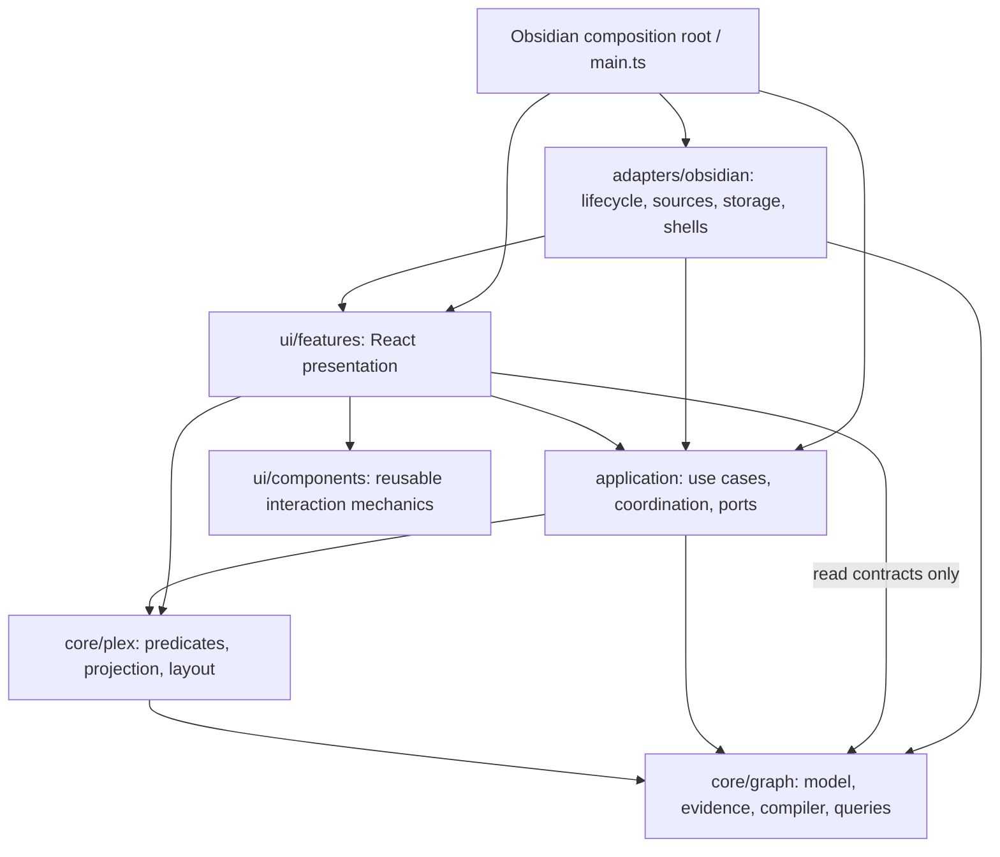
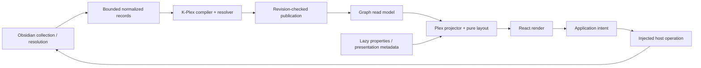

# K-Plex refactor plan and checkpoint ledger

Design reviewed against `main` at `3ac122e` on 2026-09-24. C00 baseline work began on `kplex-refactor` at `9b8e8c0` on 2026-09-25; see the ledger and `docs/REFACTOR_BASELINE.md` for current evidence.

## 1. Objective and scope

**Execution status (2026-09-27): C14 accepted; refactoring paused at the C14 boundary at the maintainer’s request.** Required automated/native checks passed and the maintainer accepted device validation: P1 passed; P2 indexing completed too quickly to induce physical overlap, which remains a recorded coverage limitation to revisit if an issue appears. Do not start C15 or another refactor handoff until explicitly resumed. Feature development may now proceed using the existing portable core, source/identity contracts, localization/environment rules and mandatory verification lanes. Remaining host facades are acknowledged migration seams, not proof of complete second-host readiness.

**Completed product correction (updated 2026-10-04):** [Settings-independent source indexing](docs/INDEX_SETTINGS_INDEPENDENCE_DESIGN.md) governs SI0–SI5 and supersedes conflicting historical SI handoffs/proof prerequisites. SI0–SI3, private SI4a, SI4-R1 durable source-local repair and **SI4-R2 known-impact host maintenance and all ten original SI4 Delivery 1/2 exits are accepted and finalized at `323b260`; SI5 is accepted on 2026-10-04 after the maintainer reports successful physical iPad and Android tests and requests closeout/PR creation**. The [fixed completion plan](docs/INDEX_SETTINGS_INDEPENDENCE_DESIGN.md#11-fixed-completion-plan) is complete. The [final acceptance report](docs/validation/settings-independent-indexing-si5-acceptance-2026-10-04.md) records device attribution, copy-only final validation and retained measurement limits. PR merge and release are separate repository actions. SI4b1/C1/C2/S1/S2/S2b/C3 are historical labels, not gates to finish in sequence. C15–C26 remain paused; necessary SI feature changes do not resume the structural refactor.

Create an architecture that supports continued agent-assisted enhancement with a small, explicit regression surface, separates K-Plex's knowledge-graph and Plex behavior from Obsidian so a future PKM integration is feasible, and makes all plugin-owned user-facing copy ready for future translation and the host's device, operating system and available interactions.

This is a behavior-preserving refactor. It is not a new graph engine, UI redesign, second-host integration, package split, or persistence migration. Keep Obsidian as the only production host. A small in-memory host is a test, not another application.

This file is the execution order, checkpoint ledger, decision log, and handoff record. `AGENTS.md` remains the repository's agent instruction source; `docs/ARCHITECTURE.md` will describe implemented architecture. Neither a proposed directory nor a planned interface counts as completed architecture.

Before each checkpoint, inspect the current source, callers, tests, and working tree. Paths below are verified starting points, not permission to ignore later repository changes. Preserve unrelated user work. Implement one checkpoint, or one explicitly recorded subcheckpoint, per agent session. Do not implement the whole document in one run.

### Changes from the draft

- Establish architecture rules and regression characterization **before** UI extraction, rather than waiting until after a complete component migration.
- Retain a small UI-first pass, but make collection/form abstractions conditional on real duplication; portability must not wait for a design-system project.
- Distinguish import direction from runtime data flow. Application code calls interfaces it owns; it never imports their Obsidian implementations.
- Strengthen existing `FuzzySearchInput`, evidence/resolver, parser, and `PlexScene` seams instead of recreating them.
- Define identity, source normalization, graph publication, invalidation, lifetime, and mutation behavior explicitly. Removing imports is necessary but insufficient.
- Prove host independence incrementally, starting with contracts and predicates. The final proof must not use the current Obsidian test stub or `window` shim.
- Replace broad work packages with checkpoints that name source seams, verifications, manual risks, and completion evidence.

## 2. Repository findings and baseline evidence

| Area | Observed implementation | Consequence for this plan |
| --- | --- | --- |
| Build | npm; Node `>=22.22.2 <23`; TypeScript checking plus esbuild; Obsidian types `1.13.0` | Keep the real build. Do not copy the Excalidraw plugin's Rollup workflow into K-Plex. |
| Test lane | `npm test` runs `scripts/run-indexing-tests.mjs` and `tests/indexing.test.mjs` | Existing tests are valuable but are not a portable-core proof or browser interaction suite. |
| Test mechanics | Source-text assertions plus selected TypeScript modules transpiled into a temporary directory; Obsidian/UI stubs and `globalThis.window = globalThis` | Code moves can fail source assertions without changing behavior; host globals can be concealed by the harness. Migrate protections deliberately. |
| Data model | `src/types.ts`: `GraphPage.file: TFile \| null`, path identity, mutable neighbor maps, transient section fields | Introduce new host-free read contracts and boundary mapping before replacing the legacy model. |
| Indexing | `GraphBuilder.ts` (~1,680 lines), `GraphIndex.ts` (~2,127), `main.ts` (~3,701) | Collection, compilation, persistence, presentation, and lifecycle already have partial seams; extract one responsibility at a time. |
| Semantic foundation | `RelationEvidence.ts`, `RelationResolver.ts`, `GraphState.ts`, `fieldParser.ts` | Reuse these implementations. Resolver/parser cooperative paths still use `window.setTimeout`; direct-import checks alone miss that coupling. |
| Lenses | `GraphPredicateEngine` takes `App`; `GraphLens.ts` takes `GraphIndex` | A lazy property provider and narrow evidence/read interfaces are early portability wins. |
| Layout | `src/ui/layout.ts` already exports `PlexScene`; `PlexGraph.tsx` is ~2,608 lines | Evolve the scene contract and extract derivation; do not invent a parallel scene engine. |
| Shared UI | `FuzzySearchInput.tsx` already owns selection/keyboard/portal mechanics, but imports `ObsidianIcon`; `LongPressTooltip.ts` owns delegated gestures | Reuse these. A button wrapper must not install a second long-press system. |
| Host UI/settings | `settings.ts` combines schema, defaults, migration, declarative settings and manager modals | Separate contracts from shells; do not replace native declarative settings with a new React settings framework. |
| Compatibility duplicate | Both `NewRelatedNoteModal.ts` and `.tsx` exist; esbuild deliberately prefers `.ts` | Preserve synchronization and extension resolution until an explicit retirement decision. |
| Automation | No architecture script in `package.json`; inspected workflows do not provide the required PR test/build/architecture lane | Add that lane early, on the actual working/default branch. Existing CodeQL targets `master`, while this checkout is on `main`. |

Review validation on Node **22.22.2**:

- `npm test`: passed, including the reported indexing 1–33/P1–P17, section 34–50, cache/predicate/incremental 51–59, creation/imagery 60–66, additive ontology 67–68, and placeholder/materialization groups.
- `npm run build`: passed against installed dependencies; `dist/main.js`, `dist/manifest.json`, and `dist/styles.css` produced.
- Initial shell selected Node 18; both commands were rerun using the installed Node 22.22.2 runtime. Future agents must check `node --version` before interpreting results.
- No Obsidian desktop, pop-out, physical-mobile, CodeScanner, or large-vault performance run was performed in this design review. These remain implementation gates where relevant.
- Working tree initially contained this draft as an untracked file. No source changes were made for the design review. Generated build output is not a source fix.

### Known documentation conflicts to resolve in C00

`AGENTS.md` has an older deletion paragraph saying deletion must not navigate, followed by a later **Deletion navigation invariant** requiring immediate history navigation; `tests/indexing.test.mjs` asserts the latter. Preserve immediate history navigation while retaining inbound-evidence/ghost semantics. Correct the stale paragraph with evidence in C00, not by silently changing runtime behavior.

The expanded-view text also mentions a fixed sibling `0.85` multiplier while the layout contract and `siblingScale()` use the configured 30%–85% multiplier. Characterize and document the existing configured behavior. Treat disagreements about intended product behavior as explicit decisions, not opportunities to redesign during extraction.

Some indexing documentation lags test coverage and current UI labels. Update only the parts needed to make the refactor contract unambiguous; avoid unrelated documentation churn.

## 3. Architecture decisions

### 3.1 Import dependencies

**Every arrow below means “may import.”** Runtime callbacks through an interface do not reverse these arrows.


```mermaid
flowchart TB
    ROOT["Obsidian composition root / main.ts"] --> HOST["adapters/obsidian: lifecycle, sources, storage, shells"]
    ROOT --> APP["application: use cases, coordination, ports"]
    ROOT --> UI["ui/features: React presentation"]
    HOST --> APP
    HOST --> GRAPH["core/graph: model, evidence, compiler, queries"]
    HOST --> UI
    UI --> APP
    UI --> PLEX["core/plex: predicates, projection, layout"]
    UI -->|read contracts only| GRAPH
    UI --> COMPONENTS["ui/components: reusable interaction mechanics"]
    APP --> PLEX
    APP --> GRAPH
    PLEX --> GRAPH
```

Core may use small host-free utilities. Application and feature UI may use shared contract types. Components may use React, ReactDOM portals, and standard DOM types; they may not import domain policy, plugin classes, or Obsidian helpers. Graph does not import Plex, React, application, host, DOM, Node built-ins, or browser storage.

Place capability interfaces at the **lowest layer that needs them**: a cooperative-work contract used by the compiler belongs in core; a navigation port used by an application use case belongs in application. Never make core import application merely because all interfaces were placed in an application folder.

Suggested homes, created only when an actual extraction lands:

```text
src/core/graph/         identities, evidence, resolver, compilation, read contracts
src/core/plex/          predicates, scene projection, pure layout calculations
src/core/contracts/    only small shared host-free contracts actually needed
src/application/       use cases, coordination, application ports and revisions
src/adapters/obsidian/ source collection, mutations, storage, lifecycle, UI shells
src/ui/components/     domain-independent React mechanics
src/ui/features/       portable feature content consuming application/Plex contracts
src/main.ts            Obsidian plugin entry and composition root
```

Existing paths may remain compatibility facades while consumers migrate. Do not add barrel exports that conceal outward dependencies. Do not create a monorepo, npm packages, generic service locator, or universal `PKMAdapter`.

### 3.2 Runtime flow


```mermaid
flowchart LR
    SOURCE["Obsidian collection / resolution"] --> RECORDS["Bounded normalized records"]
    RECORDS --> COMPILE["K-Plex compiler + resolver"]
    COMPILE --> PUBLISH["Revision-checked publication"]
    PUBLISH --> GRAPH["Graph read model"]
    GRAPH --> PROJECT["Plex projector + pure layout"]
    PROPS["Lazy properties / presentation metadata"] --> PROJECT
    PROJECT --> VIEW["React render"]
    VIEW --> INTENT["Application intent"]
    INTENT --> PORT["Injected host operation"]
    PORT --> SOURCE
```

The second diagram shows flow, not imports. React rendering must not perform semantic classification, arbitrary vault reads, or graph mutation. Host adapters provide source facts and execute effects; K-Plex owns precedence, reconciliation and ontology meaning.

### 3.3 Contracts that must be decided before extraction

| Contract | Decision and required proof |
| --- | --- |
| Identity | Introduce a named opaque `NodeId` concept. Initially preserve exact existing ID strings, including Obsidian paths and synthetic IDs. Core treats them as exact identifiers; it must not lowercase them, split `/`, infer a file extension, or parse `folder:` to discover kind. Adapt existing case-insensitive/path lookup in Obsidian compatibility code. Do not migrate persisted IDs during this refactor. Test IDs such as `entity:alpha`, unrelated labels, and case-distinct opaque IDs. |
| Kind vs availability | Represent document/attachment/container/tag/URL and resolved/unresolved state explicitly; a missing `TFile` is no longer the discriminator. Preserve all existing behaviors and synthetic-node conventions at the adapter boundary. Do not invent a schema for every future block-oriented PKM. |
| Host lookup | Adapter-owned lookup maps IDs to current `TFile`/host objects. Revalidate after rename/delete and before a write. Never store `unknown hostObject`, `App`, plugin, `WorkspaceLeaf`, or DOM objects in a core DTO. |
| Provenance | Keep declaring entity, declaration target, source kind, field, raw value, location and inverse perspective. Do not discard overridden evidence or merge duplicate declarations just because the visible edge looks identical. Source kinds may retain current names such as `obsidian-link`; a descriptive string is not a runtime dependency. Host location metadata may carry plain path/line/range data; only the adapter interprets it for navigation/editing. |
| Source records | Normalize host facts, reference-resolution results and semantic inputs, not final classified edges. Preserve source tiers, multiplicity, unresolved text, source-relative resolution, and revision information. Do not flatten frontmatter and body into one indistinguishable property map. |
| Shared URL references | Preserve one URL node identity per current URL key and every distinct note-to-URL declaration, including declaring note and location. URL nodes and their children already exist; preserve those relationships. A URL may have multiple note parents plus its origin-hierarchy parent; never encode a single owner in normalized records, compiler state, incremental cleanup or graph read contracts. Confirm this topology with a two-note fixture when moving the URL source family. Showing all referring notes when centering a shared URL is [feature request #26](https://github.com/zsviczian/kplex/issues/26), not a behavior change to implement during this refactor; diagnose visibility, node limits and projection before modifying indexing. |
| Properties | Lens lookup remains lazy and synchronous for today's cached Obsidian metadata. Supply only requested property values for materialized candidates. No arbitrary frontmatter dump in graph records, snapshots or IndexedDB. A future asynchronous host can preload a bounded presentation snapshot outside evaluation; do not introduce that infrastructure now. |
| Optional file semantics | Current `file.*`/`file.inFolder()` expressions remain compatible using an optional file metadata facet. Core never derives this from `NodeId`. Absent metadata follows characterized missing-value behavior; do not invent folders in hosts without them or change the saved lens syntax. |
| Settings | Separate semantic, presentation, and host/runtime views with narrowly named contracts. Keep persisted keys/defaults/migration unchanged, including legacy spellings. Do not import `settings.ts` into new core just for a type, expose the entire settings object through a port, or sanitize away unknown persisted keys. |
| State ownership | Builder owns private mutable work. The graph repository owns publication and committed per-file patches. Consumers get readonly views with stable revision boundaries, not mutable repository access. Avoid deep-copying the entire graph to obtain apparent immutability. Do not promise runtime immutability that a TypeScript `readonly` alone does not enforce. |
| Revisions/invalidation | Keep source revisions, committed graph revisions, presentation/settings revisions and view-local state distinct. Semantic changes update graph/search/affected caches at the same commit boundary. Sorting, lenses, visibility, title settings, pan/zoom and history do not rebuild semantics. A title change may refresh search terms independently. |
| Scheduling | Inject cancellation, time and cooperative-yield operations where needed. Preserve current slice budgets/read limits initially. No bare `window` or `Platform` in portable code; scheduler/runtime policy comes from the host. Cancellation remains distinguishable from failure and “needs rebuild.” |
| Lifetime | Plugin composition owns shared services; each view owns subscriptions, scene state, React root and interaction cleanup. Define disposal and late-result suppression on each extracted service. Hidden-but-mounted views do not count as visible indexing demand. Owner-document UI resources and shared storage are separate concerns. |
| Persistence | Existing settings/history/bookmarks/lenses are durable user data. Parsed-body and semantic graph stores are derived caches. Preserve formats, versions, storage names and atomic active-generation publication. Schema changes, if unavoidable, need a separate migration checkpoint with preservation/recovery tests. |
| Mutations | Application coordinates semantic intent, optimistic updates and reconciliation; Obsidian adapter owns YAML/file writes, native creation policy and trash. Keep provenance eligibility rules in one place. Report cancel/failure distinctly; failed writes must not leave false optimistic relationships. Do not claim a transaction across multiple native file writes. |

### 3.4 UI boundary and host-policy compatibility

- Keep Obsidian `Modal`, native menus, declarative settings, workspace leaves, editor integration, Sidecar, previews and icon acquisition in host shells. These need not become portable widgets.
- Continue using Lucide through Obsidian `getIcon()`. Reusable controls accept an icon slot or a small injected rendering capability; they do not import `ObsidianIcon` transitively. No second icon library.
- Reuse delegated long-press tooltip ownership. One gesture has one owner; consuming a long press must suppress its subsequent click. Do not emulate a native button's normal keyboard behavior unnecessarily.
- Use a small `--kplex-*` token layer for migrated reusable components only. Obsidian shell CSS maps it to existing theme variables. Preserve community themes, contrast, focus, disabled states, and existing feature classes during migration.
- Tokens and scoped styles must also reach body portals in the owning document, not only descendants of `.excalibrain-app`. Verify modal stacking and pop-outs explicitly.
- Portable React renders its own elements. Keep imperative Obsidian DOM-helper use in the host layer; importing helpers, relying on patched DOM prototypes, or wrapping them under another name does not make code portable. Keep scanner-compatible styling and scheduling.
- Do not migrate every native settings manager to React just to share a list. Share headless mechanics only when two actual consumers benefit.

### 3.5 View modes: projection policy and layout strategy

Keep an explicit distinction within `core/plex` between **what a view includes** and **where it places it**:

- **Projection policy** selects the bounded neighborhood, expansion depth and sibling inclusion, preserving semantic roles and evidence. Condensed/expanded presentation and sibling visibility are explicit options; they must not become duplicated graph-query implementations.
- **Layout strategy** consumes that projection and determines positions, zones, connector routing and the mapping of semantic roles to physical gates. The current structured Plex is the first strategy. A future rotated layout can reuse the same projection; a mindmap may combine a different bounded projection policy with a different layout strategy.
- **Scene/rendering contract** carries semantic identities/roles separately from physical positions and gate sides. Interaction code uses the strategy's explicit role-to-gate mapping, including the reverse mapping for drag/drop intent, instead of assuming that “top means parent.” Rotation changes presentation, not relationship meaning.

Keep mode/options in presentation state scoped to the owning view; include them in projection/layout cache keys. Switching modes must not rebuild or mutate the semantic graph. Preserve current persisted settings and defaults through boundary mapping during the refactor.

Introduce only the seam and the current behavior in C19/C20. Do not build a mode registry, plugin framework, mindmap or rotated product feature now. Future strategies should reuse the graph, predicates, provenance and application intents while supplying their own presentation policy and geometry.

### 3.6 Localization contract

Every **plugin-owned user-facing string** must be retrieved from a language file: button captions, menus, command names, settings, field labels, placeholders, tooltips, accessible/ARIA labels, dialogs, help/onboarding content, status text, notifications and errors shown to users. A string remains in scope when rendered through an Obsidian native API rather than React. Dynamic values from the vault (note titles, filenames, aliases, user-authored text), stable IDs/field names/protocol tokens, and developer-only diagnostics are data rather than translatable copy. **Console logs and console error messages remain English** for maintainer diagnosis; a user-visible error notice must use a localized message even if its diagnostic log is English. Do not build sentences by concatenating translated fragments or translate persisted identifiers.

L00 introduces one English source catalog in `src/lang/` and a typed lookup/formatting API with named parameters, plural support and an English fallback. The Obsidian adapter supplies the host language using Obsidian's language API; portable UI receives a translation capability and never reads `localStorage`, `window.app` or Obsidian directly for language. A future host supplies its own language preference through the same narrow port. Do not create non-English translations in this refactor. Keep English keys stable and text/context clear enough for later translators.

After L00, **every new or changed user-facing string must use the catalog**. Each UI/host checkpoint moves the strings it touches without altering their meaning or current English wording merely to satisfy a source-text assertion. L01 completes the remaining legacy copy inventory by surface and makes the rule executable: fail on missing keys, malformed parameters/plurals and newly hard-coded user-facing strings, with reviewed exclusions only for non-copy data. Record English-only fallback behavior honestly; future translations and translated documentation are a separate project. Do not mark the localization contract complete because a catalog file exists while users still encounter hard-coded plugin copy.

### 3.7 Host environment and shortcut presentation

Keep **device class**, **operating system/key convention**, **input capabilities** and **host feature availability** separate. Obsidian currently distinguishes desktop, tablet and phone (the existing persisted device key calls phone `mobile`); retain that mapping and behavior during extraction. A tablet may have a keyboard and mouse, and a desktop may use touch. Do not infer keyboard availability, hover support, pop-out support or a particular host API merely from screen width or `Platform.isMobile`. Preserve the current Obsidian-specific phone/tablet/desktop routing and layout profiles; audit their classifier and documentation before changing detection. A future PKM host provides its own environment information through the same narrow contract, without importing Obsidian into portable presentation or core.

The Obsidian composition/adapter boundary owns platform detection and capability decisions. Portable feature UI receives only the environment facts or semantic capabilities it consumes; pure graph semantics and layout algorithms must not inspect host/device globals. Capability-gate commands and UI affordances at the owning host/application boundary, with an accessible alternative where a gesture or key command is unavailable. Never show an instruction for an unavailable action. Refresh view-scoped presentation when relevant capabilities or input mode change; do not persist an inferred environment snapshot as user settings. Pop-out/window-local DOM and focus behavior still follow the owning window.

Represent keyboard gestures once as **logical shortcut specs** shared by registration/handling and display where feasible; otherwise test that the displayed hint matches the actual registered action. For host-owned or user-configurable shortcuts, obtain the effective binding when available; if it cannot be resolved, do not advertise a fixed key sequence. Localized UI copy composes with a host/environment-aware shortcut formatter. It renders the actual modifier names or symbols for the active convention (for example, Command/Option on macOS and Control/Alt on Windows), including platform-appropriate separators and key names. Never embed `Ctrl/Cmd`, `Mod`, `Option`, or a platform-specific literal in a translatable sentence or tooltip as a substitute for this formatting. A translated sentence receives a complete formatted shortcut as a named parameter, not concatenated fragments. Omit keyboard hints where the shortcut is unavailable or inapplicable; on touch-only surfaces describe the available touch action. A tablet or phone with an attached keyboard may show the applicable keyboard hint. Do not change shortcut semantics merely to improve the label.

## 4. Verification contract

### 4.1 Required lanes

Current commands are `npm test`, `npm run build`, `npm run check:architecture`, `npm run check:core`, `npm run lint:obsidian` and `npm run verify`. The separate `npm run verify:obsidian` lane requires an explicitly configured test vault and running Obsidian CLI. `check:core` was introduced by C08 and intentionally excludes DOM/Node ambient types.

`verify` currently runs architecture checks, portable-core type/runtime checks, Obsidian ESLint, all non-host test suites, and the real production build. Keep `npm test` as the aggregate non-host behavioral regression entry point as suites are added. These commands must work without an installed/running Obsidian application. CI must run the same aggregate lane; a standalone test file that no script invokes is not a guardrail. Keep `verify:obsidian` separate for real-host checks as described in section 4.6.

The existing harness transpiles selected files without full cross-module type checking. It must remain supplemented by the real repository build against installed Obsidian declarations. A second host-free lane must compile/import actual portable modules without stubbing their dependencies.

### 4.2 Architecture checks

Use the installed TypeScript parser/module resolver or another small maintainable dependency-graph implementation; a grep for `from "obsidian"` is only a diagnostic.

The checker must cover static imports, exports/re-exports, type-only imports and `import()` types, literal dynamic imports/require, aliases (`@/*`), and transitive reachability. Reject unresolved or nonliteral loading escape hatches in portable areas unless explicitly accounted for. Track forbidden globals/API families as well as imports: core cannot use `window`, `document`, `localStorage`, IndexedDB, Obsidian DOM extensions, Node filesystem APIs, or a plugin recovered through a global.

Start with migrated roots only, but check their entire reachable graph. A core module importing a legacy helper that imports Obsidian is a violation. Exception records name the exact edge, reason, owning checkpoint and removal condition; no directory-wide permanent exemption and no automatic baseline regeneration. New code must not increase the legacy coupling allowance.

Give the checker tests that deliberately violate rules, including a type-only leak and a transitive leak, and one permitted host-to-core import. Fail on newly introduced cycles between migrated layers. Use a dedicated core TypeScript config with ES libraries, no DOM libraries and no ambient Node/Obsidian types; do not rely on compiler configuration alone to prevent explicit forbidden imports.

### 4.3 Behavioral comparison, not snapshot blessing

Before moving a covered behavior, map its current assertions to the invariant they protect. Keep source-string checks until equivalent behavioral coverage exists. A mechanical path update is acceptable for a structural check; deleting assertions, keeping dead strings to appease them, or rewriting expectations to match a regression is not.

Capture normalized baseline results **before** altering the implementation. Compare:

- node identity/kind/resolution and structural membership;
- resolved roles, defined/inferred status, directions, hidden state and ontology definitions;
- evidence declarations and active/overridden decisions, original declaring direction and locations;
- neighborhoods, gate totals, search ordering and relevant presentation outputs;
- full-build versus incremental results after edit/rename/delete/materialize sequences;
- persisted decode/encode meaning and warm-restore behavior.

Sort unordered maps/sets for comparison and remove only documented nondeterministic fields. Never erase provenance, direction, duplicate declarations or ordering that is user-visible to make a comparison pass. Keep goldens stable until a separately approved product change. Where a temporary old/new comparison is useful, run it in tests; do not retain two complete graphs or compilers in production.

### 4.4 Risk-based verification matrix

Use the lane codes below in checkpoint records. All implementation checkpoints still run the aggregate tests/build and active architecture checks.

| Lane | Automated checks | Manual or measured evidence |
| --- | --- | --- |
| G — semantics | Compatibility fixture; explicit/frontmatter vs body; all roles/inverses; hidden/previous/next; folder/tag/URL/date/attachment/ghost; evidence decisions | Connection details and representative node navigation in Obsidian when adapter behavior changes. |
| I — incremental/lifecycle | Full vs incremental equivalence; semantic no-op; cancel mid-file/batch; stale revision; dirty backlog; optimistic edit during build; subscriber sees only committed state | Startup burst, hidden tab, reveal, close last view, reopen, unload during work; large vault and physical iOS for pipeline changes. |
| P — persistence | Settings compatibility; cold/warm restore; corrupt/stale/partial snapshot; generation activation; blocked storage fallback; late connection disposal; interrupted parse reuse | Reload existing vault/profile; cold interrupted/resumed iOS indexing. Use test storage, never clear user data for convenience. |
| U — interaction | Button activation/disabled; keyboard/focus/selection/Escape; outside pointer; focus restoration; busy/error; cleanup with a DOM-capable test harness | Main window and pop-out; light/dark/community theme; modal/body portal; physical touch/long press when touched. Desktop emulation cannot sign off touch. |
| X — Plex/layout | Deterministic scene output; keep-layout/reflow; gate shown/total vs hasAny; style-only lens; sections/folding/provenance; no graph mutation/rebuild | Zone symmetry, lateral bottom alignment, scroll packing, expanded children, sibling scale, camera preservation. |
| M — mutation/navigation | Success/cancel/failure/stale target; provenance-safe writes; optimistic rollback; deletion history; owning-view routing | Real temporary-vault YAML edits/trash, linked/unlinked/pinned tabs, Sidecar ownership and source-line navigation; platform-specific host behavior as touched. |
| H — host independence | Type/import checks plus clean-process tests with no Obsidian/DOM/window shim, host-free records and fake scheduler/provider | Demonstrates core reuse only; does not claim a working Logseq/Tana integration or host-independent native UI. |
| O — Obsidian automation | Capability preflight; deploy exact local build to a test vault; CLI-driven application/UI/performance scenarios exercising relevant G/I/P/U/X/M checks | Capture assertions, diagnostics, screenshots and measurements; record unsupported pop-out/device scenarios separately. Required when the affected host checks have a configured capable environment. |
| L — localization readiness | Typed English catalog; key/parameter/plural validation; source-copy inventory and negative hard-coded-string fixture | Check English fallback and representative labels/notices/help/ARIA text in a real Obsidian view. Non-English translation quality is out of scope. |
| E — environment adaptation | Host-free environment/shortcut tests across desktop, tablet and phone; macOS, Windows, iOS/iPadOS, Android and fallback key conventions; keyboard, pointer and touch combinations; unavailable-feature assertions | Check matching hints and actions on available Obsidian targets. Physical phone/tablet touch and attached-keyboard behavior require device evidence; desktop emulation is only a layout aid. |

For DOM behavior tests, select a minimal harness in C03 and record the choice. Do not bolt React UI tests onto the indexing suite's fake `window`. A DOM emulator can validate interaction contracts; actual Obsidian and physical touch remain separate evidence.

### 4.5 Performance evidence

C00 records a repeatable procedure using a representative large vault or non-private synthetic equivalent (20,000+ files / 100,000+ graph/search entries). Record device/OS/Obsidian version, dataset size, cold/warm cache state, duration, body reads, full/patch counts, maximum synchronous slice where measurable, and peak-memory observations. Keep vault contents out of committed artifacts.

Generate the reproducible synthetic input with `npm run fixture:large -- --out /absolute/path/to/a/new-folder --files 20000`; check it later with `npm run fixture:large -- --verify /absolute/path/to/that-folder`. The v2 generator copies the 13 Markdown notes in `tests/fixtures/excalibrain-indexing/Vault` and adds 20,000 deterministic, sharded notes with 100,000 explicit ontology declarations plus 2,000 inline declarations. About 10% of all Markdown files (2,001 of 20,013 by default) are exactly 950,000 bytes, containing very long paragraphs, large fenced code blocks and dense real links; ordinary notes create shared note hubs and URL targets. The default corpus is about 1.9 GB of Markdown. It refuses to overwrite an existing folder and writes a content-hash/count manifest. Keep generated vault data out of Git and use the **same verified folder and settings** for before/after measurements. Manifest link/declaration counts describe source input, not a measured K-Plex graph/search index; query the completed runtime index separately before claiming the 100,000-entry runtime target.

For hot-path changes compare before/after on the same environment. Require zero new full rebuilds for presentation-only actions, no full evidence scan for a per-file patch, no arbitrary property copies, and no extra whole-vault body reads on a fresh warm restore. Preserve bounded reads, time slicing and iOS prewarm behavior. Agree numeric timing/memory tolerances from actual baseline measurements in C00; do not invent universal millisecond budgets or use flaky CI timing as the sole gate. If measurements are unavailable, record performance validation as pending.

### 4.6 Environment-aware host automation for coding agents

Codex, Claude Code and other implementing agents should run applicable real-host tests themselves whenever a configured Obsidian environment is available. Keep this workflow in repository scripts and contributor/agent instructions, independent of the agent product. Automate repeatable application, UI and performance checks; do not equate a successful reload or a screenshot with a passed scenario.

**Verified CLI basis (2026-09-25):** The official CLI controls the desktop application, which must run and may be launched by a command. Detect the installed version and commands using `obsidian version` and `obsidian help`; installation of Obsidian alone does not establish CLI readiness. Explicit `vault=<name-or-id>` comes before the command. Available developer commands include `plugin:reload`, `dev:dom`, `dev:css`, `dev:screenshot`, `dev:errors`, `dev:console`, `eval` and `dev:cdp`. Recheck local help instead of assuming a fixed capability set. [Official CLI reference](https://help.obsidian.md/cli).

**Phone/tablet desktop emulation:** In the disposable test vault, `obsidian vault=kplex-test eval 'code=app.emulateMobile(true)'` enables Obsidian's mobile UI and reloads the window. Wait for CLI readiness after that reload. `window.resizeTo(width, height)` through `eval` changes the form-factor branch once the inner width settles; a tablet-sized window and a phone-sized window can then be checked for available commands, active layout profiles, routing and CSS. Obsidian also advertises `dev:mobile on|off` in local CLI help. Restore the original window dimensions and run `app.emulateMobile(false)` after the scenario, then confirm desktop command/profile behavior and captured errors. A first CLI command immediately after reload may fail transiently; retry after readiness rather than accepting that as a product failure. Emulation is repeatable host evidence for form-factor policy and layout, **not** evidence of native touch, on-screen keyboard, mobile WebView or OS-specific lifecycle. Extend the host runner with bounded emulation assertions and `finally` restoration when the affected UI checkpoint needs them; keep physical-device checks explicit.

**Separate the runners:** Keep shared fixtures, scenario expectations and result records independent of the host. Put CLI invocation, deployment and UI-driving details in test infrastructure such as `scripts/testing/obsidian/` and `tests/host/obsidian/`, outside shipped `src/` and the core dependency graph. Future hosts can implement their own driver and applicability list; do not build a universal automation framework now. No Obsidian CLI dependency belongs in portable tests, production runtime, or generic application contracts.

**Local build and test loop:**

1. Preflight the CLI, desktop connection, required commands and explicitly configured test-vault identity/path/config directory. Use bounded timeouts. Record versions and capabilities; distinguish missing setup from a command/assertion failure. Never fall back to the currently active personal vault. Establish a dedicated fixture vault, following [Obsidian's development-vault guidance](https://docs.obsidian.md/Plugins/Getting%20started/Build%20a%20plugin), and keep machine-specific paths out of committed configuration.
2. Run `verify`, then stage this checkout's `dist/main.js`, `dist/manifest.json` and `dist/styles.css` into that vault's plugin directory for `k-plex`. `kplex-test` is a disposable playground: overwrite prior plugin bundles without backing them up. Validate destination and artifact hashes; keep plugin data/settings for warm-restore cases unless a scenario explicitly resets them. Disable the test plugin while replacing artifacts, then enable/reload through the CLI. Restart the test application when required by manifest changes. `plugin:install` installs a community plugin; it does not deploy an unpublished local build. Do not test a downloaded release instead of the changed code.
3. Drive the relevant fixture scenarios through registered commands and real UI input. Discover command IDs rather than invent them. Use DOM/CSS assertions and screenshots for rendering; use CLI-supported CDP/input automation where available for keyboard/pointer/focus flows. Direct `eval` invocation of application methods is useful for state checks but does not prove UI event wiring. Wait for observable readiness and expected state with deadlines, not arbitrary long sleeps.
4. Assert outcomes and capture errors/console output per scenario. For performance, use section 4.5's datasets, repetitions and cold/warm conditions; distinguish CLI round-trip time, indexing completion and visible rendering. Any temporary measurement hooks stay development/test-only and are removed or disabled in production. Verify pop-out target/window coverage explicitly; if the driver cannot reach it, leave that scenario pending.
5. Emit a machine-readable report plus failure evidence: source revision and dirty-tree/build identity, artifact hashes, runtime/OS/host versions, capabilities, fixture/settings/viewport, scenario IDs, assertions, timings and screenshot/log paths. A process exit code alone is not success. Clean up only resources owned by the test run; preserve artifacts needed to diagnose failures. Run cold-state cleanup only in the designated disposable fixture storage.

**Availability and acceptance rules:**

- Normal CI and machines without Obsidian run `verify` and portable/DOM-emulated scenarios. Record required Obsidian scenarios as **unavailable/pending**, with the reason and rerun command/artifact identity. Continue independent work; do not silently count a skip as host validation.
- An explicitly requested `verify:obsidian` run, or a dedicated host CI job, is strict: missing prerequisites, timeouts and failed assertions return nonzero. A separate preflight can report unavailable without failing the portable lane. Once a capable target is configured, agents run relevant host scenarios rather than routinely handing them back as manual tasks.
- For a future non-Obsidian implementation, mark Obsidian-specific scenarios **not applicable** with the target/reason and run that host's relevant integration checks. Absence of Obsidian on a machine does not make checks for the Obsidian product inapplicable.
- Automated evidence may satisfy a previously manual desktop gate when it tests the same behavior. Screenshots without assertions/review, desktop mobile emulation and synthetic clicks do not establish physical touch or platform-specific lifecycle correctness. Keep unautomated device/accessibility/platform checks explicit; do not promise universal full automation.
- A later equipped environment reruns pending scenarios against the exact build under acceptance. Source changes invalidate affected earlier results. Final acceptance of the Obsidian refactor still requires its applicable host gates; portable progress does not depend on installing Obsidian everywhere.

## 5. Agent execution and tracking protocol

1. Read this ledger and applicable `AGENTS.md`; inspect branch/status and checkpoint prerequisites.
2. State the selected checkpoint, exact behavior seam, current consumers, invariants, expected touched files and verification lanes. If a checkpoint contains several risky extractions, create lettered subrows before editing and execute only the first.
3. Characterize any missing behavior before moving it. Make the smallest extraction and migrate one representative consumer; retain an explicit facade if necessary.
4. Run required checks, including applicable CLI-driven host scenarios when a configured capable environment is available (section 4.6), inspect the full diff, and search for remaining callers, obsolete imports, accidental schema changes and diagnostics. Do not suppress failures to finish a checkpoint.
5. Update the ledger, append an action record and update architecture/component docs only for implemented contracts. Record exact verification evidence and the next small step. Close every checkpoint or subcheckpoint with a concise automated-test summary (command, environment, pass/fail and what it actually proves) and prioritized maintainer-test recommendations. Recommend only the 1–3 highest-value checks by likelihood and impact; give each an exact workflow, target, expected observation and reason automation did not cover it. State **no manual test needed** when automated evidence is sufficient. Keep required but unavailable host/device checks visibly pending rather than treating recommendations as completion evidence.
6. Stop at the checkpoint boundary. Local build deployment to the configured disposable test vault is part of verification; do not commit, publish or deploy to a personal/production vault unless separately requested. Do not ask again for permission for routine authorized edits/checks.

**SI0–SI5 exception to task granularity:** the rules above about creating lettered subcheckpoints and taking the next smallest extraction apply to the paused refactor. Active SI work uses the three cohesive production deliveries in the independence design. Do not generate additional proof-only assignments or accept a private helper as a production milestone. Any scope expansion must identify a failing delivery exit and be reviewed for cost before another handoff.

### Temporary external-agent handoffs

The durable [mixed agent workflow](docs/AGENT_WORKFLOW.md) also applies to feature/fix development while refactoring is paused. The offline agent performs most implementation and substantial trace analysis; the Obsidian-equipped main agent prepares assignments, captures host evidence, reviews/fixes returns, validates the exact build and manages authorized repository actions. Preserve the standing header in `HANDOFF.md` and overwrite only its assignment/results body in either direction. A transfer may request a bounded host probe or supply minimized debug traces for offline analysis. No feature/debug handoff resumes C15–C26 automatically. Required unavailable checks stay pending unless the maintainer explicitly accepts a documented limitation; that decision is scoped to its assignment.

At each checkpoint boundary, consult the **Agent fit** column and proactively tell the maintainer whether the next checkpoint or a named slice should be handed to an agent without Obsidian access. For a selected handoff, the reviewing agent **preserves the standing header and overwrites the assignment/results body of the single root `HANDOFF.md`** with the current base revision, exact scope, preserved behaviors, acceptance checks, unavailable host checks and a short results template. Never create dated handoff files or archive old handoffs. The external agent implements only that scope and records its actual changes, commands, failures and pending host/device checks in `HANDOFF.md`; it does not mark the checkpoint Done in this plan.

When the modified repository returns, the main/reviewing agent independently inspects the full diff, reproduces checks on the required Node version, fixes defects, runs applicable Obsidian CLI scenarios in the explicit test vault, and reports up to three prioritized manual checks with exact expected outcomes and reasons they remain manual. **Validation is confirmed** when the required automated/host evidence passes and the maintainer confirms any requested manual checks. Only then commit the accepted checkpoint and move to the next one. If a required device is unavailable, keep its check and checkpoint in **Review** unless the maintainer explicitly accepts a recorded coverage limitation; do not call the unrun check a pass or independently waive it to finish a checkpoint. Transfer the accepted outcome, test evidence, limitations, facade owner and next step into this plan's ledger/action log. The next handoff overwrites the assignment/results body of `HANDOFF.md`, preserving its standing header; this plan, not the transient handoff, remains the durable record. A failed or rejected handoff is recorded here as such before it is overwritten.

If a product-policy conflict cannot be resolved from current instructions and tests, record it and ask one focused question; continue independent work. If required manual validation is unavailable and no explicit maintainer acceptance of its recorded limitation exists, mark **Review** rather than **Done**. Do not fabricate a smoke test or block independent work just because a device is unavailable. Dependent high-risk expansion waits for its prerequisite acceptance evidence.

Status values: **Pending**, **Active**, **Review** (code checks pass; named validation outstanding), **Done**, **Blocked** (specific dependency/decision), **Deferred** (explicit scope reason). A deferred optional UI checkpoint does not block core work. Reverted checkpoints return to Pending with an action-log entry.

Completion requires: stated behavior preserved, production consumer migrated (unless explicitly a test/contract checkpoint), required lanes passed, no unapproved persisted changes, cleanup owner identified, and log updated. A facade or “legacy” module must have a finite consumer list and named retirement checkpoint.

Rollback is normally a reviewable reversal of that checkpoint's code and tests, preserving unrelated work. Because persisted formats remain unchanged, restoring the previous implementation should read the same data. Never use destructive Git reset or delete caches/user data as a substitute for a rollback design. Test-harness/checker checkpoints may be rolled back independently; semantic comparison failures block later semantic work.

### Progress ledger

IDs C00–C26 replace the draft's numbering; E00 and L00/L01 are inserted environment and localization checkpoints. The review evidence above is a seed for C00, not completion of its manual baseline.

| ID | Deliverable | Prerequisites | Lanes | Agent fit | Status / evidence |
| --- | --- | --- | --- | --- | --- |
| C00 | Baseline, conflicts, invariant inventory | — | G/I/P/U/X/M | Host | Review — Node 22 `verify`, inventory, exact-build CLI render/error smoke and maintainer's qualitative v1 graph inspection; v2 large-file fixture verified, but its runtime completion, representative interaction and cold/warm performance remain pending (see baseline doc) |
| C01 | Behavior characterization and test seams | C00 | G/I/X | — | Done — canonical graph/evidence/scene fixture, pair comparison, stub guard and source-check map; Node 22 test/build pass |
| C02 | Dependency rules, checker, PR verification and optional-host runner | C01 | H/O | — | Done — C02a/C02b local lanes pass; remote CI unverified |
| C02a | Architecture rules/checker and portable CI lane | C01 | H | — | Done — checker/self-tests, `verify`, PR CI and architecture guide; remote CI unverified |
| C02b | Environment-aware exact-build Obsidian runner | C02a | O | — | Done — strict preflight/staging/report tests and real `kplex-test` render/error smoke pass |
| E00 | Host environment/capability seam and device-class preservation | C02 | E/H/U | Strong | Done — Node 22 `verify`, exact-build desktop CLI and phone/tablet emulation checks passed; maintainer confirmed manual validation and requested commit |
| L00 | English language catalog, typed lookup, host language seam and shortcut formatting | E00 | L/E/H/U | Strong | Done — Node 22 `verify`, exact-build host render/notice/ARIA and desktop/tablet/phone emulation pass; maintainer confirmed physical F4 check; no translations |
| C03 | Token/icon seam and one action primitive | L00 | U/L/E | Scoped | Done — reviewed C03a button/navigation and host CSS; Node 22 `verify`, exact-build desktop/pop-out/tablet/phone CLI checks and maintainer's desktop/tablet/phone interaction checks passed |
| C04 | Floating-layer mechanics from existing consumers | C03 | U | Scoped | Done — C04a `PlexFilter` extraction, owner-document/Escape fixes and narrow toggle labels; Node 22 and exact-build host checks plus maintainer physical touch/keyboard checks passed |
| C05 | Host-free shared suggester | C04 | U | Scoped | Done — C05a and keyboard-viewport correction pass Node 22, browser DOM and exact-build Obsidian checks; maintainer confirmed physical phone experience |
| C06 | Shared collection mechanics, if justified | C05 | U | Scoped | Done — three native managers reuse bounded collection windows; localized next-batch captions, Node 22 verification and desktop/pop-out/tablet/phone manager checks passed |
| C07 | Form/dialog content, if justified | C05 | U/M | Scoped | Deferred — source survey and reviewer assessment confirm differing validation/action/async policies; no content conversion justified or runtime dialog change made |
| C08 | Host-free graph/settings contracts and identity seam | C02 | G/H | Strong | Done — exact opaque IDs, explicit node/file/settings views, legacy mapper and restricted core type/runtime lane; mapping, settings preservation, full warm restore and six-kind navigation validated |
| C08P | Indexer stabilization, restore watchdog and performance roadmap | C08 | I/P/H | Scoped | Done — clean Node 22 verification, exact-build 20k-vault warm/timeout/fallback/late-work/reload and tablet/phone emulation passed; evidence in `docs/validation/C08P-2026-09-26.md`; C00 cold/native matrix remains open |
| C09 | Narrow graph read interfaces | C08P | G/X/H | Strong | Done — portable production SearchBox/read port; full verify, browser consumer and exact-build large-vault search/refresh acceptance passed |
| C10 | Lazy property provider and portable predicates | C09 | G/X/H | Strong | Done — portable predicate/parser/lens runtime; full verification, prior-evaluator comparison and exact-build property/style/evidence/Reflow acceptance passed |
| C11 | Normalized source contract and test records | C08P | G/H | Strong | Done — source-family/provenance review, exact Node 22 verification and clean-process fixtures passed; shipped artifacts identical to C10; `docs/validation/C11-2026-09-26.md` |
| C12 | Obsidian source collection boundary | C11 | G/I/P | Scoped | Done — C12a–C12c accepted; all current semantic source families feed production normalized collection; compiler portability remains C13 |
| C12a | Full-build file/container/tag collection | C11 | G/I/P | Scoped | Done — bounded production structural adapter; Node 22.22.2/full verify and exact-build native semantic/workflow acceptance passed |
| C12b | Host link summaries and ontology source facts | C12a | G/I/P | Scoped | Done — required Node/full verification, exact-build native graph/oracle and incremental-edit acceptance passed |
| C12c | Date/URL/body/presentation facts and complete collector wiring | C12b | G/I/P | Scoped | Done — required Node/full verification, accepted-compiler/native metadata parity, final exact-build smoke and cleanup passed |
| C13 | Host-free full compiler/resolver/parser path | C12 | G/I/H | Strong | Done — C13a–C13c accepted; measured worker experiment remains separate C13W |
| C13a | Portable parser grammar and injected cooperative runtime | C12 | G/I/H | Strong | Done — exact accepted grammar/oracle parity, required Node/full verify, real worker/fallback/cancellation and native edit acceptance passed |
| C13b | Portable evidence/resolver and semantic types | C13a | G/I/H | Strong | Done — independent accepted oracle/source parity, required Node/full verify, native high-degree edit/rename/cancellation and complete graph hash passed |
| C13c | Portable full compiler with production adapter wiring | C13b | G/I/H | Strong | Done — required checks, actual accepted-compiler/native parity and cancellation/binding acceptance |
| C13W | Separate measured worker-pool experiment | C13, C00 performance evidence | P/H | Host | Deferred — no worker/platform policy change in C13 extraction |
| C14 | Incremental compiler and commit contract | C13 | G/I/H | Scoped | Done — C14a/C14b accepted; device P1 passed, P2 accepted with physical overlap not reproduced; refactor paused |
| C14a | Shared portable per-source semantic patch preparation | C13 | G/I/H | Scoped | Done — shared preparation, strict/native oracle and cancellation accepted |
| C14b | Coherent publication and host integration acceptance | C14a | G/I/H/P | Host | Done — strict/native checks passed; maintainer accepted device results with P2 overlap limitation; refactor paused |
| C15 | Index demand/revision coordinator | C14 | I/P | Scoped | Pending |
| C16 | Snapshot/cache orchestration behind storage ports | C15 | P/I/H | Scoped | Pending |
| C17 | Search extraction | C09, C14 | G/I/H | Strong | Pending |
| C18 | Presentation metadata/settings ownership | C10, C17 | X/I/H | Scoped | Pending |
| C19 | Plex projector using existing scene pipeline | C18 | G/X/H | Scoped | Pending |
| C20 | Pure layout and transient-section projection | C19 | X/I/U/H | Scoped | Pending |
| C21 | View-scoped navigation intents | C09 | M/U | Scoped | Pending |
| C22 | Relationship mutation intent and host writer | C14, C21 | G/M/I | Scoped | Pending |
| C23 | Creation/materialization/deletion intents | C22 | G/M/I/P | Scoped | Pending |
| C24 | Explicit Obsidian shells and composition cleanup | C05, C16, C20, C23 | U/M/P | Host | Pending |
| L01 | Finish legacy user-copy and shortcut-hint extraction; strict localization gate | L00/E00; remaining C24 shell cleanup deferred | L/E/U/M | Scoped | Done — scoped localization review, strict/native checks and accepted-English compatibility passed; no translations |
| C25 | Complete enforcement and retire migration facades | C24, L01 | all | Scoped | Pending |
| C26 | End-to-end in-memory proof and final acceptance | C25 | H + all relevant | Host | Pending |
| SI0+SI1 | Settings characterization/diagnostics plus presentation ownership | SI design; maintainer selected mixed-agent execution | I/P/X/H | Strong | Accepted — native/pinned-runtime evidence recorded below; C15–C26 remain paused |
| SI2 | Neutral reference facts, shared full/patch selection and fingerprints | Accepted SI0/SI1; scoped mixed-agent assignment | I/P/X/H | Strong | Accepted — exact portable/browser/build/native evidence recorded below |
| SI3 | Durable neutral source repository, migration, activation and selective acquisition | Accepted SI2; scoped mixed-agent assignment | I/P/X/H | Strong | Accepted — exact portable/browser/build/native evidence recorded below |
| SI4a | Private cached-source replay and source-scoped semantic preparation | Accepted SI3; scoped mixed-agent assignment | I/P/X/H | Strong | Accepted — portable/browser/build/native evidence below; live settings route unchanged |
| SI4 | Live settings reinterpretation and routine source/index maintenance | SI0–SI3 and SI4a; fixed completion plan | I/P/X/H/O | Offline implementation + online host validation | Accepted (`323b260`) — all original Delivery 1/2 exits, runtime consolidation, full verify and exact-artifact small/large native settings/maintenance checks pass |
| SI5 | Bounded warm restart, truthful progress and final device sign-off | Accepted SI4 | I/P/X/H/O/M | Mixed | Implementation committed `62c728393440aa3dfb57869ece83c4060092bcba`; cold accepted and 20k hub outside critical path by maintainer decision 2026-10-04; startup measurement underway, no optimization authorized before the findings report |

**Agent fit:** **Strong** means a no-Obsidian agent can implement and run the portable checks; the reviewing agent still owns applicable host validation. **Scoped** means hand off only a named slice with a buildable boundary and leave host-dependent behavior to the reviewer. **Host** means the checkpoint should remain with an Obsidian-equipped agent. This is a planning recommendation, not a waiver of prerequisites or acceptance lanes. Reassess it when starting each checkpoint and proactively tell the maintainer whether the next step is a handoff candidate.

Recommended order is table order, with C06/C07 deferred unless demonstrably useful. C21 can occur earlier if it unlocks a specific portable UI consumer. Do not postpone all boundary tests to C26.

### Required subdivisions for larger checkpoints

These parent checkpoints are **not single-session implementation tasks**. Execute the listed slices in order; add a ledger subrow and action record for each as it starts. Parent status becomes Done only after all required slices pass. Each slice retains the parent's verification lanes and must build with the remaining legacy paths.

| Parent | Prescribed independently reviewable slices |
| --- | --- |
| C02 | C02a: architecture rules/checker and portable CI lane; C02b: host capability preflight, local-build staging and minimal CLI smoke/report runner. Extend scenarios with the checkpoints that need them; do not wait for a complete UI test framework. |
| C12 | C12a: file/container/tag source facts; C12b: resolved/unresolved link and ontology occurrences; C12c: remaining Date/URL/body source facts and complete collector wiring. Inventory exact source ownership first so overlapping source kinds are not emitted twice. |
| C14 | C14a: characterize and extract shared portable per-source semantic preparation, wiring the production patch path while retaining host commit/binding; C14b: extract coherent publication and complete observer/latest-wins/creation/rename/delete/cancellation plus physical iOS acceptance. |
| C16 | C16a: serialization codecs separated from host binding; C16b: snapshot generation orchestration/storage port; C16c: body-cache/parser service ownership. Keep the active-generation transaction inside its storage implementation. |
| C18 | C18a: labels and sort inputs; C18b: style/visibility and invalidation; C18c: lazy imagery and host title-script boundary. |
| C19 | C19a: ordinary center projection; C19b: filter/lens/count and keep-layout/reflow paths; C19c: expanded-neighbor paths. |
| C20 | C20a: pure numeric layout; C20b: section acquisition/projection separation. |
| C22 | C22a: additive relationship intent; C22b: relink; C22c: provenance-safe unlink. |
| C23 | C23a: creation and folder-child flow; C23b: ghost materialization; C23c: deletion/history/cleanup. |
| C24 | C24a: remaining modal/menu/settings/editor host shells; C24b: view/workspace/Sidecar integration ownership; C24c: composition and lifecycle cleanup. Split either shell family further if it spans distinct lifetimes. |
| L01 | L01a: settings/commands/native menus; L01b: React controls, dialogs, help, accessibility copy and shortcut hints; L01c: notices/user-visible errors and final literal/key audit. Keep each slice buildable and preserve its English behavior. |

Do not mechanically extract code into a new service whose constructor still takes the plugin. That only relocates coupling. When a slice cannot stay buildable without a broader rewrite, add a temporary narrow facade and record its callers/removal checkpoint instead.

### Active SI delivery tracker — updated 2026-10-03

The detailed scopes and pass conditions live in [the independence design, section 11](docs/INDEX_SETTINGS_INDEPENDENCE_DESIGN.md#11-fixed-completion-plan). This table tracks delivery evidence, not additional subgates. Update these rows in place; historical action-log entries below retain their original verdicts.

| Remaining delivery | Status | Observable finish | Evidence / next action |
| --- | --- | --- | --- |
| 1 — Working settings independence (SI4) | Accepted (`323b260`) | Live ontology/inference/image changes use cached facts; current view, gates, siblings, expansion, search, explanation and edit eligibility agree. Zero valid-source reads/parses/reacquisitions and no full build; navigation and S1→S2→S3 work. | Final actual saved-policy scenarios pass in both native vaults; all original exits closed. [Evidence](docs/validation/settings-independent-indexing-si4-acceptance-2026-10-03.md). |
| 2 — Routine maintenance and consolidation (SI4) | Accepted (`323b260`) | Ordinary edits update affected source/dependency entries locally; rename/delete/aliases/structural support and uncertain-host reconciliation converge. High-degree work progresses in bounded slices; caches/leases stay bounded. | R1/R2 preserved; high-degree atomic completion, runtime consolidation and final native file/folder/drift/idle checks pass. |
| 3 — Restart, scale and release acceptance (SI5) | Implementing; not accepted | Valid source progress survives settings/reload/sync/cache damage; warm adoption avoids routine all-source replay; required desktop/iPad/Android work/latency/memory gates pass. | One startup/cleanup implementation package and exact-build online/device evidence. Investigate the recorded large-restart watchdog/SIGTRAP before startup acceptance; physical checks remain pending. |

**Cost control:** target one substantial implementation return plus online review for each delivery; consolidate any correction. If a blocker survives that correction, report an alternative and cost impact before another assignment. Track actual available token/elapsed-effort data; historical total cost is unknown. No completion percentage or finish-time claim follows from test counts. Runtime verification remains mandatory; documentation-only resets do not rerun the runtime suite. The unsent `7b7b3ca` handoff and its `repository.zip` must not be sent as a current assignment.

## 6. Checkpoint playbook

### C00 — Establish baseline and freeze observable behavior

**Inspect:** `AGENTS.md`, package/build/test scripts, `docs/INDEXING_ARCHITECTURE.md`, compatibility fixture README, `types.ts`, and the major files in section 2.

**Change:** Record baseline revision/runtime, test/build results, known failures, performance procedure and representative UI captures. Create a compact invariant-to-test/manual-check table in `docs/REFACTOR_BASELINE.md`. Resolve the documented deletion/sibling instruction inconsistencies against current behavior; record remaining decisions. Inventory duplicated UI mechanics and direct/transitive host dependencies without attempting cleanup.

**Verify/exit:** Real Node 22 build/test passed or pre-existing failures explicitly recorded; baseline includes all seven node categories, existing settings restore, Sidecar ownership, gate semantics, sections, filters and touch behavior. List unavailable device checks explicitly. No runtime changes.

**Main risk/manual:** Freezing an accidental or contradictory expectation. Compare observed behavior to tests and current product rules before declaring a golden baseline.

### C01 — Make regression protections survive code movement

**Inspect:** `tests/indexing.test.mjs`, its explicit transpile list, stubs and source-text assertions.

**Change:** Add reusable canonical graph/evidence comparison helpers and baseline fixtures. Separate test harness plumbing from behavioral assertions where necessary; preserve aggregate coverage and invocation. For the first planned extractions, replace brittle source placement checks with tests that exercise the protected behavior. Document remaining source checks and their intended invariant. Do not rewrite all tests at once.

**Verify/exit:** Intentionally break one fixture expectation to prove the lane fails, then restore it; full/patch output comparison retains suppressed evidence and direction. Test helpers compile newly extracted imports instead of silently stubbing the implementation under test. Existing suites still run.

**Main risk/manual:** Green tests after losing an assertion. Review assertion mapping; no host smoke needed for test-only changes.

### C02 — Add the architecture contract and executable guardrails

**Change:** Create `docs/ARCHITECTURE.md` with the import diagram, layer ownership, current migration status and feature-placement guide. Add the scoped dependency checker and its negative tests from section 4.2. Introduce `check:architecture` and aggregate `verify`, and a PR CI job on the actual default branch using supported Node 22, installed lockfile dependencies, tests and build. Add `check:core` to the aggregate only when C08 creates it.

C02b adds section 4.6's environment-aware `verify:obsidian` runner and documents one-time test-vault/CLI setup in contributor guidance. Start with exact-build deployment, opening K-Plex, a real rendered-state assertion and error capture. Test preflight/report/failure handling without Obsidian; execute the real smoke test when available and keep that evidence pending otherwise. A host-unavailable C02b review must not block independent portable checkpoints; only checks requiring its actual host evidence wait. Add UI/performance scenarios as their behavior is extracted.

Update `AGENTS.md` with rules for new/migrated areas, not claims that legacy code has already moved. Record exact grandfathered roots/edges and removal checkpoints. Rules include transitive/type-only coupling, no plugin escape hatches, single semantics owner, and no weakening tests to accommodate moves.

**Verify/exit:** A deliberate direct, transitive and type-only leak fails locally; permitted adapter-to-core imports pass. CI configuration invokes the same lane; report remote CI as unverified until it actually runs. No false claim that empty folders prove independence.

### E00 — Establish the host environment seam without changing device behavior

**Inspect:** `src/ui/viewProfile.ts`, persisted layout-profile keys, platform branches in `main.ts`/indexing, shortcut registrations/handlers, tooltip/help strings and the mobile instructions in `AGENTS.md`. Reconcile any mismatch between documented and actual phone/tablet classification with installed Obsidian typings before changing detection; preserve the existing behavior and keys in this checkpoint.

**Change:** Define a small host-free presentation-environment contract for device class (`desktop`/`tablet`/`phone`), OS/key convention, available input modes and the specific host capabilities consumed by UI. Map the existing Obsidian classifier and feature availability into it at the host boundary; keep the legacy persisted `mobile` profile key through a boundary mapping. Pass the narrow facts to a representative portable UI consumer rather than importing `Platform` or reading `window` there. Keep performance/worker/memory policies in the Obsidian source/storage adapters or injected scheduling policy, not in presentation environment. Do not build a global platform singleton or a speculative matrix of every future host feature.

**Verify/exit (E/H/U):** Pure fixtures cover desktop, tablet and phone; macOS, Windows, iOS/iPadOS, Android and unknown key conventions; touch-only, keyboard-plus-touch and pointer/keyboard combinations; unavailable pop-out or host commands. Confirm current Obsidian routing and persisted layout-profile selection have not changed. The migrated consumer's reachable imports remain host-free. Record which physical device combinations could not be exercised. No shortcut or copy redesign occurs in E00.

**Main risk/manual:** Conflating Obsidian mobile with phone, or treating a tablet as touch-only. Check phone sidepanel routing, tablet tab/sidepanel availability and desktop pop-out in their applicable environments; real mobile touch remains a separate gate.

### L00 — Establish English localization files before UI extraction

**Inspect:** User-facing copy in `src/main.ts`, `src/settings.ts`, native modal classes and React controls; existing hard-coded key hints and the handlers they describe; the canonical `.ts`/compatibility `.tsx` modal pair; current Obsidian language API and locale guidance. Distinguish copy from ontology names, user data and serialized keys.

**Change:** Add the English catalog and typed lookup/formatting contract from section 3.6. Wire a narrow language provider at the Obsidian composition boundary, with English fallback, and migrate a few representative strings across a React control, native host shell, notice and help/ARIA surface. Add a pure shortcut formatter driven by E00's environment contract, with one representative tooltip/help hint passed as a named catalog parameter; define the logical shortcut beside its handling/registration when feasible. Keep locale resources out of core graph semantics and persist no language setting unless a separate product decision requires one. Document the key structure and usage for future agents. No non-English translation files or translated copy are required.

**Verify/exit (L/E/H/U):** Unknown keys, missing interpolation values and invalid plural forms fail tests; English fallback renders all representative surfaces; `npm run verify` and lint pass. Shortcut tests compare displayed hints with the actual logical action for macOS and Windows, and omit them for touch-only/unavailable actions. A clean portable UI test does not import Obsidian to obtain language or key convention. Check representative text/ARIA labels, one shortcut hint and one notice through the configured real-host lane. Record the inventory of remaining hard-coded legacy copy and key hints for L01. Do not make unfinished legacy strings disappear through an unchecked fallback.

**Main risk/manual:** Changing copy or command IDs while extracting text. Preserve user-visible English wording and stable persisted/command identifiers; compare the rendered surface before and after.

### C03 — Extract one action primitive and establish styling/icon seams

**Inspect:** `App.tsx`, `ThoughtNode.tsx`, `ObsidianIcon.tsx`, `LongPressTooltip.ts`, `styles.css`; select two genuinely equivalent buttons.

**Change:** Add a minimal reusable button with native button semantics, accessible name, disabled state and icon slot. Map only its required K-Plex tokens in host CSS. Reuse the delegated tooltip scope; document which layer owns it. Migrate two controls with equivalent interaction contracts, using L00's catalog and environment-aware shortcut display for any tooltip or key hint they expose. Introduce a focused DOM behavior lane and `docs/UI_COMPONENTS.md` describing only implemented primitives.

**Verify/exit (U/L/E):** Mouse/keyboard action fires once; disabled action never fires; long press consumes click; no duplicate `title` tooltip; icon/theme/focus unchanged. Any hint matches the active keyboard convention and action availability. Check main/pop-out and real mobile long press. Shared primitive and its reachable imports are host-free.

**Do not:** Convert every button, change toolbar layout, introduce another icon source, or create a general design system.

### C04 — Extract floating-layer mechanics from working code

**Inspect:** `FuzzySearchInput.tsx`, `PlexFilter.tsx`, `RelationPopover.tsx` and their distinct focus/modal behavior.

**Change:** Extract owner-document portal, anchor positioning, dismissal and cleanup into a small hook/component. Start with one existing consumer; record a second consumer migration as C04b if interaction policy differs. Share mechanics, not modal focus policy. Pass portal/theme context explicitly rather than hard-code `.excalibrain-app` into a supposedly generic layer.

**Verify/exit (U):** Outside pointer and Escape close the intended layer only; focus returns correctly; resize/scroll reposition; nested portal interaction does not count as outside; body portal receives tokens and appears above modal/Sidecar. Unmount/window close removes listeners/observers/scheduled work. Main/pop-out and physical mobile if pointer handling changes.

### C05 — Make the existing suggester host-free

**Inspect:** Existing `FuzzySearchInput`, `SearchBox`, and canonical `NewRelatedNoteModal.ts` call sites.

**Change:** Move/evolve `FuzzySearchInput` with icon injection and the proven owner-document floating mechanics where their policy fits. C04's `FloatingLayer` uses fixed below-anchor geometry and consumes Escape; do not force the suggester's above/below placement or input-focused Escape policy into it. Extend a shared primitive only for a small, explicitly tested policy seam, or keep the distinct suggester mechanics locally and document why. Keep ranking/filtering/results in callers. Use compatibility exports while needed. Preserve search vs relationship-picker differences: open-on-focus, closed-until-typing, retained selection and Ctrl/Cmd+Enter defaults. Keep canonical `.ts` and compatibility `.tsx` synchronized.

**Verify/exit (U):** Up/Down, Enter, Escape, selection scroll, focus, clearing/reopening, empty results, disabled state, composition/IME input and outside click. Result ordering unchanged. Relationship Link remains a separate commit action; Placeholder never becomes default create. No host import anywhere in the shared component's dependency graph.

### C06 — Consolidate collection mechanics only when justified

**Inspect:** Searchable style/ontology managers in `settings.ts` and existing React feature lists. Identify two consumers with the same behavior; list their differences first.

**Change:** Extract the smallest shared list/search/count/empty/show-more mechanics, or mark Deferred with the reason duplication does not justify it. Native declarative settings remain native. Domain filtering, sort, validation and mutations stay with callers.

**Verify/exit (U):** Counts, ordering, selection and pagination unchanged; no horizontal/nested scrolling regression on small screens. No whole-collection rendering introduced. Document actual reuse, not a hypothetical component catalog.

### C07 — Separate small dialog content when it helps

**Inspect:** Small rename/note-type/creation dialogs before complex relationship composition.

**Change:** Extract one shared field/action-row/busy/error primitive only if supported by repeated behavior. Keep `Modal` lifecycle, shortcuts and mounting in the Obsidian shell. Give async work an explicit owner and avoid acting on a disposed dialog. Survey every K-Plex dialog on phone/tablet with the software keyboard open; the C05 Add Link fix is the first mobile-shell example, not proof that the other dialogs fit. Use the host-owned visible-viewport policy where needed, without bringing Obsidian APIs into portable content. Keyboard-equipped tablet window presentation ([#35](https://github.com/zsviczian/kplex/issues/35)) and draggable desktop dialogs inspired by Excalidraw's `FloatingModal` ([#36](https://github.com/zsviczian/kplex/issues/36)) are separate feature requests, not refactor acceptance gates. Preserve a shell/content boundary that can support them later. Defer shared content if converting native UI would cost more than it saves.

**Verify/exit (U/M):** Validation, focus/Enter/Escape, double-submit prevention, cancel during async work and write failure; reopen has no stale state. On a physical phone, every dialog remains usable and scrollable with the software keyboard open, and suggestions/actions stay above the keyboard; check tablet and pop-out where applicable. Existing modal UX and native settings conventions preserved.

### C08 — Establish host-free types without migrating persisted identity

**Inspect:** `types.ts`, `GraphState.ts`, `RelationEvidence.ts`, `IndexSnapshot.ts`, schema/default sections of `settings.ts`, consumers of `page.file` and path parsing.

**Change:** Introduce identity/kind/resolution/read DTOs and minimal semantic settings types per section 3.3. Map legacy pages at a narrow boundary; avoid cloning every page/map per render. Separate needed settings contracts from the host settings implementation. Add `check:core` with restricted libraries/types and clean-process type/runtime tests. Keep the production legacy storage/model until migrated consumers prove the mapping.

**Verify/exit (G/H):** Every existing node kind and unresolved/URL/folder/tag mapping represented; no `TFile`, plugin, DOM or host settings import in new contracts. Pathless/case-distinct opaque-ID fixtures pass. Existing IDs, settings serialization and restore behavior unchanged. Mapper overhead is bounded and measured if used on a hot path.

### C08P — Stabilize and measure the production indexer before extraction

**Why this checkpoint exists:** A comparative review of Obsidian Dataview's index architecture identified several practical techniques that can reduce K-Plex startup/background cost, while issue #34 demonstrates that the current progressive snapshot restore can remain pending indefinitely after host automation/mobile-emulation churn. Do this bounded stabilization checkpoint **after C08 and before C09** so later C11–C17 extraction starts from a terminating, observable production indexer. This is not permission to redesign persistence or compilation ahead of their planned seams.

**External architecture findings (self-contained; Dataview source is not required to execute this plan):** Dataview treats indexing as per-file work feeding maintained secondary indexes, deduplicates/replaces queued file reloads rather than repeatedly processing stale edits, caches per-file indexed results, and uses a small parser-worker pool on desktop. K-Plex already has stronger properties that must be preserved: private/atomic graph publication, visibility-demand gating, semantic no-op fingerprints, bounded/time-sliced I/O, incremental per-file graph patching, transactional generation-scoped IndexedDB snapshots, and conservative iOS memory behavior. Borrow Dataview's *work-avoidance and maintained-index ideas*, not its mutable partial-publication model.

The opportunities and their intended owners are:

- **C08P now:** make progressive snapshot hydration phase-observable and guarantee that a stalled restore terminates into the existing rebuild path; establish repeatable cold/warm/full/patch measurements. Retain the existing edit coalescing/generation cancellation; only strengthen it here if measurement proves duplicate in-flight work remains.
- **C11/C12:** normalized records should be capable of representing a compact per-file semantic contribution. Do not persist it yet. This creates a future path for unchanged files to bypass repeated metadata/evidence reconstruction.
- **C13:** benchmark a small desktop parser-worker pool (Dataview uses a small pool; K-Plex should start by testing two workers) behind the host-owned parser strategy. Keep iOS worker parsing disabled unless measurements overturn the current structured-clone/memory rationale. Bound concurrency by bytes as well as file count.
- **C14:** make incremental compilation explicitly latest-wins per source path/generation. A file edited again while its older parse is in flight must not publish obsolete semantic work; avoid turning supersession into a full rebuild. Preserve per-file atomic commit/evidence ownership.
- **C16:** first extract today's snapshot/cache behavior byte-for-byte. In a follow-up performance subcheckpoint, evaluate **checkpoint + per-file semantic deltas** instead of rewriting the complete semantic snapshot after ordinary edits, with bounded compaction into a new full checkpoint. Also evaluate persisted normalized semantic shards. Any schema/version change requires an explicit migration/fallback design and remains an optimization, never authoritative user data.
- **C17 (or C13 when graph construction naturally owns it):** remove avoidable whole-state post-build passes by maintaining/building search/secondary indexes as graph pages are compiled, while preserving atomic publication. Measure memory before adopting this; do not trade one startup scan for large duplicate retained structures.

**Inspect:** `GraphIndex.restoreIndexedDbSnapshot()` / `restoreFullIndexedDbSnapshot()`, `IndexedDbCache` snapshot iterators, `main.ensureInitialIndex()`, current dirty-path patch scheduling, `docs/INDEXING_ARCHITECTURE.md`, issue #34, and C00 performance procedure. Confirm that ordinary edits are already Set-coalesced and generation checked before adding a new queue abstraction.

**Change:** Add bounded phase/progress diagnostics for metadata/targeted preview reads, page iteration, file rebinding, relation hydration, preview search, evidence hydration, resolver fallback, authoritative search and promotion. A hydration run has an explicit terminal outcome. Add an **inactivity watchdog**, not a universal total-startup deadline: if no phase/progress signal occurs for the bounded stall window, invalidate that hydration generation and resolve it as unsuccessful so `ensureInitialIndex()` marks the partial restore incomplete and proceeds through the existing authoritative rebuild path. Late completion of the abandoned IndexedDB operation must fail the generation check and must not publish. Keep diagnostics lightweight (sample progress timestamps rather than timing every record), local/offline, and free of telemetry. Do not delete the usable preview merely because hydration timed out. Preserve terminal outcomes and the last active phase against late callbacks/rejections; unload must immediately settle public waits, clear watchdog resources and prevent cancelled startup continuations from rebuilding. Follow `docs/OBSIDIAN_RUNTIME_TESTING.md` for exact-build CLI probes and test-only fault injection.

C08P deliberately does **not** introduce parser pools, semantic-shard persistence, delta logs, snapshot schema changes, search-index redesign, or new host-free compiler contracts. Those changes would be immediately reworked by C11–C17 and have the checkpoint owners listed above.

**Verify/exit (I/P/H):** Portable build/tests/lint pass. In an Obsidian-equipped environment, reproduce the #34 stress shape with the large synthetic vault: warm schema-3 restore, rapid plugin reloads and desktop mobile-emulation transitions. Capture hydration diagnostics while progressing and confirm every started run reaches `complete`, `failed`, `cancelled`, or `timed-out`; `hasPendingSnapshotHydration()` must not remain true indefinitely. Force or simulate a stalled snapshot read long enough to cross the watchdog and verify startup leaves the wait, the stale generation cannot later publish, an authoritative rebuild completes, graph cardinality/search/evidence match the fixture, and the index indicator returns green. Repeat a normal warm restore to prove the watchdog does not cause false rebuilds. Record cold/warm duration, body reads, full/patch counts and peak-memory observations using section 4.5's same-vault procedure. If CLI access is unavailable, implementation may enter **Review**, but C09 must not treat C08P as Done until this host validation is recorded.

### C09 — Narrow read interfaces and migrate one real consumer

**Inspect:** Read usage in `layout.ts`, `GraphLens.ts`, `PlexGraph.tsx` and search.

**Change:** Extract small lookup/neighborhood/evidence/search contracts based on actual consumers, starting with one. The current `GraphIndex` facade implements them and maps legacy objects to C08 views. Separate semantic relationships from presentation-filtered neighborhood queries; do not rename today's filtered query into a misleading “raw graph” API. Hide mutable maps and plugin access.

**Verify/exit (G/X/H):** One production path compiles against the interface, reads no `TFile` and preserves output; fake read-model tests use plain IDs/data. Search for concrete-index reach-through in that migrated path. Record remaining consumers rather than pretending the facade is gone.

### C10 — Extract lazy properties and portable predicate/lens evaluation

**Inspect:** `GraphPredicateEngine`, `GraphLens.ts`, `GraphLensSimple.ts`, `SimplePlexFilter.ts`, dependency-driven refresh callers.

**Change:** Replace `App` with a narrow cached-property/file-facet provider and replace `GraphIndex` evidence reach-through with C09 contracts. Keep AST/parser/evaluator semantics and persisted expressions intact. Separate metadata refresh notifications from graph rebuild requests.

**Verify/exit (G/X/H):** Clean-process tests for missing/null/list/scalar/negative operators, exact vs case-normalized comparisons, file facets, `this`, include union/exclude subtraction/style precedence and evidence suppression. Provider-call assertions prove only requested fields on candidate nodes are read. Arbitrary property changes refresh lenses without semantic changes; style-only lenses do not alter visibility/count mode. This is the first substantive host-free runtime proof.

### C11 — Specify normalized source input and fixture producer

**Inspect:** Each evidence source path in `GraphBuilder`, parser outputs, Date registry/Daily Notes resolution, file/tag trees, resolved/unresolved links and node-image exclusions.

**Change:** Define records only for existing behavior. Include source identity/revision/kind, semantic metadata, typed source occurrences, resolved targets or unresolved references, and provenance. Distinguish absent, deleted and unresolved entities. Host link resolution stays source-relative and adapter-owned; role classification/precedence stays K-Plex-owned. Host-specific Date formatting yields normalized targets with original property provenance. Do not collect arbitrary frontmatter or decoded imagery.

Specify iteration in bounded batches/streams and explicit snapshot/batch revision validity; do not materialize a second full-vault DTO array. Establish referential completeness for links to later records and a revision-checked publication condition. Produce test records from the compatibility fixture and a small opaque-ID fixture. Preserve C08P’s compact per-file semantic-contribution opportunity in the contract; persistence is deferred to a measured C16 follow-up.

**Verify/exit (G/H):** Every existing evidence kind has a recorded mapping; overridden/duplicate sources survive. Test two notes declaring the same URL with one target identity and separate source occurrences, alongside ambiguous names, subpaths, case/path resolution, missing targets and date targets. No host objects or host runtime required by the records themselves.

### C12 — Separate Obsidian collection from semantic compilation

**Change:** Extract one source family first, preferably file/container/tag facts with no body parsing. Follow with lettered checkpoints for link/ontology collection and Date/URL/body source facts. Keep one authoritative compiler consuming both migrated and temporarily legacy collection paths; no parallel relationship classifier.

Keep Vault/MetadataCache reads, link destination resolution, Moment/property registry access, parser-cache access and source revision checks in explicit host/runtime services. Shared Markdown parsing grammar can stay portable. Metadata may change across awaits; reject/requeue stale records rather than publish a mixed source revision as fresh.

**Verify/exit (G/I/P):** Baseline graph/evidence equality after each source-family move, unchanged cache hits/body read counts, and no doubled full input retained. Explicit property/body collisions, image-only links, Date links, shared URLs with distinct referrers and unresolved targets retain semantics. All source families cross the new boundary before C12 is Done. Keep per-file contribution ownership explicit so unchanged normalized records can later be reused without duplicating full-vault data.

### C13 — Make the full graph compiler host-independent

Implement buildable slices; keep the parent Pending until all three production paths are accepted. **C13a (Strong offline candidate)** moves parser types/grammar and cooperative scans behind an injected clock/yield/cancellation runtime, retaining the legacy host facade and self-contained worker function. **C13b (Strong)** moves evidence/resolver algorithms and required semantic types without SDK types or browser globals, preserving numeric enums and compatibility wrappers. **C13c (Strong)** moves full compilation over normalized facts into the portable owner and binds legacy host files only in the adapter. Each return receives independent main-agent portable/native acceptance and an overwritten transient handoff. Do not mark the parent complete after a parser-only extraction.

**Inspect:** `GraphBuilder`, `RelationResolver`, `RelationEvidence`, `fieldParser`, including indirect `window` scheduling and platform policy.

**Change:** Extract compilation over C11 records with injected cooperative work/cancellation policy. Move working algorithms intact; preserve evidence compactness, reference binding, precedence and time-budget checks. Host code chooses platform budgets and parser worker strategy. Keep worker and cooperative parser grammar shared. In the separately tracked deferred C13W experiment, evaluate the C08P two-worker desktop pool with byte/file concurrency limits; do not change the iOS worker policy without physical-device evidence.

**Verify/exit (G/I/H):** Compile the compatibility and opaque-ID fixtures in a clean process with no Obsidian module or `window` shim. Full results match C01. Test cancellation after awaited input/yield, stale generations, malformed long physical lines with real URLs, grammar parity and scaling. Production Obsidian path uses this compiler. A no-import lint pass alone is insufficient.

### C14 — Separate incremental work from publication

Implement buildable slices: **C14a (Scoped offline candidate)** extracts shared per-source semantic preparation and production patch delegation while retaining host commit/binding. **C14b (Host)** completes coherent publication extraction and the full latest-wins/optimistic-create/rename/delete/cancellation matrix, including physical iOS acceptance. Parent C14 remains Pending until both are accepted; C14a alone does not close its physical/publication gate.

**Change:** Extract current per-file patch/staging behavior onto the same normalized input/compiler contracts. Keep full and incremental semantics shared. Explicit outcomes distinguish committed progress, pending/cancelled work and genuine rebuild requirement. Preserve path-indexed declaration lookup through the identity boundary rather than scanning all evidence.

Publish graph changes, fingerprints, search changes and affected-cache invalidation coherently at the existing per-file commit boundary. Do not hold observers across awaits over partially mutated published data. Define stale revision/rename/delete interactions and preserve pending work when demand disappears. Carry C08P’s latest-wins per-source/generation rule through awaited parse/commit boundaries; supersession must retain current pending work without forcing a full rebuild.

**Verify/exit (G/I/H):** For edit/rename/delete/materialize sequences, incremental equals a clean rebuild; cancel at successive boundaries, resume, and compare again. No semantic event for prose/unrelated-property edits. Subscribers never see inconsistent state. Cancel is not an automatic full rebuild. Verify optimistic creation during an in-flight build and no O(all-evidence) small-edit regression. Physical iOS and large-vault smoke required.

### C15 — Extract demand and revision coordination from `main.ts`

**Inspect:** Initial restore/build tasks, metadata stabilization, dirty paths/revision, `performRebuild`, visibility listeners and debounce/catch-up scheduling.

**Change:** Extract one application coordinator receiving demand, source changes and explicit refresh intents. Obsidian continues owning event registration and leaf visibility detection. Keep startup ordering, once-per-session exception, revision acknowledgment and at-most-one catch-up behavior. Inject timers/policy and disposable subscriptions; retain forwarding plugin methods for unchanged consumers.

**Verify/exit (I/P):** Fake-scheduler tests for event bursts, hidden mounted tabs, zero demand, open/reveal/close, stale completion and unload. Never clear dirty work without publication; no automatic rebuild/persist/subscription work while hidden. Obsidian startup, pop-out visibility, reload and iOS cold cancellation must match baseline.

### C16 — Extract persistence/cache orchestration, preserving bytes and ownership

**Inspect:** `GraphIndex` restore/persist/hydration paths, `IndexSnapshot.ts`, `IndexedDbCache.ts`, `MetadataParser.ts`.

**Change:** First separate serialization codecs from host binding; then extract orchestration against narrow generation-store/body-cache interfaces as lettered checkpoints. Keep IndexedDB and Obsidian persistence implementations outside core. Retain main plugin storage ownership, cache versioning, active-generation transaction, parser-version keys, bounded hydration, retry deadline and late-connection cleanup. Do not introduce a new database or per-pop-out storage. Preserve C08P’s watchdog/diagnostic/late-publication and unload guarantees. After byte-preserving extraction, evaluate compact normalized shards and checkpoint-plus-per-file-delta persistence in a separate measured subcheckpoint with compaction and migration/fallback design.

**Verify/exit (P/I/H):** Existing stored fixtures restore; cold/warm/stale/corrupt/partial writes and blocked storage behave as before; interrupted writes never activate an incomplete generation. Real browser/Obsidian IndexedDB tests supplement fakes. Settings/history/pins/lenses survive reload. No cache schema/version change slipped into extraction; if required, stop that substep and document a separate migration proposal. Physical iOS prewarm/resume validated.

### C17 — Extract search behind the existing facade

**Inspect:** `makeSearchEntry`, `patchSearchIndex`, `search`, candidate-prefix reuse and display-name dependencies.

**Change:** Move search indexing/ranking into a service over IDs and explicit text terms. Adapter supplies path terms when available; presentation title refresh can update terms without semantic rebuild. Preserve exact > prefix > substring > ordered-subsequence ranking, alias/path matches, limits and tie ordering. Retain the C08P opportunity to build/maintain secondary search data during compilation; benchmark it separately after extraction, preserving atomic publication and checking retained memory.

**Verify/exit (G/I/H):** Golden ranking for short/extended/deleted queries, title/alias changes, rename/delete/ghost transitions; no stale entries or repeated title calculation inside sort comparators. Large query path benchmark and semantic-event counters unchanged. `GraphIndex` delegates to one implementation.

### C18 — Separate presentation metadata and settings invalidation

**Inspect:** `titleFor`, `sortNeighbours`, `isVisiblePage`, `relationView`, imagery lookup, `style.ts`, and setting-change dispatch.

**Change:** Extract one capability at a time: labels/sort, style/visibility, then lazy imagery. Keep current title scripts behind the existing host compatibility boundary; do not generalize script execution into the core or remove it as an incidental feature change. Images remain lazy presentation resources. Distinguish the existing semantic exclusion of image-only link occurrences from rendering image data.

**Verify/exit (X/I/H):** Label fallback/name-field order, style inheritance, sort order, sibling settings, lazy image resolution and script caching unchanged. Presentation changes invalidate appropriate view/search caches without semantic rebuilds; folder/tag topology stays present while hidden. No image data or arbitrary properties in graph snapshots. Record any currently semantic settings that cannot safely be reclassified without separate behavior work.

### C19 — Extract a Plex projector by evolving existing scene code

**Inspect:** `GraphIndex` neighborhood/gate views, `PlexGraph.tsx` filtering/expansion/derivation, `layout.ts`'s existing `PlexScene`.

**Change:** Establish an explicit projection input: graph revision/read model, center ID, presentation settings, compiled lenses, bounded property snapshot/provider and view-local expansion/filter state. Return ordered candidates, semantic roles, presentation counts and provenance references independently of physical orientation. Make the projection policy and layout-strategy boundary from section 3.5 explicit; retain existing positioned `PlexScene` as the rendering output rather than creating a parallel scene engine.

Migrate one ordinary center path first. Add lettered checkpoints for filtered/reflow and expanded paths; do not rewrite every branch in one diff. Cache by explicit graph/presentation/property revisions, not stale global settings or whole-graph serialization.

**Verify/exit (G/X/H):** Scene comparisons preserve center, roles, ordering, sibling rules, node limits, gate `hasAny` vs visible/shown counts, cross-link provenance and keep-layout/reflow. Include/exclude/style lenses use the existing evaluator and never deepen traversal or scan the vault. React consumes the projector output for the migrated paths without reclassification.

### C20 — Extract pure layout and section projection in separate substeps

**Change:** C20a narrows `layout.ts` inputs to projection, styles/labels and explicit numeric measurements; keep coordinates/scroll geometry identical. DOM measurements, ResizeObserver, camera, pointer/animation state and owner-window work stay in UI. C20b separates `SectionExpansion.ts` content acquisition from section parsing/projection; reuse evidence/resolver semantics and keep section IDs distinct from persistent node IDs.

C20a also makes the current role-to-zone/gate mapping explicit. Add a small test-only alternate mapping to prove that changing orientation preserves semantic roles, provenance and drag/drop intent, without implementing a new user-facing mode. Characterize condensed/expanded and siblings on/off combinations through the same projection/layout boundary.

**Verify/exit (X/I/U/H):** Baseline coordinates/zone bounds, bottom-aligned fitting lateral strips, overflow/repack, sibling/descendant scale, density and max columns unchanged. Nested folds project hidden relationships with original explainability; no transient section nodes enter snapshots. Fold/unfold preserves camera and stale reads cannot overwrite a different center. Main/pop-out resize and physical touch/scroll verified where affected.

### C21 — Replace navigation reach-through with view-scoped intents

**Inspect:** `App.tsx`, `PlexGraph.tsx`, explanation dialogs, `ContentPane.tsx`, `ExcaliBrainView.tsx` and Sidecar methods in `main.ts`.

**Change:** Pass a narrow per-view navigation capability with IDs and optional provenance location. Its Obsidian implementation closes over the owning leaf; no leaf/App/plugin in portable signatures and no mutable “current view” singleton. Keep Sidecar as a native owned leaf, with preview/editor rendering and workspace recovery in host integration.

**Verify/exit (M/U):** Two concurrent views route independently; source-line navigation uses the initiating view's Sidecar, suppresses unintended center follow, and preserves unrelated/pinned tabs. Linked/unlinked modes, ambiguous startup restoration, pop-out close and stale target outcomes match baseline. No global leaf fallback introduced for convenience.

### C22 — Separate relationship edit intent from native persistence

**Inspect:** Relink/unlink/additional-ontology paths, provenance checks, source-field choice and optimistic graph updates in `main.ts`.

**Change:** First extract one use case (add relationship), then relink/unlink in lettered steps. Application logic validates semantic intent and edit eligibility from evidence; adapter resolves current files and performs narrowly specified native property edits. Keep frontmatter/body precedence and sole-editable-source checks centralized; UI reports intent only.

**Verify/exit (G/M/I):** Write failure/cancel/stale source and rapid repeated actions; optimistic rollback and authoritative reconciliation; chosen target removed from old property while other values survive; destination properties appended in existing order; body/inline links never rewritten. Multiple evidence sources fall back to Connection details. Test real temporary-vault writes as well as fake writers. Preserve folder/tag editing restrictions.

### C23 — Separate creation, materialization and deletion one workflow at a time

**Change:** C23a extracts creation/folder-child creation; C23b ghost materialization and ID remapping; C23c deletion/history and property cleanup. Keep filename/new-note-folder resolution, Markdown/Excalidraw availability, trash and native editor behavior in Obsidian. Do not create dependencies on Excalidraw/Dataview as required runtimes.

**Verify/exit (G/M/I/P):** Creation appears optimistically then reconciles; pathless placeholder stays pathless until materialization; parent-derived locations and folder-child destination honored; inbound declarations survive deletion/dematerialization; history navigates immediately according to C00's resolved contract; body references remain user-owned; failures do not leave false links. Test cancellation/late completion during view close and concurrent index work. Persisted preferences and shared default create action unchanged.

### C24 — Isolate remaining host shells and composition

**Change:** Move remaining host UI shells, settings rendering/persistence, editor suggester, native menus/icons/previews, view mounting, window integration and Sidecar ownership behind explicit adapter modules, one family per subcheckpoint. Keep Obsidian device/OS/input detection and feature gating in those adapters, supplying E00's narrow environment contract to reusable presentation. Extract plugin-global services rather than moving all of `main.ts` into a renamed giant host class. Plugin remains the Obsidian lifecycle/composition entry; instances own explicit cleanup. Reusable UI and feature content receive only the capabilities they consume.

**Verify/exit (U/M/P):** Lifecycle reload/unload, all portal documents, two views, pop-out teardown and native settings work. No detached roots/listeners/timers or stale async updates. No portable feature imports `main.ts`, `settings.ts` host UI, Obsidian or host helpers transitively. Host shells are a named set, not a blanket exemption for all UI.

### L01 — Complete English copy extraction and enforce it

**Change:** Finish the three L01 slices listed in section 5, replacing every remaining plugin-owned user-visible literal with an English catalog key. Include native settings/commands, React and Obsidian dialogs, help, accessibility labels, empty/loading states, notices and user-facing errors. Replace hard-coded `Ctrl/Cmd`, `Mod` and OS-specific hints with semantic shortcut formatting from L00; suppress hints for unavailable actions and supply applicable touch instructions. Leave developer console logs/errors in English and keep user data and stable machine identifiers out of the catalog. Resolve source-text tests by asserting the rendered behavior or catalog output, not by retaining dead English literals.

**Verify/exit (L/E/U/M):** A whole-source audit and negative fixture fail on a new hard-coded user-facing literal or static platform-specific key hint; all used keys exist, parameters/plural forms validate, and the English fallback has no raw-key or blank-string surfaces. Compare hints to registered/handled shortcuts across macOS/Windows and keyboard/touch capability fixtures. Verify representative main-window/pop-out, native settings, modal, notice, help and screen-reader labels in Obsidian, plus physical phone/tablet interaction where affected. Record explicitly that no non-English translation was authored. Do not silently exempt a UI subtree to make the check pass.

**Main risk/manual:** Missed copy in native APIs or error paths. Compare surface inventory to the original source audit and run the affected workflows; keep console diagnostics readable in English.

### C25 — Close the migration and enforce the entire intended boundary

**Change:** Expand checks to all migrated production entrypoints, delete compatibility facades with no callers, and remove old branches, temporary dual-run code and diagnostic flags. Resolve every grandfathered edge with either retirement or an explicitly host-owned destination. Update `AGENTS.md`, architecture/component docs and contributor commands to the implemented state.

Retire duplicate `.tsx` modal only when the documented full-repository distribution requirement is satisfied; otherwise retain it as a specific host compatibility exception with a follow-up owner, not an untracked alternate implementation. Do not leave duplicate semantics behind it.

**Verify/exit:** All negative architecture tests still fail as intended; new modules cannot bypass checks by living outside a migrated directory. Every production module has a layer classification or explicit host/legacy exception. Search for plugin/App/global recovery and core path assumptions; inspect public DTOs. Full test/build/CI lane and applicable scanner pass. No source-string checks lost without replacement.

### C26 — Prove portability and accept the refactor

**Change:** Extend the earlier host-free tests into a clean-process end-to-end in-memory scenario: bounded source input → graph compile → incremental change → graph query → lens → projected/positioned Plex → application intent handled by a fake capability. Use non-path opaque IDs, missing optional file metadata and unresolved entities. Provide fake scheduler/property/storage services only where required; import actual production core/application code.

**Verify/exit (H plus release matrix):** No `obsidian` stub, DOM/window shim, plugin, installed host runtime, or filesystem-shaped IDs needed for the portable path. Graph, evidence, filtered counts, layout and operation results match explicit expectations. Run cold/warm Obsidian startup, existing settings, mutation/Sidecar flows, multiple views/pop-out, and large-vault/physical-mobile cases touched by the migration. Check English fallback, catalog completeness, environment-dependent shortcut hints and feature availability without claiming non-English translations. Record actual pass/fail/pending separately for desktop, phone and tablet targets and relevant OS/input variants; unavailable devices remain pending rather than silently passing.

This proves an adaptable K-Plex core, not feature parity with any other PKM. Host-specific Markdown/YAML/file/Sidecar capabilities remain optional integration work for a future host. Final acceptance requires no unexplained semantic/performance regressions and no mandatory checks merely marked pending.

## 7. Stopping points and scope control

- **Guardrails installed:** C00–C02. Later agent sessions have a baseline, import rules and one verification command.
- **Safer UI enhancement:** C03–C05. Shared interactions are proven; C06/C07 need not block resuming feature work.
- **First portable vertical slice:** C08–C10. Graph read contracts and real predicate/lens behavior run without Obsidian.
- **Portable semantic engine:** C11–C14. Production graph compilation and incremental semantics consume host-free source input.
- **Portable graph-to-Plex path:** C15–C20, followed by C21–C26 for application/shell separation and final proof.

The maintainer selected the C14 semantic-engine boundary as the pause point on 2026-09-27. C14b and parent C14 are now accepted: device P1 passed and the maintainer accepted P2 despite indexing finishing too quickly to induce the physical overlap. Deterministic native/portable overlap tests passed; physical overlap remains unproven and can be revisited if an issue appears. C15–C26 remain planned, not active. If the feature freeze is short, stop at a completed milestone rather than attempting half of several high-risk extractions. New feature work must respect the guards already installed and must not enlarge the grandfathered legacy surface. Any product change gets its own behavior decision and tests, separate from structural extraction.

Do not use file length alone as the success metric. Measure fewer concrete/host dependencies, a smaller mutation/publication surface, fewer duplicated interaction owners, executable behavioral contracts, and a passing portable path. Some mature algorithm modules may remain large with a coherent responsibility.

## 8. Durable guidance for future feature agents

Add this compact workflow to `AGENTS.md` as C02 and subsequent boundaries land; link to architecture/component docs for details rather than duplicating this plan:

1. Identify whether the change belongs to graph semantics, Plex presentation, application intent, shared UI mechanics or host integration.
2. Find the existing owner/primitive and its contract tests. Do not implement a second classifier, predicate evaluator, parser grammar, tooltip gesture owner or index scheduler.
3. Add the narrowest capability needed; never pass the plugin, App, complete settings object or opaque host object as a shortcut.
4. Keep IDs distinct from host paths, and persisted compatibility distinct from internal DTO shape.
5. State invalidation and lifetime effects. Presentation-only work must not rebuild semantics; async results must respect revision/demand/disposal.
6. Route every new or changed user-facing string through the English language catalog after L00; keep developer console errors in English. Obtain device, OS/key convention, input and host-feature facts through E00's environment seam. Format shortcut hints from actual logical actions and omit inapplicable instructions. Add behavior coverage for changed contracts, run `verify` and Obsidian lint, and report required desktop/phone/tablet and OS/input checks accurately.
7. Update public internal-contract docs and this ledger when the architecture changes. Do not mark a planned component or unexecuted test as implemented.

Future architecture documentation should include a small “where a feature belongs” table. Example: a new relationship source extends normalized collection plus compiler tests; a new lens operator extends the one AST/evaluator; a new toolbar action reuses controls plus an application intent; a new host action adds an adapter capability. README remains end-user documentation; build/refactor instructions belong in contributor/design docs.

## 9. Action log and handoff template

Append an entry for every completed, reverted or blocked checkpoint. Update the ledger in the same change. Use links to files/tests/log artifacts or exact command output summaries; do not commit private vault dumps.

```text
Date / checkpoint / status:
Starting revision and working-tree caveats:
Behavior seam and consumer(s) migrated:
Files/contracts changed:
Invariants preserved and characterization tests:
Commands + Node version + actual results:
Host target/capabilities and artifact/report identity:
Automated host/manual/device/performance checks actually run:
Automated-test summary (command, environment, result, proof/limit):
Prioritized maintainer tests (P0/P1/P2; workflow, target, expected result, reason automation cannot cover; or none):
Unavailable or not-applicable scenarios, reasons and rerun command:
Outstanding checks and why:
Persisted formats/keys changed: none | separate approved migration reference
Remaining legacy callers / facade owner / retirement checkpoint:
Decision or deviation and evidence:
Rollback scope:
Next checkpoint / exact first step:
```

### 2026-09-24 — Design review (documentation only)

- Reviewed draft against `main` / `3ac122e`, repository instructions, concrete types/index/lens/UI/build/test seams and indexing architecture documentation.
- Revised import direction, ownership contracts, checkpoint ordering, verification lanes and completion/tracking rules. Added explicit treatment of identity, provenance, source consistency, lazy properties, per-file publication, native UI, test-harness limitations and instruction conflicts.
- Validation: Node 22.22.2 `npm test` and `npm run build` passed; three installable artifacts generated. No source implementation, remote CI, CodeScanner, host UI/device validation or performance benchmark performed.
- Next: C00. Reconfirm current revision/status, collect missing manual/performance baseline, resolve the two documented instruction conflicts, and record the invariant-to-test map before implementing extraction.

### 2026-09-25 — View-mode design clarification

- Added separate projection-policy and layout-strategy responsibilities, with semantic roles independent of physical gates. Updated C19/C20 to establish and verify this seam for future mindmap/rotated views while preserving current condensed/expanded and sibling behavior. Documentation only; no additional product modes are in refactor scope.

### 2026-09-25 — Environment-aware host testing

- Added an optional-environment, strict-when-invoked Obsidian CLI verification lane, local artifact deployment, scenario evidence and performance capture. Separated host drivers from portable tests and distinguished unavailable checks from genuinely inapplicable host scenarios. C02 establishes the runner; later checkpoints extend coverage. Agent instructions support both Codex and Claude Code without requiring Obsidian on every machine.
- Checked the official CLI and plugin-development documentation. This update changes the plan only; no CLI installation, vault deployment or application/UI/performance tests were performed.

### 2026-09-25 — C00 baseline started (Review)

- Starting revision: `kplex-refactor` / `9b8e8c0`, clean working tree. Completed repository inventory and invariant-to-evidence mapping in `docs/REFACTOR_BASELINE.md`. Corrected the deletion-command versus external-deletion and configured sibling-scale conflicts in `AGENTS.md`; no runtime or persisted data changed.
- Node 22.22.2 `npm test` and `npm run build` passed. The named `kplex-test` vault and installed plugin were found, but the installed bundle differs from this checkout. An approved desktop launch succeeded, then the bundled Obsidian CLI reported that **Command line interface** is disabled in Obsidian settings; no host or performance validation was claimed.
- Pending before C00 Done: stage this exact build into the dedicated vault, collect desktop UI/Sidecar/section/filter evidence, and measure the large-vault cold/warm baseline or record the environment-specific test run that will supply it. Physical touch/iOS remains a separate relevant gate. C01 can characterize tests independently while host setup is resolved.

### 2026-09-25 — C00 CLI smoke update (Review)

- User enabled Obsidian CLI. Verified CLI version/connection against the explicit `kplex-test` vault, Obsidian 1.14.2, enabled `k-plex`, registered commands and no captured JavaScript errors. Disabled the test plugin, backed up its older bundle, staged the exact locally built `main.js` and re-enabled it; `main.js` SHA-256 matches the build, while manifest/styles were already identical. Plugin data was preserved.
- Ran `k-plex:excalibrain-start` through the CLI and asserted one rendered `.excalibrain-app` with K-Plex zones and the `Welcome` center via DOM text. The CLI screenshot captured the other Welcome Markdown window, so it does not establish geometry or pop-out behavior. Console capture also remains unverified without debugger attachment.
- C00 remains Review pending representative interactions and large-vault cold/warm measurements. C02b should make exact-build deployment and target-window assertions repeatable; C01 can proceed with portable test characterization.

### 2026-09-25 — Test-vault deployment preference

- Maintainer confirmed `kplex-test` is a disposable playground. Future test deployments may replace prior plugin bundles without a backup. Keep artifact identity checks and scenario-specific settings/data preservation or reset explicit.

### 2026-09-25 — C01 behavior characterization (Done)

- Starting revision: `kplex-refactor` / `14f071c` (C00 committed; clean tree). Test-only checkpoint; no production consumer, persisted format or plugin artifact changed.
- Added `tests/support/canonicalGraph.mjs` and the initial-state fixture `tests/fixtures/excalibrain-indexing/graph-baseline.json`. The fixture records 42 pages, 96 original declarations, 74 pair explanations with 96 decisions (including one inactive/suppressed decision), three representative neighborhoods, 24 scene nodes, 50 scene edges and five search queries. Normalization drops generated evidence IDs and mtimes but retains direction, provenance, duplicates and resolver decisions. The later tag-tree patch now compares canonical relation/evidence/explanation pairs against a clean rebuild.
- Removed four modal files from the behavioral harness's compile list because that harness had immediately overwritten their compiled JavaScript with Obsidian host stubs. Runtime stub creation now fails on any compiled-file collision. `docs/REFACTOR_TEST_SEAMS.md` maps remaining source-text checks to their intended invariants and replacement checkpoints. C02/C08 must still establish a truly host-free import lane.
- Node 22.22.2 `npm test` and `npm run build` passed. Deliberately changed a baseline fixture expectation, confirmed `npm test` failed with an assertion, restored the fixture and reran successfully. `git diff --check` passed. No Obsidian host smoke is applicable to this test-only change; C00's UI/performance evidence remains pending, and physical touch remains a separate gate.
- A whole-graph comparison late in the long mutation test is not a valid clean-build oracle because that scenario includes optimistic/synthetic runtime state. C14 must add an isolated equal-input full-versus-incremental sequence. Highest-probability regression from this checkpoint is a golden fixture being accepted without semantic review; inspect changed evidence/scene fields before updating it.
- Rollback scope: test helper, golden fixture, harness edits and this C01 documentation. Next: C02a, starting with an import/dependency inventory and a checker that detects direct, transitive and type-only host leaks; C02b then adds environment-aware exact-build Obsidian CLI verification.

### 2026-09-25 — C02a architecture guardrails (Done)

- Starting revision: `kplex-refactor` / `f3c6bec`, clean working tree after C01 commit. Contract/checker checkpoint; no production module or persisted data changed.
- Added `docs/ARCHITECTURE.md` with import direction, current migration status, ownership and feature-placement examples. `scripts/check-architecture.mjs` discovers new migrated roots and checks their full reachable import graph using the TypeScript parser/resolver. It covers aliases, re-exports, type-only and `import()` types, literal dynamic imports/`require`, unresolved/nonliteral loading, forbidden globals/Obsidian helpers, layer direction and cycles. No migrated roots or grandfathered edges exist yet; a zero-root pass is explicitly **not** a portability proof. Existing `src/index/`, `src/lens/`, `src/ui/` and settings remain legacy until later checkpoints.
- Added negative fixtures in `tests/architecture.test.mjs` for direct, transitive, type-only, alias, unmigrated-file, forbidden-global and loading leaks, plus a permitted Obsidian-adapter-to-core import. Added `check:architecture` and aggregate `verify` scripts, PR/push verification on the repository's `main` branch using Node 22.22.2 and `npm ci`, and updated contributor/agent instructions. Remote CI has not run on this branch and is not claimed as passed.
- Node 22.22.2 `npm run verify` passed locally: checker self-tests, current-source scan (zero roots), indexing/behavior suite and real production build. No host UI check is required for this contract-only slice. Highest-probability risk is a new portable file escaping discovery or an unsupported loading syntax; later migrated checkpoints must check the actual reported root count and extend negative fixtures when adding import forms.
- Rollback scope: architecture checker/tests, workflow/scripts and C02a documentation only. Next: C02b, beginning with a strict CLI/test-vault preflight and exact-build artifact staging into `kplex-test`, then rendered-state/error assertions and a machine-readable report. C00's geometry/interaction/performance evidence remains open.

### 2026-09-25 — C02b Obsidian CLI runner (Done)

- Starting revision: `kplex-refactor` / `3c7779f`, clean working tree after C02a commit. Added `scripts/testing/obsidian/runner.mjs` and `verify.mjs`, `tests/obsidian-runner.test.mjs`, the strict `verify:obsidian` command and contributor/agent setup instructions. No production runtime or persisted schema changed. The runner preserves the test vault's `data.json` during deployment, though normal app use may update session settings.
- Runner requires explicit test-vault name, absolute vault path and config path; checks the CLI-reported path before staging, runs portable `verify`, validates manifest ID and built artifacts, disables the test plugin, replaces only `main.js`, `manifest.json` and `styles.css`, verifies SHA-256 equality, enables the plugin, executes its registered start command, polls real DOM for a rendered K-Plex app, and checks captured JavaScript errors. It writes a machine-readable report even on failure. No bundle backup is made, per maintainer preference.
- Node 22.22.2 `npm run verify` passed locally, including negative tests for missing setup, unavailable CLI, wrong vault, failed build, missing render and captured errors. The real `npm run verify:obsidian` passed against the explicit `kplex-test` vault on Obsidian 1.14.2 (installer 1.14.0), macOS/Darwin 23.5.0. Built and installed SHA-256 values matched for all three artifacts; the rendered `.excalibrain-app` contained K-Plex and `dev:errors` was clear. The uncommitted-source report is `/var/folders/b1/2dys0jfs7bq73whkl2qnyyym0000gn/T/kplex-obsidian-sGOBEg/report.json`. This is a desktop render/error smoke test, not a geometry, interaction, pop-out, console, physical touch or large-vault performance pass.
- Highest-probability failure in future host runs is a CLI target/window mismatch or stale rendered state; exact vault-path and bundle-hash checks prevent wrong-vault deployment, while richer target-window/interaction assertions belong to affected later checkpoints. No second-host scenario is applicable yet. C00 remains Review pending its representative geometry/interaction and cold/warm performance evidence; remote CI has not run.
- Rollback scope: host test scripts/tests, command and contributor/agent instructions. Next checkpoint: C03, first inspect two equivalent action controls, their icon/tooltip ownership and existing DOM interaction behavior before extracting one reusable primitive. C00 host/performance evidence remains a separate open baseline task.

### 2026-09-25 — C00 large-vault fixture addendum (Review)

- The plan previously specified the 20,000-file/100,000-entry scale and measurement procedure but had no reproducible generator. Added `scripts/testing/generate-large-vault.mjs`, its deterministic/tamper tests and the `fixture:large` command. No production runtime or persisted schema changed; generated data is outside Git.
- Generated `/Users/zsviczian/Obsidian/kplex-test/Synthetic-Scale-v1` after temporarily disabling K-Plex, then re-enabled the plugin. `--verify` passed: **20,013 Markdown files** (20,000 generated plus 13 copied compatibility notes), **100,000 explicit ontology declarations**, **2,000 inline declarations**, about **78 MB** on disk, content SHA-256 `c195a573855768e422c56f022aed64e08b934eee2a9eabc59c66638fd8ed8f05`. The original Welcome note remains outside that folder. Obsidian reports 20,014 Markdown files in the whole test vault.
- Node 22.22.2 `npm run verify` passed with the generator tests. The input inventory/hash was verified; this does **not** establish that K-Plex has completed its large-vault index or that the runtime graph contains 100,000 entries. At the latest live query after opening K-Plex, `initialIndexTask` and `rebuildTask` were still active, so cold/warm timing, actual graph/evidence count, memory and UI responsiveness remain pending. Do not mark C00 Done from file-generation evidence.
- Highest-probability risk is confusing generated declaration count with committed graph entries or changing the fixture between baseline and follow-up runs. Re-run `fixture:large -- --verify`, wait for the runtime index to settle, then record actual counts and cold/warm measurements against the same fixture and settings. No physical mobile result was obtained.

### 2026-09-25 — Localization requirement and Obsidian ESLint setup

- Added the localization contract in section 3.6 and pending L00/L01 checkpoints. L00 will create the English language catalog, typed formatter and host language seam before further UI extraction; L01 will finish legacy copy migration and enforce a whole-source rule. Every plugin-owned user-facing string is in scope, including native Obsidian UI, help, accessibility text, notices and user-visible errors. Developer console messages stay English. No language catalog, non-English translation or translated documentation was created in this design/tooling step.
- Confirmed the official `eslint-plugin-obsidianmd` was absent from this repository. Installed `eslint` 9.39.5 and `eslint-plugin-obsidianmd` 0.4.2, added the recommended flat configuration, and included `lint:obsidian` in `verify`. The existing `.ts`/`.tsx` compatibility twin has one explicit parser-project exception pending C25. Fixed four existing type-safety lint errors in three source files without changing valid-input behavior.
- Node 22.22.2 `npm ci --offline` and `npm run verify` passed. Obsidian lint has zero errors and 25 sentence-case warnings in existing copy; those warnings remain visible for review alongside the localization migration. `git diff --check` passed. This work did not rerun the real-host lane or establish C00 performance evidence; neither is a completion claim for L00/L01.
- Highest-probability risk is treating passing lint or an English catalog as proof that all rendered copy is localized. L00 must inventory representative host/React surfaces and test the formatting/fallback contract; L01 must audit all remaining legacy copy with an executable negative check and host UI spot checks. Next localization checkpoint: L00. Rollback scope: ESLint configuration/dependencies/script, the small lint fixes, and localization plan/guidance edits.

### 2026-09-25 — Device, host-capability and shortcut presentation clarification

- Added section 3.7, the E verification lane and pending E00 checkpoint before L00/C03. Obsidian's existing desktop/tablet/phone behavior and persisted `mobile` profile key remain intact. The proposed presentation contract separates device class, OS/key convention, input modes and available host actions; future hosts supply their own facts without entering graph semantics or pure layout.
- Extended L00 to format actual shortcuts as named values within catalog copy, C03 to use that mechanism for tooltips, and L01 to audit legacy key hints as well as strings. Explicit fixtures cover macOS/Windows and touch/keyboard combinations; actual phone/tablet interaction evidence remains a separate host gate. Updated architecture and agent guidance to match, including the current classifier's optional runtime flags and fallback.
- Documentation only in this update: no device classifier, shortcuts, UI strings, runtime behavior or persisted settings changed. No new host/device test was run. Highest-probability risk is assuming `Platform.isMobile` means phone or touch-only; E00 first inspects and preserves existing command/profile behavior and verifies the supported API assumptions. Next checkpoint: E00, followed by L00. Rollback scope: these plan and guidance paragraphs.

### 2026-09-25 — Shared URL request and checkpoint closeout rule (C00 remains Review)

- Starting revision `3c7779f` on `kplex-refactor`, with earlier C02b, fixture, lint and design changes still uncommitted. The maintainer clarified that URL nodes and their children already exist. Filed separate [feature request #26](https://github.com/zsviczian/kplex/issues/26) for multiple referring notes to appear as parents of one centered URL. Added the shared-source preservation contract in section 3.3/C11/C12 without implementing the feature. A P5 test now proves that two referrers remain separate inferred parent relationships and both appear in the URL-centered `GraphIndex.getNeighborhood()`; the live presentation gap still needs a reproducible UI case and settings inspection.
- Each future checkpoint closeout must summarize actual automated results and give up to three prioritized maintainer checks or state that none is needed. Updated the action-log template and `AGENTS.md`; no persisted format, production URL semantics or UI behavior changed.
- **Automated summary:** Node 22.22.2 `npm run verify` passed architecture self-tests/checker, Obsidian lint (zero errors, 25 existing sentence-case warnings), indexing/behavior/runner/generator tests including the new shared-URL assertion, and the real build. `fixture:large -- --verify` passed: 20,013 Markdown files, 100,000 explicit source declarations and unchanged content hash. `verify:obsidian` passed exact-build deployment, rendered K-Plex and captured-error smoke in `kplex-test`; its report is `/var/folders/b1/2dys0jfs7bq73whkl2qnyyym0000gn/T/kplex-obsidian-qATVKI/report.json`. That host runner used the shell's Node 18.14.0 wrapper, but all three installed artifact hashes equal the subsequent Node 22 build hashes. The runner proves render/error readiness, not index completion, interaction or performance.
- **C00 evidence/limit:** The maintainer reported that the generated graph looks good. Before the smoke reload, CLI read-only inspection found an apparently settled index with 20,653 nodes and 284,904 evidence declarations in the whole vault. After reload, the view rendered with no captured JavaScript errors but `initialIndexComplete` stayed false, rebuild remained active and the published index contained only its three-node preview at the last query; one CLI read-only query took roughly 40 seconds to return during this work. These are observations, not a repeatable cold/warm benchmark. C00 stays **Review**, and no commit/next extraction is claimed from a render-only smoke.
- **Prioritized maintainer tests:** P0 — once indexing visibly finishes in `kplex-test`, center a representative synthetic note, use a filter and expand/collapse a section; expect stable zones/counts and prompt UI response. The agent's CLI smoke cannot validate the gestures or visual geometry. P1 — open and close the Sidecar from that note, then return to the Plex; expect the correct note and no detached/blank view. This native workspace flow is not asserted by the current runner. Physical phone/tablet touch and pop-out evidence remain separate environment gates when available. The agent owns the repeatable cold/warm timing, count and memory run; subjective inspection is not a substitute.
- Highest-probability risk is accepting a rendered preview as a completed large-vault index. Next C00 step: wait for authoritative indexing, capture a reproducible cold/warm run and the two representative interaction outcomes; then update the baseline/ledger. Rollback scope: URL characterization assertion and this documentation/closeout guidance. Feature #26 is independent of C00 acceptance.

### 2026-09-25 — C00 synthetic large-file fixture v2 (Review)

- Maintainer specified that near-1MB files must be **10% of file count**, not 10% of Markdown bytes. Version 2 of `scripts/testing/generate-large-vault.mjs` deterministically selects 2,001 of 20,013 Markdown files (9.9985%) as exactly 950,000 bytes each. Large files mix very long paragraphs, a large fenced code block with fake links/URLs that should be ignored, and 100 real note/URL link pairs per large note. Ordinary files add shared note hubs and URLs. The manifest records sizes, share, link occurrence counts and SHA-256; verification checks the exact generated content and metadata. Version 1 remains verifiable for historical comparisons. No production runtime or persisted schema changed.
- Disabled K-Plex in the dedicated `kplex-test` playground, generated v2 outside the vault, verified it, moved v1 out to `/private/tmp/kplex-synthetic-scale-v1-retired`, moved v2 into the vault, and verified v2 again at its final path. V2 has **20,013 Markdown files**, **2,001 large files**, **1,915,666,842 Markdown bytes**, **80,000 ordinary hub links**, **60,000 ordinary shared-URL links**, **200,100 additional note/URL link pairs** in large files and the unchanged 100,000 explicit ontology declarations. Content SHA-256: `cb616324209906b54d3bf370ecee755dfea7487e53e882ad4e7700463b839bc8`. Generated vault content is outside Git. K-Plex was re-enabled; Obsidian reports 20,014 Markdown files including the separate Welcome note, and `dev:errors` reported no captured JavaScript errors.
- **Automated summary:** Node 22.22.2 generator unit tests and full `npm run verify` passed, including architecture checks, Obsidian lint (zero errors, 25 existing sentence-case warnings), behavioral/host-runner tests and production build. `fixture:large -- --verify` passed for historical v1 and for staged/final v2 with identical v2 hash. A read-only CLI query found K-Plex enabled with a three-node preview, `initialIndexComplete: false` and rebuild active; this establishes that large-file indexing has begun, **not** that it completes, stays responsive or meets performance goals.
- **Prioritized maintainer tests:** None needed to validate fixture generation or file size: deterministic generation, exact content and the installed hash were checked automatically. C00's previously listed UI interaction checks still wait until v2 indexing finishes; physical mobile and repeatable performance checks remain pending. Do not compare future v2 timings to the v1 baseline without labeling the workload change.
- Highest-probability risk is assuming verified source counts equal an indexed graph, or mistaking preview rendering for readiness. Next C00 step: wait for authoritative v2 completion, then measure cold/warm indexing and representative interactions against this fixed hash. Rollback scope: generator v2, its tests, documentation and the generated v2 folder; historical v1 remains reproducible and is currently outside the vault.

### 2026-09-25 — Pre-existing filtered gate-count defect (C00 remains Review)

- Compared the maintainer's Alpha Hub screenshots with the checked-in fixture and the pre-refactor `PlexGraph` counting path. The empty right badges on left-friend nodes X/G/H are consistent with their semantic left-gate relationships; D's unfiltered right `1` is its separate `Next` link to F. The filtered `3/1` right badge on D is an invalid ratio caused by counting displayed edge endpoints against a semantic-gate total. Filed [bug #28](https://github.com/zsviczian/kplex/issues/28) with the fixture-based reproduction and source-level diagnosis. No production code or fixture behavior changed; C00's host/performance evidence remains pending. Fix and characterize this product defect separately from structural extraction.

### 2026-09-25 — E00 external-agent handoff reviewed (Review)

- Starting revision: `0ba8571` on `kplex-refactor`. The external agent returned an uncommitted diff and filled the temporary `HANDOFF.md`; it could not run the pinned Node version, install all dependencies or access Obsidian. The reviewing agent reproduced the changes in this checkout and kept this plan as the durable record.
- Implemented a host-free presentation environment contract, pure routing/layout-profile policy and an Obsidian adapter. Production command visibility, generic open routing and profile selection now use a fresh environment; `src/ui/viewProfile.ts` remains a compatibility facade for its live layout-helper callers until C25, while its unused legacy `currentDeviceClass()` delegate was removed. The reviewing agent corrected two handoff details: mobile hardware-keyboard presence is `unknown` rather than falsely absent, and Obsidian-specific phone/tablet and OS flag classification lives in the adapter rather than portable `core/plex`. The existing `mobile:*` persisted phone-profile keys, command IDs, defaults, migration, iOS indexing policy and UI copy were not changed.
- **Automated summary:** Node 22.22.2 `npm run verify:obsidian` passed in the explicit `kplex-test` vault on Obsidian 1.14.2/macOS; it ran architecture checker/self-tests, Obsidian lint (zero errors, 25 existing sentence-case warnings), indexing and focused E00/runner/generator tests, and the production build. Architecture reported **4 migrated roots, 4 reachable files, 0 violations**. A focused adapter fixture checked real fact mapping, including `unknown` mobile keyboard state. `git diff --check` passed. The final host report at `/var/folders/b1/2dys0jfs7bq73whkl2qnyyym0000gn/T/kplex-obsidian-uG4ohD/report.json` recorded matching staged/built hashes (`main.js` SHA-256 `650ea17d7dd0e09256e84ac84a2619e2eea4a667cdfbb315cffcd053a25ec824`), K-Plex rendered and no captured JavaScript errors. A separate real CLI check found graph/pop-out/sidepanel desktop commands available, `desktop:leaf` and `desktop:sidepanel` profile values selected, and an executed pop-out command created a K-Plex view in a different document; no errors followed, and the test-created pop-out was closed. These checks do not prove phone/tablet behavior, physical touch or large-vault performance.
- **Prioritized maintainer tests:** P0 — on a physical phone, invoke the K-Plex ribbon/open action and inspect the command palette: it should open the sidepanel, offer **Open in side panel**, omit **Open graph** and **Open in pop-out window**, and activate a node on touch. The available desktop CLI cannot validate mobile form factor/touch. P1 — on a physical tablet, invoke **Open graph** and **Open in side panel**: the former should open a normal graph tab, the latter a sidepanel, while **Open in pop-out window** is absent. The desktop host cannot validate tablet classification. Record device/OS and whether a hardware keyboard is attached; keyboard-dependent UI hints are addressed in L00.
- Outstanding: maintainer confirmation of the phone/tablet checks, or a recorded unavailable-device decision. E00 remains **Review** and uncommitted under the temporary-handoff workflow until the required validation is confirmed. No other manual desktop test is needed for this seam. C00's separate v2 index/performance baseline remains Review. After E00 acceptance, **L00 is a Strong external-agent candidate**: overwrite `HANDOFF.md` with its specific catalog/shortcut assignment and keep this plan as the only durable handoff summary.

### 2026-09-25 — E00 validation accepted (Done)

- The maintainer reported conducting the requested manual test and instructed the reviewing agent to commit. Device names/OS and separate pass/fail details were not supplied, so the report records acceptance without inventing a physical-device trace. The earlier Node 22, exact-build desktop and four-root architecture evidence remains valid for the accepted source; no production source changed after that run.
- Additional Obsidian CLI checks on the exact staged E00 build used `app.emulateMobile(true)` in `kplex-test`. At **1440 px** mobile width, graph command availability was true, pop-out was false, and `tablet:leaf`/`tablet:sidepanel` profiles were selected. At **390 px**, graph/pop-out commands were false, `mobile:leaf`/`mobile:sidepanel` profiles were selected, and the generic `activateView()` created one sidepanel and no graph tab. At **900 px**, graph command availability returned, pop-out stayed false, `tablet:leaf` was selected, and generic open created a normal graph tab. The test-created sidepanel was detached; the original **1440 × 875 px** window size and desktop mode were restored. Desktop profile/pop-out availability returned, and `dev:errors` reported no captured errors. These checks validate form-factor policy and routing, not physical touch; the maintainer's manual observation is the only touch evidence supplied.
- **Automated summary:** Node 22.22.2 `npm run verify:obsidian` passed architecture (4 migrated roots/4 reachable files/0 violations), Obsidian lint (0 errors/25 existing warnings), indexing and E00/runner/generator tests, production build, exact-bundle render/error smoke, and matching staged/built SHA-256 hashes in the report named above. `git diff --check` passed. The CLI emulation checks were run interactively through the CLI and recorded here; the host runner does not yet script them. No further maintainer test is required for E00 before commit. Physical-device specifics and large-vault performance are not claimed by this checkpoint.
- Persisted formats/keys changed: none. The compatibility layout helpers in `src/ui/viewProfile.ts` remain owned by legacy UI/composition and retire at C25. C00 remains Review for its separate v2 index/performance evidence. Next checkpoint: **L00**, a Strong no-Obsidian-agent candidate; overwrite the transient `HANDOFF.md` with the L00 assignment after committing E00.

### 2026-09-25 — L00 external-agent handoff prepared (Pending)

- Starting implementation revision: `b65632a` (E00 accepted). Overwrote the single transient `HANDOFF.md` with a bounded L00 assignment: English catalog and typed formatting/fallback, Obsidian language provider, representative React/native/notice/accessibility copy, and one real-action shortcut hint using E00's environment contract. It requires focused portable tests and a real build while leaving full legacy-copy migration to L01 and real-host UI checks to the reviewing agent. No L00 production implementation or validation has occurred; the checkpoint stays Pending until the returned work is independently reviewed. This assignment will be overwritten at the next handoff; durable results belong in this plan.

### 2026-09-25 — L00 external-agent result reviewed (Review)

- The returned implementation introduced `src/lang/` with a typed English catalog, named-parameter validation, plural forms and fallback; `src/adapters/obsidian/localization.ts` obtains `getLanguage()`; host-free shortcut/search presentation uses E00's environment. Representative consumers now catalog the **Open graph** command, two notices, **Navigate back**, search placeholder and search ARIA label. Command IDs, current English wording, persisted data and index semantics remain unchanged. Remaining legacy copy is inventoried in the transient `HANDOFF.md` and assigned to L01; no whole-source literal gate or non-English translations are claimed.
- Reviewer corrections: removed one ESLint-invalid redundant type assertion; validated future locale keys/parameters/plural shape against the English source; selected future-locale plural forms through `Intl.PluralRules` with required category coverage; and changed the displayed search hint from `Command+F` to `F4`. The old handler still accepts F4 and Ctrl/Meta+F. In the live desktop CLI, a synthetic Command+F event was prevented but did not leave K-Plex search focused, while F4 did; therefore the new UI does not advertise that uncertain branch. The pure formatter still verifies `Command`/`Option` versus `Control`/`Alt` conventions for future modifier hints. `F4` appears only when a keyboard is confirmed; tablet/phone emulation with unknown mobile keyboard state shows the unchanged plain placeholder.
- **Automated summary:** on Node 22.22.2, `npm run verify:obsidian` passed architecture self-tests/checker (**9 roots, 9 reachable files, 0 violations**), Obsidian ESLint (**0 errors, 24 pre-existing sentence-case warnings**), indexing fixtures and **28/28** Node tests, TypeScript/production build, exact-artifact staging/render and no captured JavaScript errors. The final report is `/var/folders/b1/2dys0jfs7bq73whkl2qnyyym0000gn/T/kplex-obsidian-K9eQT4/report.json`; its build/staged hashes matched. In the live desktop view, the search input had `Search nodes… (F4)` and ARIA `Search nodes`, the back button retained `Navigate back`, the command retained `K-Plex: Open graph`, a synthetic F4 focused search, and a localized `K-Plex indexed 3 nodes.` notice rendered and was dismissed without a full-vault rebuild. CLI emulation at **900 px** tablet and **390 px** phone showed plain `Search nodes…`, correct graph/pop-out command availability and no captured errors; the original **1440 × 875 px** desktop state was restored. `git diff --check` passed. These are desktop-emulated mobile checks, not physical touch or iOS/Android proof.
- **Prioritized maintainer test P0:** On the actual macOS keyboard in the desktop `kplex-test` view, press **F4** (or **Fn+F4** if macOS uses the top row for system functions). Expected: the K-Plex **Search nodes** field receives focus and the displayed `F4` hint is actionable. CLI-synthesized events prove the plugin handler and React focus path, but cannot prove the physical keyboard's function-key mapping. No separate phone/tablet manual check is required for L00 because this checkpoint changed copy only; E00's touch/routing acceptance remains separate.
- L00 stays **Review** until the maintainer confirms that physical-key check or reports that the key cannot be tested. Then commit this checkpoint, summarize the accepted result here and reassess **C03**, a **Scoped** offline-agent candidate: a portable action primitive/token-icon slice can be handed off, while Obsidian CSS and live interaction remain with the reviewer. Rollback scope is the L00 catalog, adapter, shortcut/search presentation, representative consumer wiring, tests and docs; no persisted migration is involved.

### 2026-09-25 — L00 validation accepted (Done)

- The maintainer completed the requested physical F4 key check successfully and instructed the reviewing agent to commit and proceed to C03. Combined with the recorded Node 22.22.2 and exact-build `kplex-test` evidence above, this closes L00; no further manual test is required. The English catalog/formatter, Obsidian language adapter, representative consumer wiring and environment-aware shortcut seam are accepted. No non-English catalog, persisted key or format changed. The remaining hard-coded legacy copy and the whole-source enforcement gate remain assigned to L01.
- C03 is a **Scoped** no-Obsidian-agent candidate: hand off only a reviewable action-primitive/token/icon slice, then have the main agent validate host CSS, tooltip/keyboard behavior, main-window/pop-out and mobile touch as applicable. Overwrite the transient `HANDOFF.md` after this L00 implementation commit; keep the accepted evidence here.

### 2026-09-25 — C03a external-agent handoff prepared (Active)

- Starting implementation revision: `65b6a55` (accepted L00). Overwrote the single transient `HANDOFF.md` with a bounded offline slice: a host-free action button in `src/ui/components/`, migration of only the equivalent back/forward navigation controls, cataloging the existing **Navigate forward** label, a focused DOM behavior lane, and documentation of the icon slot and existing delegated tooltip owner. The current `ToolButton` stays for other controls. The agent records a proposed minimal token map but does not edit host CSS; the reviewing agent owns that mapping and its live theme/pop-out validation. No C03 production implementation or host validation has occurred yet, and C03 remains Active rather than Done.
- **Handoff acceptance:** Node 22.22.2 `npm run verify`, architecture checker with host-free component imports, behavior tests for enabled/disabled/keyboard as supported, and `git diff --check`; the reviewer then stages the exact build in `kplex-test`, validates navigation and tooltip/focus in the main window/pop-out, applies the narrow CSS tokens, and requests physical long-press evidence if touch behavior changes. No maintainer manual test is requested now because this is an assignment boundary, not a completed checkpoint. Persisted formats/keys: none. Next step: give the repository and current `HANDOFF.md` to the external agent; review its returned diff under the temporary-handoff workflow.

### 2026-09-25 — C03a handoff reviewed; C03 interaction gate open (Review)

- Starting revision: `df05216` (the C03a handoff commit); the returned implementation and reviewer fixes remain uncommitted. The external agent supplied a host-free `ActionButton` and migrated only Navigate back/forward, preserving their history callbacks, disabled predicates, 17 px Obsidian icons and English labels. `toolbar.navigateForward` is now cataloged. Four other toolbar controls still use the local `ToolButton`; later C03 work owns their migration only if justified. No persisted format, setting key or command ID changed.
- Review fixes: repaired the browser test's temporary-entry React resolution with esbuild `nodePaths`; added a scoped `--kplex-action-*` CSS seam using the existing Plex palette and Obsidian's focus accent, and documented the mapping in `docs/UI_COMPONENTS.md`. The first index-loading render can lack the graph root, so the existing delegated long-press tooltip and `ResizeObserver` now attach when that root appears; before this fix, long press failed on both a migrated button and an unchanged settings button. Pinned CI to Ubuntu 24.04 for its Chrome lane and documented the local browser requirement. No second tooltip path was added.
- Automated tests: Node `v22.22.2` `npm run verify` passed: architecture checker **10 migrated roots / 10 reachable files / 0 violations**, official Obsidian ESLint **0 errors / 24 existing warnings**, indexing fixture suite, **28/28** portable Node tests, **1/1** browser-rendered `ActionButton` DOM test, TypeScript and production build. The DOM lane proves native button/label/icon, enabled/disabled click, form safety and no `title`; it does not inject trusted keyboard or physical touch events. `npm run verify:obsidian` passed against exact staged build in `kplex-test` on Obsidian 1.14.2, report `/var/folders/b1/2dys0jfs7bq73whkl2qnyyym0000gn/T/kplex-obsidian-D8KVXt/report.json` (source/staged `main.js` SHA-256 `28e59d9c25934410e159ddff0272a13108e7d09cc9cb6fe5b46e495846375ee4`, CSS `9aac4700d48b9db83c04413cf64b0229d5ea9fda0baa22831b9f63a171b87b2b`); open/render/no-JavaScript-error assertions passed. `git diff --check` passed.
- Live host evidence: in the main window, back/forward click through enabled/disabled history states worked; a 600 ms synthetic touch press showed **Navigate back** through the single delegated tooltip and consumed the following click without changing the center. The migrated pair retained the old computed foreground `rgb(233,241,251)`, background `rgba(255,255,255,.055)`, border `rgba(255,255,255,.09)`, 17 px SVG and desktop 30×28 button size; keyboard focus received the theme accent outline. A temporary light/dark body-class comparison showed the pair matches an unchanged toolbar button in both palettes and the focus token changes with the theme. In a pop-out, both controls rendered with the same classes/labels/colors and a back/forward click changed the center; the test pop-out was closed. Obsidian mobile emulation rendered the pair inside the viewport at 900×875 (**tablet**) and, after reload at 390×875, **phone**; phone-emulated back/forward clicks worked. Emulation, debugger viewport override and window size were restored to desktop 1440×875, one K-Plex leaf, with no captured JavaScript errors.
- Prioritized maintainer validation: **P0 physical phone/tablet touch** — long-press an enabled Navigate back button for about half a second; expect one **Navigate back** tooltip and no navigation on release, then tap once normally and expect exactly one history step. Desktop synthetic touch and emulation cannot prove native touch/WebView behavior. **P1 physical desktop keyboard** — focus Navigate back/forward with Tab and activate each with Enter and Space; expect one history step per key and no action when disabled. The browser DOM lane and attempted local trusted-key injection could not establish physical key activation. A community-theme visual check is optional because the current host CSS values and light/dark comparison match the existing toolbar, but it has not been run.
- C03 remains **Review** and uncommitted until those required manual results are confirmed. Rollback scope: the action component and its two consumers, catalog entry, DOM lane, host CSS seam, startup-effect attachment fix, CI/browser guidance and component document; no graph/index or persisted-data rollback. After acceptance, commit C03, then reassess **C04**, a **Scoped** offline-agent candidate: hand off only owner-document floating-layer mechanics and one consumer, leaving pop-out/focus/touch validation to the main agent.

### 2026-09-25 — C03 validation accepted (Done)

- The maintainer tested the reviewed build on tablet, phone and desktop and reported all checks successful. This confirms the requested physical-device touch and desktop keyboard gate alongside the automated and exact-build host evidence recorded above. C03 is accepted with no further manual check required; its two migrated controls and scoped styling seam are the implementation baseline for C04.
- Next checkpoint: **C04 is a Scoped external-agent candidate**. Overwrite the transient `HANDOFF.md` with a narrow owner-document floating-layer extraction for one existing consumer. The main agent will review the returned code and perform the required Obsidian main-window, pop-out, focus and touch validation before closing C04.

### 2026-09-25 — C04a external-agent handoff prepared (Active)

- Starting implementation revision: `ed9fb26` (accepted C03). Overwrote the one transient `HANDOFF.md` with a bounded no-Obsidian assignment: extract owner-document portal, positioning, dismissal and cleanup mechanics from the existing `PlexFilter` panel into a host-free `src/ui/components/` primitive, then migrate only that panel. Keep filter state, Obsidian tooltip body-class coordination, CSS/theme ownership and graph-lens behavior in `PlexFilter`. Inspect the fuzzy search and relationship popover only to document policy differences; a second consumer, if needed, is a later C04b decision. Current-host baseline: the panel portals to the owning body and clears its open body class on Escape, but Escape from an inner select leaves focus on `BODY`; restoring trigger focus is the one intentional accessibility correction requested in C04a.
- Offline acceptance requires Node 22.22.2 `npm run verify`, the architecture checker with zero violations in the new primitive, focused browser DOM behavior for inside/outside/Escape/focus/position/cleanup and second-document portal ownership, plus `git diff --check`. The main agent retains exact-build `kplex-test` main/pop-out, theme/stacking and device interaction checks. No C04 production implementation or validation has occurred; C04 is Active, not Done. Persisted formats/keys: none. Next step: give this repository and current `HANDOFF.md` to the external agent, then review its returned uncommitted diff under the temporary-handoff workflow.

### 2026-09-25 — C04a handoff reviewed; physical interaction gate open (Review)

- Starting revision: `4388727` (C04a handoff commit); the returned implementation and reviewer fixes remain uncommitted. The external agent extracted `FloatingLayer` under host-free `src/ui/components/` and migrated only the `PlexFilter` body portal, positioning and dismissal mechanics. Filter state, lens behavior, the existing panel classes and tooltip body-class registration remain in `PlexFilter`. `FuzzySearchInput` has distinct suggester focus/placement policy for C05; `RelationPopover` is a host-bound, graph-coordinate surface. No C04b consumer is required for this slice. No persisted format/key, command ID, graph/index/lens semantics or stylesheet changed.
- Review fixes: the new layer now rebinds its document/window listeners when an open anchor changes owner document and the component rerenders; the filter-specific tooltip body-class registration follows that document as well. A browser DOM regression test moves the anchor into a second document and verifies the old document no longer dismisses it. The first live Obsidian Escape check closed the panel but let Obsidian switch to a Markdown tab; the layer now consumes handled Escape before restoring trigger focus, and the browser test asserts the event does not reach the host window. An exact rebuilt host check confirmed K-Plex stays active and the trigger retains focus. `docs/UI_COMPONENTS.md` records these behavior details.
- Automated verification: Node `v22.22.2` `npm run verify:obsidian` passed after the final code change, including `npm run verify`: architecture checker **11 migrated roots / 11 reachable files / 0 violations**; official Obsidian ESLint **0 errors / 24 existing warnings**; indexing fixture suite; **28/28** other portable Node tests; **2/2** browser-rendered UI tests; TypeScript and production build. The strict host report is `/var/folders/b1/2dys0jfs7bq73whkl2qnyyym0000gn/T/kplex-obsidian-uwLp6Z/report.json`, Obsidian 1.14.2 in named `kplex-test`, with source/staged `main.js` SHA-256 `da14f2f29b5938d461eba88059e503183d391e60f755712d44b2902b601e00a3` and exact manifest/CSS hashes. It passed command/render/no-captured-JavaScript-error assertions. The browser lane verifies portal ownership, inside/outside/Escape behavior, nested portal roots, resize/scroll positioning, second-document move and listener/observer cleanup; synthetic events do not prove native touch.
- Live host checks during review: desktop panel geometry and owner-body portal matched the pre-extraction baseline (fixed 560 px width, 872 px left, 133 px top at 1440×875); `aria-expanded`, body open class, tooltip scope and CSS classes matched. In-panel pointer kept the panel open; outside pointer closed it and left focus on the outside toolbar button; Escape from a focused select closed it, cleared the body class, kept K-Plex active and focused the trigger. An in-panel long-press tooltip had z-index `100200` above the panel's `100000`. In a temporary pop-out, the panel appeared only in that document's body, stayed inside its 1024 px viewport, and Escape restored focus in the pop-out; the pop-out was closed afterward. With the companion Sidecar open, the body-portaled panel remained hit-testable over the adjacent pane; the Sidecar was closed afterward. At 900×875 Obsidian classified tablet and the panel fit; resizing the **open** panel to 390×875 classified phone and recomputed a 374 px panel within the viewport. Phone-emulated in-panel pointer and Escape checks passed. Dark/light theme-class comparison kept readable theme-derived text, surface and border colors. After the final owner-document body-class fix and rebuild, opening filters in both main and pop-out set the class in each owning body; closing only the pop-out filter cleared only that body's class. The test window was restored to desktop 1440×875, one K-Plex leaf, panel and Sidecar closed, no mobile emulation/debugger and no captured JavaScript errors.
- Prioritized maintainer validation: **P0 physical phone/tablet touch** — open **Filter visible Plex / Graph Lenses**, tap an in-panel select or toggle, then tap outside and reopen it. Expect inside touch to leave the panel open, outside touch to close it once, and no stray activation after closing. This is required because C04 changed pointer listener ownership and desktop emulation cannot prove native touch/WebView behavior. **P1 physical desktop keyboard** — open the filter, focus an in-panel select, press Escape, then press Enter on the returned filter trigger. Expect the panel to close without switching away from K-Plex, focus to return to the trigger, and Enter to reopen it once. Automated synthetic Escape proves the host event path but not hardware keyboard delivery. No other manual check is requested for this slice.
- C04 remains **Review** and uncommitted until those manual results are confirmed. Rollback scope is the portable `FloatingLayer`, the one `PlexFilter` consumer, focused browser tests, component documentation and transient handoff report; no data migration or graph rollback. After acceptance, commit C04 and reassess **C05** as a Scoped offline-agent handoff for the distinct fuzzy suggester policy, leaving Obsidian focus/pop-out/touch evidence with the main agent.

### 2026-09-25 — C04 validation accepted; narrow filter labels corrected (Done)

- The maintainer completed the requested physical tablet/phone touch and desktop keyboard checks successfully. The observed narrow-width missing toggle labels were pre-existing: `styles.css` had a `max-width: 520px` rule hiding the first text span of **every** filter toggle. Removed that single rule; all nine visibility labels and **Reflow** now render beside their switches at 390 px in both narrow desktop and phone-emulated Sidepanel views. The panel stayed within the viewport and no JavaScript errors were captured. This contained fix is accepted in C04; no GitHub issue is needed.
- Final exact-build `npm run verify:obsidian` passed on Node 22.22.2 and Obsidian 1.14.2 in `kplex-test`, including architecture **11/11/0**, Obsidian ESLint **0 errors / 24 existing warnings**, indexing fixtures, **28/28** portable Node tests, **2/2** browser DOM tests, TypeScript and production build. Report: `/var/folders/b1/2dys0jfs7bq73whkl2qnyyym0000gn/T/kplex-obsidian-adBS4Y/report.json`; source/staged `main.js` SHA-256 `da14f2f29b5938d461eba88059e503183d391e60f755712d44b2902b601e00a3`, CSS SHA-256 `7b975836276974218d6afd12cb434036fbd7405364f2eae011fcc3e2fe8cf1c9`. The test vault was restored to desktop 996×795 with one active K-Plex view, panel closed, no mobile emulation/debugger and no captured errors. No additional manual check is required for the CSS-only label correction; the prior physical interaction pass still covers the unchanged pointer/keyboard handlers.
- Accepted rollback scope: `FloatingLayer`, its one `PlexFilter` consumer, the narrow CSS rule removal, focused browser tests and component documentation. No persisted data or graph semantics changed. Next: **C05 is a Scoped external-agent candidate** for the host-free fuzzy suggester; prepare a narrow handoff while retaining real Obsidian focus, pop-out and touch validation for the main agent.

### 2026-09-25 — C05a external-agent handoff prepared (Active)

- Starting implementation revision: `9190241` (accepted C04), clean tree before this handoff. Overwrote the single transient `HANDOFF.md` with a bounded no-Obsidian assignment: extract the existing fuzzy search interaction into a production-used host-free component and keep the old import path as a thin compatibility wrapper that injects the Obsidian icon. The toolbar search and the canonical related-note modal plus its `.tsx` twin are the only current consumers. Preserve their distinct open-on-focus versus type-to-open, app versus owner-body portal, above/below placement, keyboard and creation policies. C04's floating layer may be reused only if these differences remain intact; its fixed below-anchor/Escape policy is not a requirement to impose on the suggester.
- Offline acceptance: Node 22.22.2 `npm run verify`, architecture zero violations for the new portable component, real-browser behavior tests for both policies including owner-document move, IME and cleanup, and `git diff --check`. The reviewer retains exact-build `kplex-test` main/pop-out, focus/stacking and device validation. No C05 implementation or validation has occurred yet; C05 is **Active**, not Done. Persisted formats/keys: none. Next step: hand the repository and current `HANDOFF.md` to the external agent, then independently review its returned uncommitted changes.

### 2026-09-25 — C05a handoff reviewed; physical touch gate open (Review)

- Starting revision: `82b6e51` (C05a handoff commit); the returned implementation and reviewer fixes remain uncommitted. The agent extracted the production fuzzy interaction to host-free `src/ui/components/FuzzySuggester.tsx`; the old `FuzzySearchInput.tsx` path now injects the Obsidian icon and selectors, and retains `fuzzyFilterStrings` for the modal. `SearchBox.tsx` and canonical `NewRelatedNoteModal.ts` plus its byte-identical `.tsx` twin still use that facade, which is owned through C25. The C04 floating layer was correctly kept separate because its fixed below-anchor geometry and document-capture Escape policy conflict with the suggester's above/below and input-focus rules. No persisted formats, settings, commands, graph/index/lens semantics or stylesheet changed.
- Review fixes: moved the selected-row scroll assertion in the new Chromium test to after Arrow Down, where it observes an actual selection change; the initial-focus effect had not yet flushed at the earlier assertion point. Tightened the facade prop type so callers cannot pass `appTopbarSelector`, which the facade always supplies itself. No runtime behavior was changed by either fix.
- Automated verification: final Node 22.22.2 `npm run verify:obsidian` passed, including architecture **12 migrated roots / 12 reachable files / 0 violations**, official Obsidian ESLint **0 errors / 24 existing warnings**, indexing fixtures, **28/28** portable Node tests, **3/3** Chromium DOM tests, TypeScript and production build. `git diff --check` passed. The strict exact-build host report is `/var/folders/b1/2dys0jfs7bq73whkl2qnyyym0000gn/T/kplex-obsidian-7Q9H2X/report.json` for Obsidian 1.14.2 in named `kplex-test`; source/staged `main.js` SHA-256 `37309e7e247ff6d7b16971517e2c03647677e4ee7c1761356f96058385f2377a` and CSS SHA-256 `7b975836276974218d6afd12cb434036fbd7405364f2eae011fcc3e2fe8cf1c9` matched. The browser lane checks both portal/geometry policies, caller result order, keyboard/IME/empty/disabled behavior, selection scrolling, outside/inside pointer, second-document move and cleanup; it cannot prove native touch.
- Live host checks on that same runtime bundle: in desktop K-Plex, trusted CDP text input opened four ordered `Alpha` results in the app portal; Arrow Down selected index 1 and Escape dismissed only results, kept input focus and left K-Plex active. In **Add Child**, the note field stayed closed on focus, typing `Bravo` opened one owner-body result, and Enter selected it while leaving the modal open with a separate enabled **Link** action. The ontology field stayed closed on focus, typing `Child` opened two owner-body results, and Escape dismissed them without closing the modal or blurring its field; a second Escape closed the modal. A temporary 1024 px pop-out rendered its search results in its own document; an inside pointer kept them open and an outside pointer in that document closed them. At 900×875 mobile emulation classified tablet and the result list fit; at 390×875 it classified phone and remained within the viewport. At 390×500 the phone modal's `Bravo` result moved above the field and remained horizontally contained. Captured JavaScript errors were empty. The test pop-out and modal were closed; the vault was restored to desktop 996×795, one K-Plex view, closed search, no emulation or captured errors.
- Prioritized maintainer validation: **P0 physical phone or tablet touch** — in `kplex-test`, tap the K-Plex search field, tap a result to navigate, reopen search and tap outside; expect one navigation, no stray activation, and the list to close on outside touch. Then open **Add Child**, type an existing note such as `Bravo`, tap its suggestion, and verify the modal remains open with **Link** available; close the modal without selecting **Link**. This is the one remaining manual gate because desktop emulation and synthetic pointer events cannot prove native WebView touch/click sequencing. No additional desktop manual check is requested; trusted keyboard paths were exercised through CDP.
- C05 remains **Review** and uncommitted until that physical-touch result is confirmed. Rollback scope is `FuzzySuggester`, the old-path facade, the focused DOM test, component documentation and transient handoff report; no data migration or semantic graph rollback. Next checkpoint after acceptance: reassess optional **C06/C07** for genuine reuse; otherwise continue to **C08**, a Strong offline-agent candidate for host-free graph/settings contracts.

### 2026-09-25 — C05 physical-device feedback and keyboard-viewport correction (Review)

- The maintainer confirmed the requested phone behavior except that the Add Link note suggestions were hidden by the software keyboard. The native `NewRelatedNoteModal` shell was still a small centered dialog on phone. The reviewer made that shell fill the mobile **visual viewport**, including keyboard-induced resize, and made the host-free body-portalled suggester position its results within the same visible area. The shell policy remains host-owned; the portable suggester only reads browser viewport geometry. The canonical `.ts` modal and compatibility `.tsx` twin remain byte-identical. Desktop geometry and graph/creation semantics are unchanged. Excalidraw's draggable desktop `FloatingModal` is a later optional C07 UX investigation, not an adopted dependency.
- Reviewer automation: Node 22.22.2 `npm run verify:obsidian` passed after restoring desktop emulation for the runner's desktop-only command preflight. This includes architecture **12/12/0**, Obsidian ESLint **0 errors / 24 existing warnings**, indexing fixtures, **28/28** Node tests, **3/3** browser DOM tests, TypeScript and production build. The browser lane simulates `visualViewport.height` shrinking from 700 to 420 px and checks that the real suggester moves above the field and stays in view, then returns after resize. Exact-build strict Obsidian report: `/var/folders/b1/2dys0jfs7bq73whkl2qnyyym0000gn/T/kplex-obsidian-ydLm5I/report.json` (Obsidian 1.14.2; staged/source JS SHA-256 `37b9cdb552e6b93ed8c90650d14404af173fae4f64452e87b533514eef5c6781`, CSS SHA-256 `775e633b467b057ef8391d0c5a4e747d7813a4b74b19f3d4f1ed259262b1e084`). Host phone emulation at 390×875 showed the modal at x0/y0/w390/h875; with a simulated 420 px visual viewport while `innerHeight` stayed 875, its height became 420 px and the `Bravo` result list stayed entirely above the keyboard boundary. Emulation was returned to desktop; this does not prove native software-keyboard/touch behavior.
- Separate index observation: after automated tests/emulation, the indicator remained red with a 116-node preview, `snapshotHydrationTask` pending, `fullSnapshotHydrated=false`, no rebuild task and no captured errors. The active schema-3 snapshot had 118 page and 699 evidence chunks. Independent IndexedDB reads succeeded in milliseconds, while 3-second diagnostics observed no new restore transactions or evidence declarations. This is a real stalled/incomplete restore in this run, not merely indicator paint; root cause is unresolved. Filed [GitHub issue #34](https://github.com/zsviczian/kplex/issues/34) for index investigation rather than mixing it into C05 UI work.
- **Remaining P0 physical phone check:** open **Add Child** in `kplex-test`, focus the note field and type `Bravo` with the software keyboard still open. Expect the modal to fill the usable screen, the suggestion to appear above the keyboard, and tapping it to leave the modal open with **Link** available; close without committing. Repeat once after closing/reopening the keyboard to verify repositioning. The earlier toolbar search/touch/other behavior already passed per maintainer and need not be repeated. C05 stays **Review**, uncommitted until this correction is confirmed. C07 owns a broader survey of other dialogs on mobile. Next checkpoint after C05 acceptance: reassess optional **C06/C07**; otherwise **C08** is a Strong offline-agent candidate.

### 2026-09-26 — C05 accepted; tablet and draggable-dialog features separated (Done)

- The maintainer confirmed the corrected physical phone experience works as expected, closing the remaining keyboard-open/touch validation gate. C05 is accepted with the previously recorded Node 22.22.2 portable/browser/build checks and exact-build Obsidian evidence. No additional manual test or repeated suite is needed for this documentation-only acceptance step; production source has not changed since that verified build.
- Opened [feature #35](https://github.com/zsviczian/kplex/issues/35) for desktop-style dialog windows on a tablet with a physical keyboard. It preserves phone/software-keyboard usability, treats keyboard presence separately from tablet identity, and requires reliable host signals or an explicit user choice when presence is unknown. Opened [feature #36](https://github.com/zsviczian/kplex/issues/36) for draggable desktop dialogs that reveal Plex content beneath the form, with native Modal focus/lifecycle, main/pop-out ownership and cleanup checks. Neither feature is part of C05 or a prerequisite for the refactor. The separate index hydration defect remains tracked in [#34](https://github.com/zsviczian/kplex/issues/34).
- Accepted rollback scope: portable `FuzzySuggester`, its compatibility facade, mobile related-note viewport helper/CSS, synchronized modal twins, focused browser tests and component documentation. Persisted formats, command IDs, relationship/index semantics and creation policy are unchanged. Commit C05 under the agreed acceptance workflow. Next: reassess optional C06/C07 before starting them; absent a demonstrated reuse need, proceed to **C08**, a **Strong no-Obsidian agent candidate** for host-free graph/settings contracts. The next selected handoff must overwrite `HANDOFF.md`; this plan retains the accepted summary.

### 2026-09-26 — C06/C07/C08 implementation handoff

- **C06 implementation returned:** the three searchable settings managers had the same bounded-render/show-more behavior. Added host-free `collectionWindow` mechanics and migrated those three callers without moving their filtering, sorting, validation, labels or mutations. Page sizes remain 20/20/24 and initial limits remain 12/12/16; final acceptance belongs to the reviewer entry below.
- **C07 Deferred after survey:** rename, note-type, folder creation, ghost materialization, deletion and relationship dialogs share native Obsidian `Modal`/`Setting` construction but not enough portable field/action/busy/error behavior to justify a conversion now. Async ownership and validation policies differ. No dialog runtime was changed. The Obsidian-equipped reviewer should still perform the checkpoint's phone/tablet keyboard survey and record any concrete repeated failure before reopening extraction.
- **C08 Review:** added exact opaque `NodeId`, explicit document/attachment/container/tag/URL/unresolved kind and resolution, optional file facet and host-free graph-node read DTOs plus a narrow semantic-index settings view. `adapters/obsidian/graphContracts.ts` is the legacy mapping boundary; it derives current host facts there rather than parsing IDs in core. Existing `GraphPage`, persisted IDs, snapshot schema and settings serialization remain unchanged. Added `tsconfig.core.json` and `check:core`; aggregate `verify` now includes it.
- Local environment reports Node 22.16.0, below the repository-required 22.22.2. `npm run check:core` passed and the focused C06 collection-window test passed using the available global TypeScript. A dependency install attempt timed out and left no usable local dependency tree, so architecture/full tests/lint/build were not claimed. The next agent must run the exact commands and host checks in `HANDOFF.md` with Node 22.22.2 and installed lockfile dependencies.
- Persisted formats/keys changed: none. Legacy compatibility: mapping only; no production consumer has migrated to the C08 DTO yet (that is C09). Rollback is limited to the new core contracts/mapper/core tsconfig/tests, C06 helper/caller substitutions, package-script/doc ledger updates.
- Next checkpoint after reviewer acceptance: C09, starting by inventorying one real read consumer and migrating only that path to a narrow graph-read interface.

### 2026-09-26 — C06/C07/C08 handoff independently reviewed and accepted

- Starting revision: `9eafd95` (accepted C05). **C06 Done:** verified the three real native manager consumers and preserved their 12/+20, 12/+20 and 16/+24 policies, with filtering/order/counts/mutations remaining caller-owned. Reviewer moved all three touched Show more captions into the English catalog (`collection.showMore`) through an Obsidian-owned translator. The helper test now covers all three policies, empty/filtered lists, final partial batches and caller item identity/order without requiring globally installed TypeScript.
- **C07 Deferred, accepted decision:** reviewer inspected the source survey and agreed that native `Modal`/`Setting` construction alone does not justify converting disparate validation, actions and async policies into portable content. No C07 runtime change was made. Phone/tablet manager checks below are not a physical software-keyboard audit of every dialog; that broader audit remains unperformed/deferred, and no all-dialog mobile pass is claimed. Reopen the extraction only when a concrete repeated behavior justifies it. Tablet keyboard-window and draggable desktop shell features remain separate requests #35/#36.
- **C08 Done:** reviewed exact ID preservation and every legacy node mapping. Reviewer corrected the adapter's extension normalization to match the existing exact `extension === "md"` rule, including an uppercase-extension compatibility test. Extended the restricted tsconfig to include `.tsx` as well as `.ts` core files. Added a genuinely fresh-process opaque-ID runtime test with no window shim, complete mapper tests (six kinds, optional file facet, metadata/array identity, no neighbour/host-object leakage, case-distinct and unrelated IDs), and narrow settings tests preserving unknown legacy keys without mutation. The mapper has no production consumers yet; C09 owns the first adoption and publication/revision validity. Readonly views share legacy arrays and do not promise runtime freezing or new revision semantics. No ID, settings-key/default/migration, graph semantics or snapshot schema changed.
- Automated verification: clean lockfile `npm ci` under **Node 22.22.2** succeeded; final `npm run verify:obsidian` passed. This includes architecture **16 migrated roots / 58 reachable files / 0 violations**, restricted core type check plus **3/3** core contract tests, official Obsidian ESLint **0 errors / 24 unchanged legacy warnings**, all indexing/section/creation/provenance fixtures, **32/32** aggregate Node tests, **3/3** Chromium DOM tests, TypeScript and production build. `git diff --check` passed. Final exact-build Obsidian 1.14.2 report: `/var/folders/b1/2dys0jfs7bq73whkl2qnyyym0000gn/T/kplex-obsidian-uKb2UQ/report.json`; source/staged JS SHA-256 `93adf6c131c8e16c27a050c46494b8dbcec48572c6e6c1277dbfe938795ade58`, CSS SHA-256 `775e633b467b057ef8391d0c5a4e747d7813a4b74b19f3d4f1ed259262b1e084`, manifest SHA-256 `e3bb9a35215af97f6a3394cf7fc8f7d2142bae06de94bb112fef5a05819cda62` matched the staged test vault. C08 contracts are not imported by the production composition yet, so its mapper-only correction does not change this runtime hash.
- Additional exact-runtime host checks: temporarily supplied 65 plain list fixtures to each real native manager, without saving or changing actual styles/ontology, and restored those providers in `finally`. Relationship and note-type batches rendered **12→32→52→65**; unassigned ontology rendered **16→40→64→65**. All next-batch captions, search reducing to 10 items, search reset, stable order, relationship-role filtering to 33 parents and frequency/name sorting passed. Checks passed in the desktop main window at **996×795**, the settings pop-out at **900×700** and its minimum **600×700**, then tablet emulation **900×875** and phone emulation **390×875**, with contained modals and no horizontal overflow. Tablet exposed graph-tab and sidepanel opening; phone exposed sidepanel only. The vault was returned to desktop **996×795**; test dialogs/providers were removed. Emulation proves layout/routing, not physical touch or software-keyboard behavior.
- Host compatibility evidence: the existing persisted snapshot fully hydrated to **20,701 nodes**, with a green/up-to-date indicator observed after device-mode reload. The real navigation notification path centered and rendered a Markdown document, attachment, folder, tag, URL and unresolved node in turn. Test-only persistence/document-sync effects were suppressed and restored; the original center/history were restored. Loaded semantic settings matched the persisted hierarchy/inference/type/style values. No JavaScript errors were captured. These checks prove normal load/warm restore; no cache-deleting cold 2 GB rebuild or physical-device performance benchmark was attempted. After the final staging reload, the full snapshot remained hydrated but automatic `startup:initial-index` reconciliation was still running with a red status indicator; its completion/performance is not an acceptance claim here. The intermittent index issue #34 remains separately tracked and no index runtime source changed in this patch.
- Prioritized manual checks: **none required for acceptance of these three checkpoints**. C06 preserves native handlers/layout and its row mechanics/caption paths were exercised in the real host; C08 is an unused contract/mapping foundation; C07 changes no runtime. If C07 is reopened or a modal UX feature is implemented, its physical phone/tablet keyboard audit must be scheduled then rather than credited to this review. Accepted rollback scope: collection helper/call sites/catalog entry/tests plus graph/settings contracts/adapter/core tsconfig/tests and verification/documentation wiring; no data migration. **Next is C09, a Strong no-Obsidian agent candidate**, scoped to one inventoried read consumer with remaining legacy reach-through recorded. The next selected assignment overwrites the single `HANDOFF.md`; this entry retains the accepted result.

### 2026-09-26 — C08P implementation handoff

- Inserted C08P between C08 and C09. The checkpoint records the Dataview-derived work-avoidance roadmap and assigns structural optimizations to C11–C17 rather than prematurely changing persistence/compiler boundaries.
- Implemented lightweight snapshot-hydration phase/progress diagnostics plus a 90-second inactivity watchdog. A stalled restore invalidates its generation and resolves unsuccessfully; `ensureInitialIndex()` can then use the existing partial-restore-incomplete/rebuild path. Late work is prevented from publication by the existing generation predicate. No snapshot schema, persisted settings, graph semantics, parser strategy or iOS worker policy changed.
- C08P is **Review** pending the exact-build Obsidian/large-vault stress validation in `HANDOFF.md`. C09 now depends on C08P acceptance; C11 also depends on the stabilized baseline.

### 2026-09-26 — C08P main-agent acceptance and C09 handoff

- Reviewed the interim delivery on `kplex-refactor` from `04f04eb`. Extended the watchdog to metadata/targeted preview reads, added explicit generation checks after awaited search/rebinding and stale-callback guards, made terminal outcomes immutable with the last active phase/progress retained, and signaled sampled search/resolver progress. Unload/supersession settles public waits immediately and clears the watchdog. Index destruction cancels graph-build generations; startup/coordinator continuations cannot rebuild or register late startup work after unload. No settings keys, cache/snapshot schema, semantics, parser/worker policy or iOS policy changed.
- Clean Node 22.22.2 `npm ci`, complete `npm run verify` and `npm run verify:obsidian` passed: architecture/core gates, official Obsidian lint (0 errors / 24 unchanged sentence-case warnings), behavioral/golden fixtures, real browser DOM tests and production build. New actual-production-method tests cover schema-3 equality, schema-1 fallback, failed metadata, supersession, five stalled phases, deadline boundary, startup fallback, late completion/rejection and unload. Earlier host-churn timer-gap and sandboxed Chrome failures were resolved by complete final runs; no assertions were relaxed.
- Durable exact-build report: `docs/validation/C08P-2026-09-26.md` and `.json`. Final source/staged SHA-256: `main.js` **bfeac7bfd6d59a34f68bb9cf8e862b2bbe3ceba340cea081f38aa0cce5d0a058**, `styles.css` **775e633b467b057ef8391d0c5a4e747d7813a4b74b19f3d4f1ed259262b1e084**, `manifest.json` **e3bb9a35215af97f6a3394cf7fc8f7d2142bae06de94bb112fef5a05819cda62**. Raw final runner report: `/private/tmp/kplex-c08p-final-host/report.json`. Obsidian 1.14.2/installer 1.14.0 on macOS; named `kplex-test` with verified Synthetic-Scale-v2 input. Runtime cardinality: **20,701 nodes / 715,030 evidence declarations**.
- Final-artifact fault injection held an evidence read: watchdog terminated after **94.337 s of phase inactivity**, public restore returned unsuccessful, one authoritative cached-body rebuild took **15.225 s / 0 body reads**, and counts/representative search/provenance matched. Late release changed neither rebuilt graph identity nor terminal diagnostics. The total wait was 246.407 s because the renderer had been hidden before the blocked phase; this is not a total-startup deadline. An earlier foreground fault run terminated around 95 s with equivalent assertions. Three final-artifact rapid reloads each cancelled the old run/no pending task and completed the new one. Tablet 900×875 selected `tablet:leaf`/graph tab available; phone 390×875 selected `mobile:leaf`/graph tab unavailable; popout unavailable in both. Restored desktop 996×795, full green graph and no captured JavaScript errors. Removed test controllers/wrappers/references; no hooks or logs ship.
- Comparable three-run warm restore medians: accepted HEAD **5.801 s**, final C08P **5.745 s**, both **0 body reads / 0 full builds / 0 patches**. These are explicit restore-to-hydrated durations after startup settles, not total app startup/paint. One-file no-op patch: **279.7 ms / 1 body read / no full build / no semantic event**. Heap samples are recorded as observations only, not a retained-memory or native-device certification. **C00 cold-cache and physical-device performance evidence remains pending.**
- Added `docs/OBSIDIAN_RUNTIME_TESTING.md`, linked from contributor/agent instructions, documenting the installed plugin instance via `app.plugins.plugins["k-plex"]`, hydration diagnostics, readiness, reload-safe references, internal-registry limits, fault cleanup, visibility/timer limits and exact-build evidence. Incorporated INDEXING_ARCHITECTURE/C08P work-avoidance opportunities into C11/C12/C13/C14/C16/C17 descriptions; they remain planned follow-ups.
- **C08P Done. Prioritized manual acceptance tests: none required** for this restore/lifetime change. Highest-priority additional check remains C00 native phone/tablet warm restart/search/provenance on the same scale input, with a complete usable graph and eventual green expected; capture diagnostics if progress stalls. This checkpoint does not claim to remove every underlying WebView storage stall or close issue #34's broader investigation. Rollback scope is bounded diagnostics/watchdog, cancellation guards, tests and docs; no data migration.
- **Next: C09, Strong no-Obsidian agent candidate.** Overwrote the transient `HANDOFF.md` with one-real-consumer read-port scope, compatibility/publication-validity constraints, portable verifications and delivery fields. C09 remains Pending until the external agent begins; the main agent reviews and host-validates the delivery before acceptance/commit. No handoff archive was created.


### 2026-09-26 — C09 narrow search read port implemented (Review)

- Selected the production `SearchBox` path after inventorying `layout.ts`, `GraphLens.ts`, `PlexGraph.tsx`, `PlexFilter.tsx`, `ContentPane.tsx` and search. Search is the bounded seam: it needs ranked visible nodes plus display labels, while layout/lenses still require neighborhood/style/property/evidence semantics assigned to later checkpoints. Added only `GraphSearchRead`/`GraphSearchHit`; no speculative lookup/neighborhood/evidence API.
- `SearchBox` now consumes opaque `NodeId` plus plain `GraphNodeView`/label data and has no `GraphIndex`, `GraphPage`, `TFile`, plugin or mutable-map dependency. `createLegacyGraphSearchRead()` delegates ranking/visibility/prefix-cache/title policy to the existing legacy facade and maps returned pages with the C08 mapper. `App` is the composition boundary: it resolves the selected opaque ID back to the current legacy page immediately before the unchanged activation path.
- View lifetime is bounded to the existing publication/presentation revision. Search hits are small mapped objects whose metadata arrays remain readonly shared references, not frozen snapshots. `App` passes `renderRevision`; existing full/preview publication, incremental commit, rename/delete and `refreshDisplayNames()` notifications invalidate the memoized query. No second vault graph/cache, persisted revision key, Markdown reread, index rebuild or semantic classifier was added.
- Portable coverage adds a fake legacy search source that verifies delegated query/limit, preserved ordering/configured labels, opaque IDs/kinds and absence of neighbours/host file state. Existing indexing search golden/compatibility coverage remains authoritative for ranking and visibility. At delivery time this environment has Node `v22.16.0`; an attempted dependency install timed out and left an incomplete tree, so `npm run check:core` reached the TypeScript core check but the runtime lane stopped because `esbuild` is incomplete; required Node 22.22.2 `npm run verify` remains a reviewer validation item. No Obsidian CLI evidence is claimed.
- Remaining concrete consumers are explicit in `docs/ARCHITECTURE.md`: layout/PlexGraph, PlexFilter, ContentPane, Graph Lens/predicate/evidence paths and other legacy navigation/search callers. C10 remains the next Strong offline candidate after C09 host acceptance; C17 owns eventual search-semantic extraction. C09 is **Review**, not Done, until the exact build and host search smoke are accepted.


### 2026-09-26 — C09 main-agent acceptance and C10 handoff

- **C09 Done.** Reviewed the returned search read port and migrated its real consumer into `src/ui/features/SearchBox.tsx`, where the architecture checker covers every transitive dependency. The original input wrapper imported Obsidian through its icon; `App` now supplies that native icon and the unchanged portal/topbar selectors while the feature uses portable `FuzzySuggester`. The old SearchBox path is a compatibility re-export. Added explicit adapter-provided secondary captions so opaque IDs are never interpreted as presentation paths, preserving the legacy `page.path` caption even if a file facet differs.
- Added a real React/browser test without host stubs for ranked plain-data hits, localized input copy, injected icon, 24-result limit, unchanged-revision memoization, same-query publication refresh, exact opaque-ID activation, deletion and unmount cleanup. Updated the existing localization consumer test for the new interface and extended adapter coverage for secondary-caption/file-path differences. Portable search implementation/ranking remains legacy-owned through C17.
- Automated validation: clean `npm ci` on Node **22.22.2**, full `npm run verify`, exact-build `npm run verify:obsidian`, and `git diff --check` passed. Official Obsidian ESLint has zero errors and the same 24 pre-existing sentence-case warnings. Installed artifacts matched the production build hashes; K-Plex rendered with no captured JavaScript errors.
- Live `kplex-test` acceptance on **20,701 nodes** compared actual result order/labels/captions with the unchanged `GraphIndex.search()`/`titleFor()` oracle for empty entry points, note and URL queries. Temporary notes proved real same-query rename and alias-caption refresh without retyping or losing focus, changed-alias lookup, and Enter activation through the existing navigation path. The delivery's deletion expectation needed correction: deleted Markdown remains an unresolved placeholder under existing semantics. Verified its immediate caption/materialization transition, then disappearance from the same query with placeholders hidden. No graph-policy fix was introduced.
- Temporary files, placeholder nodes and visibility/navigation changes were cleaned up; final node count is 20,701, readiness green, and captured errors empty. The explicit full rebuild was test-fixture cleanup, not a new search dependency. A preliminary strict deletion assertion failed because placeholders were enabled; it was corrected after inspecting the pre-existing deletion contract. A hidden renderer delayed cleanup; foregrounded runs passed. These are not search-performance measurements.
- Durable evidence: `docs/validation/C09-2026-09-26.md` and `.json` contain source/artifact identity, assertions and limits. Persisted schema/settings keys, ranking, visibility policy, native input handlers and CSS did not change. Mapped arrays remain readonly shared references valid per publication/presentation revision; hidden views catch up on reveal. Remaining legacy readers remain listed in `docs/ARCHITECTURE.md`.
- Prioritized manual tests: **none required for C09 acceptance**. The changed boundary and refresh behavior passed portable browser and live-host checks; this checkpoint introduces no native touch/keyboard or responsive-layout mechanics. Physical-device/C00 performance coverage remains open and is not credited here. Rollback scope is the search port/adapter, App composition, portable feature/re-export and associated tests/docs; no data migration.
- **Next: C10, Strong no-Obsidian agent candidate.** Overwrite the transient `HANDOFF.md` with lazy-property/predicate/lens extraction, a real production integration, bounded evidence mapping, clean-process behavioral tests and dependency-driven metadata refresh checks. C10 remains Pending until the external agent starts; its result must be reviewed and host-validated by the main agent. The definitive acceptance record remains here.


### 2026-09-26 — C10 offline-agent delivery

- **C10 Review.** Extracted the predicate AST/dependency/evaluator runtime to `src/core/plex/predicate.ts` and lens include/exclude/style/evidence composition to `src/core/plex/lens.ts`. Core contracts use explicit semantic path/file facets plus field-at-a-time property and pair-scoped evidence providers; opaque IDs are never reinterpreted as paths. Added optional basename/ctime/size file facts to preserve legacy selector behavior without changing persisted graph/snapshot schemas.
- The legacy `src/lens/GraphPredicate.ts` now adapts `GraphPage` candidates and Obsidian MetadataCache lookups to the portable runtime. `GraphLens.ts` keeps definition validation/persisted style compatibility but delegates evaluation to core and requests `explainRelationship()` only for evidence-scope candidates. `PlexGraph` therefore continues its production call path through the compatibility facade while the actual evaluator/composition is host-free.
- Existing App metadata-cache handling remains presentation-only: frontmatter-dependent predicates increment `predicateRevision` for visible views and do not request a semantic graph rebuild. Hidden mounted views retain the existing reveal catch-up behavior. No settings keys/defaults, lens expression grammar, snapshot schema, graph identity, search ranking, CSS, command IDs or modal/device behavior changed.
- Added clean-process/core-contract coverage for lazy requested-field reads and short-circuiting, null/list/scalar behavior, case-normalized methods versus exact `==`, file facts, explicit `this`/node paths, include union, exclude subtraction, ordered style precedence, suppressed evidence and evidence-call laziness. Updated mapper coverage for the added bounded file facts.
- Local environment limitation: supplied ZIP has no `.git`, so branch/starting commit and initial dirty state cannot be established. Runtime is Node **22.16.0**, below the required 22.22.2. `tsc -p tsconfig.core.json` passes. Dependency installation repeatedly exceeded this environment's execution window and left no trustworthy full install, so `npm run verify`, `git diff --check` and Obsidian host validation are not claimed. Main agent must run clean `npm ci` under Node 22.22.2, `npm run verify`, `git diff --check`, then exact-build `npm run verify:obsidian`.
- Remaining compatibility owners: `PlexGraph` still supplies legacy `GraphPage` candidates; `GraphLens.ts` still owns persisted definition/style sanitation and the concrete explanation adapter. C19 owns projector/candidate migration; C24/C25 own final composition-facade cleanup. Rollback is limited to the C10 core runtime, compatibility adapters, added file facets, tests and docs.


### 2026-09-26 — C10 main-agent acceptance and C11 handoff

- **C10 Done.** Reviewed the offline delivery against starting commit `cf9cb9e` on `kplex-refactor`. Corrected semantic regressions in raw numeric edge selectors, independent page/file modification times, semantic `file.path` for unbacked nodes, and evidence fallback for non-file centers/targets. Core views now expose explicit semantic path/mtime and separate physical file facts; no opaque-ID interpretation or persisted format change. Numeric `edge.relationType`/`edge.linkDirection` remain numeric while descriptive `kind`/`direction` remain strings.
- Moved the unchanged parser into `src/core/plex/predicateParser.ts` with a compatibility re-export. Moved cached-property/context/candidate/evidence mapping into `src/adapters/obsidian/predicateContracts.ts`. Replaced unsafe double casts and enum-literal host comparisons with typed boundaries and explicit plain decision records. The host provider uses `getFileByPath` and cached metadata only, preserves exact-key-before-case-insensitive lookup, and reads fresh values per request. Added idle/null/style-only fast paths to avoid mapping candidates when no evaluation is needed.
- Automated validation: clean `npm ci` on Node **22.22.2**, full `npm run verify`, exact final-build `npm run verify:obsidian`, and `git diff --check` passed. Official Obsidian ESLint returns zero errors and the original 24 sentence-case warnings (delivery had 11 errors and one extra unused-variable warning). Existing indexing characterization remains intact; its explicit transpilation inventory now includes the actual extracted dependencies. Added mandatory fresh-process parser/predicate/lens tests, raw selector/time/path regressions, unbacked evidence fallback, typed lazy provider/decision mapping, and idle-delegate checks.
- Compared the real previous evaluator/parser/lens code at `cf9cb9e` with the corrected production delegates: **8,460 predicate comparisons and 576 lens/style comparisons passed** across six node kinds, null/undefined/raw edge values, physical/semantic path/time distinctions, properties, active/suppressed evidence, disabled/invalid lenses and ordered styles. The comparison is behavior evidence, not a stub build or a performance benchmark.
- Exact final-build host acceptance on **20,701-node `kplex-test`**: a non-semantic frontmatter property showed/hid Note D under an open lens; captured full-build calls stayed **zero**, and relationship explanation stayed equal. Three ordinary incremental patches include the two edits and restoration. Include union/exclude subtraction, later style-field precedence, unchanged style-only visible paths/gate counts, active evidence and center `this` passed. The native Reflow checkbox changed positions without changing survivors and restored original Keep layout positions.
- A managed two-note fixture with frontmatter-parent versus inline-child declarations verified a real **suppressed** evidence lens, suppression reason and center path in the rendered Plex. Restored original note bytes, lenses, history/navigation, closed the filter panel, removed temporary notes/unreferenced placeholders and all test wrappers/controllers. Final size is 20,701, readiness green and JavaScript errors empty. No test globals/delays or observability stream ship.
- Test-harness limits: the first external `Vault.create` fixture run exceeded its readiness wait while the large-vault build was still pending; cleanup encountered late materialized fixture endpoints and one CLI process that ignored SIGTERM timeout. Reconciled only the disposable fixture nodes using existing public index cleanup methods, bounded subsequent CLI waits with SIGKILL of their own subprocess, and used K-Plex's managed creation path for the passing fixture. This does not establish a new C10 indexing regression: no production GraphIndex/builder/coordinator code changed. Keep the create/delete-during-build observation available for C14/C15 source-revision/publication validation; reproduce it separately before changing policy.
- Durable source/artifact identity and evidence: `docs/validation/C10-2026-09-26.md` and `.json`. No snapshot schema, settings key/default, lens grammar, ranking, classifier, commands, CSS/modal/device routing or native gesture changed. Existing dependency-driven metadata/reveal subscriptions retain their cleanup owners. Legacy candidate/definition/Simple-builder composition remains through C19/C24/C25; there is no second evaluator.
- Prioritized manual tests: **none required for C10 acceptance**. The changed semantics/provider seams passed portable comparisons and real UI assertions, including suppressed evidence and layout modes. Native phone/tablet touch and C00 cold/performance coverage remain open and are not credited here. Rollback is limited to the portable predicate/parser/lens modules, adapter/view facets, compatibility delegates and tests/docs; no data migration.
- **Next: C11, Strong no-Obsidian agent candidate.** Overwrite the transient `HANDOFF.md` for the normalized source contract and small fixture producers only. Require a source-family/provenance inventory, bounded batching and revision validity, shared-URL source multiplicity, and host-free tests. Production collection/compiler migration stays in C12/C13; the INDEXING_ARCHITECTURE roadmap remains assigned to its later checkpoints. C11 remains Pending until the external agent starts.


### 2026-09-26 — C11 offline-agent delivery (Review)

- **C11 Review.** Added the unused host-free normalized source vocabulary in `src/core/graph/source.ts`: opaque per-source/snapshot/generation revisions, independent semantic/physical paths and materialization state, exact target identity/resolution, occurrence provenance, graph-relevant semantic metadata, typed source-family facts, and a 256-record bounded batch/read-validity seam. Missing/deleted/unresolved/materialized are distinct; target facts may arrive in later batches; publication requires finality plus the still-current coherent read boundary. No relationship role, precedence, inverse declaration or production scheduler moved into the records.
- Documented the real source-family inventory in `docs/NORMALIZED_SOURCE_CONTRACT.md`, including file/tag trees, resolved/unresolved host summaries, frontmatter/inline ontology, Date properties, body URLs, derived URL-origin lifetime, presentation-only image-link reconciliation, collisions/duplicates, exclusions and future C12/C13 owners. Production `GraphBuilder`, evidence/resolver, coordinator, search, cache and snapshot code is unchanged and no runtime consumer uses the C11 contract yet.
- Added `tests/support/normalizedSourceFixture.mjs`, which reads the existing compatibility Markdown/filesystem without Obsidian/window and emits source facts rather than a hand-written semantic golden. Direct normalized evidence-family counts match the authoritative baseline (16 resolved, 4 unresolved, 5 frontmatter ontology, 17 inline ontology, 5 body URL, 4 Date, 16 file-tree, 24 tag-tree); five unique body URL targets correspond to five derived `url-origin` declarations. Source assertions verify real raw values/ranges, collisions, mirrored declarations and Daily Notes target state.
- Added `tests/fixtures/normalized-source/` for source-relative same-basename targets, headings/subpaths, unresolved links, thumbnail reconciliation, shared-URL identity/referrer multiplicity, and opaque/case-distinct/pathless missing/deleted identity examples. Added `tests/normalized-source-contract.test.mjs` to both `npm test` and `npm run check:core`; it also exercises later-batch targets, stale/mixed generations, batch bounds and replacement/deletion distinctions. The legacy graph golden remains unchanged/authoritative.
- Supplied ZIP has no `.git`, so branch/starting commit/dirty state and exact `git diff --check` are unavailable. Available runtime is Node **22.16.0** / npm 10.9.2, below required 22.22.2. Global TypeScript 5.8.3 `tsc -p tsconfig.core.json --noEmit` passed. Architecture tests/checker passed (6/6; 23 migrated roots, 64 reachable files, 0 violations) using the available global TypeScript package. All five new C11 assertions also passed in an equivalent native-TS-stripping run with no `window`/Obsidian. Exact esbuild-backed tests/full `npm run verify` could not run because lockfile installation was unavailable: online `npm ci` exceeded the sandbox execution window; offline install failed `ENOTCACHED` for `yocto-queue@0.1.0` and reported the Node engine mismatch. A supplemental no-index diff check against the pristine ZIP emitted no whitespace diagnostics, but the required repository Git check remains unavailable. No host/device validation is required for an unused contract.
- Persisted formats/settings/snapshot schema: **none changed**. No UI copy, commands, CSS, ranking, URL canonicalization or decoded imagery moved. Rollback is limited to the C11 core contract, test producer/fixtures/tests, documentation and package-script registration; there are no production subscriptions/resources to clean up.
- Reviewer **P0**: on Node 22.22.2 in the real Git checkout run clean `npm ci`, `npm run verify`, and `git diff --check`; expected all green. **P1**: audit the source-family inventory and C11 records against current collectors/resolver; expected every current family/provenance/exclusion mapped with no reclassification. No native/manual check is expected unless reviewer changes production code.
- **Next after acceptance: C12a.** Migrate only file/container/tag collection first into the existing authoritative compiler, prove exact graph/evidence equality, and keep body parsing/links/Date/URL on their legacy collectors until their lettered C12 slices.


### 2026-09-26 — C11 main-agent acceptance; C12a handoff

- **C11 Done.** Reviewed the external delivery against the real file/tag/link/ontology/Date/URL/image collectors, field discovery and resolver ownership. Eight directly normalized families preserve exact declaring-source/target multisets and multiplicity against the unchanged legacy graph golden; URL-origin remains derived. All production collectors, compiler/resolver, scheduling, storage and consumers remain unchanged: this is explicitly an unused contract/fixture checkpoint.
- Fixed contract/fixture gaps before acceptance: optional origin for malformed URLs; metadata surfaces and separate competing note-type inputs; name-only field-discovery facts without unrelated values; explicit physical contribution owner/revision for tag membership; unresolved Date entity-fact completion; per-target host counts across headings; CRLF character locations; body URL labels; attachment names preserving extensions. Replaced an unnecessary 1.6 MB image with a 1×1 PNG attachment fixture. New assertions exercise actual endpoint completion, 600 occurrences across several batches, mixed/stale boundaries, sequence gaps and post-final rejection.
- Clarified practical limits: the 256-record cap does not bound raw string bytes; C12/C13 must retain byte budgets and avoid repeated dense-value copying. Cursor checks validate boundary/order/finality, not record contents or referential completeness; producers/compiler own endpoint completion. Test-only fixture parsing/resolution/hash IDs and materialized arrays are not a production collector, host resolution oracle or performance proof.
- Automated acceptance: clean lockfile `npm ci` on **Node 22.22.2**; full `npm run verify` passed (architecture 23 roots/64 reachable/0 violations; restricted core 17 tests including six C11 tests; aggregate Node suite 46; browser suite four; unchanged indexing/scene/incremental/watchdog assertions; production TypeScript/build). Official Obsidian ESLint has zero errors and the same 24 legacy warnings. Initial sandboxed Chrome launch failed; the final required browser lane passed with local process access. Full staged delivery passes `git diff --cached --check` before commit.
- All final `main.js`, `styles.css` and `manifest.json` SHA-256 hashes equal accepted C10 exactly. **No new host/device/manual run required** for C11: there is no production consumer or changed shipped byte. Existing C10 native evidence remains prior evidence, not a claimed C11 rerun. C00 physical-device/cold-performance checks remain open. Durable audit: `docs/validation/C11-2026-09-26.md` and `.json`. Rollback concerns only this contract, test producer/fixtures, script registration and documentation; no subscriptions, persisted data or schema changed.
- **Next: C12a, Scoped offline-agent candidate.** Overwrote transient `HANDOFF.md` for production full-build file/container/tag collection behind an Obsidian adapter, consumed batch-wise by the existing authoritative compiler. Keep other source families and incremental coordination on existing owners; require exact graph/evidence equality, dense tag/cancellation/provenance checks and honest revision/memory limits. Main agent performs applicable exact-build test-vault validation on return. C12a and parent C12 remain Pending until work starts; C12b/C12c are required before parent acceptance.


### 2026-09-26 — C12a offline-agent delivery (Review)

- **C12a Review; parent C12 remains Pending.** Replaced production `GraphBuilder`'s direct full-build `addVaultTree()`/`addTagTree()` collection with `ObsidianStructuralSourceCollector` under `src/adapters/obsidian/`. It emits bounded C11 entity/file-tree/tag-tree facts and never places `TFile`, `TFolder` or mutable graph state in a normalized record. `GraphBuilder` remains the authoritative compiler: it creates pages/evidence, resolves later-batch target facts, owns relationship semantics, and keeps `ensureTagPath()` as the only production tag normalization/hierarchy/deduplication path.
- Structural facts preserve `folder:/`, exact folder/file paths and case, Markdown basename versus attachment full filename, explicit file facets/stats, raw tag provenance and note-owned tag contribution revisions. The adapter streams at most 256 records per batch, supports dense sources across batches, retains no second whole-vault record list or tag member map, and checkpoints cooperatively. The first scan deliberately permits relationship facts before a later entity batch. Finalization re-reads only structural/tag host facts into a digest and refuses the private build if topology/file stats/cached tags changed; the opaque boundary is not presented as an mtime-based MetadataCache snapshot.
- Link summaries, ontology, Date/property discovery, body URL/origin, presentation-image reconciliation, body cache/parser reads, semantic fingerprinting and incremental patch/tag cleanup remain on their pre-C12a owners for C12b/C12c/C14. No settings/persisted/cache schema, UI, CSS, commands, search, layout or parser/worker policy changed.
- Added `tests/structural-source-collector.test.mjs` to the mandatory aggregate test script. It covers exact root/nested/file/attachment facets, no host objects, a 600-tag note spanning batches, a target entity arriving in the next batch, cancellation and tag-cache invalidation. The production indexing fixture also now checks two notes sharing one nested tag create exactly one hierarchy declaration per prefix, then restores the fixture. The unchanged graph/evidence/scene golden remains authoritative.
- Offline constraints: supplied ZIP has no Git metadata. Runtime is Node 22.16.0/npm 10.9.2, below required 22.22.2; dependency installation could not complete, so full `npm run verify`, real Obsidian types/build/lint and host validation are not claimed. Available checks pass: global TypeScript 5.8.3 restricted-core compile; architecture 6/6 and 24 roots/65 reachable/0 violations; new structural collector test. The strict indexing suite reaches the unchanged golden/new hierarchy check, then fails its existing <45 ms parser timer threshold on this runtime (169.5 ms); an uncommitted throwaway copy with only timing thresholds relaxed passes the full remaining semantic/incremental suite. Main-agent P0 is clean Node 22.22.2 `npm ci && npm run verify` plus Git whitespace checks; P1/P2 host checks are recorded in `HANDOFF.md`.
- **Next after C12a acceptance: C12b.** Migrate resolved/unresolved link summaries and ontology facts behind the normalized source boundary without moving Date/body URL/image reconciliation or incremental coordination early.

### 2026-09-26 — C12a main-agent acceptance; C12b handoff

- **C12a Done; parent C12 remains Pending.** Reviewed the returned structural extraction from `e3feddd`. Production full-build Vault/tree/tag reads now emit bounded C11 facts through the Obsidian adapter; GraphBuilder remains the only compiler/classifier. Fixed actual root label `/`, preserved repeated host tag membership declarations, cached each raw hierarchy's graph page once, rejected failed/reentrant/replayed streams, and fenced yielding scans against the existing monotonic source-event revision. The compatibility getter stays owned by C15. Final digest verification avoids constructing unused DTOs; no second whole-vault tag-member map is retained.
- **Automated acceptance:** clean `npm ci`, Node **22.22.2**, final `npm run verify:obsidian` including full portable verification and real Obsidian types/build passed: architecture 24 roots/65 reachable/0 violations, 17 core tests, 47 aggregate Node tests, four browser tests, unchanged golden/incremental/watchdog checks; zero lint errors/same 24 warnings. Complete staged whitespace check passed before commit. Detailed results/artifact hashes and limitations: [C12a validation](docs/validation/C12a-2026-09-26.md), [JSON evidence](docs/validation/C12a-2026-09-26.json).
- **Native acceptance:** exact final build on Obsidian 1.14.2/kplex-test. All 715,030 declaration records match the accepted digest. Actual accepted GraphBuilder privately compiled the same live inputs with the real SDK; all 20,701 node/file/stat and 1,225,746 neighbor entries compared equal. Folder/tag navigation and hidden topology passed; real note creation/tag edit/deletion, correct-path provenance/precedence explanations, cleanup and green authoritative readiness passed. Deleted Markdown retains its existing ghost identity; the first harness expectation of immediate disappearance was corrected, and a full rebuild removed disposable ghost/tag nodes. No plugin policy change or manual index surgery was used.
- **Performance/limits:** one foreground warm full-build observation each: C11 6.272 s, C12a 6.599 s (~5.2% higher); both zero body reads/parser calls and 79 body-cache lookups. C12a heartbeat maximum/p95 79.6/29.8 ms; not paint or a statistical/peak-memory benchmark. Across-reload node-hash probe differed and was excluded in favor of the definitive same-input comparison; initial wrong-path explanation probes and occluded/initializing/overlapping timing probes were excluded. An intermediate strict URL patch timer failed under load; final unchanged thresholds passed. 256 records bounds count, not bytes; structural revision/digest does not certify other source families atomically. C00 device/cold-performance and C14/C15 incremental create/delete/revision work remain open.
- **Manual tests: none required for C12a.** Collection-only change with exact semantics and real-host workflows verified; UI/device policy unchanged. No persisted schema/setting/command IDs changed. Temporary SDK getter/controllers/wrappers were removed; final source/bundle prefix check passed, native settings/navigation restored and no captured JavaScript errors. Rollback is the adapter/compiler wiring, compatibility getter and focused tests/docs.
- **Next: C12b, Scoped offline-agent candidate.** Overwrote transient `HANDOFF.md` for C12b1 host link-map summaries followed by C12b2 ontology occurrences/host resolution. Keep semantic classification, exclusions, precedence, multiplicity and exact host identity in their existing owners. Date/body URL/image facts stay C12c; publication/scheduling stay C14/C15. Main agent validates returned work; C12 is not Done until both remaining slices pass.


### 2026-09-26 — C12b offline-agent delivery (Review)

- **C12b Review; parent C12 remains Pending.** Added separate Obsidian adapters for aggregate resolved/unresolved host-link maps and source-scoped configured ontology occurrences. Full rebuilds and cooperative incremental Markdown patches now consume the same normalized C11 fact paths. `GraphBuilder` remains the only graph compiler: it owns page/virtual target materialization, ontology role mapping, self/index exclusions, evidence creation, precedence and inverse views. C12b1 host-link summaries preserve raw map target identity and exact host counts without inventing literal Markdown locations/headings; C12b2 preserves configured frontmatter labels, actual inline labels, raw values/ranges and exact source-relative `getFirstLinkpathDest()` target selection.
- Source multiplicity is retained deliberately. Host summaries and ontology declarations for the same pair remain separate; normalized-equivalent configured labels stay distinct, while exact duplicate configured assignments are multiplied by the existing compiler assignment list rather than by the adapter. The shared property-link grammar gained a streaming iterator so one 600-link field can span bounded 256-record batches without first building a per-field target array. The existing compatibility resolver remains for image reconciliation/presentation/editing consumers.
- Full and incremental host-link collection use the same adapter. Semantic signatures now obtain count-bearing resolved/unresolved entries through the adapter helper instead of direct GraphBuilder map reads. The only remaining direct graph-builder `resolvedLinks` read is presentation-only image suppression, owned by C12c. Other non-C12b compatibility consumers remain intentionally legacy: lazy imagery (`GraphIndex`, C18), section expansion (`SectionExpansion`, C20b) and relationship editing/unlink helpers (`main.ts`, C22); parser/compiler host separation remains C13. Date/Daily Notes, body URL/origin and complete presentation-link reconciliation remain C12c.
- Validity remains scoped and honest: host-link whole-map/source attempts are fenced by the existing monotonic source-event revision plus a second count-map digest scan before finality; ontology attempts are per-file and fence source-event revision plus path/mtime/size after cooperative checkpoints. No family boundary is described as an atomic whole-vault snapshot. No new scheduling, listeners, dirty-backlog policy, publication algorithm, persistence, settings/schema or UI behavior was introduced.
- **Available automated evidence (sandbox Node 22.16.0/npm 10.9.2):** focused host-link and ontology collector tests pass; the unchanged indexing/graph/evidence/scene, incremental patch, watchdog, additive ontology and ghost/materialization characterization passes; restricted-core TypeScript compile passes with global TypeScript 5.8.3; architecture self-tests/checker pass with a temporary link to that global compiler (26 migrated roots/67 reachable files/zero violations). Added coverage includes exact host counts, missing/unresolved targets, case-distinct identities, source-relative same basenames, subpaths/URLs, physical inline provenance, normalized-but-distinct configured labels, consumer rejection/reentrancy, revision fencing, a 600-target source map and a single 600-link configured value across bounded batches.
- **Unavailable required lanes:** supplied ZIP has no Git metadata, so branch/base/dirty status and `git diff --check` are unavailable. Required Node is 22.22.2; sandbox is 22.16.0. A clean dependency install cannot be completed here: `npm ci --offline --ignore-scripts` fails `ENOTCACHED` for `yocto-queue`, and online `npm ci` did not complete within the sandbox. Therefore full `npm run verify`, official Obsidian ESLint, production TypeScript/build with installed real Obsidian types and exact-build host validation are not claimed.
- **Reviewer P0:** on Node 22.22.2 run clean `npm ci`, `npm run verify`, and tracked/staged whitespace checks. **P1:** deploy that exact build to `kplex-test`, wait for authoritative readiness and compare the same `Synthetic-Scale-v2/Reference/` cohort/declaration digest against accepted C12a, while confirming body-read/parser/cache counts are unchanged. **P2:** exercise one ordinary-link + frontmatter/inline ontology edit and one unresolved/resolved transition, then compare incremental evidence/decisions with a clean rebuild; expected result is unchanged declaration multiplicity, precedence, self/index exclusions and no duplicate normalized source. No separate physical-device interaction test is indicated by this collection-only change; host acceptance remains required.
- Rollback removes the two adapters, GraphBuilder wiring, streaming reference iterator/contract provenance extension and focused tests/docs; no persisted data migration or cleanup task exists. Adapter instances own no timers/listeners/storage and die with the build attempt. Durable offline evidence: `docs/validation/C12b-2026-09-26.md` and `.json`. **Next after C12b acceptance: C12c** for Date/URL/body/presentation facts and complete collector wiring.

### 2026-09-26 — C12b main-agent acceptance; C12c handoff

- **C12b Done; parent C12 remains Pending.** Reviewed both host-link and ontology slices from `6551373`. Full/cooperative incremental paths use the same normalized adapters while GraphBuilder/resolver retain all semantic decisions. Fixed external Markdown target whitespace regression and case-sensitive file-kind facts; compatibility extraction now streams without an intermediate reference array. Host maps share one immutable source fact/revision per source map to reduce repeated allocation. Added an independent frozen accepted-grammar oracle, rejected/reentrant/replay/source-file-mutation checks, and production duplicate configured-field/multiple-role multiplicity assertions. No schema/settings/UI/CSS/command/search or parser-cache acquisition policy changed.
- **Automated acceptance:** clean `npm ci`, required Node **22.22.2**, final `npm run verify:obsidian` including full portable verification and installed Obsidian types/build passed. Architecture 26 roots/67 reachable/0 violations, 17 restricted-core tests, 49 aggregate Node tests, four real-browser tests, unchanged indexing/scene/incremental/watchdog checks; zero lint errors/same 24 warnings. Initial sandbox Chrome launches were blocked; final complete lane passed with local process access. Complete staged whitespace check passed before commit. Evidence: [C12b validation](docs/validation/C12b-2026-09-26.md), [JSON report](docs/validation/C12b-2026-09-26.json).
- **Native acceptance:** exact final production bundle staged to Obsidian 1.14.2/kplex-test, command/render/error smoke passed. Forced fresh full compilation rather than crediting snapshot restore. Initial same-window complete node/declaration hashes matched C12a: 20,701 nodes, 1,225,746 directed neighbor entries, 715,030 declarations. After reload, node hash/synthetic-query ordering differed; no cause was established and that comparison was not credited as equality. The actual accepted C12a GraphBuilder plus accepted property parser privately compiled the same current inputs with the real SDK; all node/file/stat/neighbor fields and the whole declaration multiset compared equal. Captured declaration digest, fields and representative provenance also matched the prior cohort. No comparison graph was published.
- A real source referencing an absent target retained one generic unresolved plus frontmatter/inline ontology declarations. Materializing the target selected its exact `.md` identity without losing the three decisions. Reversing roles used one normal incremental patch and zero full rebuilds; frontmatter remained active and conflicting inline evidence suppressed. The resulting decisions/provenance matched a clean rebuild. Both temporary notes were deleted and the authoritative cohort restored. Test SDK accessor/controllers/wrappers were removed, normal window throttling restored, source/bundle prefix checks passed and no captured JavaScript errors remained.
- **Observed performance:** final foreground warm build 8.333 s versus the prior C12a sample 6.599 s (~26% slower); both zero body/cached-body reads/parser calls and 79 body-cache batch lookups. Heartbeat maximum/p95 102.6/30.5 ms (C12a 79.6/29.8). Final had zero hidden samples. These observations do not establish statistical performance parity or peak memory; sampled initial heaps differed. C00's broad cold/device/performance matrix stays open. Later background-throttled/diagnostic builds, probe allocations and initialization waits are excluded. A hash-poll CLI timed out and its completed result was retrieved; a temporary rebuilt-role expectation and probe paths/scheduling were corrected without product changes. Custom disable/enable testing needed the start command to restore visible demand. Diagnostic throttling override was restored before final production verification.
- **Manual tests: none required for C12b.** Exact semantic/oracle comparisons and native edit/materialization workflows cover the affected collection paths; interaction/platform policy unchanged. Family-specific revisions/digests do not replace final C14/C15 publication/source coordination; 256 records bounds count rather than bytes. Collectors own no persistent listeners/timers/storage. Rollback removes adapters/wiring, provenance extension, iterator and focused tests/docs without data migration.
- **Next: C12c, Scoped offline-agent candidate.** Overwrote transient `HANDOFF.md` for Date facts, body URL/origin inputs, presentation link counts, graph-relevant metadata, property-name discovery and complete collector wiring. Require buildable named substeps and preserve current semantic/cache/publication owners. Parent C12 cannot close after a partial Date/URL delivery; C13 compiler portability follows full C12 acceptance. Compatibility imagery/section/edit consumers retain their named C18/C20b/C22 retirement owners.


### 2026-09-26 — C12c main-agent acceptance; C12 complete; C13a handoff

- Reviewed the external ZIP delivery and all full/patch/no-op callers. `ObsidianMetadataSourceCollector` now supplies Date/Daily Notes targets, cached body URL/origin inputs, visual-field references/counts, semantic aliases/tags/note-type/primary-tag inputs and physical field-name discovery. Full and cooperative incremental compilation share these normalized facts; GraphBuilder/resolver retain all existing roles, precedence, style/tag decisions, visual suppression and derived URL lifetime. All C12 source families are wired; **C12c and parent C12 are Done**. Host-free compilation remains C13, not an acceptance claim here.
- Corrected a duplicate vault-wide resolved-link count map to demand-only source/visual-target counts discarded after per-note reconciliation. Restored inline value-map ownership independently from physical occurrence discovery, preserved external Markdown target whitespace and the legacy zero-line provenance rule, and retained time-budgeted cooperative yields instead of forcing a timer every 32 relation facts. Narrowed configured metadata to plain scalar/array facts and a non-null unsupported-value marker, preventing host-object retention while preserving frontmatter nullish precedence. No settings/schema/default/UI/CSS/commands, parser/worker policy or persistence format changed.
- Added independent accepted-extractor/map parity, conflicting map/occurrence inputs, unsupported host-object precedence, exact visual-target count, empty configured metadata keys, dense 1,800 Date/URL/image facts and skipped-scan cancellation tests. Updated the source-contract fixture count fact and durable architecture inventory. Retained host acquisition/fingerprints, body/cache/parser services, TFile binding, platform/yield and source-revision compatibility seams have explicit C13/C14/C15/C16 owners; imagery, sections and editing remain C18/C20b/C22. No collector owns persistent resources or a second whole-vault normalized input array. Count caps do not establish byte bounds or an atomic whole-vault snapshot.
- **Automated:** clean `npm ci` on Node **22.22.2** / npm **10.9.7**; `npm run verify` and final `npm run verify:obsidian` passed. Architecture: 27 roots/68 reachable/0 violations; 6 architecture, 17 restricted-core, 50 aggregate Node and 4 browser tests; unchanged indexing assertions 1–33/P1–P17; actual installed Obsidian types/build; lint 0 errors/same 24 legacy warnings; whitespace check passed. Offline agent's unavailable clean dependency/build/native lanes were independently replaced by these real checks, not credited as passes.
- **Native:** actual accepted `6b7b44a` GraphBuilder/property parser privately compiled with the real SDK against identical live inputs. All node/file/stat/neighbor fields and complete declaration multisets match with zero differences, and discovered-field counts match: 20,701 nodes/715,030 declarations before fixtures; 20,709/715,040 with edited fixtures. Real Date, note-type/aliases/tags, visual-only→mixed link and shared/malformed URL edits used **one incremental patch/zero full rebuilds**, then matched clean rebuild declarations and accepted compilation. Removed all three temporary notes; final production artifact, without SDK accessor, forced fresh compilation and retained 20,701 nodes, 1,225,746 directed neighbor entries and the complete accepted declaration hash. Native command/render/error smoke passed; index ready, hydration settled, no captured errors, test globals/accessors absent and original background throttling restored. Evidence: `docs/validation/C12c-2026-09-26.md` and `.json` with exact artifacts.
- **Performance/limits:** final exact production foreground warm build **9.828 s**, zero reads/cachedReads/parser calls, 79 body-cache batches; heartbeat max/p95 **88.4/33.4 ms**, zero hidden samples. Prior C12b observation was 8.333 s; this observed increase is recorded and single observations are not statistical performance parity. Sampled heap before/after ~2,599/2,984 MB follows diagnostic comparisons and is not peak/causal memory evidence. Initial baseline wait failed while background-throttled and is excluded. Diagnostic semantic runs temporarily disabled throttling, then restored it; their timings are excluded. The first malformed native URL fixture was skipped by the accepted parser grammar; corrected retained-invalid input `https://%` passed. No failing probe is counted as acceptance. C00 cold/physical-device/performance coverage remains open.
- **Manual tests:** none required for C12c; complete graph comparisons plus actual metadata edits cover this collection-only change, and interaction/platform routing are unchanged. No new physical-device pass is claimed. Rollback removes C12c adapter/wiring/contract additions/tests; no user-data migration is necessary.
- **Next: C13a, Strong offline-agent candidate.** Split parent C13 into buildable parser (C13a), evidence/resolver (C13b), and full compiler (C13c) slices; parent stays Pending until all production paths pass. Overwrote the single transient `HANDOFF.md` for parser/types plus injected clock/yield/cancellation, production worker/fallback wiring and independent clean-process grammar/cancellation tests. No new worker pool or iOS policy change is authorized in C13a; the separate measured experiment remains tracked. Main agent retains native acceptance after the handoff return.

### 2026-09-26 — C13a external-agent implementation returned (Review)

- Moved the accepted body grammar, parser DTOs, field normalization, property-reference iterator and normalized-value helpers into `src/core/parser/metadata.ts`. The portable cooperative path now requires explicit clock/yield/lifetime capabilities; the legacy `src/index/fieldParser.ts` facade supplies the renderer runtime and retains only host metadata merge/linkpath resolution plus compatibility re-exports. `MetadataParser` serializes the portable synchronous owner and its fallback delegates to the portable cooperative owner. The unused legacy `MetadataParseWorker` parser copy was removed in favor of a class-name wrapper over `MetadataParser`. Ontology/metadata collectors consume the portable parser directly. No worker-count/iOS policy, compiler/resolver, schema/settings/UI or persistence behavior was changed.
- Added a frozen accepted-C12c oracle covering the compatibility fixture, CRLF/YAML/inline variants, escaped forms, Markdown URL whitespace, dense URLs, large fenced code, extra-long paragraphs and malformed multi-megabyte lines; property-reference outputs include encoded/internal/external/nested cases. New clean-process tests run with no Obsidian/window/DOM/Worker shim, prove synchronous/cooperative/serialized-worker parity, explicit-runtime failure, budget-controlled yielding, post-await cancellation and dense-scan cancellation. Existing indexing tests also assert production worker cancellation. Architecture now classifies a dedicated portable parser layer and forbids host/global/graph imports from it.
- Available offline checks passed on ambient Node 22.16.0: restricted core typecheck using the available global TypeScript, parser clean-process suite (5/5), indexing fixture assertions 1–68/P1–P17, ontology/metadata collector suites, architecture tests (7/7) and checker (28 migrated roots/69 reachable/0 violations). Clean `npm ci` could not complete because registry requests failed with `EAI_AGAIN`; the required Node 22.22.2 is not installed in this environment, so official lint/full build/`npm run verify`/installed-Obsidian/native lanes are not claimed. Main-agent review must rerun those exact acceptance lanes before C13a can become Done.
- Retained facade/removal owners are documented in `docs/ARCHITECTURE.md` and `docs/NORMALIZED_SOURCE_CONTRACT.md`: compiler metadata merge → C13c; evidence/resolver extraction is C13b and does not retire parser calls; lazy imagery → C18; section acquisition/projection → C20b; editing/unlink verification → C22; cache/body acquisition → C16; scheduling/publication remain C14/C15. Parent C13 stays **Pending**.

### 2026-09-26 — C13a main-agent acceptance; C13b handoff

- Independently reviewed all parser/facade/caller/worker changes. Eight moved function declarations match accepted `6af77d0` exactly under AST normalization; cooperative grammar/scans differ only by explicit runtime/guard. Verified every frozen oracle against the actual accepted parser: 33 body and five property-value cases. Expanded cooperative tests from a selected subset to **all 33** body cases. Added the parser layer to the architecture dependency table and corrected trailing whitespace. No parser simplification, cache/schema/settings/UI/worker-count/platform policy change was needed. The unused legacy worker class has no production callers and now delegates to the single MetadataParser owner.
- Portable owner: `src/core/parser/metadata.ts`, with explicit clock/yield/lifetime policy and closure-free serialized worker function. Host facade retains CachedMetadata merge, App/TFile linkpath resolution and renderer runtime selection. Production workers/collectors/pure consumers use the core. Compiler merge/file binding remain C13c; evidence/resolver remain C13b; imagery/sections/editing facade callers remain C18/C20b/C22. **C13a is Done; parent C13 remains Pending.**
- **Automated:** clean `npm ci`, `npm run verify` and final `npm run verify:obsidian` passed on Node **22.22.2** / npm **10.9.7**. Architecture: 28 roots/69 reachable/0 violations; seven architecture, 22 restricted-core, 55 aggregate Node and four browser tests; unchanged indexing assertions 1–68/P1–P17 and watchdog/placeholder checks; actual Obsidian typecheck/build; official lint 0 errors/same 24 legacy warnings; whitespace check passed. Independent main-agent checks replace the offline agent's unavailable clean dependency/build/native lanes.
- **Native:** real Obsidian 1.14.2 test-vault worker and forced workerless MetadataParser both matched all 33 accepted/frozen body cases plus a real **950,000-byte** generated note (48 URL outputs). Both cancelled a 16 MiB obsolete parse with the production cancellation error and resumed correctly; instances disposed and direct probe left published graph unchanged. Actual note edits used **one incremental patch/zero full rebuilds** and their Date/type/alias/tag/visual/URL declarations matched a clean rebuild. Removed temporary notes and SDK accessor, deployed exact final production build, forced fresh compilation and matched accepted complete declaration hash: **20,701 nodes, 1,225,746 directed neighbor entries, 715,030 declarations**. Command/render/error smoke passed; readiness/hydration settled, globals/accessors/fixtures absent, original background policy restored. Reports: `docs/validation/C13a-2026-09-26.md` and `.json`.
- **Limits/performance:** valid final foreground warm observation **7.806 s**, zero body reads/cached reads/parser calls, 79 body-cache batches; heartbeat max/p95 **65/32 ms**, zero hidden samples; sampled heap ~825/1,291 MB after fresh renderer reload. These are single observations, not statistical parity or peak memory. Native composite parity probe included synchronous accepted-oracle execution/output comparisons and reported 1,337.5 ms maximum heartbeat; it is not isolated production parser responsiveness evidence. Strict portable parser bounds passed unchanged. Initial background-throttled reload readiness failed; the driver then incorrectly continued, yielding an invalid warm probe and empty preview hash/cleanup assertions. None is counted as a pass. Fenced authoritative capture, sequential prerequisites and normal-policy final retry passed; temporary initialization throttle override was restored and excluded from timings. Desktop workerless checks do not establish physical iOS performance; C00 physical/cold coverage stays open.
- **Manual tests:** none required for C13a; exact algorithm/oracle comparison, actual native worker/fallback cancellation and source-edit/full-graph checks cover the extraction. No physical-device result is claimed. Rollback restores parser/facades/imports/test wiring/architecture declarations; no persisted-data migration is needed.
- **Next: C13b, Strong offline-agent candidate.** Overwrote the one transient `HANDOFF.md` for portable evidence/resolver algorithms, narrow semantic types and injected cooperative policy. Require independent store/precedence/classification/explanation parity and preserve overlays, path indexes, IDs/multiplicity, numeric enums and reference binding. Full compiler/publication/parser-worker redesign remains out of scope; main agent retains native review on return.

### 2026-09-26 — C13b external-agent implementation returned (Review)

- **C13b Review; parent C13 remains Pending.** Moved numeric `RelationType`/`LinkDirection`, relationship roles and generic semantic relation flags into `src/core/graph/relations.ts`; moved the authoritative `RelationEvidenceStore`, precedence and evidence application into `src/core/graph/evidence.ts`; moved relation vectors/classification, pair/full resolution and explanation decisions/reasons into `src/core/graph/resolver.ts`. `src/types.ts` keeps the legacy public exports and binds the generic relation target to `GraphPage`; no `TFile`, settings/plugin/UI or Obsidian import enters core.
- Legacy `src/index/RelationEvidence.ts` is now a re-export facade. `src/index/RelationResolver.ts` re-exports the portable semantic owner and retains only the historical cooperative signature plus the renderer runtime bridge (`performance.now()` / `window.setTimeout`). Core cooperative resolution requires explicit clock/yield/current-generation capabilities, preserves the 7 ms slice budget, batch cancellation and 256-record progress cadence, and checks lifetime before and after awaited yields. `GraphBuilder`, `GraphIndex`, snapshot hydration and `SectionExpansion` remain on their existing publication/file-binding owners and therefore consume the same semantic implementation through compatibility facades.
- Added a frozen oracle generated from the accepted pre-move C13a implementation. It covers exact numeric enums, declaration IDs/counts/multiplicity, reverse views, frontmatter/body conflicts, multi-role conflicts, directional Hidden, Date/URL/source labels, classifications and explanation text. New store tests cover fork isolation, tombstones, path-indexed access, global/path removals, rename, inverse IDs, compaction/cancellation and pair/full/cooperative agreement. Fake scheduler tests cover budget yields, progress, batch cancellation and post-await cancellation; a clean-process test imports the bundled portable owner without Obsidian/window/DOM shims. Architecture self-tests now explicitly forbid `performance` and bare timers in graph core.
- Offline evidence on ambient **Node 22.16.0 / npm 10.9.2**: restricted core TypeScript passes; focused legacy/core seam typecheck passes; frozen accepted oracle comparison is byte-for-byte exact; fake scheduling/store checks pass; architecture tests 7/7 and checker **31 migrated roots / 72 reachable / 0 violations** pass; changed-file trailing-whitespace scan is clean. The supplied ZIP has no Git metadata, so starting revision/branch/dirty state and `git diff --check` are unavailable. Clean `npm ci` could not complete because registry requests repeatedly failed with `EAI_AGAIN`; the required Node 22.22.2 is not installed, so official lint/full `npm run verify`, installed-Obsidian build and native lanes are not claimed. Main-agent review must rerun those acceptance lanes before C13b can become Done.
- No settings/defaults/schema/cache/snapshot/persistence/UI/CSS/command/localization or worker-pool policy changed. C13c still owns normalized-source compilation and host file binding; C14 publication, C15 coordination and C16 storage remain unchanged. Rollback is limited to the three portable graph modules, legacy facade/type rewiring, C13b tests/oracle and architecture documentation.

### 2026-09-26 — C13b main-agent acceptance; C13c handoff

- **C13b Done; parent C13 Pending.** Independently reviewed the portable evidence/resolver/types and host facade wiring. Evidence implementation is identical to accepted `faca72d` except imports/generic types. The frozen oracle also passed against the actual separately bundled accepted implementation, independently validating its origin. Fixed three new store-test path assertions and missing compilation of the three new core modules in the indexing harness. No golden/timing/lint relaxation or production semantic change was needed.
- **Automated:** required Node **22.22.2 / npm 10.9.7**, clean dependency install, full `verify`, final exact-build `verify:obsidian`, real installed Obsidian typecheck/build and whitespace checks passed. Architecture **31 roots / 72 reachable / zero violations**; seven architecture, 34 restricted-core, 67 aggregate Node and four browser tests; unchanged indexing 1–68/P1–P17/watchdog/placeholder checks; zero lint errors/same 24 legacy warnings. Store/fake-runtime tests prove overlays, inverse views, IDs/counts, compaction/removal cancellation, progress/budget and canonical target identity. Offline unavailable acceptance lanes have now been independently run.
- **Native:** actual 600-to-650 URL hub edit used one patch/zero rebuilds; rename removed old contribution ownership; renamed declarations exactly matched clean full compilation. Each of four phases matched 24 complete explanations against accepted resolver in both inferred-friend modes. Private production builder cancellation after an awaited yield with a staged evidence fork left published state/pages/neighbors/evidence/counts/declarations unchanged. Removed fixtures/accessor/controllers and restored original throttling; final production graph retained **20,701 nodes / 1,225,746 directed neighbor entries / 715,030 declarations** and complete accepted declaration SHA-256 **`587e33e9a4eba5e6804f7348c39aa293dbe5ca0f7c8c1c4330520569be85bb57`**. Exact command/render/error smoke and cleanup passed. Evidence: `docs/validation/C13b-2026-09-26.md` and `.json`.
- **Limits/performance:** fresh foreground warm observation **8.561 s**, zero body reads/parser calls, 79 body-cache batches, max/p95 heartbeat **80.4/33.8 ms**, zero hidden samples; sampled heap ~824/1,193 MB. Single observation, not statistical/peak/device parity. Earlier retained-heap warm was 21.301 s with 1,289.7 ms heartbeat and is reported separately; diagnostic throttle timing is excluded. Initial hydration readiness timeout and native driver path assumptions were not credited; explicit target paths, authoritative readiness/state fences and final retries passed. C00 physical/cold matrix remains open.
- **Manual tests:** none required; accepted-source/oracle and real native edit/rename/cancel/full-graph coverage close this pure extraction. Existing explanation English copy remains unchanged and explicitly assigned to L01 catalog/reason-format work. Full compiler/entity/file binding remains C13c; incremental/publication C14, coordination C15 and storage C16. No schemas/settings/UI/platform/worker policy changed; rollback requires no persisted-data migration.
- **Next: C13c, Strong offline-agent candidate.** Overwrote the single transient `HANDOFF.md` with full normalized-source compilation, opaque identity/pathless proof, streaming/coherent-read fences, narrow host binding and real production delegation. Main agent retains native acceptance; no worker experiment or later publication redesign is included.

### 2026-09-26 — C13c external-agent implementation returned (Review)

- **C13c Review; parent C13 remains Pending.** Added `src/core/graph/compiler.ts` as the host-free full semantic owner over normalized C11 facts, with a narrow settings projection, injected clock/yield/lifetime policy, exact `NodeId` identity, optional semantic/physical paths and private resolver-key bindings for pathless identities. Full compilation now owns structural/tag/URL materialization meaning, metadata/discovery projection, ontology/inferred/Date/tree evidence, image-only suppression, evidence ownership and final C13b resolution. Pathful production graphs preserve exact declaration/path compatibility; opaque/pathless outputs expose IDs without synthesizing paths.
- Production `GraphBuilder.build()` now streams the existing structural, host-link and per-file metadata/ontology/relation collectors into the portable compiler, keeps the long structural source fence across host/body acquisition, finalizes all reads before publication, then binds compiled nodes back to legacy `GraphPage`/`TFile` objects through `ObsidianStructuralSourceCollector.materializedFile()`. Stale resolved host-map rows still cannot create graph nodes. The actual incremental patch path remains the named legacy seam (`consumeHostLinkRecord` and existing patch helpers) for C14; C15 demand/revision coordination and C16 body/snapshot/storage orchestration are unchanged.
- C13b evidence now returns the original forward declaration ID from `addPair`/`addHidden` so compiler contribution ownership can be bound without duplicate evidence. Resolver gained key-based pair/full/cooperative entry points used by opaque identities; existing path-based APIs delegate unchanged. Shared field-name normalization moved to `src/core/contracts/fieldName.ts`, with the parser export retained as a compatibility re-export and the architecture rule explicitly allowing parser -> contracts.
- Added mandatory `graph-compiler.test.mjs` coverage for the frozen pre-move compatibility graph/declaration oracle, pathless and case-distinct identities, late structural entity facts, stale host rows, coherent-read rejection, cancellation after awaited yields and resolver yields, progress, clean-process portability and production delegation. Updated the indexing and collector transpilation lists for the new compiler/contracts imports. No golden, semantic assertion or committed timing bound was relaxed.
- **Offline evidence on ambient Node 22.16.0 / npm 10.9.2:** restricted core TypeScript passes; architecture self-tests 7/7 and checker **33 migrated roots / 74 reachable files / 0 violations** pass; parser-core 5/5 and structural/host-link/ontology/metadata collector suites 4/4 pass. The graph-compiler suite passes 7/7 when the same sources are emitted through a disposable TypeScript CommonJS harness because local `esbuild` is unavailable. The real indexing/GraphBuilder harness reaches the unchanged URL-heavy `<50 ms` P15 bound and fails there at **63.1 ms** in this sandbox; the accepted pre-C13c repository fails the same bound at **61.0 ms** on the same Node/runtime. A separate rerun with only that bound relaxed hit the unchanged inline-parser `<45 ms` bound at 46.9 ms, confirming ambient timing variance. With those timing assertions only temporarily relaxed to 150 ms (not committed), the modified repository passes all indexing assertions **1–68 + P1–P17**, central section expansion, warm-cache/predicate/lens, creation/imagery, additive ontology and placeholder/ghost materialization lanes.
- **Unavailable required lanes:** the supplied ZIP has no Git metadata, so revision/branch/initial dirty state and real `git diff --check` are unavailable. Required Node **22.22.2** is not installed. `npm ci --offline --ignore-scripts` fails `ENOTCACHED` for `yocto-queue`; without dependencies the official `npm run verify`, ESLint, esbuild-backed mandatory suite, installed Obsidian typecheck/build and exact-build/native acceptance cannot be claimed. A no-index whitespace check is clean. Main-agent review must rerun those required lanes and the accepted native graph/declaration hash before C13c/parent C13 can become Done.
- No persisted schema/cache version/settings/default/UI/CSS/command/localization/worker-pool or platform policy changed. Rollback removes the compiler/contracts primitive, key-based compatibility additions, full-build adapter delegation, focused tests/script registration and C13c docs; no data migration or resource cleanup is required.

### 2026-09-26 — C13c main-agent acceptance; C13 closed; C14a handoff

- **C13c Done; parent C13 semantic extraction Done.** Actual full Obsidian path delegates normalized facts to the portable compiler with host acquisition/file binding outside core. Shared field-name normalization is a contract primitive and worker grammar remains self-contained. Retained incremental/publication/storage seams are named C14a/C14b/C15/C16. The separate measured worker experiment is explicitly **C13W Deferred**; no worker/iOS policy change is claimed.
- Review added eight compiler tests and fixed terminal rejected input, delimiter-safe identity keys, first-meaningful URL labels, pathless/explicit tag identity, derived/late synthetic-ID collisions and fabricated contribution revisions. Obsidian binds canonical tag IDs/paths explicitly while raw spelling remains provenance. Legacy binding now yields/checks generation; compatibility validation checks nodes instead of all evidence. Corrected the review ownership test's evidence export and reran the complete lane. No golden, strict timing or lint rule was relaxed.
- **Automated:** Node **22.22.2 / npm 10.9.7**, clean dependencies, full `verify`, final exact-build `verify:obsidian`, real Obsidian typecheck/build and whitespace checks passed. Architecture **33 roots / 74 reachable / zero violations**; seven architecture, 49 restricted-core, 82 aggregate Node and four browser tests; compiler suite 15/15. Unchanged indexing 1–68/P1–P17/watchdog/placeholder and strict timing checks passed; zero lint errors/same 24 legacy warnings. Offline unavailable/relaxed experimental lanes were replaced by strict independent acceptance.
- **Native:** actual accepted `7acf8b6` compiler/dependencies ran on identical live inputs: every node field/relationship matched, discovery matched and complete declaration hashes matched. Private actual builder cancelled after an awaited source-batch yield and during cooperative binding without changing published state/pages/evidence/counts. Real metadata/body edit used one patch/zero rebuilds, then matched clean full output. Final cleaned production graph: **20,701 nodes / 1,225,746 directed neighbor entries / 715,030 declarations**, complete accepted SHA-256 **`587e33e9a4eba5e6804f7348c39aa293dbe5ca0f7c8c1c4330520569be85bb57`**. Exact-build render/error and cleanup passed; fixtures/accessors/globals absent and original throttling restored. Reports: `docs/validation/C13c-2026-09-26.md` and `.json`.
- **Limits/performance:** final foreground original-policy warm observation **12.4425 s**, zero body reads/parser calls, 79 cache batches, max/p95 heartbeat **68.8/23.1 ms**, zero hidden samples; sampled heap ~748/1,260 MB. Slower than prior C13b single 8.561 s observation; different allocation/startup history and one sample do not establish comparative magnitude/cause or statistical parity. Record this limitation and keep C00 comparative/cold/device coverage open. Initial occluded readiness timed out; later snapshot still referenced deleted fixtures and failed rebinding. Normal fallback settled and forced clean compilation/final authoritative capture passed. Failed preconditions and diagnostic throttling timings are not credited as performance passes; no restore/cache policy change was needed.
- **Manual tests:** none additional for C13c; actual accepted-code/all-field comparison, native edit/full parity and source/binding cancellation cover the extraction. C00 device/performance and C14's physical/publication matrix remain open. No schemas/settings/UI/worker/platform policy changed. Rollback needs no user-data migration; existing English explanation copy stays assigned to L01.
- **Next: C14a, Scoped offline-agent candidate.** Split C14 into shared per-source semantic preparation/production patch delegation (C14a) and coherent publication/host integration plus complete latest-wins/create/rename/delete/cancel/physical iOS acceptance (C14b). Overwrote the single transient `HANDOFF.md`; parent C14 remains Pending until both pass. Main agent retains applicable native return review.

### 2026-09-26 — C14a external-agent implementation returned (Review)

- **C14a Review; parent C14 remains Pending.** Added `src/core/graph/patch.ts` as a host-free per-source preparation owner over C11 normalized facts. It uses an exact-ID stable read port plus injected clock/yield/current-generation policy and delegates semantic meaning to the accepted `NormalizedGraphCompiler`; `seedEntityFact()` lets that shared compiler see already-published referenced entities without cloning the graph. The preparation contract reports prepared/cancelled/rejected versus explicit rebuild-required missing-published-materialized outcomes and keeps pathless/opaque/case-distinct IDs portable.
- The actual `GraphBuilder.patchMarkdownFiles()` semantic-change path now feeds a scoped structural producer, source-scoped host links, metadata, ontology and relation facts through that preparer, then binds declarations/nodes into the existing C13b copy-on-write staging state. `ObsidianStructuralPatchSourceCollector` emits only the edited Markdown entity/tag memberships and does not rescan vault folders or all Markdown files. TFile/GraphPage binding, file revision fences, per-file commit, search/cache invalidation callbacks and publication stay host-side. `GraphIndex` only maps the new explicit rebuild-required signal to its already-existing `needs-rebuild` outcome; scheduling policy is not redesigned.
- Retained contribution-lifetime compatibility is explicit: shared tag hierarchy evidence is deduplicated/pruned through indexed endpoints, URL-origin is reconciled once while any body-URL reference remains, root/malformed URLs do not gain self-origin edges, and the first meaningful URL label survives later referrers while raw labels may still upgrade. Label binding inspects published overlay values and clones only URL pages that actually change, avoiding high-degree target cloning. Semantic signature no-ops continue the existing discovery/mtime-only staging route; overlay depth/flattening and evidence tombstone/index behavior are unchanged.
- Added focused portable full-vs-prepared, exact identity, pathless/case-distinct, URL-label/root/malformed, cancellation/rejection and rebuild-required tests plus scoped structural no-vault-scan coverage; registered the portable suite in `test` and `check:core`. On ambient **Node 22.16.0 / npm 10.9.2**, restricted core TypeScript passes, architecture is **34 roots / 75 reachable / zero violations**, and scoped structural tests pass. A disposable CommonJS compile/smoke passes portable parity/labels/rebuild/URL/identity cases. The production indexing fixture passes assertions 1–68 and P1–P17 with timing thresholds only temporarily relaxed in an uncommitted copy. The committed strict P15 URL-heavy bound fails at **59.4 ms** here, while the untouched supplied baseline fails the same `<50 ms` assertion at **59.8 ms** on the same runtime; no timing guard was changed.
- Required clean dependency/native lanes remain for main-agent acceptance: Node **22.22.2** is absent; `npm ci --offline --ignore-scripts` fails `ENOTCACHED` for `yocto-queue@0.1.0` and online install attempts stalled, leaving local `esbuild`/Obsidian dependencies unavailable. Consequently full `verify`, ESLint, real Obsidian typecheck/build, accepted clean-vault declaration hash and physical iOS are not claimed. No persisted schema/cache/settings/default/UI/CSS/command/localization/worker/platform/storage policy changed. C14b still owns coherent publication/latest-wins/create/rename/delete/cancellation and physical iOS; C15 coordination and C16 storage remain untouched. Rollback requires no data migration.

### 2026-09-26 — C14a main-agent acceptance; C14b host handoff

- **C14a Done; parent C14 remains Pending.** Reviewed the returned shared per-source preparer against accepted `b6dfdc2`. Full and incremental semantics use the same portable compiler; scoped Obsidian collection and exact-ID lazy entity reads avoid whole-vault collection/graph cloning. Existing private staging, indexed replacement, tag/URL shared lifetimes, per-file commits and no-op behavior remain host-owned. Coherent publication extraction/complete host and physical acceptance remain C14b.
- Fixed a stale C13 test requiring a retired helper, a real-build unreachable container comparison (TS2367), and validation order: wrong-boundary/out-of-sequence/oversized input now rejects before any published entity lookup or seed. Added a terminal zero-lookup regression test; no golden, strict timer or lint guard was relaxed. Updated architecture/source-contract seam documentation.
- **Automated:** required Node **22.22.2 / npm 10.9.7**, clean `npm ci` (317 packages), full `npm run verify`, final exact-build `npm run verify:obsidian`, actual Obsidian declarations/build and whitespace checks passed. Architecture **34 roots / 75 reachable / zero violations**; 7 architecture, **58 restricted-core**, **91 aggregate Node**, 4 browser tests; preparer **9/9**. Existing indexing 1–68/P1–P17/watchdog/placeholder/cancellation/retry/overlay-depth and strict timing guards passed unchanged. Official lint: zero errors/same 24 legacy warnings.
- **Native:** actual accepted C13c builder/dependencies versus delivered builder on identical settled live input with **650 added URL targets**, ontology conflicts and root/malformed URLs: touched node fields/relationships, discovery, commit classifications and complete declaration hash equal, with published state unchanged. Real Date/type/alias/tag/image/shared/malformed-URL edit used **one incremental patch/zero rebuilds**, and selected complete declarations matched clean full compilation. Prose-only save used one patch/zero rebuilds/zero semantic events. Private actual builder cancellation after preparation and staged-binding awaits returned cancelled, never rebuild-required, and preserved published graph/evidence/relations/counts.
- Final cleaned production graph: **20,701 nodes / 1,225,746 directed neighbor entries / 715,030 original declarations**, canonical hash **`587e33e9a4eba5e6804f7348c39aa293dbe5ca0f7c8c1c4330520569be85bb57`**, exactly the accepted baseline. Final main.js **`84da8da2c00e54e558a71d62b9530041e87713bdb886e94ee751005f5a89a14f`**; installed hashes match; manifest/CSS unchanged. Authoritative status/full hydration, no captured errors, removed fixture files/globals/accessor and original throttling true verified. [Acceptance evidence](docs/validation/C14a-2026-09-26.md) records machine-readable results and limitations.
- **Limits/manual:** no additional manual test required for C14a. Semantic diagnostics used a saved temporary throttling override; timing observations, initial missing-fixture/CLI-timeout probes and overlapping rebuild/deploy timing are not performance acceptance. C00 cold/comparative/device work stays open; C13W remains Deferred. No persistence/settings/UI/platform/worker policy changed; rollback requires no data migration.
- **Next: C14b, Host checkpoint — not an offline-agent acceptance candidate.** Overwrote transient `HANDOFF.md` for publication/observer/revision and structural lifecycle checks. A host-capable agent can implement it; an offline agent can prepare portable work only and must leave native/physical gates pending. C14 stays Pending until coherent publication and the complete latest-wins/create/rename/delete/cancel/resume plus physical iOS matrix passes. Main-agent review and any required manual confirmation precede its commit. C15/C16 remain future checkpoints.


### 2026-09-27 — C14b external-agent implementation returned (Review)

- **C14b Review; parent C14 remains Pending.** Characterization confirmed that `GraphBuilder` privately staged graph/evidence work, then synchronously mutated published graph state/fingerprints before a GraphIndex callback patched search/caches, while semantic observer notification was deferred until the whole batch completed. That left an already-committed source unpublished to subscribers across the next source's await. File revision fences also covered only mtime/size, so the same mutable `TFile` could be renamed or removed from the vault while awaited work still held it.
- Extracted a narrow synchronous `PatchFilePublisher` boundary. `GraphBuilder` prepares copy-on-write state and a one-shot apply callback; `GraphIndex` owns the repository-visible boundary: apply staged graph + hot field cache + semantic fingerprint, invalidate affected title/visual/relation caches, patch search, then emit a semantic publication before any later await. Non-semantic/provenance-only no-ops retain existing zero-semantic-event behavior. Publisher misuse (zero or repeated apply) is rejected as a programming invariant. C15 demand/backlog coordination and C16 persistence/body-cache orchestration are unchanged.
- Source revisions now capture **path + mtime + size** and revalidate the exact current `TFile` through `Vault.getFileByPath()` after awaited cache/read/parse/preparation/binding/commit-adjacent checkpoints. Full-build body batches key captured revisions by `TFile` identity rather than mutable path. Rename/delete during an in-flight source therefore cancels stale work; a renamed current path remains pending/retryable, deletion cannot resurrect a ghost, and earlier committed files remain published.
- Added observer/adversarial regressions to the production indexing fixture: file A must notify with graph/search/canonical targets coherent before file B's gated read resumes; rename during a gated read cancels the old path and retries the new path incrementally; delete during a gated read cancels without stale alias/search resurrection. Existing create/materialize/dematerialize/rename, cancellation/resume, URL-heavy cooperative publication, overlay-depth and clean-rebuild comparison coverage remains in the same fixture. No golden or strict timing guard changed.
- **Available evidence on ambient Node 22.16.0:** production indexing fixture passes assertions **1–68 + P1–P17**, watchdog, optimistic creation/materialization, observer/cancel-resume and new rename/delete stale-revision races. Restricted core TypeScript passes. Architecture self-tests **7/7** and checker **34 roots / 75 reachable / zero violations** pass. The supplied archive has no `.git`, so HEAD/branch/dirty state and true `git diff --check` are unavailable.
- **Unavailable host acceptance:** required Node **22.22.2** is not installed. `npm ci` cannot complete because registry DNS fails with `EAI_AGAIN` (including `yocto-queue`, TypeScript/esbuild/Obsidian packages), so official `npm run verify`, scanner lint, real Obsidian typings/build and `npm run verify:obsidian` are not claimed here. No configured Obsidian CLI/test vault or physical iOS lane is available, so native incremental/full oracle, exact clean-vault hash and physical edit/cancel/resume/create/rename/delete smoke remain pending.
- No UI/CSS/localization/settings/schema/worker/storage format or scheduler policy changed. Rollback restores the previous builder callback/publication sequencing and revision tuple; no user-data migration is required. Main-agent next step is exact-build review plus sequential native latest-wins/observer/oracle lifecycle checks, then physical iOS large-vault smoke before C14b/C14 can become Done.

### 2026-09-27 — C14b main-agent review; refactoring paused at C14

- **C14b Review; parent C14 Pending only for required physical iOS confirmation.** Independently reviewed against actual `0f23228` on `kplex-refactor`. The synchronous publisher now places graph/evidence/field-cache/fingerprint application, affected-cache/search refresh and semantic notification in one per-file boundary before another await. Exact captured path/stat/current-Vault identity rejects renamed/deleted source revisions. Full builds capture revision maps by TFile identity. No coordinator/storage/schema/settings/UI/worker policy change.
- Fixed retained-callback misuse: a publisher that failed to apply synchronously or threw could retain its callback and publish later. The callback now expires in `finally`, with consumption marked before application. Regression tests cover omitted application, publisher exception, duplicate application and delayed retained invocation after success/failure. Corrected “immutable” wording to readonly-typed copied metadata; no runtime immutability is promised. Goldens/timing/lint guards remain unchanged.
- **Automated:** required Node **22.22.2 / npm 10.9.7**, clean `npm ci` (317 packages), strict `npm run verify`, final exact-build `npm run verify:obsidian`, actual installed Obsidian declarations/build and whitespace checks passed. Architecture **34 roots / 75 reachable / zero violations**; 7 architecture, **58 restricted-core**, **91 aggregate Node**, 4 browser checks. Existing indexing 1–68/P1–P17/watchdog/placeholder/cancellation/retry/overlay-depth and new observer/revision/callback assertions passed. Official lint: zero errors/same 24 legacy warnings.
- **Native:** separately bundled actual accepted C14a builder/dependencies and compared identical native input with 650 added URLs, ontology conflicts and root/malformed URLs: touched fields/relationships, discovery, classifications and complete declarations equal, published state unchanged. Actual metadata edit used one patch/zero rebuilds and complete selected declarations matched clean full compilation. Actual subscriber saw coherent graph/search/canonical targets/fingerprint after A committed and before B’s gated read resumed; cancellation retained A and only B pending, then resumed incrementally. Supersession, actual Vault rename/delete during gated reads and backlog settling passed with **zero full rebuilds**. Managed optimistic creation during a deliberately started full build survived rejection of the stale compilation and reconciled incrementally. Preparation, staging and pre-commit-awaited cancellation preserved published state; real prose save emitted zero semantic events.
- **Final production:** authoritative cleaned graph **20,701 nodes / 1,225,746 directed neighbor entries / 715,030 original declarations**, complete canonical SHA-256 **`587e33e9a4eba5e6804f7348c39aa293dbe5ca0f7c8c1c4330520569be85bb57`**, unchanged. Exact installed main.js **`c14f6592af484e34831b111c91b39b134e3739a90a181abd9d47beb5351d6199`**; manifest/CSS unchanged. No review accessor/globals/fixture files/captured errors; original throttling true restored. [Review evidence and manual checks](docs/validation/C14b-2026-09-27.md) include machine-readable results.
- **Limits/manual:** controlled native gates temporarily suppressed automatic scheduling and explicitly invoked the existing coordinator; this does not prove physical demand/touch behavior. Temporary throttling supported semantic diagnostics; timings are excluded from comparative/cold/physical acceptance. A CLI polling timeout’s completed controller was independently collected before any dependent mutation. Physical iOS remains required: **P1** edit the generated 950,000-byte `Synthetic-Scale-v2/Nodes/000/Scale-000004.md` twice, hide/reopen Plex, verify latest search/relationships and green settled status with responsive UI; **P2** create/rename/delete a related note during indexing, verify prompt optimistic/current-path state and no stale resurrection. Deploy the final `dist/` build on that device first. C00 device/performance and C13W Deferred remain open.
- **Pause:** confirmed C14 is the planned portable-semantic-engine stopping point for returning to feature work. Remaining C15–C26 migration is planned, not active; complete second-host readiness is not claimed. At the maintainer’s request, no C15 implementation or next handoff was started. The current transient `HANDOFF.md` is inactive and records the returned review. After physical checks are confirmed, mark C14b/C14 Done and commit this checkpoint **while keeping refactoring paused**. For future feature agents, retain core/source/identity boundaries, localization/environment rules and strict verification; isolate product behavior changes from unfinished structural extractions. Changes remain uncommitted pending that manual confirmation, as required by the handoff workflow.

### 2026-09-27 — C14b maintainer acceptance; C14 closed; refactoring paused

- **C14b Done; parent C14 Done.** The maintainer reports P1 passed and explicitly accepts both proposed checks. For P2, indexing completed too quickly to catch the transient updating interval and perform overlapping create/rename/delete actions manually. Record this as acceptance with a coverage limitation, not a demonstrated physical race. The previously passed deterministic native and portable gated observer/supersession/rename/delete/cancel-resume tests remain the race evidence. Revisit physical overlap if a future issue warrants it.
- Required automated/native results and final source/artifact hashes remain those in [C14b validation](docs/validation/C14b-2026-09-27.md) and its JSON companion. This closing update changes acceptance documentation only. The maintainer authorized committing the reviewed checkpoint and opening a PR describing the complete refactor branch.
- **Refactoring remains paused at the portable-semantic-engine milestone.** C15–C26 and L01 remain planned, C07 and C13W Deferred, and C00 comparative/cold/device performance evidence stays open. No new handoff or checkpoint starts automatically. Future feature work must retain the architecture/import, semantic, localization, environment and verification guardrails.

### 2026-09-27 — Preserve C14 architecture and document mixed agent feature workflow

- Updated `AGENTS.md` and `CONTRIBUTING.md` with current parser/compiler/evidence/resolver/source/publication owners, migration seams, dependency/identity/revision rules, new-view placement, strict regression checks and localization/environment requirements. Corrected stale contributor rules about legacy semantic ownership, device classification, owned Sidecar leaves, sibling scaling and primary creation/provenance actions to match current contracts.
- Added [mixed agent development](docs/AGENT_WORKFLOW.md): offline implementation/trace analysis, equipped-agent preparation/probes/review/fixes/native validation/repository management, exact source/build evidence, pending-check honesty, prioritized manual checks and assignment-specific accepted limitations. `HANDOFF.md` preserves the maintainer's standing note, identifies both roles and provides a bidirectional inactive template with development, debug/probe, result and acceptance fields; no handoff archive or ongoing log is introduced.
- **Validation:** documentation content, local links, whitespace and changed-file scope checked. No runtime/source/build changes or host deployment; no runtime suite or physical test result claimed. **Manual tests: none required** for this documentation-only change. C14 remains accepted and refactoring paused; no C15 assignment, commit, PR or release is initiated by this documentation task.


### 2026-09-27 — L01 localization return review

- The maintainer supplied the L01 implementation for validation as a bounded localization task while structural refactoring remains paused after C14. Legacy host surfaces can consume the existing translator before C24; this does not start C15–C26, complete host-shell cleanup or retire compatibility facades.
- Migrated plugin-owned English copy into the catalog and separated relationship/validation reason DTOs from presentation. Main review fixed 12 real-SDK label-table type failures with `PlainTranslationKey`, localized physical gate/Sidecar parameters, strengthened the known-sink AST gate with negative fixtures, required caller-owned suggestion labels and added meaningful module/function documentation for touched responsibilities.
- Preserved existing saved `evidence.suppressionReason` predicates, including substring comparisons, in the Obsidian compatibility adapter. The new `evidence.suppressionCode` selector exposes stable codes; resolver DTOs remain locale-neutral. No persisted schema/default/key/command/cache migration or non-English locale was introduced.
- Automated validation: clean Node **22.22.2 / npm 10.9.7**, architecture/core/official Obsidian lint/indexing/browser/build checks, accepted-English parser/explanation fixtures and saved-lens evaluation tests. Exact-build Obsidian install/open, desktop/tablet/phone localized UI checks and native import/style-manager/persistence/reload validation passed. Device/window state, settings, owned notes and debug controller were restored; indexing settled. [Review report](docs/validation/L01-2026-09-27.md) and [evidence](docs/validation/L01-2026-09-27.json) record counts, hashes and limits.
- **Prioritized manual recommendation:** no required test for this unchanged-English scope. Optional P1: on a physical phone, inspect Add related node with the software keyboard, result-list readability and dismissal, then a Filter/Connection details caption. Desktop emulation does not prove native touch or mobile WebView behavior; no physical-device result is claimed.
- The reviewed changes remain uncommitted because this request authorizes validation only. Structural refactoring stays paused; no new handoff/checkpoint starts automatically.

### 2026-09-28 — Issue #2 indexing performance feature

- Creating one Markdown note in the 20,015-file `kplex-test` vault caused a `vault:create` structural backlog and a full build. The reported 8,246-word/44,369-character paste saved in about 126 ms, but indexing was still building after the 4.5-second observation window. The new note path now materializes locally and uses one per-file patch; the same live scenario completed with **one patch, zero full builds**, full saved content, and ready status inside 4.5 seconds. Changes during an initial pass retain a source backlog and retry visible cold ingestion after revision cancellation.
- Cold progressive ingestion now writes separately activated IndexedDB checkpoints of the structural graph plus completed Markdown paths. Restoration validates settings, vault signature, physical bindings and fingerprints, keeps the graph non-authoritative, and resumes unfinished paths. The complete active generation remains separate. Native controlled interruption on the 20,015-file fixture restored **101** completed files after reload and advanced to **774** in the next automatic checkpoint. The test-only complete-cache pointer was backed up and restored; final warm state returned to **20,703 nodes / 715,032 declarations / 20,015 indexed Markdown files**. No persisted settings or semantic protocol changed; IndexedDB stores and indexes were unchanged, so no database version bump was required.
- A full active snapshot write took about **37 seconds** and an early checkpoint about **31 seconds** on this desktop fixture. Checkpoint intervals therefore start at two minutes and expand to four then five minutes to bound their impact on total indexing. This is feature work within current GraphIndex/IndexedDB and main.ts owners; C15–C17 extraction remains paused. The authoritative graph is persisted only after completion; a changed vault/settings signature rejects a partial checkpoint and still reuses durable parsed-body records.
- Regression coverage includes a real partial graph checkpoint/restore/resume equality test, a newly created path during another patch, and the reported paste size. Physical iOS memory/responsiveness and a naturally interrupted first-ever cold build remain pending; desktop CLI tests cannot establish those device properties.
- Final Node 22.22.3 `npm run verify:obsidian` passed architecture, core, official Obsidian lint, indexing/browser suites, production build and exact-build host render/error smoke. Installed `main.js` SHA-256 is `d064fbaa0a2dc1e4a93b78ee865b160f0c1ea5f0c8788e0f93170e25b4d5b12f`; final host status is ready at 20,703 nodes / 715,032 declarations / 20,015 files. The earlier detailed CLI paste/checkpoint probes preceded a small checkpoint seed-publication fix; the final portable regression covers that new-center case. [Measurement and limits](docs/validation/issue-2-indexing-2026-09-28.md).

### 2026-09-28 — Startup index resilience and diagnostic decisions

- **Behavior checkpoint:** A stale complete IndexedDB graph now restores after Markdown-only additions or deletions in unchanged folders. Startup captures a single vault inventory/signature and patches changed sources; unchanged bodies are not reread. A stale partial checkpoint excludes modified/deleted completed paths and resumes the remaining work. Mixed add/delete batches, folder topology changes, non-Markdown path changes and semantic setting changes retain conservative full-build behavior. The pre-existing delayed complete-snapshot write remains safe because note-only deltas can be reconciled at next startup.
- **Diagnostics checkpoint:** The last 20 local restore/reconcile/build/persist decisions are retained in IndexedDB metadata, with timestamps, reason codes and counts only. The runtime exposes `getIndexDiagnostics()` for maintenance CLI inspection. No paths, content, telemetry, persisted semantic schema or settings migration were added. Initial cache absence skips a redundant startup signature scan; repeated checkpoint writes reuse a signature while the source revision stays current. A temporary startup event fence retains file changes that happen after inventory capture while the snapshot hydrates; revision-gated cleanup discards only events the inventory already covered. C15–C17 extraction remains paused.
- **Validation:** Node 22.22.3 `npm run verify` and exact-build `npm run verify:obsidian` passed after a native false-rejection fix. Portable tests cover new/deleted notes, attachment fallback, a `/` root, stale checkpoint resume, inventory/event revision races, and equality with a fresh full graph. In native `kplex-test` (20,015 files), a new note followed by plugin reload returned to ready through `complete-markdown-delta` and `per-file-reconcile-complete`, with no full-build decision. The temporary note was removed. The final installed `main.js` hash was `d6b6844d3aeede2da3a3f233a8ac0d9b76caad82383fd3f01dc113d7afbf829a`. The first native run exposed a root-path comparison defect (`/` versus the persisted `folder:/` identity) and timed out while cold indexing; it was fixed and not counted as acceptance. [Detailed evidence and limits](docs/validation/index-stability-2026-09-28.md).
- **Risk and manual checks:** A physical iOS interrupted-checkpoint run remains needed for memory/touch confidence. A mixed rename/move batch while closed remains a known full-build case until current Obsidian link maps can be compared safely with saved host-link evidence. The exact-build host test ran on desktop only; no claim is made for a complete cold-build wall-clock speedup.

### 2026-09-29 — User-shareable index diagnostics

- Added the temporary **Copy index diagnostics** Command Palette action with localized command and success/failure notices. It builds a versioned, path-free JSON report from cached index status, graph/hydration counters, sanitized saved-generation facts, and the last 20 decision codes. The clipboard write starts synchronously in the command action to retain iOS/WebKit user activation. If the Markdown count is not cached, the report uses `null` rather than enumerating the vault. No telemetry, persisted schema, settings, or index invalidation changed.
- Portable privacy/performance tests and exact-build desktop, tablet-emulation, and phone-emulation command checks are recorded in [the validation report](docs/validation/index-diagnostics-command-2026-09-29.md). Node 22.22.3 `npm run verify:obsidian` passed on installed `main.js` SHA-256 `315ba55ff8a737c4a932d03969b70ff0d5c96968607b5d6c5b046339d8f234a6`. The source remains in the existing GraphIndex, Obsidian adapter, and plugin command owners; C15–C17 extraction stays paused.
- **Prioritized manual recommendation:** P1, on physical iPad and Android, run **Copy index diagnostics** while indexing and after ready, paste into another app, and check that the JSON is complete and the notices match success/failure. Desktop emulation cannot prove native clipboard permissions or touch activation. P2, interrupt a large cold build on physical iPad, reopen, and check checkpoint resume, memory and responsiveness. P3, test a mixed rename/move batch while closed in a disposable synced vault and inspect the conservative fallback reasons.

### 2026-09-29 — Zero-page snapshot restore fallback

- The maintainer's desktop report showed a saved complete generation plus a newer 1,049-note checkpoint. Two startups selected the stale complete generation, failed page hydration at zero pages, and started cold progressive indexing. Existing metadata validity meant only that the pointer record was well formed; the cause of its stream failure was not observable.
- Compatible active/checkpoint generations are now tried in priority order using one captured vault inventory. A failed active stream can restore the checkpoint and resume completed Markdown sources. The stream records path-free generation/phase/failure reasons. Orphan cleanup skips all deletion if either pointer cannot be read or is malformed, avoiding deletion on a transient metadata error. No persisted schema, settings or semantic graph protocol changed; C15–C17 extraction remains paused.
- A regression simulates the exact zero-page complete-stream failure and verifies checkpoint restore, non-authoritative status, retained completed paths and diagnostic order. A separate fixture verifies that uncertain pointer reads do not delete generations. The coordinator also recognizes a checkpoint whose hydration finished before startup checked its task. Node 22.22.3 `npm run verify:obsidian` passed on disposable `kplex-test`, including exact-build render and no captured JavaScript errors; installed `main.js` SHA-256 `61d09097d22b74bcfff930258528abf3917e2377a433ef9a8b58f2f078916e7b`. [Detailed evidence and limits](docs/validation/index-snapshot-fallback-2026-09-29.md).
- Additional maintainer reports showed Android restoring a fresh 11,808-file index and handling later edits with per-file patches. iOS hydrated every saved page but rejected the graph after 28 file additions and seven changed Markdown sources; the old generic reason does not reveal whether a non-Markdown addition or failed binding caused rejection. Both iOS and desktop then logged cold restarts after each sync metadata event. The progressive builder no longer treats an unrelated global source revision as cancellation; the coordinator retains those paths for one follow-up patch. A regression adds a synchronized note after file-list capture, finishes the same cold pass and verifies post-build patch equality with a clean full graph. New path-free structural reasons distinguish non-Markdown additions from missing bindings on future reports.
- **Risk/manual:** The old report cannot establish whether the stored checkpoint chunks are intact; the main vault was not modified. P1, after installing the build, restart the main vault during indexing and copy diagnostics if it starts cold again. P2, interrupt/resume a large cold build on a physical iPad or Android device and check responsiveness and checkpoint progress; desktop CLI cannot establish mobile WebView memory behavior.

### 2026-09-29 — Retain progress after a failed checkpoint write

- The maintainer's three-device retest confirmed Android and iOS kept complete indexes through plugin sync/restart and a synced diagnostics note. Desktop continued indexing through incoming file changes. Reloading desktop near 11,000 of 11,809 files restored the latest activated checkpoint at 6,217 and was already at 6,640 when inspected. The desktop history showed `snapshot-write-cancelled` about one minute before reload; an older generic `checkpoint-write-failed` cannot identify its cause.
- The checkpoint scheduler previously reset its committed-source count and lengthened its interval even when persistence returned false. It now advances only after an activated generation, retains unsaved progress after failure, and retries after 15 seconds with bounded exponential backoff. Writes return fixed failure reasons, diagnostic attempts include completed-source count and duration, and persisted decision records are sanitized before clipboard export. No IndexedDB schema/version or user settings changed.
- A controlled 620-commit fixture verifies failure at commit 500 and retry at commit 550 without a long wait or full graph serialization. Storage and diagnostics fixtures cover unavailable storage and path-free restored history. Node 22.22.3 `npm run verify:obsidian` passed with exact installed `main.js` SHA-256 `e7ce1b66c86949d82c1a10619750ce149b900a23dfe1726d761a09e1e170b545`; exact host render and error check passed in disposable `kplex-test`. [Evidence and limits](docs/validation/index-checkpoint-retry-2026-09-29.md).
- A foreground native CLI probe on the exact installed build wrote a complete snapshot of the ready 20,015-note / ~20,700-node test graph in 7,812 ms; the new decision field recorded `durationMs: 7691`. The temporary probe was removed. The smaller node count means this does not predict the maintainer's 110,000-node checkpoint cost.
- **Risk/manual:** Full-graph checkpoint serialization still takes tens of seconds, so an interruption before a retry activates can lose recent progress. A native interrupted checkpoint on a large vault and physical iOS/Android memory behavior remain unverified. The main vault was not accessed. The highest-probability follow-up is to interrupt desktop after a deliberately failed checkpoint and verify the next saved count advances; repeat on physical mobile before declaring the checkpoint policy fully proven there.

### 2026-09-29 — Carry checkpoint cadence across restarts

- Desktop 1 restored a fresh complete snapshot twice. Desktop 2 restored the same 7,057-file checkpoint after each restart; its old complete generation still has a missing page chunk, and no newer checkpoint activated despite later progress above 9,000 and 10,000 files. The scheduler reset its two-minute clock on each resumed process, allowing short runs to advance without saving.
- A resumed build now uses the checkpoint's persisted creation time for its first save deadline. After a successful save, 2,000 additional commits and one minute also trigger a save before the normal four- or five-minute deadline. Atomic pointer activation, 500-file minimum, failure backoff and the near-complete skip remain. The clipboard report adds public Obsidian version, OS family and form factor without detailed device identifiers or vault information. No snapshot schema or settings migration changed; C15–C17 extraction stays paused.
- A synthetic resumed build verifies activated saves at 1,000 and 3,000 completed sources with an old 500-source checkpoint. Report fixtures cover desktop/macOS and iOS/tablet fields and privacy. Node 22.22.3 `npm run verify:obsidian` passed on disposable `kplex-test`, including exact installed render and no captured JavaScript errors; installed `main.js` SHA-256 `cb84c3e480f3cfa64e013f50fa58471787be8bf01004b96b8f55ce9bddf8d2fa`. One repeat run crossed an unrelated timer fixture limit by 1.6 ms and passed on rerun. [Evidence and limits](docs/validation/index-checkpoint-resume-2026-09-29.md).
- **Risk/manual:** A reload while a large checkpoint is being written can still lose the unsaved tail. P1, on Desktop 2, confirm `checkpoint-saved` advances after 500 new files and inspect `durationMs`; P2, interrupt/restart a large cold build on a physical iOS or Android device to validate storage and memory behavior. No main-vault files were read or changed for this checkpoint.

### 2026-09-29 — Explain checkpoint pauses in index status

- The maintainer's Desktop 2 retest confirmed checkpoint writes at 7,753, 8,253 and 10,253 completed files, with 17–28-second write durations, and a restart restored the 10,253-file checkpoint. The stationary file counter during a write lacked an explanation in the indicator.
- `GraphIndex` now emits a transient saving state around progressive checkpoint persistence and clears it on every outcome. The coordinator exposes a `saving-cache` phase; the hover/click details and accessible label show localized “saving index to cache” copy while retaining the completed-file count. No snapshot schema, settings, index cadence or phase persistence changed. C15–C17 extraction remains paused.
- A deterministic two-checkpoint fixture verifies enter/exit transitions and the coordinator's saving label/count. Node 22.22.3 `npm run verify:obsidian` passed on disposable `kplex-test`; exact installed `main.js` SHA-256 `9b9c0ae93dfcb9c6c793b94764ebbb3f869e80e3f1eb467c077a70258b12e43a`. A controlled native CLI probe confirmed the exact bundle's saving status mapping and restored its temporary test state. [Evidence and limits](docs/validation/index-saving-status-2026-09-29.md).
- **Risk/manual:** The test vault was hydrating during the native probe, so an actual checkpoint-hover transition was not observed there. P1, on Desktop 2, hover the indicator during its next checkpoint and confirm the saving label appears and then returns to indexing. Mobile tap behavior should be checked on physical iOS/Android devices, where desktop emulation cannot prove native touch activation.


### 2026-09-29 — Review handed-off naming and migration patch

- **Review:** The offline patch's narrow ExcaliBrain import and K-Plex namespace changes were retained, with canonical command IDs only. Its unrelated removal of accepted startup event fencing, stale active/checkpoint restore fallback, note-only reconciliation, durable decision history, checkpoint retry/cadence and saving-cache status was rejected. Restored the existing `GraphIndex`/inventory/coordinator and indexing regression coverage; kept the report-facing public diagnostic methods and original path-free decision history. Removed the unused legacy-command adapter and retired view source. No persisted schema or graph semantics changed; C14 remains accepted and structural refactoring paused.
- **Validation:** Node 22.22.3 `npm run verify` passed against installed dependencies, including official Obsidian lint, real typecheck/build, indexing, migration, terminology, and seven browser DOM tests. Chrome required running the suite outside the filesystem sandbox. `git diff --check` passed. Obsidian CLI was present but Obsidian was not running and no three-variable disposable vault target was configured, so exact-build `verify:obsidian` and `verify:obsidian:migration` remain pending. No production deployment or commit was made.
- **Risk/manual:** P1, in a configured disposable vault, run both exact-build host lanes and check canonical commands plus first-run/manual ontology/style import without local workflow preference changes. P2, inspect the copy-diagnostics report after warm restore and a checkpoint to confirm path-free decision history and distinct active/checkpoint metadata. P3, on a physical phone/tablet, verify touch and clipboard activation for the command; desktop browser tests do not establish native touch behavior.

### 2026-09-29 — Complete native ExcaliBrain settings restore validation

- Removed the historical `excalibrainFilepath` setting and graph exclusion: `Excalibrain.md` was a transient predecessor render surface, not migration data or a reserved K-Plex entity. Old `data.json` fixtures retain the source key but imports ignore it, and settings normalization removes stale saved copies. Updated the native migration driver to enter Plex search through CLI CDP input and to restore the saved settings through plugin reload/snapshot recovery, avoiding a cleanup-only cold rebuild of the 20,000-note disposable vault.
- Node 22.22.3 `npm run verify:obsidian:migration` passed end to end in Obsidian 1.14.2 on a fresh disposable `kplex-migration-small` vault, removed with its temporary registry entry after the run. Its nested strict gate passed architecture/core/official lint, 123 Node tests, 7 browser tests, typecheck and production build. Exact build/staged hashes matched; installed `main.js` SHA-256 was `0305949929ff682e92bb25612c07ac96b8c2c38d7caeb0704e45a54312aa5439`.
- The actual fixture import and disk persistence, complete rendered node/link managers, unchanged translucent style save, rendered Plex node/link styling, plugin disable/enable persistence and final settings/note/controller/index cleanup all passed. Compatibility remains bounded to ontology and graph/node/link styling; K-Plex workflow preferences, CSS and command palette actions remain local. [Evidence and limits](docs/validation/excalibrain-migration-2026-09-29.md).
- **Risk/manual:** Desktop native migration coverage is complete. Physical phone/tablet touch behavior and community-theme appearance remain optional style-editor checks; no additional manual check blocks the settings restore result. Structural refactoring remains paused at C14.

### 2026-09-29 — Settings-independent indexing design review

- **Design only; proposed implementation remains unstarted.** Reviewed clean `indexing-optimization-v2` at `8b2b49c440c16f1fd7f95b4c7e6c2d101bd94815`, repository guidance, current collectors/compiler/settings/storage/coordinator and relevant history. Added [the detailed Sol brief](docs/INDEX_SETTINGS_INDEPENDENCE_DESIGN.md), including settings effects, neutral source coverage, per-source persistence, coherent derived reads, explicit migration/rollback, SI0–SI5 checkpoints and acceptance gates. No runtime source, settings, schema, installed artifacts or vault data changed; the unrelated existing HANDOFF was preserved.
- Corrected the supplied trace interpretation: its latest run successfully restored a checkpoint; `semantic-settings-changed` belongs to an earlier run. Commit `98a93e0` removed `excalibrainFilepath` from the JSON signature approximately ten minutes before that rejection, providing a concrete code-upgrade explanation even without a user settings edit. Installed build identity and the saved signature are unavailable, so causation remains unconfirmed. Signature persistence originated in the September 22 iPad-stabilization commit; that history does not make settings coupling an iOS requirement.
- The proposed correction deliberately changes the cache contract preserved by C08–C14: source facts survive ontology/presentation changes, field selection occurs after neutral collection, and graph snapshots become optional acceleration rather than the only complete reusable index. Necessary portions of later coordination/storage/presentation/read work are scoped to SI; C15–C26 remain paused and historical acceptance records are unchanged.
- Validation for this documentation-only delivery: local link/content and whitespace checks; no runtime suite, build, host/device test or performance result claimed. No manual test is required for the document. Implementation gates explicitly include exact-build desktop and physical iOS/Android lifecycle, memory, settings and interruption scenarios. The maintainer subsequently selected the combined SI0+SI1 transfer recorded below.

### 2026-09-29 — SI0+SI1 offline handoff prepared

- The maintainer selected the repository's mixed online/offline workflow and asked for the largest reasonable first implementation chunk. Combined SI0 characterization/diagnostics with SI1 presentation ownership because the former directly protects the latter and both retain the existing graph snapshot/body-cache formats. SI2 remains the next independent offline chunk because it changes normalized source input and collector/compiler behavior; SI3 persistence follows only after that source vocabulary passes oracle review.
- Overwrote only the transient transfer body in `HANDOFF.md`, preserving its standing instructions. The assignment records base `8b2b49c`, the two existing design-doc changes, product decisions, exact exclusions, offline checks, required return content and the online agent's native verification/commit sequence. No runtime implementation, schema, installed artifact or vault data changed in preparation. C15–C26 remain paused.

### 2026-09-29 — SI0+SI1 presentation decoupling accepted

- **Accepted checkpoint:** one immutable settings-impact owner now separates semantic policy from presentation/view effects. Format-2 signatures omit presentation state; recognized legacy signatures adapt current facets before publication. Presentation changes use cached MetadataCache/body facts, atomic facet/search publication and a separate render subscription, with no source build, patch, Vault body read or parser fallback. Hierarchy, inference and image-suppression selectors remain conservative semantic inputs until SI2–SI4; this checkpoint is not the complete settings-independent redesign.
- Independent review confirmed named legacy/current decoding, conservative unknown input, retired `excalibrainFilepath` reconciliation, diagnostic privacy, restore/checkpoint publication, pending inputs, latest-wins fences and finite remaining facades. Main review fixed selected-facet preparation so tag-name/style-only changes do not stage or file-fence unrelated Markdown pages.
- Final Node **22.22.2 / npm 10.9.7** `npm run verify:obsidian:migration` passed architecture/core/official lint, 123 aggregate Node tests, seven browser tests, real typecheck/build and exact native import/style/reload/cleanup. On Obsidian 1.14.2, the ready 20,015-file graph retained 20,703 nodes and 715,032 declarations while representative presentation changes produced zero rebuild/patch/read/parser/semantic events. Main-window/pop-out presentation subscriptions converged with no captured errors. Exact `main.js` SHA-256: `43fb2d422d9b9842ea5be1d140c8e5d99dca35efd9bfc5ac54534ef19b7e061a`. [Evidence and limits](docs/validation/settings-independent-indexing-si0-si1-2026-09-29.md).
- **Limits/manual:** full-tag refresh had 45/37.9 ms steady samples but a 241.2 ms first-run tail; no SI5 performance claim is made. No maintainer manual test blocks SI0/SI1. Physical iPad/Android large-vault settings, background/termination/reopen and memory checks remain release gates for SI5. The next reasonable offline chunk is **SI2 alone**: neutral unassigned reference candidates and shared selection/oracle work. Keep SI3 persistence separate until SI2 passes review.

### 2026-09-29 — SI2 neutral references returned for review

- **Review, not accepted.** Replaced configured ontology/presentation source occurrences with policy-neutral physical value headers, once-per-value chunked provenance and target candidates. The adapter reuses the canonical reference grammar and retains explicit host resolution, exact/normalized spelling, physical locations and nested-value target deduplication. Empty property discovery remains separate; no arbitrary property database or production shadow graph was added.
- `core/graph/sourcePolicy.ts` is the single full/patch selection gate before node materialization and published-target reads. Dormant candidates cannot create nodes/ghosts/URLs, declarations, ownership or target-driven rebuild demand. Exact duplicate and normalized-equivalent configured assignments retain their order/multiplicity; private evidence buckets are cooperatively ordered before the existing resolver. Image-only/prose-plus-image/ontology-plus-image suppression uses the same neutral candidates and exact host counts.
- Version-3 fingerprints stream reference-bearing values independent of ontology/image fields and ignore unrelated non-reference properties. Shared raw payload is not hashed per target or duplicated in the location lane. Reference queues retain 256-record caps, 16,384-code-unit payload chunks and a 256 KiB byte estimate. Oversized indivisible lexical identity records remain singleton exceptions; selected explanation strings and per-value deduplication remain value-sized, and temporary evidence-order keys add compilation-only overhead. No measured heap, device or SI5 performance claim follows.
- Portable source/compiler/patch/replay tests and unchanged full indexing/search/evidence oracles were exercised. Development exposed excessive per-token fingerprint awaits; switching to accumulated character/scan budgets retained cancellation and restored the existing URL-heavy timer guard without changing its threshold. Final command results, environment limitations and the missing exported image fixture are recorded in `HANDOFF.md`. Required Node 22.22.2 was unavailable; actual Node was 22.16.0, npm 10.9.2 and TypeScript 5.8.3. Architecture/core typechecking and focused suites pass; repository-wide verification/build/lint/browser/native gates are not claimed passed.
- Self-review covered AGENTS/CONTRIBUTING/architecture ownership, canonical grammar/resolver reuse, source identity, payload lifetime, bounded scan/yield behavior, full/patch finality, synchronous publication and changed-function documentation. No UI, settings signature, DB schema, startup persistence or scheduler change was made. Existing settings-triggered hierarchy/image rebuilds remain; durable source reuse is SI3 and settings-only demand reinterpretation is SI4. C15–C26 remain paused.
- Main agent must independently review the complete diff, run exact repository verification and native migration on pinned dependencies, restore the omitted real fixture asset, compare clean/patch and owned dormant-policy/image scenarios, inspect cancellation/errors, then restore settings and remove owned notes. No new maintainer manual UI test is prescribed; reassess after review. The source export has no `.git`; no commit or fabricated Git status was produced.

### 2026-09-29 — SI2 neutral references accepted

- **Accepted checkpoint:** settings-neutral physical value/payload/candidate frames now replace configured ontology/presentation source records. One portable selector gates both full compilation and incremental preparation before node materialization. Dormant facts create no graph artifacts or missing-target demand; exact assignment order/multiplicity, frontmatter precedence, inline conflicts and image suppression retain their accepted outcomes. Version-3 fingerprints detect unassigned references without depending on ontology/image selectors.
- Main review corrected candidate-stream finality. The returned protocol proved the last payload chunk but could accept a final source batch after only the first of several candidates. The last candidate now carries its own terminal marker; full and patch paths reject truncated and post-final candidate sequences before entity lookup. Bounded payload/queue behavior and cancellation remain unchanged.
- Node **22.22.3 / npm 10.9.7** `npm run verify` passed seven architecture tests, 58 migrated roots/103 reachable files/zero violations, 60 core tests, official lint, 133 aggregate Node tests, seven browser tests, real typecheck/build and unchanged strict indexing thresholds. Exact `npm run verify:obsidian:migration` passed in Obsidian 1.14.3; installed/source `main.js` SHA-256 was `85965ccccec6374f84567958a8d22f41119ed4fe61e51c0ab3374bc5bac682c0`.
- Native owned-note checks proved unassigned frontmatter/inline references had no ontology evidence, then activated both as parents, moved the same contents to right-friend/challenger evidence, and removed/restored one image-only host declaration by changing its selector. Cleanup restored settings, removed four owned files/controller and returned to 20,015 Markdown files, 20,703 nodes and 715,032 evidence declarations with no captured errors. [Evidence and limits](docs/validation/settings-independent-indexing-si2-2026-09-29.md).
- **Limits/manual:** settings changes still invoke full semantic builds; one right-friend move took about 145 seconds on the 1.9 GB fixture. This is the explicit SI2 limitation that SI4 must remove, not an accepted performance result. No maintainer manual test blocks SI2. Physical iPad/Android lifecycle/memory/interruption remain SI5 gates. The next reasonable offline checkpoint is **SI3 alone** because its IndexedDB migration, atomic heads and crash recovery need isolated acceptance before SI4 read/publication work.

### 2026-09-29 — SI3 durable source repository returned (Review)

- **Review, not Accepted.** Added IndexedDB v5 source heads, immutable family chunks/postings and indexes without changing legacy body-v2 or graph schemas 1–3. Separate source/fact/parser/resolution versions, strict codecs, frame finality, manifest/posting verification, per-source latest-writer slots, expected-head CAS and monotonic durable sequence define the persistence boundary. Original lexical candidates survive current host-target deduplication; resolution refresh uses the existing Obsidian resolver and Date collector.
- Full/patch/no-op GraphBuilder acquisition and post-authoritative GraphIndex inventory reuse immutable body inputs or valid legacy records. Metadata-pending sources do not activate as empty. Independent host events, captured file incarnations/revisions, observed equal-stat body-edit fences and a narrow Date/Daily Notes observation digest protect asynchronous work. Graph publication remains synchronous and separate from disk activation; no SI4 settings dispatch/read migration is included.
- Bounded record/byte/flush work, two source lanes, one tombstone task, reader/writer leases, conservative head-aware cleanup, storage-degraded facts/retry and strict aggregate diagnostics are documented in [the source repository contract](docs/SOURCE_REPOSITORY.md). Review limitations are material: the 16 MiB unsaved cache can evict payloads and later reacquire; crash leases may retain orphan storage indefinitely; offline equal-stat edits cannot be proven without a content hash; same-session idle inventory is not an integrity scrub; host-wide cached re-resolution and private-path latency are unmeasured. SI5/device acceptance is not claimed.
- Available checks on Node 22.16.0 / npm 10.9.2 / actual TypeScript 5.8.3: 15 new focused production-module/host/GraphBuilder tests passed; 52 selected existing regression tests passed; seven architecture tests and 59 migrated roots/106 reachable files/zero violations passed; core-only and strict source-codec/repository type checks passed. These checks do not substitute for actual installed Obsidian typings. The previously omitted `Assets/picture.png` fixture was supplied without changing golden expectations.
- Required Node >=22.22.2 <23 and dependency installation were unavailable. Aggregate verification stopped in core tests on missing esbuild (37 passed, two test-file failures); official lint executable and full host/React build dependencies were missing. Real Chromium 144 started but refused the test origin with `ERR_BLOCKED_BY_ADMINISTRATOR`, before any real-IDB scenario ran. The authored browser fault/restart suite is **unexecuted**, not a pass. Strict indexing timer assertions failed on the return (46.9 ms parser, then 70.2 ms URL patch) and an unchanged-archive control (67.5 ms URL patch); thresholds were not changed.
- Base is the uploaded archive SHA-256 `e5043e887ceaa58f517c52fdf292bcca9002d29ebd835a583bfff6795f90d5c3`; its handoff names accepted `ce7c038`, but the export contains no Git history to independently verify it. No commit/PR, installed artifact or real-vault mutation was made. Independent acceptance needs pinned-runtime full verify/build/lint, real-browser durability/fault review and exact-build native migration/reuse/event probes. SI4 and C15–C26 remain paused behind this review.

Final aggregate rerun on the same available Node: `npm test` failed the unchanged inline-field cooperative parser timing assertion at **50.0 ms**; later aggregate lanes were not reached. Final `npm run test:sources` remained **15/15**, architecture **7/7** with zero violations, and `npm run test:sources:browser` again failed before IDB scenarios with `ERR_BLOCKED_BY_ADMINISTRATOR`.

### 2026-09-29 — SI3 main-agent acceptance; SI4a handoff

- **SI3 Accepted; SI4/SI5 remain Pending.** Independently reviewed IndexedDB v5 migration, strict source codecs, atomic heads, physical/host validity, bounded staging, unsaved fallback and post-publication source inventory. The accepted graph setting behavior is still transitional: ontology/image policy can trigger a complete derived graph rebuild, while source heads are independent of those settings.
- Review fixes prevent an evicted unsaved source from exposing an older disk head, remove redundant per-source write transactions, and keep complete graph rebuilds from waiting on source activation. Full rebuilds use batched body-v2 first and pause the background inventory; per-file patches still acquire before semantic no-op suppression. A first native run timed out at imported-settings reconciliation and is excluded. The corrected exact build passed the strict native migration suite, including full settings import/search/render/reload/cleanup.
- **Verification:** Node 22.22.3 `npm run verify` passed: seven architecture tests (59 roots/106 reachable/zero violations), 60 core tests, official lint, 133 aggregate Node tests, seven UI browser tests, 15 source tests, nine real-Chrome IndexedDB scenarios, and actual Obsidian typecheck/build. Obsidian 1.14.3 native `kplex-test` (20,015 notes) passed with exact `main.js` SHA-256 `87eff2ac18117d9ce7e9726bc3e0726f5b1cbe1fc977ce4696173f3ad00af48e`. An owned note survived plugin reload; the new session reused 75 bodies with zero Vault reads/parses. Cleanup returned the vault to 20,015/20,015 ready and no errors. [Detailed evidence and limits](docs/validation/settings-independent-indexing-si3-2026-09-29.md).
- **Limits/manual:** the 16 MiB degraded-storage cache may force selective reacquisition; crash-pinned/orphan storage has no proven reclamation policy; offline equal-stat edits remain undetectable without content reads. Whole-vault inventory throughput, memory and physical mobile interruption are SI5 gates. No maintainer manual test blocks this SI3 commit. Next reasonable offline chunk is **SI4a alone**: prove source-posting-driven scoped semantic interpretation and full-compiler equality before changing settings dispatch or UI read ownership. SI4b/c and SI5 remain separate acceptance steps.


## SI4a cached-source replay and scoped semantic foundation — Review (2026-09-30)

**Returned for main-agent review; not accepted.** The supplied archive identifies its base as `da471aa` on `indexing-optimization-v2`; the offline export has no Git metadata. SI0–SI3 acceptance remains unchanged. SI4a adds an internal source-owned preparation seam only; live settings dispatch, GraphIndex queries/search, startup, C14 publication, database v5 and graph schemas 1–3 are untouched.

`SourceRepository.readSelected()` pins one coherent head across all required families, preserves finite failure reasons and releases through the original connection, including unload. Final scope validation checks at most 256 heads together. Cached replay joins stored lexical/resolution facts without Markdown IO/parsing or source-head writes; the existing host collectors supply missing entity/structural/presentation inputs. Portable `NormalizedSourceScopePreparer` composes the existing patch preparer/compiler/selector/evidence/resolver. [The replay contract](docs/CACHED_SOURCE_REPLAY.md) records the complete fact inventory, exact-ID/provenance rules, source/host/policy fences, finite GraphIndex read-consumer inventory and source-scoped bounds.

**Coverage and limits:** requests deduplicate owners, visit each family once, retain existing 256-record/256 KiB batch targets, cap join reservations at an estimated 8 MiB/source and reject scopes above 256 owners or 32 MiB estimated normalized input. These are input/reservation limits, not total heap, latency or pair-performance guarantees. v5 lacks bounded exact pair, structural and URL-referrer coverage and cannot authenticate lookup absence. Discovery is candidate-only; prepared semantics cover requested owners only. Folder topology requires coherently supplied canonical structural facts and is not inferred from stored parent paths. Crash/orphan lease reclamation and offline equal-stat edits retain SI3 limitations.

**Offline evidence:** actual Node 22.16.0 (below required 22.22.2), npm 10.9.2, real TypeScript 5.8.3. Core and strict replay-module type checks pass; `test:sources` passes 26/26, including eleven new replay cases; the focused collector/compiler/policy regressions pass 38/38. Architecture passes seven tests with 60 migrated roots / 109 reachable files / zero violations. `verify` is not green: two core test modules lack esbuild and the uploaded archive omits `tests/fixtures/normalized-source/Assets/picture.png`; the same fixture failure reproduces in an untouched archive control. Full build/lint dependencies are unavailable after registry DNS failure. Chromium 144 starts but the harness page is blocked by `ERR_BLOCKED_BY_ADMINISTRATOR`; new real-IDB lease/fault/posting scenarios are authored, not accepted. No Obsidian runtime or native/device result is claimed. Exact commands, changed files and main-agent probe requests are in the transient `HANDOFF.md`.

**Next gate:** independently review SI4a on required Node and real dependencies, restore the original omitted fixture asset if the native checkout also lacks it, run all browser/full checks and exact-build Obsidian oracle/revision probes. After acceptance, SI4b should establish bounded exact contributor discovery and revision-aware derived publication; SI4c can then change settings/read-consumer routing. No settings latency or SI5 device/performance acceptance follows from this return.

### 2026-09-30 — SI4a main-agent acceptance; SI4b1 handoff

- **SI4a Accepted; SI4b/c and SI5 remain pending.** Reviewed the entire returned diff against the accepted source/semantic owners, TSDoc, opaque identity, normalized bounds, family validation, selected-head lifetime, host/policy fences and unchanged live publication/settings callers. Fixed two floating lease-release promises and added the three new runtime modules to the indexing harness's explicit transpile list. No graph schema, IndexedDB version, setting, command or user-facing copy changed. [The SI4a validation report](docs/validation/settings-independent-indexing-si4a-2026-09-30.md) records exact checks and the native probe.
- **Validation:** required Node 22.22.3 `npm run verify` passed architecture 7/7, core 60/60, integration 133/133, UI 7/7, source 26/26, real Chromium IndexedDB 12/12, lint and production build. Exact `main.js` SHA-256 `f2ae2df986256ca37747d1455758fdbfd2e9df68d599cd02ece026e1606a753b` staged in the disposable Obsidian vault; native CLI command/render/error assertions passed. A temporary two-note native source replay produced policy-dependent left/right roles from stable heads, with four family visits per owner, zero additional Vault reads/parses, and complete cleanup. The native wrapper's redundant portable rerun twice failed a known timer-sensitive URL-heavy patch assertion (68.1/53.5 ms); the standalone full verify passed and the same native runner was used for exact-build staging without repeating that check.
- **Limits/manual:** the native probe is a finite owned scope, not a full-vault performance or complete pair/search oracle. Browser/portable tests cover full-compiler and provenance equality, coherent durable selection and corruption rejection; v5 discovery remains candidate-only, and the live hierarchy/inference/image settings route still rebuilds. Crash/orphan lease reclamation, whole-vault memory/latency and physical mobile lifecycle remain later gates. No maintainer manual test is needed for SI4a. The next reasonable offline chunk is **SI4b1 alone**: exact, integrity-checked contributor discovery (including structural/URL contributors) before any derived publication or settings/read-consumer migration. The narrower boundary keeps storage migration and negative-query correctness separately reviewable from C14 publication.


### 2026-09-30 — SI4b1 integrity-checked contributor discovery returned (Review)

- **Review only; SI4a remains accepted.** The supplied archive identifies `indexing-optimization-v2` / implementation base `3644a64`; no Git metadata is present. The return adds an internal direct-incidence contributor capability, not SI4b2 publication, SI4c consumer/settings routing or SI5 acceptance. The live hierarchy/inference/image route still rebuilds.
- **Scope and proof:** [the discovery design](docs/SOURCE_CONTRIBUTOR_DISCOVERY.md) records the preimplementation dependency matrix, concrete opposite/third-party/v5 omission counterexamples, exact scope/source/host stamps and bounded negative proof. Additive database v6 uses two reusable SHA-256-committed catalog slots; existing source/graph/body schemas survive. The repository invalidates catalogs atomically with source activation and uses durable dirty tickets for unfinished mutations. Source replay, canonical grammar/classification and C14 publication are unchanged.
- **Deliberate narrower tradeoff:** every source/host change needs an explicit complete catalog rebuild; queries never scan/reparse the vault. Only finite direct incidence is certified. Hot tags/fields, long identities and large scopes may exceed hard budgets and return non-ready. The generation payload cap is 128 MiB, with separate memory/query limits. Crashed unsettled owners without an authoritative replacement/tombstone have no automatic dirty-marker reclamation; independently stale host capabilities and unobserved equal-stat edits are outside the certificate. These limits require main-agent review, not silent acceptance.
- **Actual offline evidence:** 36 source tests passed (10 new), including five-policy discovery-driven full-compiler equality and no policy-only writes/Markdown IO. Architecture passed 7 tests and 60-root/110-reachable-file scan with zero violations; standalone strict TypeScript discovery/repository checking passed. Actual toolchain: Node 22.16.0, npm 10.9.2, real TypeScript 5.8.3; required Node 22.22.2+ and full dependencies unavailable. `npm run verify` failed on missing esbuild and the archive's omitted image fixture; the normalized-fixture and independent indexing timer failures reproduce on the untouched archive. Both Chromium suites fail at administrator-blocked navigation, so newly added migration/fault/restart cases are not executed. Production build/lint/native checks are pending, not passed.
- **Next gate:** main agent reviews the entire diff and explicit scope/repair limits, restores the original fixture asset from the full checkout (no replacement golden), runs required-Node verify/source/browser gates with real packages and exact-build Obsidian probes. No commit/PR/merge/release is authorized by this offline return, and no maintainer manual check is requested merely because Obsidian is unavailable.

### 2026-09-30 — SI4b1 main-agent review rejected; correction handoff

- **SI4b1 is not accepted or committed; SI4a remains the last accepted checkpoint.** The returned two-slot proof format can certify bounded direct-incidence queries when its root is current, and its source/host separation is useful. Its lifecycle is not a viable indexing foundation: every source mutation deletes the entire root, and every new Obsidian session requires a complete host inventory plus replay of all sources before exact discovery can resume. At 20,000 Markdown files the return itself estimates 140,000 family visits per rebuild. Thus one ordinary note edit or restart would reintroduce whole-vault work and make all exact queries pending until that work finishes. Fixed hot-tag/field and identity caps may also leave large vaults permanently non-ready. This violates the settings-independent indexing objective even though policy-only reads reuse a current root. SI4b2 publication cannot safely depend on this lifecycle. A bounded per-source update/revalidation and warm-start strategy, with measured work and closed negative proofs, is required before acceptance.
- **Independent checks:** required Node 22.22.3 architecture/core checks, official lint after a request-shape type fix, 36 source tests and production build passed. Full `npm run verify` did not pass: it twice reached the existing URL-heavy timer assertion and measured a 64.3 ms block in the reviewed run; the same timing gate has varied on the accepted base. The original browser harness's five-second macOS Chromium launch wait was too short in this environment; extending only that startup wait allowed the real IndexedDB suites to execute. Existing SI3/SI4a browser cases passed. The new suite exposed malformed link-position and replacement-metadata fixtures (corrected locally) and a remaining rename/delete/recreate scenario that returns `{outcome:"pending",reason:"unsaved"}` after `reconcile()`. An inspection found the old `A.md` mask still present at that point; determine whether the test is racing the event-triggered tombstone or the implementation fails to settle it. No exact-build native deployment was run because these acceptance gates and the architecture decision remain open.
- **Correction scope/manual:** preserve the uncommitted return and local review fixes for the offline agent; do not commit the unaccepted v6 schema/runtime code. The next handoff requests incremental/warm-start certificate maintenance plus resolution of the browser lifecycle case and a passing required gate. No maintainer manual test is needed; physical mobile and whole-vault performance remain SI5 gates once a viable algorithm exists.


### 2026-09-30 — SI4b1-C1 deletion correction returned (Review); redesign still blocked

- **Scope/status:** use the correction handoff's explicit smaller-slice alternative. SI4b1 remains rejected, SI4a remains accepted, and SI4b2 must not publish on the retained full-rebuild prototype. Supplied base is `indexing-optimization-v2` / `40e4313`; this exported tree has no Git metadata. No commit or native installation was made. Keep all four main-agent review fixes: request validation, 15-second browser startup wait, genuine host-link positions and valid replacement metadata.
- **Root cause and correction:** the tombstone marked its source unsaved, then its own generic pin rejected that mask before reading a disk-only head. A private identity-current deletion capability now selects that head solely as expected-head CAS input under existing leases. Ordinary readers stay masked. Evicted unsaved input cannot resurrect an older retained rename body; coalescing cannot restore dropped retention. Retry snapshots and post-activation cleanup cannot erase newer requests/masks. Cancellation stops the invalid predicate but cannot erase an unsaved/durable dirty fence. The browser rename test awaits a real repository flush after reconciliation instead of treating an event-side task or delay as durability.
- **Architecture decision, not implemented:** [the replacement design](docs/SOURCE_CONTRIBUTOR_DISCOVERY.md) proposes authenticated ordered copy-on-write pages, persisted neutral owner summaries, exact dirty-owner/impact proofs and atomic head/root selection. Unknown new keys must block potentially affected negatives; once an impact is closed, disjoint queries can remain usable. Fresh warm host validation must check structure, lexical null/resolved bindings, Date/non-Date fields and Daily Notes without unchanged source-family replay or relaxing accepted epoch checks. C2 index/delta proofs and C3 warm/paged consumer closure are SI4b1 prerequisites, not SI5 deferrals. Hot-tag/long-ID continuation and sibling/gate/search terminal closure remain missing.
- **Before/after work:** C1 makes a disk-only tombstone reach its owner-specific head/CAS with zero family visits rather than self-blocking. It does **not** change the prototype's 140,000 family visits per 20,000-source catalog rebuild after an edit/restart. Proposed, unimplemented targets are four family visits per affected ordinary source, zero for unchanged warm sources, and paged tree-path updates. The design includes an explicit 240,000-membership model, 96 no-split search-path visits for a 12-old/12-new-key edit, and 79 at-most-256-owner batches for a 20,000-owner hot range. These are arithmetic design models, not measured timings or universal write bounds.
- **Actual checks:** 40/40 source tests pass, including unchanged five-policy full-compiler/provenance equality. All four new portable regressions fail against the supplied baseline (8 original tests pass) and pass with C1. Architecture passes 7/7 and reports 60 roots/110 reachable files/zero violations. Restricted core type checking and focused strict TypeScript checking pass with real TypeScript 5.8.3. Node is 22.16.0, npm 10.9.2, below required Node; dependency installation did not complete. `verify` stops at core tests (two missing-esbuild programs and one omitted original image-fixture assertion); official lint and production build cannot pass without their real packages. Chromium 144 launches, but both real-IDB suites are blocked before scenarios by `net::ERR_BLOCKED_BY_ADMINISTRATOR`. Five new durable lifecycle/fault scenarios are authored, not passed. An isolated indexing run fails the unchanged URL-heavy timer gate at 65.0 ms; the untouched archive also fails at 50.7 ms. These single below-required-Node runs do not settle performance attribution. No timer threshold, source golden or browser behavior assertion is weakened.
- **Next gate/manual:** main agent reviews this C1 slice and completes required-Node/full-dependency/browser checks before accepting even C1. Review the C2/C3 design and implement those bounded slices before SI4b1 acceptance or an SI4b2 handoff. Preserve source heads and graph snapshots during migration. No maintainer manual test substitutes for available automation; physical-device/performance work remains later once the indexing architecture is viable.

### 2026-09-30 — SI4b1-C1 main-agent validation; C2 handoff

- **C1 validated as an isolated tombstone/retry correction; SI4b1 remains rejected and uncommitted.** The deletion-only pin capability is identity-fenced, cannot unmask the disk head for ordinary readers, and keeps an evicted newer body from restoring an older retained rename input. Coalesced and cancelled requests preserve newer masks/tickets. The first-return catalog still invalidates globally on each source change and requires all-owner replay on restart, so this work does not satisfy the indexing objective or authorize SI4b2 publication.
- **Verification:** on Node 22.22.3, architecture 7/7 and restricted core 60/60 passed; official Obsidian lint passed; source tests passed 40/40; production build passed; real Chromium IndexedDB passed 25/25 across the original and new C1 suites, including disk-only masked deletion, queue/absence, quota/eviction, cross-connection ticket, crash-repair and rename/delete/recreate cases. `git diff --check` passed. Full `npm run verify` and an isolated indexing run stopped at the pre-existing URL-heavy timer assertion (55.1 and 55.0 ms); its threshold and test are unchanged. This remains a failed required aggregate gate, not a pass.
- **Exact native evidence and limits:** the reviewed `main.js` SHA-256 `2d46654405e9cf19e960d6a429525595839df13696490a9a00587b2eeb370da5` was staged in the disposable `kplex-test` vault. The native runner passed command/render/error smoke. An owned note acquired a durable source head, was renamed, and `repository.flush()` returned true; the old path was absent/tombstoned, the renamed path existed, and the retained body remained readable. The note/controller were removed and checked absent. The native wrapper's redundant portable gate was not rerun after the independent timer failure; this is exact-artifact host evidence, not a green `verify:obsidian`. The accepted SI4a artifact remains the last *accepted* build.
- **Next scope/manual:** keep the uncommitted C1 and first-return work for SI4b1-C2. Implement bounded per-owner summary/index delta and certified negative reads without all-owner replay after one edit; do not conflate C1's fixed deletion with catalog lifecycle acceptance. C3 warm host validation and terminal consumer closure remain separate. No maintainer manual check is needed for C1; physical-device/performance acceptance remains later.

### 2026-09-30 — SI4b1-C2-S1 owner-summary prerequisite returned (Review); C2 remains blocked

- **Scope/status:** the C2 handoff explicitly permits a concrete counterexample and smaller code boundary when safe incremental maintenance cannot be completed in one pass. This return supplies that boundary, not a new full-rebuild solution or C2 acceptance. SI4a remains accepted; the existing C1 fixes remain unchanged; SI4b1 is still rejected. No source-head writer, acquisition/host fence, settings, GraphIndex, UI, publication or accepted schema is changed. The supplied export names branch `indexing-optimization-v2` and real HEAD `40e4313`; `.git` is absent, so no new HEAD or commit is claimed.
- **Implemented:** an optional awaited neutral stored-fact observer shares `CachedSourceReplay`'s four visits, cancellation/finality and selected source lease. `SourceContributorSummary` collects canonical incidence plus dormant/duplicate/null lexical dependencies in that same read; exact SourceId/NodeId and physical/semantic paths stay separate. Strict sorted owner-key pages have independent original head-bound commitments under derivative root format 2 in the unchanged prototype v6 store. `readOwnerSummary()` validates the original pages, selected head and final root; missing data is non-ready, not empty authority. Existing discovery also validates selected-owner summaries. `prepareContributorOwnerDelta()` returns copied, exact old/new removed/added/affected sets, including common keys when a head changes. Deletion calculation needs zero family visits; it does not perform deletion/index publication or certify absence.
- **Concrete remaining blocker:** an old B cover never inspects A before A adds `[[B]]`; retaining the old root without unknown-new-key impact closure can falsely certify a negative. The new delta includes B and excludes C, but an executable test proves unchanged C is still rejected by the adapter's incremented global host revision. Dropping that fence is not a fix: A's alias/file change may alter C's resolver result. Same-session certified host/referrer impact, durable unknown/known tickets, ordered path updates and atomic head/summary/root/ticket selection are still required. The current writer still deletes the root, and the new summary reader does not bypass it to read historical pages. The key-only summary is not enough for C3 fresh-session resolver validation.
- **Work inventory:** one summary uses four source-family visits; the old seven-visit key oracle matches exactly. The explicit 20,000-owner bootstrap is now 80,000 visits, down from 140,000, but **one edit still causes all-owner bootstrap**, plus required host work. Deleting one of 20,000 owners still requires 79,996 catalog visits for exact readiness after the zero-visit C1 tombstone. No local ordered tree, split/merge, disjoint-query continuity or warm reuse is claimed. The documented 240,000-membership/four-page-tree model, 96 path visits for twelve disjoint old/new keys, and 79 hot-range batches are unimplemented arithmetic, not latency/memory evidence. A 100,000+ entry derived graph is not read by the summary/index modules; separate compiler work remains unchanged.
- **Actual validation:** **52/52 source tests pass**, retaining all four C1 regressions and unchanged five-policy full-compiler/provenance comparisons now using production fused summaries. Twelve summary/observer/delta/budget/corruption/host-counterexample tests are added. Architecture passes 7/7, 60 roots/111 reachable files/zero violations; restricted core and focused strict TypeScript checks pass with real TS 5.8.3. Available Node 22.16.0/npm 10.9.2 are below required Node. `npm ci` fails (registry EAI_AGAIN and npm exit-handler error). `verify` stops at core tests: 36 pass, two lack esbuild and one unchanged normalized fixture lacks the exported original image. Official lint lacks ESLint; full build lacks actual Obsidian/React/types. Chromium 144.0.7559.96 fails navigation before scenarios with `ERR_BLOCKED_BY_ADMINISTRATOR`; five new summary/migration/lease/interrupted-stage scenarios are authored, not passed. Existing five C1 real-IDB scenarios and their assertions remain. No native install or production artifact is produced, and no timing threshold or golden is changed; the indexing timing lane is not reached by this return's aggregate gate.
- **Review/next gate:** [the discovery contract](docs/SOURCE_CONTRIBUTOR_DISCOVERY.md), replay contract and repository contract distinguish implemented snapshot/delta preparation from the proposed source/host/CAS state machine and C3 terminal closure. Main-agent review must run the final full dirty diff under required Node with real dependencies/Chromium. A successful review of this smaller prerequisite does not authorize SI4b2. Next C2 work belongs in the transaction/acquisition owners: retain authenticated old state in a journal, certify actual host/referrer impact, stage only changed ordered paths, select head/summary/root/ticket atomically (or explicit durable repair), then prove B-negative closure and unaffected C continuity through edit/rename/delete/recreate and competing connections. C3 warm validation/long-ID/hot-range/terminal consumer closure remains later within SI4b1. No maintainer manual test substitutes for those automated gates.

### 2026-09-30 — SI4b1-C2-S1 main-agent acceptance as a prerequisite only

- **Scope/decision:** reviewed the offline return against user-created baseline `441e291a2d4ce2a9812cfd1e14e6446581e2aba9`. Accepted the four-visit observer/owner-summary, authenticated derivative root-format-2 pages, and exact private delta as a separately testable prerequisite. Fixed one new ESLint unsafe-argument error in the membership-key guard. The source repository, accepted source/body/graph schema, live GraphIndex/settings route and host revision fence remain unchanged. This does **not** accept SI4b1, incremental C2 or SI4b2: each source mutation still removes the global derivative root, and a 20,000-owner recovery still makes 80,000 family visits plus host work. Warm new-session validation, hot/long continuation and terminal consumers remain C3.
- **Independent verification:** required Node 22.22.3: architecture 7/7 and restricted core 60/60 passed, official Obsidian lint passed after the guard fix, source tests 52/52 passed, real Chromium IndexedDB tests 30/30 passed (including five new summary/migration/lease/interruption cases), production TypeScript/esbuild passed, and `git diff --check` passed. Full `npm run verify` remains **failed** at the unchanged URL-heavy post-parse timer assertion, measuring 163.1 ms; neither its threshold nor its test changed. This is a known variable timing gate, not evidence of a green aggregate run.
- **Exact-build native evidence:** `main.js` SHA-256 `37ee4298acb14b2338abea71a49e701126831870a2b0f31228fd7b79e7f8dcfd` was staged in disposable `kplex-test`; the Obsidian CLI command/render/error smoke passed with zero captured JavaScript errors. The direct runner skipped its duplicate portable gate because that independent aggregate run had failed; this is an exact-artifact smoke result, not a passing `verify:obsidian`. The new catalog remains internal and has no live consumer, so native smoke does not prove per-edit behavior. No fixture content was changed by this smoke beyond staging the plugin artifact.
- **Next/manual:** prepare one bounded **C2-S2** offline chunk for durable old-summary/unknown-impact journaling and certified same-session host/referrer closure, with an explicit repair state if source-head publication precedes derivative-root selection. It must show A-adds-B impact and alias-driven third-party fan-out through edit/rename/delete/recreate and crash/concurrency faults without all-owner replay. The ordered copy-on-write membership/owner-path update, atomic local root selection and disjoint-query continuity form **C2-S3** after S2 is accepted; a faster full bootstrap is insufficient. C3 fresh-session validation and hot/long/terminal continuation follow, within SI4b1. No maintainer manual check is needed for this internal prerequisite; physical mobile and 20,000-file performance acceptance remain later gates.

### 2026-09-30 — SI4b1-C2-S2 durable journal prerequisite returned for Review

**Review only; S2 and SI4b1 remain incomplete.** Based on the exported `d0a0132` S1 baseline (no Git
metadata), the source writer now persists a typed owner UNKNOWN ticket with its first original head
and root commitment before staging, then selects the new head plus explicit repair state atomically.
The derivative root is retained privately; all journal rows, including known impacts, keep public
queries pending. Original summaries are authenticated through pinned historical pages. Additive
IndexedDB v7 introduces a journal store and slot/lease indexes without changing accepted source/body/
graph formats or root-format-2 interpretation. One disk row per dirty owner shares at most two full
root anchors; there is no fixed dirty-owner cap that could block its own full-repair recovery.

`prepareOwnerImpact()` uses the accepted four-family summary path (zero for authoritative absence),
keeps copied deltas private, and persists a read-only certificate only under the **unchanged original
canonical host capability**, exact head/ticket/global CAS and absence of any open host ticket. Live
source/topology/resolution/Date/Daily events persist separate UNKNOWN host ownership with bounded
coalescing/retry. A reversible Date validator does not erase that durable unknown. Known impact is
neither a selected root nor ticket retirement; explicit complete all-owner bootstrap remains the
compatibility repair. Recovery enumerates dirty IDs without unchanged-family replay, and historical
root leases protect concurrent readers without wall-clock expiry.

**Remaining counterexample and cost:** when C contains `[[Alias]]` and A changes its binding, direct
A old/new keys cannot prove that C is unaffected. No complete canonical changed-host inverse-referrer/
structure/Date/Daily transition capability exists in this return, so ordinary edits/deletions stay
unknown. The smallest next host-boundary probe must enumerate and fence those actual effects, not
infer closure from `resolvedLinks` alone. S3 ordered trees, local root publication and disjoint C
continuity are not implemented. Exact readiness after an ordinary 20,000-owner edit still requires
80,000 family visits plus host work (arithmetic); this journal is not an incremental lifecycle claim.
C3 fresh-session validation and hot/long/terminal consumer closure remain outstanding.

**Actual validation:** 63/63 portable source tests (accepted 52 plus 11 new) and architecture 7/7
(60 roots/112 reachable/zero violations) pass. Restricted-core and focused strict/no-unused TS 5.8.3
compiles pass. A portable storage-port deletion measures zero family visits, two authenticated bucket
pages and 6,189 charged bytes; this is not IDB evidence. Thirteen real-IDB cases are authored for
source/host mutations, two-connection CAS, faults/restart, actual v6 migration, root leases, 300 shared-
anchor dirty owners and 131-owner locality, but all three browser suites fail before assertions at
`ERR_BLOCKED_BY_ADMINISTRATOR`. No browser durability or real per-edit page/transaction count passes
here. Node 22.16.0/npm 10.9.2 are below requirements and dependency installation did not complete;
`verify` fails at core tests (36 pass/3 fail: esbuild unavailable twice, unchanged fixture image absent),
ESLint is unavailable, and full build fails with missing real Obsidian/React dependencies. Equivalent
no-index whitespace checking passes; no Git HEAD, production build or native smoke is claimed. Main-
agent required-Node/full-dependency/Chromium/exact-build review remains mandatory; accepted S1 results
are not relabeled as validation of this return. No timing bound, golden, live settings/GraphIndex or
semantic policy changed. See the contributor-discovery and source-repository contracts for exact
state, budget, lease and incomplete-authority boundaries.

### 2026-09-30 — SI4b1-C2-S2a durable journal accepted as a prerequisite; changed-host S2b pending

- **Verdict/scope:** reviewed the return against clean handoff HEAD `e65609f9ad34db7429afff3a4e810bd5476acda1`. Accepted the additive v7 journal and original-root anchor, source-head/UNKNOWN repair transaction, historical summary authentication, bounded host UNKNOWN coalescing and read-only impact certificate **only when the original canonical host capability is unchanged**. Public exact discovery remains pending for every journal row, including KNOWN. Actual Obsidian edits/alias/topology/Date/Daily transitions are deliberately UNKNOWN; the requested complete same-session host/referrer closure was not delivered. Therefore SI4b1/C2 and SI4b2 remain blocked; this is S2a, not a completed S2 or a settings-independent per-edit index.
- **Review fixes:** added `SourceContributorJournal.ts` to the indexing harness's fixed TypeScript compile list. Corrected a real-IDB assertion to require `stale`/`host-catalog-stale` from an old discovery capability after a topology event and independently require `dependency-pending` from the retained root; no ready path or golden was relaxed. Reviewed source/host ownership, exact head/ticket/global CAS, root-slot pins, original summary commitment, retry/coalescing and additive migration. The journal's current proof does not use a new resolver or policy classifier, and its 2 MiB row/256 KiB impact caps fail closed.
- **Automated verification:** Node 22.22.3 full `npm run verify` **passed**: architecture 7/7, restricted core 60/60, official Obsidian lint, settings-independence 24 scenarios, indexing/integration 133/133, UI 7/7, source 63/63, real Chromium IndexedDB 44/44 and production TypeScript/esbuild. `git diff --check` passed. The 131-owner real-IDB locality scenario measured four changed-source family visits, one selected read, two dependency page reads and 20 repository transactions; event-side deletion measured zero family visits and four transactions. These are fixture work counts, not 20,000-file latency or mobile memory results.
- **Exact native evidence:** built `main.js` SHA-256 `e2a86b363640a55c059a87a4c58a77a0057bc35628fda5d43148cc645da31311` was staged in disposable `kplex-test`. Obsidian CLI command/render/error smoke passed without captured JavaScript errors. An owned note acquired a durable head, was renamed, and after repository flush the old path was tombstoned, the new path existed and its retained body remained readable; the note/controller were cleaned up. This validates host integration and C1 regression on the exact artifact, not changed-host journal certification in a live catalog.
- **Remaining work/manual:** C2-S2b must supply a complete canonical same-session host transition, including null/resolved lexical referrers, structural participants, Date/non-Date and Daily Notes effects; `C` containing `[[Alias]]` must be included when `A` changes Alias despite direct-key disjointness. Keep changed-host tickets UNKNOWN until this proof exists. C2-S3 then adds ordered local membership/root selection and disjoint-query continuity; C3 remains fresh-session/continuation/terminal closure. No maintainer manual test is needed for this internal prerequisite. Physical mobile and 20,000-file performance remain later acceptance gates.

### 2026-09-30 — SI4b1-C2-S2b bounded changed-host implementation returned for review

**Not accepted; SI4b1/C2 remain blocked.** The archive claims baseline `23a1f0b`; it has no Git
metadata, so this return does not independently establish HEAD/branch. S2b now supplies a complete
bounded same-session host observation capability rather than an old/new direct-key union. It
retains lexical/null/aggregate/Date frames from the original four-family bootstrap, reobserves
all admitted source-relative bindings with canonical resolver/collectors after the host completion
event, and refreshes only changed/event/journal owners. Alias-driven inverse referrers, normalized
aggregate materialized/missing targets, non-Date/Date classification, Daily Notes, old/new folder
ownership and duplicate tag provenance are explicit. Overflow, incomplete host completion and
supersession cannot emit a ready prefix. Host work scans the admitted atlas, not a per-event vault
inventory; it is not claimed to be constant or solely proportional to affected sources.

One historical root-slot lease authenticates old source summaries and structural owners. One
transaction marks the terminal host proof and all source member references KNOWN only after
exact journal membership/ticket/head/global/root-anchor/current-host CAS. The database stays v7,
root stays format 2, and journal envelope stays v1 with additive v2 impact bodies. KNOWN still
leaves every ticket/root unselected and public discovery non-ready. No C2-S3 root selection,
C3 restart adoption, SI4b2 graph publication or SI4c read/settings route was implemented.

**Evidence:** 72 portable source tests pass (63 unchanged + 9 new), including production canonical
adapter and separately labelled catalog/journal-port tests. Five-policy cached/full-compiler
semantic equality passes after Alias retargeting. The 131-owner portable observation case measures
7 resolver calls, 264 map checks and 132 Date collector invocations, with unchanged owners' heads
untouched. The three-owner proof-port case measures 8 summary-family visits, 7 authenticated pages
and 17,747 charged query bytes; neither is real-IDB evidence. New real Chromium tests cover full
fan-out, 131-owner instrumentation, two-connection atomic visibility/CAS, queued-put quota/abort,
delete/recreate, old-page/root corruption, completion/environment loss and process reopen. All
four browser suites fail before assertions at `ERR_BLOCKED_BY_ADMINISTRATOR`, with zero skips.

**Outstanding validation:** Node 22.16.0/npm 10.9.2 are below the required engine. Available TS 5.8.3
runs the portable transpiler/core typecheck; actual Obsidian/React/esbuild/ESLint dependencies are
missing. Architecture 7/7 passes. `verify` stops at core tests (36 pass, 3 fail: missing esbuild twice
and the supplied fixture lacking `Assets/picture.png`; that assertion failure reproduces in the
pristine archive). Official lint and full production build are unavailable. The indexing runner
passes 24 settings-independence scenarios then fails the unchanged URL-heavy timer bound at
50.2 ms; the threshold/golden were not changed. Required-Node/full-dependency checks, real-IDB
transaction/byte evidence and exact-build disposable-vault host probes remain mandatory before
acceptance. No maintainer manual check is requested. Limits and the precise main-agent action
are in `HANDOFF.md` and the contributor-discovery contract. No commit/publication was performed.

### 2026-09-30 — SI4b1-C2-S2b main-agent review: return not accepted

- **Verdict:** leave the S2b return uncommitted and SI4b1/C2 blocked. The implementation is a useful small-catalog correctness experiment, but it does not meet the indexing-locality objective. Every ordinary changed-host preparation traverses every admitted unchanged owner and performs two aggregate-map reads and one Date collection per owner. In the 131-owner real Chromium case, only A/C needed source-family replay and head writes, yet observation made 264 map checks and 132 Date collections. This is still whole-catalog host work on every edit. The complete in-memory atlas is capped at 8 MiB/16,384 retained frames and disables changed-host certification on overflow. A root-folder event with more than 1,024 immediate children cannot pass the structural collector. Raising these limits would exchange fail-closed fallback for high memory and edit latency, not establish locality for a 20,000-note vault.
- **Validation:** required Node 22.22.3: 72/72 portable source tests and the real TypeScript/esbuild production build pass after correcting one new ESLint unsafe spread. `npm run verify` passes architecture, core and lint, then stops at the existing strict URL-heavy timer (55.5 ms); the threshold was not changed. Real Chromium source browser lane passes the existing suites and six of seven new S2b cases, but the quota/abort case fails. Review corrected its harness teardown (`cleanup()`, not nonexistent `close()`) and made abort verification use a fresh database connection because the faulted cache closes its handle. The remaining assertion finds a persistent `source-impact-lease:` after abort. `withContributorJournal()` releases via its original connection, while storage failure closes that connection, so the pin remains conservatively. That avoids unsafe slot reuse but contradicts the test/handoff's release claim and can indefinitely block slot reuse without a recovery path. No accepted native S2b authority or 20,000-note latency/memory evidence exists; the exact-build host probe was not run after these acceptance blockers.
- **Next bounded correction:** revise S2b around a complete, indexed candidate/referrer proof for an ordinary Markdown modification without scanning all unchanged owners or retaining a whole-vault atlas. Preserve null/unresolved, source-relative, aggregate-target and Date/Daily correctness and UNKNOWN on unprovable transitions. Specify a separate bounded topology continuation for root/hot folders and durable lease recovery after storage abort. Demonstrate a 20,000-owner locality fixture with measured host calls, heap/admission and affected-family work before claiming scalability. Do not start C2-S3, C3 or SI4b2. No maintainer manual test is useful while this internal proof and browser fault remain unresolved.


### 2026-09-30 — SI4b1-C2-S2b correction: retired-lease recovery returned; locality premise blocked

- **Scope/verdict:** uncommitted correction against the newly supplied `140398f55cc24aea17166b361c09a83fa96fd7dc` handoff export (identity from its handoff; no `.git` is present). The earlier rejected S2b working tree and main-agent fixes are preserved. No scalable ordinary-edit proof is claimed: the current public host contract does not establish a complete inverse relevance rule for excluding dormant source-relative owners. The discovery design now specifies separate authenticated storage-completeness and host-relevance invariants, a per-mutation invalidation matrix, paged candidate requirements, zero-sibling ordinary modification, and proposed topology continuation. The all-owner atlas is explicitly still rejected; its cap is not raised and no replacement semantic engine is introduced. A finite native probe must separate frontmatter alias completion/display links from raw resolver behavior before a sound candidate class can be certified. No 20,000-owner result is fabricated or extrapolated from the 131-owner experiment.
- **Independent storage correction:** `SourceContributorLease.ts` implements exact-envelope, commit-acknowledged retirement. Repository page capabilities expire before release; errors/aborts no longer discard local retirement ownership. Original-handle failure permits one cleanup-only exact-version reopen, without normal writer availability, creation/upgrade, backoff reset or root selection. Active and unreleased retired tickets share the two-reader bound; concurrent retries share a promise. Explicit retry, source flush and the next journal read retry only ended local readers once. Failure remains protective. This covers live-owner storage-abort recovery, not cross-process orphan reclamation when the process is lost with storage unavailable. v7/root-v2/journal/source/graph formats, source-family leases, global CAS and public non-readiness are unchanged.
- **Executable evidence:** `npm run test:sources` passes **81/81** (72 preserved + nine new control-flow tests). Architecture passes **7/7**, 62 migrated roots/116 reachable files/zero violations. TS 5.8.3 strict/no-unused checking of the real storage dependency closure passes using DOM libraries and an empty ambient-type directory; restricted core TypeScript also passes. Syntax checks pass for both changed/new lease test files. The retained real Chromium abort/quota assertion is not weakened; three additional browser cases exercise failed deletion retention, active foreign-reader protection, deterministic later retry, deletion abort/flush recovery, expired page callbacks, and missing/older/newer database behavior. **Browser execution is not validated:** all four parent suites fail before assertions at `net::ERR_BLOCKED_BY_ADMINISTRATOR` (Chromium 144.0.7559.96).
- **Required gates remain failed/pending:** available Node is 22.16.0/npm 10.9.2, below the declared Node range. `npm ci` could not finish with registry networking unavailable; real Obsidian/React/esbuild/ESLint dependencies are absent. `npm run check:core` has 36 passes/3 failures: two missing-esbuild imports and the normalized-source fixture assertion (`Assets/picture.png` versus `Never There`), reproduced in a fresh, unchanged extraction of the incoming archive (6/7 pass there). `npm run lint:obsidian` exits 127; `npm run build` exits 2 for missing type dependencies. `npm run verify` passes architecture then stops on those core failures. No build artifact/native Obsidian result exists for this correction. No test timer/golden/fixture or browser policy is changed to conceal a gate.
- **Review and next action:** self-reviewed against AGENTS, CONTRIBUTING, mixed-agent workflow and architecture: storage lifetime stays with the repository/cache owner; no host semantics or UI policy moves, no extra vault copy, no settings/GraphIndex route, no schema upgrade and no C2-S3/C3/SI4b2 work. New/touched production functions have lifetime/error comments; official scanner acceptance remains pending, not inferred from review. Main must independently validate the lease correction with real dependencies/required Node and Chromium, then return the bounded exact-host dependency probe from `SOURCE_CONTRIBUTOR_DISCOVERY.md`. A sound supported candidate rule and actual 20,000-owner equal-input work/time/admission/heap measurements remain prerequisites for scalable S2b. No maintainer personal-vault/manual check, commit, merge or release is requested.

### 2026-09-30 — SI4b1 lease correction main-agent review; SI4 locality still open

- **SI scope/verdict:** the lease-retirement correction is independently validated as a narrow storage repair, but the combined dirty return is not an accepted or commit-ready SI4b1 checkpoint. The rejected all-owner S2b atlas is still present, has no production caller, and no sound indexed referrer candidate rule has been implemented. Neither settings reinterpretation nor revision-aware public read routing has changed. This entry records SI4 progress under `INDEX_SETTINGS_INDEPENDENCE_DESIGN.md`; C15–C26 remain paused.
- **Evidence:** Node 22.22.3 passed 81/81 source tests, 55/55 real Chromium IndexedDB tests, architecture/core/lint and the real TypeScript/esbuild build. `npm run verify` stopped at the unchanged strict URL-heavy timer (70.3 ms); a focused rerun measured 63.2 ms, so the aggregate gate remains failed without a source attribution claim. Built `main.js` SHA-256 `d9debf8f0ac229626172634c02118ac710610ccd1bd222b6dcea341ec994be74` was staged in disposable `kplex-test`; its command, render and captured-error assertions passed by direct CLI. The strict native wrapper did not pass. The bounded five-note Obsidian 1.14.3 probe found that adding/changing a frontmatter alias did not retarget raw `[[Alias]]` in either tested source folder; `[[A]]` remained source-relative. Owned notes were removed, vault returned to 20,015 Markdown files, no captured errors. [Exact checks and limits](docs/validation/settings-independent-indexing-si4-lease-and-host-probe-2026-09-30.md).
- **Next:** use the native counterexample to separate raw resolver behavior from alias-completion/display behavior, then establish an explicit supported candidate-relevance rule for the first SI4 ordinary-edit class or keep that class UNKNOWN. Do not commit the mixed rejected S2b tree or proceed to derived publication on this evidence. No maintainer manual check is needed now; exact SI5 latency/memory/device acceptance remains later.


### 2026-09-30 — SI4 requested-read proof and BREF-1 host relevance: design-only return

- **Review-pending decision, not SI4 acceptance:** against the newly supplied export identified by
  its handoff as `140398f55cc24aea17166b361c09a83fa96fd7dc` plus the existing dirty S2b/lease work;
  no local Git metadata. All runtime/test/configuration bytes are preserved. The
  [SI4 implementation contract](docs/SOURCE_CONTRIBUTOR_DISCOVERY.md#si4-decision-requested-read-correctness-not-catalog-completion)
  now maps ontology, inference and image-policy reinterpretation to coverage, freshness and
  same-revision foreground/gates/search/explanation/edit proofs. A current clean-host policy
  change does not require S2b; removing all coverage proofs still loses the omitted-contributor
  negative. The catalog is a means, not the SI4 product objective.
- **Named class and blocker:** BREF-1 admits only one stable-identity/path Markdown body/inline
  reference edit, with fixed topology, frontmatter/aliases/tags/headings/block IDs and Date/Daily
  environment. `{A}` could bound acquisition impact only with a supported universal stability
  rule for omitted owners' internal resolver results and aggregate maps. Date outputs instead
  follow the existing exact-path collector. The supplied native alias-only trace narrows the
  evidence but supplies no body-only result or universal rule. BREF-1 remains UNKNOWN; no code,
  atlas expansion, inverse storage, journal bypass, settings routing or publication is added.
- **Diagnostic checks, not required-runtime acceptance:** Node 22.16.0/TS 5.8.3; source tests
  81/81 and architecture 7/7 (zero violations) pass; restricted core TypeScript passes. Full core
  has 36 passes/3 failures (two missing-esbuild imports and the unchanged normalized-source target
  assertion). Chromium 144.0.7559.96 fails all four parent-suite bootstraps with
  `ERR_BLOCKED_BY_ADMINISTRATOR`; no real-IDB assertions run. Official lint is unavailable and
  production build fails with missing dependencies. Aggregate verify stops at core, not at the
  main agent's separately documented strict timer. No build/native/device acceptance is claimed.
- **Next:** review the [installed-contract/body-only probe](docs/SOURCE_CONTRIBUTOR_DISCOVERY.md#smallest-next-reviewer-observation-bref-1-not-another-alias-matrix).
  A six-note falsification trace plus controlled supersession does not replace a relevance proof.
  Keep UNKNOWN if the premise cannot be established; select the next bounded SI4 clean-host
  requested-read characterization rather than another catalog expansion. C2-S3/C3/SI4b2 and
  settings/consumer routing are not advanced; C15–C26 remain paused. No maintainer manual test,
  commit, merge or release is requested. SI5 retains latency/memory/physical-device acceptance.

### 2026-09-30 — SI4 requested-read proof main-agent review; clean-host path next

- **Verdict/scope:** accepted the BREF-1 finding as a design decision, not an implemented or accepted SI4 checkpoint. Compared the returned checkout against its supplied `repository.zip` (`b2ef3f4bd835bfb7711f793ae9e74846ba0872e3a79cf6aebeba567986842199`): only `HANDOFF.md`, this ledger and `docs/SOURCE_CONTRIBUTOR_DISCOVERY.md` changed; runtime, tests and configuration are byte-identical. The SI4 contract now correctly separates contributor coverage, host/source freshness and current-policy publication. The rejected S2b reobserver has no production requested-read caller. A current complete, journal-free host root can serve policy-only requests without changed-host S2b; a real host edit remains UNKNOWN until its impact is proved. The BREF-1 body-only class stays UNKNOWN because selected resolver/map observations do not prove all omitted owners invariant. This does not start C15–C26.
- **Review evidence:** independently inspected installed `obsidian` declaration package 1.13.0 (`obsidian.d.ts` SHA-256 `13827948460423b67bdd551091c516f25b72f19c3c9042dd774528dc0d37b965`). `getFirstLinkpathDest` promises a best match; `changed`, `resolve` and `resolved` do not promise a complete inverse impact set for dormant K-Plex occurrences. The prior five-note native alias trace is a falsification of one synthetic assumption, not BREF-1 certification. Relative links and anchors resolve, `git diff --check` passes, and the returned delta is documentation only; no new runtime/build/browser/native result is claimed from this return. Corrected one wording error separating SI4b2 publication from SI4c consumer migration. No commit: the working tree still contains the rejected S2b implementation mixed with the independently validated lease fix.
- **Next SI4 slice/manual:** characterize and, if sound, implement one private clean-host requested-pair preparation by composing complete direct contributor discovery with SI4a cached replay under an immutable policy and source/host revision. Compare its exact declarations/provenance to a full compile for ontology, inference and image-policy changes, including an authenticated empty cover and cancellation. Keep public readers unchanged and refuse pending host/source tickets; do not pursue BREF-1 host impact or the paused refactor. No maintainer manual test is needed for this design-only review.


### 2026-09-30 — SI4 private clean-host requested-pair preparation returned for review

- **Scope/decision:** implemented the accepted design distinction between coverage, freshness and
  interpretation for one exact pair only. The design-first invariant is in
  [the contributor contract](docs/SOURCE_CONTRIBUTOR_DISCOVERY.md). A complete current journal-free
  root can supply a terminal pair cover without changed-host S2b; it cannot authorize complete
  neighborhoods, siblings, gates, search, explanations or edits. SI4b1 remains incomplete; this is
  not SI4b2 publication or SI4c routing. BREF-1/topology remain UNKNOWN and C15–C26 remain paused.
- **Private implementation:** `CachedRequestedPairReader` pins the certificate's exact selections,
  replays each selected owner once through the canonical path, and consumes certified host structure
  once with original ownership. Explicit empty/host-only streams use the canonical compiler rather
  than a dummy source. Final certificate validation retains S2a's global journal masks, followed by
  policy/demand/captured-host and synchronous catalog-host checks. The latter is needed even with
  zero owners. No acquisition, catalog rebuild, head write, storage schema or live consumer changed.
  The only discovery edit adds that read-only synchronous host fence; retained S2b methods and the
  independently reviewed lease implementation are unchanged.
- **Diagnostic evidence, not acceptance:** Node 22.16.0 / TypeScript 5.8.3; source 102/102 (21 new
  pair cases), architecture 7/7 with zero violations, restricted core TypeScript and strict new-module
  TypeScript pass. Real Chromium 144.0.7559.96 fails all five suite bootstraps at
  `ERR_BLOCKED_BY_ADMINISTRATOR`; no IndexedDB assertion runs. Core runtime tests have 36 passes and
  three failures (two missing esbuild imports; the source-contract target assertion also fails in the
  pristine upload). ESLint is missing. Real production build fails on missing Obsidian/React types;
  aggregate verify stops at core. Separately, `npm test` passes 24 settings-independence scenarios
  and the restore watchdog before the unchanged strict URL-heavy timer fails at 54.7 ms. No timer,
  golden, fixture asset or harness policy was weakened. The temporary real-TypeScript symlink is
  diagnostic tooling only and is not included in the return.
- **Review boundary:** independently rerun on required Node with real dependencies and real Chromium,
  especially negative/empty coverage, 19 authored IDB pair subcases and all lifetime fences, then
  run the full build/verify and applicable exact-build native checks. Portable catalog coordinates
  are protocol/semantic evidence, not durable transaction acceptance. This returns uncommitted changes
  against the supplied archive; no native install, checkpoint acceptance, commit, merge, release or
  maintainer manual test is claimed or requested. SI5 retains latency/memory/device acceptance.

### 2026-09-30 — SI4 private pair main-agent review; isolate accepted slice next

- **Verdict:** private clean-host exact-pair preparation passes targeted source and real IndexedDB review, but no formal SI4 checkpoint or commit is recorded. The result is uncalled private code; it does not make neighborhoods, gates, search, explanations, edit eligibility or settings revision-aware. S2b changed-host certification remains rejected and BREF-1/topology remain UNKNOWN. C15–C26 remain paused.
- **Correction/evidence:** the first browser parity failure compared `JSON.stringify()` property insertion order for equal edge objects. The test now normalizes edge key order while retaining values, declarations, provenance and directed decisions. On Node 22.22.3 with real dependencies, source tests pass 102/102, architecture 7/7, core 6/6, lint and production build pass, and a confirming full Chromium run passes 75/75. A clean committed-HEAD extraction containing only this pair slice passes 21/21 portable cases, 19/19 real IndexedDB subcases and the production build, proving it does not depend on rejected all-owner S2b. Earlier Chromium teardown `ENOTEMPTY` errors did not fail assertions and cleared on rerun. See [the review evidence](docs/validation/settings-independent-indexing-si4-private-pair-review-2026-09-30.md).
- **Remaining gate/next:** `npm run verify` still stops at the unchanged strict URL-heavy timer (69.0 ms versus 50 ms); a standalone run hit the unchanged list-whitespace timer. No threshold or golden was weakened. Separate the validated pair and lease fixes from the unaccepted S2b experiment on the accepted S2a base, then review and commit only that clean result. After isolation, the next SI4 implementation chunk is a bounded private requested-neighborhood/gate coverage proof, before publication or consumer routing. No maintainer manual test is useful for this uncalled private slice.

### 2026-09-30 — SI4 clean-package isolation for the next offline handoff

- **Scope/verdict:** the main agent constructed a source package from committed S2a/HEAD `140398f` with only the independently validated historical-lease repair and private clean-host requested-pair preparation. The rejected S2b all-owner observation atlas, transition-member transaction, changed-host acquisition/frontier adapters and their prototype suites are excluded. Their historical design and negative locality evidence remain documented; an exact snapshot of the mixed incoming tree was preserved separately before isolation. This is a clean development base, not SI4b1/SI4b2/SI4c acceptance or a live settings fix. C15–C26 remain paused.
- **Evidence:** on required Node 22.22.3 with real dependencies, source tests pass 93/93; architecture 7/7 and core 6/6 pass; Obsidian lint and real TypeScript/esbuild build pass. Real Chromium source suites pass 67/67, including a new S2b-independent IndexedDB abort/retry/version-safety lease regression and the clean-base requested-pair parity/fences. `npm run verify` still stops at the unchanged strict URL-heavy patch timer (57.7 ms versus 50 ms); no threshold, golden or production scheduler was altered. See [the isolation report](docs/validation/settings-independent-indexing-si4-isolation-2026-09-30.md).
- **Next bounded SI4 task:** design and, only if a complete bounded cover can be proved, implement a private requested-neighborhood/parent-sibling closure under a current complete journal-free root and one policy. A direct pair certificate cannot authorize gate totals or a whole Plex. Do not add public publication, settings routing, changed-host BREF-1 certification or the rejected all-owner reobserver. No maintainer manual test is needed for this private package.

### 2026-09-30 — SI4 private requested-neighborhood relation closure returned for review

- **Proof/scope:** wrote the before-code invariant and finite caller/owner inventory in
  [the contributor contract](docs/SOURCE_CONTRIBUTOR_DISCOVERY.md). At one clean complete root/host
  and final policy, complete center incidence determines all semantic parents; the combined center
  plus parent incidence closes both directions and all sibling parent/child witnesses, including
  negative child ranges. `complete-neighborhood-relations` does not certify scene metadata,
  presentation/filtering, cross-links, gate totals, search, edits or later publication. Exact gate
  totals remain explicitly not certified. This is not SI4b1/SI4b2/SI4c acceptance or a live settings fix.
- **Private implementation:** `CachedRequestedNeighborhoodReader` uses at most two bounded
  discoveries/canonical compilations, snapshots settings/center before awaiting, preserves original
  global contributor/structure order, captures each selected owner once and discards the first graph
  before the second. It revalidates the final root, exact heads, all journal masks, host, policy and
  demand, including empty scopes; parent scanning yields and remains cancellable. Existing limits
  admit at most 31 parents plus the center, 256 union source owners and 1,024 host facts; hot ranges
  fail without partial readiness. Two passes may replay the same source twice; work reports that
  cost. Larger-range liveness needs authenticated terminal continuation, not an all-owner fallback.
  Only the existing policy-copy helper and endpoint-cap constant are exposed; schemas, leases,
  accepted semantic code and public consumers remain unchanged. Rejected changed-host S2b is absent.
- **Diagnostic evidence, not required-runtime acceptance:** Node 22.16.0 / TypeScript 5.8.3;
  source **122/122** (29 new neighborhood cases), architecture **7/7**, restricted core and strict
  new-module TypeScript pass. The independent all-owner full oracle exercises dormant role changes,
  inference, images, reciprocal conflicts, third-party tags/URLs, empty and sibling ranges; valid
  cached runs assert zero reads/parses/head writes/source builds. Core runtime has 36 passes/3
  failures: two missing-esbuild imports and an unchanged normalized-source target assertion,
  independently reproduced in a pristine extraction (6/7). Chromium 144.0.7559.96 fails all six
  source-browser parent bootstraps before assertions (initially six administrator-blocked errors;
  the final rerun has five `ERR_BLOCKED_BY_ADMINISTRATOR` errors and one `ENOTEMPTY` bootstrap-profile
  cleanup error). The new real-IDB suite's 28 subcases are pending. ESLint is unavailable; actual build fails
  on missing dependencies. Aggregate verify stops at core. Separately `npm test` passes 24
  settings-independence scenarios and the restore watchdog, then fails the unchanged 50 ms URL-heavy
  graph-patch timer at **56.9 ms**. No threshold, golden, fixture or harness policy was weakened.
- **Next/review boundary:** rerun with required Node and real dependencies/Chromium, starting with
  the center A -> dormant parent P -> incoming child T closure and both directed evidence/witness
  parity, then every negative/finality/hot-range case and actual build/verify. No native consumer
  exists, so no maintainer manual workflow is requested; the main agent decides any exact-build
  native verification. These are uncommitted archive-relative changes, not a commit, merge, release,
  latency/memory/device result or changed-host certification. BREF-1/topology remain UNKNOWN;
  C15–C26 stay paused, and SI5 retains performance/physical-device acceptance.

### 2026-09-30 — SI4 private neighborhood relation slice reviewed

- **Verdict:** accepted as a bounded, uncalled private relation-input slice, not SI4b1/SI4b2/SI4c acceptance or a live settings fix. The center and all canonical semantic-parent incidence ranges are authenticated under one clean root/host and final policy; exact gate totals, presentation and full scene remain uncertified. Changed-host BREF-1 remains UNKNOWN. C15–C26 stay paused.
- **Review correction/evidence:** added the missing `CachedSourceSemanticReader` entry to the new Chromium test bundle. On Node 22.22.3 with real dependencies, source 122/122, serial real Chromium 96/96 (including all 28 new subcases), architecture 7/7, core 60/60, Obsidian lint and production build pass. The default parallel browser command stalled and was stopped; it is not a pass. `npm run verify` still fails the unchanged URL-heavy timer at 53.3 ms versus 50 ms; no threshold or golden changed. See [the review](docs/validation/settings-independent-indexing-si4-neighborhood-review-2026-09-30.md).
- **Next:** prove the exact inputs for one visible requested scene and its gate statistics under one policy, including presentation/target metadata and complete negative ranges. Implement a bounded private projection only if the current contracts close; otherwise return the specific missing authenticated range or continuation contract. Keep publication, settings/UI routing, changed-host S2b and broader refactoring out of scope. No maintainer manual test applies to this uncalled slice.


### 2026-09-30 — SI4 private center-gate proof returned for review

- **Scope/invariant:** inventoried the existing GraphIndex/PlexGraph reads before coding in
  [the center-gate proof](docs/SOURCE_CENTER_GATE_PROOF.md). A complete center/semantic-parent
  relation cover plus bounded, same-clean-host exact physical entity reads proves only the requested
  center's four pre-top-N `hasAny`/unique-visible-path totals under captured semantic and presentation
  policies. Hidden targets retain fill; hidden relations contribute nothing. Negative relation
  coverage does not prove center existence. Duplicate declarations count once; pathless or
  distinct-ID/path-colliding scopes fail closed. This is a returned private proposal, not checkpoint
  acceptance or a live settings fix.
- **Missing visible-list premise:** candidate aliases and selected non-reference title fields, URL
  base-label support/order, and complete raw candidate degrees are not all owned by the two-pass
  relation certificate. Sorting connection counts from the partial candidate maps is unsound.
  Displayed/top-N parents differ from the complete semantic frontier; occupied sets contain only
  displayed direct neighbors. The next minimum contracts are exact selected presentation reads and
  authenticated candidate-incidence/degree continuation at one root/host/policy. No candidate prefix
  may authorize top-N or totals. Full sorted lists, other nodes' gates, cross-links, search, edit
  eligibility and publication remain explicitly outside the returned capability.
- **Implementation:** added a separate `prepareCenterGates` path inside the original private reader's
  lifetime and a bounded visibility/count projection that delegates classification to the canonical
  resolver. It snapshots visibility/presentation revision, reads each required physical identity once,
  rejects missing/inconsistent facts, yields through the injected runtime, and closes final root,
  heads, journals, host, captured-host callbacks, semantic/presentation policy and demand fences
  after projection. Limits add 4,096 incident relations, 1 MiB estimated path storage, and 256/64 KiB
  excluded-prefix admission; existing parent/contributor/replay limits still apply. The old relation
  certificate retains `gateTotals: not-certified`; the distinct gate certificate retains
  `visibleLists: not-certified`. No production/UI route, schema, second semantic engine, all-owner
  fallback or rejected S2b transition was added.
- **Diagnostic evidence, not required-runtime acceptance:** Node 22.16.0 / TypeScript 5.8.3; source
  **151/151**, including **58/58** requested-neighborhood cases (29 added); architecture **7/7** and
  strict private-module/core-only compilation pass. Full actual GraphIndex binding plus independent
  full canonical collection verifies the gate oracle and exhibits the missing list premises. Core
  runtime is **36 pass / 3 fail**: two missing-esbuild imports and the unchanged normalized-source
  target assertion, reproduced in the pristine archive (**6/7**). Lint has no ESLint executable;
  production build lacks real Obsidian/React dependencies; aggregate verify stops at core. A separate
  `npm test` run passes its entire indexing fixture including the unchanged strict timers, then
  fails the following test group (**97 pass / 5 fail**, four missing-esbuild imports and that same
  assertion). This single diagnostic run does not clear the main agent's earlier strict-timer
  failure. Six serial Chromium bootstraps all fail with `ERR_BLOCKED_BY_ADMINISTRATOR`; the 15 new
  real-IDB gate subcases remain pending. No test, threshold, golden or browser policy was weakened.
- **Next/review:** rerun with required Node and real dependencies/Chromium, first the full-view/gate
  comparison and final awaited presentation/physical-target faults, then all source/browser suites
  and actual build/verify. No native consumer exists and no maintainer manual workflow is requested.
  The return is uncommitted and archive-relative; BREF-1/topology remain UNKNOWN, C15–C26 stay paused,
  SI4b1/SI4b2/SI4c remain open and SI5 retains latency/memory/device acceptance.

### 2026-09-30 — SI4 private center-gate proof reviewed

- **Verdict/scope:** accepted as an uncalled bounded private center-gate input, not SI4b1/SI4b2/SI4c or SI5 acceptance. Exact pre-top-N `hasAny` and unique visible-path counts are proven for one present center under current clean host/semantic/presentation/demand fences. Sorted visible lists and other nodes' gates remain uncertified because target presentation inputs and complete candidate degrees are absent. Changed-host BREF-1 remains UNKNOWN; C15–C26 stay paused.
- **Review evidence:** Node 22.22.3 with real dependencies: source 151/151, six serial real Chromium suites 111/111, architecture 7/7, core 60/60, Obsidian lint and production build pass. A focused browser run once lingered after reporting all passing assertions; a temporary handle probe found only standard output sockets and the serial full run exited. `npm run verify` still fails the unchanged strict URL-heavy timer at 59.7 ms versus 50 ms. See [the review](docs/validation/settings-independent-indexing-si4-center-gates-review-2026-09-30.md). No native/manual test applies to uncalled private code.
- **Next bounded SI4 task:** authenticate finite exact-ID selected presentation inputs for one candidate, including alias/selected-field precedence and negative evidence, under the same source/host/presentation lifetime. Preserve the existing title owner and do not claim complete sorted lists, candidate degrees, UI routing or publication. A later separate contract must close raw candidate degree and hot-range continuation before top-N/list parity.


### 2026-09-30 — SI4 exact selected-title proof returned with missing premises

- **Verdict/scope:** the assignment's missing-contract branch applies; no exact-title reader,
  canonical selector change, schema or production route is returned. The before-code input/caller
  inventory and smallest correction are in [the selected-title proof](docs/SOURCE_SELECTED_TITLE_PROOF.md).
  Existing relation and center-gate certificates are unchanged, not widened to titles or sorted lists.
  This is an uncommitted archive-relative return for review, not checkpoint acceptance.
- **Concrete source-order gap:** production contributor rebuild records source order on structural
  document arrival, while the actual full GraphBuilder reads Markdown metadata in inventory order.
  A nested/root two-owner URL case gives `Second label` from complete catalog-ordered replay versus
  `First label` from the fresh full-built GraphIndex. The new test runs the actual catalog writer,
  discovery, source replay, compiler and binder; replaying the same owners in Markdown order restores
  parity. This is selected-label precedence, separate from global stable neighbor tie order. The
  minimum proposed derivative-catalog correction is an authenticated, acquisition-time full-builder
  source ordinal with its own versioned contract, not a settings-time scan or lexical owner sort.
- **Live-input/bounds gap:** durable aliases preserve canonical order, but arbitrary dormant scalar
  title values are intentionally not mirrored. Current live cache identity/event/environment fences
  do not supply a source-bound per-file metadata-completion/absence observation. Host-double traces
  show reacquisition before completion and in-place non-Date scalar mutation escaping that premise;
  they are not native-event findings. The canonical Object.entries/recursive-array selector is not
  a bounded private observation merely because its output is capped. A future adapter needs finite
  selected inputs/negative evidence, same-source completion correlation and independent root/head,
  host, semantic/presentation and final-await demand fences, sharing the existing selector policy.
- **Diagnostic evidence:** Node 22.16.0 / global TypeScript 5.8.3; all source files pass individually,
  exit-confirmed **186/186**, including **35 new characterization cases**. A default aggregate reports
  all 186 passes but its wrapper times out; a combined serial retry is also interrupted, so only the
  per-file runs are exit-confirmed. Architecture **7/7** passes using a temporary link to actual global
  TypeScript. Core-only compilation passes; core runtime is **36 pass / 3 fail** (two missing-esbuild
  imports and the same normalized-source target assertion reproduced **6/7** in the pristine archive).
  Real dependencies cannot install offline; lint/build remain pending. Six serial real Chromium
  bootstraps fail `ERR_BLOCKED_BY_ADMINISTRATOR`. Full verify stops at core. Separate npm test reaches
  the unchanged URL-heavy timer and fails **90.8 ms / 50 ms**, after settings-independence/watchdog
  checks pass. No thresholds, fixtures, goldens or browser policy were changed.
- **Next:** main-agent required-runtime review of the production order counterexample and all normal
  lanes, plus one narrowly correlated native metadata-completion trace before implementing the host
  observation. No new consumer means no maintainer manual workflow. No all-owner fallback, generic
  frontmatter mirror, second semantics, changed-host S2b or publication is authorized. BREF-1 remains
  UNKNOWN; candidate degrees, stable neighbor order and hot continuation remain separate;
  SI4b1/SI4b2/SI4c/SI5 stay open and C15–C26 remain paused.

### 2026-09-30 — SI4 selected-title proof reviewed; input contracts missing

- **Verdict:** accepted the design finding and production characterization tests, not an exact-title reader or SI4b1/SI4b2/SI4c/SI5 checkpoint. Complete catalog owner coverage can still choose the wrong first URL label because structural source order differs from the full builder's Markdown inventory order. Live selected scalar/absence values lack a source-bound MetadataCache completion observation; host-double traces identify the missing guarantee but do not claim native event behavior. No production source, schema, settings or public consumer changed; C15–C26 remain paused.
- **Review evidence:** Node 22.22.3 with real dependencies: new 35/35, source 186/186, architecture 7/7, core 60/60, Obsidian lint and production build pass. Browser/runtime code is unchanged from the previously validated 111/111 serial Chromium base. Full `verify` fails the unchanged URL-heavy timer at 70.9 ms versus 50 ms. Installed Obsidian declarations confirm nullable cache/changed-callback signatures. CLI is installed but Obsidian was not running; the native event-order probe remains pending. See [the review](docs/validation/settings-independent-indexing-si4-selected-title-review-2026-09-30.md).
- **Next:** assign an offline bounded derivative-catalog Markdown encounter-order coordinate and URL-label parity proof; do not replace full-builder ordering or scan all owners at settings time. Independently, the main agent must capture the native MetadataCache completion/physical-revision trace in an explicitly selected disposable vault before a scalar/absence reader can be authorized. Candidate degrees, hot-range continuation, visible lists and public routing remain later SI4 work. No maintainer manual test applies to this documentation/test slice.

### 2026-09-30 — SI4 URL encounter-order coordinate and private input returned; validation pending

- **Scope/status:** offline return for independent main-agent review, not an accepted SI4 checkpoint.
  The [URL-title proof](docs/SOURCE_URL_TITLE_PROOF.md) traces full structural/all-host-link phases,
  Markdown inventory consumption, parser duplicate/empty-label behavior, canonical first-meaningful
  labels and independent origins. The full builder, parser, compiler and `GraphIndex.titleFor()` are
  unchanged. The original v2 nested/root counterexample remains: structural order chooses `Second
  label`, while full Markdown order chooses `First label`. A complete support cover replayed in the
  new coordinate restores full-title parity; it does not certify unrelated relation/neighbor order.
- **Derivative decision:** format 3 adds `markdownOrdinal` on each exact SourceId/selected-head row,
  authenticated by existing pages/bucket commitments/root. Structural `order` stays independent.
  Only explicit host catalog acquisition captures the copied Markdown array, validates registry
  identity and final exact membership/order, and supplies a complete unique ordinal permutation.
  The temporary map has an 8 MiB bound and cooperative 256-entry checks; writer identity accounting
  includes the coordinate. Query-time inventory scans, parsers and source acquisition are forbidden.
  V2 roots remain relation-readable but cannot certify even an empty URL-title range; legacy
  producers without the opt-in remain v2. No fallback to structural order or eager rebuild occurs.
  Database v7, source/body/graph/journal formats, original summaries and atomic two-slot activation
  are unchanged. This is derivative replacement, not a new source migration or incremental repair.
- **Private proof:** `CachedRequestedUrlTitleReader` composes existing complete contributor
  discovery, exact source capture and canonical semantic replay. It returns only one detached URL
  name input and certificate, not an over-cover graph or replacement title selector. All supporting
  owners, including origins, are replayed within existing finite budgets. Missing pages/ordinals,
  hot support, any open journal (including known/unrelated impacts), root/head/host/policy/demand
  changes and late cancellation fail closed. It has no production consumer. Scalar/alias live
  MetadataCache completion/absence and native ordering guarantees are not inferred from host doubles.
- **Actual evidence:** Node 22.16.0, npm 10.9.2, global TypeScript 5.8.3, Chromium 144.0.7559.96,
  Git 2.47.3/no `.git`, no Obsidian CLI/runtime. Node is below required 22.22.2. Offline dependency
  installation fails `ENOTCACHED`; registry DNS is unavailable. Final source lane **228/228** passes,
  including **42 new URL cases**, with zero skips; architecture **7/7**, 60 migrated roots/113
  reachable files/0 violations. Core-only compilation and a strict direct type check of the private
  reader's portable dependency tree pass using actual global TypeScript; this is not a host build.
  Core runtime is **36 pass/3 fail**: two missing-esbuild imports and an unchanged normalized-source
  assertion (`Assets/picture.png` versus `Never There`), reproduced **6/7** in the untouched archive.
  Obsidian lint cannot run without eslint; production build fails on absent actual dependencies.
  Full verify stops at core. Separate `npm test` passes its 24 settings-independence scenarios and
  restore watchdog, then fails the unchanged URL-heavy timer at **54.3 ms versus 50 ms**. No baseline
  assertion, threshold, fixture golden or browser policy was weakened.
- **Durability gate remains open:** the new suite defines 19 actual Chromium/IndexedDB subcases for
  upgrade/reopen, v2 coexistence, source/body preservation, aborted writes, malformed/missing pages,
  mutations and final journals. All seven browser suite bootstraps in the explicit serial run fail
  `ERR_BLOCKED_BY_ADMINISTRATOR` before subcases execute. These are pending tests, not passes or skips;
  managed browser policy was not altered. The schema-compatible design is not a substitute for this
  required validation. Existing portable catalog envelopes are explicitly memory doubles.
- **Next:** main agent must independently review the acquisition/order proof and format coexistence,
  run required-runtime source/core/lint/build/full checks and all serial real-browser cases, and fix
  any actual defects before accepting this return. The separate native source-bound MetadataCache
  completion trace still needs an explicitly selected disposable vault; do not implement scalar
  reads from this result. No maintainer manual workflow is needed for an uncalled internal proof.
  Changed-host S2b, candidate degrees, hot-range continuation, stable visible lists, public routing
  and settings-time publication remain outside scope. SI4b1/SI4b2/SI4c/SI5 stay open; C15–C26 paused.

### 2026-09-30 — SI4 private URL-title input reviewed

- **Verdict:** accepted only the uncalled URL-label order coordinate and exact URL-name input reader. Full Markdown inventory order is captured once during explicit catalog acquisition as a complete, authenticated derivative-v3 ordinal permutation; structural relation order remains separate. V2 roots retain relation reads but cannot certify URL titles. No scalar MetadataCache reader, sorted list, public/settings route or SI4b1/SI4b2/SI4c/SI5 checkpoint is accepted. C15–C26 remain paused.
- **Independent evidence:** Node 22.22.3 with real dependencies: source 228/228, architecture 7/7, core 60/60, lint/build pass, and all seven serial real Chromium/IndexedDB suites 131/131 (including 19 new URL cases). `verify` fails only the unchanged strict URL-heavy timer at 57.7 ms versus 50 ms. The sandbox-only localhost denial was resolved for the browser validation. No configured disposable Obsidian vault was available; no native workflow is reached by this private reader. See [the review](docs/validation/settings-independent-indexing-si4-url-title-review-2026-09-30.md).
- **Next:** offline finite candidate raw-degree proof is the next independent SI4 input. The online native MetadataCache completion/physical-revision trace remains required before scalar/absence reads. Hot continuation, visible lists, changed-host certification and production publication remain open. No maintainer manual test is needed for this private slice.

### 2026-09-30 — SI4 finite candidate raw-degree input returned; unaccepted

- **Scope/proof:** unaccepted offline return for independent main-agent review. The
  [finite-degree proof](docs/SOURCE_CANDIDATE_DEGREE_PROOF.md) traces full GraphBuilder binding and
  GraphIndex connection sorting. One existing complete neutral candidate-incidence union, whole-owner
  canonical replay and exact path-injective binding yield raw map cardinalities, including hidden
  relations and zero-degree present nodes. Missing is not zero; the center/parent relation cover can
  undercount candidate incidence. Directed hidden, duplicate/opposite declarations, inference,
  structural/tag/URL/Date and image-suppression cases use the canonical compiler, never a new classifier.
- **Implementation:** `CachedRequestedCandidateDegreeReader` has no production caller. It copies the
  exact finite candidate set and policy before awaiting, captures each selected SourceId once, checks
  physical/source/entity facets independently, compiles once and returns only `{id, rawDegree}` inputs,
  bounded work counters and a separate `complete-candidate-raw-degrees` certificate. All root, selected
  heads, source observations, host, policy and demand fences survive the last await; any open ticket,
  including known unrelated impact, still blocks ready. No graph, source write, title selection,
  visibility, sorting, top-N, publication, query-time inventory or acquisition is added.
- **Bounds/compatibility:** existing 32 endpoints, 256 owners, 1,024 structural facts, 256 query pages,
  8 MiB charged discovery decode and 32 MiB estimated replay scope bounds remain. Additional limits:
  8,192 compiled nodes, 4,096 aggregate candidate map entries, 32,768 entity reads, 1 MiB charged
  request identity and separately node identities, 1,024 policy entries/64 KiB policy strings.
  Hot ranges fail without a prefix or fallback; graph caps follow the existing bounded compilation,
  not a newly claimed early-allocation or device-latency bound. Storage/database/source/body/journal,
  neutral projection and v2/v3 formats are unchanged. No continuation is implemented.
- **Separate order counterexample:** full all-host-link collection inserts tied candidate B before A;
  per-owner cached replay inserts A before B. The actual binder and GraphIndex connection sorter show
  different stable orders despite equal raw degrees and titles. Raw degree is therefore a strictly
  smaller input than an exact list; neither the old structural order nor v3 URL-label order grants
  general neighbor/witness order authority.
- **Actual portable evidence:** final focused tests **41/41** and source suite **269/269**, zero skips;
  architecture **7/7**, 60 migrated roots/113 reachable files/0 violations. Strict direct TypeScript
  check of the new reader and its portable dependency closure passes. Full-count expectations come
  from fresh actual full GraphBuilder/GraphIndex instances per policy. Explicit guards trap even
  caught source/head/body writes, body IO/parsing, inventory, querySources/headPage and rebuild calls;
  every selected reader is retired. Catalog saved-envelope doubles are not durable-storage evidence.
- **Actual environment/check limitations:** Node **22.16.0** (below required >=22.22.2 <23), npm
  **10.9.2**, actual global TypeScript **5.8.3** via temporary local symlinks, Chromium **144.0.7559.96**,
  Git **2.47.3** without archive `.git`; no Obsidian CLI/runtime. Registry DNS is unavailable; normal
  install was interrupted without completion and offline `npm ci` fails `ENOTCACHED`. Core compilation
  passes, core runtime **36 pass/3 fail** (two missing-esbuild imports and the unchanged normalized
  source assertion `Assets/picture.png` versus `Never There`, reproduced **6 pass/1 fail** on the
  untouched archive). Obsidian lint exits 127 (`eslint` missing); production build exits 2 on missing
  actual dependencies/types. Full `verify` stops at core. Separate `npm test` completes the indexing
  driver including its unchanged timing assertions and 24 settings scenarios, then its next Node
  group has **97 pass/5 fail** (four missing-esbuild imports and the same normalized assertion).
  Later chained UI/source/browser stages do not run in that command. No golden/timing bound changed.
- **Browser gate:** new suite defines **13 real Chromium/IndexedDB subcases** for v2/v3 full parity,
  same-host storage reopen, source/head/body preservation, missing/checksum pages and missing source
  chunks, plus final root/head/source/known-unrelated/host-journal and policy/demand/host changes.
  Focused bootstrap and all eight suites in `npm run test:sources:browser` fail
  `ERR_BLOCKED_BY_ADMINISTRATOR` before subcases. These are pending, not passes or skips; browser
  policy is untouched. Existing upgrade/abort/corruption cases remain required, not replaced.
- **Next:** main must review the finite-incidence and cardinality-versus-order proof, validate with
  required Node/real dependencies, run all source/core/lint/build/verify checks and serial actual
  Chromium suites, and fix any failures before accepting this return. Native selected scalar/alias
  completion still needs its separately configured disposable vault trace. No maintainer manual
  workflow or Git action is requested for an uncalled slice. Stable exact lists, hot continuation,
  changed-host S2b, public/settings routing and publication remain out of scope. SI4b1/SI4b2/SI4c/SI5
  stay open; C15–C26 remain paused.

### 2026-09-30 — SI4 private finite candidate degrees reviewed

- **Verdict:** accepted only the uncalled finite raw-degree input. One complete current-root incidence union and canonical replay yield exact raw neighbor-map sizes for admitted path-injective candidates; missing and hot scopes fail without a prefix. V2/v3 and all storage/source/body/graph/journal formats are unchanged. The center-gate certificate is not widened. A full-GraphIndex counterexample shows equal-degree/equal-title candidate order can still differ; no exact visible list, production caller or SI4b1/SI4b2/SI4c/SI5 checkpoint is accepted. C15–C26 remain paused.
- **Independent evidence and review fixes:** Node 22.22.3 with installed dependencies: source 269/269, architecture 7/7, core 60/60, Obsidian lint and production build pass; all eight serial real Chromium/IndexedDB suites 145/145, including 13 new subcases; full `verify` passes. Corrected TypeScript lint narrowing in the new reader, supplied the root-folder entity fact and proper cleanup in the browser fixture, and serialized the browser script after the parallel runner stalled. No production semantic behavior or test assertion was relaxed. See [the review](docs/validation/settings-independent-indexing-si4-candidate-degrees-review-2026-09-30.md).
- **Next:** offline stable full-builder neighbor/witness encounter-order proof is the next independent SI4 input. The native selected scalar/alias MetadataCache completion trace remains a separate online prerequisite. Hot continuation, complete visible lists, changed-host certification and public settings routing remain open. No maintainer manual test is needed for this uncalled slice.

### 2026-09-30 — SI4 direct-neighbor encounter-order characterization returned; unaccepted

- **Scope/verdict:** unaccepted offline tests/design return, taking the assigned missing-contract
  branch. The [direct-order proof](docs/SOURCE_DIRECT_NEIGHBOR_ORDER_PROOF.md) traces fresh full
  GraphBuilder phases, canonical evidence reconciliation/resolution, legacy binding and GraphIndex
  direct-role stable sorting for one exact finite center scope. No order reader/certificate, new
  production caller or checkpoint acceptance is introduced. SI4b1/SI4b2/SI4c/SI5 remain open;
  C15–C26 remain paused.
- **Invariant and obstruction:** the relevant order is the first emitted declaration of each
  unordered pair, restricted to finally supported center-directed entries. Suppressed inline,
  removed-first-host and opposite hidden declarations can retain a surviving pair's early position;
  configured-field sorting changes only bucket contents. Two independently clean v2/v3 acquisitions
  with equal source payloads, structural facts and existing ordinals give different full direct
  orders when only host outer-map enumeration changes. Local target sequence and v3 Markdown order
  cannot recover that missing permutation or repair whole-owner replay's phase interleaving.
- **Smallest missing contract, not implemented:** root/head-bound original resolved/unresolved
  owner ranks (or equivalent original host-record identities), existing local record positions,
  complete positive/negative support and an order-sensitive host observation valid after the last
  await. A future bounded canonical consumer must preserve full phase/pair-birth order; no substitute
  sorter/classifier, settings-time scan, all-owner replay or native event guarantee is supplied.
  Current structural/v3 authorities keep their narrower family-specific uses. Missing/incomplete/
  hot support must remain non-ready without a prefix. Sibling witness order is a separate task.
- **Tests and unchanged boundaries:** 32 new portable cases use independently fresh production
  GraphBuilder/GraphIndex oracles, actual canonical replay/binding/classification/sorting and explicit
  equal comparator inputs. All eight sort modes, v2/v3 indistinguishable-input counterexamples,
  host subphases, local numeric-key enumeration, fields/inline/dormant/duplicate/reciprocal/hidden/
  image/inference cases, structural/tag and Date/body/URL-origin order are covered. Explicit diagnostic
  request permutations are not certificates. Existing no-IO/write/inventory/fallback guards and
  cleanup are reused. No source/body/graph/journal format, accepted relation/URL-title/degree
  certificate, strict golden or timer bound changes; `src/` remains byte-identical to the archive.
- **Actual checks:** final focused **32/32**, portable source **301/301**, zero skipped; architecture
  **7/7**, 60 migrated roots/113 reachable files/0 violations; core-only TypeScript compilation passes.
  The new JavaScript module parses, and a TypeScript AST audit finds TSDoc on all 70 function
  declarations/expressions/callbacks. Core runtime is **36 pass/3 fail**: two missing-esbuild imports
  and the unchanged normalized-source assertion (`Assets/picture.png` versus `Never There`), reproduced
  **6 pass/1 fail** from a separate untouched archive extraction. Obsidian lint exits 127 (`eslint`
  missing); production build exits 2 on missing actual dependencies/types. Full `verify` passes
  architecture then stops at core; it does not run later gates. Separate `npm test` completes its
  24 settings-independence scenarios and restore watchdog, then fails the unchanged URL-heavy timer
  at **65.8 ms versus 50 ms**; later chained groups do not execute. Source/browser were run explicitly.
- **Environment and browser limitation:** Node **22.16.0**, npm **10.9.2**, actual installed global
  TypeScript **5.8.3** exposed through `NODE_PATH` and a temporary local symlink for ESM architecture
  imports, Chromium **144.0.7559.96**, Git **2.47.3**, no Obsidian CLI/runtime or archive `.git`.
  Required Node **>=22.22.2 <23** and real repository dependency acceptance remain pending. Registry DNS
  fails; `npm ci --offline` fails `ENOTCACHED` (yocto-queue). All eight existing serial real-browser
  suite bootstraps fail **ERR_BLOCKED_BY_ADMINISTRATOR** before IndexedDB subcases; no browser pass,
  skip or policy bypass is claimed. No new persistence format means no new migration suite here;
  future persisted order work still requires real reopen/upgrade/abort/missing-page/no-rewrite tests.
- **Delivery/review:** the maintainer's replacement ZIP instruction supersedes the earlier Git
  delivery. Only changed/new repository-relative files are returned, with source identities/checks
  in the transient handoff; no fetch/fast-forward/base-commit verification, commit, push, PR, merge or
  release was performed on the archive. Main must independently review pair-birth and missing-host-
  order claims, rerun required-runtime/dependency/source/core/lint/build/full and real-browser checks,
  and resolve failures before acceptance. The native selected scalar/alias completion/physical-
  revision trace remains its separate disposable-vault prerequisite. No maintainer manual workflow
  is needed for this tests/design return. Hot continuation, complete visible lists, changed-host
  S2b, public/settings routes and publication remain excluded.

### 2026-09-30 — SI4 direct-neighbor encounter-order finding reviewed

- **Verdict:** accept only the design proof and 32 production-oracle regression cases. The exact fresh full-build tie order is each unordered pair's first actual evidence insertion, restricted to finally center-directed relations. Existing v2/v3 persisted facts omit the resolved/unresolved host outer-owner permutations, so no general sorted direct-list certificate follows from current facts. No reader, schema, caller or SI4b1/SI4b2/SI4c/SI5 checkpoint is accepted; C15–C26 remain paused.
- **Independent checks:** reviewed collector, compiler, evidence-store, resolver, binder and GraphIndex ordering paths. Required Node 22.22.3 and installed dependencies: full `npm run verify` passes, including source 301/301, eight serial real Chromium suites 145/145, architecture/core/lint and production build. See [the review](docs/validation/settings-independent-indexing-si4-direct-neighbor-order-review-2026-09-30.md). No manual test is needed for this uncalled tests/design slice.
- **Next:** acquire and authenticate original host-family owner-order coordinates during explicit host acquisition, without widening any reader's readiness. Prove host order currentness and bounded phase-preserving consumption separately before any ordered certificate. Native MetadataCache event-order and selected scalar/alias completion remain online evidence gaps.


### SI4 original host-owner order acquisition — offline return 2026-09-30

Implemented the bounded acquisition-only input requested by the SI4 handoff. Explicit contributor
catalog rebuilds now double-scan the complete resolved/unresolved host-link maps through the production
collector and persist their original outer-owner permutations in additive catalog v4 root data. Existing
v2/v3 roots remain readable; v4 preserves existing v3 Markdown-order consumers but exposes no new
ordered-neighbor reader or readiness result. Empty owners/maps, independent resolved/unresolved
permutations and JavaScript numeric-key enumeration are preserved. The capture remains fenced only by
the existing host revision/currentness plus the collector's terminal digest re-scan; native host event-order
currentness after an unobserved reorder is still unproved and must not be inferred from this coordinate.

Offline validation on Node v22.16.0: focused SI4/source tests 82/82 pass; `npm run test:sources` 301/301
passes. Required Node >=22.22.2 was unavailable. `npm run check:architecture` could not run because the
ZIP has no installed local `typescript` package. `npm run check:core` compiled the core TS stage but its
Node tests were not a valid gate in this environment because local `esbuild` is missing; one unrelated
normalized-source fixture assertion also failed in that partial run. Browser/real IndexedDB, lint, build,
verify and native Obsidian validation remain for the online agent. No checkpoint is accepted by this entry.

### 2026-09-30 — SI4 host-owner order return reviewed; correction required

- **Verdict:** not accepted. Interim commit `a6c1aac` records the delivery so the next agent's diff has a clean base; it is not a passing checkpoint. The acquisition path captures the right host traversal, but unpaged owner arrays exceed the 1 MiB derivative-root limit at large-vault scale; ordinary full builds also allocate unused arrays. No order reader/readiness is present, so the native order-currentness gap remains explicit. See [the review](docs/validation/settings-independent-indexing-si4-host-order-return-review-2026-09-30.md).
- **Independent checks:** Node 22.22.3 architecture 7/7, core 60/60, lint, general Node 133/133, UI 7/7 and source 301/301 pass. Real Chromium/IndexedDB is 139/145: v4 breaks three legacy-root fixture cases and one current-version expectation (six failed assertions/subtests). Real build fails TS2322 on nullable root coordinate. `verify` fails; no native acceptance or manual test is claimed.
- **Next:** one larger offline correction/forward slice: bounded paged coordinate plus v2/v3/v4 real-storage compatibility and fault tests, then private phase-preserving direct-order preparation with fail-closed finality. No SI4 checkpoint, public route or C15–C26 work is authorized.

### 2026-09-30 — SI4 durable host-order coordinate and private direct-order input returned; unaccepted

- **Scope/status:** offline correction-and-forward return for independent main-agent review; no SI4 checkpoint is accepted. Contributor catalog v4 persists the complete resolved/unresolved host-owner permutations as authenticated logical pages plus deterministic per-owner rank rows. Each logical page is bound to a compact per-family Merkle root and proof, so selected lookups need only exact rank rows and referenced pages. Ordinary full/per-file host scans allocate no order arrays; explicit capture preserves JavaScript own-property enumeration, empty/non-Markdown owners and independent host phases, is capped at 100,000 combined owners / exact 8 MiB UTF-8 JSON owner-path bytes, and terminally double-scans under the existing host fence. The executable 20,000+20,000-owner case reconstructs both complete permutations, verifies 40,000 rank rows and keeps the active root below 1 MiB. V2/v3 remain readable and downgrade fixtures remove all v4-only root/row data.
- **Private direct order:** uncalled `CachedRequestedDirectOrderReader` obtains the existing complete direct contributor certificate, reads only selected host-order ranks/pages, combines them with structural and Markdown coordinates, and feeds selected source facts through the existing canonical compiler in structure → resolved host → unresolved host → Markdown order. Selected sources absent from a host rank coordinate are replayed for that phase and must emit zero host records before the negative is accepted. This preserves opposite/hidden/dormant/suppressed/duplicate/reciprocal support and actual unordered-pair birth without all-owner replay, whole-coordinate reconstruction, graph copy, parallel classifier, substitute sort, sibling closure or public/settings/UI route. Portable tests compare raw direct maps and equal-key visible role lists with fresh full `GraphBuilder`/`GraphIndex`. Production without an explicit host-order-currentness capability fails closed as `host-catalog-stale` before exposing a certificate or prefix.
- **Remaining native contract:** online evidence must establish that both complete `MetadataCache` host-map owner permutations and owner-local target/count changes are coherently observed at acquisition and that any later change capable of altering them synchronously invalidates a final non-awaited currentness check. Query-time whole-map enumeration is not an alternative. The selected scalar/alias completion/physical-revision trace remains a separate prerequisite. Non-Markdown host owners are durably represented but make direct-order preparation `dependency-pending` because there is no canonical persisted source replay for them.
- **Storage/compatibility tests:** portable catalog tests cover strict page/rank decoding and the 20,000+20,000 scale proof. Real Chromium/IndexedDB cases target v4 write/reopen, empty coordinate, genuine v2/v3 downgrade, missing/corrupt/duplicate/truncated/out-of-order coordinate data, wrong root/build/head, abort before activation, previous-root preservation and unchanged source/body stores.
- **Actual offline checks:** Node 22.16.0/npm 10.9.2 (required Node >=22.22.2 unavailable). Focused direct-order **34/34**, contributor catalog **9/9**, host-link collector **1/1**; portable `npm run test:sources` **304/304**. With the installed global TypeScript 5.8.3 exposed temporarily at the local package path, architecture is **7/7** (60 migrated roots, 113 reachable files, 0 violations); the temporary link was removed. Targeted changed-file TypeScript diagnostics have no SI4 internal error—the only changed-file diagnostic is the missing local `obsidian` package—and the core TS compile stage completes. Real browser is **0/8 suite bootstraps** because Chromium returns `net::ERR_BLOCKED_BY_ADMINISTRATOR` before IndexedDB assertions; this is pending, not a pass. Normal `verify` stops at architecture because local `typescript` is absent. `check:core` runtime is **36 pass/3 fail** from two missing-`esbuild` imports plus the unchanged normalized-source assertion, reproduced **6 pass/1 fail** in the untouched input. `npm test` is **77 pass/7 fail** for missing local `esbuild`/`typescript` plus that baseline assertion. Obsidian lint has no local `eslint`; production build lacks local Obsidian/React dependency types.
- **Next review:** use required Node with installed dependencies to rerun focused/source/browser/architecture/core/lint/build/verify, inspect the v4 real-IDB fault matrix and genuine legacy downgrade behavior, and capture the native host-order/currentness evidence before considering any production direct-order readiness. SI4b1/SI4b2/SI4c/SI5, changed-host S2b, hot continuation, sibling order and C15–C26 remain open/paused. No native Obsidian claim, commit, PR, merge or release is made by this return.

### 2026-09-30 — SI4 private direct-order input reviewed

- **Verdict:** accept the bounded v4 host-owner coordinate and uncalled private phase-preserving direct-order input. Both host-map permutations are paged and authenticated under a compact root; selected rank/page reads and complete positive/negative direct incidence feed the existing canonical compiler in full-builder phase order. Production has no host-order-validity capability and remains non-ready without an order prefix. This is not SI4b1/SI4b2/SI4c/SI5 acceptance; C15–C26 remain paused.
- **Independent evidence/fix:** Node 22.22.3 full `npm run verify` passes: architecture 7/7, core 60/60, lint, general Node 133/133, UI 7/7, source 304/304, eight real Chromium/IndexedDB suites 147/147, and production build. The new abort test initially read through the deliberately backed-off connection; after reopening a fresh storage owner, its prior-root and unchanged-source/body assertions pass. New private-reader callbacks were documented. See [the review](docs/validation/settings-independent-indexing-si4-direct-order-input-review-2026-09-30.md).
- **Next:** one larger SI4b1 private foreground-result composition: integrate exact direct order with gate/count/title inputs, characterize sibling witnesses and selected scalar/alias completion under explicit host capabilities, and preserve fail-closed production behavior until native host currentness is established. No public settings route, graph publication or manual test is needed for this private slice. A disposable native vault was not configured for this review.

### 2026-10-01 — SI delivery reset: finish the product path, contain complexity and cost

- **Baseline/verdict:** reviewed `7b7b3ca` / accepted implementation `9b8116a`. SI0–SI3 and private SI4a remain accepted. The later tested private inputs remain evidence, but SI4 and SI5 are incomplete; `main.ts:saveSettings` still schedules the semantic settings rebuild. No runtime acceptance is added.
- **Decision:** revised [the independence design](docs/INDEX_SETTINGS_INDEPENDENCE_DESIGN.md) and live progress rows to three remaining production deliveries: (1) working settings route and consumers, (2) ordinary maintenance/consolidation, (3) restart/performance/device acceptance. Retired the recursive SI4 gate sequence and withdrew the unsent foreground-composition handoff. Historical logs/proofs are retained without making them the next execution plan. C15–C26 remain paused.
- **Simplification:** keep neutral facts, storage and canonical semantics; consolidate private readers around one production request. Restore the original cached-reference fallback for uncertain host changes, while ordinary edits must remain local. Do not require another general catalog proof/format. Explicitly propose stable entity-ID ties only after existing sort keys compare equal; the maintainer reviews this visible-order adjustment before implementation. URL titles, evidence, roles, counts and precedence are not relaxed. Existing v4 compatibility is preserved during transition.
- **Cost/owner:** main agent owns the finite native preflight, then issues a substantial behavior-based offline assignment. Each delivery targets one implementation/review cycle and a consolidated correction if needed; repeated blockers trigger a design/cost decision rather than another automatic subgate. Actual historical token/time totals are unavailable; no estimate is invented.
- **Validation/manual:** documentation-only link/content/whitespace checks; no runtime test result is claimed or needed. No manual test is needed for this planning change. Native event/completion and physical-device evidence remain explicit implementation dependencies.

### 2026-10-01 — Delivery 1 implementation reviewed; native acceptance pending

- **Verdict:** the offline return connects semantic settings to revisioned cached preparation and production consumers without scheduling `scheduleRebuild("settings")`. Independent review fixed TypeScript/lint issues, non-root folder binding that could leave preparation at `metadata-pending`, and write eligibility for a new relationship to a disconnected note. The production oracle now includes a nested folder and disconnected Markdown target. C15–C26 remain paused; SI4 is not complete.
- **Automated evidence:** Node 22.22.3 architecture **7/7**, core **60/60**, lint exits 0 with the existing `CachedRequestedDirectOrder.ts:183` warning, focused settings/source **145/145**, real Chromium/IndexedDB **147/147**, and production build pass. One complete `verify` passed before the review fixes. Afterward, all affected lanes passed, but the unchanged URL-heavy timer watchdog failed twice at **70.2 ms** and **61.8 ms** while the native Obsidian process was under heavy CPU load; its threshold was not changed.
- **Remaining acceptance:** the configured `kplex-test` vault exists, but `obsidian vault=kplex-test version` reports that the CLI cannot find the running application. Exact-build native settings, navigation/supersession and source-race scenarios therefore remain pending. Restart Obsidian before the next online pass; do not hand Delivery 2 to the offline agent until this native gate is resolved. No product-level maintainer test is requested before exact-build deployment.

### 2026-10-01 — Delivery 1 native scale correction required

- **Verdict:** Delivery 1 is not accepted. Exact-build `verify:obsidian` passes, and the restored 20k vault activates all 20,015 neutral source heads from cached bodies with 0 Markdown reads, parses, repairs or failures. Contributor-catalog bootstrap then fails `pending` / `decode-budget`, so no current catalog is published.
- **Settings evidence:** toggling and restoring `inverseInfer` through the production `saveSettings()` route increments policy revisions without a full build or any source-acquisition counter change, but both preparations remain `dependency-pending` and status remains updating. The original setting was restored.
- **Next:** one Delivery 1 correction must reproduce and bound the oversized active-root representation, preserve storage compatibility/atomicity, surface the terminal aggregate reason, and retry pending scopes once catalog bootstrap succeeds without a retry loop. Delivery 2 and C15–C26 remain out of scope.

### 2026-10-01 — Delivery 1 consolidated correction rejected; design decision required

- **Verdict:** the returned v5 tuple codec, final-inventory retry and aggregate diagnostics pass full automated verification but fail the exact 20,015-source native gate. After 20,015 cached-head validations with 0 Markdown reads/parses/repairs/failures, the one final retry ends `decode-budget`; no contributor root activates and settings preparation cannot become current.
- **Corrected cause:** the failed inactive generation contains 20,501 pages, 108,995,381 bytes and 557,044 rows. Bucket 137 reaches `SOURCE_DEPENDENCY_MAX_PAGES` (256) at only 1,224,876 bytes / 11,979 records; bucket 961 reaches 248 pages. The portable fixture proved v5 aggregate bytes below 128 MiB but did not reproduce native hot-key distribution plus the 2 MiB global-buffer flush fragmentation. Exact-build `verify:obsidian` and the full Node/browser/build suite pass; the decoder required a lint-only strict-unknown fix during review.
- **Cost finding/next decision:** the reload also refreshes all 20,015 resolution families and writes 183,715,567 source bytes before rebuilding the catalog. A flush/compaction fix can address the immediate page cap, but preserves a whole-vault startup catalog. The recommended alternative is to remove that process-wide bootstrap from the production settings route and maintain the ordinary source-local dependency index on source activation, as required by the delivery reset. Per the repeated-blocker rule, no further offline correction is assigned until the maintainer chooses. Delivery 1/SI4 remain open; Delivery 2, SI5 and C15–C26 remain blocked/paused.

### 2026-10-02 — Incomplete maintenance return isolated into three SI4 recovery packages

- **Verdict:** the approximately 15-hour external return is not accepted. Commit `d1c00ea` preserves it exactly as an unaccepted checkpoint. Its resumable source-local repair journal is a useful base; its host-impact and high-degree changes are incomplete, lack their required regressions, and were removed from the active tree. The active production diff is again limited to `IndexedDbCache.ts`, `SourceLocalDependencies.ts`, and `SourceRepository.ts`; the existing high-degree backpressure contract is restored.
- **Independent evidence:** required Node 22.22.3 source tests pass **306/306**, real Chromium/IndexedDB passes **151/151**, and Obsidian lint exits 0 with only the pre-existing `CachedRequestedDirectOrder.ts:183` warning. These checks establish a clean isolated base, not repair-journal acceptance. The current repair store/state change still lacks a valid upgrade from an already-created v8 database and the required crash/retry matrix.
- **Fixed sequence:** SI4-R1 completes durable repair plus additive v8-to-v9 migration and storage fault coverage. SI4-R2 then implements known-impact live/restart host reconciliation, including relative/subpath targets and uncertain-event convergence. SI4-R3 implements end-to-end high-degree continuation and runs final SI4 automated/native acceptance. C15–C26 remain paused. Only SI4-R1 is authorized by the active handoff.

### 2026-10-02 — SI4-R1 durable source-local repair accepted

- **Verdict:** accepted at `b32e3c5`. IndexedDB v9 additively introduces the source-local repair store and migrates an exact v8 local state without rewriting accepted source data. Source-local staging, activation, old/new count changes, cleanup and journal retirement are bounded and restartable; pending repair never publishes a partial lookup. The existing high-degree backpressure contract is unchanged. C15–C26 remain paused.
- **Review corrections:** classify durable `dependency-pending` as pending acquisition, make byte-bounded staging assertions independent of record count, and reopen storage after deliberate transaction aborts before testing recovery. These fixes preserve the production repair design and make the real-IDB fault cases exercise the intended boundaries.
- **Independent evidence:** Node 22.22.3 `npm run verify` passes, including architecture/core checks, lint with the pre-existing `CachedRequestedDirectOrder.ts:183` warning, 306 portable source tests, 158 real Chromium/IndexedDB tests and production build. The six-phase fault matrix, exact v8 migration, process restart, concurrent connection, abort rollback, cleanup safety and 20,015-owner retained-backpressure cases pass. No native Obsidian or maintainer manual test is required for this storage-only package.
- **Next:** SI4-R2 is one substantial offline package for known-impact live/restart host maintenance. It must update proven affected sources, cover relative/subpath references and coalesce uncertain resolver events into cached-fact reconciliation without rereading unchanged Markdown. SI4-R3 high-degree continuation remains separate.

### 2026-10-02 — SI4-R2 host-maintenance return reviewed; locality correction required

- **Verdict:** incomplete return checkpointed at `5160f7a`; SI4-R2 is not accepted. The resolver-neutral tokens, additive R1-owner upgrade, target/alias/relative/subpath behavior, restart repair and GraphIndex maintenance fence are useful forward work. The accepted R1 journal and 20,015-owner R3 boundary remain intact.
- **Blocking gap:** an ordinary known-impact event still enters `ObsidianSourceAcquisition.reconcile()`, calls `getMarkdownFiles()` and `structuralMarkdownSourceOrder()`, inspects every Markdown source, then pages every durable head. The 30-second idle poll runs the same full-vault path. The new locality tests assert body-read/parser and unrelated-head outcomes, but do not count inventory enumeration, inspections or unrelated-source visits. This violates SI4-R2's work-proportional exit even though bodies are cached.
- **Additional correction:** the unknown-fan-out promotion must advance the GraphIndex maintenance fence, and deferred known impacts must coalesce in bounded state rather than grow one array entry per event. Add direct regressions for write fencing and event-burst bounds.
- **Independent evidence:** on Node 22.22.3, portable source tests pass **308/308**, real Chromium/IndexedDB passes **162/162**, core passes **60/60**, architecture passes **7/7** with 0 violations, lint exits 0 with the pre-existing `CachedRequestedDirectOrder.ts:183` warning, and production build passes. Full `verify` was not repeated after the blocking static/locality finding; its constituent affected lanes passed.
- **Next:** one consolidated SI4-R2 correction must separate cold/uncertain reconciliation from a bounded known-source queue, eliminate idle no-change full-vault work, and prove ordinary edit cost independent of unrelated vault size. This is a correction to R2, not another checkpoint or permission to start R3/C15–C26. Native scenarios remain pending until the corrected automated locality contract passes.

### 2026-10-02 — SI4-R2 locality candidate passes automated review; native acceptance pending

- **Verdict:** the exact offline return is preserved at `c4a724d`; review corrections are committed at candidate `67503a4`. Known live events now use bounded source-local work, unchanged idle polling is observation-only, and uncertain events use one cached-fact whole-inventory pass. Invalid local-dependency evidence advances the maintenance fence, closes semantic readiness and schedules uncertain reconciliation. SI4-R2 awaits native acceptance; SI4-R3, SI5 and C15–C26 remain pending/paused.
- **Review corrections:** corrected the 258-owner durable-head page expectation, routed production `dependency-invalid` lookup/validation outcomes into unknown-fan-out promotion, proved fail-closed publication while preserving unrelated cached facts, satisfied lint's explicit floating-promise rule, and normalized the rename/delete tombstone dependency to `Promise<void>`.
- **Automated evidence:** required Node 22.22.2+ source tests pass **308/308** and real Chromium/IndexedDB passes **164/164**. Architecture passes **7/7**, core **60/60**, aggregate Node **133/133**, UI browser **7/7**, lint exits 0 with the pre-existing `CachedRequestedDirectOrder.ts:183` warning, production build passes, and whitespace is clean. Every full-suite test lane passed; after the final type-only tombstone correction, the affected build, lint and focused browser lane passed again.
- **Remaining native gate:** Obsidian 1.14.4 is running, the disposable `kplex-test` vault is registered and CLI is enabled, but the CLI still reports that it cannot find Obsidian after restart. Restore CLI attachment, then run exact-build `verify:obsidian` and the live alias/target create→rename→delete→recreate, idle and Date/Daily Notes drift scenarios. Do not start SI4-R3 until this gate passes or records a reproduced R2 defect.

### 2026-10-02 — SI4-R2 native event sequence rejects the candidate

- **Verdict:** SI4-R2 remains incomplete. Exact-build `verify:obsidian` passes at clean revision `dccb505` on Obsidian 1.14.4 with matching staged artifacts, rendered K-Plex and no captured JavaScript errors. The focused native locality scenario then reproduces whole-inventory work after a known rename, so automated synthetic locality coverage is insufficient.
- **Native cause:** a test-only Obsidian event trace shows file create → metadata changed → `metadata:resolved`, rename → `metadata:resolved`, modify → metadata changed → `metadata:resolved`, and delete → `metadata:resolved`; each resolved event follows within 0–1 ms. `ObsidianSourceAcquisition` currently classifies every resolved event as unscoped. In a ready four-Markdown-file vault, one known rename consequently caused one `getMarkdownFiles()` call, unrelated repository inspections/visits and unrelated acquisitions while body parses remained zero. A fixture folder plus two file creates also recorded `full-rebuild:metadata:changed|vault:create|vault:create-markdown` in the graph coordinator.
- **Required correction:** distinguish a resolver wave already covered by known `TFile` events from a genuinely unscoped resolved wave using bounded causal state, not an unbounded queue or timing-only assumption. Production-like tests must emit the native event sequences above. Covered waves must stay on the source-local lane; a resolved event without known coverage must still perform exactly one cached-fact uncertain pass. Determine and correct the empty-folder/create graph-rebuild path within the same R2 return. SI4-R3 and C15–C26 remain out of scope.
- **Environment/cleanup:** the native scenario used an isolated fixture in the registered disposable `excalidraw-test` vault because the 20,015-note vault's source-authority bootstrap was still traversing durable heads. Temporary wrappers, files, plugin artifacts and registry changes were removed; `excalidraw-test` has no loaded K-Plex instance or fixture, while `kplex-test` remains loaded, ready and unchanged at 20,015/20,015 files.

### 2026-10-02 — SI4-R2 native-event correction reviewed; automatic retry still incomplete

- **Verdict:** the exact offline return is checkpointed at `1fbcf18`; its corrected unscoped-resolver journal regression is isolated at `bfe52c5`. The bounded resolver-wave state fixes the previously observed 0–1 ms Obsidian `TFile`→`metadata:resolved` sequences, and empty-folder plus Markdown creation now materializes folder ancestry, parent evidence and search membership without a graph full rebuild. SI4-R2 remains incomplete; SI4-R3, SI5 and C15–C26 remain pending/paused.
- **Blocking native defect:** after an ordinary native Markdown create, production reached `localDependenciesReady=false`, `localDependencyAuthorityReady=true`, one pending known file and five pending resolution keys while `inventory=null`, `knownImpactTasks=0`, `requested=false`, `timer=null`, `uncertainResolution=false`, `resolutionBackpressure=false` and GraphIndex was idle. The state remained unchanged after ten seconds. The likely missing transition is the early `reconcileKnownImpacts()` return when `retryDeferredResolutionImpacts()` retains a retryable result such as `dependency-pending`; browser tests call `reconcile()` in a loop and therefore do not prove production scheduling liveness.
- **Additional work-proportional defect:** the same native create calls `notifyIndexStatus()` → `getIndexStatus()` → `vault.getMarkdownFiles()` after clearing `cachedMarkdownFileCount`. Create/delete/recreate therefore allocate and traverse the complete Markdown list only to refresh the progress denominator. The host's own internal root sort is outside K-Plex, but this status call is K-Plex-owned and must become exact O(1) maintenance once the count is known.
- **Independent evidence:** required Node 22.22.2 full architecture/core/Node/UI/source/build lanes pass except one unrelated transient browser failure; an immediate complete browser rerun passes **166/166**, and the two affected real-IDB suites pass **33/33**. Exact-build `verify:obsidian` then passes on Obsidian 1.14.4 with **166/166** browser tests. The native probe establishes the liveness/status defects above; no maintainer manual test is useful before correction.
- **Next:** one consolidated SI4-R2 correction must make retryable deferred local impacts self-schedule to convergence without a busy loop, preserve cancellation/backpressure and uncertain fallback, maintain the cached Markdown status denominator incrementally, and add a production-scheduler regression that never calls `reconcile()` manually. Re-run native create/modify/rename/delete/recreate locality afterward. Do not start SI4-R3 or C15–C26.

### 2026-10-02 — SI4-R2 known-impact host maintenance accepted

- **Verdict:** accepted at `831e345`. Retryable local dependency misses now retain one coalesced key set and one exponentially backed-off production retry clock. Known create/modify/rename/delete/recreate waves converge without manual `reconcile()`/`flush()`, while unknown fan-out, pause, unload and terminal high-degree backpressure retain their existing ownership. Once the Markdown progress denominator is known, membership events maintain it exactly in O(1).
- **Independent evidence:** Node 22.22.2 source tests pass **310/310**; real Chromium/IndexedDB passes **167/167**; architecture **7/7**, core **60/60**, aggregate Node **133/133**, UI browser **7/7**, lint and production build pass, and whitespace is clean. The new real-timer production-scheduler regression forces two transient local lookup failures in every native-shaped event wave and proves automatic readiness recovery, zero whole-vault/status enumeration, zero unrelated source work and correct referrer repair. The Obsidian wrapper completed the portable suite but its host process lost CLI attachment before a fresh final probe, so the focused native create/modify/rename/delete/recreate confirmation remains the highest-priority optional manual check; it does not add implementation work to R2.
- **Next:** SI4-R3 is the one remaining SI4 package. Replace supported hot owner, structural and final-semantic terminal caps with cancellable bounded continuation, prove the 20,015-owner case completes without exposing a prefix, and run final settings/maintenance acceptance. SI5 and C15–C26 remain pending/paused.

### 2026-10-03 — SI4-R3 continuation return reviewed; consolidated correction required

- **Verdict:** the exact return is checkpointed at `56a6e68`, not accepted. Useful source-local lookup/continuation work is retained for correction; accepted baseline stays at SI4-R2 `831e345`. The [review](docs/validation/settings-independent-indexing-si4-r3-review-2026-10-03.md) records reproduction and full findings.
- **Measured success:** real IndexedDB lookup returns all **20,015** owners in **79** pages/**78** yields and cancellation returns no prefix. Architecture/core/Node/UI/source tests pass (**312** portable source tests), lint and production build pass. The initial full browser run has **164/168** passing with two subtest expectation errors (folder-parent count and retained catalog frontier); main-agent review corrects these without changing production behavior, and the two affected browser files pass **65/65** on a sequential rerun. Full verify is not rerun after these test-only corrections; no R3 acceptance follows from the passing lanes.
- **Blocking behavior:** empty-owner semantic replay makes **1,409,664 / 5,606,144 / 22,358,016 / 89,298,944** host checks at **128 / 256 / 512 / 1,024** owners. Record-level cancellation invokes all-owner scans in nested readers. Aggregate byte limits were removed without an equivalent retained-memory policy, and the lookup's peak estimate omits most retained objects. The 20,015-owner fixture tests synthetic lookup heads rather than independently replayable facts/final GraphIndex publication.
- **Next:** one consolidated R3 correction must use cheap generation cancellation plus active-source/final cooperative validation, account for and bound retained transient memory, and verify the large case through final production semantics/settings publication. No new gate, catalog/proof framework, SI5 or C15–C26 task is added. No maintainer manual test is needed before this correction; fresh native SI4 acceptance remains pending.

### 2026-10-03 — SI4-R3 consolidated correction implemented and online-validated

- **Verdict:** the uncommitted correction on `indexing-optimization-v2` completes the assigned R3 implementation and scoped SI4 functional acceptance. The last committed accepted checkpoint remains R2 `831e345`; no commit/release was authorized or made. The [correction report](docs/validation/settings-independent-indexing-si4-r3-correction-2026-10-03.md) and [native evidence](docs/validation/settings-independent-indexing-si4-r3-native-2026-10-03.json) contain exact results and failed attempts. SI5 and C15–C26 remain pending/paused.
- **Validity:** hot callbacks use monotonic generation fences and active-source validation; complete host checks are cooperative with a synchronous close after the final awaited storage/discovery fence. Scope membership is constant-time. The former quadratic empty-owner counts become **15,872 / 31,744 / 63,488 / 126,976** at 128 / 256 / 512 / 1,024 owners, exactly 124 per owner. Final-await stale-source, policy/demand and navigation supersession remain fail-closed.
- **Memory/completion:** full heads/families, owner captures, structural/compiler state and live decode pages are reserved; compact deduplication and released certificates avoid serialized/compiled duplicates. Explicit byte/record limits remain, including a 768 MiB combined private-scope reservation. Real-IDB **20,015 independently replayable owners** reach GraphIndex publication and exact canonical semantic/provenance, gates/siblings/degrees/search/edit parity; cancellation publishes no prefix. Final cached publication takes **252,580.9 ms**, sampled JS heap peaks at **535,842,221 bytes**, and conservative combined reservation peaks at **719,667,320 bytes**. These establish supported completion, not SI5 performance/device acceptance.
- **Native correction:** online validation found that a legacy folder page supplied no physical coordinate. GraphIndex now resolves the documented folder semantic path through the Vault API, independently of opaque node IDs. Root and nested-folder production publication regressions pass against the full compiler.
- **Verification:** Node 22.22.2 architecture **7/7**, core **60/60**, aggregate Node **133/133**, UI Chromium **7/7**, source **314/314**, real-IDB Chromium **170/170**, official lint and actual production build pass; whitespace is clean. Exact-build `verify:obsidian` passes on Obsidian 1.14.4. Fourteen native settings/navigation observations pass with **zero reads/parses/acquisitions/Markdown enumerations/full builds** on both fresh and restored warm facts. Native create/modify/rename/delete/recreate converges automatically with zero inventory/head/unrelated-source work and no full rebuild. Hidden/throttling-controlled functional diagnostics are excluded from foreground performance evidence.
- **Failed/reverted probes:** retain the large-vault fixture setup/cleanup timeouts and small-vault trial-cache readiness stalls in the report; the final warm-cache recheck passes without manually driving reconciliation. Test-only last-tab lifecycle, old resolution DTO, image-precedence and root-lookup attribution errors were corrected. No production diagnostics remain. Temporary fixtures, methods, throttling, plugin install and derived-cache changes are restored in final cleanup.
- **Risk-based next coverage:** SI5 owns comparable desktop main-window/pop-out latency/memory, restart/sync interruption and physical iPad/Android validation. Prioritize large/dense scopes and warm source-authority convergence. No touch/device/paint result is inferred from Chromium or native functional checks. Do not start C15–C26.

### 2026-10-03 — Original SI4 Delivery 1/2 acceptance completed

- **Verdict:** all ten original exits are accepted in the uncommitted working tree at HEAD `bf0b358`. This supersedes the earlier same-day scoped R3 acceptance; that result alone did not close the original checklists. No commit/push/release, SI5 implementation or C15–C26 work was performed. [Final report](docs/validation/settings-independent-indexing-si4-acceptance-2026-10-03.md) and [exact-artifact evidence](docs/validation/settings-independent-indexing-si4-native-2026-10-03.json).
- **Corrections:** accepted warm observation reuse; visible-only requested incidence with private semantic-parent proof; local attachment maintenance; publication-fence retry; cooperative folder topology/navigation with physical deletion deduplication and rename-only retained-tombstone settlement; canonical creation despite prepared overlays; late-unsaved acquisition retry ownership. Existing source/compiler/publisher owners remain authoritative; no schema/settings migration or second graph/classifier.
- **Consolidation:** unused application cached-semantics/global-discovery wrappers moved intact to characterization fixtures and are absent from the runtime prototype/bundle. Shared algorithms and stored-data compatibility remain; explicit persistence retirement stays SI5.
- **Verification:** pinned Node 22.22.2 full `verify:obsidian`: architecture 7, core 60, Node 133, UI 7, portable source 314, real-IDB browser 174; strict timing/oracles, scanner with no warnings and real types/build pass. Final bundle `d8ae7df70ea58a25f39f21a6fa50a125e210a3e8bc15969b63b92c6f38d7a68b`. A final TSDoc-only rebuild preserves all three hashes. Production 20,015-owner publication: 238,123 ms, sampled heap 571,454,211 bytes, combined retained reservation 719,667,320 bytes; cancellation publishes no prefix. These are bounded completion diagnostics, not release latency or device acceptance.
- **Native acceptance/cleanup:** 14 saved-settings/navigation cases each in small and 20,015-note native vaults, six distinct owners and zero settings source/inventory/full-build work. Real Markdown/attachment waves, dormant edit/activation, nested folder move/delete/recreate, Date/Daily Notes idle drift and unchanged idle pass on that build. Temporary wrappers/demand/controllers/fixtures removed; original renderer throttling/settings restored. Small temporary plugin removed, original enabled plugins and all 14 cache stores restored and compared. Large original notes remain, index ready, final exact build enabled.
- **Risk-based next coverage (SI5):** (1) reproduce large warm restart/sync/interruption convergence, including the hydration-watchdog fallback and unsymbolicated SIGTRAP renderer crash; cause is not established, and the failed trial is not waived; (2) comparable normal/dense foreground latency/memory and storage/cache failure on named desktop hardware, with separate main-window/popout teardown; (3) physical iPad/Android interruption/resume and memory/touch. The native functional lane is not paint or device evidence. SI4 has no further required validation; SI5 is ready to begin as the next scoped task.

### 2026-10-03 — SI4 finalized; SI5 startup/recovery implementation under validation

- **Verdict:** maintainer-authorized SI4 commit `323b260` finalizes all ten original Delivery 1/2 exits. SI5 implementation is uncommitted and **not accepted**; its five original Delivery 3 boxes stay open. No push/release or C15–C26 work. [Candidate report](docs/validation/settings-independent-indexing-si5-progress-2026-10-03.md), [exact-artifact/native results and retained failures](docs/validation/settings-independent-indexing-si5-native-2026-10-03.json).
- **Implementation:** start neutral-head adoption before graph hydration; treat recognized older-policy active graphs as acceleration only; recover requested semantics from existing structural/source owners when optional graph acceleration is missing/corrupt; separate physical baseline from complete semantic graph authority. Requested corruption schedules one source-local repair and automatic demanded retry, preserving unrelated heads and repeated independent repairability. Production graph-progress timers/writer and post-commit pauses are retired; legacy checkpoint reading, complete acceleration writing and all stores/data remain. Correct monotonic search yielding; release retired graph/search/body/visual/relation ownership on unload without mutating independently held pages.
- **Validation:** full pinned-Node verification passes on `73fbc976…` (7 architecture / 60 core / 133 Node / 7 UI / 314 portable / 181 real-IDB; strict oracles/timing, zero scanner warnings, actual build/native smoke). After the unload correction, affected indexing/settings/watchdog, seven real-IDB startup/fault cases, scanner/build and exact-build smoke pass on final `acc9cda4…`. Final small native five-case run passes saved-policy restart, missing/corrupt graph recovery, one damaged source and offline edit: zero source reads/parses/full builds except the offline source's one read/parse; damage repairs one owner from body-v2 and leaves the unrelated head unchanged. Native CLI elapsed is not paint latency. A final driver cancellation-only guard has syntax validation; the native pass preceded it with unchanged production artifacts.
- **Unresolved desktop failure:** final large preflight fails after four minutes despite ready graph status: source authority remains pending after 651 body reuses / 650 cached resolution refreshes, zero Markdown reads/parses/repairs/failures/full builds. Later aggregate probes show host revision 1 and active inventory without known-source/resolver-key backlog or backpressure. Earlier large CLI failures, one 219,539 ms warm completion and a 2,937,050,500-byte renderer heap sample remain evidence, not acceptance; no memory/crash cause is established. Small cleanup restores/compares all 14 original stores/config and removes owned fixtures/controllers and the originally absent plugin. The reopened large test window is closed, valid progress retained, original plugin enablement preserved; personal vault untouched.
- **Next and risk-based coverage:** finish global body-only virtual/URL search and suggestion recovery, investigate large startup host-fence/adoption work without restamping valid facts merely for session changes, then run the existing desktop scale/latency/memory/storage and main-window/popout gates. After desktop readiness, the maintainer runs [physical iPad/Android interruption/resume, memory and touch](docs/validation/settings-independent-indexing-si5-device-checklist.md). These are the same Delivery 3 requirements, not new prerequisite checkpoints or an implicit waiver. SI4 needs no further work.

### 2026-10-03 — SI5a interim checkpoint authorized and final driver verified

- **Verdict:** maintainer authorizes committing the current SI5 implementation as SI5a and proceeding with large-vault convergence. SI5 remains in progress, all original Delivery 3 exits remain open, and C15–C26 stay paused. The checkpoint includes source/tests/tooling/docs and recorded failures; it is not release acceptance.
- **Validation:** final native driver with cancellation guard passes all five small-vault restart/fault/edit cases on unchanged `acc9…` artifacts. Original fourteen-store/cache/configuration cleanup passes again. Earlier complete and affected automated checks retain their exact-artifact scope. [Evidence](docs/validation/settings-independent-indexing-si5-native-2026-10-03.json).
- **Next:** bounded native attribution of large source adoption/host-fence/graph hydration under actual foreground conditions, then one consolidated correction with regression and native convergence checks. The maintainer specifically reports Obsidian foreground throttling; record visibility/focus throughout and exclude background intervals from performance comparisons. Known catalog/scale/popout/device gates remain open.


### 2026-10-03 — SI5a committed; large source convergence corrected, cold timing remains open

- **Verdict:** maintainer-authorized interim `e50dd52` commits SI5a. The following correction is reviewed in the uncommitted working tree, not SI5 acceptance. All five original Delivery 3 exits stay open; no push/release or C15–C26 work. [Report](docs/validation/settings-independent-indexing-si5-progress-2026-10-03.md), [exact-artifact evidence](docs/validation/settings-independent-indexing-si5-native-2026-10-03.json).
- **Behavior:** unknown host waves still fence source authority. Bounded canonical resolution equality keeps identical heads/observations and writes changed bindings only. Read-only head observations avoid lease writes; real family reads remain pinned. Single restart metadata validation, elapsed inventory slices and exact-head weak body selections remove duplicate work. Cancellation, replacement and corruption cannot authenticate equality. No schema, parser, classifier, deadline or memory allowance changed.
- **Validation:** final `main.js` `6b77bbc3…` passes architecture 7 / core 60 / Node 133 / UI 7 / portable sources 314 / real-IDB 184, strict oracles/timing, zero scanner warnings and actual types/build. Full tests run once as the separate verification commands; exact-build native render/command/error smoke reuses that completed evidence. Final small policy/cache/source-fault/edit cases pass, repairing one damaged owner from body-v2 without reads/parses and reading/parsing only the offline-edited owner. The 20,015-owner complete-publication regression remains exact and cancellable with no IO.
- **Large result and limits:** three warm functional restarts pass unchanged-head, zero source work/full-build and rendered-center assertions. Only two timings are fully foreground: 90,475 and 90,902 ms; first run and one replacement lose focus and are excluded. The cold foreground run still fails the existing four-minute bound after 18,053 cached validations with no reads/parses/repairs/resolution writes/failures/full builds. All 240 focus samples pass; sampled renderer heap peaks at 2,206,694,546 bytes. Later all 20,015 owners converge with no inventory/backlog/backpressure. No paint/device/process-memory result or acceptance waiver is inferred.
- **Decision trigger / next:** the same cold-start blocker survives the consolidated correction. Stop deadline/cap adjustments on that assumption. Smallest proposed alternative is to prioritize source/requested readiness before complete optional graph/evidence hydration using existing preview/baseline/source owners; this may reduce contention/retention but delays complete global vocabulary and is not a proved timing fix. Resolve that consumer tradeoff alongside the already required neutral body-only search/suggestion recovery, then native cold/sync/interruption, third comparable warm run, dense/high-node foreground/storage/memory and main-window/popout coverage. Physical iOS/Android remains with the maintainer after desktop readiness. No extra helper checkpoint or second catalog/journal is proposed.
- **Cleanup/manual scope:** all fourteen original small stores/config restored/compared, temporary plugin and owned notes/controllers removed. Large source-ready original 20,015 files remain, settings/methods/throttling restored, no test controllers/fixtures; test window closed with original plugin enablement and valid progress retained. Personal vault untouched. No additional maintainer manual test is needed to review this correction; pending device checks are not claimed passed.


### 2026-10-03 — SI5b interim checkpoint authorized; source-first startup approved

- **Verdict:** maintainer authorizes committing the reviewed large-vault convergence correction as SI5b, retaining the failed cold foreground preflight and incomplete timing/device acceptance. Existing exact-build automated and native evidence above applies unchanged; all five original SI5 exits remain open. No push/release or C15–C26 work.
- **Approved next implementation:** prioritize neutral-source authority and requested publication before optional full graph/evidence hydration using existing lifecycle, preview/baseline, source, compiler and search owners. Preserve full global body-only virtual/URL search and suggestion coverage, including loss of optional graph acceleration. This is a hypothesis to validate, not an accepted performance fix; deadlines, caps and golden behavior remain unchanged.
- **Finish sequence:** source-first startup and global vocabulary recovery → exact-build cold/three comparable warm/sync/interruption/storage desktop checks → dense/high-node foreground latency/memory and main-window/popout teardown → maintainer physical iOS/Android → aggregate retirement/evidence audit and original SI5 acceptance. SI4 is complete; SI5a and SI5b are implementation checkpoints, not additional delivery gates.
- **Risk-based coverage:** first prove requested current-policy semantics and global search after graph-cache loss; then source/metadata races and close/reopen cancellation during deferred acceleration; finally comparable large foreground runs and separate popout/device coverage.


### 2026-10-03 — Approved source-first startup implemented; native cold timing remains open

- **State:** SI5b is committed at `7bd14cf`; the approved next startup-order change is an uncommitted candidate on that base. SI4 remains complete; all original SI5 exits and C15–C26 status are unchanged. No push/release. [Updated progress and finish plan](docs/validation/settings-independent-indexing-si5-progress-2026-10-03.md).
- **Behavior:** bounded cache preview → source authority → available current requested scopes → optional full page/relation/evidence loading. Keep existing global cache search loading. An interrupted source pass waits for its existing automatic retry instead of discarding available acceleration. One restore-owned readiness observer and real-work diagnostic callbacks use existing cancellation/watchdog ownership; no new schema, parser, classifier or scheduler.
- **Validation:** full tests/architecture/core/scanner/build pass on first `1e752bc9…`; after the native transient-retry correction, all affected startup/IDB 14, strict indexing/settings/seven-phase watchdog, architecture/scanner/types/build and exact-build native smoke pass on `0f60a717…`. All five corrected small native faults pass. Existing 20,015-owner complete publication remains exact and cancellable with zero IO.
- **Native limits:** first cold foreground preflight fails unchanged four-minute bound; corrected pilot encounters CLI `eval` timeout and all samples lack focus, so no comparable timing. Later corrected instance converges with all 20,015 sources, complete cache and current requested publication, zero body IO/resolution writes/full builds and no pending observer/inventory. Functional convergence does not close cold performance. Both failures and development reruns remain in exact-artifact evidence.
- **Next/risk-based coverage:** (1) global body-only virtual/URL search and suggestion recovery after cache loss, including titles and shared target lifetime; (2) comparable cold/three same-build warm runs plus source/sync/storage interruption and dense/high-node memory/latency; (3) main-window/popout teardown and then maintainer physical iOS/Android. Original small stores/config restored/compared, temporary plugin removed; large test window closed source-ready with valid progress, original enablement and throttling. No additional manual test is needed to review this candidate before the remaining desktop work.


### 2026-10-03 — SI5 global search recovery implemented; uncommitted desktop candidate

- **State:** maintainer explicitly requests continued implementation without committing. SI5b remains `7bd14cf`; SI4 remains complete, all five original SI5 exits remain open, and C15–C26 stay paused. No push/release.
- **Behavior:** canonical node-only compilation restores global virtual/URL search, aliases and finite suggestions after cache loss, without relationship evidence. Requested semantics and global vocabulary have separate readiness. Finite old endpoint incidence preserves shared synthetic lifetime through edits/deletion; the tombstone writer masks immediately and owns private historical capture/flush. Exact publication and source/host/policy/generation/restore-run fences reject partial or late nodes. No new store/catalog/classifier/scheduler or deadline/cap/golden change.
- **Verification:** exact `9c9a2545…` build passes full verification (architecture 7/core 62/Node 135/UI 7/portable 317/browser 192/actual types/build), final scanner zero warnings, retirement regression 26/26 and all five small native faults including global vocabulary outside requested scope. Original fourteen small stores/config restored and compared; temporary plugin/fixtures/controllers removed. The 20,015-owner browser case preserves exact gates/siblings/degrees/no-I/O with one publication, 240,773.3 ms, sampled heap 537,621,630 bytes and unchanged combined 719,667,320-byte reservation.
- **Remaining/risk-based coverage:** exact-build large cold/three comparable warm runs are separate from functional completion; next cover foreground dense/high-node latency/memory and main-window/popout interruption/teardown. Maintainer physical iOS/Android follows desktop readiness. Keep failures visible; no release acceptance is implied. [Current report](docs/validation/settings-independent-indexing-si5-progress-2026-10-03.md).

- **Native scale limit / next manual step:** exact-build cold preflight fails 240 seconds at 18,881 checked owners with all 241 samples unfocused; exclude timing, no warm run starts. Later all 20,015 sources/current scope/full optional acceleration converge with zero body I/O/resolution rewrites/full builds, no fixtures/controllers/inventory/observer and byte-identical original settings/enablement. CLI focus calls fail; computer-use permissions are pending. Bring kplex-test Obsidian to foreground and keep it active for comparable cold/three warm runs. Window is left open; original throttling and valid source progress remain. Physical-device testing is still premature.


### 2026-10-03 — SI5 foreground restart measurements resumed; baseline distinction recorded

- **Results:** after maintainer foreground activation, exact `9c9a2545…` warm-1/2 pass at 72,974/74,267 ms with all foreground samples valid, unchanged selected-head digests and zero body acquisition/parser/resolution writes/full builds. Warm-3 becomes hidden/unfocused and hits the unchanged readiness limit; exclude it. Two comparable samples remain; one replacement is needed. Native controller/settings/method/throttle cleanup passes; the test window stays open, with source authority/current scope ready and optional hydration continuing.
- **Baseline answer:** historical pre-SI warm snapshot restore median is 5.801 s (`04f04eb`) / accepted C08P final 5.745 s, measured after startup settles. It is not full plugin restart or neutral-source readiness. The same-procedure SI5b reference is 90.475/90.902 s (two samples), already an implementation checkpoint. No matched pre-implementation full-restart baseline, three-run median or speedup percentage is claimed. [Current timing context](docs/validation/settings-independent-indexing-si5-progress-2026-10-03.md).
- **Next/risk:** verify actual foreground, replace the excluded warm run, then measure cold readiness and attribute source/requested/presentation/hydration separately. Physical-device and SI5 acceptance remain pending. No commit/push/release or C15–C26 change.


### 2026-10-03 — SI5 three foreground warm samples completed; restore attribution isolated

- **Results:** replacement exact `9c9a2545…` warm restart passes at 77,422 ms with all 77 foreground samples valid. Combined same-build runs are 72,974 / 74,267 / 77,422 ms: median 74,267 ms, maximum 77,422 ms, zero source acquisition/parser/resolution rewrites/full builds and unchanged selected heads. Maximum sampled renderer heap is 980,683,923 bytes; no process/device peak or paint claim. The excluded hidden run remains retained.
- **Attribution:** explicit warm snapshot restore after settled startup passes at 6,018 ms, with all seven focus samples valid; inclusive page/relation calls total 2,723 ms, evidence 2,945 ms, presentation 235 ms and 14 cached body requests 4.2 ms. This is a one-run pilot, not a three-run pre-implementation A/B. Cold probe setup hits native command-registration timing; retry only that known error within the unchanged absolute deadline. No cold acceptance follows from later background convergence.
- **Next/risk:** continue native independent-view/policy/camera/popout teardown and interruption/storage coverage while foreground activation is pending; then comparable cold and dense/high-node latency/memory. Physical iOS/Android remains premature. Candidate stays uncommitted per maintainer; all aggregate SI5 exits remain open and C15–C26 paused.


### 2026-10-03 — SI5 desktop views verified; native dense hub exposes retained-state blocker

- **Passed:** exact `9c9a2545…` native reference-neighborhood main/popout checks preserve separate Documents, independent centers/current policy and cameras; three scope publications use zero body reads/parses/repairs/full builds. Popout demand releases independently; settings/zoom/windows/controllers clean up. No hidden-view/fold/settings-popout/edit/paint/device verdict.
- **Scale failure:** actual scale hub repeatedly reports `decode-budget` and publishes no scope. Direct discovery succeeds for 20,000 owners/four host facts, then canonical neighborhood preparation rejects before degree/URL-title work. Source counters remain zero. Unfocused diagnostic timings are excluded; browser completion does not waive the different native fixture failure.
- **Cold attempt:** 111 focus samples pass, but a 30-second CLI timeout interrupts observation with source authority at 4,969 owners and no optional full graph loaded. Later all 20,015 sources and complete graph converge; timestamp difference is 259,523 ms without a continuous remaining focus trace, so cold timing remains unaccepted. Original data/enablement byte-compared identical and throttling preserved.
- **Fixture preparation:** new deterministic high-node generator and focused tests (3/3) pass; full 20,000-file output is byte/inventory/manifest verified: 108,000 document/placeholder/URL targets, 259,000 source link occurrences, 160 dormant properties and 19,999 hub contributors, SHA-256 `50b8cb12…`. Counts are source inputs; actual native graph/evidence and foreground memory/latency are unmeasured. Existing runtime artifact remains unchanged; no aggregate verify on new tooling is claimed.
- **Required decision / smallest alternative:** under the design's repeated-blocker rule, propose bounded canonical requested projections with compact parent/sibling/degree accumulation and existing pair-local provenance readers, preserving exact semantics/fences while avoiding complete over-cover graph retention. This changes the requested-consumer contract, may add streamed reads and requires integrated native correction; it is not implemented. Attribute/batch source-adoption validation separately. No cap/deadline/golden/schema change or new parser/classifier/catalog/journal. Physical iOS/Android follows desktop readiness. No commit/push/release; SI4 remains accepted and all aggregate SI5 exits open, C15–C26 paused.

### 2026-10-04 — SI5 implementation checkpoint; warm-only scope

## Revised SI5 scope — maintainer decision, 2026-10-04

The implementation was committed **before instrumentation** as `62c728393440aa3dfb57869ece83c4060092bcba`. The following diagnostic/progress diff is separate and uncommitted. No push/release. C15–C26 remain paused.

The active closeout is now **understand warm restart → make progress truthful → propose the smallest evidence-based warm-restart correction → close SI5**. The synthetic ~20,000-contributor hub `decode-budget` rejection is a known stress limit outside the critical path; bounded canonical projections, another indexing architecture and increased memory limits are explicitly deferred. Realistic requested notes have hundreds of links, with roughly a thousand an extreme case. The separately generated high-node stress profile is also outside this bounded investigation.

The maintainer accepts the existing extreme-vault cold behavior for SI5. No more cold-start optimization or three-run cold timing gate is required here. Timestamp clarification: the retained cold report observed 4,969 / 20,015 owners across 111 foreground samples before a **30-second individual CLI command timeout**; it does not establish that 4,969 completed within 30 seconds. Markdown reads/parses/repairs remained zero. This distinction does not change the maintainer's acceptance.

Warm restart remains the measured concern: 72.974 / 74.267 / 77.422 seconds with valid durable sources versus a separate settled explicit restore pilot at 6.018 seconds. Neither the total nor that subtraction establishes a cause. Instrument the actual production phases, owner walks and operations first; report exact results and a minimal proposed correction **before implementing an optimization**. Physical iPad/Android checks remain separate maintainer work after the warm investigation; prior desktop/device evidence is retained without making every historical synthetic gate a new prerequisite.

- **Measured, separate uncommitted diagnostics:** [report](docs/validation/settings-independent-indexing-si5-warm-start-2026-10-04.md), exact installed `3e9f586b…` pilot reaches strict-ready in 77,540.7 ms, 79/79 foreground samples. Source authority is 70,871.3 ms from onload; dependency/host/reconciliation phases are 11,735.0 / 46,244.7 / 11,709.8 ms. Five owner walks overlap in all 20,015 owners; dependency checks 40,030, head reads 120,126, inspect calls 100,075. Zero Markdown reads/parses/reacquisitions/repairs/source rewrites/full builds. Optional snapshot completion takes 6,451.7 ms after requested semantics. Earlier three valid runs and all failed/excluded attempts are retained.
- **Progress/CLI:** real phase/count/percentage labels, opt-in aggregate retained memory, O(1) main report accessor. Obsidian runs autonomously; 30-second CLI reads, five-second polling, ten-second reconnect after errors, no outer readiness deadline or reload/cancel. Production watchdog unchanged. Completed trace remains readable after CLI exit; actual lost-read recovery is not fault-injection tested.
- **Validation:** full verify passes architecture 7/core 62/Node 138/UI 7/portable 317/browser 192 plus installed types/build; affected build/lint/indexing checks pass after final read-only accessor; diagnostics 2/2. Source-head/settings/enablement cleanup passes. Actual paint/usable interaction is unmeasured. Original Reference center restoration can reintroduce the excluded hub in live status; frozen historical milestones remain valid.
- **Next / risk:** propose merging dependency upgrade into host comparison, reuse top-level inspection, preserve missing-cache handling, dependency-before-fanout ordering and later source freshness reconciliation. Removes one whole-owner walk and 20,015 duplicated inspections/head reads; actual dependency work remains, so no 11.735-second saving is promised. **No optimization implemented before reporting/review.** After scoped correction: drift/corruption/race tests, exact-build foreground warm repeats, physical iPad/Android, final SI5 audit. No architecture redesign, memory increases, further cold gate or synthetic hub redesign. SI5 remains open; C15–C26 paused.


### 2026-10-04 — SI5 minimal warm correction implemented; three native runs pass

- **Implementation:** merge dependency upgrade into existing restart host comparison with shared inspection; remove the standalone traversal. Preserve pending MetadataCache upgrade/progress, dependency-before-fanout ordering, cancellation and later freshness reconciliation. No architecture/cache/schema/projection or memory-limit change. [Exact report](docs/validation/settings-independent-indexing-si5-minimal-warm-correction-2026-10-04.md).
- **Measured:** installed `3a8e2110…`, strict-ready 80,137.3 / 83,119.2 / 78,468.6 ms; all foreground samples valid with normal throttling. Median 80,137.3 ms versus earlier 82,804.9 ms, with overlapping ranges and a faster separate prior pilot: no reliable causal speedup claimed. Exact work reduction: owner walks 5→4, inspect calls 100,075→80,060, head point reads 120,126→100,111; dependency checks remain 40,030. Source I/O/parsing/reacquisition/repair/rewrite/full-build counts zero; source heads/configuration unchanged.
- **Validation:** full verify passes architecture 7/core 62/Node 138/UI 7/portable 317/browser 194 plus types/build; new pending-MetadataCache legacy upgrade/fan-out and cancellation regressions pass. Final affected indexing/lint checks and retained diagnostics/zero-owner-set/cleanup checks pass. A lost staging-disable reply recovered via native-state inspection, without restarting Obsidian; no timed-poll read loss.
- **Next / risk:** direct counts confirm 80,060 dependency selections for 40,030 checks; smallest next candidate reuses clean selection, preserving source revision/sequence and journal/race fences. Other measured candidates: bounded batch reads for 484,178 metadata postings and exclusive timing of 20,015 metadata-family yields. These remain unimplemented; no blind mtime-only authority or yield removal. `mtime`/size/ctime reuse physical inputs, while source resolution can change due to other files. One correction/verification/native measurement at a time, then physical iPad/Android and final SI5 audit. Changes uncommitted; no push/release, C15–C26 paused.


### 2026-10-04 — SI5 clean dependency-selection reuse independently validated

- **Commit boundary:** diagnostics, truthful progress and the prior owner-loop correction committed **before this edit** at `8cd10b7d6746d607f8214ad192670a0b9a370778`. Current read-reduction correction is separately validated and forms the next checkpoint; native evidence records the uncommitted candidate on that parent. No push/release, C15–C26 remain paused. [Exact timings/counts/commands/CLI limits](docs/validation/settings-independent-indexing-si5-clean-selection-2026-10-04.md); [evidence](docs/validation/settings-independent-indexing-si5-clean-selection-2026-10-04.json).
- **Behavior:** reuse the clean selection in `ensureLocalDependencies()`; settle/reread only when repair is present. Unchanged repair helper retains its own fresh read (actual repair may do one extra selection). Preserve head revision/sequence, owner order/version, cancellation, legacy-upgrade reread and later freshness fences. No selection caching across invocations, schema, architecture, memory, posting or scheduling change.
- **Verification:** full verify passes architecture 7/core 62/Node 138/UI 7/portable 317/browser **196**, actual Obsidian types/build. New real-IDB tests protect one clean selection with head inspection and production source replacement between selection/inspection. Existing repair/process-restart, corruption, legacy-owner/fan-out and cancellation paths pass.
- **Native result:** exact `b79dc783…` build passes three foreground restarts **82,149.4 / 81,286.0 / 84,857.4 ms** (84/84, 83/83, 86/86 foreground). Median **82,149.4 ms**, immediate baseline **80,137.3 ms**, observed **+2,012.1 ms**. Sequential overlapping ranges establish no causal speedup/regression. Selections **80,060 → 40,030**, clean settlement **40,030 → 0**, **120,090 fewer IDB reads**; unchanged four owner walks/40,030 checks/80,060 inspections/100,111 heads. Zero source/Markdown I/O, parses/repairs/rewrites/full builds. All 18 evidence assertions, hashes/configuration/head restoration and trace/controller cleanup pass. Timed CLI reads have no loss; staging configured-enabled versus loaded-instance mismatch recovered using matched native lifecycle calls, without app/config reset.
- **Next / risk-based coverage:** latency remains unresolved despite exact work reduction. Separately consider bounded reads for 484,178 host-metadata posting requests, with every posting/digest/head/lease/budget/cancellation check preserved; first protect missing/corrupt records and source replacement during reads. Measure exclusive timer costs before changing the 20,015 metadata-family yields. These are proposals, not implemented. Preserve native foreground evidence, main-window/popout ownership and independent physical iPad/Android interruption/resume testing; final settings-route/retirement audit still required. Extreme cold accepted and dense-hub/high-node redesign outside critical path; SI5 remains open.


### 2026-10-04 — SI5 bounded posting reads independently validated

- **Checkpoint boundary:** the prior selection correction is committed at `80a14ecaff42daa657c0e86aa04ff4ecd46046fc` before this edit. Posting batching is an independent candidate measurement/checkpoint; no push/release or C15–C26 work. [Exact phases/counts/commands/limits](docs/validation/settings-independent-indexing-si5-posting-batching-2026-10-04.md); [evidence](docs/validation/settings-independent-indexing-si5-posting-batching-2026-10-04.json).
- **Behavior:** one exact primary-key `getAll(range, batch.length)` per existing byte/record-bounded batch; validate returned length and retain all posting identity/order/kind/key checks and digest/frame validation. Head/revision/lease/freshness/cancellation fences, decode budget, transaction ownership, yields and memory fallback remain. No schema, architecture or scheduling change.
- **Verification:** focused real-IDB 16/16; full verify architecture 7/core 62/Node 138/UI 7/portable 317/browser **199**, actual Obsidian types/build. New regressions cover capped multi-batch isolation, missing first/middle/boundary/last postings and malformed/fractional keys, cross-connection source replacement/cleanup during read and cancellation with reservation/lease release. Existing byte/storage/corruption/repair/process-restart cases pass; no weakened bounds.
- **Native result:** exact `c9cc8a49…` passes **66,170.2 / 65,323.9 / 74,122.6 ms**, median **66,170.2 ms** versus immediate baseline **82,149.4 ms**, observed **−15,979.2 ms**. All **68/68, 67/67, 76/76** foreground samples pass under normal throttling. Sequential series, no randomized paired/pre-implementation or exclusive I/O claim. Posting requests **484,199 → 20,027**, **464,172 fewer**; host-specific **484,178 → 20,015**. Four owner walks/40,030 dependency checks/80,060 inspections/100,111 heads/20,027 yields unchanged; zero source work/full builds. All 20 evidence assertions and byte/hash/head preservation/controller/trace cleanup pass; no timed CLI reconnect. Matched native staging passed.
- **Next / risk-based coverage:** host comparison remains 47–56 seconds; measure exclusive scheduler/storage waits before any new optimization, preserving mobile responsiveness and cancellation. No scheduling correction implemented. Highest batching risk is accepting shifted/missing stored rows; browser tests fail closed, while physical iPad/Android should verify restart resumes, unchanged-source reuse and representative relationships/search under real storage/touch behavior. Retain separate main-window/popout lifecycle evidence and final retirement/settings-route/evidence audit. SI5 open; extreme cold accepted, dense-hub/high-node redesign outside critical path.

### SI5 wait attribution — 2026-10-04

Parent `ea41d4b4484b9957d8700cf44920809912ca1ee4`; [unchanged-build measurements](docs/validation/settings-independent-indexing-si5-wait-attribution-2026-10-04.md) pass three foreground restarts, median 64.592 seconds. Yields account for about 0.15–0.17 seconds of host comparison; observed transactions dominate. Driver-only bounded promise observation, 10/10 focused tests, 18 aggregate assertions, restored settings/enablement/controller/owner cleanup. Untimed navigation-listener race recovered before timings; driver gate corrected, needs native validation. No optimization or scheduling change. Propose clean dependency/head transaction consolidation for review; preserve later whole-vault freshness validation. Next checkpoint: distinguish metadata checks, cached-note checks and retries. Production-vault retry reason unknown because closed; no personal-vault access. Manual risks: restart retry wording; physical mobile and final audit remain. C15–C26, dense hub and cold optimization remain paused.

### SI5 startup phase/retry labels — 2026-10-04

After `0f58ea606dbd406f0b100f49c7374d470027c039`, [separate UX checkpoint](docs/validation/settings-independent-indexing-si5-progress-labels-2026-10-04.md) distinguishes note metadata, cached-note checks and repeated checks in all eight locales. One-based bounded phase/pass counters work without diagnostic opt-in. No validation/authority/scheduling changes. Controlled native missing-metadata retry: two real complete 20,015-note passes, distinct retry label, strict-ready, zero source reads/parses/repairs/full builds, unchanged heads/settings, 15 assertions and full cleanup. 21 focused and full verify architecture7/core62/Node144/UI7/portable317/browser199/real build/lint pass; final artifact `bd1e24ae…` matches installed bytes. Initial hidden preflight hit production watchdog before any trial; cancelled setup/restored config, then foreground reload. Preflight now focuses exact test window; successful retry validates that driver path. CLI reconnects0, normal throttling, 99/99 foreground samples. No comparable timing claim for this injected retry under concurrent browser workload. Manual follow-up: next production startup has distinct metadata/cache/retry names; original closed run's cause unknown. Physical iPad/Android and final audit pending; next optimization proposal awaiting review. C15–C26/dense-hub/cold redesign remain paused.

### 2026-10-04 — SI5 narrow transaction correction; desktop closeout frozen

- **Independent implementation commit:** `9d8b5c9cb3e5fd7e42edc7d3a65684eda241ee5e`, after UX checkpoint `b48643c62fb5a21d105f6f5db38c4025223ca785`. Clean dependency state/owner/journal/head share one readonly transaction; post-await overlays, intervening durable activation, cancellation/unload and exceptional heads retain inspection. Repair/upgrade/write/freshness fences preserved. No architecture/schema/cache/memory/scheduling/C15–C26 change.
- **Actual verification:** focused 29; full verify architecture 7/core 62/Node 144/UI 7/portable 317/browser 202, 24 production settings scenarios, official lint/actual build/types; six native foreground restarts and final normal-diagnostics-disabled strict-ready/DOM/command/error/cleanup smoke. [Exact phases/counters/commands](docs/validation/settings-independent-indexing-si5-merged-selection-2026-10-04.md); [106 evidence assertions](docs/validation/settings-independent-indexing-si5-merged-selection-2026-10-04.json). Final main `094b520c…`, all three exact artifact hashes frozen; committed source/test blobs match verified inputs, original settings/enablement/heads unchanged, no errors/reconnects/private owners.
- **Measurements and retention:** candidate 70.346/68.258/80.791 seconds (median 70.346); extra prior-build same-UX controls 67.339/72.540/69.144 (median 69.144); earlier wait baseline 64.592. **No overall speedup demonstrated**, candidate 1.202 seconds higher than current control. Reconciliation 7.028–7.945 versus 9.017–9.611; verified 40,030 fewer readonly boundaries and half inspection calls, all 100,111 head reads / 40,030 dependency checks/family reads/four owner walks remain. Retain narrow atomic work reduction, not a latency promise; sequential series/observer overhead/variable hydration are explicit. No repeated unchanged full-suite run or fresh historical fault/popout acceptance claim.
- **Final audit / remaining manual risk:** [caller/compatibility audit](docs/validation/settings-independent-indexing-si5-closeout-audit-2026-10-04.md) confirms live settings do not schedule source/full rebuilds, production graph-progress writer removed, old readers and characterization seams deliberately retained. Desktop implementation/regression/attribution exits covered; **SI5 open for physical iPad/Android** [frozen checklist](docs/validation/settings-independent-indexing-si5-device-checklist.md), real latency/touch, interruption/sync/reopen and retained source progress. Highest-probability risk is mobile WebView/storage/lifecycle cancellation stranding readiness; preserve prior main-window/popout evidence and separately investigate any new camera/fold/provenance failure. Extreme cold accepted; dense-hub/high-node excluded. Further automatic performance work stops, no push/release.


### 2026-10-04 — SI5 accepted; startup wording and indexing-independence closeout

- **Verdict:** SI0–SI5 complete. The maintainer reports successful physical iPad and Android tests and explicitly requests closure, commit/PR creation after copy changes. Device outcomes are qualitative maintainer acceptance; numerical timings/memory, per-workflow traces and independently verified device hashes were not supplied. Merge/release remain separate actions; C15–C26 paused.
- **Change:** requested startup phase wording updated across all eight locale catalogs, existing indexing fixtures follow the new labels, stable keys/parameters/count/pass behavior preserved. Design delivery checkboxes, architecture, contributor/runtime instructions and inactive handoff updated. [Final acceptance](docs/validation/settings-independent-indexing-si5-acceptance-2026-10-04.md) and [exact-build evidence](docs/validation/settings-independent-indexing-si5-acceptance-2026-10-04.json).
- **Validation:** focused localization/startup 21/21 and indexing/settings runner pass; final `npm run verify:obsidian` passes architecture 7/core 62/Node 144/UI 7/portable source 317/browser 202, 24 production settings scenarios, lint with no warnings, real types/build and installed command/DOM/error smoke. Controlled normal-production restart reaches strict-ready on representative Welcome.md with zero source work/full builds, loaded copy verified, diagnostics disabled/private owner sets zero, original settings/enablement byte-identical and no errors/controllers/opt-in remaining. Main hash `40e03413e32020ee855c712b8df2a2170ee20f6ed6627b62b34f9f501d2754a6`; no runtime edits after verification.
- **Retained failure/limits:** first supplemental probe changed the saved center after the existing view was open; expected center absent, watchdog fallback/full build observed, then readiness. It failed and is retained, not a zero-build pass; watchdog cause not independently isolated. Selecting the representative center before matched native enable passes on the same artifacts. No new performance baseline claimed. Earlier candidate median 70.346 versus same-UX control 69.144 still demonstrates no overall warm speedup, despite verified narrow work reduction. Accepted extreme cold and excluded 20k hub/high-node stress limits remain visible; deliberately retained compatibility seams require no further retirement.
- **Manual/next:** no further manual check needed for this copy-only closeout; device gate closed by maintainer. Open the authorized PR against main; no further optimization/refactor/merge/release work is assigned.


### 2026-10-05 — Relationship and Find follow-up after interim checkpoint

- **Boundary:** maintainer-authorized interim checkpoint `bce447a` separates the prior feature/UX batch from this uncommitted correction. C14 remains accepted, C15–C26 paused and SI5 closed. No new warm/cold optimization, budget increase, database clear, head/schema-version change, push or release. [Detailed evidence and contracts](docs/validation/kplex-relationship-followup-2026-10-05.md).
- **Correction:** canonical tag-ancestor membership upgrades disposable local derivatives (owner 2→3, inventory 1→2) only through authenticated completed inventory receipts. Requested scene coverage closes the center and all policy-visible parents before layout limits; relation-only coverage remains complete. Actual write/unlink consumers use bounded canonical document-owned pairs, current metadata/body convergence and immutable positive/negative overlays over a coherent base, retaining genuine provenance and cancellation/publication fences. Storage-unavailable acquisition keeps its existing memory/body-cache fallback without granting durable lookup authority.
- **UX:** Find uses selected full display values by default, offers an optional path toggle and matches rendered ontology labels on connectors. Maximized editor suspends Find without losing state; shared destination menu is available in both sizes. History targets highlight during drag; a specific gate fixes the role and bypasses the role chooser. Saved/pending outcomes preserve truth rather than reporting an unperformed edit.
- **Independent validation:** pre-race full verify passes architecture7/core67/Node165/UI11/portable320/browser259, indexing/settings, actual installed types/build, official lint with zero warnings and exact installed command/DOM/error smoke. Main artifact `d264942d…`; all three staged hashes match. Meaningful tests cover bounded source receipt/fallback, scene evidence, sequential attachment/exact-case URL edits and immediate unlink, inverse declarations, unrelated source work, selected identity/cache/policy races, cancellation and retention. Initial failures and corrections are retained in the linked report. Extended native gesture/editor/device acceptance is in progress; no fresh physical-device verdict is claimed.
- **Remaining risk:** verify exact-build gate/history and post-save/unlink workflows, then physical iPad/Android touch/trackpad/editor lifecycle and authenticated desktop webview/mobile iframe behavior. Native desktop emulation does not establish those physical or remote-site outcomes.

- **Native reconciliation follow-up:** real one-note save persisted but post-save flush remained pending. Controlled actual-IDB regressions establish a retired-pass join race and an unsaved-owner/deferred-lookup prerequisite cycle. Maintenance now joins one genuinely newer queued observation and acquires/count-repairs captured known sources before deferred fanout. Outer alias/path capture and final freshness/count/negative proof remain; unchanged storage failure and shutdown stay pending. Focused relationship27 and flush guard2 pass; final aggregate/new exact native acceptance are required.

- **Final reconciliation aggregate:** verify:obsidian passes architecture7/core67/Node165/UI11/portable322/browser264, indexing/settings/lint/real build and exact installed smoke. Source/staged main8d41daf1… match. The 20,015-owner case retains the unchanged memory bound; functional publication234.586s is not a startup/paint benchmark. New exact native acceptance remains in progress.

- **Native cache-cancellation correction:** a deliberately aborted source request won the promise race with raw AbortError, invoked storage failure, and bubbled to unconditional database error handling. Healthy shared storage entered backoff, reproducing saved-but-pending editing. Exact transaction attribution now separates intentional cancellation/domain rollback from genuine failures; both promise orderings reject correctly. Eight main-agent real-IDB cases pass, including immediate actual mutation, unchanged heads and preserved constraint/quota/timeout/foreign-abort backoff. Final aggregate and new exact native acceptance remain required; no database clear or limit change.

- 2026-10-05 follow-up validation: cache correction passes all automated verification (272 actual IDB cases) and build; enclosing native DOM smoke failed a CLI timeout while test renderer was hidden. Owned stuck CLI terminated; helper enforces the unchanged deadline with SIGKILL. Restored test window reached strict ready; exact-build UX acceptance continues. No cache reset, refactor milestone change, commit or release acceptance. Evidence: `docs/validation/kplex-relationship-followup-2026-10-05.md`.


- **2026-10-05 small-vault interaction closeout (full verification pending):** switched general native testing to maintainer-provided `kplex-test-small`; large-vault work remains scale-specific. Added host-theme history/outline contrast coverage, immutable pair retention until actual full-state absorption, complete-incidence selection and native menu Escape lifetime/focus correction. Owner boundaries and all memory/time/source authority guards remain unchanged; no schema migration or C15/SI5 work. Exact `f0232a0e…` main / `22608267…` styles passes the native desktop workflows and the independently corrected desktop/tablet/phone matrix, including restored settings/emulation and owned fixture cleanup. The initial matrix required a genuine small graph seed to finish an obsolete full-snapshot oracle; that is qualified setup assistance, followed by an independent corrected run without intervention. Temporary host-method inspection was removed. Full `verify:obsidian` runs against the small vault, including the independent 20,015-owner browser stress case; results will be appended. Durable evidence: `docs/validation/kplex-relationship-followup-2026-10-05.md`. Follow-up uncommitted; personal vault untouched.

  Manual priorities: (1) physical iPad/phone touch/trackpad resize, Canvas zoom-before-pan and embedded controls; desktop emulation cannot establish native touch/WebView behavior; (2) desktop authenticated webview login/session and YouTube/Shorts/Vimeo playback, plus mobile sites blocking iframe embeds; guest element creation/ratio does not prove remote behavior; (3) after maintainer deployment, original main-vault Scratchpad→attachment/exact-URL save/immediate unlink and existing-connection retention, with displayed-value/path and expanded/section Find; small fixtures and browser stress do not prove the personal vault's live cache/profile state.

- **2026-10-05 final follow-up verification:** complete `verify:obsidian` passes architecture 7/core 67/Node 166/UI 12/portable 322/browser 273, indexing/settings/lint/real build and exact installed smoke. No skipped browser cases. Native-tested `f0232a0e…` main / `22608267…` styles reproduce exactly and match staged artifacts; all frozen runtime/test/driver inputs match. The 20,015-owner publication passes unchanged limits at 233.930 s API completion, estimated combined retention 721,508,700 bytes and sampled JS heap 589,907,893 bytes; no paint/mobile benchmark claim. Small-vault desktop workflows and corrected three-profile matrix pass; final cleanup has desktop mode, index ready, original 13 files and no owned controllers/fixtures. Settings/enablement restored. Follow-up uncommitted; personal vault untouched. Evidence and the three prioritized manual checks remain in the validation report above.

- 2026-10-05 — UX follow-up: pair Plex Find foreground/background/placeholder with host theme tokens through focus; move shared editor actions to final `ellipsis-vertical` button in normal/maximized mode. Production-CSS/component regressions, full `verify:obsidian` (273 real IndexedDB cases), and 29 exact-build small-vault desktop scenarios pass; actual Find contrast 15.91:1 light / 12.19:1 dark. Cleanup restored original 13-file state/settings/enablement bytes. Latest hashes main `c381fc5a…`, styles `7ca4cdba…`; evidence in `docs/validation/kplex-relationship-followup-2026-10-05.md`. C14/SI5 unchanged; no additional commit or personal-vault deployment. Highest remaining risks still require physical touch/iPad trackpad/mobile WebView and authenticated desktop webview/live-vault workflows; prior popout and emulated-device evidence remains separate.

- 2026-10-05 — Toolbar/#70/history checkpoint: shrink auto margin before search width, wrap at a 100 px search minimum, remove main toolbar's forced viewport row; measure expanded-label lateral clearance while preserving the exact compact baseline; anchor history overflow to its beginning and inherit two-line labels with an aligned taller footer. Actual settings path documented in README. Focused layout tests (densities 1/2/4; normal/editor; wrap on/off), 13 Chromium UI checks, 31 native desktop scenarios and full `verify:obsidian` (273 real IndexedDB cases) pass. Exact native/built/staged hashes main `2eeaf1fb…`, styles `37efdfe8…`; 253 frozen inputs match, original 13-file small-vault/settings/enablement/controller cleanup passes. Evidence and corrected native fixture assumption in `docs/validation/kplex-relationship-followup-2026-10-05.md`. C14/SI5 unchanged; uncommitted, no personal-vault deployment. Highest remaining risks remain physical-device touch/iPad trackpad/mobile WebView and authenticated/live-personal-vault workflows; prior popout/emulated-device checks are separate evidence.


### 2026-10-05 — Foreground-first indexing implementation (accepted)

Maintainer requests `docs/INDEXING_OPTIMIZATION.md` implementation. Separate feature/performance work within existing C14 ownership; **C15–C26 remain paused**. Initial clean base `961da6d`, branch `foreground-first-indexing`. Node22.22.3 selected explicitly because login shell defaults to Node18. Native small-vault regression work and bounded large-vault baseline/final acceptance run serially; no personal-vault access, cache clear, memory-limit increase, commit or release.

| Optimization checkpoint | State | Evidence / next step |
| --- | --- | --- |
| IO1 baseline and aggregate instrumentation | Complete | Exact clean-base foreground 20k warm run: strict-ready 89.95 s, source authority 63.73 s, first preview 2.21 s. Candidate native20k passes: Find58.5ms, host preview1.224s, navigable graph4.179s, source authority62.492s after onload. One trial per build, no paint/statistical claim. |
| IO2 immediate physical Find | Complete | Physical filename/path catalog primes before storage/source work; visibility and exclusions retained. |
| IO3 host first-order preview | Complete | Canonical bounded MetadataCache collectors/compiler, one reverse-link map with event deltas; provisional read-only scopes. |
| IO4 warm graph before authority | Complete | Trusted complete active schema3 classification precedes source heads; stale/mismatched generations keep verified fallback. |
| IO5 evidence after navigation | Complete | Pages/relations publish first; private evidence cannot overwrite foreground commits; interrupted warm recovery retains sources. |
| IO6 cooperative foreground priority | Complete | Priority accounting and safe gates in acquisition, parser, builder, chunk hydration, search and persistence; 4 MiB workerless parser pause/resume equality passes. |
| IO7 visible metadata lane | Complete | Host preview event refresh plus 120 ms visible-only canonical lane during startup and steady state; pending synthetic absence aborts rather than joining inventory. |
| IO8 exact pair mutation preparation | Complete | Document endpoint-only source acquisition, complete positive/negative pair evidence and selected host/environment lifetime; no broad source flush. |
| IO9 structural parent fanout | Complete | Direct center certificate excludes unrelated sibling incidence; optional 256-owner/physical-child admission uses authenticated counts. Actual IDB 4,096-owner tag/root and 31-owner exact full-oracle sibling fixtures pass; 20,015-owner final exact-oracle run passes. |
| IO10 cold throughput review | Complete; concurrency retained | Reviewed actual cooperative4MiB fallback and native warm counters (zero parses). Retain workers/budgets; representative native cold throughput remains unmeasured, so no speculative concurrency change. |

Initial ETA 3–5 hours, dependent on startup races and scale validation. Highest risks: partial graph/evidence accidentally granting write authority; foreground/background self-deadlock; stale publications overwriting foreground mutations; optional structural fanout expanding entire vault. Native/emulated desktop results will not be labeled physical-mobile acceptance.

- **2026-10-05 IO implementation review checkpoint:** scheduler/preview/pair/deferred-sibling code is integrated within existing owners. Independent review found and fixed P2 synthetic-prune→global-flush self-deadlock, retained-pair publication lifetime, interrupted warm source recovery, and rename/delete provisional/search lifetime. Private patches remain pending until global negative materialization is authenticated; no partial evidence or inherited full-graph authority. Added focused scheduler, metadata parser, host preview, exact pair and real-IDB startup/structural/optional sibling regressions. Existing watchdog fixture intentionally changes only the post-navigation evidence timeout oracle: keep coherent navigation and recover from neutral sources, rather than rebuild the entire vault. Complete verification/native candidate acceptance remains pending; C15–C26 stay paused. Highest risk: user writes or visible metadata events during evidence hydration, then rename/delete of the displayed note; test small desktop/main/popout and physical mobile separately.

- **2026-10-05 IO regression correction checkpoint:** the second aggregate run passed portable322 but exposed outdated startup/sibling fixture ordering and one genuine damaged-generation recovery omission. Restored the existing neutral-source fallback when trusted page chunks fail before inventory; retained already navigable graphs on evidence exceptions. Startup48/48 and foreground-startup7/7 actual IndexedDB cases now pass, including source-first stale generations, exact aliases/head preservation, shared-URL pending negative proof and eventual removal, and pre/post-navigation corruption recovery. Managed-write metadata observations now independently expire warm presentation and fence late evidence even when the coordinator's dirty revision is unchanged. Optional root projections preserve every node facet and center declaration; only explicitly counted uncertified root-to-other-owner incidence is omitted. Final aggregate, exact-build native interaction and large warm candidate measurement remain in progress. C15–C26 remain paused. Highest risk: rapid managed-write → external edit during warm evidence, followed by optional sibling completion; desktop main-window automation is pending and popout/physical-mobile coverage remains separate.

- **2026-10-05 IO native pair-race checkpoint:** aggregate289/289 real-IDB checks and the original five-operation foreground probe passed, but the broader actual pointer-driven saved-link dialog stayed open after its canonical note write. Independent review found task coalescing could lend a retired selected observation to the new post-save caller. Pair tasks now share only exact current physical/cache/event/policy observations; a replacement drains only the retired finite writer and proves independently. Same-cache/stat native events and old cancellation errors are covered, without weakening the existing source/head/publication guards or adding a broad flush. Main-agent actual-IDB relationship42/42, real build and native paused-acquisition5/5 pass on `98718499…`; full aggregate, desktop UX and large warm timing remain pending. C15–C26 stay paused. Highest risk: delayed native resolver closure after a rapid save, followed by hydration promotion; desktop pointer/UI completion is being retested, popout and physical-mobile remain separate coverage.

- **2026-10-05 IO shared-owner/preview-bound review:** the next native UX retest saved an attachment property but left its dialog pending; a passive trace reproduced overlapping canonical pair reads over the same document owner, with unsaved/superseded results before a later successful replacement. Distinct pairs now drain only earlier finite tasks sharing document endpoints through the full acquire/replay lifetime; unrelated owners remain independent and captures/final guards are unchanged. Optional saved-pair refreshes and visible patches checkpoint ahead of actual mutations. Host previews now budget inline tag text/ancestry and every inspected aggregate link before filtering, retaining folder availability when enrichment exceeds caps. Focused host13/13 passes; shared-owner actual-IDB regression passes, final combined/native validation pending. C15–C26 remain paused. Highest risk: several rapid pair writes over one note while metadata/resolution events settle; test exact desktop attachment/URL save-immediate-unlink, then popout and physical-mobile separately.

- **2026-10-05 IO initial-readiness handoff review:** complete aggregate294 real-IDB/browser (no skips), Node191/UI13/portable322/core67/architecture7, build/scanner and exact `f33c0adb…` native31+5 pass. The first large-vault untimed preflight nevertheless exposed a main initial-readiness self-join after early search priming. Graph and genuine source inventory completed (20,015 coordinates), but the initial task did not release. No timed candidate run was produced; owned probe cancelled and exact configuration/controller/opt-in/throttling cleanup passed. Existing main coordinator handoff is being corrected and regressed; source schema/authority, budgets and C15–C26 remain unchanged. Highest risk: opening a large warm/cold Plex before snapshot restoration starts; separate mobile timing and popout lifetime coverage remain manual.

- **2026-10-05 IO startup handoff correction:** a single large-vault untimed preflight exposed an initial coordinator self-join after early physical Find became asynchronous. The owning initial rebuild now awaits hydration directly; the shared initial-source adoption preserves backlog and full-graph classification. Five production coordinator regressions and focused relationship actions23/23 pass. Latest real build `201413f5…` passes native paused acquisition5/5 and desktop UX31/31, restoring fixtures/settings/enablement/controllers. Native focus setup now awaits genuine focus before action timing; excluded no-action trials are retained. Full final aggregate and one exact-build 20k warm measurement are running next. C15–C26 remain paused.

- **2026-10-05 IO final aggregate:** `npm run verify:obsidian` passes architecture7/core67/Node196/UI13/portable322/real-IDB294, no skips, production indexing/settings fixtures, installed types, real build and exact-artifact native smoke. Official lint has zero errors and one retained legacy `activeLeaf` warning. Actual-IDB20,015-owner stress passes exact center/evidence/degree/oracle/cancellation checks with one direct pass, deferred root siblings and unchanged memory limits; this is functional scale evidence, not startup timing. All269 frozen inputs and accepted `201413f5…` artifacts match. Single large-vault warm measurement remains; C15–C26 remain paused.

- **2026-10-05 IO desktop closeout:** all IO1–IO10 implementation/review checkpoints are complete. [Validation report](docs/validation/foreground-first-indexing-2026-10-05.md), [exact candidate evidence](docs/validation/foreground-first-indexing-candidate-2026-10-05.json) and baseline preserve inputs/artifacts, native timings, failures and limits. One comparable20k warm restart passes64/64 foreground samples with normal throttling: Find58.5ms, host preview1,224.3ms, cached graph4,178.6ms, evidence10,447.8ms and source authority62,492.3ms after onload. Strict ready62,675.1ms versus baseline89,950.3ms from disable/enable; one sequential trial does not establish causal total speedup. Zero source body reads/parses/repairs/full builds; unchanged heads/settings. Full verification7/67/196/13/322/294, native foreground5 and desktop UX31 pass on exact `201413f5…`; all269 tested inputs match. Both vaults return ready with original visible center/settings/throttling, no fixtures/controllers/inventory/active scheduling owners. No schema/budget change, commit/push/release/personal-vault deployment; **C15–C26 remain paused**. IO10 retains workers/concurrency after conditional review; native cold20k throughput remains unmeasured.
- **Prioritized manual checks:** (1) Physical iPad/Android large warm vault: navigate, add/remove, create and edit visible metadata while validation runs; expect usable touch/focus and eventual closure. (2) Main-window/popout during hydration: navigate/edit, rename/delete current file/folder, migrate/unload; expect correct paths/provenance/partial hints and cleanup in owning document. (3) Representative body-only ontology/URL note and high-degree tag/root member after completion: compare clean canonical output; personal-vault acceptance is maintainer-run. Existing desktop pointer/popout functional evidence is separate from these specific background/lifecycle and physical-device checks.

- **2026-10-05 IO maintainer acceptance:** maintainer reports successful main-vault tests on desktop, Android phone and iOS, with the feature working very well, and explicitly requests commit then PR. IO1–IO10 are accepted; no further manual gate remains for this commit/PR. Device/main-vault outcomes are qualitative maintainer acceptance, without per-device timings, deployed hashes or individual workflow traces. Final automated verification and frozen runtime/artifact identity remain unchanged; only acceptance documentation is updated. Specific popout migration-under-hydration and native cold20k profiling remain optional follow-ups, not claimed passes. **C15–C26 remain paused**; no merge or release authorized.


### 2026-10-05 — Five UI/UX enhancements (implemented; automated acceptance complete)

Base `5091f88`, branch `ui-improvements-batch-2`, initially clean. This is feature work within existing owners; **C15–C26 remain paused**.

- [x] U2.1 draggable Filter/lenses panel using existing owning-document drag mechanics.
- [x] U2.2 Plex Find contains filter action using canonical quick filter with reflow and center retention.
- [x] U2.3 external file drops: center navigation, relationship-area composer.
- [x] U2.4 pinned-note relationship drop targets matching history gesture rules.
- [x] U2.5 independent horizontal/vertical density; visible compact/minimum-link/columns effects and persisted-setting parity.
- [x] U2.6 final independent review, focused tests, full verify/build/native small-vault acceptance and documented device limits.

Plan: extend existing UI mechanics/predicates/layout/composer owners, preserve indexing/relationship authority and persisted compatibility, run cheap focused checks during implementation then one aggregate on the final build. No large-vault timing, personal-vault deployment or repository publish action is necessary for this presentation/interaction task. Highest risks: portal positioning fighting dialog drag; native payload drop selecting the wrong role; pointer capture missing pinned targets; density causing collisions or legacy settings drift.

Implementation checkpoint: U2.1–U2.5 source integrated; native acceptance remains U2.6. Focused main-agent checks pass 45/45 (layout geometry/profile migration/localization/environment). Normal defaults retain their measured gaps; compact view now tightens whitespace across modes. Established product limits remain parent2, ordinary child7, expanded child3×2; legacy stored parent3 clamps to the existing renderer limit. Final review added descendant footprints to filtered row packing and rejection of ineligible pinned/history drops. No semantic owner or C15 extraction changed.

- **Final delivery checkpoint:** all five features implemented within existing owners. [Validation report](docs/validation/ui-enhancements-2026-10-05.md) and [exact evidence](docs/validation/ui-enhancements-2026-10-05.json) record final `verify:obsidian` pass: architecture7/core67/Node216/UI15/portable322/real-IDB294, no skips, 24 production settings scenarios, installed types, real build and installed smoke. Scanner has zero errors and one retained legacy activeLeaf warning. Exact native acceptance passes53/53: 47 desktop workflows plus six desktop/tablet/phone-emulation checks, including all four area commits, all four pin-gate commits, body chooser/cancel/rejections and measurable axis/compact/minimum-link/column parity with zero full semantic builds. Main `5b94a622…`, styles `275dec66…`; rebuilt/staged/native digests and all267 frozen inputs match. Settings/enablement bytes, owned notes/controllers, dimensions/mobile mode/throttling restore; final audit finds13 original notes and ready index.
- **Retained corrections/limits:** React portal capture stole filter-field focus; App now preserves it and actual handler/native regressions pass. Rapid automation raced optional graph publication; driver waits actual tracked current-view owners, retaining production guards/scheduler. A separate pre-workflow CLI timeout cleaned up and serial retry passed. These failures and scope limits remain in the report. No native20k timing, personal-vault deployment, commit/push/PR/release or C15–C26 work was performed for this feature batch.
- **Prioritized manual checks:** physical Android/iOS filter dragging, independent density rails and gate/body-to-pin touch behavior; actual File Explorer drag onto center and each semantic area. Expect correct focus/scroll/navigation/composer role. Desktop emulation and host-payload DOM DragEvents cannot establish these native touch/WebView and real drag-delivery outcomes; earlier indexing-device acceptance is separate.


### 2026-10-06 — UI correction follow-up (implemented; automated acceptance complete)

Maintainer reports slider flicker, drag stalls and a stuck Find filter after U2. Parent columns now explicitly support 1–3. Existing U2 changes remain uncommitted on `ui-improvements-batch-2`; **C15–C26 remain paused**.

- [x] U3.1 Parent-driven lateral spacing: H3 edges touch; H4 up to 5% parent-area overlap; children do not move lateral areas. Parent columns 1–3, including profile migration.
- [x] U3.2 Retain slider drafts through rerenders; cancel superseded FLIP effects and suppress motion during layout gestures. Clip expanded mini overlays to their bands.
- [x] U3.3 Repair obsolete capture-loss and dialog interruption cleanup; portable real-browser regressions pass. Exact reported native stall remains unconfirmed.
- [x] U3.4 Default-hidden configuration toggle mounts/unmounts four sliders; Find filter toggles off and restores prior filter/layout.
- [x] U3.5 Exact-build small-vault native acceptance, full verification, artifact/cleanup reconciliation and durable evidence.

Evidence so far: slow trusted native slider sweep on prior U2 build retained up to seven animation effects per node and transient scaling; direct native body/gate drags crossed parent/child bands without reproducing the stall. New source passes focused geometry, drag/capture, UI, animation and TypeScript checks. Native acceptance now passes56/56 on main `877bec62…` / styles `1414b462…`: 50 desktop workflows and six observed device-emulation checks. H3touch/H4overlap, parent1–3, child1→7 lateral invariance, 30 animation-enabled slow samples, Find off/replacement/blank-query clear, and hidden/unmounted rails pass with zero semantic rebuilds. Independent body/gate probes each follow six Parent/Child crossing points with stable font/capture. Settings/enablement/controllers/fixtures/device state restore. Final aggregate is running. Retained harness failures: topmost partial-parent-row oracle, same-path mutation-overlay evidence across retries, and ten outdated lateral golden coordinates. Unique owned paths and explicit x-only golden updates resolve acceptance setup without changing semantic guards. [Current evidence](docs/validation/ui-corrections-2026-10-06.md). No native20k benchmark or physical-device verdict is claimed. Exact reported stalled-drag sequence remains a manual retest.


- **U3 final delivery checkpoint:** full `verify:obsidian` passes architecture7/core67/Node225/UI16/portable322/actual-IDB294, no skips; settings24, installed types, scanner0errors/one retained legacy warning, production build and exact installed smoke pass. Native56/56 and independent body/gate six-point probes retain main `877bec62…` / styles `1414b462…`; final build/staged/native digests and all269 frozen inputs match. Passive cleanup confirms13 original notes, Note A center, original H4/V4/parent2/child3 profile, desktop/ready, hidden configuration, no fixtures/controllers/pending owners and original throttling. [Validation](docs/validation/ui-corrections-2026-10-06.md) and [exact evidence](docs/validation/ui-corrections-2026-10-06.json) retain corrections and limits. No personal-vault deployment, native20k timing, commit/push/PR/release or C15–C26 work.
- **Manual priorities:** repeat the maintainer's exact failed-link drag sequence; it was not reproduced, although corrected capture/interruption faults and ordinary trusted crossings pass. Then verify slow rails/configuration/Find/filter interruption on physical Android/iOS, and actual File Explorer drop delivery. Desktop emulation/DOM payload tests do not establish native touch/WebView or OS drag behavior.


### 2026-10-06 — Configuration button and drag-area feedback (implemented; automated acceptance complete)

Maintainer accepts the fixed filter and working drag.

- [x] U4.1 Configuration button joins the same style rules as Find/zoom.
- [x] U4.2 Theme-native area previews follow existing node/gate/File Explorer drop routing, without intercepting capture; cleanup on leave, completion, cancel, navigation and unload.
- [x] U4.3 Focused checks, exact-build native feedback/style assertions, full verification and restoration/evidence.

C15–C26 remain paused; previous U2/U3 changes remain uncommitted. Existing semantic/drop routing stays unchanged.

U4 native acceptance passes58/58 (52desktop+6device-emulation), zero captured errors and complete restoration. All three buttons match normal/hover styles. Eligible external drops preview/clear all four areas; five cancellation/outside boundaries pass; separate trusted body/gate six-point probes preserve capture, movement and font while highlighting the actual action. Full aggregate passes architecture7/core67/Node225/UI16/portable322/actual-IDB294, no skips, installed types/scanner/build/smoke and production settings24. Retained corrections: strengthen shared button selector specificity against Obsidian defaults; keep browser points inside its visible viewport; wait multiple stable publication/source/maintenance observations in the native commit harness. One prior 52-workflow run failed strict capture on a host `webContents.getZoomFactor` exception; a clean unchanged-build retry passes. Production relationship guards stay intact.

- **U4 delivery checkpoint:** all269 frozen inputs and final rebuilt/staged/native artifacts match: main `1d066a3d…`, styles `46b35a27…`. Final passive audit confirms13 original notes, Note A center, current H4/V4/parent2/child7 profile, desktop/ready, hidden configuration, zero previews/fixtures/controllers/pending owners and original throttling. The stale child3 closeout oracle was corrected to the current saved profile; driver restoration preserves its bytes. [Validation](docs/validation/ui-drop-feedback-2026-10-06.md) and [exact evidence](docs/validation/ui-drop-feedback-2026-10-06.json) retain corrections and limits. No native20k timing, personal-vault deployment, Git publication or C15–C26 work.
- **Manual priorities:** real File Explorer drag delivery onto each highlighted area; physical Android/iOS body/gate feedback and cancellation. Desktop emulation/DOM payloads cannot establish native touch/WebView or OS delivery.


### 2026-10-06 — Challenger/center feedback and common Plex controls (implemented; automated acceptance complete)

- [x] U5.1 Trace Challenger feedback; raise pointer-transparent previews above camera panels and clip them to the visible viewport.
- [x] U5.2 Preview the center for eligible external-file navigation drops, including background fallback; preserve relationship routing.
- [x] U5.3 Unify area filters, Sidecar and central-editor toolbar with Find/zoom/configuration normal, hover, active and focus styles.
- [x] U5.4 Exact-build native small-vault acceptance, full verification, artifact reconciliation and durable evidence.

Prior U2–U4 changes remain uncommitted; C15–C26 remain paused. The old trusted Challenger probe rendered a preview behind camera panels with a partly clipped border; this supports a paint/layering correction but does not reproduce every reported drag sequence. Focused actual-Chromium tests pass center/background/unindexed navigation routing, role routing, layering/clipping/pointer transparency and light/dark common-style parity. Native desktop 52/52 and a clean separate device-emulation 6/6 pass on the exact staged build, including all four filter/Sidecar hover styles, editor normal/maximized parity, center navigation and four area preview/commit workflows. A separate trusted Challenger crossing follows six points with stable font/capture. Retained CLI failures: first run timed out in its last phone routing step; a retry passed six checks then lost a cleanup state response. Explicit desktop restoration and a read-only timeout retry in the driver precede the clean six-check run with complete restoration. Full `verify:obsidian` passes architecture7/core67/Node225/UI17/portable322/actual-IDB294 without skips, plus settings24, installed types/scanner/build/smoke. Scanner0errors/one retained activeLeaf warning. All270 frozen inputs and rebuilt/staged/native hashes match: main `ea87ebd7…`, styles `acebdc00…`. Final audit confirms13 original notes, Note A center, restored H4/V4/parent2/child4 profile, desktop/ready, original bounds/throttling and no sliders/previews/fixtures/controllers/pending owners. [Validation](docs/validation/ui-controls-and-drop-preview-2026-10-06.md) and [exact evidence](docs/validation/ui-controls-and-drop-preview-2026-10-06.json) preserve corrections and limits. Manual priorities: actual OS File Explorer center/Challenger delivery and physical Android/iOS touch feedback; emulation/DOM payloads remain separate evidence. No personal-vault deployment, native20k timing, Git publication or C15–C26 work.


### 2026-10-06 — Area filter overflow, Find disclosure and typography (implemented; automated acceptance complete)

- [x] U6.1 Allow area-filter fields to overflow the clipped node list.
- [x] U6.2 Hide expanded Find's redundant magnifier and restore its focus after dismissal.
- [x] U6.3 Add validated base-font settings, Plex font/maximum-width rails and a wrapping checkbox using the existing appearance settings.
- [x] U6.4 Focused and exact-build native verification, full aggregate and restoration/evidence.

Typography is global and presentation-only; density/columns retain per-device/surface profiles. Old defaults, explicit role/style proportions and maximum-width/wrap keys remain compatible. Previous U2–U5 changes remain uncommitted; C15–C26 remain paused.

U6 source/focused checkpoint: Node35/browser2 pass; installed types and scoped lint pass. Typography defaults preserve old geometry, larger fonts grow regular/central/expanded row heights, and global changes remain presentation-only. All seven supported translations include the new labels. Retained development findings: typed locale inventory required the five new keys; browser CSS lacked Obsidian's box-sizing baseline, so the filter field now declares border-box. Exact-build native and aggregate gates remain pending.

U6 native review: all54 desktop and6 device-emulation scenarios pass on the typography-teardown correction, including global font/width/wrap persistence and no full semantic builds. Retained harness findings: the initial Parent fixture was not naturally narrow enough; an explicit temporary/restored width probes overflow. Normal editor-style comparisons needed trusted hover cleared first. A later original-byte assertion caught a settings-write race; the view now flushes only an unstarted typography debounce, and the driver observes actual settings-write promises before restoring bytes, restoring its wrapper independently on every outcome. Final review found clamped custom fonts could exceed raw-font two-line boxes at large base size; the height calculation now covers both sizes. Its17-case focused geometry lane passes; the previous aggregate was intentionally stopped before scale publication. Exact final-build native and aggregate acceptance remain pending.


- **U6 delivery checkpoint:** final corrected build passes `verify:obsidian`: architecture7/core67/Node226/UI17/portable322/actual-IDB294 without skips; production settings24, installed types, scanner0errors/one retained legacy warning, real build and installed smoke. Native60/60 (54desktop+6desktop/tablet/phone-emulation) validates all four overflowing interactive fields, hidden expanded magnifier/dismissal focus, global typography/Settings/persistence parity, growing wrapped geometry, slow density motion and prior relationship/control workflows with zero typography-triggered full semantic builds. All270 frozen inputs and rebuilt/staged/native artifacts match: main `c02d3331…`, styles `a9adf1ed…`. Exact settings/enablement bytes and fixtures/views/controllers/mobile/window/throttling restore; final audit confirms13 original notes, Note A, ready desktop, H4/V4/parent2/child4 profile and persisted typography parity, hidden configuration and no previews/pending owners. [Validation](docs/validation/ui-typography-and-filter-fields-2026-10-06.md) and [exact evidence](docs/validation/ui-typography-and-filter-fields-2026-10-06.json) retain failed trials and the intentionally stopped prior aggregate. U2–U6 remain uncommitted; no personal-vault deployment, native20k timing, Git publication or C15–C26 work.
- **Manual priorities:** physical Android/iOS activation of font/width rails and wrapping, readable two-line labels and preferences after reopening. Existing actual OS File Explorer delivery remains separate from DOM payload tests; desktop emulation does not establish native touch/WebView outcomes.


### 2026-10-06 — Consistent typography configuration tiles (implemented; automated acceptance complete)

- [x] U7.1 Stack Font size/Node width using the existing two-row rail group.
- [x] U7.2 Use the shared slider tile surface and caption typography for a narrow wrapping checkbox tile spanning both rows.
- [x] U7.3 Exact-build desktop/tablet/phone-emulation visual geometry/style checks, full verification and restoration/evidence.

Maintainer accepts U6 functionality and requests visual consistency. This is a focused JSX/CSS adjustment; setting keys, persistence and graph layout are unchanged. Native responsive checks now compare row stacking, tile height/width, wrapped caption and shared text/surface styles in each actual device class. Previous U2–U6 remain uncommitted; C15–C26 remain paused.


- **U7 delivery checkpoint:** full `verify:obsidian` passes7/67/226/17/322 and293/294 browser checks without skips; the unchanged unrelated-source exact-pair case fails, then its complete file passes43/43 on isolated rerun. Aggregate remains recorded as failed, cause unconfirmed, production settings24, installed types/scanner/build/smoke; scanner0errors/one retained legacy warning. Native60/60 passes with responsive stacked rails, narrow full-two-row-height wrapping tile, multiline caption and matching text/surface styles in desktop/tablet/phone classes; all controls remain inside the viewport. All270 frozen inputs and rebuilt/staged/native/installed artifacts match: main `c8386eca…`, styles `d4d2318f…`. No captured errors/timeouts; exact settings/enablement and owned fixture/controller/window/mobile/throttling restoration pass. Final audit confirms13 original notes, Note A, ready desktop, persisted profile/typography parity, hidden controls and no previews/pending owners. [Validation](docs/validation/ui-typography-tile-styling-2026-10-06.md) and [exact evidence](docs/validation/ui-typography-tile-styling-2026-10-06.json) retain measured acceptance. U2–U7 remain uncommitted; no personal-vault deployment, native20k test, Git publication or C15–C26 work.
- **Manual coverage:** physical touch/WebView checks remain separate from desktop emulation; the existing wrapping handler is unchanged by this appearance correction. No additional semantic/indexing or large-vault manual check is required for the styling change.


### 2026-10-06 — Certified directional counts on partial neighbors (implemented; automated acceptance complete)

- [x] U8.1 Trace ellipsis/lower-bound labels to uncertified induced neighbor incidence.
- [x] U8.2 Reuse the existing candidate-degree compilation to certify directional gate totals under captured visibility/finality fences, without claiming complete incidence or editing authority.
- [x] U8.3 Full-graph parity/visibility/finality/no-extra-acquisition checks, exact-build native reproduction, full verification and evidence/restoration.

The `…` placeholder means unknown relationship totals; `≥n` is known partial incidence. Ordinary requested neighbors already receive exact raw degrees for sorting, but those preparations discarded directional counts. U8 retains optional count-only proofs using the existing canonical gate projection, without changing schema, semantic roles, source acquisition or the index scheduler. Visibility changes and exact pair overlays retire incompatible count proofs; unknown structural/provisional incidence remains explicitly unproved. U2–U8 remain uncommitted; C15–C26 remain paused.


- **U8 delivery checkpoint:** focused63/63 and full `verify:obsidian`7/67/226/17/322/296 pass without skips; settings24, installed types, scanner0errors/one retained legacy warning, real build and exact smoke pass. Native61/61 (55desktop+6device-emulation) confirms numeric certified gates on partial ordinary nodes in all four areas, outside-cover grandchild counts, unchanged `completeRelations:false` and zero count-triggered full semantic builds. All270 inputs and rebuilt/staged/native artifacts agree: main `8b3fea71…`, styles `d4d2318f…`. Two comment-only contract clarifications during aggregate change no executable behavior. No captured errors/timeouts; exact settings/enablement and owned fixture/controller/window/mobile/throttling restoration pass. Final audit confirms ready desktop, original center and 13 original notes, saved profile/typography parity and no controls/previews/pending owners. [Validation](docs/validation/neighbor-gate-counts-2026-10-06.md) and [exact evidence](docs/validation/neighbor-gate-counts-2026-10-06.json) retain the count-only authority distinction and oracle field-order finding. Unproved host/structural scopes retain partial indicators; no invented zero. U2–U8 remain uncommitted; no native20k performance claim, personal-vault deployment, Git publication or C15–C26 work.
- **Manual coverage:** no new touch interaction is introduced; physical touch/WebView acceptance remains separate from desktop emulation. No additional large-vault timing is claimed or required by the functional count result.


### 2026-10-06 — Area filters above their node regions (implemented; automated acceptance complete)

- [x] U9.1 Trace the shared toolbar's inside-panel top offset.
- [x] U9.2 Anchor the filter button and open field above the region with a six-world-pixel gap, preserving horizontal overflow and node clipping.
- [x] U9.3 Focused browser geometry, exact-build native checks for all five areas, full verification and restoration/evidence.

Maintainer requests a final appearance correction before committing/finalizing. Only the shared toolbar CSS changes; no node layout, settings, filter behavior or indexing changes. Native existing four-area overflow assertions now check vertical clearance; a sibling fixture checks the same open/closed placement and hit testing. Prior U2–U8 remain uncommitted; C15–C26 remain paused.

U9 focused browser/stage checkpoint: the shared toolbar sits above the node clip and keeps horizontal overflow. Initial exact-build native runs caught a Children input covered by a Friend node in the deliberately narrowed panel. The diagnostic retained actual hit-stack/rectangles; both failed runs restored their fixture and settings. Focus-within now raises only the active panel above neighboring clips so the overflowing field stays interactive. Final native and aggregate acceptance remain pending.


- **U9 delivery checkpoint:** focused Chromium geometry and exact-build stage pass. Native 62/62 (56 desktop + 6 device-emulation) passes: all five area filter/input rows above their node clips with 6 px clearance, interactive overflowing fields, Sibling open/closed placement and unchanged clipping. Full `verify:obsidian` passes 7/67/226/17/322/296 without skips, settings 24, installed types, scanner zero errors/one retained legacy warning, production build and exact smoke. All 270 inputs and rebuilt/staged/native artifacts match; main `8b3fea71…` equals U8, styles `b56a473a…`. Initial native and diagnostic trials exposed adjacent Friend-panel coverage of a narrow Children input; focus-within stacking fixes it and both failed-trial cleanups passed. Final native has no captured errors/timeouts; settings/enablement/owned fixtures/controllers/window/mobile/throttling restore. Final audit confirms original center and 13 original notes, ready desktop, saved profile/typography and no controls/previews/pending owners. [Validation](docs/validation/area-filter-placement-2026-10-06.md) and [exact evidence](docs/validation/area-filter-placement-2026-10-06.json) retain acceptance and development findings. U2–U9 remain uncommitted; C15–C26 paused.
- **Manual coverage:** none additionally required for this CSS-only placement change; physical touch/WebView remains separate from desktop emulation. No personal-vault deployment or native large-vault timing claim.


### 2026-10-06 — Filters align with the scroll area's right edge (implemented; automated acceptance complete)

- [x] U10.1 Remove the shared toolbar's nine-pixel right inset; retain the above-region gap and leftward input overflow.
- [x] U10.2 Browser/right-edge geometry, full verification, exact-build native five-area alignment and restoration/evidence.

Maintainer prefers the filter button's outer right edge to match each scroll area's right edge. Runtime change is one CSS value (`right: 0`); existing geometry assertions now check actual right-edge alignment and keep clearance/hit testing. No node layout, filtering or settings changes. Prior U2–U9 remain uncommitted; C15–C26 paused.


- **U10 delivery checkpoint:** full `verify:obsidian` passes 7/67/226/17/322/296 without skips, settings 24, installed types, scanner zero errors/one retained legacy warning, production build and exact smoke. Native 62/62 (56 desktop + 6 emulation) measures zero button-to-scroll-area right-edge offset in all five areas; 6 px above-region clearance, overflowing input hit testing and node clipping pass. No captured errors/timeouts; exact settings/enablement/owned fixtures/controllers/window/mobile/throttling restore. All 270 frozen inputs and rebuilt/staged/native artifacts match: main `8b3fea71…` unchanged from U9, styles `0d75bb3b…`. Final audit confirms original center and 13 original notes, ready desktop, saved layout/typography and no previews/pending owners. [Validation](docs/validation/area-filter-alignment-2026-10-06.md) and [exact evidence](docs/validation/area-filter-alignment-2026-10-06.json). U2–U10 remain uncommitted; C15–C26 paused.
- **Manual coverage:** none additionally required for the one-value CSS alignment correction; physical touch/WebView remains separate from desktop emulation. No personal-vault deployment or native large-vault timing claim.


### 2026-10-06 — UI improvement batch accepted for publication

Maintainer accepts U2–U10 and explicitly requests commit, push, a PR against `main`, and local checkout of `main`. The final full verification and 62 native/emulation checks passed; all 270 implementation/test/build inputs still match U10 evidence before publication. Remote `main` contains the accepted foreground-indexing PR and has identical content to this batch's base, so the new PR contains the UI enhancements/corrections and separately certified neighbor gate counts. Publication proceeds on `ui-improvements-batch-2`; C15–C26 remain paused. Historical validation outcomes are retained.


### 2026-10-06 — Warm on-demand counts and folder membership (active)

- [x] W1 Reproduce requested warm-load count and folder gaps; trace preview/canonical owner readiness.
- [x] W2 Prepare local folder membership and truthful visible gate totals through existing host/semantic owners.
- [x] W3 Remove avoidable warm foreground dependency delays without promoting unproved semantic/editing authority.
- [x] W4 Focused finality/parity/scale checks, exact-build warm-start native acceptance, full verification and restoration/evidence.

Maintainer reports frequent partial count placeholders during warm demand and missing folder navigation children. Initial source inspection confirms the host preview rejects folder centers. U8's ordinary candidate gate proof runs after canonical preparation and does not cover incomplete host previews/structural candidates. Implementation remains within current boundaries; C15–C26 stay paused. New branch `indexing-fixes`, base `2a450b9`; no publication authorization for this fix.

- **W1–W3 implementation checkpoint:** read-only aggregate reference observation confirmed complete center gates with partial visible neighbors during page hydration. Folder centers were rejected by the file-only host preview; unrelated MetadataCache observations retired the global warm navigation marker, and sparse requested endpoints could shadow complete cached incidence. Native direct folder membership now supplies a finite visible cover and separately certified top/bottom totals through the existing structural compiler/visibility projector. Neighbor folder counts are endpoint-local and optional. Known bounded unchanged-physical-revision metadata events retire only their source/old/new targets; unknown revisions, physical edits, unsafe metadata, topology/settings changes and replacement generations retain conservative invalidation. Restart-host/source authority is not bypassed. Focused host integration passes 23/23; real-browser warm/count/sibling regressions pass (additional size-finality case queued in full verification). Main source orchestration forwards the exact prior event revision and topology invalidation. C15–C26 remain paused.
- **Reference-vault constraint:** the personal reference vault is strictly read-only; only an aggregate passive query was used. All deployment, navigation, fixtures and fault injection target disposable test vaults. Full/native acceptance remains pending below.

- **W4 development findings:** aggregate attempts exposed pre-existing narrow coordinator test doubles missing the new topology hook; updated the doubles and asserted native/pre-restore retirement plus exact previous metadata revision forwarding. The first complete browser run passed 302/303, including the 20,015-owner zero-I/O oracle case, and caught stale alias presentation from selecting whole warm pages. Corrected ownership: current sparse pages retain aliases/metadata; warm incidence is selected only by the relation/count reader. Affected real-browser startup/gate/sibling files now pass 64/64. The alias regression additionally checks a body-derived attachment child outside the sparse cover. Folder counting now ignores unrelated Markdown revisions, topology recounts folder neighbors of note centers, and the caller rechecks captured visibility/compiler policy after adapter return. Final full/native acceptance is still pending.

- **W4 delivery checkpoint:** final `verify:obsidian` passes architecture 7/core 67/Node 237/UI 17/portable 322/actual-IndexedDB 303 without skips, settings 24, installed types, scanner zero errors/one retained activeLeaf warning, production build and exact-installed smoke. Native six scenarios pass with inventory held, including direct folder tree, exact center/nested child counts and rendered numeric gate; broad foreground flush calls zero. All 270 frozen inputs and built/staged/native artifacts match: main `3217fba5…`, styles `0d75bb3b…`. Settings/enablement, fixtures/controllers/wrappers and source authority restore. Final passive audit confirms 13 original Markdown notes, no fixture/controller, no build/hydration/pending priority work. [Validation](docs/validation/warm-folder-counts-2026-10-06.md) and [exact evidence](docs/validation/warm-folder-counts-2026-10-06.json) preserve development failures and final acceptance. Personal reference remained strictly read-only. Changes remain uncommitted on `indexing-fixes`; C15–C26 paused.
- **Manual priorities:** physical Android/iOS warm folder navigation before background completion and visible folder create/rename during preparation. Actual-browser 20,015-owner functional coverage passes; no native large-vault latency or physical WebView outcome is claimed.

### 2026-10-06 — Reference-vault reload exposes stale-source progress gap (active)

- [x] W5.1 Reload the reference vault under explicit maintainer authorization; confirm exact installed build and capture aggregate readiness/count evidence.
- [x] W5.2 Trace long source work that does not advance the restore inactivity watchdog.
- [x] W5.3 Report actual completed source chunks/staging/count pages, retain genuine-stall timeout, then full verification and exact-build disposable-vault acceptance.
- [x] W5.4 Verify the correction in the reference vault under new bundle-only authorization; issue remains and requires W6.

The maintainer still sees partial count labels in the exact accepted build. Authorized reload (the sole exception to the reference vault's read-only constraint) confirms a stale complete snapshot and pending source authority. Validation stops its whole-file progress at 706 owners, then the unchanged 90-second inactivity watchdog times out and starts a fallback build. The hidden renderer and dense source work are relevant observations, not an established single-cause diagnosis. Earlier W4 acceptance covers trusted warm incidence/folder membership, not all stale-start note counts; the previous user-facing completion claim was too broad. Existing source reads validate individual chunks/postings and dependency repair pages without reporting their progress until the entire source completes. The follow-up adds only an exception-isolated completed-work observation; bare continuations, frozen I/O, cancelled/closed work must not extend watchdog life. Source/editing authority and timer/yield/storage policy remain unchanged. No reference-vault bundle deployment, fixtures, settings edits, fault injection or throttling change. C15–C26 remain paused.

- **W5 automated checkpoint:** completed-work observation passes dense600-declaration actual-IDB regression and deterministic watchdog work-versus-genuine-stall/late/unload checks. Final full `verify:obsidian`7/67/237/17/322/304 passes without skips, settings24/types/scanner zero errors/one retained warning/build/exact smoke. All270 frozen inputs match; main `9873e820…`, styles/manifest unchanged. Native one warm restart passes with unchanged source heads and zero Markdown reads/parses/repairs/full builds; its unfocused samples exclude a latency claim. Foreground6-scenario driver fails focus prerequisite twice before any scenario; both cleanup/convergence/configuration restoration pass. Final small audit confirms13 notes, ready source authority, no fixture/controller/build/hydration/priority work. Reference main/settings/artifact hashes remain unchanged; old code still has pending fallback/source authority. [Follow-up validation](docs/validation/warm-reload-source-progress-2026-10-06.md) and [exact evidence](docs/validation/warm-reload-source-progress-2026-10-06.json) distinguish proved automated behavior from unverified reference outcome. Reference bundle installation requires an explicit exception to read-only permission; no commit/publication or C15–C26 work.


### 2026-10-06 — W6 measured hidden-renderer continuation starvation (active)

- [x] W6.1 Confirm user-deployed9873e820 and reproduce remaining placeholders/watchdog timeout without note writes.
- [x] W6.2 Measure actual pending host continuations and separate source proof from browser timer throttling.
- [x] W6.3 Replace cooperative CPU timer continuations with an event-task yield, retaining timers for real delay/retry/watchdog work and all authority/freshness/priority fences.
- [x] W6.4 Focused cancellation/cleanup and withheld-timer regressions, full verification, exact main.js deployment and reference numeric folder/gate validation.

Maintainer explicitly permits replacing ONLY K-Plex main.js and reloading the reference vault; notes remain read-only. The deployed completed-work observer is present but source verification still stalls at711 and times out. A passive aggregate wrapper preserves task results and captures a48,107ms wait in a zero-delay host-preview callback while document.hidden=true. Source inventory is also paused behind two preview priority owners. Native foreground activation makes document.hidden=false; repository8412 yields then sum1332ms/max21ms,25956 digests sum966ms/max4ms, source advances past711 to1793 and20 visible gate labels become numeric. These instrumented overlapping fallback observations establish continuation starvation, not an uninstrumented latency baseline or source semantic parity. Temporary wrappers/globals are removed after capture; no notes/settings/browser throttling changes. W5 tests establish observer behavior but do not close the reported issue. C15–C26 remain paused; no commit/publication authority.

- **W6 review checkpoint:** disposable event-task helper and32 CPU boundaries preserve source/cancellation/freshness/priority fences and real delayed timers. Node focused34/34/helper4/4, actual-browser2/2, real installed types and scoped lint pass. Main corrected three explicit transpile dependency lists and search cancellation to target actual event-task delivery. Strict50ms URLpatch timer guard failed51.3ms once under concurrent old reference activity, then passed unchanged after settle; no guard/production relaxation. Full acceptance remains pending; [W6 record](docs/validation/warm-task-continuations-2026-10-06.md) retains observations and limits.

- **W6 desktop delivery checkpoint:** full `verify:obsidian`7/67/241/17/322/305 passes without skips on requiredNode22.22.2, settings24, installedtypes/scanner zeroerrors/one unchanged warning/build/exact smoke. All272 frozeninputs match. Main0ad6a47c is deployed under explicit main.js-only permission. Native loaded dispatch proves MessageChannel and portcleanup whilehidden; Projects26/StoryOS5 directnative children/counts match before sourceauthority. Hidden/original-throttling restart reaches sourceandgraphready with20numericlabels, zero bodyreads/parses/repairs/fullbuilds. Final actualtaskmaps/priority/transactions/readers areempty; windowvisible/unminimized anddocumentvisible restored; all20,046 filerevisions/11,815notes, center/settings/CSS/manifest unchanged; temporarycontrollers/wrappers absent. [W6 validation](docs/validation/warm-task-continuations-2026-10-06.md) and [exact evidence](docs/validation/warm-task-continuations-2026-10-06.json) retain failedharness/timer observations and distinguish functionaldesktop evidence from pairedlatency/physicalmobile claims. PhysicalAndroid/iOS background/resume remains the prioritizedmanual check. Uncommitted; no publicationauthority; C15–C26 paused.


### 2026-10-06 — V2 on-demand indexing and early local counts (desktop regression accepted)

- [x] V2.1 Commit prior W1–W6 work and supplied V2 plan: `e97696f` on `indexing-fixes`.
- [x] V2.2 Record the five-second initial local-readiness target, count coverage contract, independent URL lane and acceptance measurements in [V2 design](docs/INDEXING_OPTIMIZATION_V2.md#11-maintainer-requirement-early-local-graph-and-accurate-counts).
- [x] V2.3 Add restart-required indexing controls, lazy logical cache size and confirmed purge shell; focused settings/localization/layout checks pass.
- [x] V2.4 Implement cache cursor estimate/purge-and-close without schema changes; offline real-Chromium storage file passes25/25, main review and final full/native verification passed.
- [x] V2.5 Implement mode-aware lifecycle, bounded canonical owner patches, complete available host totals, separate URL vocabulary and partial-snapshot guard; offline return reviewed with18 V2 real-IDB cases passing.
- [x] V2.6 Corrected desktop regression accepted: full341-browser exact verification, actual saved-Eager vault reload/cached navigation and current local On-demand named sequence pass; evidence/authority/process/mobile limits recorded.

The latest maintainer report exposed a remaining architecture blocker: foreground scope discovery and its retries exit until the global source dependency inventory closes. W6 fixes hidden continuation starvation and eventual full readiness, not immediate local semantic counts. V2 bypasses that global requested-scope lane using existing incremental file patching and Obsidian's host baseline. Numerical local totals carry coverage distinct from global negative evidence or write authority. Uncached body-only incoming relationships cannot be invented. Eager remains default; On-demand and independent URL background discovery are explicit restart-required policies. No new schema, broader contributor catalog, parser concurrency or C15–C26 work. New V2 changes remain uncommitted; current user requested only the preceding checkpoint commit, then implementation.

Initial estimate2½–4hours, started14:37UTC; four-hour ceiling retained. Main validates real dependencies/CLI and reviews offline returns. Reference authorization permits main.js deployment/reload only; no note/config mutation there. Native acceptance and the measured ordinary-center five-second target are now established below; no general cold-start or physical-device performance claim is inferred.

- **V2 review checkpoint:** main review addressed silently truncated dense metadata, body-publication count invalidation, topology cancellation/retry, retained exact-pair refresh, fresh cached body-only counts beyond64owners, and truthful local status/indexed-file totals. Offline focused17 V2/browser,14 eager-startup/browser,29 host/count, real production fixtures/types/build pass. Main settings/localization/layout50/50 and relationship/status37/37 pass. The first aggregate run failed seven obsolete eager-mode doubles lacking the new mode-query method; main updated the doubles without changing production behavior and added local-status coverage. Exact full rerun and native acceptance remain pending. Bounded first-hop fresh snapshot acceleration and explicit input guards are documented in V2 section5.2. No C15–C26 work or new V2 commit.

- V2 validation follow-up: full2 portable/core/source/UI lanes passed; Chromium passed327/328, with an intermittent exact-pair unrelated-edit fence failure. The unchanged production pair path subsequently passed the isolated case and its complete43-case browser file. No timing bound or assertion was weakened. Final full3 rechecks this path.
- V2 navigation lifetime correction: released views now cancel their running/queued count covers through captured demand revisions.18/18 focused V2 real-IDB cases, actual TypeScript and touched-file lint pass; final exact-build/native acceptance remains pending.

- **V2 desktop delivery checkpoint:** final Node22.22.2 `verify:obsidian` passes architecture7/core67/Node247/UI17/portable322/actual-browser329 with no skips, production fixtures24/types/scanner zeroerrors plus one unchanged warning/build/exact native smoke. All280 frozen verification inputs remain identical. Main `0b906182…` is staged in small and deployed main.js-only to the authorized reference. Native center top2/bottom72/left1/right1 includes70 incoming metadata owners beyond64 selected bodies; all308 rendered gate labels numeric. Cold closure3.624s/warm2.614s, durable restart64 reused bodies/no wrapped reads, A→B→A zero revisit reads, folder top1/bottom78 and real relationship create/unlink pass. Optional URL scan completes without unrelated incidence/global inventory. Actual native settings size/cancel/purge/0B/restart copy pass. Reference ordinary-center closure3.695s with24 numeric labels/3 selected owners/inventory disabled; one accepted foreground sample only. Notes/settings/enablement/controller/wrapper/artifact audits pass. Initial CLI reorder was exact-byte restored and native reloads replace it; two focus-lost timings excluded. [Validation](docs/validation/on-demand-indexing-v2-2026-10-06.md) and [exact evidence](docs/validation/on-demand-indexing-v2-2026-10-06.json) retain all failures/limits. Reference saved Eager restored; select On demand and restart to retain V2. Completed within four-hour window; new V2 changes uncommitted, no push/PR, C15–C26 paused.
- **V2 manual priorities:** physical Android/iOS cold/warm/background-resume counts and settings/purge interaction; multiple-view/popout pending-count navigation. Desktop API/DOM timing is not paint, physical touch or universal five-second latency. Cold unseen body-only incoming declarations and explicit dense-input guards remain local coverage limits.


- **V2 production acceptance reopened:** maintainer's full application restart and Cohort → StoryOS → Cohort reproduce missing neighbors/counts, including regression after an initially complete cached graph. Exact installed build matches `0b906182…`; saved/session Eager mode, URL On demand. Earlier 3.695s reference test was a temporary On-demand override at one center after host readiness, not the reported sequence. Completed source authority (11,815 reused owners, no reads/parses/repairs/pending metadata) coexists with pending node vocabulary. Overall completion claim withdrawn; ordinary restart/navigation diagnosis, regression correction and final exact native validation remain required. Notes remain read-only, preferences preserved, C15–C26 paused. ETA60–120min; prior scoped passing tests retained as limited evidence.

- **V2 reopened correction checkpoint:** actual vault reload confirms metadata-wave snapshot cancellation and cold fallback; ready-host plugin reload is a distinct passing path. Existing owners now preserve trusted physically unchanged cached incidence with explicit read-only cached counts, retain up to eight released canonical scopes under desktop/mobile byte budgets, avoid per-record full settings projection, and provide canonical virtual/URL/tag host count covers. Focused74/74 cases pass; a narrow mode guard additionally keeps Eager dense patches from allocating On-demand-only revision tokens (21 On-demand cases rechecked). Final isolated indexing responsiveness passes the unchanged50ms bound. Full attempts preserve timing failures and a portable cancellation-fixture hang; the latter now explicitly retires a retained B scope through a host observation, settles A repair, and keeps all original cancellation/coherence/oracle assertions (15/15 pass). Full exact verification and native application-reload/named-sequence acceptance remain pending. C15–C26 and source/graph schemas remain unchanged.

- **V2 reopened desktop acceptance:** corrected main `65bceafc…` passes final Node22.22.2 `verify:obsidian`7/67/248/17/322/341 with no failures/skips/cancellations, fixture24/types/scanner zeroerrors plus one unchanged warning/build/exact smoke; all280 frozen inputs match. Actual saved-Eager vault reload survives11,049 host notifications, no cold fallback, center numerical21.716s/all rendered gates numerical33.966s/full hydration38.509s from whole reload; early neighboring preview remains partial and cached counts grant no current write/negative authority. Saved-Eager Cohort→StoryOS→Cohort→Finite→Cohort preserves all direct nodes and numeric gates; transient current preparation is distinguished from coherent cached reads. Temporary On-demand reference session after host readiness has3.760s local closure, zero wrapped reads/global inventory, four durable owners; revisits554–566ms, Finite2.665s with35 expected direct nodes/144 numeric labels including the previously unresolved endpoint. All notes/settings/enablement hashes preserved; only main.js reference deployment, both final instances ready, no controllers/wrappers/pending work. Failed timing/fixture attempts and earlier5.595s target miss retained in [validation](docs/validation/on-demand-indexing-v2-2026-10-06.md) and [minimized evidence](docs/validation/on-demand-indexing-v2-2026-10-06.json). Persistent On-demand process-start and physical mobile timing remain unmeasured. Human architecture/TSDoc/identity/fence/authority/budget/localization/cleanup review completed; no schema change or C15–C26. Prior checkpointe97696f committed as requested; new V2 remains uncommitted, no push/PR authority.


### 2026-10-06 — URL indexing correction opened after V2 checkpoint

The maintainer reported missing URL relations and perpetual local preparation. Checkpointed previous verified V2 as `9ba04cf`, then reproduced the URL failure in the read-only reference vault at the exact prior artifact. Saved On demand/background showed mixed-case URL absent, lowercase URL center with zero relations, no active scan/preparation, and a persistent preparation label. Notes/configuration remained unchanged. [V2 amendment](docs/INDEXING_OPTIMIZATION_V2.md#2026-10-06-amendment-url-connections-and-eager-foreground-behavior) records always-on separate URL discovery/cache, case normalization/root hierarchy, Eager foreground parity and changed defaults. Implementation/native acceptance pending. C15–C26 remain paused.

- **URL correction validation, native acceptance pending:** exact final Node22 `verify:obsidian` passes 7/69/253/17/327/368, actual production fixtures/types/scanner/build and exact small-vault smoke. Frozen 276 inputs remain unchanged; main `5044bdf7…` is staged only in the disposable small vault. A deterministic cached native fan-out race is fixed in the existing source acquisition owner, retaining exact fences/two attempts; full relationship browser file44/44 and full aggregate pass. Native URL create/edit/rename/delete/shared hierarchy, numerical gates and 15-owner warm URL cache with zero URL body reads pass; fixture/settings/enablement cleanup passes. Initial early-publication assertion failure is retained and resolved by waiting for current owner closure. Focus=false excludes latency claims. Eager foreground rejects the focus prerequisite; Electron confirms the desktop is locked. Unlock requested; Eager foreground, backed-up SI5 recovery and production URL deployment/navigation/reload/cache-size checks remain pending. Reference artifact/notes unchanged, new correction uncommitted, no C15–C26. [Current validation](docs/validation/url-indexing-and-foreground-2026-10-06.md).


### 2026-10-07 — Priority and stable publication correction opened

Committed the prior URL/foreground round as `1527b6e` at the maintainer’s request. The new [priority/stability handoff](docs/INDEXING_PRIORITY_AND_STABLE_PUBLICATION_HANDOFF.md) is the scoped requirement: named P0–P4 ownership, batched URL display publication, coherent local-to-durable Eager handover, and automatic visible presentation repair. C15–C26 remain paused. Native read-only observation found 25 of 27 visible Excalidraw Card children had blank graph styling despite available native `excalidraw` tags; the sparse targets were falsely marked ready. Implementation and native acceptance remain in progress; focused checks are limited evidence, not full completion. Notes may not be modified; only K-Plex main.js/styles.css deployment and indexing settings are authorized in the reference vault.

- **Priority/stability validation follow-up:** gate nine passes complete real verification (392 browser
  cases), scanner/build/exact small-vault smoke. Native SI5 recovery, held-inventory foreground,
  300-owner batching/handover/warm cache and URL mutation checks pass at that artifact. Reference
  styling repairs all 27 Cards without editor gestures, but native navigation exposes sparse host
  previews overriding full-ready pages. Current full-read source certification/selection and
  progressive count-cache retirement now pass five controlled real-browser regressions; original
  selector and missing-cache-reset failures were reproduced. Gate ten and exact native acceptance
  remain pending. Reference notes/preferences/enablement are unchanged; only JS/CSS deployed.
  Desktop focus is currently unavailable, so focus-lost timing is excluded. No C15–C26, schema or
  next-round Git authority. See [evidence](docs/validation/indexing-priority-and-stable-publication-2026-10-07.md).

- **Priority/stability resumed after process termination:** gate fourteen fails only the dense active
  URL patch responsiveness case (405/406 browsers,54.8ms against unchanged50ms; isolated replay55.4ms).
  Queued-body reuse/final background admission and primary-cache fixture assertions pass. Maintainer
  closed Obsidian/VSCode after heat/no-progress concern; no leftover owned processes on resumption.
  Captured profile attributes substantial canonical commit work to repeated URL lookup in cache
  invalidation. A narrow direct canonical-URL invalidation correction is under focused validation;
  full gate/build/exact native reference checks remain pending. Previous native artifacts certify
  only their source. No main-vault note writes, no other repo wait, C15–C26 remain paused.

- **Priority/stability exact gate15:** Node22.22.2 complete verification/build passes7/69/282/17/333/406;
  frozen271 inputs `c38561f3…` unchanged, scanner zeroerrors/one unchangedwarning, main `5ceb3068…`.
  Exact small native staging/smoke and all five SI5 recovery cases pass. URL mutations and300-owner
  batched discovery/coherent handover/warm zero-read restoration pass with full fixture/preferences/
  hook cleanup. Native focus=false excludes latency/interaction acceptance; small vault is idle and
  Local graph ready. Remaining: focused foreground and read-only production Card/navigation checks,
  then final acceptance record. No repeat full suite, notes writes, C15–C26 or new Git action.

- **Priority/stability scoped desktop delivery:** exact main `5ceb3068…` passes final strict-focus Eager
  foreground6/6 and the read-only production Card/navigation run.27 Cards style automatically in
  0.777s;904 observations lose no Card/style through hydration; URL→Cohort→StoryOS→Cohort→MentalModels
  retain all numerical gates/current relations. Independent232 body referrers plus one metadata
  owner/four URL children match, no selfedge. Notes/stat digest/settings/enablement and all resources
  preserved; final JS/CSS deployed only. All numeric gates arrive43.593s after host-ready plugin
  enable: **earlier V2 few-second count target remains open**, not certified by this scoped handoff.
  Full process startup/paint/continuous focus/physical mobile timing are not inferred. Failed CLI
  probe retained; final reference succeeds without retries. Final evidence/acceptance checklist
  complete, C15–C26/schema unchanged; correction uncommitted after requested1527b6e checkpoint.
  [Report](docs/validation/indexing-priority-and-stable-publication-2026-10-07.md) and minimizedJSON
  retain exact input/artifact identity and three prioritized device/lifecycle/manual checks.

### 2026-10-07 — Active-indexing responsiveness correction (automated checks complete; foreground acceptance pending)

- [x] Reopen active URL navigation acceptance following the maintainer's1–2minute freeze report; earlier reference navigation happened after indexing settled.
- [x] Profile the exact installed reference build without note edits; repeated URL composition dominates the bounded trace.
- [x] Add live Responsive(default)/Balanced/Faster background indexing preference and shared P3/P4 idle pacing within the existing scheduler; foreground lanes remain immediate.
- [x] Reuse weak, revision/native-observation-fenced URL read projections; two focused browser correctness/freshness regressions pass.
- [x] Complete isolated full verify/build and exact-build native active-indexing URL/scroll correctness checks; foreground preemption covered by scheduler regressions.
- [x] Restore reference center/settings/enablement and remove temporary test state; record measured outcome and limits.
- [x] Maintainer confirms responsive production UI during warm cache loading; quantified native focus/paint timing remains unmeasured.
- Full frozen-source verify/build410browser tests, disposable smoke and eager foreground6/6 passed. Reference active URL center renders in39–67ms, but continuous foreground heartbeat fails1572ms>1000ms. Cleanup passes; acceptance remains open. The second profile identifies2593ms synchronous task and hidden-row gate expansion during layout. Defer count reads to rendered rows, then reverify/retest; no bound is widened.
- [x] Correct count reads for clipped rows, remove the unused rendering total read, and retain presentation demand for unchanged exact page membership.20 focused layout tests/types/lint pass. Final271-input hash `238afe56…` passes required complete verify/build (410browser tests) and exact-build small-vault smoke; main `bdfd04ae…` staged for final serial reference correctness/scroll checks. Real continuous focus remains unavailable; excluded timing results are retained, not accepted.
- Both modes pass exact-build URL/scroll functionality (232parents, four URL children,15 revealed rows with numerical counts) and exact cleanup. Passive unwrapped native observation still finds551/739ms blocking tasks: optional cross-link layout reads all clipped parents. Reopen this concrete remaining path; reuse cross-link generation for actual visible rows while preserving active global-filter edge/count semantics. No acceptance or timing bound is relaxed.

Evidence/design: [active indexing throttle and URL responsiveness](docs/validation/indexing-throttle-and-url-responsiveness-2026-10-07.md). No structural refactor, persistent cache schema change or Git action is authorized in this round. C15–C26 remain paused.

- **Clipped cross-link candidate:**21 layout regressions/types/lint pass; main review confirms unchanged visible edge semantics and retained global-filter/section behavior. Atomic reference staging verifies the installed/loaded artifact before navigation. Active Eager URL navigation retains232parents/four children/15 newly revealed numeric rows; passive tasks peak292ms over90.791s, versus prior551/739ms tasks in a shorter phase window. Continuous focus unavailable:36.3ms DOM/470.2ms heartbeat observations are excluded from comparable timing acceptance. All note/settings/enablement/center/test-resource cleanup passes. Heavy final verification now pauses background lanes while keeping the plugin loaded, avoiding long disabled-view periods.271-input source `df95946b…` final full gate running; no responsiveness acceptance or Git action yet.

- **Final automated delivery:** frozen271 inputs `df95946b…` and six build/config observations unchanged; Node22.22.2 complete verify/build passes7/69/292/17/333/410, no browser skips/cancellations, scanner0errors/one unchanged warning. Mandatory20,015-owner fixture passes; exact main `e7311fab…` matches the candidate and small native smoke. Final serial On-demand reference repeats232parents/four children/15 revealed numeric rows,11815restored/checked URL owners and zero URL body reads; passive tasks peak163ms over107.681s (Eager292ms over90.791s). Both timing classifications remain functional-passed-timing-unavailable/exit1 because continuous focus is absent; no bound widened. Separate final audit confirms original Scratchpad/Eager, loaded verified JS, unchanged notes/settings/enablement, no temporary controllers/foreground leases, normal background indexing resumed. Atomic reference deployment guidance added to CONTRIBUTING. Full evidence and up to three manual acceptance checks recorded in [report](docs/validation/indexing-throttle-and-url-responsiveness-2026-10-07.md) and [minimizedJSON](docs/validation/indexing-throttle-and-url-responsiveness-2026-10-07.json). Automated work complete; foreground pointer/paint/physical-device and earlier few-second startup objective remain explicitly pending. No new Git/schema/C15–C26 action.


### 2026-10-07 — URL cache-loading status copy

- [x] Record maintainer production UI responsiveness acceptance; no numeric native timing claim.
- [x] Replace unknown-total0/0 discovery text with localized preparation/restored-cache messages; known-total, failure, local readiness and hydration precedence retained.
- [x] Confirm factory On-demand/Responsive versus saved reference Eager/Responsive; no preference/default mutation.
- [x] Main independently reviews;56 focused status/localization tests, architecture7, touched lint0errors/one unchanged warning, actual installed-types production build pass. No new semantic/URL-index/scheduler behavior, so broad graph benchmarks not repeated.
- [x] Atomic main.js-only deployment and native warm status/counter observation pass. First20s observation deadline retained as failed; exact cleanup passes. Read-only follow-up sees1565→1572 restored notes and rendered count update with no0/0 label/zero body reads. Notes/current center/mode/throttle/settings/enablement preserved, test state removed. Main `56aa837741e7…`; exact follow-up scope is recorded in the existing [report](docs/validation/indexing-throttle-and-url-responsiveness-2026-10-07.md) and [evidence](docs/validation/indexing-throttle-and-url-responsiveness-2026-10-07.json). Uncommitted; C15–C26 remain paused.


### 2026-10-07 — Maintainer-authorized indexing checkpoint and PR

- [x] Confirm explicit authority to commit, push, create a PR and switch locally to main; no merge/release or C15–C26 work.
- [x] Repeat complete `npm run verify` on exact final status-copy source: Node22.22.2; architecture7/core69/Node292/UI17/portable333/browser410; zero browser failures/skips/cancellations; scanner0errors/one unchanged warning; real production build.
- [x] Mandatory20,015-owner publication passes in251.190s; frozen271 inputs `db4ed1d3…` and six build/config hashes unchanged. Final main `56aa837741e7…` matches the deployed artifact.
- [x] Serial exact-build `kplex-test-small` native smoke passes command/DOM/error assertions on Obsidian1.14.4. Release reference background pause; verify notes/current center/settings/enablement preserved, no temporary controllers or foreground leases, background work resumed.
- [x] Prepare reviewed checkpoint and cumulative PR description covering the unmerged indexing rounds. Preserve qualitative maintainer UI acceptance and explicit quantitative/device/startup limits in the [final evidence](docs/validation/indexing-throttle-and-url-responsiveness-2026-10-07.json).

Remaining manual coverage: focused pointer/paint timing, physical Android/iOS background resume,
and high-degree global filtering/expanded sections, as prioritized in the linked report. The
broader few-second startup objective remains open. No validation bound or semantic oracle changed.


### 2026-10-07 — Area-filter autofocus contrast

- [x] Replace the area input's fixed dark surface with the existing Find field's paired theme foreground/background and muted placeholder, including programmatic focus. No React/indexing behavior changes.
- [x] Node22.22.2: two existing Chromium theme/area-control checks pass; direct stylesheet inspection verifies focused/unfocused colors in light and dark themes. Real production build and Obsidian scanner pass (zero errors, one unchanged activeLeaf warning).
- [x] Disposable small-vault native check opens the real filter button and confirms automatic input focus, white surface/dark text in the light theme. Built CSS is temporarily applied for this check; no deployment or notes/settings edits. CSS/controller removed and filter closure confirmed after React commits.
- CSS-only scope: full indexing/20k suites were not repeated. Remaining manual check: community-theme input colors should remain readable when opening and typing immediately; desktop native and representative light/dark theme tokens were checked, arbitrary theme overrides cannot be exhaustively automated. C15–C26 remain paused. Maintainer explicitly requests this tested checkpoint be committed on main.


### 2026-10-07 — Attachment rename phantom rendering

- [x] Inspect original broken small-vault graph before reload: canonical attachment/child/React scene each1, DOM2; orphan persists through layout/navigation.
- [x] Capture unique encoded path/occurrence React keys for each positioned scene lifetime, including expanded strips and mini/connector namespace. Canonical page identity, actions, semantics and indexing unchanged.
- [x] Real React/Chromium regression covers mutable rename/placeholder overlap, stale-scene geometry rebuild, display clones, handover/reorder, collapse, later layouts, removal and unmount. Predecessor and provisional path-only capture fail; final case passes without React warnings.
- [x] Main independently reviews source/test return; complete frozen278-input verify/build passes7/69/292/18/333/410, scanner0errors/one existing warning, mandatory20,015-owner publication passes268.714s. Source `86d39d498cde…`, main `c08c0cde9310…`.
- [x] Exact-build native smoke and real Obsidian rename/collapse/re-expansion pass in kplex-test-small. One settled attachment follows the editor; original graph now has one screenshot child, no duplicate thought paths. Restore owned fixture/center/save/throttle/settings/enablement. Initial console cleanup failure retained; final async original-handler restoration and diagnostic removal pass.
- Controlled native predecessor settles correctly, so it is not claimed as persistent failure reproduction. Original live capture and deterministic browser regression supply that evidence. Actual context-menu Rename once remains the prioritized manual check; no physical-device/latency claim. Production vault untouched, no Git action requested, C15–C26 paused. [Report](docs/validation/attachment-rename-render-lifetime-2026-10-07.md) and [evidence](docs/validation/attachment-rename-render-lifetime-2026-10-07.json).

- [x] Maintainer confirms the attachment rename phantom is solved and authorizes committing this verified correction on main. No push or PR requested.


### 2026-10-07 — Explicit node-style matching type

- [x] Confirm live Add style is property-only while existing tagNodeStyles entries are editable. Preserve existing property and primary-style-tag prefix semantics.
- [x] Add Property value / Tag prefix choice for new styles; fixed family on edit. Retain appearance draft when switching, tag suggestions/typed prefixes normalize to one #, reject empty/bare#.
- [x] Preserve unchanged imported spelling/alpha/order; new tags append, renames keep priority, deletes affect only their family. Reuse existing dictionaries/resolver/presentation save route and collect suggestions in one indexed-page pass.
- [x] Main reviews offline source/test return and all required locale entries.43 initial focused checks pass; native preservation failure corrected within draft serialization, with21 focused form/migration regressions including real prefix inheritance.
- [x] Final frozen278-input complete verify/build passes7/69/297/18/333/410 on Node22.22.2, scanner0errors/one unchanged warning; mandatory20,015-owner case passes271.810s. Source `65d4c667…`, main `236399f5…`.
- [x] Serial source-matched native smoke and real Add/edit/save/reopen checks pass in kplex-test-small on Obsidian1.14.4. Type/draft/suggestions/hash/independent dictionaries/rename priority/imported preservation pass; original settings/enablement bytes restored, all dialogs/controllers/wrappers cleaned up. Final artifact deployed only to disposable small vault.
- Native-discovered inherited-prefix correction and failed notification attribution are retained in evidence. Existing On-demand local recomposition emits27 notifications; actual full-rebuild calls0 and policy unchanged. No zero-local-work, physical-touch or latency claim.

No new semantic owner, index behavior, schema change or Git action requested; C15–C26 paused. [Report](docs/validation/node-style-kind-2026-10-07.md) and [evidence](docs/validation/node-style-kind-2026-10-07.json) track acceptance and evidence limits.


### 2026-10-07 — Style field guidance, navigation zoom and gate file creation

- [x] Commit verified node-style choice fix on main at8f0d668 as requested; no push.
- [x] Normalize matching input hashtag on creation type switch; associate visible field explanations through native labels and aria-describedby. Imported fixed edit family preserved.
- [x] Existing layout recenter retains current zoom with autofit off; enabled fit/editor restoration and metadata-only camera preservation retained.
- [x] Native baseline reproduces new-target cache identity replacing during exact pair preparation. Reuse existing current metadata/body observer for creation title/alias writes and blank Markdown no-op; preserve identity/revision/pair-write fences. Current host translates error key normally; no speculative fallback change.
- [x] Independently review complete returned runtime/test/locale diff;85 focused regressions/scanner/build pass. Provisional native real type-button Markdown/Excalidraw creation has canonical evidence and no error notices; actual navigation zoom and field guidance checks pass.
- [x] Final frozen278-input complete verify/build passes7/69/305/18/333/410 on Node22.22.2; scanner0errors/one unchanged warning, mandatory20,015-owner publication275.600s. Source `daa4ae2e…`, main `629d4406…`; no post-freeze runtime/test changes.
- [x] Serial final native smoke/form/composer/blank-file checks pass in kplex-test-small on Obsidian1.14.4. Actual type buttons create+link Markdown/Excalidraw with canonical evidence/no errors; zoom1.15 retained through forward/back navigation; hashtag/linked visible field descriptions fit within form; blank no-name-field creation passes.
- [x] Independent final audit confirms live settings/center, exact settings/enablement bytes, no owned fixtures/styles/controllers/dialogs/wrappers and zero pending metadata-write observers. Verified final build deployed only to small vault. New fixes uncommitted; no additional scoped desktop manual check needed, no physical-touch/paint/performance claim.

New fixes remain uncommitted unless subsequently authorized. C15–C26 paused; production vault untouched.

Evidence: [interaction corrections report](docs/validation/interaction-corrections-2026-10-07.md) and [JSON](docs/validation/interaction-corrections-2026-10-07.json). Failed native CLI/harness and sandbox browser-launch attempts are retained; no production source/test bound changed to relabel them.


### 2026-10-07 — Node-style display names

- [x] Display **Tag** and **Note type** in the style-type dropdown and matching field, including accessible names and bundled translations. Keep the separate Label prefix field and its explanation.
- [x] Retain existing translation keys, stored property/tag style dictionaries and primary-tag prefix matching; no JSON migration or indexing change.
- [x] All45 focused form/migration, localization and terminology checks pass on Node22.22.2; actual TypeScript/production build passes. Dropdown option and field-label assertions cover both displayed names. Obsidian scanner passes with zero errors and the unchanged activeLeaf deprecation warning.
- Full verification/performance/native rounds intentionally not repeated for this copy-only change, as requested. Previous full/native acceptance applies to the earlier interaction checkpoint; this later display change has the focused validation above. No commit/push requested.

- [x] Maintainer authorizes committing the completed interaction corrections and display-name update together on main. No push requested.


### 2026-10-08 — Action manager delivery (implementation and scoped validation complete)

Full feature scope: [design](docs/ACTION_MANAGER_IMPROVEMENT.md), increments A–F; branch `action-manager` at `67ee400`. Existing design is user-owned/untracked. C15–C26 remain paused; no Git publication authorized.

| Checkpoint | Status | Evidence / remaining work |
| --- | --- | --- |
| A Compatibility inventory | Complete | `docs/ACTION_INVENTORY.md`; 22 stable host IDs / 15 legacy mappings; canonical `.ts` composer and duplicated `.tsx` retired. |
| B Catalog/manager/commands | Complete; software/native scope passed | Portable contracts/guards/publication; primary39 and workflowfinal8 prove actual captured center/selected origins, sidebar palette/multiple surfaces and external invalidation. |
| C Surfaces/local transport | Complete; primary39 full pass | Nineteen native cases, including source/reading/drawing focus, same-chord arbitration, two main/popout round trips/close, global F9 restart and separate native Settings recovery. |
| D Preferences/settings | Complete; software/native scope passed | Raw migration, conflicts/multi-bindings, publication diff, workflow-only serialized persistence/future-schema preservation; all-off reload/recovery passes primary39. |
| E Keyboard workflows | Complete; workflowfinal8 pass | All eight exact-freeze10 scenarios pass, including official companion transition/exact fixture/unchanged origin/zero background reopens. |
| F Review/validation/docs | Complete within declared automated scope | Freeze10 300 unchanged inputs; 7/69/381/20/333/410; exact build/staging; primary39/workflow8/device2 accepted. Original pre-stage restoration/stable byte readback/runtime cleanup/awake release pass. Strict UX/cold/physical follow-ups remain unverified. |

Action log: read repository guidance and full design; checked baseline/dirty state and discovered installed Node22.22.2 and Obsidian CLI. Initial full-delivery estimate4–6hours. Follow mixed-agent implementation/main-review workflow. Highest-probability risks: local-vs-host scope precedence, stale composer targets and creation completion/focus; desktop main/sidepanel/popout need separate automated coverage, physical tablet/non-US hardware keys remain separate acceptance.


Action log (08:30 UTC): catalog/command/preferences/settings and composer slices integrated. Canonical composer `.ts` now exposes six semantic roles, captured TFile endpoints and continuation/pending recovery;20focused composer/settings tests pass. Relationship regressions46/46 and real-dependency TypeScript pass. First aggregate run passes architecture/core then stops at four in-flight graph scanner errors; no pass claimed for later lanes. Exact Obsidian disposable-vault runtime is reachable through approved native CLI execution, no artifact staged yet. Main review found premature connection completion/session-release and stale menu identity risks; correcting those before native acceptance. Estimated2–3hours remaining; highest-risk focus/scope, multi-window and write/focus lifetime cases remain separate validation.

Action log (09:05 UTC): completed bounded lifetime corrections for native folder-child creation, section/menu file incarnation, generic modified-Enter suggester compatibility, composer enabled-field focus scheduling, settings/ontology modal session ownership and late pointer completion. Focused real-browser/controller tests cover actual dispatch arbitration, same-owner native editor scopes and menu capture; these do not claim native host key priority. Earlier aggregate failures are retained in `/private/tmp/kplex-action-verify*.log`; obsolete fixtures were updated to exercise the new production boundary, and actual generic suggester/foreign-import regressions were corrected. Final pinned aggregate/build plus exact disposable-vault staging is running. Native action driver covers trusted Electron key delivery separately from DOM protocol probes; supplemental native connection/selection/special-node coverage is in preparation. Estimated1–2hours remaining. No physical-device, screen-reader, cold-hydration or cross-OS acceptance claimed yet.

Action log (09:34 UTC): intermediate aggregate passes7architecture/69core/374Node/20UI/333portable-source/410browser-source, scanner and production build; mandatory20,015-owner publication261.516s. Exact disposable-vault staging smoke passes. Final bounded source review corrects selected-command availability independently of legacy center exclusions, singleton settings modal guard transfer, folder completion/external-focus fencing and same-native-folder rename label. Actual browser folder label reproduction fails before the fix and passes afterward with listener cleanup;8surface UI,8host integration and6command-assembly checks pass. Restart frozen298-input full verification at `12f500378198fdcce1806f392d988ad34194224fa42df85a59c89d19c77855bc`; the invalidated earlier frozen run is explicitly stopped before its large performance lane, not recorded as a pass. Native trusted-key run stops before fixtures because Electron reports the Mac desktop locked; all three native focus facts are false despite visible renderer. Failed report, lock probe and exact cleanup are retained. User asked to unlock/foreground or accept native tests pending; no timing/visibility/throttling guard weakened. Remaining software estimate15–25minutes; native acceptance requires unlocked desktop. Highest-risk remaining coverage: native local/host priority and modal completion, multi-window selection/migration, cold-start and physical input/accessibility.

Action log (09:54 UTC): final frozen `npm run verify:obsidian` passes architecture 7, core 69, Node 376, UI 20, portable-source 333 and browser-source 410, with no failures/skips/cancellations. Scanner emits zero errors/warnings; real TypeScript and production build pass. Mandatory 20,015-owner publication passes in 254.318 seconds without changing its bounds. All 298 frozen inputs remain unchanged at `12f500378198fdcce1806f392d988ad34194224fa42df85a59c89d19c77855bc`; final main `42ca6596da16…` matches disposable-vault installation. Final native staging smoke passes command/render/error assertions. Independent cleanup finds no owned fixtures/controllers/action dialogs/write observers. Desktop becomes idle and normal activation establishes actual document/native-window/web-contents focus; serial native action acceptance resumes against the exact final build. Initial activation escalation times out before execution, single CLI-only retry succeeds. Remaining estimate 30–60 minutes if native checks reveal no defects; cold hydration, cross-OS and physical input/accessibility remain separate evidence limits. Full evidence is maintained in [the report](docs/validation/action-manager-2026-10-08.md).

Action log (10:10 UTC): maintainer confirms the Mac is unlocked after a relock. Native setup now waits the existing view readiness and actual replacement binding Scope, preserving the original eligibility assertions. Trusted F9 establishes local-only pinning on the graph and global-only creation in an external editor; native toolbar Enter, range arrows and Tab also pass. Earlier readiness, missing Enter char transport and wrong close-button ancestry failures remain failed attempts with cleanup evidence. Electron keyDown/char/keyUp transport is recorded separately from DOM input and physical-device acceptance. Native API inspection shows a concrete Scope handler returning undefined blocks its parent; source regressions now characterize region-specific registration, immediate committed preference installation and background-window lease ownership. These bounded keyboard-boundary corrections require a new frozen verification/build/native pass; the previous 298-input aggregate remains evidence for its exact source, not a claim for subsequent edits. Creation/write recovery continues on the preceding artifact as intermediate diagnosis. Remaining estimate 45–75 minutes; highest-risk remaining checks are native editor/host precedence, write completion/recovery and multi-window teardown.

Action log (10:32 UTC): trusted native composer submission exposes an actual host Modal base-property collision (`isOpen` Boolean versus helper method). Canonical composer now uses `isSessionOpen`; before/after native-faithful regressions and 28 focused composer/settings, 8 affected relationship, 2 real-browser, installed TypeScript and touched lint checks pass. Three Scope boundary corrections pass their negative regressions: region-specific keys, synchronous preference/compiler installation and owning-window focus leases. Remaining rejected-local fallback is being implemented through a narrow feature-detected parent Scope adapter, preserving the original event/context; primary obsidian-typings release 1.13.4 and 1.14.4 declare the same unofficial `handleKey` contract. Public concrete registration does not delegate a matched handler returning undefined. New frozen aggregate/native acceptance remain required. Estimated 60–90 minutes remaining. Index symptom/passive observations are recorded separately below; no indexing behavior changed.

Action log (10:37 UTC): final Scope fallback source review complete;8 surface checks, installed TypeScript and touched scanner pass. New299-input aggregate initially stops at one stale localization source assertion among377 Node checks. Updated assertion retains the effective live preference owner and committed-change subscription requirement;18 localization checks pass. No production change for this fixture correction. Failed aggregate/report preserved; new frozen verification/staging runs at `800ad75ff5aeaa4cf235c48b6ba9e80669010b21c24430a96f7ca14b527ce7e4`. Maintainer confirms unlocked; temporary caffeinate lease prevents idle sleep without modifying configuration. Native serial checks remain queued after exact-build verification.

Action log (10:51 UTC): new frozen299-input full verification/staging passes7/69/377/20/333/410, scanner0errors/warnings, actual installed TypeScript/production build and mandatory20,015-owner publication258.767s (original bounds unchanged). Frozen digest `800ad75ff5aeaa4cf235c48b6ba9e80669010b21c24430a96f7ca14b527ce7e4` unchanged; built/installed main `831577fd1975…` match. New native attempt11 confirms H14–H16 control/chord arbitration and H01/H02 captured-origin Return creation. Overall attempt fails the H03 fresh-editor focus assertion after creation/link/open completed; native no-error and cleanup/config restoration pass. Main/agent compare actual managed Sidecar/native focus readiness before classifying the failure. Supplemental H04 now asserts actual saved legacy-center and selected-neighbor writes. Native serial acceptance and responsive manager checks remain active; source stays frozen pending any demonstrated product defect.

Action log (10:59 UTC): H03 exact managed-native-editor readiness passes without production change; unrelated B preserved. H05/H08 Another creates three notes from captured A, but positive Follow focus fails original30s deadline. Attempt14 proves an actual product defect: exact captured internal graph.focus is accepted/completed while its root is connected but hidden/no client rectangles, leaving Editor-B focused. App reveals only published-command focus paths; bounded correction now reveals explicit graph.focus for every source and retains post-await generation fencing. Actual App-extracted Chromium negative regression is under implementation. Previous299-input pass is historical for that source; new freeze/aggregate/native rerun required. Native attempts12–14/no-JS-error/zero-owned-fixture/config restoration are preserved. Prepared responsive manager probe will become a reproducible native driver. No indexing changes.

Action log (11:13 UTC): explicit Follow correction passes actual-source Chromium9/9, installed TypeScript and touched scanner. Independent review verifies exact owning surface reveal and generation check, with public focus and unrelated background operations retained. New frozen299-input aggregate/build/staging passes7/69/378/20/333/410, no failures/skips/cancellations, scanner0errors/warnings, mandatory20,015-owner publication258.115s unchangedbounds. Frozen digest `21341e27406b36e38f2ba1e92f4aa90d49bc91bbb54badc91cbb1c6b09478520`; built/installed main `dac6d2252940…` match. Native actions attempt15 resumes serially; strengthened driver archives its source hash and distinguishes native trusted keys/pointer from synthetic DOM scenarios. Relationship/workflow, existing UX and responsive-manager lanes remain queued. Estimated30–60minutes remaining; final original pre-stage configuration restoration remains required.

Action log (11:21 UTC): native15 passes 12 action scenarios including trusted-pointer Edit and the corrected Follow. Native16 reveals exact graph before arrow input and confirms graph/editor navigation separation; native17 diagnoses editor Find independently against an ordinary native Markdown baseline. Embedded editor receives trusted Mod+F and no K-Plex Find, but active workspace leaf remains the K-Plex host and no native Find opens; the same key immediately opens/focuses the expected native finder in owned editor B. This is a proven native routing gap under bounded investigation, not a weakened selector or timeout. Exact source/build stays frozen, all attempts retained, owned fixtures/controllers and post-stage configuration cleaned. Relationship/UX/device lanes remain serially queued; original pre-stage bytes will be restored after all native work.

Action log (11:24 UTC): native17/18 and installed native-source trace establish embedded focus-order cause. WorkspaceLeaf container focusin bubbles from synthetic Markdown leaf into real K-Plex ancestor, which sets the host active last; earlier React onFocusCapture cannot retain editor ownership. Trusted pointer establishes native Find, while keyboard/programmatic focus leaves host active. Bounded adapter correction will reconcile exact live embedded-mount focus after native document bubbling, reusing canonical desktop/sidebar/mobile activation policy and releasing the listener ondispose. New native-faithful negative regression and frozen verification/staging required before final acceptance. Previous aggregate remains historical for its source. Estimate45–65minutes remaining; indexing untouched.

Action log (11:33 UTC): two bounded editor corrections independently reviewed: exact document-bubble activation listener for live embedded content, with mobile/sidebar policy and teardown fences; App editor.focus prioritizes editable descendant before representation wrapper. Native-faithful actual-production Chromium11/11, existing UI19/19, installed TypeScript and touched Obsidian scanner pass. New300-input freeze `025fedc5f45da19df3dc9b9cb39992df27151643597848d0a7224ee720960277` starts full verification/staging, log `/private/tmp/kplex-action-final-verify-frozen-6.log`. Earlier frozen299-input result is archived for its source. Next native driver uses actual trusted ShiftF3, positive native Markdown ownership and unchanged Find/copy/paste/undo assertions; diagnostics/pointer baseline removed from acceptance dependency. All native17–19 failures/cleanup retained. ETA35–55minutes remaining; no indexing changes.

Action log (11:34 UTC): frozen6 aggregate stops early because extracted indexing harness compile list omits newly imported embeddedMarkdownFocus; runtime/type/focused browser checks are unaffected. Root adds only that helper to fixture list; all indexing fixture assertions1–68/P1–P17/placeholder materialization pass. Failed aggregate/stage report retained. New300-input freeze `e4706d3e835faa7528a88c8b50fa3884d27379f651440bc7c892b595d71362df` restarts full verification/staging at `/private/tmp/kplex-action-final-verify-frozen-7.log`. No production change for the fixture correction; native serial queue and final raw configuration restoration unchanged.

Action log (11:47 UTC): frozen7 aggregate passes7architecture/69core/380Node/20UI/333portable and409/410browser; one unchanged offline-edit startup case reads the exact offline owner twice. Mandatory20,015-owner publication passes258.620s with original bounds. This failure is retained; no clean aggregate/build/stage pass claimed. Exact failed case passes1/1 on unchanged source with original read-count assertion. Ledger comparison to prior accepted source changes only editor-focus adapter/App and corresponding fixtures; indexing/startup implementation unchanged. Full same-freeze retry starts at `/private/tmp/kplex-action-final-verify-frozen-7-retry-1.log`, with no timing/golden/production/index changes. Offline bounded trace will record any suspected race; keep it distinct from deferred4/73 symptom. ETA40–60minutes remaining; native acceptance queued. Root renews temporary awake lease34209 for3600s after releasing original owned PID14878/session96489 with exact identity proof; no OS settings changed.

Action log (12:00 UTC): unchanged frozen7 retry full verification/build/staging PASSES7/69/380/20/333/410 with0failures/skips/cancellations, scanner0errors/warnings, installedTypeScript/productionbuild; mandatory20,015-owner publication264.369s unchangedbounds. Previously intermittent offline-edit startup case passes in full retry; no indexing or testbehavior change. All300inputs remain SHAe4706d3e…; built/installed main0956217d91b7… match, styles/manifestunchanged. Composer nativeowner receives actions20 grant; source/context/cleanup guards preserved. Supplementalworkflows, existingUX and responsive-manager checks queued serially. Originalpre-stage raw configuration restoration and awakelease release remain final steps.

Action log (12:16 UTC): native actions20/21 each pass twelve intermediate scenarios, including local/global chord arbitration, captured Return/Another/Follow/Edit, partial/saved-pending recovery, close-during-write fencing and workflow-only preference/session behavior. Both fail the supported embedded editor.focus assertion. Native21 diagnoses the remaining source/preview focus defect: the selector chooses a hidden contenteditable `view-header-title` before visible native content; source/preview retain graph focus while the drawing representation does receive focus. No native JavaScript errors; both attempts remove all owned fixtures/controllers and restore post-stage configuration. Source now delegates through an exact-mount native focus port: Markdown uses the current View's `setEphemeralState({focus:true,focusOnMobile:true})`, Excalidraw focuses its visible native canvas, and success requires visible content inside the exact mount to own focus. The port rejects retired/background/migrated controllers and releases exact registrations; App reports unavailable when transfer fails. This correction is not yet built or accepted: final freeze8 aggregate/build/staging and native rerun remain required. Prior frozen7 pass remains historical for its source.

Workflow diagnostic1 fails before completing any scenario because trusted `c` was not observed at document capture after the native Scope handled it; root/agent identify the harness's document-versus-window capture boundary. Diagnostic2 observes at window capture and passes H10 six-role exact writes, visible-session arrows/Enter/search/cancel, and H11 multiple/inferred evidence inspection with explicit unlink storage. It then fails H20 because the finite sidebar visible-node picker does not find the requested target; palette origin/multiple-surface/external-invalidation assertions remain unaccepted. Both diagnostic attempts remove all owned fixtures/dialogs/controllers and restore post-stage bytes. All failures and raw reports are appended to [validation JSON](docs/validation/action-manager-2026-10-08.json); UX/device lanes and exact original pre-stage restoration remain pending. No indexing behavior or test bounds changed.

Action log (12:24 UTC): workflow diagnostics3/4 fail sidebar readiness after the same first three scenarios pass; diagnostic4 shows the newly opened sidebar following active editor B, matching existing native behavior. Harness5+ explicitly navigates center A after opening the sidebar. Diagnostics5–7 then fail occurrence selection despite a rendered finite target. Diagnostic7 preserves exact center and displayed occurrence identities across Enter, shows the Picker-child suggestion row, and records selected:null after the modal closes. Main confirms the installed native `SuggestModal.selectSuggestion` closes before `onChooseSuggestion`; both ActionTargetPicker and ActionMenuModal retire/release their launch too early. Source correction captures the chosen callback/value or prepares the action before calling the native method, preserves native modifier bookkeeping and release-before-execution, and makes the later callback inert. Independent review, native-faithful regressions and final freeze8 full verification/build/staging/native rerun remain required. All diagnostics3–7/raw cleanup/config restoration are retained; H20 palette/multiple-surface assertions remain unaccepted.

Responsive device diagnostics1/2 both pass emulated desktop/tablet manager scenarios on the frozen7 artifact. Diagnostic1 fails cleanup with an owned manager still present, masking the earlier failure and aborting remaining runtime restoration; raw configuration bytes report restored. Root explicitly detaches the controller and restores desktop mode,1440×875 bounds and200×150 minimum. Diagnostic2 phone capture fits351px inside390×844 but finds zero visible controls at both scroll positions, so phone acceptance fails; a native opening-transition readiness issue is suspected, not proven clipping. Diagnostic2 independently cleans up the manager/controller, restores desktop geometry/mode and exact post-stage bytes. Device3 is an ongoing bounded visible-state readiness probe; no source CSS change. Raw device1/2 reports and separate root recovery facts are retained in validation JSON. Final focus/picker-source validation and exact original pre-stage restoration remain pending; deferred indexing scope unchanged.

Action log (12:28 UTC): root independently reviews native `super.selectSuggestion` protocol/exact-once choice and release ordering; actual old-source negative regression fails and corrected production Chromium11/11, installed types and lint pass. Final freeze8 now ACTIVE:300 inputs SHA `5b519c1e688c01be4aa950b9bd4947d892be608ee85b1d187bf5616a68beb626`, ledger `/private/tmp/kplex-action-runtime-freeze-final-8.json`, pinned `npm run verify:obsidian` session26592/log `/private/tmp/kplex-action-final-verify-frozen-8.log`; build/staging `/private/tmp/kplex-action-native-stage-final-8/report.json` pending. Preserve frozen7 software/artifact pass as historical; no freeze8 success claimed yet. Device3 fails foreground prerequisite after reload, with complete restoration. Device4 passes emulated desktop/tablet/phone manager controls/geometry and restores mode,bounds,minimum and exact post-stage bytes on frozen7 main0956217d91b7…; physical devices remain separate. No source CSS changes.

Existing UX diagnostic1 is bounded-canceled at12:26:58 before fixtures:12:26:37.287Z read-only packet reports recovery.done=true/error=null, Local graph ready4/73, primaryReady/hydrated/sourceBackedStartup/semanticDependencies=false and no pending/active hydration, semantic preparation or build,owned0. Strict full-snapshot UX prerequisite is preserved; full UX pass is NOT claimed and follow-up requires a separately authorized indexing checkpoint. Existing UX script temporarily changes originally enabled background throttling tofalse and restores it; action-specific lane retains its existing throttling. Raw report/cleanup and exact supplied facts are preserved separately from indexing hypotheses. Root releases old awake session34209 by TTY Ctrl-C(exit1) and starts temporary25980(-d -i -t3600, approximately12:27–13:27UTC), without OS settings changes. Final original pre-stage restoration and owned awake lease release remain required.

Action log (12:40 UTC): final freeze8 full `npm run verify:obsidian` PASSES7architecture/69core/380Node/20UI/333portable-source/410browser-source; zero failures/skips/cancellations/scanner errors/warnings, real installed types and production build pass. Mandatory20,015-owner publication268.990s and browser-source suite626.479s pass with original bounds. Session26592 exits0; all300 frozen inputs remain unchanged at SHA `5b519c1e688c01be4aa950b9bd4947d892be608ee85b1d187bf5616a68beb626`. Exact staging report passes command/render/no-error assertions; built/installed main `ee0c3429189c47387630638820c82a58700422eeaec6039a00134e86b9402ebd`, CSS5ad340dd… and manifest19799fff… match/version0.1.0. Root is sole serial native owner for actions22, exec5215/directory `/private/tmp/kplex-action-native-actions-22`, driverSHA `d5d955858400dddf8f1da5dd11f708e421acfc906d960de743ade009bdc856fb`. Native pass is not yet claimed; picker/workflow and final cleanup remain pending. Canonical active awake lease is25980, old34209 released by PTY Ctrl-C/exit1; no OS settings changes. All historical failures, device diagnostics and strict UX/deferred indexing limits retained.

Action log (12:57 UTC): native actions22 reaches native editor focus/Find but fails paste; actions23 reproduces paste failure in both owned embedded editor and an ordinary native Markdown editor baseline, despite clipboard marker, exact native focus, trusted Mod+V defaultPrevented=false and zero graph key preparations. No K-Plex-specific paste-blocking cause established. Actions24 OS_CUA transport times out before its first requested clipboard keydown; root activation/tool overhead noted, clipboard behavior not accepted. All three attempts retain twelve completed intermediate scenarios, no captured JavaScript errors, zero owned fixtures/controllers and restored post-stage configuration. Final workflow1/2 now select finite sidebar C successfully; selected palette command remains unavailable while legacy shared-center A targeting is preserved. Native final2 proves active sidepanel/graph-origin selection but getMostRecentLeaf excludes sidebars and resolves a different main K-Plex owner. Source9 context now prefers the actually graph-focused surface, then active K-Plex/main-or-sidepanel native leaf, then recent leaf. No global selected-action graph-focus restriction is added.

Freeze9 captures300 inputs SHA `e9e7c9e6b765cb87f8254bb7c9b2b040e40697dc8ba167a478eef94ee7ef9b67`, ledger `/private/tmp/kplex-action-runtime-freeze-final-9.json`. Full verification passes architecture7/core69 then fails two actual-main terminology availability fixtures(379/381Node), log `/private/tmp/kplex-action-final-verify-frozen-9.log`; no later lanes/build/staging reached. Raw failed stage9 report retained. Surface agent corrects fake host context to match current actual-main owner resolution, preserving original command and selected-folder-center assertions. New frozen full checks/build/native rerun remain required; freeze8's full pass/exact artifact ee0c3429189c… remains historical. Device4 passes all three emulated profiles on freeze8 artifact; strict UX remains bounded-canceled and deferred4/73 indexing remains unfixed. Current awake lease25980. No native acceptance or cleanup completion claim.

Action log (12:59 UTC): freeze10 now ACTIVE:300inputs SHA `2640871f3a82ff2becb9e0d488b209d46ddd3f3a1a9ffb8c48aceaa3757583ae`, ledger `/private/tmp/kplex-action-runtime-freeze-final-10.json`; log `/private/tmp/kplex-action-final-verify-frozen-10.log`, stage-final10 queued after verification. Ledger comparison proves only `tests/terminology.test.mjs` differs from freeze9: actual-main fake now supplies public active-view API, native class/leaf and owning-document facts;36focused checks pass with original assertions retained. Production9 unchanged. Full canonical Node total381; browser lane ongoing, no final freeze10 pass claimed. Native25 first OS_CUA paste reaches native model, then observer/CLI ETIMEDOUT stops attempt; native26 delivers all four trusted OS chords Mod+V/A/C/Z and passes exact owned Markdown paste/select-all/copy/undo with zero graph preparations. H12 editor/focus completes; subsequent H13 preview/drawing stage fails “Native Markdown preview toggle missing” and faithful harness inspection continues. Both attempts remove all owned fixtures/controllers and restore configuration; earlier clipboard transport failures remain failed evidence. Device4 artifact attribution corrected against raw report: its three-profile pass belongs to frozen7 main0956217d91b7…, not freeze8. Native is idle during full verification; awake25980 and final cleanup requirements unchanged.

Action log (13:03 UTC): historical-artifact8 native27 receives three exact OS proofs but immediate clipboard-copy oracle fails; no H12 pass claimed for27. Native28 expires before first requested input proof; both reports retain failed status/owned0/controller removed/configuration restored/no JS errors. Root then mistakenly sends four shortcuts after28 deadline and cleanup; CUA shows ordinary main-page focus with no owned fixture. No note change observed, but page select-all/copy may affect OS clipboard, so exact original pre-session clipboard restoration cannot be claimed. Record this bounded orchestration incident separately from driver configuration restoration. Composer adjusts only external operator/tool OS delivery handshake15→60s; original15s functional/plugin bounds remain. Copy oracle awaits the same clipboard containment condition for original15s because keydown delivery is not native clipboard command completion. Preserve failed attempts; future external input must verify exact pending request/live owned editor and abort after cleanup. Freeze10 source/tests unchanged and browser verification active. No production action/index change.

Action log (13:10 UTC): native29 on historical artifact8/drivera79e84fb… passes13scenarios, including all four trusted OS_CUA clipboard/source-model operations and native Find isolation. External arrival60000ms is explicitly separate from unchanged functional/plugin15000ms in raw report; accepted adjustment covers operator/tool handshake only. Subsequent H13 preview/drawing stage finds the visible native mode control and observes toolbar Edit note/preview configuration, then its private previewEl/CSS reading-view oracle fails the original15s deadline. Composer inspects the exact owning native Markdown leaf captured before mode change and installed public getMode()/previewMode.containerEl contract; no production delta or preview/overall acceptance claim. Raw report records zero owned fixtures/controller removed/configuration restored/no JS errors. Earlier failures remain failed; freeze10/browser unchanged and active.

Action log (13:12 UTC): final freeze10 full `npm run verify:obsidian` PASSES7architecture/69core/381Node/20UI/333portable-source/410browser-source; zero failures/skips/cancellations/scanner errors/warnings, real installed types/build. Exec92761 exits0. Exact mandatory20,015-owner subtest275528.782875ms(275.529s) and browser-source suite672597.90025ms(672.598s) pass with original bounds; subtest time is distinct from internal publication-only timer. All300inputs remain SHA2640871f3a82ff2becb9e0d488b209d46ddd3f3a1a9ffb8c48aceaa3757583ae. Raw stage-final10 passes at13:09:48UTC; built/installed main `b9c5030f06a2975465a14bbf70cf4ba92372a853d45ddc53ef321c422d315e79`, CSS5ad340dd…/manifest19799fff… match/version0.1.0. Latest sidebar command-context/fixture correction is software verified; root-owned workflowfinal3 is ACTIVE on exact final main/source. Native overall/preview representation/selected palette acceptance not yet claimed; historical passes/failures and cleanup/indexing limits remain preserved.

Action log (13:17 UTC): exact-freeze10 mainb9c5030f… native workflowfinal3/4 each pass six cases, including actual saved legacy-center A versus selected C origins, Return-preserved center, sidebar palette/multiple surfaces/external invalidation and overflow/filter retired occurrence without resurrection. Final3 stops at folder save searched by text on native icon control; final4 corrects locator and proves folder rename/save path/replacement refusal, then Ghost/URL fixture DOM is missing. Full H25/overall run remains failed; bounded fixture/harness tracing only, no production change. Native actions30 on same exact source/main passes13cases/H12 four trusted OS_CUA operations and Find isolation. H13 public native oracle proves actual getMode/state.mode source, previewMode.containerEl connected with0rects and visible/focused source CodeMirror while React modepreview/toolbar Edit note. Real mismatch, cause unproven; composer prepares passive native method receipt/order trace without a source guess. All raw reports retain zero owned fixtures/dialogs/controller removed/configuration restored/no JS errors as reported. Freeze10 full software/build/staging remains accepted/stable; preview/H25/overall native acceptance and final cleanup pending.

Action log (13:31 UTC): freeze10 remains unchanged/software accepted at300inputs2640871f…. Native31 fails CLI ETIMEDOUT before H13 after only OS paste proof; no mode receipts, transport failure preserved with clean owned0/config restoration. Isolated native mode diagnostics1/2 fail source/baseline/visibility prerequisites and explicitly acceptance=false. Diagnostic3 reveals owning host only inside diagnostic branch and passes actual source/reading/initialized drawing focus; full raw bounded packet persisted. Exact captured native leaf setViewState/native view.setState receipts settle preview/source correctly; captured leaf working=false before setViewState. Status diagnostic-passed/acceptance=false: isolated success is not original full-sequence32 or overall native acceptance; normal driver unchanged, no production fix. Workflowfinal5 fails immediate H21 reveal assertion despite historical3/4 passes; final6 passes first seven cases including FULLH25 native folder rename/save/replacement refusal, denied tag/heading and attachment/ghost/URL composer open/cancel without materialization. H26 then fails wrong native-leaf drawing-to-Markdown setState harness route; final7 uses official active ExcalidrawAutomate.toggleViewMode. All reports preserve cleanup/config restoration. Awake25980 releasedCtrl-C/exit1; current temporary43440 startsapproximately13:17(-d -i -t3600, expiryapproximately14:17UTC), no OS settings change. Source guesses and overall/preview acceptance remain withheld pending full sequence.

Action log (13:43 UTC): exact-freeze10 native32 fails external OS arrival nonce1 deadline; no input proof, clean owned0/controller/config restoration. Native33 passes14cases including all four trusted OS_CUA clipboard/model/source Find checks AND original full H13 source/reading/initialized drawing focus with fulfilled exact native preview/source receipts. No speculative mode-busy production correction introduced. Overall33 then fails H15–H20 sidebar background-origin assertion (“Background command changed origin to selection/editor”); composer investigates fixture/origin context. Raw report/clean owned0/config/no JS errors retained. Workflow7 fails CLI ETIMEDOUT after first five cases, cleanup complete; workflow8 about to start single-total bounded read-only progress retry and official active ExcalidrawAutomate H26 toggle. Full software/source10 stays accepted/unchanged; overall native acceptance pending.

Main reads metadata/diff of separate [PR82](https://github.com/zsviczian/kplex/pull/82): open/unmerged, headb4f034ad787e709eb54a76a53fab945400030dc8/base67ee400…; only App.tsx/indexing.test.mjs. It corrects stale-visible/terminal-ready render-effect ordering and hides whole-vault ratio under on-demand presentation; no index/scheduler/cache change. Root keeps it separate for user merge after action delivery; no merge/cherry-pick into frozen10. Strict full UX/cold hydration and preserved deferred observations remain distinct follow-up, not inferred acceptance from this presentation diff.

Action log (13:45 UTC): supplemental native workflowfinal8 COMPLETE PASS all8scenarios on exact mainb9c5030f…/source2640871f…, completed13:42:21.953UTC. Full H26 official ExcalidrawAutomate.toggleViewMode validates exact unrelated Excalidraw→Markdown→Excalidraw fixture, captured origin unchanged and0background reopens; prior saved A/C/palette/overflow/special-node cases all pass.50trusted keys/11canonical relationship writes/3created files observed; no progress-poll timeout/retry used. Cleanup owned0/dialogs0/controller removed/config restored. This lane is accepted; primary actions33 sidebar-origin fixture/rerun, final source-matched responsive checks and original pre-stage/awake cleanup remain pending. All historical failures preserved; no production delta.

Action log (13:47 UTC): primary native34 exact source2640871f…/mainb9c5030f…/driverc365113303062… passes16scenarios including full H12/H13, sidebar background/native routing and pins/history/missing-target boundaries. H19 immediate old-main generation retirement assertion then fails after document migration; composer investigates whether native onWindowMigrated/remount had settled before assertion, without a production guess or migration/overall pass. Primary cleanup owned0/controller removed/config restored/no JS errors. Final device1 root serial run completes13:45:39.932UTC with all desktop/tablet/phone exact-artifact cases PASS, but overall status failed from cleanup CLI ETIMEDOUT; raw configuration bytes restored, independent native runtime controller/modal/emulation/bounds/minimum restoration audit/recovery pending. Preserve case passes and cleanup failure distinctly. Estimated15–25minutes remaining unless production correction is required. Freeze10 software/source remains unchanged and accepted; workflow8 pass and all historical evidence retained.

Action log (13:50 UTC): devicefinal2 FULL PASS completes13:46:46.658UTC on exact-freeze10 mainb9c5030f…: all desktop/tablet/phone emulated profiles, baseline desktop mode/x0y25/1440×875/minimum200×150/controller removed/manager closed/exact post-stage bytes restored. Independent root audit also confirms original runtime baseline/no controllers after devicefinal1 cleanup timeout; raw failed report preserved. Primary35/driveraf0ba6937e585… starts active but completes failed13:48:36.763UTC during record update:16prior cases/four OS_CUA proofs pass. H19 waits exact successor/old generation retirement both directions under original15s, then return-to-main fails “Main successor did not retire the old popout generation”. Cause unproven, no production fix or migration/aggregate pass; cleanup owned0/controller removed/config restored/no JS errors. Full software/workflow/device acceptance is scoped to exact source; primary H19/aggregate and original pre-stage/awake cleanup remain pending. No premature overall delivery claim.

Action log (13:54 UTC): exact-freeze10 primary36 passes18cases, adding H19 two main↔popout round trips/close with exact old-generation retirement and H17 actual globalF9 retained through plugin restart. Final H18 all-actions-off Settings recovery fails because driver expects a button. Root bounded native probe proves `.setting-item.mod-action.tappable` row with emptycontrol is the actual declarative action; no button, owned Settings probe closed immediately. Composer corrects only fixture/native Enter or row click, preserving all-off guard;37 expected next, source10 unchanged. Raw36 also captures app.js updateStatus `getZoomFactor is not a function` and ResizeObserver loop; errors preserved/cause unproven, no aggregate no-error pass. Cleanup owned0/controller removed/config restored. Native migration/restart successes are scoped to completed cases, final recovery/error-free aggregate/original pre-stage/awake cleanup pending; full software/workflow/device acceptance remains intact.

Action log (14:02 UTC): primary37/38 exact-freeze10 both pass18cases then fail H18 trusted Settings pointer foreground;37 has two read-only CLI ETIMEDOUT events/app.js Zoom error,38 no JS errors. Both raw clean owned0/controller/config restored.38 causal trace proves Settings actual target document/window is separate; helper focuses main native window, leaving Settings document unfocused/hidden. Root closed bounded native probe confirms Settings ownerWindow nativeID26/webContents28 focused/sendInputEventfunction versus mainID1 not focused. Composer corrects only fixture exact targetWindow input/modal query routing; foreground/all-off guard and original functional bounds retained, no production change. Clean aggregate primary/H18/original pre-stage/awake cleanup pending; frozen10/workflow8/device2 passes preserved. Updated estimate10–20minutes unless production correction required.

Action log (14:06 UTC): primary39 COMPLETE PASS all19scenarios on exact freeze10 mainb9c5030f…/source2640871f…, completed14:03:16.029UTC, driverb638988e…. Full H12 four trusted OS_CUA editor operations, H13 source/reading/initialized drawing, H19 two main↔popout round trips/close, H17 globalF9 through restart and H18 all publication/character keys disabled/reload/recovery through actual separate Settings document/window native pointer and same-owner Escape pass. No JavaScript errors; original15s functional bounds retained (external OS arrival60s only). Historical37/38 failures and exact38 owner-document diagnosis preserved. Primary trusted counts33keys/4OSkeys/3chars/3clicks/1text; foreground active/unhidden/focused with original throttlingtrue. Thirty-six synchronous prepare samples p95=max0.5ms exclude async/render/paint and are not a representative benchmark. Full software/workflowfinal8/devicefinal2 and primary39 automated scopes accepted; A–F implementation complete/uncommitted, no all-manual-H01–H28/strictUX/cold/physical claim.

Final cleanup proof: runtime loaded desktop/originalx0y25/1440×875/min200×150,73original Markdown notes, zero owned files/controllers/dialogs/write observers, Settings manager and OS requests absent. Both preference/settings queues settle, exact controller removed. Original pre-stage data.json13189bytes/SHA3d273da1… and enabled plugins46bytes/SHA4ac82798… restored byte-for-byte at14:04:38.777950UTC; original hotkeys absence restored. Installed main/CSS/manifest remain exact final10; no reload after original-byte restore. Owned awake43440 released TTYCtrl-C/exit1, no OS setting changed.300sourceinputs unchanged/gitdiffcheckpasses. Final stable readback14:05:18.520649UTC matches exact original bytes/hotkeys absence; post-restoration runtime audit remains clean and14:06source comparison unchanged. Exact original OS clipboard restoration remains unclaimed after incident28. Strict UX/fullsnapshot, actual incomplete cold hydration, physical input/accessibility/cross-OS follow-ups and separate PR82 remain explicit; indexing was not fixed or merged here. Handoff inactive; final durable audit/report closeout complete.

Final independent audit (approximately14:07UTC): read-only native dev:errors reports “No errors captured.” Errors were not cleared after primary39. Owned restoreHotkeys uses removeHotkeys for originally undefined hotkeys plus save; exact original absence is independently stable verified. No further runtime mutations; final source/document diff check passes. Authoritative record keys show completed delivery, released awake lease, inactive handoff and no running ETA.

### 2026-10-08 — Deferred small-vault indexing stall investigation

- [x] Preserve the maintainer's symptom: `kplex-test-small` repeatedly displays **4 of 73 files indexed** and remains there for many minutes. This is a reported duration, not a measured timing result.
- [x] Capture bounded passive progress/status, source-acquisition and scheduler facts with timestamps; distinguish the original vault from action-test fixtures and foreground/locked states. [Observation evidence](docs/validation/indexing-stall-observation-2026-10-08.json).
- [x] Trace the displayed counters: numerator is `GraphIndex.semanticFingerprints.size` through `indexedMarkdownFileCount()`; denominator is the cached physical Markdown file count. This is not a count of parsed source records or hydration progress. The exact runtime phase/pause owner still needs passive evidence.
- [ ] Revisit and fix only in a separately authorized checkpoint. The maintainer explicitly requests investigation/recording now and **no indexing fix during action-manager delivery**.

Current boundary: supporting read-only investigation; no forced rebuild, hydration, cache reset, scheduling/throttling change or indexing instrumentation introduced. Action-manager implementation and native validation continue independently. Findings below must distinguish observed facts from hypotheses.

Source observations: `src/main.ts` builds status from semantic fingerprints and cached Vault totals; `src/ui/App.tsx` displays the files line for indexing, saving-cache and updating phases. On-demand mode can intentionally retain a local baseline while unrelated source/search readiness remains pending. Cold progressive indexing seeds the center/initial children, then reaches a P4 background checkpoint before remaining files; progress notifications occur every ten commits on desktop. P4 work waits behind active mutation/center/visible/URL lanes in `src/index/ForegroundWorkScheduler.ts`. The ordinary metadata quiet window is capped at four seconds and the hydration inactivity watchdog is 90 seconds, so neither alone explains a repeated many-minute plateau.

Unproven explanations to distinguish later: stale displayed progress, expected local-only count under on-demand mode, active slow work, or a retained higher-priority await/pause owner. A fixed **4 of 73** label alone does not establish a stalled build. Compare live status, actual mode, semantic/source progress and scheduler diagnostics across a measured interval before choosing a fix. No causal diagnosis or indexing fix is accepted yet.

Passive runtime observations at 10:18:42 and 10:19:35 UTC, separated by 52.789 seconds: zero owned test fixtures, baseline 73 Markdown files; both public getters report `ready`, `upToDate: true`, **Local graph ready**, on-demand/local-baseline mode and 4/73. All five scheduler lanes and waiting count are zero; acquisition counters have zero delta, hydration is idle and URL-title work is complete at 73/73. The one mounted indicator nevertheless retains `is-updating` and **Preparing local graph**; a third DOM capture at 10:20:07 confirms this mismatch. No progress-details popover was open, so the reported literal counter text is not claimed as independently reproduced in the passive DOM capture.

Retain these unresolved facts for later: inventory `enabled: false` with `requested: true`, no active inventory/timers, `dependencyReady: false`, pending known files 24 and resolution keys 105; host `initialComplete: true`, `indexDirty: false`, no rebuild task/timer, retained initial-task reference and `metadataStabilized: false`. Cumulative storage read-failures 12 and acquisition failures 0 are distinct unchanged counters. First capture is idle/foreground; second reports OS locked despite retained native/DOM focus flags. Current evidence supports stale/local-only progress presentation and shows no active scheduler stall during this interval. The missing notification and inventory/dependency lifetime remain hypotheses to trace, not fixes to apply in this feature checkpoint.

Independent validation observation (11:51 UTC), not a diagnosis of the **4/73** symptom: one unchanged browser offline-edit startup test reads `A.md` twice; exact rerun passes with its original assertion. Its actual54-module source bundle (`175d39cfa…`) contains no action/UI/embedded-focus modules. Eager foreground demand before restoration can launch the P2 GraphBuilder body read; source restoration independently enables P4 changed-owner inventory. Both reuse completed parsed bodies, so already admitted work awaiting parse/cache publication may overlap. Per-read failed-run stacks were not captured; two reads do not establish two parses. Preserve caller/lane, parser completion and cache publication timing in a future bounded probe. No indexing or test-behavior fix is included. Full failure and source trace are retained in [action validation JSON](docs/validation/action-manager-2026-10-08.json).

Later read-only observation at12:26:37.287Z (main-agent native CLI tool packet, no local raw path): recovery.done=true/error=null; ready/upToDate/Local graph ready4/73; primaryReady and hydrated false; no pending hydration/semantic preparation, active semantic work or build; sourceBackedStartup and semanticDependencies false; owned fixtures0. This is observed on frozen7 main0956217d91b7… while the strict existing UX driver waits for a full snapshot. Root bounded-cancels it before fixtures at12:26:58; raw cleanup passes. Existing UX driver saves original background throttlingtrue, setsfalse for its run and restores it; this differs from the action-specific lane's preserved throttling and is retained as harness context. Full UX acceptance is not claimed; no prerequisite/guard is weakened and no indexing fix is made. Required strict UX follow-up remains a separate authorized indexing/readiness checkpoint. [Updated observations](docs/validation/indexing-stall-observation-2026-10-08.json) and action-validation JSON retain the exact packet/report.

Dedicated follow-up [PR82](https://github.com/zsviczian/kplex/pull/82) (main-agent metadata/diff review: open/unmerged headb4f034ad787e709eb54a76a53fab945400030dc8/base67ee400…) is separate from frozen action delivery. Its App.tsx/indexing.test.mjs change addresses stale-visible/terminal-ready render-effect ordering and hides on-demand whole-vault ratio, without index/scheduler/cache changes. Root leaves user merge for after delivery. Original observation packet and unresolved strict full UX/cold hydration remain distinct evidence/follow-up; no merge or indexing fix included in action-manager checkpoint.


### 2026-10-08 — Native action settings integration (complete)

Maintainer feedback authorizes replacing the separate configuration modal with native declarative settings and matching Obsidian Hotkeys presentation. Plex gear-menu **Plugin settings** returns to the main K-Plex page; the named configure action navigates to its dedicated native subpage. All catalog actions remain independently indexed by global Settings search; local name/chord/status filtering affects original page rows only. Editing saves through the existing serialized workflow preference path, preserving unknown schema entries, collision choices and command/local separation. No indexing or PR82 change belongs to this follow-up.

- [x] Reviewed installed Obsidian definitions, native host navigation and Excalidraw settings reference.
- [x] Changed settings routing and removed the separate configuration modal.
- [x] Finish native Hotkeys-style header, searchable action rows and exact render-owned cleanup.
- [x] Freeze source; complete real dependency/scanner/full software verification.
- [x] Verify exact build in disposable kplex-test-small, native global search/routing/key editing and desktop/tablet/phone emulation.
- [x] Restore fresh pre-follow-up settings and finish evidence/documentation.

Action log (14:49 UTC): intermediate real TypeScript/build and diagnostic-only staging pass; native page renders all114 action rows. Actual Obsidian1.14.4 treats declarative group search as `{placeholder,match}`, while installed1.13 public declarations describe a configuration callback. The callback is not invoked, so the intermediate preview lacks placeholder/pills. Replace that header with a public custom Setting render using native components rather than casting a private host contract. This intermediate artifact is visual diagnostic evidence, not final acceptance. Current controller DOM tests pass14/14; final header changes and aggregate/native tests remain pending. Highest risk is standalone global-search versus original page teardown, then focus during serialized saves. Main Settings owner window, popout recovery and emulated narrow layouts require separate coverage; physical touch and hardware keyboard remain manual.

Action log (14:59 UTC): public custom-render header resolves native search callback mismatch; corrected preview shows114 catalog rows, full-width search/keyboard and four pills. Native global Settings search independently finds and navigates to Open pin9. A stricter same-page test after local filtering fails: native navigation preserves page state and applies `is-flashing` to a still-hidden row. Initial external-search reconciliation passes browser tests but fails native preview because detached settings rendering precedes migration into the separate Settings document; captured document listeners stay in the source realm. Use typed `HTMLElement.onWindowMigrated()` to rebind exact owner-document listeners and test actual DOM adoption, then repeat the native assertion. No final aggregate/native pass claimed for this preview.

Action log (15:03 UTC): native realm probe confirms migrated Settings inputs and action rows have Settings ownerDocument but retain main-window Element constructors. Constructor-based owner-realm guards therefore reject actual native global search and can miss save-focus preservation. Replace them with DOM structure/containment checks and extend the actual DOM adoption regression to adopt a main-created global search input as well. Exact document rebinding remains owned by typed onWindowMigrated cleanup. The global-search acceptance remains pending a corrected native repeat; no weakened assertion or source freeze yet.

Action log (15:15 UTC): final controller tests15/15, installed TypeScript and touched scanner pass after migration/realm/focus/native-toggle lifetime corrections. Freeze1 captured301inputs1a18071c…; aggregate passes architecture7/core69/scanner then fails before indexing assertions because the isolated indexing harness lacks the newly imported ActionSettingsController stub. Add only that inert UI import entry (no indexing behavior), rerun indexing harness successfully and freeze2 at301inputs2a650b9c…. Full verify/exact disposable staging restarted; prior failed report/log retained. Native preview4 confirms local filter clears on external global search and result selection after actual migration; final native primary/device assertions remain pending.

Action log (15:26 UTC): aggregate2 failed three legacy test bundles before browser lanes because their Obsidian doubles lacked SearchComponent/setIcon/setTooltip; migration setting fixtures also needed the actual production translator. The47 affected tests pass after fixture-only adaptation. Freeze3:301inputs0452a5c9…. Maintainer then requested exact native hotkey bubbles: Blank span.setting-hotkey.mod-empty, circled-plus native add class, and native chip/icon appearance. Root stopped only the owned superseded software-verification subtree before final staging; interrupted run3 is not a pass. Native app.css was inspected to reuse host tokens/classes rather than duplicate its pill rules. Updated styling/freeze4 and full verification remain pending; no production indexing change.

Action log (15:28 UTC): maintainer's native chip adjustment is complete: localized Blank uses setting-hotkey.mod-empty; circled-plus add button uses setting-add-hotkey-button; delete icon uses setting-hotkey-icon.setting-delete-hotkey. Host CSS supplies fonts, capsule background/radius/padding/gap and icon16px/opacity; only semantic-button chrome resets are retained. Focused settings15/15, real installed TypeScript and touched scanner pass. Freeze4 captures301inputs6a9be424…. Full software/exact-build disposable staging restarted with this final stylesheet. No production changes remain planned; native primary/workflow/device runs and fresh configuration restoration remain pending.

Action log (15:46 UTC): freeze4 full verification and exact staging passed (architecture7/core69/Node385/UI20/portable333/browser410; scanner0; production build). Final native visual inspection then exposed native ToggleComponent.setValue invoking onChange during initialization, creating an unchanged-preference save/status. Root adds a committed-value guard; the production-controller browser double now mirrors native callback behavior and proves initial and external refresh do not save. Focused15/15 pass. Freeze5 captures301inputs286e469a…; required full verification/exact staging restarted, superseding stage4 for final acceptance. Native primary/workflow/device and restoration remain pending; no indexing change.

Action log (15:55 UTC): freeze5 full verification passes earlier software lanes; the20,015-owner cached-publication case has passed and remaining browser cases are running. Offline root review accepts the committed-value toggle guard. Primary driver now additionally verifies initial page rendering is read-only, trusted native toggle edits save and restore immediately, native Blank/circled-plus/delete classes, and a globally searched locally hidden action is visible, in viewport and natively highlighted. Driver-only additions preserve19cases and existing deadlines; primarySHA62b5aa86…. Final host acceptance remains pending. ETA10–15minutes for host runs/restoration/report, subject to actual bounds.

Action log (16:13 UTC): freeze5 complete full verification/staging passes (architecture7/core69/Node385/UI20/portable333/browser410/scanner0/realbuild). Primary1 and2 each pass19scenarios, including native routing/global search/chord search/recording/toggle save/chip markup, but aggregatefails uncaught native Obsidian Titlebar.updateStatus getZoomFactor. Both raw failures and complete configuration/fixture cleanup retained. Workflow1 fails beforecases with null.matches; allownedresources independently absent, controllerremoved. Root observes activeWindow/activeDocument retain CLOSED Settings document despite main API/DOMfocus; normal trusted main Search pointerclick restores both to main. Driver cleanup now restores via that real interaction; bounded frameDom/errortrace added for actual Titlebar attribution without hostpatches/suppression. Device1 initial width64/parent0 fails geometry beforecases and restores exactdesktop/configbytes. Later same direct page settles width675, suggesting premature native slide/layout measurement; positive layout readiness being strengthened under unchanged3s bound, finalclippingassertionsretained. No production sourcechange afterfreeze5. Freshawake lease23974 replaces released8926; rootmustrelease afterfinalrestoration. Host lanes remainpending.

Action log (16:21 UTC): after normal trusted main-pointer restoration, workflow2 passes all8nativecases on exactfreeze5build, no JSerrors,0ownedfiles/dialogs/controller and originalconfigrestored. This resolves workflow1 setupfailure without productionchange. Device2 passesdesktop on settledgeometry then fails mobile-transitionCLI30stimeout; desktopmode/originalgeometry/configbytes restored. Driver cleanup is being made to restore actual host activeWindow through a trusted main-pointer event before mode transitions. Primary3 fails initialSettings pointerdelivery beforekeys; independently cleansallfixturefiles/controller but reportsclosedcontextIPC during cleanup. Refine ready nativepage geometry and use MAIN-owned nativewindow registry for destruction checks; preservefailures/errorassertions. Sourcefreeze5unchanged; primary/deviceacceptance/restorationpending.

Action log (16:23 UTC): device3 passesdesktop/tablet/phone on exactfreeze5artifact, full114catalog/pills/search/recorderEscape/visiblegeometry/labels and unchangedfinalclippingchecks. Verifiedtrusted main-pointer restoration after ownedSettingsclose prevents staleclosed activeWindow acrossmodechanges. Originalmodefalse/bounds1440x875at0,25/minimum200x150/controllerremoved/managerclosed and exactconfigurationbytes restored. DesktopnativeSettings isseparatewindow, emulatedmobileSettings sharesmainwindow; destructionguard respects that distinction. Workflow2 already8PASS/noJSerrors/fullcleanup. Primaryfinal/historicalerrorattribution plusfreshoriginalbackup restoration/report remainpending; ETA3–6minutes.

Action log (16:40 UTC): native settings follow-up complete. Freeze5 remains unchanged (301 inputs, SHA286e469a…). Full required Node22.22.2 verification/scanner/installed types/real build pass; software counts7/69/385/20/333/410, scanner0. Workflow2 passes8, device3 passesdesktop/tablet/phone. Primary4/5 failed external OS arrival and are retained; root sent Select All after primary4 cleanup, causing UI text selection only/no note edit, then stopped that run's input. Primary6 passes19cases and4exact trusted OS_CUA clipboard chords but aggregatefails native Titlebar. Passive trace at first disable captures owned closing popout still DOM-open with retired native zoom method while main remainsvalid. Driver now waits actual owned native destruction before restart, preserving15s deadline/error gate. Primary7 passes19,4OS_CUA chords/no capturederrors, completecleanup; one read-onlyCLI timeout/retry retained. No production change afterfreeze5. Final audit73Markdown/0fixtures/controllers/dialogs/sessions/guards/rows/groups/recorder; desktoporiginalbounds/min, exactbuiltinstalled3hashes. Bothwritequeues drained; fresh15867-byteoriginalsettingsSHAa5578adf…, enablementSHA4ac82798…, hotkeysoriginalabsent restored andstablelaterreadback; no reloadafterrestore. Awakeleases released/expired. Evidence: [native action settings validation](docs/validation/action-settings-integration-2026-10-08.md) and embedded raw JSON. Index4/73 observation preserved, PR82 separate/unmerged, C15–C26 paused; no commits/releases/personal-vaultdeployment.

Risk-based remaining manual recommendations: (1) physical phone/tablet action-settings scrolling, recorder cancellation and touch targets; (2) non-US/IME hardware keyboard chord recording in native Settings; (3) custom-theme native chip contrast and screen-reader labels. Desktop main-window, separate Settings owner, popout migration and emulated layouts have automated coverage; physical touch/other OS acceptance is not claimed.

### 2026-10-08 — Keyboard usability follow-up (complete)

Maintainer requests stronger keyboard selection, Cmd+Enter centers a selected note and ensures the managed sidecar is open, clearer action descriptions and distinct help, and MacBook-friendly defaults. User chooses canvas letter shortcuts / search, ? help, R rename, 0 select center. Existing saved bindings/disables remain authoritative; Reset adopts new defaults. Native editor/search typing retains printable keys even for catalog actions with broader focus routes. New defaults use Cmd/Ctrl+Shift+G graph focus, Cmd/Ctrl+Shift+E associated editor focus and M context menu; arrows and existing role creation chords remain. No indexing/PR82 changes.

- [x] Review action ownership, current defaults and native sidecar capability.
- [x] Implement stronger theme-native ring/halo, center-and-ensure-sidecar route, separate read-only help, palette naming and explanatory catalog descriptions.
- [x] Complete focused/full verification and exact build.
- [x] Verify native routes, editor typing, settings/help and selection contrast; restore disposable state.
- [x] Record final evidence and remaining physical-device limits.

Action log (19:52 Budapest): source changes are implemented. Initial focused checks exposed stale F2 conflict/F4 editor fixtures and a test double missing Modal.addClass; fixtures updated, semantic native classList used. Actual installed Obsidian types and touched scanner pass. Focused/full/native acceptance pending. No commits, release or personal-vault deployment. C15–C26 remain paused.

Action log (20:21 Budapest): full Node22.22.2 verification passes7 architecture/69 core/388 Node/20 UI/333 portable/410 Chromium tests, installed Obsidian types, scanner0 and production build. Source303-input freeze c62be44c… unchanged. Native primary8 passes20 scenarios and4 trusted OS_CUA editing chords with fixture/configuration cleanup. Three read-only CLI timeouts recover and remain recorded. Fresh defaults, read-only help, 3px ring/halo, repeated Cmd+Enter sidecar reuse and native declarative settings all verified. Prior primary attempts retain raw failures: key transport spelling, cross-section fixture, pre-existing Settings (help Enter cause disproven), fading notice/layout pointer readiness and stale F1 custom-binding fixture. Workflow1 overflow selection exposes an unsettled new-fixture row; checking stable native layout before deciding whether production behavior needs correction. Final host lanes/restoration/evidence pending.

Action log (20:24 Budapest): keyboard usability follow-up complete. Primary8 passes20 scenarios /4 OS_CUA editing chords, workflow2 passes8, desktop/tablet/phone emulation passes3. Source303-input freeze c62be44c… unchanged from full verification; exact built/installed artifacts match. Workflow1's correct overflow occurrence remained clipped during fresh-fixture layout; workflow2 waits stable initial geometry and preserves the exact row visibility oracle. Changing-layout selection remains a manual timing limitation, with no speculative production fix. Final native errors: none. Final audit73Markdown /0fixtures/controllers/dialogs/sessions/guards/settings rows/groups/recorder; Settings closed, main owner and original desktop bounds/min restored. Both write queues drained; fresh15902-byte settings SHA0f90239a…, enablementSHA4ac82798… and original hotkey-file absence restored and independently stable later. No reload after byte restoration; both awake leases released. [Keyboard usability report](docs/validation/keyboard-usability-2026-10-08.md) and raw packet retain all unsuccessful attempts and three recovered primary8 CLI timeouts. Prior indexing4/73 observations retained; PR82 remains separate/unmerged, C15–C26 paused. No commits, releases or personal-vault deployment.

Risk-based remaining manual checks: physical phone/tablet settings/help scrolling and touch; non-US/IME keyboard recording and screen-reader labels; rapid overflow selection while layout updates arrive and custom-theme selection contrast. Native main window, separate Settings owner, popout migration, settled overflow and desktop mobile emulation have automated coverage. These checks do not reopen the paused structural refactor or indexing investigation.

### 2026-10-08 — Native palette and keyboard-reference formatting (complete)

Maintainer reports scrolling hides the keyboard-reference search and asks for native command-palette/Excalidraw-style formatting. Apply fixed search and independently scrolling result lists to both local command palette and read-only reference; native title/description left, effective shortcut chips right. Preserve action execution/captured-target leases and read-only help semantics.

- [x] Review native reference and current modal owners.
- [x] Implement shared native suggestion rows and fixed search/results layout.
- [x] Full verification/build and exact native scroll/keyboard/layout checks.
- [x] Restore disposable state and record evidence/limits.

Action log (20:53 Budapest): root prepares bounded offline rendering/layout assignment; original accepted usability checkpoint remains historical. ETA20–30min. No settings/defaults/indexing changes or resumed structural refactor.

Action log (20:59 Budapest): implementation returned and reviewed. Shared actionSuggestion host renderer supplies native complex rows to executable palette and read-only reference; help header/search/footer fixed, results sole scroller. Prepare/capture/close/run and subscription cleanup unchanged. Focused browser2 help (560/320px, long chips, exact cleanup) and1 palette lifecycle test pass; installed types and touched scanner pass. Root freezes304 inputs SHAa7f4d03b… and begins full verification/exact staging. Native driver now asserts help fixed-search geometry at1200/900/390px, palette row anatomy/right chips/independent native results scrolling and exact Enter choice. Fresh disposable backup15858bytesSHA9b2b294d… captured, original absence of hotkey file retained.

Action log (21:18 Budapest): formatting freeze304 full verification and exact staging pass (7 architecture/69 core/389 Node/20 UI/333 portable/410 Chromium; scanner0, installed types and production build). Native attempt1 passes fixed-search/result scrolling and native complex rows/right chips at 1200/900/390px in help and the native palette; the subsequent OS clipboard gate fails after focus moves while the maintainer types a message. Maintainer confirms that interference; no production defect is inferred. Driver reports no captured JS errors, zero owned files/controller and restored configuration. Raw failed attempt retained at /private/tmp/kplex-palette-format-native-1/report.json.

### 2026-10-08 — Option shortcuts and typing to select (complete)

Maintainer revises fresh defaults to Alt/Option plus the proposed printable keys. Ordinary graph typing selects displayed occurrences across all areas using case-insensitive contiguous phrase matching, without hiding nodes or invoking vault search. Tab/Shift+Tab move through matches; Escape clears the query. Preserve explicit custom bindings/disables and native editor/control protocols.

- [x] Convert printable defaults to Option/Alt physical chords and readable shortcut labels; preserve custom preferences.
- [x] Add view-local phrase selection across the existing displayed occurrence projection, next/previous wrap and query clearing.
- [x] Independently review focus, composition, normal-mode, connection-session and selection/reveal boundaries.
- [x] Full verification/exact build and native keyboard, scrolling and device checks.
- [x] Restore disposable state and persist evidence/limits.

Action log (21:18 Budapest): root resumes bounded mixed-agent development: action_copy_followup owns defaults/presentation tests; keyboard_help_followup owns graph typing hook/projection wiring and focused browser tests. Root owns native driver, review, full validation and records. ETA35–50min. No indexing fix or PR82 incorporation; C15–C26 remain paused.

Action log (21:31 Budapest): defaults/presentation/search return frozen:61 focused tests pass, installed TypeScript and touched official scanner pass. Native hotkey search now retains detached logical/physical capture alternatives so Option glyphs find physical defaults without changing ADD recording mode or saved preferences. Root native keymap normalization probe (synthetic, not OS input) confirms base virtual key R for Option®/KeyR and / for Option÷ or OptionShift¿/Slash, with concrete native Scope matching before root DOM. Finite physical registrations must use uppercase/base keycaps; graph typing adds only exact unmodified/Shift fallback registrations after concrete actions, preserving original-event parent delegation on declined input. Trusted host precedence acceptance remains pending final build.

Action log (21:39 Budapest): final offline returns frozen and independently reviewed. Defaults/search/captured ADD collisions pass64 focused tests; typing/palette/help pass15 browser tests plus the targeted actual-native-context transport regression; installed real types, touched official scanner and architecture7/0violations pass. Native physical registers uppercase/base virtual keys; graph-only exact empty/Shift text fallbacks follow concrete actions and forward declined original events once. Source freeze306 inputs SHAdf7a5285…; root full Node22.22.2 verification/exact disposable staging starts, session94585/log /private/tmp/kplex-option-typing-final-verify-1.log. Primary native driver SHA51d72edd… adds Option chord/search receipts, parent-letter precedence and cross-area phrase/no-hiding/Tab/Escape/Backspace/custom-priority oracles. Fresh final backup remains15858bytesSHA9b2b294d…, enablementSHA4ac82798…, hotkeysabsent; no native pass claimed yet. ETA18–25min.

Action log (21:40 Budapest): full attempt1 passes architecture/core/scanner and398 of399 Node tests, then fails a stale host conflict fixture still proposing bare R against the now-modified default. Root changes only that test proposal to Alt+R; all host-integration tests pass. Production source unchanged. Freeze2:306inputsSHAcd690ec8…; full required verification/exact staging restarted in session8415/log /private/tmp/kplex-option-typing-final-verify-2.log. Failed attempt1 retained; no staged/new native acceptance claimed.

Action log (21:48 Budapest): root final layout review found the noninteractive typing badge at bottom-left shared the existing layout-control position. Stop only owned verification2 subtree before build/staging; preserve its interrupted report (earlier399/20/333 lanes passed, browser lane incomplete). Move badge below top controls (top48px), add actual-stylesheet390px control non-overlap browser regression (passes) and native graph-control overlap assertion. Freeze3:306inputsSHA1ad42fa3…; full verification/exact staging restarted session71226/log /private/tmp/kplex-option-typing-final-verify-3.log. Production behavior unchanged beyond badge position. New native driver SHA recorded separately. ETA20–30min for final full/native acceptance/restoration, no premature pass.

Action log (22:06 Budapest): final freeze3 full verification/exact staging passes7 architecture/69 core/399 Node/20 UI/333 portable/410 Chromium, scanner0/installed types/real production build. Native primary1 passes13 cases, including trusted Option chords, readable Option recording search, cross-area exact-phrase selection, parent-letter precedence, unchanged displayed inventory/vault search/center, Tab/ShiftTab wrap, Escape/Backspace and custom printable priority. Help fixed-search/native rows/right chips pass1200/900/390px. Run then fails the native global Settings destination visibility/highlight oracle; raw failure retained, no captured JS errors, zero owned fixtures/controller and configuration restored. Root traces that gate before repeat; workflow/device lanes and final restoration pending. ETA10–15min subject to this gate. No production source changes or indexing fix.

Action log (22:12 Budapest): native workflow1 passes8, device1 passesdesktop/tablet/phone3 and restores originaldesktop bounds/mode/configuration. Primary2 passes21scenarios and4 exact trusted OS_CUA editor chords, including exact global Settings destination lookup/current-page identity/native scroll/highlight. Aggregate nevertheless fails uncaught host Titlebar.getZoomFactor at H19 last-leaf detach: passive trace shows only the owned closing popout still DOM-open while its native zoom method is retired, main host healthy. This is before plugin restart, so the retained native destruction wait cannot prevent that close-time race. Raw attempt2/error/cleanup preserved; zero fixtures/controller and configrestored. Root evaluates a normal native owned-window close sequence with unchanged retirement/error oracles, no production workaround. Final restoration/docs pending; ETA6–10min.

Action log (22:21 Budapest): primary3/4 retain global Settings failures with full cleanup; native4 traces prove trusted result click bubbles through exact connected/current native result with no preventDefault/stopPropagation, empty recorder modal shells, but no native navigation/definition lookup. Exact modal fade hypothesis ruled out. Root/offline review traces native input/context protocol before source conclusions; productionfreeze unchanged, workflow8/device3 remainpassed. Native normalwindow-close driver is ready but these earlier Settings gates prevent reaching it. Extend owned temporaryawakelease1800s (PID48947/session9346), no OSsettingschanges; release bothleases atfinalclose. Remaining nativegate/restoration/docs, ETA5–10min if protocolonly.

Action log (22:40 Budapest): final 306-input freeze `1ad42fa3…` is unchanged. Full verification passes 7 architecture / 69 core / 399 Node / 20 UI / 333 portable / 410 Chromium checks, real installed types, zero scanner findings and the production build. Native primary attempt 7 passes 21 scenarios plus four guarded OS editing shortcuts; workflows pass eight and desktop/tablet/phone emulation passes three. Attempts 5–6 preserve unreliable Electron Meta+A query clearing and an immediate native-close Titlebar error. Final Settings search uses actual focus and trusted replacement input, with DOM selection as fixture setup. Final popout close waits for observed initial native title-bar status; three independent ready K-Plex closes and three Markdown closes had no errors. No production workaround or relaxed error gate was introduced. All unsuccessful attempts remain in the raw packet.

Final audit confirms 73 Markdown files, zero owned resources, closed Settings, main-window ownership, original desktop geometry and exact three built/installed artifact hashes. Both write queues drained; original 15,858-byte settings (SHA `9b2b294d…`), enablement (SHA `4ac82798…`) and hotkey-file absence were restored and independently read back. No reload followed restoration; awake leases expired or were released. [Final report](docs/validation/keyboard-type-selection-2026-10-08.md). The indexing 4/73 observation remains deferred; PR #82 was not incorporated. C15–C26 remain paused. No commit, merge, release or personal-vault deployment.

Risk-based manual recommendations: physical phone/tablet settings/palette scrolling and touch; non-US/IME hardware recording and typing; screen-reader query feedback and custom-theme contrast; rapid overflow selection while layout changes; immediate popout close during native title-bar initialization. Normal native close after observed initialization has automated acceptance.

### 2026-10-08 — Recorder and typing-badge polish (software passed; native pending unlock)

- [x] Align phrase/count top-left with the Find magnifier, preserving narrow-view layout.
- [x] Use native recorder controls and tidy capture/action layout.
- [x] Fix Shift+Option capture and resume capture after logical/physical selection.
- [x] Review source, run full verification and stage the exact build.
- [ ] Accept native recorder/geometry/OS-key checks after unlock.
- [x] Restore cancelled-run configuration and persist pending evidence; repeat after native acceptance.

Action log (22:56 Budapest): bounded offline recorder implementation assigned to action_copy_followup; root owns badge, native probes and final acceptance. ETA25–35min. Preserve prior delivered work, custom settings and deferred indexing observation; no automatic structural refactor or commit.

Action log (23:06 Budapest): independent source review complete; shared modified-physical-Dead predicate reused by recorder/compiler and graph routing, with native editors/fields preserving accent input. Recorder starts physical, ignores intermediate modifiers, refocuses after mode change and owns exact listener/focus cleanup. Focused recorder/foundation68 (+ final queued-focus regression pending), surface14, installed types, touched official scanner and architecture7 pass. Root badge actual-CSS geometry passes. Freeze306inputsSHA327deda1…; full pinned verification/exact staging started, log `/private/tmp/kplex-recorder-polish-verify-1.log`. Latest disposable preferences are recaptured after both queues drain immediately before staging unload; earlier fresh backup remains separate. Native ShiftOption OS chord, narrow form geometry and restoration pending; ETA18–25min.

Action log (23:08 Budapest): full attempt1 stopped before staging: three existing import-only Obsidian doubles omit the newly used public ButtonComponent export. Root adds inert export to those three fixtures, preserving assertions; all47 affected tests pass. Production source unchanged; both freeze ledgers/raw failure retained. Freeze2SHAdcecfc7a… (full digest in ledger); complete required verification restarts in `/private/tmp/kplex-recorder-polish-verify-2.log`. No latest staging snapshot or native acceptance yet.

Action log (23:26 Budapest): freeze2 full verification/exact staging passes7architecture/69core/405Node/20UI/333portable/410Chromium, scanner0, installed real types and production build. Latest pre-stage backup16181bytesSHA8f1d61e2… matches initial observation; both queues drained before unload. Native attempt1 has no completed scenarios or owned fixtures; CUA accessibility timed out. Root pauses only owned driver polling for one serial passive diagnostic and resumes: native host explicitly reports idle=locked, native/document focus=false, source building/hydrating=false. Unlock requested; no native acceptance claimed. Source frozen and no production edits. Raw diagnostic `/private/tmp/kplex-recorder-polish-native-initial-diagnostic.json`; actual final cleanup waits for responsive native session.

Action log (23:31 Budapest): Mac remained locked; cancel native1 before any fixture. Final driver cleanup removes controller; independent audit73notes/0ownedresources/drainedqueues/exactartifacts/originaldesktopgeometry. Existing unowned Settings window stays open; no action rows/groups/recorder remain. The initial native foreground prerequisite failure was obscured by a test-driver snapshot dereferencing an absent host leaf; driver-only fix records primary failure first and uses optional state, syntax checked but native pending. No production edits or relaxed test gate. Restore latest16,181bytesSHA8f1d61e2…/enablement/hotkeyabsence, independentreadback21:31:04UTC, no reload. AwakePID51589 released(exit143). [Pending-native record](docs/validation/recorder-polish-2026-10-08.md); unlock requested, ETA3–5min after native access returns. No native pass or overall acceptance claimed.


### 2026-10-09 — Distinct shortcut conflict indicators and CSS compatibility (complete)

User interim commit `3f2d6b0` contains the accepted Action Manager implementation and polish. Follow-up distinguishes conflicts between K-Plex actions from overlaps with effective native Obsidian commands. The former uses native red conflict styling; the latter remains a separate advisory warning. Per-shortcut tooltips identify counterparts; native defaults/custom-empty overrides, own command assignments, contextual disjointness and possible keyboard-layout overlap remain explicit. No settings schema change, native keymap write, indexing correction or resumed structural refactor.

- [x] Implement bounded shared conflict diagnostics and declarative settings indicators/filter.
- [x] Replace scanner-flagged `clip-path` while retaining the live screen-reader announcement.
- [x] Independently review, run focused checks, then full exact-build verification.
- [x] Stage into disposable `kplex-test-small`, exercise native conflict states and restoration, record actual limits.

Action log: main prepares offline implementation transfer per mandatory mixed workflow; root owns native observations/CSS/review/validation. Starting ETA25–40min. Native1.14.4 custom `getHotkeys(id)` returns undefined when absent and [] when disabled; `getDefaultHotkeys(id)` supplies defaults. Registered command record supplies names. Reload callback is debounced and native `load()` awaits `readConfigJson("hotkeys")`; immediate raw listener may see old state. No native pass claimed yet.

Action log — offline return/source freeze: offline return frozen; root independently reviews canonical compiler endpoints, per-chip identity/counts, effective native overrides, conservative physical/logical projections, own-command information, declaration references and exact subscription/timer/window cleanup. Focused75/75 (26 foundation/30settings/19localization), installedtypes, touchedscanner0 and diffcheck pass. Native core red chip verified RGBwhite on red; no overriding foreground. CSS uses supported legacy rectangular clipping, keeping announcement in accessibility tree; external whole-artifact CSS scanner rerun not yet available. Source freeze308inputsSHA8ad9ceae…; full Node22.22.2 verification+fresh-backup/exact staging running session43823/log `/private/tmp/kplex-conflicts-final-verify-1.log`. Current Maclocked; unlock requested for follow-up. No native pass claimed. ETA15–20min if unlocked.

Action log — final acceptance: full verification7architecture/69core/411Node/20UI/333portable/410Chromium, scanner0, real types/build and first exact native staging pass. Late review reproduces native Shift+Slash base-punctuation false negative; native read-only snapshot also identifies valid CtrlTab defaults causing misleading partial status. Minimal helper/adapter corrections plus regressions pass final77focused/architecture7/fullscanner0/actualtypes/build. No source/indexing changes. Final308inputSHA9deea8f3…; exactstage/smoke passes. Native1/2 expose fixture/oracle assumptions (customHelpAltComma; single-character logical normalization), preserve both failed packets and clean up. Native3 passes12conflict/raw-refresh/save/shifted-punctuation/recorder-mode/layout scenarios, no nativeerrors. General primary driver's same normalization oracle corrected/syntaxchecked, without claiming its fullOS lane rerun.

Audit73notes/0ownedresources/closedSettings/mainrouting/originaldesktopgeometry/exactartifacts/drainedqueues. Latest16,686-byte settingsSHAdfca70bf…/46-byte enablementSHA4ac82798…/2-byte originalhotkeys{}SHA44136fa3… restored and independently read back, no subsequentreload. Awakelease released. [Accepted report](docs/validation/action-shortcut-conflicts-2026-10-09.md) distinguishes full-before-corrections from finalaffected verification and retains physical/non-US/screenreader/externalCSSscanner limits plus priorpendingOS attribution. Indexing4/73/PR82 remain deferred; C15–C26 paused. No commit/merge/release/personal-vault deployment.

Final readback remains byte-identical at04:56:31UTC after a further passive interval. Native comparable snapshot available/complete with42assigned commands; zero row/group/timer/focus/subscription or owned-command/hotkey remnants. Live announcement remains polite with rectangular clipping and clipPath none.


### 2026-10-09 — saved conflict UX correction (accepted)

User supersedes the earlier local-collision save rejection: conflicts should remain saved and visible, with no Replace/Cancel flow. Both local counterpart settings must appear red and in the red Conflicts filter; external Obsidian overlap names must be visible beneath settings in warning color for touch use. No native hotkey writes or automatic removal of another assignment.

- [x] Implement saved local overlaps and marked reload preservation; retain malformed/future guards and safe ambiguous dispatch (native acceptance passed).
- [x] Remove pending replacement controls; show local/error and external/warning names inline and red conflict filter (native acceptance passed).
- [x] Review focused regressions, full verification, exact-build native save/filter/reload/removal and cleanup.

Main prepared offline transfer per mixed workflow; prior accepted conflict evidence remains historical. ETA25–35min; indexing4/73/PR82 remain deferred and C15–C26 paused.

Action log — implementation/review underway: first scoped88 foundation/settings/host/localization regressions pass. Explicit saves permit overlaps; native keymap remains read-only. Optional bounded defaultBindingsVersion:1 workflow marker distinguishes current user edits from one-time legacy-load default protection, preserving inherited-default conflicts across reload without automatic removal. Recorder-observed logical/physical alias evidence remains detached and session-scoped; canonical saved same-key/position comparisons persist. Root independently traces future raw preference preservation and exact ambiguity consumption, prepares native save/filter/visible severity/inherited-default/reload/removal tests. Full verification and native acceptance pending; ETA~20min.

Action log — independent source freeze/full verification: root90/90 focused tests pass on Node22.22.2 (initial sandbox loopback EPERM retained as infrastructure failure; authorized browser rerun passes). Final308inputsSHAa840e387… remains unchanged. Full `npm run verify:obsidian` passes7architecture/69core/416general/20UI/333portable/410Chromium plus indexing fixtures, full official scanner0, installedtypes/productionbuild, exact stage/native render smoke. Build main6af4c1de…/CSSc5debd74…/manifest19799fff…; native1.14.4 installer1.14.0. Latest configuration captured immediately before staging:16,881-byte settingsSHA05bb26dd…/46-byte enablementSHA4ac82798…/2-byte hotkeys{}SHA44136fa3…. Scoped native conflict/reload/ambiguity/layout acceptance running; no pass claimed yet. ETA~5min.

Action log — final native acceptance/restoration: source freeze unchanged; native1 passes18 behaviors but cleanup reveals test-only remote geometry retained across released Settings context. Recovery detaches already restored geometry, restores preferences/ownership and removes controller; driver now captures plain JSON before teardown. Native2 reruns18/18 including cleanup with no nativeerrors: both assignments saved/red/inline named, red selected/unselected filter includes local+global rows, external warning text independently colored, inherited default survives real reload, remove leaves counterpart, trusted ambiguous event consumed/zero prepare, ShiftOptionR modes and widths1200/900/390 pass. No product correction after full build.

Final audit73notes/zero owned resources/closedSettings/mainrouting/originalgeometry/exactartifacts/queuesdrained; extra auditzero timers/focus/native subscription/owned commands, polite rect-clipped announcement/no clipPath. Latestprestage16,881-byte settingsSHA05bb26dd…/enablement/hotkeys{} restored and independently read back, no reloadafterrestoration. Awakelease54503 released(exit130). [Accepted saved-conflict report](docs/validation/saved-shortcut-conflicts-2026-10-09.md) and evidenceJSON distinguish behavior passes, cleanup recovery, session-layout and physical-device/external-scanner limits. Highest-value manual checks: physical touch readability/add/remove without hover; non-US logical Option glyph/layout switch/reload session semantics. Earlier OS/editor/device limits remain scoped, not upgraded to pass. Indexing4/73/PR82 stay deferred, C15–C26 paused, no commit/merge/release/personal-vault deployment.


### 2026-10-09 — Authorized publication and PR #82 integration

The maintainer accepted the Action Manager work and explicitly authorized commit, push, PR creation and merge into main, then integration of PR #82 with conflict resolution. The accepted Action Manager runtime remains at the validated 308-input freeze `a840e387…`; documentation-only delivery updates do not change its artifacts. C15–C26 remain paused.

- [x] Commit and publish the accepted Action Manager changes; merge its PR (#85, main `0c79af2`).
- [x] Update local main and integrate PR #82, preserving both feature changes (clean two-file auto-merge).
- [x] Verify the combined build and applicable native status behavior; accept #82 for the authorized merge and final main synchronization.

Action log — publication underway: PR #82 changes only the index-status subscription/progress display and its regression coverage. Its previous CI failed the unchanged URL-heavy graph-patch timer bound (56.2 ms); retain that failure and require fresh combined verification rather than relaxing the timing gate. ETA20–35min depending on CI and integration.

Action log — combined review: accepted Action Manager follow-up committed034b2d2, PR#85 merged at0c79af2. Local main fetched/fast-forwarded; PR#82 branch merges latest main without conflicts. Independent offline/root review finds no material status-hook defect; touched TSDoc now names hidden terminal readiness. Combined source freeze308inputsSHAce009519…; local indexing/regression gates pass and full verification continues. New PR85/main CI attempts fail the same unchanged P15 wall-clock gap bound (PR85 60.9ms); strict reruns started. No new pre-P15 background work was found; GC/runner scheduling remain unmeasured hypotheses. Native session currentlylocked; unlock requested while full checks continue. No gate relaxation or scheduler changes.

Action log — integration accepted: full combined freeze308SHAce009519… passes7architecture/69core/416general/20UI/333portable/410Chromium, indexing fixtures, scanner0, installedtypes/build/exact staging. Native seven controlled production-React status/mode/race cases pass with cleanup/no nativeerrors. Independent live readback confirms actual ready6/73 matches DOM after ordinary demand refresh; audit73notes/0ownedresources/originalgeometry/exactartifacts. Fresh17,104-byte settingsSHA91752945…/enablement/hotkeys{} restored and independently readback; no reload afterward. [Integration report](docs/validation/indexing-status-integration-2026-10-09.md). PR#82 addresses the saved4/73 display symptom, not indexing scheduler/source authority; original observations remain historical. GitHub CI's unchanged P15 `<50ms` timer gate remains an explicit separate follow-up (original56.2ms, PR85first60.9ms, combined65.3ms/rerun63.2ms); local gate passes. No relaxation or measured causal attribution. Final publication uses the maintainer's explicit merge authorization, without altering branch protection; C15–C26 staypaused.


### 2026-10-09 — Issue #83: fullscreen and Zen modes (accepted for publication)

Two independent, session-only view display modes: fullscreen within Obsidian and graph-only Zen. Fit behavior and graph/index semantics stay intact. Implementation on fullscreen-mode at d137338; no structural refactor. The maintainer subsequently tested successfully and authorized publication.

- [x] Read issue, native containment facts and Excalidraw reference; prepare offline implementation.
- [x] Implement independent controls, state-preserving resize and exact lifecycle restoration.
- [x] Independently review and verify regressions/scanner/real production build.
- [x] Record maintainer manual acceptance, passing build/render smoke, exact cleanup and the documented unrun native-scenario limits.

Action log — start: scoped offline implementation transfer prepared under mandatory mixed workflow. Root owns independent review/native facts/tests. Native workspace-leaf contain:strict rules out an unqualified fixed overlay inside the pane; original native layout must remain preserved. Initial scope supports desktop fullscreen and responsive Zen on all device classes; fullscreen mobile availability explicitly constrained pending assessment. ETA45–60min.

Action log — implementation reviewed: view-owned KplexDisplayModes leases the mounted content into an owning-document overlay below native popovers; Zen remains independent. Exact workspace-event/pagehide/unload cleanup, synchronous migration unmount, unified actions/localized labels, camera-preserving resize and focused regressions are in place. Root installed-types check passes; native driver adds four-state/sidebar, palette/Escape, close/unload/migration and actual tablet/phone classification checks. Full verification/exact staging and native acceptance remain pending. No indexing or scheduling changes. Remaining ETA20–30min.

Action log — full-gate fixture correction: first full run passes architecture/core/scanner and420/421general tests, then the existing extracted camera-layout test lacks new displayResizeLayout ref. Root supplies the missing false ref without weakening assertions or changing production; all46relationship-action tests pass. New310-input freezeSHAaa344052…; full gate restarted. Native staging had not begun, so no test-vault configuration was changed by the failed run.

Action log — full gate passed: freeze310SHAaa344052… passes7architecture/69core/421general/20UI/333portable/410Chromium, indexing fixtures, repository scanner and actual Obsidian typings/production build. Exact staged mainSHAf163cd02…/CSS05c59fe6…/manifest19799fff… pass native render smoke. Native display attempt1 refuses locked session before any scenario; baseline/layout/settings/config cleanup and nativeerrors are recorded, no mode acceptance claimed. Unlock requested; source remains frozen and only native acceptance/evidence remain.

Action log — pending-native handoff is safe: independent audit verifies73notes,0ownedcontrollers/dialogs/sessions/guards/overlays, originaldesktop/mainwindow/document and1440×875geometry/minimum200×150, exact installedartifacts. Fresh pre-staging settings17,104bytesSHA91752945…/enablement/hotkeys independently match original bytes, no reload afterreadback. [Validation report](docs/validation/fullscreen-zen-2026-10-09.md) retains native acceptance as pending unlock; expected remaining5–10min after unlock. Changes remainuncommitted on fullscreen-mode.

Action log — maintainer acceptance/publication authorized: user reports the fullscreen/Zen feature works as expected and requests commit, push, PR, merge and main synchronization before issue#2. Accept delivery on that report plus the passing full gate/native render smoke; retain the locked automated display-suite attempt and unspecified platform/lifecycle/physical-device coverage as limits. No runtime changes after freeze. Issue#2 is next and has no new publication authorization yet.

### 2026-10-09 — Issue #2: freezes after pasting long text (in progress)

Fullscreen/Zen commit ecdb67a is published and merged via PR#86 at25ba53ee300dd9cbe8c48ecba4e1381f993dc445. Local main switched/fetched/fast-forwarded cleanly before creating fix/large-paste-freeze. User next requests resolving issue#2; no new publication authorization.

- [x] Read issue/comments and preserve the exact public reproduction text locally, outside source.
- [x] Reproduce the actual native owner stall and distinguish enabled/disabled behavior; real editor paste/reload remains pending.
- [x] Establish the global ontology editor owner, apply a narrow correction and synthetic regression.
- [x] Independently review and pass full verification, production build and exact native render smoke.
- [ ] Complete real native paste/save/typing/autocomplete/plugin-reload acceptance after unlock and closing Settings.
- [x] Verify cleanup and original pre-staging configuration restoration after the prerequisite-stopped attempt.

Action log — investigation start: repeated freezes after pasting a long transcript are reported even with Plex hidden; restart responds normally once note is persisted. Mandatory offline trace analysis prepared while root captures native facts. Initial ETA60–90min; cause/reproduction remains unproven. Existing P15 strict timer gate stays unchanged, C15–C26 paused.

Action log — issue #2 causal correction reviewed: the globally enabled ontology editor suggester
ran unanchored greedy-prefix regexes on every editor update; doubling no-trigger prose grew
time about fourfold. Actual native owner measured 133.3ms / 371.3ms for2k /4k, versus0ms
at measured resolution disabled with31.5k. Canonical transcript parsing took2.4–2.5ms.
The existing owner now performs bounded literal matching without changing trigger/query/insert
semantics or parser/index scheduling. Offline18/18 affected tests and3/3 final owner tests,
actual types/lint passed; root independently reviewed the production and test diff. Full gate
started against freeze7b3454f2ee1b61dc334b768a4de7cc6d882461254c173b7a6a761a01d566f7ae
(311inputs). Native paste/save/reload is pending an unlocked session with Settings closed.
[Evidence and remaining gates](docs/validation/large-paste-freeze-2026-10-09.md) separate owner
measurements from editor acceptance. PR#86 CI retry retained a64.8ms failure of the unchanged
50ms URL-heavy timer assertion; no timing bound was relaxed. ETA15–25min plus availability.

Action log — issue #2 full validation completed; native paste remains pending: full
verify:obsidian passed on Node22.22.2 at08:03:51UTC with7architecture/69core/424general/20UI/
333portable-source/410Chromium tests plus indexing fixtures/lint/actualtypes/build and exact
native render smoke. Freeze311 inputs7b3454f2… unchanged; installed main0496ad5f… matches
verified build. Corrected actual registered native-owner probe handled the exact30,687-character
paragraph in0.1ms (old4k371.3ms); enablement synchronously restored with no editor/files/clipboard
changes. The real paste driver stopped at locked-session/Settings prerequisite before any
scenario. Do not treat these owner timings as real editor paste/save acceptance. Independent
cleanup/audit confirms73notes,0ownedresources, original layout/desktop/geometry and fresh
pre-staging configuration byte restoration (data17,104bytes91752945…).
[Detailed evidence and remaining risk](docs/validation/large-paste-freeze-2026-10-09.md).
Only the native acceptance run remains: estimated5–10min after unlock/Settings close.
No issue#2 commit/push/PR/merge action yet; maintainer's publication authority applied to#83.

Action log — issue #2 publication authorized: maintainer requests commit/push/PR/merge while
keeping original issue open until reporter testing and confirmation, then issue#81 on a new
branch. Prior full verification/freeze remain unchanged. Session is now unlocked but unowned
Settings remains open; native paste scenarios remain unrun and explicitly documented.
Publication proceeds under this instruction with reporter acceptance retained as pending.
PR text must use a reference to#2, never an automatic closing keyword.

Action log — issue #2 published: commit4106926 pushed and squash-merged as
[PR#87](https://github.com/zsviczian/kplex/pull/87) at8858259907303d323451a6818cc5f60c81aa2e49.
Verified original issue#2 remains OPEN for reporter confirmation. Main fetched/fast-forwarded
cleanly; created date-property-relations from that exact base for issue#81.

### 2026-10-09 — Issue #81: interim date property modes (superseded by default-role clarification)

Requested: a scalar date property mapped to a daily note should optionally follow the field's
configured ontology role (Date as parent; working on can remain friend). Current date facts use
normal inferred roles, so a reverse daily-note body link can resolve the pair as bidirectional
inference/friend. Preserve existing behavior by default; add a searchable declarative choice
between normal inference and field ontology, with unconfigured fields using normal inference.
Extend the shared compiler/reference-policy/settings-effects owners, not the date acquisition
grammar or stored neutral facts. C15–C26 remain paused.

- [x] Read issue/comments; publish prior task and sync clean main/new branch.
- [x] Implement the date policy, settings/default validation, localized declarative UI and regressions.
- [x] Independently review full/patch/cached-replay parity and invalidation without body reparse.
- [x] Run full verification and exact on-demand date-role/settings/reload checks; restore test state.
- [x] Verify prepared eager policy changes use cached facts with zero source calls/full builds.
- [ ] Complete eager-mode reload acceptance; native CLI deadline remains unresolved.

Initial ETA45–70min. No commit/PR/merge authority for issue#81 has been requested yet.

Action log — published issue#2 CI result retained: PR#87 verify job37908658713 failed
the existing URL-heavy post-parse50ms timer guard at68.6ms. Local exact full verification
passed; strict guard unchanged. This is a known independent timing failure, not issue#81
acceptance or a reason to change parser/index/scheduler timing bounds.

Action log — issue#81 source review accepted: the canonical selector supplies configured date roles
only in opt-in ontology mode. Scalar dates retain raw provenance and use existing explicit
frontmatter/hidden precedence over reciprocal body links. Ordinary reference identities remain
producer-owned; default inference and unconfigured dates are unchanged. Signature v3 recognizes
v2/unversioned history as inferred without changing physical cache schemas. Offline101 focused
checks/types/lint/architecture passed; root reviewed production/contract diffs independently.
Full verification and exact native role/reload/no-reread acceptance remain pending.

Action log — first issue#81 full gate stopped before build/native staging: a manual
presentation-environment transpile fixture omitted settings.ts after settingsPolicy gained its
runtime sanitizer dependency. Full report retains413 general checks (412passed plus the failed
fixture process); no feature/native pass is claimed. Offline return assigned to repair finite
fixture module inventories and rerun affected tests without changing assertions.

Action log — fixture dependency correction accepted: presentation transpile inventory now
emits the real settings.ts dependency. Additional80 affected checks passed; root independently
reviewed the one-line inventory repair. Full verification restarted on frozen312-input
SHA88a237f4745f16670352cea999fd10ff62d52b762eb56e8c4a9f4fd460062f92.
No production change or weakened assertion was required.

Action log — independent review found and blocked an unsafe provenance shortcut before staging:
configured scalar dates labeled frontmatter-ontology became eligible for direct wiki-link relink;
that writer recognizes links, not scalar dates, and could append a wiki link to a Date field.
The second full run was intentionally stopped and is not acceptance. Corrective handoff keeps
date-property provenance and includes DEFINED dates in canonical explicit frontmatter precedence;
this also preserves Date source filters/explanations. No date-writing feature is being added.
Root native driver will assert actual Date provenance and refusal by the direct unlink owner.

Action log — final provenance/localization correction reviewed: configured dates remain
date-property evidence with DEFINED/hidden roles. Canonical explicit frontmatter precedence
now includes DEFINED dates; existing direct wiki-link relink/unlink filters decline scalar
dates. A regression executes the actual consumer filter expressions against compiled Date
and ordinary wikilink evidence. New generic Date explanation uses a separate English fallback
key so historical translations retain their original meaning. Final106 affected checks and
actual/core types, touched lint, architecture83roots/164files/0violations passed offline.
Root independently reviewed correction/fixtures; full gate starts against312 frozen inputs
SHAaf6a187b1073f7879857bf7c0ad20a93c03638f837e80048377d99d5896e6581.
Remaining ETA15–25min; native role/settings/reload/cleanup acceptance is still pending.

Action log — final full gate passed at09:43:06UTC on Node22.22.2: architecture7/core69/
general429/UI20/portable-source333/Chromium410 checks plus production indexing fixtures,
official lint, actual Obsidian types and production build. Frozen312 inputsaf6a187b… remain
unchanged. Installed main20f883b6992c8ce92f3157647cab4998fdc6e8265aa485f58ec95cbd9b7a2189
/CSS05c59fe6…/manifest19799fff… match build hashes and pass native render smoke. Latest
pre-staging settings/configuration were captured immediately before unload, after queues
drained. Native Date role/settings/reload/no-reread scenarios are now running; no pass claimed yet.
ETA5–10min including cleanup/audit.

Action log — native harness iterations retained: attempt1 required disabled global source
inventory in the on-demand vault and ran no Date assertions; cleanup's empty-folder delete
needed force=true. Root completed cleanup independently and restored configuration bytes.
Attempt2 proved default/Parent/Child/revert/unconfigured behavior but incorrectly expected
Hidden to affect both endpoints; canonical Hidden applies only from the declaring note.
Attempt3 passed all policy cases but its reload loop repeatedly refreshed broader local work;
acceptance now awaits requested fixture scopes, distinct from unrelated renderer gate work.
These are harness corrections, not production fixes or passes of the failed attempts.

Action log — exact native on-demand acceptance passed9scenarios at09:56:56UTC: registered
declarative dropdown, six policy/configuration transitions, Date provenance/direct-unlink
refusal and persisted Parent/Child roles after plugin reload. Working-on Friend remained
unchanged. Measured3Vault readcalls/0parses/79acquisition calls/0full-build delta across
policy changes; no universal zero-work claim for this requested-owner mode. Cleanup restores
73notes/originallayout/desktop/Settings-open state,0ownedobservers/demands/controllers and
configuration bytes, with no captured errors. Separate prepared eager-cache gate is now running.

Action log — extra eager acceptance results retained: eager attempt1 passed six Date policy
transitions with0read/parse/acquisition calls but observed the full-build counter change;
cause was not established. Eager attempt2 timed out90seconds waiting for fixture coordinator
idle before Date assertions; its report did not identify which flag remained pending. Eager
attempt3 reached ready76/76 (initial complete, no build/rebuild/timer/dirty flag), then passed
six policy transitions plus scalar-Date unlink refusal with0reads/0parses/0acquisitions/
0full-build delta. The subsequent reload sequence hit the30-second native CLI process
deadline. Full eager driver/reload is pending, not passed. All three runs cleaned their fixtures,
observers, demands, mode/layout/configuration and controller with no captured JavaScript errors.
No production indexing/scheduling fix was introduced. These observations may help investigate
startup coordination later, but do not prove a relationship to the reported4-of73 symptom.

Action log — final driver/on-demand return and cleanup accepted at10:12UTC: nine scenarios
passed again on final driver3af40a98… with3reads/0parses/74acquisitions/0full-build delta.
Frozen312 production/test/build inputs remainaf6a187b… and the full gate remains valid.
Independent audit confirmed73originalMarkdown notes,0ownedfiles/controllers/dialogs/sessions/
guards/settingsrows/groups/recorders/overlays, original desktop main document/window and
Settings-open state,1440×875bounds/minimum200×150, exact installed/build artifact hashes
and drained settings queues. Restored pre-staging configuration bytes after ownership cleanup;
independent delayed readback follows, without plugin reload. Durable feature decisions/results
and the pending eager reload are in
[the issue#81 validation record](docs/validation/date-property-relations-2026-10-09.md).
Implementation is uncommitted on date-property-relations; C15–C26 stay paused. Issue#2 remains
open after merged PR#87 until reporter confirmation. Remaining documentation/readback ETA2–3min.

Action log — final delayed configuration readback passed at10:13:14UTC: data.json,
community-plugins.json and hotkeys.json remained byte-identical to the pre-staging backup;
no reload followed raw restoration. Bounded offline lifecycle review found no harness await
spanning reload commands and no source evidence of a Date-specific unload deadlock:
unload cancels work synchronously and does not await snapshot persistence. The failed report
cannot identify which reload CLI command stalled; current diagnostics name CLI failures.
Underlying cause and complete eager reload acceptance remain explicitly pending. Date feature
implementation/full gate/on-demand native acceptance are delivered; no further indexing
fix or #81 publication is included in this task.

### 2026-10-09 — Issue #81 clarification: default role for unconfigured Date fields

User clarified that Date fields must always honor configured ontology. The requested setting
chooses the fallback role for unconfigured Date fields: Parent, Friend, Child, Challenger,
Previous or Next. The earlier inferred/ontology switch did not provide this default-role control
and is superseded. Initial default Parent follows issue#81's daily-note/meeting direction.
Interim source/build/native results above remain historical evidence only; they do not establish
acceptance for the corrected behavior. No production indexing fix is part of this correction.

- [x] Replace two-mode control and compiler policy; configured fields always win.
- [x] Test six default roles/inverse views, precedence and full/patch/cached replay.
- [x] Review settings migration/signature invalidation and real types/lint/architecture.
- [x] Run full build and corrected exact native acceptance; restore test configuration.

ETA30–45min including full verification. Offline return owns production/portable tests;
root owns native driver, durable documentation, independent review and native acceptance.
No #81 publication authority yet; C15–C26 remain paused.

Action log — clarified Date source return reviewed: six fallback roles with Parent default;
configured Date ontology always applies. All roles retain date-property/scalar provenance and
existing writer refusal; conflicting separate explicit properties retain canonical reconciliation.
Signature v4 forces historical v3/v2/unversioned graphs to reinterpret Date semantics, retaining
neutral facts. Offline109 affected checks and80 consumer checks, real installed/core types,
touched lint and architecture83roots/164files/0violations passed. Root review corrected Date-only
explanation reason to configured/default Date copy while preserving higher hidden/suppression/
conflict reasons. Archived fixture is unchanged; shared bounded overlay asserts four Date
pairs/declarations and inverse views, one removed Date-only virtual sibling, affected gate
counts/centered sibling positions and two explicit cross edges replacing three sibling edges.
Root actual fixture now verifies the corresponding current-signature presentation contract,
with first-publication facets/search and zero-semantic-work guards retained. Full and native
acceptance of this corrected source remain pending; earlier interim passes do not apply.

Action log — clarified source frozen/full gate started: root legacy indexing fixture passed
24 production settings scenarios and all parser/index/cache/scene/creation/provenance assertions.
No timing guard was changed. Full verification now runs against313 frozen inputs
SHA738d71b1f8e99adf227c525bc19921b9b55e98f087aa974677dcd29789bcfb62.
The stage wrapper captures current configuration after both live write queues settle immediately
before the eventual plugin unload, protecting preferences changed during the long build.
Corrected exact native all-role/override/reload acceptance and final restoration remain pending.
ETA15–20min including the full build and native cleanup.

Action log — clarified full gate attempt1 stopped before build/staging: architecture7/core69,
legacy indexing/settings scenarios, actual lint and general432/UI20 checks passed. Portable
source lane332/333 passed; one existing direct-neighbor phase fixture still expected an
unconfigured scalar Date in the generic Child gate. The requested Parent default correctly
places it in Parent. Test-only correction retains property/Date/body-URL phase ordering and
adds explicit default Parent versus selected Child coverage; no production or timing change.
Failed report/log retained, no test-vault configuration changed by this attempt. Full gate
will restart on updated frozen test inputs, with native acceptance still pending.

Action log — direct-neighbor Date fixture correction reviewed: default Parent and selected
Child both preserve physical property→Date→body-URL encounter order; full/cached snapshots
assert exact role gates and DEFINED scalar Date evidence.99 affected source/order/acquisition
checks passed. No production or timing changes. Full gate restarted on313 frozen inputs
SHAe00a2496e4ae0141d8e5510f932073d5322d93255ec569cd209cb2b62f0fbf49.
Browser/source Date expectations were audited without further fixture changes. Exact native
all-role/override/reload checks, configuration restoration and final audit remain pending.

Action log — corrected default Date-role implementation accepted: full gate passed12:36:49UTC
on the unchanged313-input freeze e00a2496e4ae0141d8e5510f932073d5322d93255ec569cd209cb2b62f0fbf49.
Architecture7/core69/general432/UI20/source333/browser410, real indexing/settings fixtures,
official lint, actual installed types and production build/native loading smoke passed.
Exact staged build85358c635afe393c71225b6b0f544526bfc38fd31ec7c783a4834f3d2860d591
passed24 native scenarios in each mode, including all six defaults/inverses, configured-role
precedence/Hidden, scalar writer refusal, declarative registration and plugin reload persistence.
On-demand policy measurement3reads/0parses/341acquisitions/0full builds; eager0 in all four.
Native CLI lifecycle calls15–93ms, no captured errors. Earlier timeouts remain unresolved
observations, not a fixed scheduler defect; no indexing fix is included.

Final native cleanup restored on-demand mode, exact original workspace layout,73 Markdown
files, open native Settings, desktop mode and original window bounds/minimum. Zero owned
fixtures/controllers/observers/demands or action/settings/fullscreen resources remained.
An audit's initial main-document focus assumption was rejected by the actual active native
Settings document; read-only ownership inspection and corrected audit passed without forcing
focus. Four original configuration paths restored byte-for-byte after queues drained; delayed
independent readback passed, with no reload afterward. Full receipts, hashes, limitations and
two prioritized reporter checks are in docs/validation/date-property-relations-2026-10-09.md.
Implementation complete and staged for testing; remains uncommitted with no #81 publication
requested. C15–C26 remain paused. Remaining implementation tasks: none.

Action log — maintainer confirmed corrected Date-role behavior works as expected and authorized
commit/push/PR/merge plus issue #81 closure with release target0.1.1. Publication proceeds from
the accepted unchanged source/build snapshot; no release-version bump is included. Next scope:
investigate issue #34 on updated main, reproducing both indexing modes and large-vault restart/
cancellation before any closure; create a fix branch only if a defect is reproduced.

### 2026-10-09 — Issue #34 current-build hydration investigation

Issue #81 published as commit29bcf0e via merged PR#94; issue closed with PR reference and
release0.1.1 comment after maintainer acceptance. Local main fast-forwarded to2d0ce7b.
Investigate #34's old indefinitely pending partial hydration on current eager/on-demand modes.
Required evidence: exact build, large-vault graph/indicator readiness, restart/emulation,
and cancellation/regression. Only create a fix branch if a defect is reproduced; otherwise
close with relevant evidence. Current status: URL-cache and finite On-demand restore lifetime
gaps reproduced, fixed on `fix-startup-cache-stall`, and accepted through full verification plus
real-time native fault/restart tests. Fix remains uncommitted and #34 open for maintainer review.
Offline trace/implementation and root native acceptance followed the mixed workflow.

Action log — #34 baseline/deployment: confirmed disposable kplex-test with20,015 Markdown
files; existing old installation showed advancing cached-note validation, not an idle pending
restore. Atomically staged accepted main.js85358c635afe393c71225b6b0f544526bfc38fd31ec7c783a4834f3d2860d591
from the full accepted verify report, backed up exact original configuration/layout/window state.
Current On-demand run has local baseline and no pending hydration (diagnostics idle); its red
status is advancing URL discovery. Serial large-vault restart/emulation/cancellation matrix runs.
No reproduced production defect or fix branch yet. Offline read-only trace found the existing
90s-inactivity/5s-poll watchdog, seven held-phase tests and authority-observer/late/unload
regressions. Repeated incomplete-but-active source inventory remains an unproven separate shape;
no source/scheduling changes are authorized merely by that hypothesis.

Publication CI observation: PR#94 job37937877549 failed the unchanged URL-heavy patch <50ms
guard at57.7ms, merged-main job37937960456 at53.1ms, single rerun at64.9ms. Prior main8858259
job37908703105 failed the same guard at63.6ms. Date source review found no new URL-scaled
scan/allocation/scheduling path; causality is unproven. Local full verify passed and bounds remain
strict. Remote CI remains failed; no hidden retry or guard weakening is included.

Action log — current large-vault On-demand reached actual green after complete URL discovery,
with hydration idle/nonpending throughout. Native physical membership check passed all20,015
Markdown files. Initial harness wrongly required global edit-specific write authority for idle
local viewing; corrected prerequisite uses actual ready/indicator/local baseline. No product
change. A subsequent CLI plugin:enable exceeded its30s process cap; follow-up found the loaded
plugin actively restoring cached URL owners, not pending snapshot hydration. Failed receipt
retained. Deferred native lifecycle completion keeps individual CLI polls bounded and does not
alter scheduling/timing guards. Slow but advancing URL cache restore extends investigation;
redundant warm cycles trimmed while retaining both modes, actual warm restart, rapid emulation,
held-read supersession/late fencing and existing current-source unload regressions. No reproduction
of #34 yet; final matrix, representative parity and original-vault restoration remain pending.
ETA30–45min remaining; no fix branch created.

Action log — #34 reproduction established in unmodified current production methods on Node
22.22.2: eager/on-demand × held native cache-page acquisition / held publication predecessor
all remain pending after95s virtual inactivity and after actual destroy. restorePersistedSnapshot
awaits URL-cache restoration before installing the snapshot watchdog; diagnostics remain idle
and no timer exists. Releasing I/O causes catalog work after unload (late URL publication itself
is fenced). Evidence: /private/tmp/kplex-issue34-url-characterization.json and runnable .mjs.
This is a distinct current lifetime gap, not evidence that advancing native URL work is stalled.
Created fix-startup-cache-stall at2d0ce7b and assigned narrow cache-wait lifetime implementation
and actual-method regressions under the mixed-agent workflow. Preserve90s inactivity policy,
healthy progress and all timing bounds. #34 remains open; native acceptance pending.

Native attempt5 ended on a30s eval CLI deadline during healthy URL restoration (15,458 owners).
Follow-up found18,359 owners and no pending hydration, with no temporary controllers. This
failed harness receipt is retained; it does not reproduce stopped renderer/hydration progress.

Action log — secondary #34 current reproduction: after URL restoration completes, On-demand
readSnapshotCatalog can remain pending past95s inactivity and destroy, with no watchdog.
The finite catalog/preview path now joins the existing snapshot watchdog. The URL lifetime
shares one acquisition across requests; public supersession retires only its own wait. Actual
publication queue/priority leases retire on cache timeout and late work remains fenced.
Focused18-case verification passed during implementation; final checks remain pending.

Old-build optional representative probe was stopped before installing a native controller.
Final observation: URL cache/discovery complete20,015/20,015, hydration idle/nonpending,
terminal Local graph counts unavailable for dense Scale-000000 and associated hub demands.
This separate host-count-cover limit is preserved as observation, not called stalled hydration
and not suppressed. Restore original Reference/Note A through native navigation for the finite
semantic oracle. No new branch acceptance is inferred from these old-build observations.

Action log — reviewed frozen #34 implementation: shared URL restoration gets90s inactivity
with5s polling and exact cache-publication lease/queue retirement; old public requests cancel
independently without retiring shared acquisition. On-demand catalog/finite preview reuse the
existing hydration watchdog. URL page progress fires only after completed acquisition; repeated
identical alias/compiler prefixes do not renew inactivity. Core/parser/settings/schema and timing
guards remain unchanged. Root final focused22 cases pass, actual types/touched scanner and
architecture pass in offline return. Inputs314files freeze50eebfbc74ef376e9cc7ee7e919548883db000815df5767293c3d653ce049218.
First full lane selectedNode18 in escalated login shell and failed beforebuild/staging; receipt
retained. Restarted with explicitNode22.22.2 executable and childPATH. Fullbrowser/native pending.

Old large-vault Reference/Note A subsequently reached actual green/localready with20,015 URL
owners/discoverycomplete. The detached optional parity probe entered after its poller stopped;
it did not finish, so no representative-parity pass is claimed. Index unloaded and controller
removed; no wrappers/fixtures were installed by that probe. Original native matrix had already
verified all20,015 physical files. Separate dense-center count unavailability remains recorded.


Action log — #34 exact-build verification passed14:52:49 UTC on pinnedNode22.22.2:
full architecture/core/scanner/types/build, all410 browser-backed tests and native open smoke.
Receipt /private/tmp/kplex-issue34-full-verify-2/report.json; main.js7bbcf028ddbcd091ee6292b55e5a43dfb08081b161ae8fc94a3beb79a86933a0.
Frozen314inputs remain unchanged. Real-time native small-vault URL waits timeout at90,048ms
(On-demand) and90,116ms (Eager); On-demand catalog at90,039ms. Actual unload settles held
URL waits in both modes with zero later catalog work; catalog unload settles and late results
remain fenced. Native purge was not performed; actual-method regressions cover purge/discovery.
Original native driver failed only after allsix cases, at a CLI call across emulation reload;
its failed receipt is retained. Independent recovery-2 passes actual mobile/desktop return,
ready73/73, no captured errors, controller removal and original settings/workspace/dimensions/
throttling restoration. Delayed raw-configuration SHA readback also passes. No physical-touch
claim is made. Durable details: docs/validation/issue-34-hydration-investigation-2026-10-09.md.

Large exact-build On-demand reaches local ready during110,576ms of advancing cache work,
with5,215 restored owners and all20,015 native TFiles present/canonically identical. Actual
unload settles both public and shared waits, retires old owners and closes the index. Eager
restart driver then hits its30s CLI response limit while cache advances; failed receipt stays
failed. A follow-up reads10,177 owners versus7,962 last recorded, so the same run continues
under bounded read-only reconnect rather than a plugin restart. Final Eager readiness and
large-vault restoration remain pending; healthy loading duration is outside this lifetime fix.


Observation to revisit — extremely slow healthy cached web-link restoration on the20,015-note
synthetic vault. On-demand5,215 owners/110.576s (~47/s); late Eager~150 owners/15s (~10/s),
not comparable benchmark runs. Source review identifies per-owner canonical graph patch replay,
evidence compaction at fork depth8 (visiting/recreating accumulated pair buckets), shared-URL
origin contributor rescans and alias contributor-map copies. The generator shares48 URLs across
20,000 notes. These growing-work paths are strong candidates, not exclusive measured attribution
or proof of slow IndexedDB. Measure phase-specific work/time before a separate optimization;
retain atomic provenance/publication and priority. Details in the #34 investigation report.
Current cache eventually reaches20,015 restored/checks with no URL failure; the Eager run then
advances to metadata/source-authority validation. Healthy duration is not inactivity; no changes
to that performance path or production thresholds were added in this fix.


Action log — #34 final acceptance (2026-10-09,15:47 UTC): the exact-build large Eager run
finishes metadata/cache/reconciliation/search with visible green ready20,015/20,015 and no
pending hydration. Hydration outcome complete; source dependency authority present, inventory
absent, all20,015 physical TFiles present/canonically identical, Reference/Note A search succeeds.
Finite center role/strength capture retained; no global/cross-mode digest parity is claimed.
Original large driver CLI timeout remains a failed receipt; independent same-run continuation
passes with zero further CLI failures. No captured JavaScript errors. Cleanup passes original
On-demand preferences, workspace/desktop/window/throttling, configuration bytes/existence,
controller removal and completed enable; test artifacts intentionally remain installed.
Final delayed configuration/artifact SHA readback and source freeze/diff audit complete this
checkpoint. Durable report: docs/validation/issue-34-hydration-investigation-2026-10-09.md.
No prioritized outstanding manual tests required for this async lifetime fix; physical touch,
actual paint, global semantic parity and exclusive performance attribution are not claimed.
#34 remains open because a current defect was reproduced; fix is uncommitted on
fix-startup-cache-stall. No C15–C26/refactor work resumed. Separate healthy URL reconstruction
cost and dense-center count-cover observations remain recorded for later work.


Action log — maintainer accepted #34 and authorized commit/publication/push/PR/merge and
issue closure. Proceed from the unchanged accepted source/build/native snapshot. After the
merge, fetch main and start a separate branch for measured URL-cache reconstruction slowdown
work. This performance task is authorized; C15–C26 structural refactoring remains paused.
